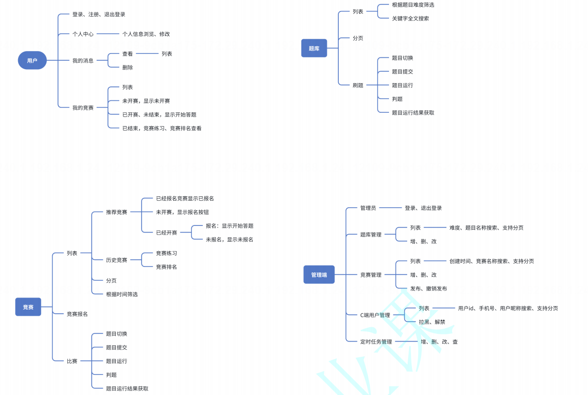
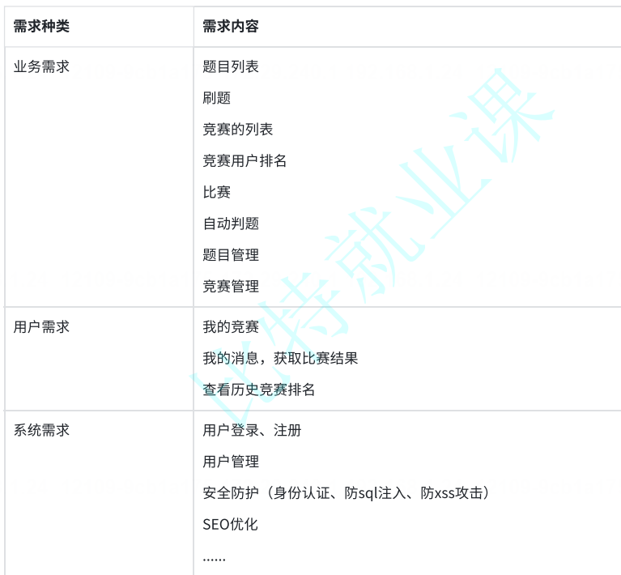

# 在线oj项⽬-开场

代码 & 板书链接

后端代码：https://gitee.com/Ant_o_liu/bite-oj

课堂板书：https://gitee.com/Ant_o_liu/bite-oj/tree/master/%E6%9D%BF%E4%B9%A6

前端代码：https://gitee.com/Ant_o_liu/oj-fe-b （管理端）

比特就业课https://gitee.com/Ant_o_liu/oj-fe-c （⽤⼾端）

## 为什么要做项⽬

⽅向⽐速度更重要，清晰度⽐忙碌更重要。

- 同学的想法：

  按照课程的安排到该上项⽬了

​	别⼈都在做项⽬

​	简历上好像少点什么

​	没项⽬简历筛选不过

​	⾯试的时候⾯试官要问

- 真实作⽤：

​	⾯试官要问，这个想法没有问题。但是为什么要问呢。

​	考察你的实战能⼒，你到底是理论派还是实战派。⾯试官在问了⼀些⼋股⽂之后，初步了解你的基础知识和回答技巧后，他们更希望从项⽬中看到你的真实能⼒和对知识的灵活运⽤，⽽⾮单纯的背诵。此外，项⽬也展现了你在⾯对问题和需求时的思考⽅式及解决问题的能⼒。⾯试官⼀般会就你的项⽬再提出⼀些问题，或者扩展需求。以此来评估你如何有效应对和设计解决⽅案。

- 常⻅问题：

​	你这⾥的处理可能会引发XXXbug，那么你想想要怎么处理。有时候你回答不上来⾯试官也会做⼀些引导，看你是否会有⼀些⾃⼰的想法。我现在有个XXX需求，在你的项⽬中你要怎么满⾜我的需求。你的XX表结构如何设计的，你的缓存如何设计的，为什么要这么设计，这么设计的话如果需求发⽣xx变化你要怎么处理？针对于你使⽤的某个组件，问⼀些问题。例如：你是怎么使⽤redis的，为什么要⽤它，缓存⼀致性是怎么保证的，内存维护使⽤怎样的⽅案......

​	......

- 不要陷⼊误区

​	有⼀些同学可能认为在项⽬中使⽤的技术数量越多，⾯试的成功率就越⾼。确实，技术的积累对于技术的提⾼是⾮常有益的，尤其在刚开始学习编程的阶段。所以在我们这节项⽬课程中，我们也应⽤了⼴泛的技术。然⽽，我们必须⾯对⼀个现实的问题：在有限的时间内，我们⽆法深⼊学习和理解所有的技术，也⽆法实现所有能想到的功能。当⾯试官询问到你没有涉及过的技术或功能时，你如果之前知识⼀味的追求学习的数量，此时你⼀定很难回答出来。

​	我想告诉同学们，⾯试官其实更关⼼的是你的思考和解决问题的能⼒。如果你能够运⽤你所学的知识，清晰地解释和应对⼀个你从未接触过的领域，即使你的解决⽅案不是业界最优的，你也⼀定能够得到⾯试官的认可。

​	因此，我们的项⽬课程设计旨在启发同学们的思考，帮助⼤家真正实现学以致⽤，达到⼀通百通的效果。我们⿎励⼤家不断思考、探索和创新，以提升⾃⼰的综合素质和竞争⼒。

- 总结：

​	项⽬的作⽤在于全⾯展现你的实战能⼒、问题处理及思考能⼒。确保⾯试官对你完成交付任务的能⼒充满信⼼。即便遇到挑战，你也能积极应对，推动项⽬向前发展

# 在线oj项⽬-安装教程

# 在线oj项⽬-产品需求

项⽬开发步骤

- ⽴项阶段：项⽬定义、需求收集与分析、可⾏性分析、⻛险评估与规划、项⽬团队组建、制定项⽬计划、获取批准与⽀持。

- 需求评审与分析：

  - 项⽬团队（包括产品经理、开发⼈员、测试⼈员等）共同参与，明确项⽬的⽬标、功能需求、⽤⼾体验等。
  - 产出物为《需求规格说明书》或《产品需求⽂档》。（产品经理最终交付）

- 技术选型与架构设计

  - 根据项⽬需求，设计系统的整体架构，选择合适的技术栈。

  - 架构师或技术负责⼈进⾏主导。

- 接⼝定义与⽂档编写：
  - 后端开发⼈员定义API接⼝，包括接⼝地址、请求⽅法、请求参数、响应数据、错误码等。
  - 编写接⼝⽂档，供前端开发⼈员使⽤，确保前后端对接⼝有统⼀的理解。（⼀般会组织简短会议讨论，后端主导）
  - 所有接⼝⻛格统⼀，促进效率。

- 后端开发、前端开发：

  - 前端和后端开发⼈员分别根据接⼝⽂档和技术选型，进⾏开发。

  - 这个过程理想情况，前后端是互不⼲扰独⽴开发的所以接⼝⽂档⼀定要保证⾼质量，但是遇到问题⼀定是随时沟通。

- 前后端联调：

  - 后端同学开发完⼀部分接⼝后，可将接⼝部署到开发环境。和前端同学配合联调

  - 联调⼯作⼀般由前端同学主导，后端同学配合调整和修改。

  - 联调过程中，后端同学可分出⼀部分精⼒完成其它⼯作。但要确保提供联调接⼝的可靠性。

  - 前后端开发⼈员配合进⾏接⼝联调，确保前后端数据交互⽆误。

- 测试

  - 前后端同学分别将前后端系统部署到测试环境。

  - 测试团队进⾏功能测试、性能测试、兼容性测试等，确保系统的质量和稳定性。

- 问题修复与优化：

  - 根据测试结果，修复发现的问题，优化系统性能和⽤⼾体验。

  - 可能涉及前后端代码的修改和调整。

- 部署与上线：

  - 将项⽬部署到⽣产环境，配置服务器、数据库等。

  - 进⾏上线前的最终测试，确保系统能够稳定运⾏。

- 维护与迭代：

  - 项⽬上线后，进⾏⽇常的维护和监控，确保系统的安全和稳定运⾏。

  - 根据⽤⼾反馈和市场需求，进⾏功能迭代和优化。

- 总结：

​	这就是软件开发的基本步骤，实际⽣产开发中有时也会做出调整。在整个开发过程中，前后端开发⼈员需要保持密切的沟通与协作，确保项⽬的顺利进⾏。同时，项⽬团队也需要定期召开会议，同步项⽬进度、问题和需求变更，确保项⽬能够按时交付

