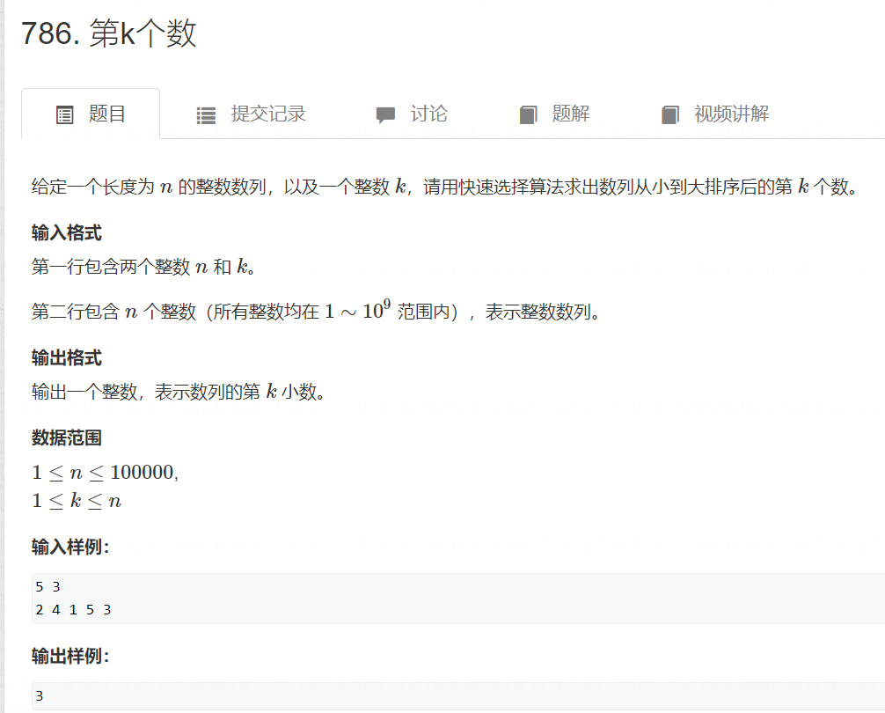

# 学习秘诀：上课学习思想，下课背模板、用例题刷模板


学习算法的基石思路。

## 如何提高熟练度：一道题刷3-5遍

# 一、快速排序

## 思想：分治

1. 随机找一个值，作为分界点：①取左边界 ②取中间值 ③右边界 ④随机
2. 让小于等于x的在x左边，大于等于x的在x的右边（方法一：创建两个额外数组 方法二：模板）
3. 递归处理左右两端


## 1. 快速排序例题,时间复杂度O(nlogn)


思想：小于x的放在左边，大于x的放在右边，等于x的放在左右两侧都可

关键：区间划分的时候，以i还是j为分界点
就看i和j停止时，所指向的数字，是大于x还是小于x

[原题链接](https://www.acwing.com/activity/content/problem/content/819/)

```cpp
#include <iostream>

using namespace std;

const int N = 100010;

int q[N];

void quick_sort(int q[], int l, int r)
{
    if (l >= r) return;

    int i = l - 1, j = r + 1, x = q[l + r >> 1];
    while (i < j)
    {
        do i ++ ; while (q[i] < x);
        do j -- ; while (q[j] > x);
        if (i < j) swap(q[i], q[j]);
    }

    quick_sort(q, l, j);
    quick_sort(q, j + 1, r);
}

int main()
{
    int n;
    scanf("%d", &n);

    for (int i = 0; i < n; i ++ ) scanf("%d", &q[i]);

    quick_sort(q, 0, n - 1);

    for (int i = 0; i < n; i ++ ) printf("%d ", q[i]);

    return 0;
}


```


```java
import java.util.*;

class Main {
    
    static int N = (int)1e5+10;
    static int[] nums = new int[N];
    
    public static void main(String[] args) {
        
        Scanner scan = new Scanner(System.in);
        int n = scan.nextInt();
        for (int i = 1; i <= n; i++) {
            nums[i] = scan.nextInt();
        }
        
        quickSort(1, n);
        
        for (int i = 1; i <= n; i++) {
            System.out.print(nums[i] + " ");
        }
    }
    
    private static void quickSort(int l, int r) {
        if (l >= r) {
            return;
        }
        
        int i = l-1, j = r+1;
        int x = nums[l+r >> 1];
        while (i < j) {
            do i++; while(nums[i] < x);
            do j--; while(nums[j] > x);
            if (i < j) {
                int t = nums[i];
                nums[i] = nums[j];
                nums[j] = t;
            }
        }
        quickSort(l, j);
        quickSort(j+1, r);
    }
}
```
```python3
def quick_sort(nums, l, r):
    if l >= r:
        return
    
    i, j = l-1, r+1
    x = nums[int((i+j) / 2)]
    while i < j:
        i+=1
        while nums[i] < x:
            i+=1
        j-=1
        while nums[j] > x:
            j-=1
        if i < j:
            nums[i], nums[j] = nums[j], nums[i]
    
    quick_sort(nums, l, j)
    quick_sort(nums, j+1, r)

n = int(input())
nums = [int(i) for i in input().split()]

quick_sort(nums, 0, n-1)

for i in range(n):
     print(nums[i], end=" ")
```


## 2. 第k个数( 快速选择 )时间复杂度(O(N))


[原题链接](https://www.acwing.com/activity/content/problem/content/820/)

```cpp
#include <iostream>

using namespace std;

const int N = 100010;

int q[N];

int quick_sort(int q[], int l, int r, int k)
{
    if (l >= r) return q[l];

    int i = l - 1, j = r + 1, x = q[l + r >> 1];
    while (i < j)
    {
        do i ++ ; while (q[i] < x);
        do j -- ; while (q[j] > x);
        if (i < j) swap(q[i], q[j]);
    }

    if (j - l + 1 >= k) return quick_sort(q, l, j, k);
    else return quick_sort(q, j + 1, r, k - (j - l + 1));
}

int main()
{
    int n, k;
    scanf("%d%d", &n, &k);

    for (int i = 0; i < n; i ++ ) scanf("%d", &q[i]);

    cout << quick_sort(q, 0, n - 1, k) << endl;

    return 0;
}

```


```java
import java.util.*;

class Main {
    
    static int N = (int)1e5+10;
    static int[] nums = new int[N];
    static int k;
    
    public static void main(String[] args) {
        
        k = 0;
        Scanner scan = new Scanner(System.in);
        
        int n = scan.nextInt();
        k = scan.nextInt();
        for (int i = 1; i <= n; i++) {
            nums[i] = scan.nextInt();
        }
        
        System.out.print(quickSortFindKth(1, n));
    }
    
    private static int quickSortFindKth(int l, int r) {
        if (l >= r) {
            return nums[l];
        }
        
        int i = l-1, j = r+1;
        int x = nums[i+j >> 1];
        while (i < j) {
            do i++; while (nums[i] < x);
            do j--; while (nums[j] > x);
            if (i < j) {
                int t = nums[i];
                nums[i] = nums[j];
                nums[j] = t;
            }
        }
        if (j >= k) {
            return quickSortFindKth(l, j);
        } else {
            return quickSortFindKth(j+1, r);
        }
    }
    
}
```
```python

def quick_sort_find_Kth(nums, l, r, k):
    if l >= r:
        print(nums[l])
        return
    
    i, j = l-1, r+1
    x = nums[(l+r)//2]
    while i < j:
        i += 1
        while nums[i] < x:
            i += 1
        j -= 1
        while nums[j] > x:
            j -= 1
        if i < j:
            nums[i], nums[j] = nums[j], nums[i]
    
    if k > j:
        quick_sort_find_Kth(nums, j+1, r, k)
    else:
        quick_sort_find_Kth(nums, l, j, k)
        

n, k = map(int, input().split())
nums = list(map(int, input().split()))

quick_sort_find_Kth(nums, 0, n-1, k-1)
```


# 二、归并排序

## 思想：

1. 确定分界点：mid = l+r >> 1
2. 递归
3. 归并

时间复杂度 nlogn

## 1. 归并排序模板题 O（nlogn）

[原题链接](https://www.acwing.com/activity/content/problem/content/821/)

```java
import java.util.*;

class Main {
    
    static int N = (int)1e5+10;
    static int[] nums = new int[N];
    static int[] temps = new int[N];
    
    public static void main(String[] args) {
        
        Scanner scan = new Scanner(System.in);
        int n = scan.nextInt();
        for (int i = 1; i <= n; i++) {
            nums[i] = scan.nextInt();
        }
        
        mergeSort(1, n);
        
        for (int i = 1; i <= n; i++) {
            System.out.print(nums[i] + " ");
        }
        
    }
    
    private static void mergeSort(int l, int r) {
        if (l >= r) {
            return;
        }
        
        int mid = l+r >> 1;
        mergeSort(l, mid);
        mergeSort(mid+1, r);
        
        int i = l, j = mid+1;
        int k = l;
        while (i <= mid && j <= r) {
            if (nums[i] <= nums[j]) {
                temps[k++] = nums[i++];
            } else {
                temps[k++] = nums[j++];
            }
        }
        while (i <= mid) {
            temps[k++] = nums[i++];
        }
        while (j <= r) {
            temps[k++] = nums[j++];
        }
        
        for (k = l; k <= r; k++) {
            nums[k] = temps[k];
        }
        
    }
    
}
```
```python

def merge_sort(nums, l, r):
    if l >= r:
        return
    
    mid = (l+r)//2
    merge_sort(nums, l, mid)
    merge_sort(nums, mid+1, r)
    
    temps = []
    i, j = l, mid+1
    while (i <= mid) and (j <= r):
        if nums[i] <= nums[j]:
            temps.append(nums[i])
            i += 1
        else:
            temps.append(nums[j])
            j += 1
    
    temps += nums[i:mid+1]
    temps += nums[j:r+1]
    
    nums[l:r+1] = temps
    
    

n = int(input())
nums = list(map(int, input().split()))

merge_sort(nums, 0, n-1)

for i in nums:
    print(i, end = ' ')
```


## 2. 逆序对的数量 O（nlogn）

> 需要longlong

[原题链接](https://www.acwing.com/activity/content/problem/content/822/)


```java
import java.util.*;

class Main {
    
    static int N = (int)1e5+10;
    static int[] nums = new int[N];
    static int[] temps = new int[N];
    static long sum;
    
    public static void main(String[] args) {
        
        sum = 0;
        Scanner scan = new Scanner(System.in);
        
        int n = scan.nextInt();
        for (int i = 1; i <= n; i++) {
            nums[i] = scan.nextInt();
        }
        
        mergeSortCalReversePairs(1, n);
        
        System.out.print(sum);
    }
    
    private static void mergeSortCalReversePairs(int l, int r) {
        if (l >= r) {
            return;
        }
        
        int mid = l+r >> 1;
        mergeSortCalReversePairs(l, mid);
        mergeSortCalReversePairs(mid+1, r);
        
        int i = l, j = mid+1;
        int k = l;
        while (i <= mid && j <= r) {
            if (nums[i] <= nums[j]) {
                temps[k++] = nums[i++];
            } else {
                temps[k++] = nums[j++];
                sum += mid+1-i;
            }
        }
        while (i <= mid) {
            temps[k++] = nums[i++];
        }
        while (j <= r) {
            temps[k++] = nums[j++];
        }
        for (k = l; k <= r; k++) {
            nums[k] = temps[k];
        }
    }
    
    
    
}
```

```python

def merge_sort_cal_reversepair(nums, l, r):
    if l >= r:
        return
    
    mid = l+r >> 1
    merge_sort_cal_reversepair(nums, l, mid)
    merge_sort_cal_reversepair(nums, mid+1, r)
    
    temps = []
    i, j = l, mid+1
    while (i <= mid) and (j <= r):
        if nums[i] <= nums[j]:
            temps.append(nums[i])
            i += 1
        else :
            temps.append(nums[j])
            j += 1
            global sum
            sum += mid-i+1
    temps.extend(nums[i:mid+1])
    temps.extend(nums[j:r+1])
    
    nums[l:r+1] = temps
    

n = int(input())
nums = list(map(int, input().split()))

sum = 0
merge_sort_cal_reversepair(nums, 0, n-1)
print(sum)

```


# 三、二分

## 本质：区间一分为二，左边和右边分别满足和不满足 的一个条件


## 1. 数的范围 O（logn）


[原题链接](https://www.acwing.com/activity/content/problem/content/823/)

```java
import java.util.*;

class Main {
    
    static int N = (int)1e5+10;
    static int[] nums = new int[N];
    
    public static void main(String[] args) {
        
        Scanner scan = new Scanner(System.in);
        int n = scan.nextInt();
        int q = scan.nextInt();
        for (int i = 1; i <= n; i++) {
            nums[i] = scan.nextInt();
        }
        
        while (q-- != 0) {
            
            int k = scan.nextInt();
            
            int l = 1, r = n;
            while (l < r) {
                int mid = l+r >> 1;
                if (nums[mid] >= k) {
                    r = mid;
                } else {
                    l = mid + 1;
                }
            }
            
            if (nums[l] == k) {
                System.out.print(l-1 + " ");
                l = 1; r = n;
                while (l < r) {
                    int mid = l+r+1 >> 1;
                    if (nums[mid] <= k) {
                        l = mid;
                    } else {
                        r = mid-1;
                    }
                }
                System.out.println(l);
            } else {
                System.out.println(-1 + " " + -1);
            }
            
        }
        
    }
    
}
```

```python

n, q = map(int, input().split())
nums = list(map(int, input().split()))

while q != 0:
    q -= 1
    k = int(input())
    
    i, j = 0, n-1
    while i < j:
        mid = i+j >> 1
        if nums[mid] >= k:
            j = mid
        else:
            i = mid+1
    if nums[j] == k:
        print(i, end = ' ')
        i, j = 0, n-1
        while i < j:
            mid = i+j+1 >> 1
            if nums[mid] <= k:
                i = mid
            else:
                j = mid-1
        print(i)
    else:
        print("-1 -1")
```


## 2. 数的三次方根

注意：

1. 取得精确度比输出保留数 多2

[原题链接](https://www.acwing.com/activity/content/problem/content/824/)


```java
import java.util.*;

public class Main {
    public static void main (String[] args) {
        Scanner scanner = new Scanner(System.in);
        double n = scanner.nextDouble();
        double l = (double)-1e5;
        double r = 1e5*1.0;
        while (r - l > 1e-8) {
            double mid = (l+r)/2;
            if (mid * mid * mid <= n) {
                l = mid;
            } else {
                r = mid;
            }
        }
        System.out.printf("%.6f",l);
    }
}
```
```python

n = float(input())

l, r = -100.0, 100.0

while r-l >= 1e-8:
    mid = (l+r)/2
    if mid*mid*mid <= n:
        l = mid
    else:
        r = mid
print("{:.6f}".format(l))
```


# 四、高精度

思想：

1. 小位存在数组前面还是后面？前面
2. int的最大范围是10^9^ 十亿

## 1. 高精度加法

[原题链接](https://www.acwing.com/activity/content/problem/content/825/)
```java
import java.io.BufferedInputStream;
import java.math.BigInteger;
import java.util.Scanner;

public class Main {

    public static void main(String[] args) {
        Scanner scanner = new Scanner(System.in);
        BigInteger a = scanner.nextBigInteger();
        BigInteger b = scanner.nextBigInteger();
        System.out.println(a.add(b));
        scanner.close();
    }

}
```

```cpp
import java.util.ArrayList;
import java.util.List;
import java.util.Scanner;

public class Main {
    public static void main(String[] args) {
        Scanner scanner = new Scanner(System.in);
        String s1 = scanner.next();
        String s2 = scanner.next();
        List<Integer> A = new ArrayList<>(s1.length());
        List<Integer> B = new ArrayList<>(s2.length());
        for (int i = s1.length() - 1; i >= 0; i--) A.add(s1.charAt(i) - '0');
        for (int i = s2.length() - 1; i >= 0; i--) B.add(s2.charAt(i) - '0');
        List<Integer> C = add(A, B);
        for (int i = C.size() - 1; i >= 0; i--) System.out.printf(C.get(i) + "");
    }

    private static List<Integer> add(List<Integer> A, List<Integer> B) {
        List<Integer>C=new ArrayList<>(Math.max(A.size(),B.size())+2);
        int t=0;
        for(int i=0;i<A.size() || i<B.size();i++){
            if(i<A.size())t+=A.get(i);
            if(i<B.size())t+=B.get(i);
            C.add(t%10);
            t/=10;
        }
        if(t!=0) C.add(t);
        return C;
    }
}
```
```python

def add(A, B):
    C = []
    t = 0
    for i in range(max(len(A), len(B))):
        if i < len(A):
            t += A[i]
        if i < len(B):
            t += B[i]
        C.append(t%10)
        t = t//10
    if t > 0:
        C.append(t)
    return C

a = input()
b = input()

A = []
B = []

for ch in a[::-1]:
    A.append(int(ch)-int('0'))
for ch in b[::-1]:
    B.append(int(ch)-int('0'))
    
C = add(A, B)

for x in C[::-1]:
    print(x, end = '')

```


## 2. 高精度减法

思路：

1. 先判断A和B谁大
2. 是否接1，用一个标志位记录就行

[原题链接](https://www.acwing.com/activity/content/problem/content/826/)


```java
import java.io.*;
import java.math.BigInteger;

public class Main {

    public static void main(String[] args) throws IOException{
        BufferedReader reader = new BufferedReader(new InputStreamReader(System.in));
        BigInteger a = new BigInteger(reader.readLine());
        BigInteger b = new BigInteger(reader.readLine());
        System.out.println(a.subtract(b));
        reader.close();
    }
}
```

```java
import java.util.Scanner;
import java.util.List;
import java.util.ArrayList;

public class Main{
    public static void main(String[] args){
        Scanner scanner = new Scanner(System.in);
        String s1 = scanner.next();
        String s2 = scanner.next();
        List<Integer> A = new ArrayList<>();
        List<Integer> B = new ArrayList<>();
        for(int i = s1.length() - 1;i >= 0;i --) A.add(s1.charAt(i) - '0');
        for(int i = s2.length() - 1;i  >= 0; i --) B.add(s2.charAt(i) - '0');
        if(!cmp(A,B)){
            System.out.print("-");
        }
        List<Integer> C = sub(A,B);
        for(int i = C.size() - 1;i >= 0; i --){
            System.out.print(C.get(i));
        }


    }
    public static List<Integer> sub(List<Integer> A,List<Integer> B){
        if(!cmp(A,B)){
            return sub(B,A);
        }

        List<Integer> C = new ArrayList<>();
        int t = 0;
        for(int i = 0;i < A.size();i ++){
            //这里应该是A.get(i) - B.get(i) - t ，因为可能B为零，所以需要判断一下是不是存在
            t = A.get(i) - t;
            if(i < B.size()) t -= B.get(i);
            C.add((t + 10) % 10);

            if(t < 0) t = 1;
            else t = 0;
        }
        //删除指定下标下面的值
        while(C.size() > 1 && C.get(C.size() - 1) == 0)  C.remove(C.size() - 1);

        return C;
    }
    public static boolean cmp(List<Integer> A,List<Integer> B){
        if(A.size() != B.size()) return A.size() > B.size();
       /* if(A.size() >= B.size()){
            return true;
        }else{
            return false;
        }
        */
        for(int i = A.size() - 1;i >= 0;i --){
            if(A.get(i) != B.get(i)) {
                return A.get(i) > B.get(i);
            }
        }
        return true;
    }
}
```

```python

def sub(A, B):
    t = 0
    C = []
    for i in range(len(A)):
        t = A[i] - t
        if i < len(B):
            t = t - B[i]
        C.append((t+10)%10)
        if t < 0:
            t = 1
        else:
            t = 0
    while (len(C) > 1) and (C[len(C)-1] == 0):
        del C[len(C)-1]
    return C

def AIsBiggerThanOrEqualTo(A, B):
    if len(A) > len(B):
        return True
    if len(A) < len(B):
        return False
    for i in range(len(A)-1,-1,-1):
        if A[i] > B[i]:
            return True
        elif A[i] < B[i]:
            return False
    return True

a = input()
b = input()

A = []
B = []
for ch in a[::-1]:
    A.append(int(ch)-int('0'))
for ch in b[::-1]:
    B.append(int(ch)-int('0'))
    
if AIsBiggerThanOrEqualTo(A, B):
    C = sub(A, B)
else:
    C = sub(B, A)
    print('-', end = '')
    
for x in C[::-1]:
    print(x, end = '')

```


## 3. 高精度乘法

思路：

1. t = t + A[i] * B

[原题链接](https://www.acwing.com/activity/content/problem/content/827/)


```java
import java.util.*;

public class Main {
    public static void main (String[] args) {
        Scanner scanner = new Scanner(System.in);
        String a = scanner.next();
        int b = scanner.nextInt();
        List<Integer> A = new ArrayList<>(a.length());
        for (int i = a.length()-1; i >= 0; i--) A.add(a.charAt(i) - '0');
        List<Integer> C = mul(A,b);
        for (int i = C.size()-1; i >= 0; i--) System.out.print(C.get(i));
    }
    
    public static List<Integer> mul (List<Integer> A,int b) {
        List<Integer> C = new ArrayList<>(A.size());
        int t = 0;
        for (int i = 0; i < A.size(); i++) {
            t = t + A.get(i)*b;
            C.add(t%10);
            t /= 10;
        }
        while (t != 0) {
            C.add(t%10);
            t /= 10;
        }
        while (C.size() > 1 && C.get(C.size()-1) == 0) {
            C.remove(C.size() - 1);
        }
        return C;
    }
}
```
```python

def mul(A, B):
    C = []
    t = 0
    for i in range(len(A)):
        t = t + A[i]*B
        C.append(t%10)
        t = t//10
    while t != 0:
        C.append(t%10)
        t = t // 10
    while (len(C) > 1) and (C[len(C)-1] == 0):
        del C[len(C)-1]
    return C
        

a = input()
B = int(input())

A = []
for ch in a[::-1]:
    A.append(int(ch)-int('0'))
    
C = mul(A, B)

for x in C[::-1]:
    print(x, end = '')
```


## 4. 高精度除法

[原题链接](https://www.acwing.com/activity/content/problem/content/828/)


```java
import java.util.*;

class Main {
    
    public static void main(String[] args) {
        
        Scanner scan = new Scanner(System.in);
        String a = scan.nextLine();
        int b = scan.nextInt();
        
        ArrayList<Integer> A = new ArrayList<Integer>();
        for (int i = 0; i < a.length(); i++) {
            A.add(a.charAt(i)-'0');
        }
        
        ArrayList<Integer> C = div(A, b);
    }
        
    private static ArrayList<Integer> div(ArrayList<Integer> A, int b) {
        
        ArrayList<Integer> C = new ArrayList<Integer>();
        
        int t = 0;
        
        for (int i = 0; i < A.size(); i++) {
            t = t * 10 + A.get(i);
            if (t / b > 0) {
                C.add(t / b);
                t = t % b;
            } else {
                C.add(0);
            }
        }
        while (C.size() > 1 && C.get(0) == 0) C.remove(0);
        
        for (int i = 0; i < C.size(); i++) {
            System.out.print(C.get(i));
        }
        System.out.println();
        System.out.print(t);
        return C;
    }
    
}
```
```python

def div(A, B):
    C = []
    t = 0
    for i in range(len(A)):
        t = t*10 + A[i]
        C.append(t//B)
        t = t % B
    while (len(C) > 1) and (C[0] == 0):
        del C[0]
    for x in C:
        print(x, end = '')
    print()
    print(t)

a = input()
B = int(input())

A = []
for ch in a:
    A.append(int(ch)-int('0'))

div(A, B)
```


# 五、前缀和S与差分a

## 1. 前缀和
[原题链接](https://www.acwing.com/activity/content/problem/content/829/)


```java
import java.util.*;

public class Main {
    public static void main (String[] args) {
        Scanner scanner = new Scanner(System.in);
        int n = scanner.nextInt();
        int m = scanner.nextInt();
        int[] a = new int[n+1];
        int[] s = new int[n+1];
        for (int i = 1; i <= n; i++) { a[i] = scanner.nextInt(); }
        s[1] = a[1];
        for (int i = 2; i <= n; i++) {
            s[i] = a[i] + s[i-1];
        }
        while (m-- != 0) {
            int l = scanner.nextInt();
            int r = scanner.nextInt();
            System.out.println(s[r]-s[l-1]);
        }
    }
}
```
## 2. 子矩阵的和
[原题链接](https://www.acwing.com/activity/content/problem/content/830/)


```java
import java.util.*;

class Main {
    
    static int N = 1010;
    static int[][] nums = new int[N][N];
    
    public static void main(String[] args) {
        
        Scanner scan = new Scanner(System.in);
        
        int l = scan.nextInt();
        int r = scan.nextInt();
        int q = scan.nextInt();
        
        for (int i = 1; i <= l; i++) {
            for (int j = 1; j <= r; j++) {
                nums[i][j] = scan.nextInt();
                nums[i][j] = nums[i][j] + nums[i][j-1] + nums[i-1][j] - nums[i-1][j-1];
            }
        }
        
        for (int i = 0; i < q; i++) {
            int x1 = scan.nextInt();
            int y1 = scan.nextInt();
            int x2 = scan.nextInt();
            int y2 = scan.nextInt();
            System.out.println(nums[x2][y2] - nums[x2][y1-1] - nums[x1-1][y2] + nums[x1-1][y1-1]);
        }
        
    }
    
}
```

## 3. 差分


如何构造差分？

- 方法一：Sn = Sn-1 + an
- 方法二：根据insert(l,r,x)插入差分的逻辑，插入(i,i,ai)，这样构造出来的bi，其实和方法一构造出来的数值一样。


>1. 由差分求s时，是要有数据连续性的，前面的改变了，要保证对应后面的也跟着


[原题链接](https://www.acwing.com/activity/content/problem/content/831/)

```java
import java.util.*;

public class Main {
    public static void main (String[] args) {
        Scanner scanner = new Scanner(System.in);
        int n = scanner.nextInt();
        int m = scanner.nextInt();
        int[] nums = new int[n+2];
        for (int i = 1; i <= n; i++) {
            nums[i] = scanner.nextInt();
        }
        for (int i = n; i >= 1; i--) {
            nums[i] = nums[i]-nums[i-1];
        }
        for (int i = 0; i < m; i++) {
            int l = scanner.nextInt();
            int r = scanner.nextInt();
            int c = scanner.nextInt();
            nums[l] += c;
            nums[r+1] -= c;
        }
        for (int i = 1; i <= n; i++) {
            nums[i] += nums[i-1];
            System.out.printf("%d ",nums[i]);
        }
    }
}
```

```python
def insert(l, r, c):
    a[l] += c
    a[r+1] -= c

n, m = map(int, input().split())
s = [0] + list(map(int, input().split()))

a = [0]*(n+2)

for i in range(1,n+1):
    insert(i, i, s[i])
    
for i in range(m):
    l, r, c = map(int, input().split())
    insert(l, r, c)

for i in range(1, n+1):
    s[i] = s[i-1] + a[i]
    print(s[i], end = ' ')    
```


## 4. 差分矩阵

[原题链接](https://www.acwing.com/activity/content/problem/content/832/)


```java
import java.util.*;

public class Main {
    public static void main (String[] args) {
        Scanner scanner = new Scanner(System.in);
        int n = scanner.nextInt();
        int m = scanner.nextInt();
        int q = scanner.nextInt();
        int[][] splits = new int[n+2][m+2];
        int[][] sum = new int[n+2][m+2];
        for (int i = 1; i <= n; i++) {
            for(int j = 1; j <= m; j++) {
                sum[i][j] = scanner.nextInt();
                splits[i][j] = sum[i][j] - sum[i-1][j] - sum[i][j-1] + sum[i-1][j-1];
            }
        }
        for (int i = 0; i < q; i++) {
            int x1 = scanner.nextInt();
            int y1 = scanner.nextInt();
            int x2 = scanner.nextInt();
            int y2 = scanner.nextInt();
            int c = scanner.nextInt();
            splits[x1][y1] += c;
            splits[x1][y2+1] -= c;
            splits[x2+1][y1] -= c;
            splits[x2+1][y2+1] += c;
        }
        for (int i = 1; i <= n; i++) {
            for (int j = 1; j <= m; j++) {
                sum[i][j] = splits[i][j] + sum[i-1][j] + sum[i][j-1] - sum[i-1][j-1];
                System.out.print(sum[i][j] + " ");
            }
            System.out.println();
        }
    }
}
```
# 六、双指针


## 1. 最长连续不重复子序列 （时间复杂度O(n)）


[原题链接](https://www.acwing.com/activity/content/problem/content/833/)

```java
import java.util.Scanner;
public class Main {
    public static void main(String[] args){
        Scanner scan = new Scanner(System.in);
        int n = scan.nextInt();
        int[] a = new int[100010];
        int[] s = new int[100010];
        for(int i = 0 ; i < n ; i ++ ){
            a[i] = scan.nextInt();
        }
        int res = 0;
        for(int i = 0 , j = 0 ;i < n ; i ++ ){
            //比如一开始S[2]是0；然后你的a[1] = 2;那么s[2] = 1;
            //然后如果a[2] = 2 ;那么第二次出现所以s[2] = 2;这样来证明是不是出现两次
            s[a[i]] ++ ;
            while(j < i && s[a[i]] > 1){
                //一开始j是跟i在同个位置，i在移动，j原地不动，只要上面出现两次，j开始移动
                //j移动到i的位置，下面的代码就是i走过的路，让s[i] 数组里面加1的位置全部减1，就变回0；所以就继续往下统计长度
                s[a[j]] -- ;
                j++;
            }
            //i-j+1是统计长度的公式；
            res = Math.max(res, i-j+1);
        }
        System.out.println(res);
    }
}

//这里填你的代码^^
//注意代码要放在两组三个点之间，才可以正确显示代码高亮哦~
```

## 2.  数组元素的目标和


[原题链接](https://www.acwing.com/activity/content/problem/content/834/)

```java
import java.util.*;

public class Main {
    public static void main(String[] args) {
        Scanner scanner = new Scanner(System.in);
        int n = scanner.nextInt();
        int m = scanner.nextInt();
        int x = scanner.nextInt();
        int[] A = new int[n+1];
        int[] B = new int[m+1];
        for (int i = 0; i < n; i++) A[i] = scanner.nextInt();
        for (int i = 0; i < m; i++) B[i] = scanner.nextInt();
        for (int i = 0,j = m-1; i < n && j >= 0;) {
            if (A[i] + B[j] < x) {
                i++;
            } else if (A[i] + B[j] == x) {
                System.out.print(i + " " + j);
                break;
            } else {
                j--;
            }
        }
    }
}
```

## 3. 判断子序列


[原题链接](https://www.acwing.com/activity/content/problem/content/2981/)

```java
import java.util.*;

public class Main {
    public static void main(String[] args) {
        Scanner scanner = new Scanner(System.in);
        int n = scanner.nextInt();
        int m = scanner.nextInt();
        int[] a = new int[n+1];
        int[] b = new int[m+1];
        for (int i = 0; i < n; i++) a[i] = scanner.nextInt();
        for (int j = 0; j < m; j++) b[j] = scanner.nextInt();
        boolean flag = false;
        for (int i = 0,j = 0; j < m; j++) {
            if (a[i] == b[j]) {
                i++;
                if (i == n) {
                    System.out.print("Yes");
                    flag = true;
                    break;
                }
            }
        }
        if (flag == false) {
            System.out.print("No");
        }
    }
}
```

# 七、二进制
[最全二进制算法总结](https://blog.csdn.net/m0_63571404/article/details/127541302)


## 4. 数组去重（只保留重复的一个）


## 1. 位运算算法

返回n的最后一位1：lowbit(n) = n & -n
一共有多少1 ： while n = n ^（n & -n）或者 n -= n & -n	
[原题链接](https://www.acwing.com/activity/content/problem/content/835/)


```java
import java.util.*;

public class Main {
    public static void main(String[] args) {
        Scanner scanner = new Scanner(System.in);
        int n = scanner.nextInt();
        int[] nums = new int[n];
        for (int i = 0; i < n; i++) {
            nums[i] = scanner.nextInt();
            System.out.print(numberOfOneInBinary(nums[i]) + " ");
        }
    }
    
    public static int numberOfOneInBinary(int num) {
        int cnt = 0;
        while (num != 0) {
            num -= (num & -num);
            cnt++;
        }
        return cnt;
    }
}
```

# 八、离散化


## 1. 区间和


[原题链接](https://www.acwing.com/activity/content/problem/content/836/)

```java
import java.util.*;

class Main {
    
    public static void main(String[] args) {
        
        Scanner scan = new Scanner(System.in);
        int n = scan.nextInt();
        int m = scan.nextInt();
        
        int[][] adds = new int[n][2];
        ArrayList<Integer> alls = new ArrayList<>();
        for (int i = 0; i < n; i++) {
            int x = scan.nextInt();
            int c = scan.nextInt();
            adds[i] = new int[]{x,c};
            alls.add(x);
        }
        
        int[][] querys = new int[m][2];
        for (int i = 0; i < m; i++) {
            int l = scan.nextInt();
            int r = scan.nextInt();
            querys[i] = new int[]{l,r};
            alls.add(l);
            alls.add(r);
        }
        
        alls = new ArrayList<Integer>(new HashSet<Integer>(alls));
        Collections.sort(alls);
        
        int[] cnt = new int[alls.size()+1];
        for (int i = 0; i < n; i++) {
            int[] add = adds[i];
            cnt[find(add[0], alls)] += add[1];
        }
        int[] sum = new int[alls.size() + 1];
        for (int i = 1; i <= alls.size(); i++) {
            sum[i] = sum[i-1] + cnt[i];
        }
        
        for (int i = 0; i < m; i++) {
            int[] query = querys[i];
            System.out.println(sum[find(query[1], alls)] - sum[find(query[0], alls) - 1]);
        }
        
    }
    
    private static int find(int x, ArrayList<Integer> alls) {
        int l = 0, r = alls.size()-1;
        while (l < r) {
            int mid = l+r+1 >> 1;
            if (alls.get(mid) <= x) {
                l = mid;
            } else {
                r = mid-1;
            }
        }
        return l+1;
    }
    
}
```

```python

def find(x):
    l, r = 0, len(alls)-1
    while l < r:
        mid = (l+r+1) >> 1
        if alls[mid] <= x:
            l = mid
        else:
            r = mid-1
    return l+1

n, m = map(int, input().split())

adds = []
alls = []
for i in range(n):
    x, c = map(int, input().split())
    adds.append([x,c])
    alls.append(x)

querys = []
for i in range(m):
    l, r = map(int, input().split())
    querys.append([l,r])
    alls.append(l)
    alls.append(r)

alls = list(set(alls))
alls.sort()


a = [0]*(len(alls)+1)
for add in adds:
    a[find(add[0])] += add[1]

sum = [0]*(len(alls)+1)
for i in range(1, len(alls)+1):
    sum[i] = sum[i-1] + a[i]

for query in querys:
    print(sum[find(query[1])] - sum[find(query[0]) - 1])

    
```


# 九、区间合并

## 1. 区间合并

[原题链接](https://www.acwing.com/activity/content/problem/content/837/)

确定一个区间，模拟另一个区间出现的可能情况，然后遍历处理方案


贪心做法

```java
import java.util.*;

public class Main {
    public static void main(String[] args) {
        Scanner scanner = new Scanner(System.in);
        int n = scanner.nextInt();
        pair[] range = new pair[n];
        for (int i = 0; i < n; i++) {
            range[i] = new pair();
            range[i].l = scanner.nextInt();
            range[i].r = scanner.nextInt();
        }
        Arrays.sort(range,new Comparator<pair>(){
          @Override
          public int compare(pair o1,pair o2) {
              if (o1.l == o2.l) {
                  return o1.r - o2.r;
              } else {
                  return o1.l - o2.l;
              }
          }
        });
        int st = (int)-2e9-1;
        int ed = (int)-2e9-1;
        int cnt = 0;
        for (int i = 0; i < n; i++) {
            if (ed < range[i].l) {
                st = range[i].l;
                ed = range[i].r;
                cnt++;
            } else {
                ed = Math.max(ed,range[i].r);
            }
        }
        System.out.print(cnt);
    }
    
    static class pair {
        int l;
        int r;
    }
    
}
```

```python
n = int(input())
segs = []
for i in range(n):
    l, r = map(int, input().split())
    segs.append([l, r])
segs.sort()

r = -0x3f3f3f3f
cnt = 0
for i in segs:
    if i[0] > r:
        cnt += 1
    if i[1] > r:
        r = i[1]
        
print(cnt)

```

