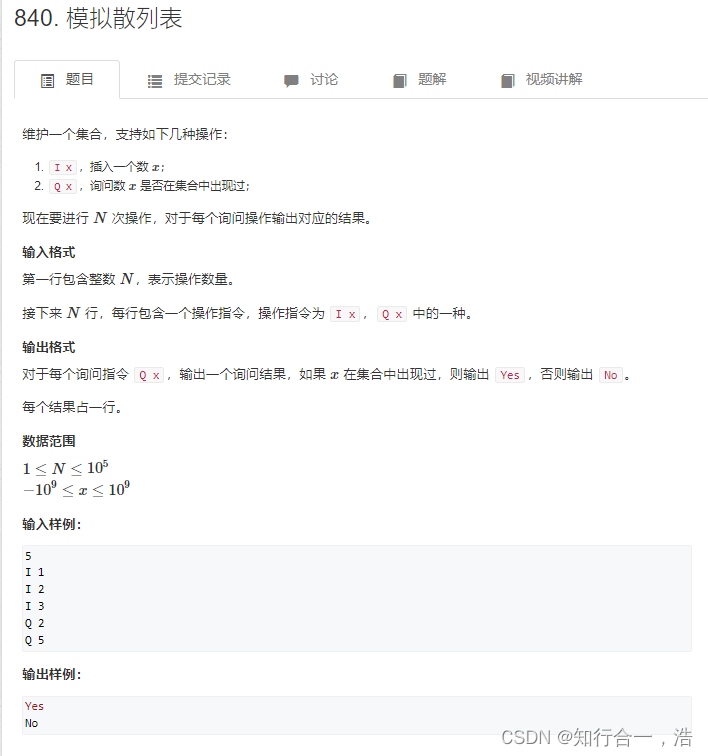

# 1. 单链表模板

## 1. 单链表


[acwing链接](https://www.acwing.com/activity/content/problem/content/863/)
[力扣](https://leetcode.cn/problems/design-linked-list/)
```java
class MyLinkedList {
    int size;
    ListNode head;

    public MyLinkedList() {
        size = 0;
        head = new ListNode(0);
    }

    public int get(int index) {
        if (index < 0 || index >= size) {
            return -1;
        }
        ListNode cur = head;
        for (int i = 0; i <= index; i++) {
            cur = cur.next;
        }
        return cur.val;
    }

    public void addAtHead(int val) {
        addAtIndex(0, val);
    }

    public void addAtTail(int val) {
        addAtIndex(size, val);
    }

    public void addAtIndex(int index, int val) {
        if (index > size) {
            return;
        }
        index = Math.max(0, index);
        size++;
        ListNode pred = head;
        for (int i = 0; i < index; i++) {
            pred = pred.next;
        }
        ListNode toAdd = new ListNode(val);
        toAdd.next = pred.next;
        pred.next = toAdd;
    }

    public void deleteAtIndex(int index) {
        if (index < 0 || index >= size) {
            return;
        }
        size--;
        ListNode pred = head;
        for (int i = 0; i < index; i++) {
            pred = pred.next;
        }
        pred.next = pred.next.next;
    }
}

class ListNode {
    int val;
    ListNode next;

    public ListNode(int val) {
        this.val = val;
    }
}

```
```java
import java.util.*;

public class Main {
    static int[] e = new int[100010];
    static int[] ne = new int[100010];
    static int idx,head;
    public static void init() {
        idx = 0;
        head = -1;
    }
    
    public static void add_head(int x) {
        e[idx] = x;
        ne[idx] = head;
        head = idx++;
    } 
    
    public static void add(int k,int x) {
        e[idx] = x;
        ne[idx] = ne[k];
        ne[k] = idx++;
    }
    
    public static void remove(int k) {
        ne[k] = ne[ne[k]];
    }
    
    public static void main(String[] args) {
        Scanner scan = new Scanner(System.in);
        int m = scan.nextInt();
        init();
        while(m -- > 0){
            String s = scan.next();
            char op = s.charAt(0);
            if(op == 'H'){
                int x = scan.nextInt();
                add_head(x);
            }else if(op == 'D'){
                int k = scan.nextInt();
                if(k == 0) head = ne[head];
                else remove(k-1);
            }else {
                int k = scan.nextInt();
                int x = scan.nextInt();
                add(k-1,x);
            }
        }
        for(int i = head;i != -1;i = ne[i] ){
            System.out.print(e[i] +  " ");
        }
    }
}
```
# 2. 双链表模板

```cpp
void init()
{
    r[0] = 1;
    l[1] = 0;
    idx = 2;
}
```

## 1. 双链表
[原题链接](https://www.acwing.com/activity/content/problem/content/864/)


```java
import java.util.Scanner;
public class Main{
    static int N = 100010;
    static int[] e = new int[N];
    static int[] r = new int[N];
    static int[] l = new int[N];
    static int idx;

    //删除第k位插入的数
    public static void remove(int k){
        r[l[k]] = r[k];
        l[r[k]] = l[k];
    }
    //这是在第k位数后面插入一个数x
    public static void add_all(int k,int x){
        e[idx] = x;
        r[idx] = r[k];
        l[idx] = k;
        l[r[k]] = idx;
        r[k] = idx++;
    }
    public static void main(String[] args){
        Scanner scan = new Scanner(System.in);
        int m = scan.nextInt();

        r[0] = 1;l[1] = 0;idx = 2;

        while(m -- > 0){
            String s = scan.next();
            char op = s.charAt(0);
            if(op == 'L'){
                int x = scan.nextInt();
                add_all(0,x);
            }else if(op == 'R'){
                int x = scan.nextInt();
                add_all(l[1],x);
            }else if(op == 'D'){
                int k = scan.nextInt();
                remove(k + 1);
            }else if(s.equals("IR")){
                int k  = scan.nextInt();
                int x = scan.nextInt();
                add_all(k + 1,x);
            }else {
                int k = scan.nextInt();
                int x = scan.nextInt();
                add_all(l[k+1],x);
            }
        }
       for(int i = r[0];i != 1; i= r[i]){
            System.out.print(e[i]  + " ");
        }
    }
}
```
# 3. 模拟栈

## 1. 模拟栈

思想：画一个坐标


[原题链接](https://www.acwing.com/activity/content/problem/content/865/)


```java
import java.util.Scanner;
public class Main{
    public static void main(String[] args){
        Scanner scan = new Scanner(System.in);
        int m = scan.nextInt();
        int[] stl = new int[100010];
        int tt = 0;

        while(m -- > 0){
            String s = scan.next();
            if(s.equals("push")){
                int x= scan.nextInt();
                stl[++tt] = x;
            }else if(s.equals("pop")){
                tt--;
            }else if(s.equals("empty")){
                if(tt > 0){
                    System.out.println("NO");
                }else System.out.println("YES");
            }else{
                System.out.println(stl[tt]);
            }

        }
    }
} 
```
## 2. 表达式求值
[原题链接](https://www.acwing.com/activity/content/problem/content/3648/)

```java
import java.util.*;
public class Main{
    public static void main(String[] args){
        Scanner scan = new Scanner(System.in);
        //以字符串形式输入表达式
        String s = scan.next();
        //map来添加运算符号进去，定义优先级
        Map<Character,Integer> map = new HashMap<>();
        map.put('+',1);
        map.put('-',1);
        map.put('*',2);
        map.put('/',2);

        Stack<Character> op = new Stack<>();//存运算符号
        Stack<Integer> num = new Stack<>();//存数字

        for(int i = 0 ; i < s.length(); i ++ ){
            char c = s.charAt(i);
            //判断c字符是不是数字
            if(Character.isDigit(c)){
                int x = 0,j = i;
                //数字可能会是多位数，
                while(j < s.length() && Character.isDigit(s.charAt(j))){
                    x = x * 10 + s.charAt(j) - '0';
                    j++;
                }
                num.push(x);//将数字x存入数字栈栈顶
                i = j - 1;//重新赋值i
            }else if(c == '('){
                op.push(c); // 将左括号存入字符栈栈顶
            }else if(c == ')'){
                //如果栈顶不等于左括号，一直计算下去；
                while(op.peek() != '('){
                    eval(op,num);
                }
                op.pop(); // 将左括号弹出栈顶
            }else { //如果是正常字符
                while(!op.empty() && op.peek() != '(' && map.get(op.peek()) >= map.get(c)){
                    eval(op,num);
                }
                op.push(c);
            }
        }
        while(!op.empty()) eval(op,num);
        System.out.println(num.peek());
    }
    public static void eval(Stack<Character> op,Stack<Integer> num){
        int b = num.pop();
        int a = num.pop();

        char c = op.pop();
        if(c == '+'){
           num.push(a+b);
        }else if(c == '-'){
            num.push(a-b);
        }else if(c == '*'){
            num.push(a*b);
        }else {
            num.push(a/b);
        }
    }
}
```

# 4. 队列

##  1. 模拟队列

[原题链接](https://www.acwing.com/activity/content/problem/content/866/)

```java
import java.util.Scanner;
public class Main{
    public static void main(String[] args){
        Scanner scan = new Scanner(System.in);
        int m = scan.nextInt();
        //队列是在tt队尾插入元素，队头hh弹出元素
        int[] dl = new int[100010];
        int hh = 0;
        int tt = -1;
        while(m -- > 0){
            String s = scan.next();
            if(s.equals("push")){
                int x = scan.nextInt();
                dl[++tt] =  x;
            }else if(s.equals("pop")){
                hh++;
            }else if(s.equals("empty")){
                if(hh <= tt) System.out.println("NO");
                else System.out.println("YES");
            }else {
                System.out.println(dl[hh]);
            }
        }
    }
}
```
# 5. 单调栈

```cpp
常见模型：找出每个数左边离它最近的比它大/小的数
int tt = 0;
for (int i = 1; i <= n; i ++ )
{
    while (tt && check(stk[tt], i)) tt -- ;
    stk[ ++ tt] = i;
}
```
## 1. 单调栈
[力扣链接](https://leetcode.cn/problems/bao-han-minhan-shu-de-zhan-lcof/)
[原题链接](https://www.acwing.com/activity/content/problem/content/867/)

[原题链接](https://www.acwing.com/problem/content/832/)

```java
import java.util.*;

public class Main {
    public static void main(String[] args) {
        Scanner scanner = new Scanner(System.in);
        int n = scanner.nextInt();
        int[] nums = new int[n+2];
        int[] st = new int[n+2];
        int tt = 0;
        for (int i = 0; i < n; i++) nums[i] = scanner.nextInt();
        
        for (int i = 0; i < n; i++) {
            while (tt != 0 && st[tt-1] >= nums[i]) {
                tt--;
            }
            if (tt == 0) {
                System.out.print(-1 + " ");
            } else {
                System.out.print(st[tt-1] + " ");
            }
            st[tt++] = nums[i];
        }
    }
}
```

```python

n = int(input())
nums = list(map(int, input().split()))

st = [0]*n
idx = 0

for x in nums:
    while (idx != 0) and (x <= st[idx-1]):
        idx -= 1
    if idx == 0:
        print(-1, end = ' ')
    else:
        print(st[idx-1], end = ' ')
    st[idx] = x
    idx += 1
```


# 6. 单调队列

## 1. 滑动窗口最大值

[力扣链接](https://leetcode.cn/problems/sliding-window-maximum/description/)
[原题链接](https://www.acwing.com/activity/content/problem/content/868/)
[原题链接](https://www.acwing.com/problem/content/156/)


```java
import java.util.*;
import java.io.*;

class Main {
    
    static int N = (int)1e6+10;
    static int[] nums = new int[N];
    static int[] queue = new int[N];
    static int hh, tt;
    
    public static void main(String[] args) throws IOException {
        
        BufferedReader reader = new BufferedReader(new InputStreamReader(System.in));
        PrintWriter print = new PrintWriter(new OutputStreamWriter(System.out));
        
        String[] op = reader.readLine().split(" ");
        int n = Integer.parseInt(op[0]);
        int k = Integer.parseInt(op[1]);
        
        op = reader.readLine().split(" ");
        for (int i = 0; i < n; i++) {
            nums[i] = Integer.parseInt(op[i]);
        }
        
        hh = 0; tt = -1;
        for (int i = 0; i < n; i++) {
            while (tt >= hh && nums[queue[tt]] >= nums[i]) {
                tt--;
            }    
            if (tt >= hh && queue[hh] <= i-k) {
                hh++;
            }
            queue[++tt] = i;
            if (i >= k-1) {
                System.out.print(nums[queue[hh]] + " ");
            }
        }
        
        System.out.println();
                
        hh = 0; tt = -1;
        for (int i = 0; i < n; i++) {
            while (tt >= hh && nums[queue[tt]] <= nums[i]) {
                tt--;
            }    
            if (tt >= hh && queue[hh] <= i-k) {
                hh++;
            }
            queue[++tt] = i;
            if (i >= k-1) {
                System.out.print(nums[queue[hh]] + " ");
            }
        }
        
    }
    
}
```

# 7.  KMP
## 1. KMP字符串

> 1. 先考虑朴素做法
> 2. 

[力扣链接](https://leetcode.cn/problems/find-the-index-of-the-first-occurrence-in-a-string/)
[acwing链接](https://www.acwing.com/activity/content/problem/content/869/)

```java
class Solution {
    public int strStr(String haystack, String needle) {
        int[] ne = new int[haystack.length()+2];
        ne[0] = -1;
        for (int i = 1,j = -1; i < needle.length(); i++) {
            while (j != -1 && needle.charAt(j+1) != needle.charAt(i)) {
                j = ne[j];
            }
            if (needle.charAt(j+1) == needle.charAt(i)) {
                j++;
            }
            ne[i] = j;
        }
        int ans = 0;
        for (int i = 0,j = -1; i < haystack.length(); i++) {
            while (j != -1 && haystack.charAt(i) != needle.charAt(j+1)) {
                j = ne[j];
            }
            if (haystack.charAt(i) == needle.charAt(j+1)) {
                j++;
            }
            if (j == needle.length()-1) {
                return i-needle.length()+1;
            }
        }
        return -1;
    }
}
```


# 8. Trie树

## 1. Trie字符串统计

> 1. 快速存储字符串集合的结构
> 2. 

[力扣链接](https://leetcode.cn/problems/implement-trie-prefix-tree/submissions/520801627/)
[acwing链接](https://www.acwing.com/activity/content/problem/content/883/)

```java
class Trie {

    public int N,idx;
    public int[][] song;
    public int[] cnt;
    public char[] str;

    public Trie() {
        N = 100010;idx = 0;
        song = new int[N][26];
        cnt  = new int[N];
        str = new char[N];
    }
    
    public void insert(String word) {
        char[] str = word.toCharArray();
        int p = 0; //下标0表示头结点，根节点
        for(int i = 0 ; i < str.length; i ++ ){
            // 将字符串每个字符都转化成数字；0-25
            int u = str[i] - 'a'; 
            //如果这个的儿子分支没有字符，说明这条分支还没有这个字符插入过
            //就新建一个然后赋值为然后把【idx】下标赋值上去，作为每个分支的专属坐标
            if(song[p][u] == 0) song[p][u] = ++idx;
            //然后将p往下前进一层
            p = song[p][u];
        }
        //最后停在那一层的那个数字就做标记，说明这是一个字符串的结束。
        cnt[p]++;
    }
    
    public boolean search(String word) {
        char[] str = word.toCharArray();
        int p = 0;//从根节点开始，下标是0表示根节点，头结点
        for(int i = 0 ; i < str.length; i ++){
            int u = str[i] - 'a'; // 将字符串每个字符都转化成数字0-25
            //如果这个点上面没有标记，就说明没有存入过这个字符，所以返回0
            if(song[p][u] == 0) return false;
            //如果这个点上面能寻找到这个字符，就让他往下一层继续寻找；
            p = song[p][u];
        }
        //最后查找完之后输出最后一个做标记的点为下标的cnt数组的值。
        return cnt[p] != 0;
    }
    
    public boolean startsWith(String prefix) {
        char[] str = prefix.toCharArray();
        int p = 0;//从根节点开始，下标是0表示根节点，头结点
        for(int i = 0 ; i < str.length; i ++){
            int u = str[i] - 'a'; // 将字符串每个字符都转化成数字0-25
            //如果这个点上面没有标记，就说明没有存入过这个字符，所以返回0
            if(song[p][u] == 0) return false;
            //如果这个点上面能寻找到这个字符，就让他往下一层继续寻找；
            if (i == str.length-1) {
                return song[p][u] != 0;
            }
            p = song[p][u];
        }
        //最后查找完之后输出最后一个做标记的点为下标的cnt数组的值。
        return false;
    }
}

/**
 * Your Trie object will be instantiated and called as such:
 * Trie obj = new Trie();
 * obj.insert(word);
 * boolean param_2 = obj.search(word);
 * boolean param_3 = obj.startsWith(prefix);
 */
```

```java
import java.util.*;

class Main {
    
    static int N = (int)1e5+10;
    static int[][] trie = new int[N][26];
    static int idx = 1;
    static int[] cnt = new int[N];
    
    private static void insert(String s) {
        int p = 0;
        for (int i = 0; i < s.length(); i++) {
            int ch = s.charAt(i) - 'a';
            if (trie[p][ch] == 0) {
                trie[p][ch] = idx++;
            }
            p = trie[p][ch];
        }
        cnt[p]++;
    }
    
    private static int query(String s) {
        int p = 0;
        for (int i = 0; i < s.length(); i++) {
            int ch = s.charAt(i) - 'a';
            if (trie[p][ch] == 0) {
                return 0;
            }
            p = trie[p][ch];
        }
        return cnt[p];
    }
    
    public static void main(String[] args) {
        
        Scanner scan = new Scanner(System.in);
        int n = scan.nextInt();
        
        while (n-- != 0) {
            String op = scan.next();
            String s = scan.next();
            if (op.equals("I")) {
                insert(s);
            } else {
                System.out.println(query(s));
            }
        }
        
    }
    
}
```

## 2.  最大异或对 

[力扣链接](https://leetcode.cn/problems/ms70jA/)
[acwing链接](https://www.acwing.com/activity/content/problem/content/884/)

```java
import java.util.*;

class Main {
    
    static int N = (int)1e5*31;
    static int[][] trie = new int[N][2];
    static int[] nums = new int[N];
    static int idx = 0;
    
    private static void insert(int x) {
        int p = 0;
        for (int i = 31; i >= 0; i--) {
            int t = (x >> i) & 1;
            if (trie[p][t] == 0) {
                trie[p][t] = ++idx;
            }
            p = trie[p][t];
        }
    }
    
    private static int query(int x) {
        int p = 0;
        int re = 0;
        for (int i = 31; i >= 0; i--) {
            int t = (x >> i) & 1;
            if (trie[p][1-t] != 0) {
                re = re + (1 << i);
                p = trie[p][1-t];
            } else {
                p = trie[p][t];
            }
        }
        return re;
    }
    
    public static void main(String[] args) {
        
        Scanner scan = new Scanner(System.in);
        int n = scan.nextInt();
        
        for (int i = 0; i < n; i++) {
            nums[i] = scan.nextInt();
            insert(nums[i]);
        }
        
        int ans = 0;
    
        for (int i = 0; i < n; i++) {
            ans = Math.max(ans, query(nums[i]));
        }
        
        System.out.print(ans);
        
    }
    
}
```

```java
import java.io.*;
public class Main{
    static int N = 3100010,idx = 0;
    static int[][] song = new int[N][2];
    //插入
    public static void add(int x){
        int p = 0;//从头结点开始
        for(int i = 30 ; i >= 0 ; i -- ){ //因为每一个数的二进制是有31位组成，所以需要从大开始遍历
            int u = x >> i & 1;//每一个数的二进制31个二进制每一位看0还是1
            if(song[p][u] == 0) song[p][u] = ++idx;//判断这一层是空的，就创建，然后赋值下标
            p = song[p][u];//然后让往下前进一层
        }
    }
    //查询
    public static int query(int x){
        int p = 0,res = 0;//从根节点0开始。res进就算异或后的最大值
        for(int i = 30; i>= 0 ; i --){
            int u = x >> i & 1;
            if(song[p][1-u] != 0){ //如果该节点的u是0，则判断一下在这一层有没有跟他相反的0-1，1-0，如果相反对应位置有数
                res += (1 << i);//res就将该二进制位对应异或之后的最优解1每一位顺次加起来。因为是异或相反数就是1，这是最优解
                p = song[p][1-u];//然后往最优解那边前进一层。
            }else{//否则就不是最优解的0匹配1,1匹配0，所以就异或之后的值是0
                //res += (0 << i);因为是0所以可以省略,
                p = song[p][u];//然后让他往不优解那边前进一层。
            }
        }
        return res;//最后返回异或之后的最大值res
    }
    public static void main(String[] args)throws IOException{
        BufferedReader re = new BufferedReader(new InputStreamReader(System.in));
        BufferedWriter wt = new BufferedWriter(new OutputStreamWriter(System.out));
        int n = Integer.parseInt(re.readLine());
        String[] s = re.readLine().split(" ");
        for(int i = 0 ; i < n ; i ++ ){
            add(Integer.parseInt(s[i]));
        }
        int res  = 0;
        for(int i = 0 ; i < n ; i ++ ){
            //因为输入的是字符串所以需要转成整形。然后每一次比较res的值谁大，然后将最大值重新赋值给res
            res = Math.max(res,query(Integer.parseInt(s[i])));
        }
        wt.write(res +" ");//最后输出res，因为快输出输出的是字符串，所以需要在后面加上“ ”；
        wt.close();


    }
}
```


# 9. 并查集

> 1. 讲两个集合合并一个集合
> 2. 询问两个元素 是否在一个集合中

## 1. 合并集合


[原题链接](https://www.acwing.com/activity/content/problem/content/885/)
[原题链接](https://www.acwing.com/problem/content/838/)

```java

import java.util.Scanner;
public class Main{
    static int N = 100010;
    static int[] p = new int[N];
    public static void main(String[] args){
        Scanner scan = new Scanner(System.in);
        int n = scan.nextInt(); // 全部有n个数
        int m = scan.nextInt(); // 读入m个操作
        //将n个数每个数各自都在一个集合里面。都指向自己，说明现在有多少个集合
        for(int i = 1 ; i <= n ; i ++) p[i] = i; 
        while(m -- > 0){
            String s = scan.next();
            int a = scan.nextInt();
            int b = scan.nextInt();
            //合并集合
            if(s.equals("M")) p[find(a)] = find(b); //将a集合的根节点即祖先指向b集合的祖先 
            else{ //是否同个集合
                if(find(a) == find(b))System.out.println("Yes"); //如果两个集合的祖先相同说明两个集合在同个集合中。
                else System.out.println("No"); //否则相反
            }
        }
    }
    //并查集的核心操作，寻找根节点祖先 + 路径压缩
    public static int find(int x){
        // 如果这个集合的父节点指向的不是自己，说明不是根节点，递归寻找，
        //最后找到根节点之后，把路径上的所有集合都指向根节点、
        if(p[x] != x) p[x] = find(p[x]); 
        return p[x]; // 最后返回根节点
    }
}
```
## 2. 连通块中点的数量（每个集合有多少个元素）


[原题链接](https://www.acwing.com/activity/content/problem/content/886/)


```java
import java.util.Scanner;
public class Main{
    static int N = 100010;
    static int[] p = new int[N];
    static int[] size = new int[N];//size用来存每个集合中数的个数
    public static void main(String[] args){
        Scanner scan = new Scanner(System.in);
        int n = scan.nextInt();
        int m = scan.nextInt();
        for(int i = 1 ; i <= n ;i ++){
            p[i] = i;
            size[i] = 1;// 一开始每个数是一个集合，各自都是个数为1；
        }
        while(m -- > 0){
            String s = scan.next();
            if(s.equals("C")){
                int a = scan.nextInt();
                int b = scan.nextInt();
                if(find(a) == find(b)) continue; // 这里需要特判一下，如果两个数是同个集合中的数，就结束；
                else{  
                    size[find(b)] += size[find(a)]; // 只有两个数的根节点，也就是祖先的size值才是有用的，
                    //两个集合中的赋值给另一个祖先的，即赋值给另一个祖先的这个祖先就是合并之后的两个集合的祖先
                    //  b的size[]  +  =a的size[] 因为b是合并之后的新祖先，所以要让b加上被合并的a
                    p[find(a)] = find(b); //合并操作，p[a]的祖先指向b，说明b是合并之后的祖先
                }

            }else if(s.equals("Q1")){
                int a = scan.nextInt();
                int b = scan.nextInt();
                if(find(a) == find(b))System.out.println("Yes");
                else System.out.println("No");
            }else{
                int a = scan.nextInt();
                //只有根节点的size才是有用的,则通过find(a)找到他的根节点然后输出根节点的size;
                System.out.println(size[find(a)]);
            }
        }
    }
    public static int find(int x){
        if(p[x] != x) p[x] = find(p[x]);
        return p[x];
    }
}
```

## 3. 食物链


[原题链接](https://www.acwing.com/problem/content/242/)

法一： x，x+n，x+n+n  merge(f[x+n],f[x]) 
思路：
1. 因为有三种物种，A吃B，B吃C，C吃A
2. 如果我们用一个数组存储，那么比如1吃2，那么我们让2的角标处的值标记成1，如果3吃2，那怎么标记？一个数组指定标记不过来。
3. 那么我们想用三个数组存储，其实也存储不过来，因为角标就那么几个，
4. 最好的方法就是，用x，x+n，x+n+n来表示
比如1吃2，那么就可能有三种情况，
A类中的1吃B类的2   : fa[1] = fa[2+n+n]
B类中的1吃C类的2 :  fa[1+n] = fa[2]
C类中的1中A类的2 : fa[1+n+n]  = fa[2+n];
这样的话，就会有3*n个角标，就可以充分表达
A中的1吃B中的2（B中的2用2+n表示）
这样的话就不会出现数字冲突

A吃B
则让f[A] = B


```cpp
/*

*/

#include <bits/stdc++.h>
using namespace std;
int fa[200000];
int n,m,k,x,y,ans;
int get(int x)
{
    if(x==fa[x]) 
        return x;
    return fa[x]=get(fa[x]);
}
void merge(int x,int y)
{
    fa[get(x)]=get(y);
}
int main()
{
    cin>>n>>m;
    for(int i=1;i<=3*n;i++) 
        fa[i]=i;
    for(int i=1;i<=m;i++)
    {
        scanf("%d%d%d",&k,&x,&y);
        if(x>n || y>n) 
            ans++;
        else if(k==1)
        {
            if(get(x)==get(y+n) || get(x)==get(y+n+n)) //如果x,y是同类,但是x是y的捕食中的动物,或者x是y天敌中的动物,那么错误.
                ans++;
            else
            {
                merge(x,y);
                merge(x+n,y+n);
                merge(x+n+n,y+n+n);
            }
        }
        else
        {
            if(x==y || get(x)==get(y) || get(x)==get(y+n)) //x就是y,或者他们是同类,再或者是y的同类中有x
                ans++;//都是假话
            else
            {
                merge(x,y+n+n);//y的捕食域加入x
                merge(x+n,y);//x的天敌域加入y
                merge(x+n+n,y+n);//x的捕食域是y的同类域.
            }
        }
    }
    cout<<ans<<endl;
}
```
 法二：将有关系的都存储在一个部落，用到根节点的距离表示关系
```cpp
import java.util.*;

class Main {
    
    static int N = 50010;
    static int[] parent = new int[N];
    static int[] dist = new int[N];
    
    private static int find(int x) {
        if (x != parent[x]) {
            int p = parent[x];
            parent[x] = find(parent[x]);
            dist[x] += dist[p];
        }
        return parent[x];
    }
    
    public static void main(String[] args) {
        
        Scanner scan = new Scanner(System.in);
        int n = scan.nextInt();
        int k = scan.nextInt();
        
        for (int i = 1; i <= n; i++) {
            parent[i] = i;
        }
        
        int ans = 0;
        
        for (int i = 0; i < k; i++) {
            int op = scan.nextInt();
            int x = scan.nextInt();
            int y = scan.nextInt();
            if (x > n || y > n) {
                ans++;
                continue;
            }
            int parentX = find(x);
            int parentY = find(y);
            if (op == 1) {
                if (parentY == parentX) {
                    if ((dist[x] - dist[y])%3 != 0) {
                        ans++;
                    }
                } else {
                    dist[parentY] = dist[x] - dist[y];
                    parent[parentY] = parentX;
                }
            } else {
                if (parentX == parentY) {
                    if ((dist[x] - dist[y] + 1)%3 != 0) {
                        ans++;
                    }
                } else {
                    dist[parentY] = dist[x] - dist[y] + 1;
                    parent[parentY] = parentX;
                }
            }
        }
        System.out.print(ans);
    }
}
```
# 10.  堆

> 维护一个集合
>
> 操作：①插入一个数 ②求集合中的最小值 ③删除最小值 ④删除任意一个元素 ⑤修改任意一个元素
>
> 结构：①完全二叉树 ②根节点小于等于 左右节点 ③堆的存储方式：数组+角标（完全二叉树都这样存）
>
> 建堆：O（N）
>
> 

## 1. 堆排序
[原题链接](https://www.acwing.com/activity/content/problem/content/888/)

```java
import java.util.*;

class Main {
    
    static PriorityQueue<Integer> queue = new PriorityQueue<>();
    
    public static void main(String[] args) {
        Scanner scanner = new Scanner(System.in);
        int n = scanner.nextInt();
        int m = scanner.nextInt();
        for (int i = 1; i <= n; i++) {
            queue.add(scanner.nextInt());
        }
        for (int i = 1; i <= m; i++) {
            System.out.print(queue.poll() + " ");
        } 
        
    }
}
```


```java
import java.util.Scanner;
public class Main{
    static int N = 100010;
    static int[] h = new int[N];
    static int size;
    //交换函数
    public static void swap(int x,int y){
        int temp = h[x];
        h[x] = h[y];
        h[y] = temp;
    }
    //堆函数核心函数，堆排序函数,传入的参数u是下标
    public static void down(int u){
        int t = u; // t用来分身变量
        //u的左分支下标小于size说明该数存在,然后如果这个数小于t，则让左下标赋值给t,即u的分身 
        if(u * 2 <= size && h[u * 2] < h[t]) t = u * 2; 
        //u的右分支下标小于size说明该数存在，然后如果这个数小于t，因为可能上面的if语句会重置t，则判断是不是小于新或旧t,
        //如果小于t的话，就让右下标赋值给t ,即u的分身。
        if(u * 2 + 1 <= size && h[u * 2 + 1] < h[t]) t = u * 2 + 1;
        //如果u不等于t,说明左或者右下标有比较小的值赋值给t了，分身变了
        if(u != t){
            //就让u跟t这两个数交换一下位置，让小的数替代u的位置
            swap(u,t);
            //然后继续递归t下标小的位置
            down(t);
        }
    }
    public static void main(String[] args){
        Scanner scan = new Scanner(System.in);
        int n = scan.nextInt();
        int m = scan.nextInt();
        for(int i = 1 ; i <= n ; i ++ ) h[i] = scan.nextInt(); //首先将所有数先存入数组中
        size = n;//长度为n
        //从n/2的位置开始将数组中的值插入堆中
        //堆结构是一个完全二叉树，所有有分支的数等于没有分支的数，即最后一排的数量等于上面所有的数
        //最下面一排没有分支的数不用参与插入，所以从n/2开始进行插入
        for(int i = n/2 ; i >= 0; --i ) down(i);//就是让他进行向下排序处理 

        while(m -- > 0){
            //输出前m小的m个元素
            System.out.print(h[1] + " "); //每一次输出头节点
            //因为是数组，删除第一个数复杂，删除最后一个元素比较简单
            //所以就将最后一个元素将第一个元素覆盖掉，然后删除掉最后一个元素
            h[1] = h[size--];
            //然后进行堆排序，对第一个元素进行处理
            down(1);
        }
    }
}
```
```python
N = int(1e5+10)
heap = [0]*N
size = 0

def down(u):
    t = u
    if (u*2 <= size) and (heap[u*2] < heap[t]):
        t = u*2
    if (u*2 + 1 <= size) and (heap[u*2 + 1] < heap[t]):
        t = u*2+1
    if t != u:
        heap[t], heap[u] = heap[u], heap[t]
        down(t)

n, m = map(int, input().split())
size = n
li = [0] + list(map(int, input().split()))
for i in range(1, n+1):
    heap[i] = li[i]

for i in range(n//2, 0, -1):
    down(i)
    
for i in range(m):
    print(heap[1], end = ' ')
    heap[1] = heap[size]
    size -= 1
    down(1)
    
```


## 2. 模拟堆

[原题链接](https://www.acwing.com/problem/content/description/841/)


```java
import java.util.Scanner;
public class Main{
    static int N = 100010,size,m;
    static int[] h = new int[N];
    static int[] hp = new int[N];//自身被映射数组
    static int[] ph = new int[N];//映射数组
    public static void swap(int[] a,int x,int y){
        int temp = a[x];
        a[x] = a[y];
        a[y] = temp;
    }
    public static void head_swap(int x,int y){
        //这里因为映射数组跟被映射数组是互相指向对方,如果有两个数更换位置，映射下标也要进行更换
        //ph的下标指向是按顺序插入的下标，hp所对应的值是ph的按顺序的下标，用这两个属性进行交换
        swap(ph,hp[x],hp[y]);
        //因为按照顺序插入ph到指向交换了，对应指向ph的hp也要进行交换
        swap(hp,x,y);
        //最后两个值进行交换
        swap(h,x,y);
    }
    public static void down(int x){
        int t = x;//x的分身
        //判断一下左下标是不是存在
        //判断一下左下标的值是不是比我t的值小 。那么就将左下标的值赋予t；否则不变
        if(x * 2 <= size && h[x * 2] < h[t]) t = x * 2;
        //判断一下右下标的值是不是比我t的值小。那么就将右下标的值赋予t，否则不变
        if(x *2 + 1 <= size && h[x * 2 + 1] < h[t]) t = x * 2 + 1;
        if(t != x){//如果x不等于他的分身
            head_swap(x,t);//那就进行交换顺序
            down(t);//然后一直向下进行操作
        }
    }
    public static void up(int x){
        //向上操作，判断一下根节点还不是存在
        //看一下根节点是不是比我左分支或者右分支的值大，大的话就进行交换
        while(x / 2 > 0 && h[x / 2] > h[x]){
            head_swap(x,x/2);
            x = x / 2;//相当于一直up
        }
    }
    public static void main(String[] args){
        Scanner scan = new Scanner(System.in);
        int n = scan.nextInt();
        size = 0;//size是原数组的下标
        m = 0;//m是映射数组的下标
        while(n -- > 0){
            String s = scan.next();
            if(s.equals("I")){//插入操作
                int x= scan.nextInt();
                size ++;m ++;//插入一个数两个数组的下标都加上1；
                ph[m] = size;hp[size] = m;//ph与hp数组是映射关系
                h[size] = x;//将数插入到堆中最后位置
                up(size);//然后up，往上面排序一遍
            }else if(s.equals("PM")){ //输出当前集合中的最小值
                System.out.println(h[1]);
            }else if(s.equals("DM")){//删除当前集合中的最小值
                //因为需要用到映射数组与被映射数组,因为需要找到k的位置在哪里，需要让映射的顺序，
                //因为如果用size，size是会随时改变的，不是按顺序的，因为会被up或者down顺序会被修改
                head_swap(1,size);//将最后一个数替换掉第一个最小值元素，然后数量减1，size--
                size--;
                down(1);//插入之后进行向下操作，因为可能不符合小根堆
            }else if(s.equals("D")){//删除当前集合中第k个插入得数
                int k = scan.nextInt();
                k = ph[k];//ph[k] 是一步一步插入映射的下标，不会乱序，
                head_swap(k,size);//然后将k与最后一个元素进行交换，然后长度减1，size--
                size--;
                up(k);//进行排序一遍，为了省代码量，up一遍down一遍。因为只会执行其中一个
                down(k);
            }else{
                int k = scan.nextInt();
                int x = scan.nextInt();
                k = ph[k];//ph[k] 是一步一步插入映射的下标，顺序是按照插入时候的顺序
                h[k] = x;//然后将第k为数修改为数x
                up(k);//up一遍，down一遍
                down(k);

            }
        }
    }
}
```

```python
N = int(1e5)+10
heap, posiOfK, heapIdxK = [0]*N, [0]*N, [0]*N
size = 0
cnt = 0

def up(u):
    while (u//2 > 0) and (heap[u//2] > heap[u]):
        swap(u//2, u)
        u = u//2

def down(u):
    t = u
    if (u*2 <= size) and (heap[u*2] < heap[t]):
        t = u*2
    if (u*2 + 1 <= size) and (heap[u*2 + 1] < heap[t]):
        t = u*2 + 1
    if t != u:
        swap(t, u)
        down(t)

def swap(u, t):
    posiOfK[heapIdxK[u]], posiOfK[heapIdxK[t]] = posiOfK[heapIdxK[t]], posiOfK[heapIdxK[u]]
    heapIdxK[u], heapIdxK[t] = heapIdxK[t], heapIdxK[u]
    heap[u], heap[t] = heap[t], heap[u]

n = int(input())
for i in range(n):
    op = list(map(str, input().split()))
    if op[0] == 'I':
        x = int(op[1])
        size += 1
        cnt += 1
        heap[size] = x
        posiOfK[cnt] = size
        heapIdxK[size] = cnt
        up(size)
    elif op[0] == 'PM':
        print(heap[1])
    elif op[0] == 'DM':
        swap(size, 1)
        size -= 1
        down(1)
    elif op[0] == 'D':
        k = int(op[1])
        cur = posiOfK[k]
        swap(cur, size)
        size -= 1
        up(cur)
        down(cur)
    else:
        k = int(op[1])
        x = int(op[2])
        cur = posiOfK[k]
        heap[cur] = x
        down(cur)
        up(cur)
```


# 11. 哈希表

> 

```cpp
(1) 拉链法
    int h[N], e[N], ne[N], idx;

    // 向哈希表中插入一个数
    void insert(int x)
    {
        int k = (x % N + N) % N;
        e[idx] = x;
        ne[idx] = h[k];
        h[k] = idx ++ ;
    }

    // 在哈希表中查询某个数是否存在
    bool find(int x)
    {
        int k = (x % N + N) % N;
        for (int i = h[k]; i != -1; i = ne[i])
            if (e[i] == x)
                return true;
 
        return false;
    }

(2) 开放寻址法
    int h[N];

    // 如果x在哈希表中，返回x的下标；如果x不在哈希表中，返回x应该插入的位置
    int find(int x)
    {
        int t = (x % N + N) % N;
        while (h[t] != null && h[t] != x)
        {
            t ++ ;
            if (t == N) t = 0;
        }
        return t;
    }
```
## 模拟散列表

[原题链接](https://www.acwing.com/problem/content/842/)


拉链法代码（链表）
>1. N取大于范围的第一个质数
>2. k = (x % N + N) % N; （%N 为了避免超级大的值 + N 为了避免出现负数 再%N为了正数+N超出范围）
>3. memset(h, -1, sizeof h);

```java
import java.util.*;

class Main {
    
    static int N = (int)1e5 + 3;
    static int[] map = new int[N];
    static int[] e = new int[N], ne = new int[N];
    static int idx = 0;
    
    static void insert(int x) {
        int hash = (x%N + N) % N;
        e[++idx] = x;
        ne[idx] = map[hash];
        map[hash] = idx;
    }
    
    static String query(int x) {
        int hash = (x%N + N) % N;
        for (int i = map[hash]; i != -1; i = ne[i]) {
            if (e[i] == x) {
                return "Yes";
            }
        }
        return "No";
    }
    
    public static void main(String[] args) {
        
        Scanner scan = new Scanner(System.in);
        Arrays.fill(map, -1);
        int n = scan.nextInt();
        for (int i = 0; i < n; i++) {
            String op = scan.next();
            int x = scan.nextInt();
            if (op.equals("I")) {
                insert(x);
            } else {
                System.out.println(query(x));
            }
        }
    }
    
}
```
```python
N = int(1e5+3)
hash = [0]*N
e, ne = [0]*N, [0]*N
size = 0

def insert(x):
    idx = (x%N + N)%N
    global size
    size += 1
    e[size] = x
    ne[size] = hash[idx]
    hash[idx] = size

    
def query(x):
    idx = (x%N + N)%N
    i = hash[idx]
    while (i != 0):
        if e[i] == x:
            return "Yes"
        i = ne[i]
    return "No"
    

n = int(input())
for i in range(n):
    op = list(map(str, input().split()))
    if op[0] == 'I':
        # print(int(op[1]))
        insert(int(op[1]))
        # print(hash[(int(op[1])%N + N)%N])
    else:
        print(query(int(op[1])))
    
```

开放寻址法代码（有空位就存，空位用null=0x3f3f3f3f）

>1. 大于2倍的第一个质数
```cpp
import java.util.*;

class Main {
    
    static int N = (int)2e5+3;
    static int[] hash = new int[N];
    static int size = 0;
    
    private static int find(int x) {
        int idx = (x%N + N)%N;
        while (hash[idx] != 0x3f3f3f3f && hash[idx] != x) {
            idx++;
            if (idx >= N) {
                idx = 0;
            }
        }
        return idx;
    }
    
    public static void main(String[] args) {
        
        Scanner scan = new Scanner(System.in);
        Arrays.fill(hash, 0x3f3f3f3f);
        
        int n = scan.nextInt();
        for (int i = 0; i < n; i++) {
            String op = scan.next();
            int x = scan.nextInt();
            if (op.equals("I")) {
                int idx = find(x);
                hash[idx] = x;
            } else {
                int idx = find(x);
                if (hash[idx] == x) {
                    System.out.println("Yes");
                } else {
                    System.out.println("No");
                }
            }
        }
        
    }
    
}
```

## 字符串哈希

[原题链接](https://www.acwing.com/problem/content/843/)

```java
import java.util.*;

class Main {
    
    static int N = (int)1e5+10;
    static int P = 131;
    static long[] p = new long[N];
    static long[] h = new long[N];
    
    
    public static void main(String[] args) {
        
        Scanner scan = new Scanner(System.in);
        int n = scan.nextInt();
        int m = scan.nextInt();
        
        String s = scan.next();
        
        p[0] = 1;
        for (int i = 1; i <= n; i++) {
            p[i] = p[i-1]*P;
            h[i] = h[i-1]*P + s.charAt(i-1);
        }
        
        for (int i = 0; i < m; i++) {
            int l1 = scan.nextInt();
            int r1 = scan.nextInt();
            int l2 = scan.nextInt();
            int r2 = scan.nextInt();
            if (h[r1]-h[l1-1]*p[r1-l1+1] == h[r2]-h[l2-1]*p[r2-l2+1]) {
                System.out.println("Yes");
            } else {
                System.out.println("No");
            }
        }
        
    }
    
}
```