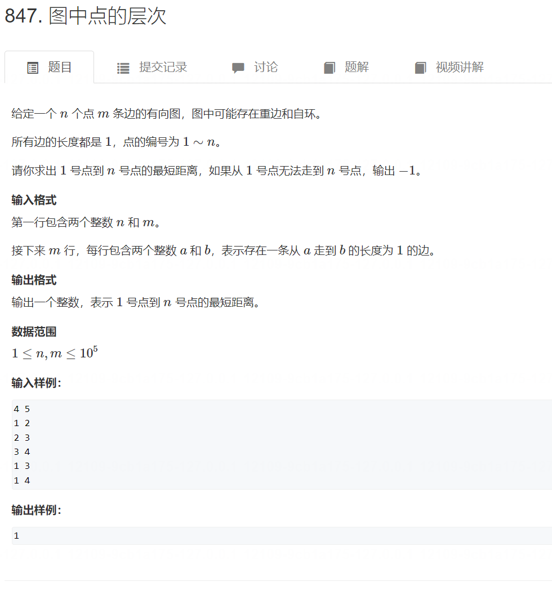

# 1. DFS
## 1. 排列数字
每次遍历dfs参数是 遍历的坑位
[力扣链接](https://leetcode.cn/problems/permutations/submissions/521610526/)
[acwing链接](https://www.acwing.com/problem/content/844/)

```cpp
#include<iostream>

using namespace std;

const int N = 8;
int p[N];
bool is_used[N];
int n;

void dfs(int u) {
    if (u == n) {
        for (int i = 0; i < n; i++) {
            printf("%d ", p[i]);
        }
        printf("\n");
        return;
    }
    
    for (int i = 1; i <= n; i++) {
        if (is_used[i] == false) {
            p[u] = i;
            is_used[i] = true;
            dfs(u+1);
            is_used[i] = false;
        }
    }
    
}

int main() {
    
    scanf("%d", &n);
    dfs(0);
    
    return 0;
}
```
## 2. n-皇后问题
[力扣链接](https://leetcode.cn/problems/n-queens/submissions/521623195/)
[acwing链接](https://www.acwing.com/problem/content/845/)

```cpp
#include<iostream>

using namespace std;

const int N = 10;
char p[N][N];
bool col[N*2], diag[N*2], back_diag[N*2];
int n;

void dfs(int u) {
    if (u == n+1) {
        for (int i = 1; i <= n; i++) {
            for (int j = 1; j <= n; j++) {
                printf("%c", p[i][j]);
            }
            printf("\n");
        }
        printf("\n");
        return;
    }
    
    for (int i = 1; i <= n; i++) {
        if (col[i] == false && diag[i-u+n] == false && back_diag[i+u] == false) {
            p[u][i] = 'Q';
            col[i] = true;
            diag[i-u+n] = true;
            back_diag[i+u] = true;
            dfs(u+1);
            p[u][i] = '.';
            col[i] = false;
            diag[i-u+n] = false;
            back_diag[i+u] = false;
        }
    }
    
}

int main() {
    
    scanf("%d", &n);
    for (int i = 1; i <= n; i++) {
        for (int j = 1; j <= n; j++) {
            p[i][j] = '.';
        }
    }
    
    dfs(1);
    
    return 0;
}
```


```java
class Solution {
    public List<List<String>> solveNQueens(int n) {
        List<List<String>> solutions = new ArrayList<List<String>>();
        int[] queens = new int[n];
        Arrays.fill(queens, -1);
        Set<Integer> columns = new HashSet<Integer>();
        Set<Integer> diagonals1 = new HashSet<Integer>();
        Set<Integer> diagonals2 = new HashSet<Integer>();
        backtrack(solutions, queens, n, 0, columns, diagonals1, diagonals2);
        return solutions;
    }

    public void backtrack(List<List<String>> solutions, int[] queens, int n, int row, Set<Integer> columns, Set<Integer> diagonals1, Set<Integer> diagonals2) {
        if (row == n) {
            List<String> board = generateBoard(queens, n);
            solutions.add(board);
        } else {
            for (int i = 0; i < n; i++) {
                if (columns.contains(i)) {
                    continue;
                }
                int diagonal1 = row - i;
                if (diagonals1.contains(diagonal1)) {
                    continue;
                }
                int diagonal2 = row + i;
                if (diagonals2.contains(diagonal2)) {
                    continue;
                }
                queens[row] = i;
                columns.add(i);
                diagonals1.add(diagonal1);
                diagonals2.add(diagonal2);
                backtrack(solutions, queens, n, row + 1, columns, diagonals1, diagonals2);
                queens[row] = -1;
                columns.remove(i);
                diagonals1.remove(diagonal1);
                diagonals2.remove(diagonal2);
            }
        }
    }

    public List<String> generateBoard(int[] queens, int n) {
        List<String> board = new ArrayList<String>();
        for (int i = 0; i < n; i++) {
            char[] row = new char[n];
            Arrays.fill(row, '.');
            row[queens[i]] = 'Q';
            board.add(new String(row));
        }
        return board;
    }
}

```

方法 1. 按行遍历（过程中有回溯、剪枝）
>思想：
>1. 每次递归中，遍历一行的元素，如果可以放皇后，就递归到下一行，下一行中不行了，就返回来，回溯，

```cpp
//cpp
#include <iostream>
using namespace std;

const int N = 11;

char q[N][N];//存储棋盘
bool dg[N * 2], udg[N * 2], cor[N];
//点对应的两个斜线以及列上是否有皇后

int n;

void dfs(int r)
{
    if(r == n)//放满了棋盘，输出棋盘
    {
        for(int i = 0; i < n; i++)
        {
            for(int j = 0; j < n; j++)
                cout << q[i][j];
            cout << endl;
        }
        cout << endl;
        return;
    }

    for(int i = 0; i < n; i++)//第 r 行，第 i 列 是否放皇后
    {
        if(!cor[i] && !dg[i + r] && !udg[n - i + r])//不冲突，放皇后
        {
            q[r][i] = 'Q';
            cor[i] = dg[i + r] = udg[n - i + r] = 1;//对应的 列， 斜线 状态改变
            dfs(r + 1);//处理下一行
            cor[i] = dg[i + r] = udg[n - i + r] = 0;//恢复现场
            q[r][i] = '.';
        }
    }
}

int main()
{
    cin >> n;
    for (int i = 0; i < n; i ++ )
        for (int j = 0; j < n; j ++ )
            q[i][j] = '.';
    dfs(0);
    return 0;
}
```
方法2. 按每个元素遍历（没有减枝）
```cpp
// 不同搜索顺序 时间复杂度不同  所以搜索顺序很重要！
#include <iostream>
using namespace std;
const int N = 20;

int n;
char g[N][N];
bool row[N], col[N], dg[N], udg[N]; 
// 因为是一个个搜索，所以加了row

// s表示已经放上去的皇后个数
void dfs(int x, int y, int s)
{
    // 处理超出边界的情况
    if (y == n) y = 0, x ++ ;

    if (x == n) { // x==n说明已经枚举完n^2个位置了
        if (s == n) { // s==n说明成功放上去了n个皇后
            for (int i = 0; i < n; i ++ ) puts(g[i]);
            puts("");
        }
        return;
    }
    
//和上面按行遍历的差别就是，这里没有循环

    // 分支1：放皇后
    if (!row[x] && !col[y] && !dg[x + y] && !udg[x - y + n]) {
        g[x][y] = 'Q';
        row[x] = col[y] = dg[x + y] = udg[x - y + n] = true;
        dfs(x, y + 1, s + 1);
        row[x] = col[y] = dg[x + y] = udg[x - y + n] = false;
        g[x][y] = '.';
    }

    // 分支2：不放皇后
    dfs(x, y + 1, s);
}


int main() {
    cin >> n;
    for (int i = 0; i < n; i ++ )
        for (int j = 0; j < n; j ++ )
            g[i][j] = '.';

    dfs(0, 0, 0);

    return 0;
}
```

# 2. BFS（队列）
## 1. 字母迷宫

```java
class Solution {
    public boolean wordPuzzle(char[][] grid, String word) {
        int h = grid.length, w = grid[0].length;
        boolean[][] visited = new boolean[h][w];
        for (int i = 0; i < h; i++) {
            for (int j = 0; j < w; j++) {
                boolean flag = exist(grid, visited, i, j, word, 0);
                if (flag) {
                    return true;
                }
            }
        }
        return false;
    }

    public boolean exist(char[][] grid, boolean[][] visited, int i, int j, String s, int k) {
        if (grid[i][j] != s.charAt(k)) {
            return false;
        } else if (k == s.length() - 1) {
            return true;
        }
        visited[i][j] = true;
        int[][] directions = {{0, 1}, {0, -1}, {1, 0}, {-1, 0}};
        boolean result = false;
        for (int[] dir : directions) {
            int newi = i + dir[0], newj = j + dir[1];
            if (newi >= 0 && newi < grid.length && newj >= 0 && newj < grid[0].length) {
                if (!visited[newi][newj]) {
                    boolean flag = exist(grid, visited, newi, newj, s, k + 1);
                    if (flag) {
                        result = true;
                        break;
                    }
                }
            }
        }
        visited[i][j] = false;
        return result;
    }
}

```

[原题链接](https://www.acwing.com/activity/content/problem/content/907/)
[原题链接](https://www.acwing.com/problem/content/846/)

```java
class Solution {
    public boolean wordPuzzle(char[][] grid, String word) {
        int h = grid.length, w = grid[0].length;
        boolean[][] visited = new boolean[h][w];
        for (int i = 0; i < h; i++) {
            for (int j = 0; j < w; j++) {
                boolean flag = exist(grid, visited, i, j, word, 0);
                if (flag) {
                    return true;
                }
            }
        }
        return false;
    }

    public boolean exist(char[][] grid, boolean[][] visited, int i, int j, String s, int k) {
        if (grid[i][j] != s.charAt(k)) {
            return false;
        } else if (k == s.length() - 1) {
            return true;
        }
        visited[i][j] = true;
        int[][] directions = {{0, 1}, {0, -1}, {1, 0}, {-1, 0}};
        boolean result = false;
        for (int[] dir : directions) {
            int newi = i + dir[0], newj = j + dir[1];
            if (newi >= 0 && newi < grid.length && newj >= 0 && newj < grid[0].length) {
                if (!visited[newi][newj]) {
                    boolean flag = exist(grid, visited, newi, newj, s, k + 1);
                    if (flag) {
                        result = true;
                        break;
                    }
                }
            }
        }
        visited[i][j] = false;
        return result;
    }
}

```

```cpp
#include<iostream>
#include<cstring>

using namespace std;

int n,m;
int p[110][110];
int d[110][110];
int dx[4] = {-1,0,1,0};
int dy[4] = {0,-1,0,1};

pair<int,int> q[110*110];
int hh,tt=-1;

void bfs()
{
    q[++tt] = {1,1};
    p[1][1] = 1;
    d[1][1] = 0;
    while(hh<=tt)
    {
        pair<int,int> item = q[hh++];
        for(int i = 0; i < 4; i++)
        {
            int x = item.first;
            int y = item.second;
            //cout << x << ' ' << y << endl;
            if(p[x+dx[i]][y+dy[i]]!=1 && x+dx[i]<=n && x+dx[i] > 0 && y+dy[i] <=m && y+dy[i] >0)
            {
                d[x+dx[i]][y+dy[i]] = d[x][y] + 1;
                q[++tt] = {x+dx[i],y+dy[i]};
                p[x+dx[i]][y+dy[i]] = 1;
            }
        }
    }
}

int main()
{
    cin >> n >> m;
    for(int i = 1; i<=n; i++)
    {
        for(int j = 1; j<=m; j++)
            cin >> p[i][j];
    }
    
    bfs();
    
    cout << d[n][m];
    
    return 0;
}
```
## 2. 滑动谜题
[力扣链接](https://leetcode.cn/problems/sliding-puzzle/description/)
[acwing链接](https://www.acwing.com/problem/content/847/)

```java

class Solution {
    public int slidingPuzzle(int[][] board) {
        int m = 2, n = 3;
        StringBuilder sb = new StringBuilder();
        String target = "123450";
        // 将 2x3 的数组转化成字符串作为 BFS 的起点
        for (int i = 0; i < m; i++) {
            for (int j = 0; j < n; j++) {
                sb.append(board[i][j]);
            }
        }
        String start = sb.toString();

        // 记录一维字符串的相邻索引
        int[][] neighbor = new int[][]{
                {1, 3},
                {0, 4, 2},
                {1, 5},
                {0, 4},
                {3, 1, 5},
                {4, 2}
        };

        /******* BFS 算法框架开始 *******/
        Queue<String> q = new LinkedList<>();
        HashSet<String> visited = new HashSet<>();
        // 从起点开始 BFS 搜索
        q.offer(start);
        visited.add(start);

        int step = 0;
        while (!q.isEmpty()) {

            int sz = q.size();
            for (int i = 0; i < sz; i++) {
                String cur = q.poll();
                // 判断是否达到目标局面
                if (target.equals(cur)) {
                    return step;
                }
                // 找到数字 0 的索引
                int idx = 0;
                for (; cur.charAt(idx) != '0'; idx++) ;
                // 将数字 0 和相邻的数字交换位置
                for (int adj : neighbor[idx]) {
                    String new_board = swap(cur.toCharArray(), adj, idx);
                    // 防止走回头路
                    if (!visited.contains(new_board)) {
                        q.offer(new_board);
                        visited.add(new_board);
                    }
                }
            }
            step++;
        }
        /******* BFS 算法框架结束 *******/
        return -1;
    }

    private String swap(char[] chars, int i, int j) {
        char temp = chars[i];
        chars[i] = chars[j];
        chars[j] = temp;
        return new String(chars);
    }
}
```

```cpp
#include<iostream>
#include<unordered_map>
#include<cstring>
#include<queue>

using namespace std;

int bfs(string s)
{
    queue<string> q;
    q.push(s);
    int dx[4] = { 1,0,-1,0 },
        dy[4] = { 0,-1,0,1 };
    unordered_map<string, int> d;
    d[s] = 0;

    while (!q.empty())
    {
        string f = q.front();
        q.pop();
        if (f == "12345678x")
            return d[f];
        int df = d[f];
        int k = f.find("x");
        int x = k / 3;
        int y = k % 3;
        for (int i = 0; i < 4; i++)
        {
            if (x + dx[i] <= 2 && x + dx[i] >= 0 && y + dy[i] <= 2 && y + dy[i] >= 0)
            {
                swap(f[k], f[(x + dx[i]) * 3 + y + dy[i]]);
                if (!d.count(f))
                {
                    d[f] = df + 1;
                    q.push(f);
                }
                swap(f[k], f[(x + dx[i]) * 3 + y + dy[i]]);
            }
        }
    }
    return -1;
}

int main()
{
    char ch;
    string s;
    for (int i = 0; i < 9; i++)
    {
        cin >> ch;
        s += ch;
    }
    cout << bfs(s);
    return 0;
}
```

# 3. 树与图的dfs
## 1. 树的重心


[原题链接](https://www.acwing.com/activity/content/problem/content/909/)
```cpp
void add(int a,int b)
{
    e[idx] = b,ne[idx] = h[a],h[a] = idx++;
}
```
>3. ==遍历过的点标记一下，不再遍历，因为无向图可能往回遍历==


```java
import java.util.*;

class Main {
    
    static int N = (int)2e5+10;
    static int[] h = new int[N], e = new int[N], ne = new int[N];
    static int cnt = 0;
    static int n;
    static boolean[] isTra = new boolean[N];
    static int ans;
    
    private static void add(int a, int b) {
        e[++cnt] = b;
        ne[cnt] = h[a];
        h[a] = cnt;
    }
    
    private static int dfs(int u) {
        
        int sum = 0;
        int cntMax = 0;
        isTra[u] = true;
        for (int i = h[u]; i != -1; i = ne[i]) {
            if (isTra[e[i]] == false) {
                int cntChirld = dfs(e[i]);
                sum += cntChirld;
                cntMax = Math.max(cntMax, cntChirld);
            }
        }
        ans = Math.min(ans, Math.max(n-sum-1, cntMax));
        return sum + 1;
        
    }
    
    public static void main(String[] args) {
        Scanner scan = new Scanner(System.in);
        n = scan.nextInt();
        
        Arrays.fill(h, -1);
        
        for (int i = 0; i < n-1; i++) {
            int a = scan.nextInt();
            int b = scan.nextInt();
            add(a, b);
            add(b, a);
        }
        ans = 0x3f3f3f3f;
        dfs(1);
        
        System.out.print(ans);
        
    }
    
}
```


# 4. 树与图的bfs(最短路)


## 1. 图中点的层次( 无权最短路 )
[原题链接](https://www.acwing.com/activity/content/problem/content/910/)
[原题链接](https://www.acwing.com/activity/content/problem/content/910/)
```java
#include<iostream>
#include<cstring>
#include<queue>

using namespace std;

const int N = 1e5+10;
int e[N],ne[N],h[N];
int idx;
int d[N];

void add(int a, int b) {
    e[idx] = b;
    ne[idx] = h[a];
    h[a] = idx++;
}

void bfs() {
    queue<int> queue;
    queue.push(1);
    d[1] = 0;
    while (queue.size() != 0) {
        int cur = queue.front();
        queue.pop();
        
        for (int i = h[cur]; i != -1; i = ne[i]) {
            if (d[e[i]] == 0x3f3f3f3f) {
                d[e[i]] = d[cur] + 1;
                queue.push(e[i]);
            }
        }
    }
}

int main() {
    int n, m;
    cin >> n >> m;
    
    memset(h, -1, sizeof(h));
    memset(d, 0x3f, sizeof(d));
    
    for (int i = 0; i < m; i++) {
        int a,b;
        cin >> a >> b;
        add(a, b);
    }
    
    bfs();
    
    if (d[n] == 0x3f3f3f3f) {
        cout << -1;
    } else {
        cout << d[n];
    }
    
}

```

# 5. 拓扑排序
## 1. 课程表
[力扣链接](https://leetcode.cn/problems/course-schedule/description/)
[acwing链接](https://www.acwing.com/activity/content/problem/content/911/)

```java
class Solution {

    private static final int N = 5001;
    private static int[] e;
    private static int[] ne;
    private static int[] h;
    private static int[] cnt;
    private static int idx;

    private static void add(int a,int b) {
        e[idx] = b;ne[idx] = h[a];cnt[b]++;h[a] = idx++;
    }

    public boolean canFinish(int numCourses, int[][] prerequisites) {
        e = new int[N];
        ne = new int[N];
        h = new int[N];
        cnt = new int[N];
        idx = 0;
        Arrays.fill(h,-1);
        for (int[] temp : prerequisites) {
            add(temp[1],temp[0]);
        }
        Queue<Integer> queue = new LinkedList<>();
        for (int i = 0; i < numCourses; i++) {
            if (cnt[i] == 0) {
                queue.add(i);
            }
        }
        int sum = 0;
        while (!queue.isEmpty()) {
            int r = queue.remove();
            sum++;
            for (int i = h[r]; i != -1; i = ne[i]) {
                int j = e[i];
                cnt[j]--;
                if (cnt[j] == 0) {
                    queue.add(j);
                }
            }
        }
        if (sum == numCourses) {
            return true;
        } else {
            return false;
        }
    }
}

```

```java
import java.util.*;
public class Main{
    static int N =  100010,n,m,hh,tt,idx;
    static int[] e = new int[N],ne = new int[N],h = new int[N];
    static int[] q = new int[N];
    static int[] d = new int[N];
    public static void add(int a,int b){
        e[idx] = b;
        ne[idx] = h[a];
        h[a] = idx++;

    }
    public static boolean bfs(){
        hh = 0 ; tt = -1;
        for(int i = 1 ; i <= n ; i ++ ){ 
            if(d[i] == 0){     //首先将所有入度为0的点全部插入q队列中
                q[++tt] = i;
            }
        }
        while(hh <= tt){
            int t = q[hh++]; //拿出队头
            for(int i = h[t] ; i != -1; i = ne[i]){ //遍历一下队列中所有的边
                int s = e[i]; //然后将这个边拿出来
                d[s] -- ; //将这个边的入度数减1
                if(d[s] == 0){
                    q[++tt] = s; //如果减完之后s的入度数为0；就将他插入队列中
                }       
            }
        }
        return tt == n - 1; //最后返回，如果队列中的tt等于n-1个数，说明就是正确的的
    }
    public static void main(String[] args){
        Scanner scan = new Scanner(System.in);
        n = scan.nextInt();
        m = scan.nextInt();
        for(int i = 0 ; i < N ; i ++ ){
            h[i] = -1; 
        }
        while(m -- > 0){
            int a = scan.nextInt();
            int b = scan.nextInt();
            add(a,b);
            d[b] ++;
        }

        if(bfs()){
            //队列刚好队头删除的点就是我们的拓扑序列，因为我们只是将hh往后面移动，但是它具体前面的值还在，直接输出就行
            for(int i = 0 ; i < n; i ++ ){ 
                System.out.print(q[i] + " ");
            }
        }else{
            System.out.println("-1");
        }
    }
}
```

```cpp
#include<iostream>
#include<cstring>
#include<queue>

using namespace std;

const int N = 1e5+10;

bool st[N];
int e[N],ne[N],idx,h[N];
int b[N];//每个节点的入读

int n,k;  

queue<int> q,ans;

void bfs()
{
    while(q.size())
    {
        int f = q.front();
        q.pop();
        for(int i = h[f]; i != -1; i = ne[i])
        {
                b[e[i]]--;
                if(b[e[i]]==0)
                {
                    ans.push(e[i]);
                    q.push(e[i]);
                }
            
        }
        
    }
    
}

void add(int a,int b)
{
    e[idx] = b,ne[idx] = h[a],h[a] = idx++;
}

int main()
{ 
    memset(h,-1,sizeof h);
    cin >> n >> k;
    for(int i = 1; i <= k; i++)
    {
        int a,bb;
        cin >> a >> bb;
        add(a,bb);
        b[bb]++;
    }
    
    for(int i = 1; i <= n; i++)
    {
        if(b[i]==0)
        {
            //cout << i << endl;
            q.push(i);
            ans.push(i);
        }
    }
    bfs();
        if(ans.size()!=n)
    {
        cout << -1;
        return 0;
    }
    //cout << ans.size() << endl;
    
    while(ans.size())
    {
        cout << ans.front() << ' ';
        ans.pop();
    }
    
    return 0;
}
```

# 6. 朴素dijkstra算法


## 1. Dijkstra求最短路 I（邻接矩阵）


[原题链接](https://www.acwing.com/activity/content/problem/content/918/)
刷题总结
>1. 稀疏矩阵 和 疏密矩阵（疏密矩阵 可以用 邻接矩阵存储方式）
>2. 邻接矩阵直接就可以存储 边距离了
>3. d存储到1节点的距离

二刷总结
>1. dijk就是两步 ：1. 在dist里选出最小值 2.遍历dist更新
>如何选(如下)

```cpp
int t = -1;
for (int j = 1; j <= n; j ++ )
    if (!st[j] && (t == -1 || dist[t] > dist[j]))
        t = j;
```

```java

import java.util.*;
public class Main{
    static int N = 510,n,m, max = 0x3f3f3f3f;
    static int[][] g = new int[N][N];//存每个点之间的距离
    static int[] dist = new int[N];//存每个点到起点之间的距离
    static boolean[] st = new boolean[N];//存已经确定了最短距离的点
    public static int dijkstra(){
        Arrays.fill(dist,max);//将dist数组一开始赋值成较大的数
        dist[1] = 0; //首先第一个点是零

        //从0开始,遍历n次，一次可以确定一个最小值
        for(int i = 0 ; i < n ; i ++ ){ 
            int t = -1; //t这个变量,准备来说就是转折用的
            for(int j = 1 ; j <= n ; j ++ ){
                /***
                 * 因为数字是大于1的，所以从1开始遍历寻找每个数
                 * 如果s集合中没有这个数
                 * 并且t == -1，表示刚开始 或者 后面的数比我心找的数距离起点的距离短
                 * 然后将j 的值赋值给 t
                 ***/
                if(!st[j] && (t == -1 || dist[j] < dist[t])){
                    t = j; 
                }
            }

            st[t] = true;//表示这个数是已经找到了确定了最短距离的点

            //用已经确认的最短距离的点来更新后面的点
            //就是用1到t的距离加上t到j的距离来更新从1到j的长度
            for(int j = 1 ; j <= n ; j ++ ){
                //
                dist[j] = Math.min(dist[j],dist[t] + g[t][j]);
            }
        }
        //如果最后n的长度没有改变，输出-1，没有找到；否则输出最短路n
        if(dist[n] == max) return -1;
        else return dist[n];

    }
    public static void main(String[] args){
        Scanner scan = new Scanner(System.in);
        n = scan.nextInt();
        m = scan.nextInt();
        //将他们每个点一开始赋值成一个较大的值
        for(int i = 1 ; i <= n ; i ++ ){
            Arrays.fill(g[i],max);
        }
        while(m -- > 0){
            int a = scan.nextInt();
            int b = scan.nextInt();
            int c = scan.nextInt();
            g[a][b] = Math.min(g[a][b],c);//这个因为可能存在重边，所以泽出最短的
        }
        int res = dijkstra();
        System.out.println(res);
    }
}
```
### 普通方法：bfs

```java
import java.util.*;

class Main {

    static int N = 510;
    static int[][] p = new int[N][N];

    public static void main(String[] args) {

        Scanner scan = new Scanner(System.in);

        int n = scan.nextInt();
        int m = scan.nextInt();
        for (int i = 0; i < p.length; i++) {
            Arrays.fill(p[i], 50000000);
        }
        for (int i = 0; i < m; i++) {
            int a = scan.nextInt();
            int b = scan.nextInt();
            int c = scan.nextInt();
            p[a][b] = Math.min(p[a][b],c);
        }

        int[] d = new int[N];
        Arrays.fill(d,(int)5e7);

        Queue<Integer> queue = new LinkedList<>();
        d[1] = 0;
        queue.add(1);

        while (queue.size() > 0) {
            int t = queue.poll();
            for (int i = 1; i <= n; i++) {
                if (p[t][i] != 50000000 && d[i] > d[t] + p[t][i]) {
                    d[i] = d[t] + p[t][i];
                    queue.add(i);
                }
            }
        }

        if (d[n] == 50000000) {
            System.out.print(-1);
        } else {
            System.out.print(d[n]);
        }

    }
}
```

# 7.  堆优化版dijkstra


## 1. Dijkstra求最短路 II（邻接表）
[原题链接](https://www.acwing.com/activity/content/problem/content/919/)
```java
import java.io.BufferedReader;
import java.io.IOException;
import java.io.InputStreamReader;
import java.util.Arrays;
import java.util.PriorityQueue;

public class Main{
    static int N = 100010;
    static int n;

    static int[] h = new int[N];
    static int[] e = new int[N];
    static int[] ne = new int[N];
    static int[] w = new int[N];
    static int idx = 0;
    static int[] dist = new int[N];// 存储1号点到每个点的最短距离
    static boolean[] st = new boolean[N];
    static int INF = 0x3f3f3f3f;//设置无穷大
    public static void add(int a,int b,int c)
    {
        e[idx] = b;
        w[idx] = c;
        ne[idx] = h[a];
        h[a] = idx ++;
    }

    // 求1号点到n号点的最短路，如果不存在则返回-1
    public static int dijkstra()
    {
        //维护当前未在st中标记过且离源点最近的点
        PriorityQueue<PIIs> queue = new PriorityQueue<PIIs>();
        Arrays.fill(dist, INF);
        dist[1] = 0;
        queue.add(new PIIs(0,1));
        while(!queue.isEmpty())
        {
            //1、找到当前未在s中出现过且离源点最近的点
            PIIs p = queue.poll();
            int t = p.getSecond();
            int distance = p.getFirst();
            if(st[t]) continue;
            //2、将该点进行标记
            st[t] = true;
            //3、用t更新其他点的距离
            for(int i = h[t];i != -1;i = ne[i])
            {
                int j = e[i];
                if(dist[j] > distance + w[i])
                {
                    dist[j] = distance + w[i];
                    queue.add(new PIIs(dist[j],j));
                }
            }

        }
        if(dist[n] == INF) return -1;
        return dist[n];
    }

    public static void main(String[] args) throws IOException{
        BufferedReader reader = new BufferedReader(new InputStreamReader(System.in));
        String[] str1 = reader.readLine().split(" ");
        n = Integer.parseInt(str1[0]);
        int m = Integer.parseInt(str1[1]);
        Arrays.fill(h, -1);
        while(m -- > 0)
        {
            String[] str2 = reader.readLine().split(" ");
            int a = Integer.parseInt(str2[0]);
            int b = Integer.parseInt(str2[1]);
            int c = Integer.parseInt(str2[2]);
            add(a,b,c);
        }
        System.out.println(dijkstra());
    }
}

class PIIs implements Comparable<PIIs>{
    private int first;//距离值
    private int second;//点编号

    public int getFirst()
    {
        return this.first;
    }
    public int getSecond()
    {
        return this.second;
    }
    public PIIs(int first,int second)
    {
        this.first = first;
        this.second = second;
    }
    @Override
    public int compareTo(PIIs o) {
        // TODO 自动生成的方法存根
        return Integer.compare(first, o.first);
    }
}
```

# 8. Bellman-Ford算法


## 1. 有边数限制的最短路
[原题链接](https://www.acwing.com/activity/content/problem/content/922/)
>1. b到1的距离 = min（a到1的距离 + a 到 b的距离）

```java
import java.util.*;

class Main {

    public static void main(String[] args) {
        Scanner scann = new Scanner(System.in);
        int n = scann.nextInt();
        int m = scann.nextInt();
        int k = scann.nextInt();

        int[] d = new int[n+2];
        Arrays.fill(d,0x3f3f3f3f);

        List<Edge> list = new ArrayList<>();

        for (int i = 0; i < m; i++) {
            int a = scann.nextInt();
            int b = scann.nextInt();
            int dist = scann.nextInt();
            Edge e = new Edge();
            e.a = a; e.b = b; e.d = dist;
            list.add(e);
        }

        d[1] = 0;

        for (int i = 0; i < k; i++) {
            int[] temp = Arrays.copyOf(d,d.length);
            for (Edge e : list) {
                int a = e.a;
                int b = e.b;
                int dist = e.d;
                if (temp[b] > d[a] + dist) {
                    temp[b] = d[a] + dist;
                }
            }
            d = temp;
        }

        if (d[n] >= (int)0x3f3f3f3f/2) {
            System.out.print("impossible");
        } else {
            System.out.print(d[n]);
        }
        
    }

    static class Edge {
        int a;
        int b;
        int d;
    }

}
```

# 9. spfa 算法

## 1. spfa求最短路
[原题链接](https://www.acwing.com/activity/content/problem/content/920/)


```java
import java.util.*;
public class Main{
    static int N = 100010,n,m,hh,tt,idx,INF = 0x3f3f3f3f;
    static int[] h = new int[N],e = new int[N],ne = new int[N],w = new int[N];
    static int[] q = new int[N],dist = new int[N];
    static boolean[] st = new boolean[N];
    public static void add(int a,int b,int c){
        e[idx] = b;
        w[idx] = c;
        ne[idx] = h[a];
        h[a] = idx++;
    }
    public static void spfa(){
        hh = 0 ; tt =-1;
        Arrays.fill(dist,INF); //将dist一开始全部赋值成0x3f3f3f3f
        dist[1] = 0; //然后一开始的点距离是0
        q[++tt] = 1; //然后将第一个点插入到队列中
        st[1] = true;//标记第一个队列中有这个点
        while(hh <= tt){
            int t = q[hh ++ ]; //然后将队头弹出
            st[t] = false; //这里就将这个点在队列中取消标记
            for(int i = h[t]; i != -1 ; i = ne[i]){  //遍历所有的点
                int j = e[i];
                //如果后面的数比前面的数加t-j之间的位权的和要大，就说明应该更新一下最短距离了
                if(dist[j] > dist[t] + w[i]){ 
                    dist[j] = dist[t] + w[i];
                    //然后判断一下是不是队列中有这个点
                    if(!st[j]){
                        //没有就将这个点插入队列
                        q[++tt] = j;
                        //标记对列中有这个点
                        st[j] = true;
                    }
                }
            }
        }
        //spfa只会更新所有能从起点走到的点，所以如果无解，那么起点就走不到终点，那么终点的距离就是0x3f3f3f3f。
        if(dist[n] == INF) System.out.println("impossible");
        else System.out.println(dist[n]);
    }
    public static void main(String[] args){
        Scanner scan = new Scanner(System.in);
        n = scan.nextInt();
        m = scan.nextInt();
        Arrays.fill(h,-1);
        while(m -- > 0){
            int a = scan.nextInt();
            int b = scan.nextInt();
            int c = scan.nextInt();
            add(a,b,c);
        }
        spfa();
    }
}
```

# 10. spfa判断负权回路

[原题链接](https://www.acwing.com/activity/content/code/content/2115436/)


1. 什么是负环

图1中：2 到 3 到 4 到 2 路径长度为 -10
图2中：2 到 3 到 4 到 2 路径长度为 10

图1才叫负环
图2不是负环

2. 出现负环会怎么样
但出现负环的时候，如果我们要去求1到n的最短路，那么过程中，一定会在这个负环中一直转圈，导致路程可以变为负无穷

3. 怎么判断图中是否有负环？
综上，我们就采取求最小路径的方式（但是本题不是求最短路），当我们求最短路径的过程中，发现有一段路径重复走，那么就说明一定出现了负环

问题来了：怎么判断某段路径在重复走
我们想，1到n号点 最多才可能走了n-1条边
如果我们发现 到某点时 已经走了 大于等于n条边，那么一定就是有负环了
由于我们不知道 1 到 x点最多可能有多少条边，但一定不会超过 n - 1 条边，所以我们就都用 大于等于n条边去判断
## spfa判断负环
[原题链接](https://www.acwing.com/problem/content/854/)
```java
import java.util.*;
public class Main{
    static int N = 2010,M = 10010,n,m,idx;
    static int[] h = new int[N],e = new int[M],ne = new int[M],w = new int[M];
    static int[] cnt = new int[N]; //存多少边
    static int[] dist = new int[N];//存点到起点的距离
    static boolean[] st =  new boolean[N];//判断队列中是不是有这个数
    public static void add(int a,int b,int c){
        e[idx] = b;
        w[idx] = c;
        ne[idx] = h[a];
        h[a] = idx++;
    }
    public static boolean spfa(){
        Queue<Integer> queue = new LinkedList<>();
        //Arrays.fill(dist,0x3f3f3f3f);
        //可能起点到不了负环，所以将所有的点都加入到对列中去
        for(int i = 1 ; i <= n ; i++ ){
            queue.offer(i);
            st[i] = true;//然后标记所有的点
        }

        while(!queue.isEmpty()){
            int t = queue.poll(); //然后将拿出队头
            st[t] = false; //然后标记已经不在队列中
            for(int i = h[t] ; i != -1 ;  i= ne[i]){ //遍历所有的点
                int j = e[i];
                //如果j到起点的距离 > 上个点t到起点的距离 +  t到j的距离，那么就更新dist[j]
                if(dist[j] > dist[t] + w[i]){   
                    dist[j] =  dist[t] + w[i];
                    cnt[j] = cnt[t] + 1; // 每一个次更新就将边加上1

                    //如果边大于n点数，n个点最多只有n-1条边，如果>= n的话,就至少有一个点出现了两次，则说明出线负环
                    if(cnt[j] >= n) return true; 
                    //然后判断对列中有没有点j，有则插并标记，无则不插
                    if(!st[j]){
                        queue.offer(j);
                        st[j] = true;
                    }
                }
            }
        }
        return false;
    }
    public static void main(String[] args){
        Scanner scan = new Scanner(System.in);
        n = scan.nextInt();
        m = scan.nextInt();
        Arrays.fill(h,-1);
        while(m -- > 0){
            int a = scan.nextInt();
            int b = scan.nextInt();
            int c = scan.nextInt();
            add(a,b,c);
        }
        if(spfa()) System.out.println("Yes");
        else System.out.println("No");
    }
}
```
# 11. floyd算法(dp)


## 1. Floyd求最短路
[原题链接](https://www.acwing.com/activity/content/problem/content/923/)

>1. 用二维数组存储更方便
>2. 读入存储的时候，读取最小值，并且到自身值为0
>3. Floyd


```java
import java.util.*;
public class Main{
    static int N = 210,n,m,k,INF = 0x3f3f3f3f;
    static int[][] g = new int[N][N];

    /***floyd算法只需要三重循环就可以解决问题，hh《很简单》
    * g[i,j,k] = min(g[i,j,k-1],g[i,k,k-1]+g[k,j,k-1]);
    * 原状态是：f[i, j, k]表示从i走到j的路径上除了i, j以外不包含点k的所有路径的最短距离。
    * 那么f[i, j, k] = min(f[i, j, k - 1), f[i, k, k - 1] + f[k, j, k - 1]。
    * 因此在计算第k层的f[i, j]的时候必须先将第k - 1层的所有状态计算出来，所以需要把k放在最外层。
    * 
    * 这里其实就是将所有k的可能性已经·存好，等待你输入就OK了
    ***/
    public static void floyd(){
        for(int k = 1 ; k <= n ; k ++ ){
            for(int i = 1 ; i <= n ; i ++ ){
                for(int j = 1 ; j <= n ; j ++ ){
                    g[i][j] = Math.min(g[i][j],g[i][k] + g[k][j]);
                }
            }
        }
    }
    public static void main(String[] args){
        Scanner scan = new Scanner(System.in);
        n = scan.nextInt();
        m = scan.nextInt();
        k = scan.nextInt();
        for(int i = 1 ; i <= n ; i ++ ){
            for(int j = 1 ; j <= n ; j ++ ){
                if(i == j) g[i][j] = 0; //可能存在询问自身到自身的距离，所以需要存0
                else g[i][j] = INF; //然后其他都可以存成INF最大值
            }    
        }
        while(m -- > 0 ){
            int a = scan.nextInt();
            int b = scan.nextInt();
            int c = scan.nextInt();
            g[a][b] = Math.min(g[a][b],c); //这里可能存在重边，取最小的边
        }

        floyd();

        while(k -- > 0){
            int x = scan.nextInt();
            int y = scan.nextInt(); 
            int t  = g[x][y]; 
            //这里可能最后到不了目标点，但是可能路径上面存在负权边，然后将目标点更新了，所以不是到底== INF
            if(t > INF / 2) System.out.println("impossible");
            else System.out.println(t);

        }
    }
}
```


# 12. 朴素版prim算法
## 1. Prim算法求最小生成树
[原题链接](https://www.acwing.com/activity/content/problem/content/924/)
```java
import java.util.*;
import java.io.*;
public class Main{
    static int N = 510,M = 100010,INF = 0x3f3f3f3f;
    static int n, m;
    static int[][] g = new int[N][N];
    static int[] dist = new int[N];
    static boolean[] st = new boolean[N];

    public static int prim(){
        Arrays.fill(dist,INF);
        int res = 0;

        for (int i = 0 ; i < n ; i ++ ){
            int t = -1;
            for (int j = 1 ; j <= n ; j ++ )
                if (!st[j] && (t == -1 || dist[j] < dist[t]))
                    t = j;

            st[t] = true;

            if (i != 0 && dist[t] == INF)  return INF;
            if (i != 0) res += dist[t];

            for (int j = 1 ; j <= n ; j ++ )
                dist[j] = Math.min(dist[j],g[t][j]);
        }
        return res;
    }

    public static void main(String[] args)throws IOException{
        BufferedReader bf = new BufferedReader(new InputStreamReader(System.in));
        String[] s1 = bf.readLine().split(" ");
        n = Integer.parseInt(s1[0]);
        m = Integer.parseInt(s1[1]);

        for (int i = 0 ; i < N ; i ++ ) Arrays.fill(g[i],INF);

        while (m -- > 0){
            String[] s2 = bf.readLine().split(" ");
            int a = Integer.parseInt(s2[0]);
            int b = Integer.parseInt(s2[1]);
            int c = Integer.parseInt(s2[2]);
            g[a][b] = g[b][a] = Math.min(g[a][b],c);
        }

        int t = prim();

        if (t == INF) System.out.println("impossible");
        else System.out.println(t);
    }
}
```

# 13. Kruskal算法

## 1. Kruskal算法求最小生成树( 利用并查集 )
[原题链接](https://www.acwing.com/activity/content/problem/content/925/)
[原题链接](https://www.acwing.com/problem/content/861/)


```java
import java.util.*;
public class Main{
    static int N = 200010,n,m,w,INF = 0x3f3f3f3f;
    static Edgs[] edgs = new Edgs[N];//创建一个结构体
    static int[] p = new int[N];//集合
    //并查集模板，所有的集合在过程中全部指向根节点
    public static int find(int x){ 
        if(p[x] != x) p[x] = find(p[x]);
        return  p[x];
    }
    public static void kruskal(){
        Arrays.sort(edgs,0,m); //将结构体中的权重数据从小到大排序好

        int res = 0;//所有权重之和
        int cnt = 0;//加入集合的边数之和
        //枚举所有的边
        for(int i = 0 ; i < m ; i ++ ){
            int a = edgs[i].a;
            int b = edgs[i].b;
            int w = edgs[i].w;
            //判断一下a和b是不是在同一个集合中，不在集合中执行以下操作
            a = find(a);b = find(b);
            if(a != b){
                p[a] = b; //将两个集合合并
                res += w;//res增加权重
                cnt ++;//边数加1
            }
        }
        //因为有n个点，所以有n-1条边，所以如果小于n-1就是存在不连通的边，所以输出impossible，否则输出权重之和res
        if(cnt < n - 1) System.out.println("impossible");
        else System.out.println(res);
    }
    public static void main(String[] args){
        Scanner scan = new Scanner(System.in);
        n = scan.nextInt();
        m = scan.nextInt();
        for(int i = 1 ; i<= n ; i ++ ) p[i] = i;
        for(int i = 0 ; i < m ; i ++ ){
            int a = scan.nextInt();
            int b = scan.nextInt();
            int w = scan.nextInt();
            edgs[i] = new Edgs(a,b,w);
        }
        kruskal();
    }
}
class Edgs implements Comparable<Edgs>{
    int a,b,w;
    public Edgs(int a,int b,int w){
        this.a = a;
        this.b = b;
        this.w = w;
    }
    public int compareTo(Edgs o){
        return  Integer.compare(w,o.w);
    }
}
```

# 14. 染色法判别二分图

## 染色法判定二分图

>

[原题链接](https://www.acwing.com/activity/content/problem/content/926/)

[原题链接](https://www.acwing.com/problem/content/862/)
```java
import java.util.*;
public class Main{
    static int N = 100010,M = N*2,n,m,idx;
    static int[] h = new int[N],e = new int[M],ne = new int[M];
    static int[] color = new int[N];
    public static void add(int a,int b){
        e[idx] = b;
        ne[idx] = h[a];
        h[a] = idx++;
    }
    public static boolean dfs(int u,int c){
        color[u] = c; //首先将点u染色成c

        //然后遍历一下该点的所有边、
        for(int i = h[u]; i != -1; i = ne[i]){
            int j = e[i];
            //如果该点还没有染色
            if(color[j] == 0){
                //那就将该点进行染色，3-c是因为我们是将染色成1和2，如果是1，那就将对应的染成2，就用3来减法得出
                if(!dfs(j,3-c)) return false; //如果染完色之后返回false，那就说明里面含有奇数环，那就返回false
            }   
                //如果该点已经染过颜色吗，然后点的颜色跟我c的颜色是一样的，那就说明存在奇数环，返回false 
            else if(color[j] == c) return false; 
        }
        //最后如果很顺利的染完色，那就说明没有奇数环，那就返回true；
        return true;
    }
    public static void main(String[] args){
        Scanner scan =  new Scanner(System.in);
        n = scan.nextInt();
        m = scan.nextInt();
        Arrays.fill(h,-1);
        while(m -- > 0){
            int a = scan.nextInt();
            int b = scan.nextInt();
            add(a,b);add(b,a);//因为是无向边，所以双方指向双方的两条边
        }
        boolean flag = true;
        for(int i = 1 ; i <= n ; i ++ ){
            //如果该点还没有染色
            if(color[i] == 0){
                //那就进行染色操作，第一个点可以自行定义1或者2，表示黑白
                if(!dfs(i,1)){
                    flag = false; //如果返回了false，说明有奇数环就将结束，输出No，否则输出Yes
                    break;
                }    
            }

        }
        if(flag) System.out.println("Yes");
        else System.out.println("No");
    }
}
```

# 15. 匈牙利算法
## 二分图的最大匹配
[原题链接](https://www.acwing.com/activity/content/problem/content/927/)

```java
import java.util.*;
public class Main{
    static int N = 510,M = 100010,n1,n2,m,idx;
    static int[] h = new int[N],e = new int[M],ne = new int[M];
    static int[] match = new int[M];
    static boolean[] st = new boolean[N];
    public static void add(int a,int b){
        e[idx] = b;
        ne[idx] = h[a];
        h[a] = idx++;
    }
    public static boolean find(int x){
        //每一次遍历一遍传进来的左边集合x对应的右边集合中的点
        for(int i = h[x]; i != -1; i = ne[i]){
            int  j = e[i];
            // 判断这个点是不是已经用过了，没用过继续
            if(!st[j]){  
                //这里st的作用大致就是递归时候起到判重的作用，因为下一位男生遍历时候一开始都会将st初始化为false
                //然后将这个点标记为有了，然后如果刚好标记之后这个位置的女生已经被上一个男生约定俗成了，
                //就递归看看这个男生是不是还有其他可以喜欢的女生，这个时候判重的作用就体现了，因为在这个过程中
                //st已经被true标记了，所以上一个男生重新遍历时候遍历到这个女生就知道要让给下一个男生，所以找到
                //自己的其他中意的女生，然后将自己与另外以为女生绑定，如果没有其他喜欢的女生，就返回flase，
                //然后下一个男生就是单生，或者看看自己还有没有其他喜欢的女生，以此类推，得出最完美结果！！！
                st[j] = true;
                if(match[j] == 0 || find(match[j])){
                    match[j] = x; //match是表示女生对应的男生是谁
                    return true;
                }
            }
        }
        return false;
    }
    public static void main(String[] args){
        Scanner scan = new Scanner(System.in);   
        n1 = scan.nextInt();
        n2 = scan.nextInt();
        m = scan.nextInt();
        Arrays.fill(h,-1);
        while(m -- > 0){
            int a = scan.nextInt();
            int b = scan.nextInt();
            add(a,b);
        }
        //统计最大匹配
        int res = 0;
        //遍历一下所有左半边集合的点
        for(int  i = 1 ; i <= n1 ; i ++ ){
            //每一次模拟都要将st数组清空,这个判断重复的点,match是物有所主了
            //st数组用来保证本次匹配过程中，右边集合中的每个点只被遍历一次，防止死循环。
            //match存的是右边集合中的每个点当前匹配的点是哪个，但就算某个点当前已经匹配了某个点，
            //也有可能被再次遍历，所以不能起到判重的作用。
            Arrays.fill(st,false);
            if(find(i)) res ++ ;
        }
        System.out.println(res);
    }
}
```