# 一、背包问题

## 1. 01背包问题

> 思想：dp问题是抽象的，是一层一层推理出来的。你不需要了解每一层背后的推理过程，只要把f（i,j）集合的计算过程确保不重不漏即可

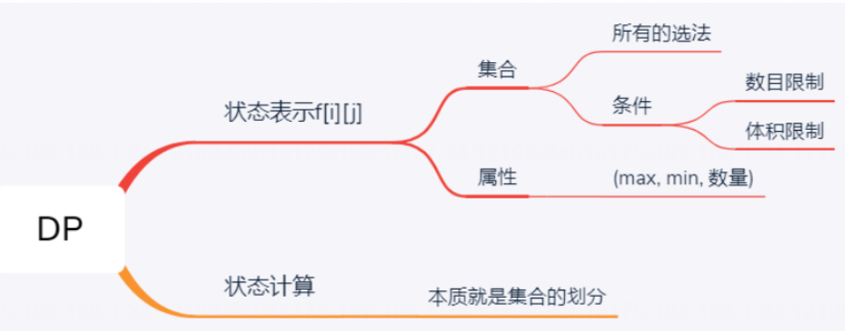

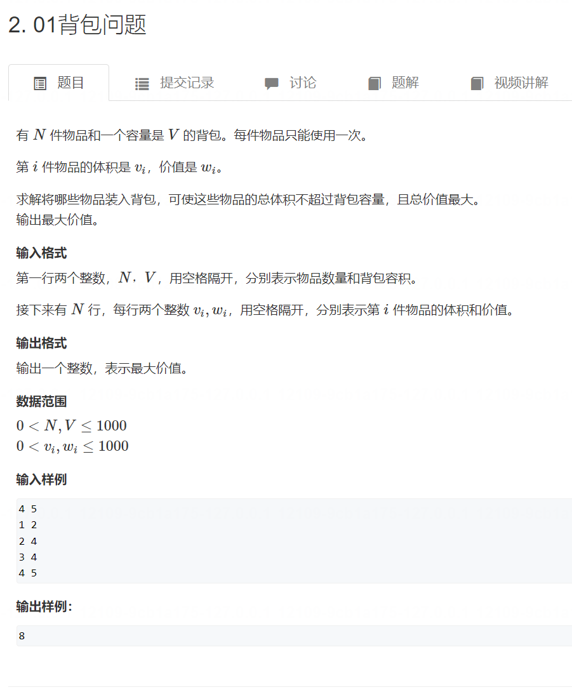

[原题链接](https://www.acwing.com/activity/content/problem/content/997/)
二维
```java
import java.util.*;

public class Main {
    static final int N = 1010; 
    static int n,m;
    static int[] w = new int[N];
    static int[] v = new int[N];
    static int[][] f = new int[N][N];
    
    public static void main(String[] args) {
        Scanner scanner = new Scanner(System.in);
        n = scanner.nextInt();
        m = scanner.nextInt();
        for (int i = 1; i <= n; i++) {
            v[i] = scanner.nextInt();
            w[i] = scanner.nextInt();
        }
        for (int i = 1; i <= n; i++) {
            for (int j = 0; j <= m; j++) {
                if (v[i] > j) {
                    f[i][j] = f[i-1][j];
                } else {
                    f[i][j] = Math.max(f[i-1][j],f[i-1][j-v[i]] + w[i]);
                }
            }
        }
        System.out.print(f[n][m]);
    }
}
```
一维
```java
import java.util.*;

public class Main {
    static final int N = 1010; 
    static int n,m;
    static int[] w = new int[N];
    static int[] v = new int[N];
    static int[] f = new int[N];
    
    public static void main(String[] args) {
        Scanner scanner = new Scanner(System.in);
        n = scanner.nextInt();
        m = scanner.nextInt();
        for (int i = 1; i <= n; i++) {
            v[i] = scanner.nextInt();
            w[i] = scanner.nextInt();
        }
        for (int i = 1; i <= n; i++) {
            for (int j = m; j >= 0; j--) {
                if (v[i] > j) {
                    f[j] = f[j];
                } else {
                    f[j] = Math.max(f[j],f[j-v[i]] + w[i]);
                }
            }
        }
        System.out.print(f[m]);
    }
}
```

## 2. 完全背包问题

> 两次优化才优化到一维

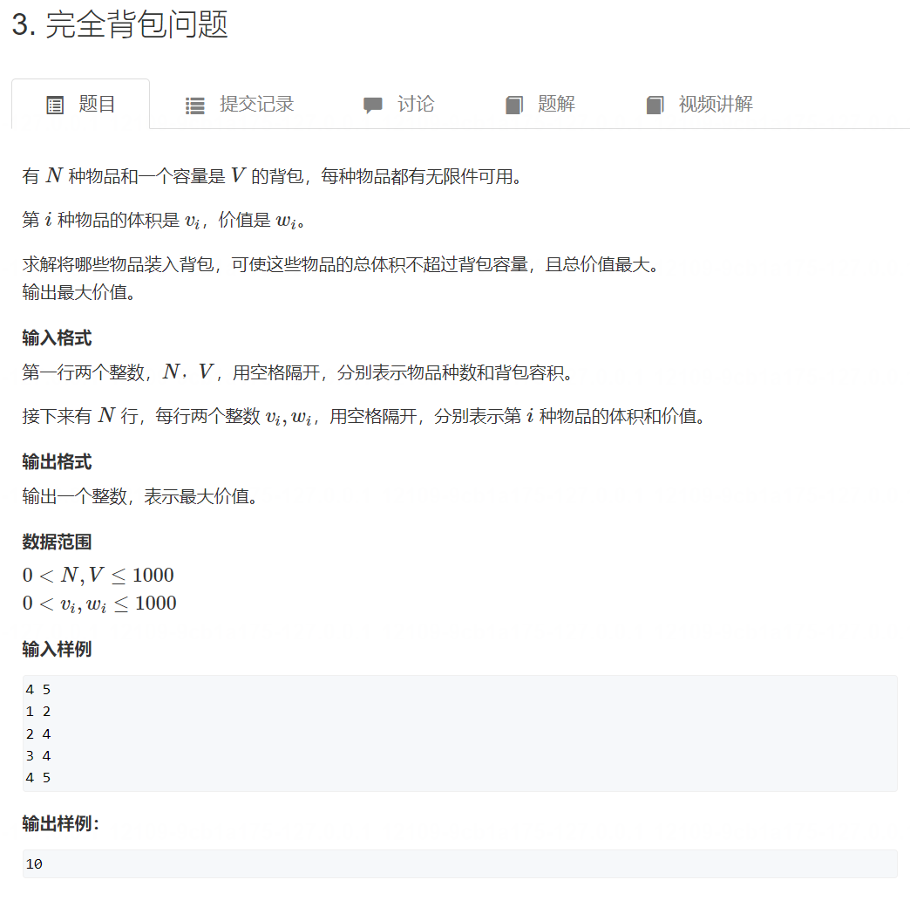


[原题链接](https://www.acwing.com/activity/content/problem/content/998/)
一、朴素做法（三重循环）

```java
import java.util.*;

public class Main {
    static int N = 1010;
    static int n,m;
    static int[] v = new int[N];
    static int[] w = new int[N];
    static int[][] f = new int[N][N];
    
    public static void main(String[] args) {
        Scanner scanner = new Scanner(System.in);
        n = scanner.nextInt();
        m = scanner.nextInt();
        for (int i = 1; i <= n; i++) {
            v[i] = scanner.nextInt();
            w[i] = scanner.nextInt();
        }
        for (int i = 1; i <= n; i++) {
            for (int j = 0; j <= m; j++) {
                if (j < v[i]) {
                    f[i][j] = f[i-1][j];
                } else {
                    for (int k = 0; k*v[i] <= j; k++) {
                        f[i][j] = Math.max(f[i][j],f[i-1][j-k*v[i]] + k*w[i]);
                    }
                }
            }
        }
        System.out.print(f[n][m]);
    }
}
```

二、二维数组的优化（理解f[i-1][j-k*v[i]]+w[i] 等价于 f[i][j-v[i]]+w[i]）

```java
import java.util.*;

public class Main {
    static int N = 1010;
    static int n,m;
    static int[] v = new int[N];
    static int[] w = new int[N];
    static int[][] f = new int[N][N];
    
    public static void main(String[] args) {
        Scanner scanner = new Scanner(System.in);
        n = scanner.nextInt();
        m = scanner.nextInt();
        for (int i = 1; i <= n; i++) {
            v[i] = scanner.nextInt();
            w[i] = scanner.nextInt();
        }
        for (int i = 1; i <= n; i++) {
            for (int j = 0; j <= m; j++) {
                if (j < v[i]) {
                    f[i][j] = f[i-1][j];
                } else {
                    f[i][j] = Math.max(f[i-1][j],f[i][j-v[i]] + w[i]);
                }
            }
        }
        System.out.print(f[n][m]);
    }
}
```


```cpp
#include<iostream>

using namespace std;

const int N = 1010;

int n,m;
int f[N];
int v[N],w[N];

int main()
{
    cin >> n >> m;
    
    for(int i = 1; i <= n; i++)cin >> v[i] >> w[i];
    
    for(int i = 1; i <= n; i++)
        for(int j = v[i]; j <= m; j++)
            f[j] = max(f[j],f[j-v[i]]+w[i]);
    
    cout << f[m];
    
    return 0;
}
```

二维

```cpp
#include<iostream>

using namespace std;

const int N = 1010;
int f[N][N];
int w[N];
int v[N];
int n,m;

int main()
{
    cin >> n >> m;
    for(int i = 1; i <= n; i++)
    {
        cin >> v[i] >> w[i];
    }
    
    for(int i = 1; i <= n; i++)
    {
        for(int j = 1; j <= m; j++)
        {
            if(j < v[i])
                f[i][j] = f[i-1][j];
            else
                f[i][j] = max(f[i-1][j],f[i][j-v[i]]+w[i]);
        }
    }
    cout << f[n][m];
    
    return 0;
}
```

一维
```java
import java.util.*;

public class Main {
    static int N = 1010;
    static int n,m;
    static int[] v = new int[N];
    static int[] w = new int[N];
    static int[] f = new int[N];
    
    public static void main(String[] args) {
        Scanner scanner = new Scanner(System.in);
        n = scanner.nextInt();
        m = scanner.nextInt();
        for (int i = 1; i <= n; i++) {
            v[i] = scanner.nextInt();
            w[i] = scanner.nextInt();
        }
        for (int i = 1; i <= n; i++) {
            for (int j = 0; j <= m; j++) {
                if (j < v[i]) {
                    f[j] = f[j];
                } else {
                    f[j] = Math.max(f[j],f[j-v[i]] + w[i]);
                }
            }
        }
        System.out.print(f[m]);
    }
}
```
怎么由二维变成一维
看更新f[i][j] 需要的是本行数据还是上行数据
## 3. 多重背包问题 I
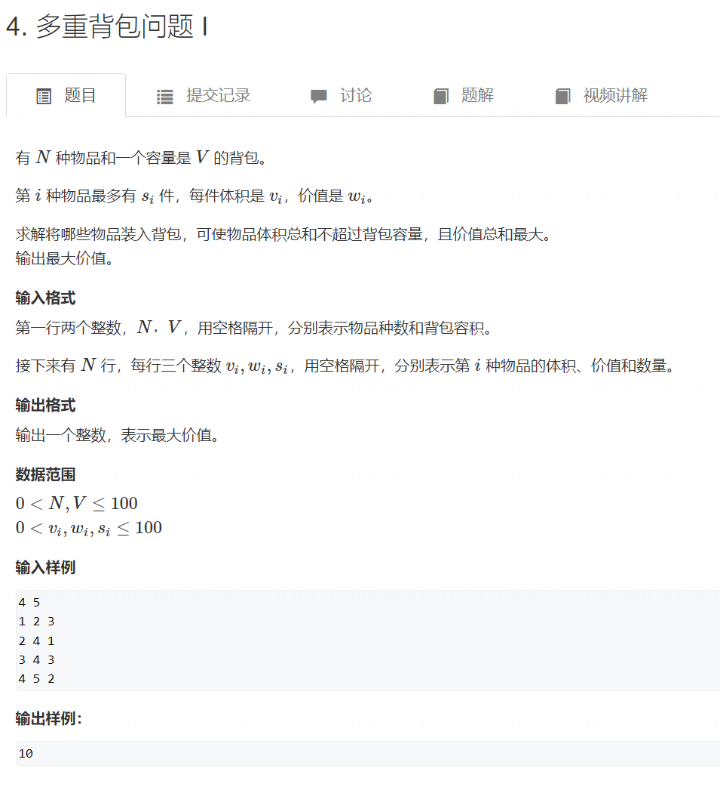

[原题链接](https://www.acwing.com/activity/content/problem/content/999/)
三重循环(针对的是f[i][j]处理)
★不需要处理j不够的情况
```java
import java.util.*;
public class Main{
    public static void main(String[] args){
        Scanner scan = new Scanner(System.in);
        int N = 110;
        int[] v = new int[N],w = new int[N],s = new int[N];
        int[][] f = new int[N][N];
        int n = scan.nextInt();
        int m = scan.nextInt();
        for(int i = 1 ; i <= n ; i ++ ){
            v[i] = scan.nextInt();
            w[i] = scan.nextInt();
            s[i] = scan.nextInt();
        }

        for(int i = 1 ; i <= n ; i ++ )
            for(int j = 0 ; j <= m ; j ++ )
                for(int k = 0 ; k <= s[i] && k * v[i] <= j; k ++ )
                     f[i][j] = Math.max(f[i][j], f[i - 1][j - k * v[i]] + k * w[i]);


        System.out.println(f[n][m]);
    }
}

```
## 4. 多重背包问题 II
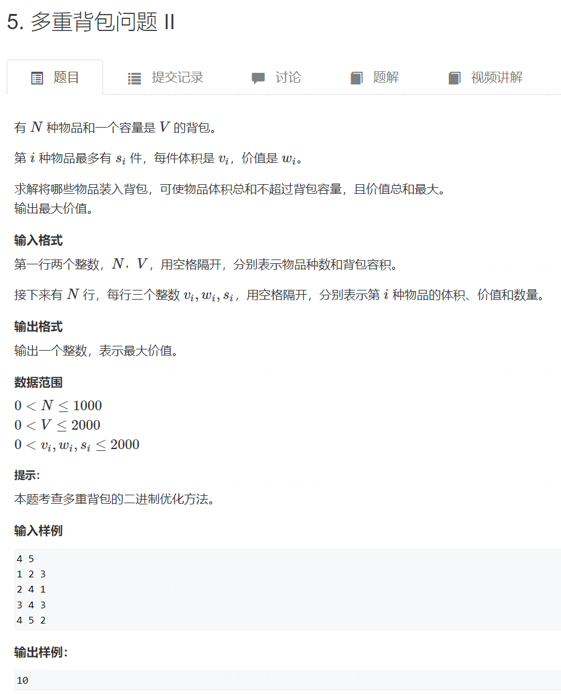

[原题链接](https://www.acwing.com/activity/content/problem/content/1000/)

```java
import java.util.*;
public class Main{
    public static void main(String[] ags){
        Scanner scan = new Scanner(System.in);
        int N = 12000;
        //为什么是12000呢，
        //因为是二进制，一个数最多就是2的12次方就会超过题目给的2000，所以给个将限制范围1000*12
        int[] v = new int[N];
        int[] w = new int[N];
        int[] f = new int[N];
        int n = scan.nextInt();
        int m = scan.nextInt();
        int cnt = 0;
        for(int i = 0 ; i < n ; i ++ ){
            int a = scan.nextInt();
            int b = scan.nextInt();
            int s = scan.nextInt();
            int k = 1;  // 相当于一开始给了个2的0次幂

            //这一步是将每一个s都分解成2的次幂个组合
            while(s >= k){
                cnt ++ ;  
                v[cnt] = a * k; //选择多少个数每一个都乘上
                w[cnt] = b * k; //同上
                s -= k;  // s 分解成2的0到k次                幂（小于s），
                k *= 2; // k每次都成2，就是2的倍数
            }

            //比如10，分成 1 2 4 如果加上8加能够凑出1-15个数，所以超过10，所以我们用10减去前面的数，剩下3
            //所以分成 1 2 4 3
            //下面这一步就是判断生下来的数是多少
            if(s > 0){
                cnt ++;
                v[cnt] = a * s;
                w[cnt] = b * s;
            }
        }

        n = cnt; // 将所有组合的值赋值给n

        //用01背包模板来完成这个选择，
        //01背包是前i个物品中选，总体积不超过j
        //这里是将每一种可能对应01背包，演变成01背包问题，不是 像 完全背包 那样所有的可能在一起计算，
        //比如f[i][j],前i个物品中选，不包含i还有包含1个i来比较最大值，，不包含i和包含两个i来比较最大值 以此类推
        //这样来判断
        for(int i = 1 ; i <= n ; i ++ )
            for(int j = m ; j >= v[i] ; j --)
                f[j] = Math.max(f[j],f[j - v[i]] + w[i]);

        System.out.println(f[m]);
    }
}
```
## 5. 分组背包问题
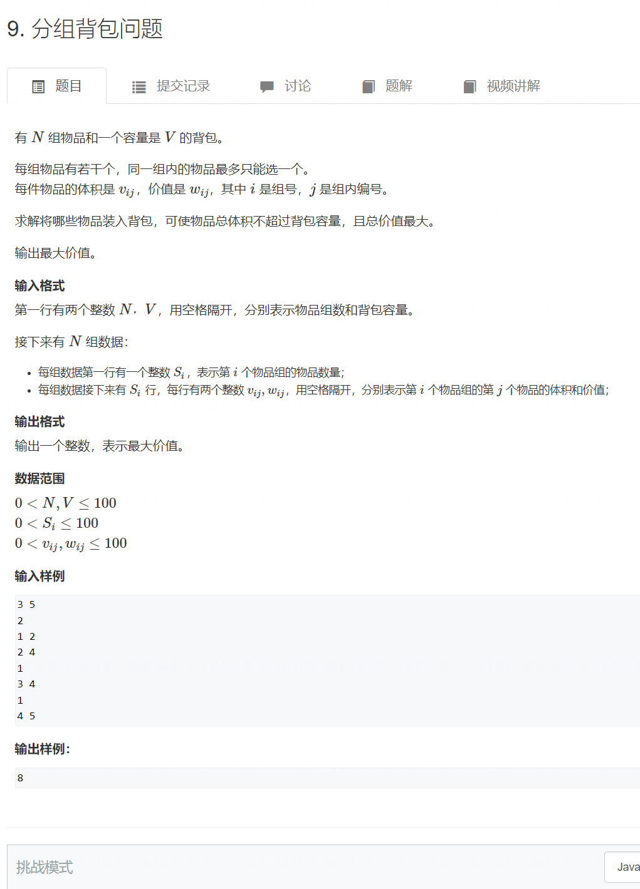

[原题链接](https://www.acwing.com/activity/content/problem/content/1001/)
二维

```java
import java.util.*;

class Main {
    
    static int N = 110;
    static int[] s = new int[N];
    static int[][] v = new int[N][N];
    static int[][] w = new int[N][N];
    static int[][] f = new int[N][N];
    
    
    public static void main(String[] args) {
        Scanner scan = new Scanner(System.in);
        int n = scan.nextInt();
        int m = scan.nextInt();
        for (int i = 1; i <= n; i++) {
            s[i] = scan.nextInt();
            for (int j = 1; j <= s[i]; j++) {
                v[i][j] = scan.nextInt();
                w[i][j] = scan.nextInt();
            }
        }
        
        for (int i = 1; i <= n ;i++) {
            for (int j = 1; j <= m; j++) {
                f[i][j] = f[i-1][j];
                for (int k = 0; k <= s[i]; k++) {
                    if (j >= v[i][k]) {
                        f[i][j] = Math.max(f[i][j],f[i-1][j-v[i][k]]+w[i][k]);
                    }
                }
            }
        }
        System.out.print(f[n][m]);
    }
}
```

一维
```cpp
#include <iostream>
#include <algorithm>

using namespace std;

const int N = 110;

int n, m;
int v[N][N], w[N][N], s[N];
int f[N];

int main()
{
    cin >> n >> m;

    for (int i = 1; i <= n; i ++ )
    {
        cin >> s[i];
        for (int j = 0; j < s[i]; j ++ )
            cin >> v[i][j] >> w[i][j];
    }

    for (int i = 1; i <= n; i ++ )
        for (int j = m; j >= 0; j -- )
            for (int k = 0; k < s[i]; k ++ )
                if (v[i][k] <= j)
                    f[j] = max(f[j], f[j - v[i][k]] + w[i][k]);

    cout << f[m] << endl;

    return 0;
}
```
# 二、线性DP
## 1. 数字三角形
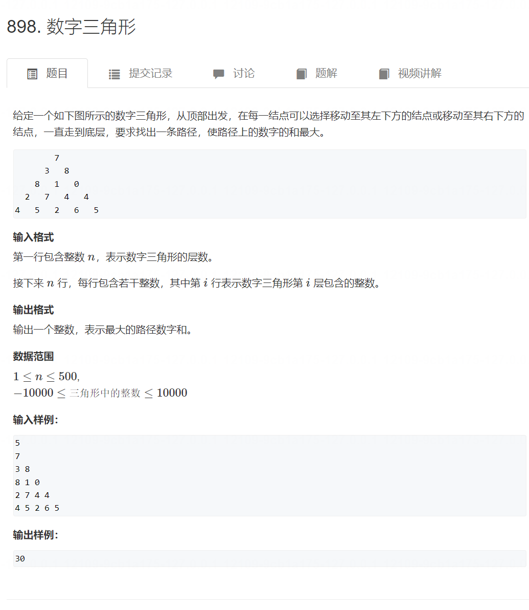

★f[i][j] 从下到上 走到f[i][j]的所有路径的最大值
[原题链接](https://www.acwing.com/activity/content/problem/content/1002/)
[原题链接](https://www.acwing.com/problem/content/900/)
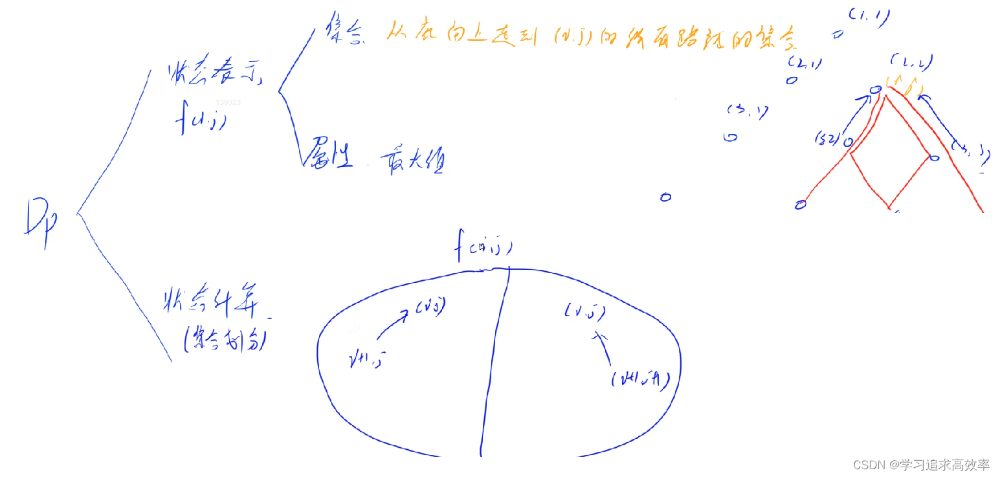

```java
import java.util.*;

class Main {
    
    static int N = 510;
    static int[][] num = new int[N][N];
    static int[][] f = new int[N][N];
    
    public static void main(String[] args) {
        Scanner scan = new Scanner(System.in);
        
        int n = scan.nextInt();
        
        for (int i = 1; i <= n; i++) {
            for (int j = 1; j <= i; j++) {
                num[i][j] = scan.nextInt();
            }
        }
        
        for (int i = n; i >= 1; i--) {
            for (int j = 1; j <= i; j++) {
                f[i][j] = Math.max(f[i+1][j],f[i+1][j+1]) + num[i][j];
            }
        }
        
        System.out.print(f[1][1]);
        
    }
}
```

## 2. 最长上升子序列 
[原题链接](https://www.acwing.com/activity/content/problem/content/1003/)

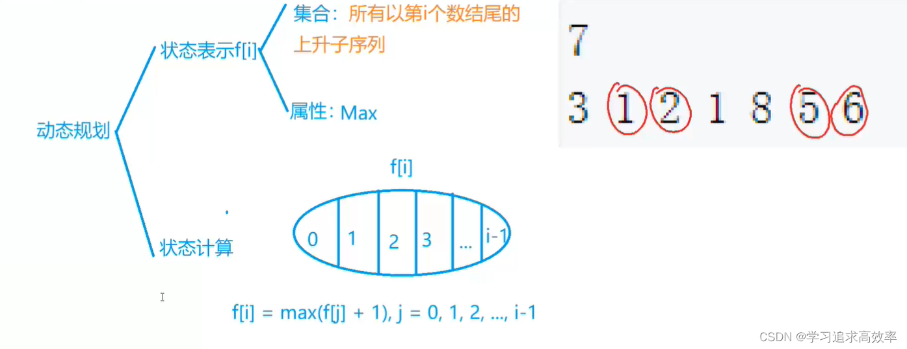

```java
import java.util.*;

public class Main {
    static int D = 1010;
    static int N;
    static int nums[] = new int[D];
    static int f[] = new int[D];
    static int ans = 0;
    
    public static void main(String[] args) {
        Scanner scanner = new Scanner(System.in);
        N = scanner.nextInt();
        for (int i = 1; i <= N; i++) nums[i] = scanner.nextInt();
        nums[0] = -0x3f3f3f3f;
        
        for (int i = 1; i <= N; i++) {
            for (int j = 0; j < i; j++) {
                if (nums[j] < nums[i]) {
                    f[i] = Math.max(f[i],f[j] + 1);
                    ans = Math.max(ans,f[i]);
                }
            }
        }
        System.out.print(ans);
    }
}
```
## 3.  最长上升子序列 II  
[原题链接](https://www.acwing.com/activity/content/problem/content/1004/)
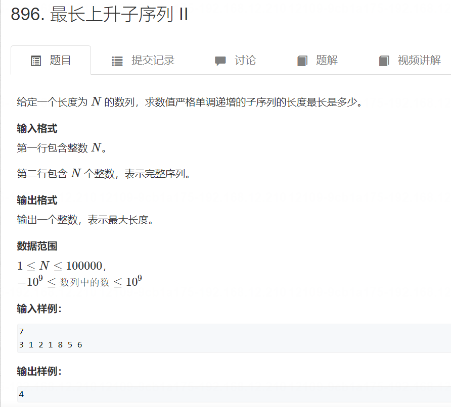

```java
import java.util.*;

class Main {
    
    static int N = (int)1e5+10;
    static int[] a = new int[N], f = new int[N];
    static int[] q = new int[N];
    static int len;
    static int n;
    
    public static void main(String[] args) {
        
        Scanner scan = new Scanner(System.in);
        n = scan.nextInt();
        for (int i = 1; i <= n; i++) {
            a[i] = scan.nextInt();
        }
        for (int i = 1; i <= n; i++) {
            int l = 0, r = len;
            while (l < r) {
                int mid = l+r+1 >> 1;
                if (a[q[mid]] < a[i]) {
                    l = mid;
                } else {
                    r = mid-1;
                }
            }
            len = Math.max(len, r+1);
            q[r+1] = i;
            f[i] = f[q[r]] + 1;

        }
        int ans = 0;
        for (int i = 1; i <= n; i++) {
            ans = Math.max(ans, f[i]);
        }
        System.out.print(ans);
    }
    
}
```

```java
import java.util.*;

class Main {
    
    static int N = (int)1e5+10;
    static int[] a = new int[N];
    static int[] q = new int[N];
    static int len;
    static int n;
    
    public static void main(String[] args) {
        
        Scanner scan = new Scanner(System.in);
        n = scan.nextInt();
        for (int i = 1; i <= n; i++) {
            a[i] = scan.nextInt();
        }
        for (int i = 1; i <= n; i++) {
            int l = 0, r = len;
            while (l < r) {
                int mid = l+r+1 >> 1;
                if (a[q[mid]] < a[i]) {
                    l = mid;
                } else {
                    r = mid-1;
                }
            }
            len = Math.max(len, r+1);
            q[r+1] = i;
        }
        System.out.print(len);
    }
    
}
```


## 4. 最长公共子序列

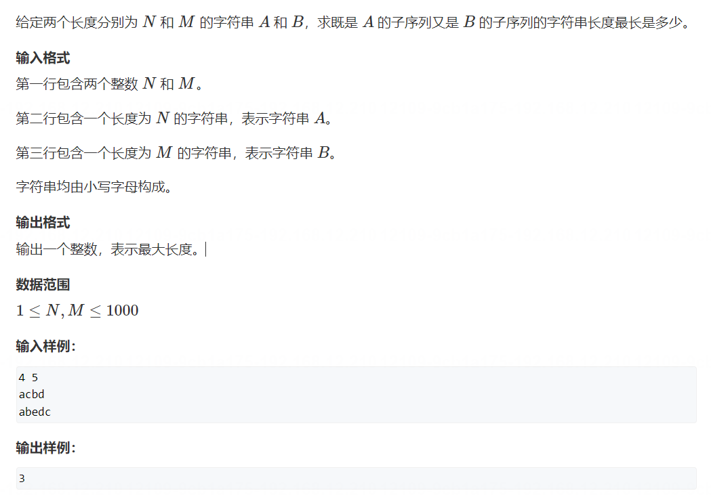

f[i][j]表示a的前i个字母，和b的前j个字母的最长公共子序列长度

[原题链接](https://www.acwing.com/activity/content/problem/content/1005/)

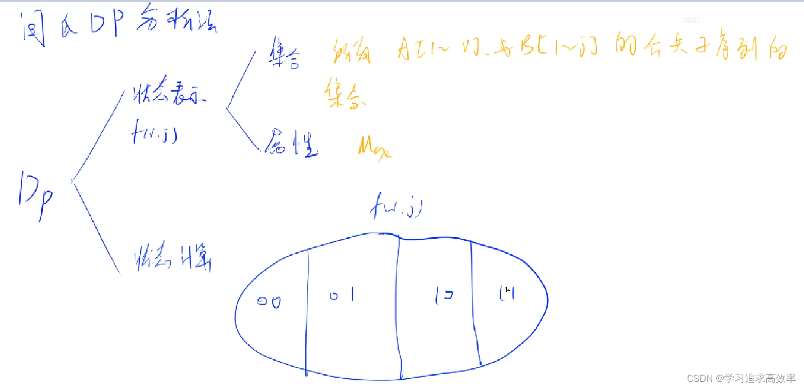
>1. f[i][j] 表示什么需要先想清楚。
>表示的是：在i，j组合的情况下，的最大子串 长度
>所以当 i，j相等时
>`f[i][j] = f[i-1][j-1] + 1`
>不相等的时候
>`f[i][j] = max(f[i-1][j],f[i][j-1]);`

```java
import java.util.*;
public class Main{
    public static void main(String[] args){
        Scanner scan = new Scanner(System.in);
        int N = 1010;
        char[] a = new char[N]; 
        char[] b = new char[N];
        int[][] f = new int[N][N];
        int n = scan.nextInt();
        int m = scan.nextInt();
        String A = scan.next();
        String B = scan.next();
        for(int i = 1 ; i <= n ; i ++ ) a[i] = A.charAt(i - 1);
        for(int i = 1 ; i <= m ; i ++ ) b[i] = B.charAt(i - 1);

        //本来还有一种方案就是ai和bj都不包含
        //包含ai不包含bj --和--  不包含ai包含bj 这两种方案已经包含了上面的所有可能
        //所以不用重复比较，省略
        for(int i = 1 ; i <= n ; i ++ ){
            for(int j = 1 ; j <= m ; j ++ ){
                //包含ai不包含aj --和--  不包含ai包含bj 这两种方案之间比较一下最大公共子序列
                f[i][j] = Math.max(f[i - 1][j] , f[i][j - 1]);
                //最后一种可能就是ai和bj都包含，不一定存在，需要满足ai == bj时候才满足
                if(a[i] == b[j])
                    f[i][j] = Math.max(f[i][j], f[i - 1][j - 1] + 1);
            }
        }
        //最后输出，从定义出发，输出在【1 - ai】和【1 - bj】两个之间的最长公共子序列
        System.out.println(f[n][m]);
    }
}
```
## 5. 最短编辑距离
[原题链接](https://www.acwing.com/activity/content/problem/content/1094/)
>1. 由于需要用到前面的数据，所以一定用dp
>2. i j 相等则 在 i - 1 j-1 的基础 +1
>3. 如果不相等 则按着 所可以操作的步骤 + 1
```java
import java.util.*;
public class Main{
    public static void main(String[] args){
        Scanner scan = new Scanner(System.in);
        int N = 1010;
        char[] a = new char[N];
        char[] b = new char[N];
        int[][] f = new int[N][N];

        int n = scan.nextInt();
        String A = scan.next();
        int m = scan.nextInt();
        String B = scan.next();

        for(int i = 1 ; i <= n ; i ++ ) {
            a[i] = A.charAt(i - 1);
            f[i][0] = i;    // 处理边界,字符串b是0,a进行n次删除
        }
        for(int i = 1 ; i <= m ; i ++ ){
            b[i] = B.charAt(i - 1);
            f[0][i] = i;   // 处理边界,字符串a是0,a进行m次增加
        } 

        for(int i = 1 ; i <= n ; i ++ ){
            for(int j = 1 ; j <= m ; j ++ ){
                // 删除和增加操作
                f[i][j] = Math.min(f[i - 1][j] + 1, f[i][j - 1] + 1);
                // 最后一个数相同，不用进行修改操作，则不用加1
                if(a[i] == b[j]) f[i][j] = Math.min(f[i][j],f[i - 1][j - 1]); 
                else f[i][j] = Math.min(f[i][j],f[i - 1][j - 1] + 1); // 修改操作
            }
        }
        System.out.println(f[n][m]);
    }
}
```
## 6. 编辑距离
[原题链接](https://www.acwing.com/activity/content/problem/content/1006/)
# 三、区间dp

```cpp
for (int len = 1; len <= n; len++) {         // 区间长度
    for (int i = 1; i + len - 1 <= n; i++) { // 枚举起点
        int j = i + len - 1;                 // 区间终点
        if (len == 1) {
            dp[i][j] = 初始值
            continue;
        }

        for (int k = i; k < j; k++) {        // 枚举分割点，构造状态转移方程
            dp[i][j] = min(dp[i][j], dp[i][k] + dp[k + 1][j] + w[i][j]);
        }
    }
}
```

## 1. 石子合并
>1. 从i 到 j 合并 最终 一定是 i j 的区间和
>但是划分的时候，不一定用哪一段最小值，所以遍历一下区间，也就是这个题的关键
>[原题链接](https://www.acwing.com/activity/content/problem/content/1007/)
>[原题链接](https://www.acwing.com/problem/content/284/)
>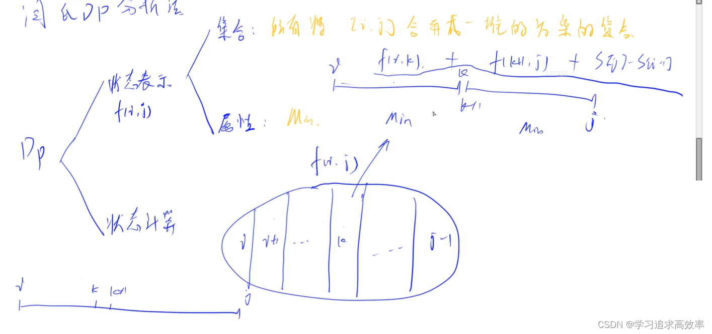
```java
import java.util.*;
public class Main{
    public static void main(String[] args){
        Scanner scan = new Scanner(System.in);
        int N = 310;
        int[] s = new int[N];
        int[][] f = new int[N][N];

        int n = scan.nextInt();

        for(int i = 1 ; i <= n ; i ++ ) s[i] = scan.nextInt();
        for(int i = 1 ; i <= n ; i ++ ) s[i] += s[i - 1]; // 前缀和
        //这里是枚举的每种长度,比如n等于4,比如长度3，右边下标不超过n，求f[1-3]和f[2-4]里面的最小值
        for(int len =  2 ; len <= n ; len ++ ){
            for(int i = 1; i + len - 1 <= n ; i ++ ){
                int j = i + len -  1; // 每种长度的j
                //因为要枚举的是k里面的最小值，所以赋一个很大的数，
                //如果没有赋最大的数，你的f[i][j] 初始值是0，所以最小是永远会被是0，最后输出也会是0  
                f[i][j] = (int)1e9; 
                //这里k是从i开始到j-1结束
                for(int k = i ; k < j ; k ++ ){
                    f[i][j] = Math.min(f[i][j],f[i][k] + f[k + 1][j] + (s[j] - s[i - 1]));
                }
            }
        }
        System.out.println(f[1][n]);
    }
}
```

# 四、计数类DP
## 1. 整数划分
### f（i，j）表示前i个物品，恰好加到j的方案数
#### 等于不拿第i个物品的方案数+拿一个i物品的方案数量+。。。+
[原题链接](https://www.acwing.com/activity/content/problem/content/1008/)
```java
public class Main{
    public static final int N = 1010;
    public static final int M = (int) (1e9 + 7);

    public static void main(String[] args){
        Scanner scan = new Scanner(System.in);
        int n = scan.nextInt();
        int[][] dp = new int[N][N];
        dp[0][0] = 1;//一个数都不选是一种方案

        for(int i=1; i<=n; i++){
            for(int j=0; j<=n; j++){
                for(int k=0; j - k * i >= 0; k++){
                    dp[i][j] += dp[i - 1][j - k * i];
                    dp[i][j] %= M;
                }
            }
        }

        System.out.println(dp[n][n]);
    }
}
```

# 五、数位统计dp
## 1. 计数问题
[原题链接](https://www.acwing.com/activity/content/problem/content/1009/)
[计数问题---超短写法](https://www.acwing.com/solution/content/7128/)
[dp方法](https://www.acwing.com/solution/content/5623/)

```cpp
# include <iostream>
# include <cmath>
using namespace std;

int dgt(int n) // 计算整数n有多少位
{
    int res = 0;
    while (n) ++ res, n /= 10;
    return res;
}

int cnt(int n, int i) // 计算从1到n的整数中数字i出现多少次 
{
    int res = 0, d = dgt(n);
    for (int j = 1; j <= d; ++ j) // 从右到左第j位上数字i出现多少次
    {
        // l和r是第j位左边和右边的整数 (视频中的abc和efg); dj是第j位的数字
        int p = pow(10, j - 1), l = n / p / 10, r = n % p, dj = n / p % 10;
        // 计算第j位左边的整数小于l (视频中xxx = 000 ~ abc - 1)的情况
        if (i) res += l * p; 
        if (!i && l) res += (l - 1) * p; // 如果i = 0, 左边高位不能全为0(视频中xxx = 001 ~ abc - 1)
        // 计算第j位左边的整数等于l (视频中xxx = abc)的情况
        if ( (dj > i) && (i || l) ) res += p;
        if ( (dj == i) && (i || l) ) res += r + 1;
    }
    return res;
}

int main()
{
    int a, b;
    while (cin >> a >> b , a)
    {
        if (a > b) swap(a, b);
        for (int i = 0; i <= 9; ++ i) cout << cnt(b, i) - cnt(a - 1, i) << ' ';
        cout << endl;
    }
    return 0;
}
```

# 六、状态压缩DP
#### 1. 蒙德里安的梦想
###### ★f[i][j]  表示已经将前 i -1 列摆好，且从第i−1列，伸出到第 i 列的状态是 j 的所有方案
[蒙德里安的梦想 ](https://www.acwing.com/activity/content/problem/content/1010/)

```java
import java.util.*;
public class Main{
    public static void main(String[] args){
        Scanner scan = new Scanner(System.in);
        int N = 12,M = 1 << N;
        long[][] f = new long[N][M];
        int[][] state = new int[M][M];
        boolean[] st = new boolean[M];

        while(true){
            int n = scan.nextInt();
            int m = scan.nextInt();
            if(n == 0 && m == 0){ // 如果n跟m同时为0结束循环
                break;
            }
            for(int i = 0 ; i < 1 << n ; i ++ ){
                int cnt = 0; // 表示的是当前前面0的个数
                boolean flag = true;//表示合法
                for(int j = 0 ; j < n ; j ++ ){ // 从上到下判断有多少个0
                    //判断现在这一位是不是1
                    if((i >> j & 1) == 1){ 
                        //如果是1，判断一下1前面的0的个数是不是偶数，奇数就结束
                        if((cnt & 1) == 1){ // 判断一个数是不是奇数，&1等于1就是奇数，反之就是偶数
                            flag = false;
                            break;
                        }
                        cnt = 0;
                    }else cnt ++ ; // 如果当前不是1，0的个数+1
                } 
                //最后还需要判断一下最后一层0的个数是不是奇数
                    if((cnt & 1) == 1) flag = false;
                    st[i] = flag; // 最后将这一种状态存入st数组，表示true合法或者false非合法
            }
            //这是i-1 到 i列的方块
            for(int i = 0 ; i < 1 << n  ; i ++ ){
                Arrays.fill(state[i],0); // 将所有的状态清零，因为多组数据，防止上一组数据的影响
                //这是i-2到i-1列的方块
                for(int j = 0 ; j < 1 << n ; j ++ ){
                    if((i & j) == 0 && st[i | j] ){ // 满足这两个条件的方案合法
                                                    //1、i跟j没有相交，2、i-1列的空格数是不是偶数
                        state[i][j] = 1; // 表示这种方案是合法的，用1表示，0表示不合法
                    }
                }
            }
            for(int i = 0 ; i < N ; i ++ )
                Arrays.fill(f[i],0); // 因为有多组数据，防止上一组数据的干扰，所以清零
            f[0][0] = 1; // 什么都没有时候，空着表示一种方案
            //最后的dp部分
            //为什么从1开始呢，因为从0开始的话，我们定义的f[m][j]就是前i - 1列已经摆好
            //如果是0开始，就会从-1个开始摆好，因为我们没有-1列，所以从1开始
            for(int i = 1 ; i <= m ; i ++ ){ 
                //枚举i - 1 到 i的所有方案
                for(int j = 0 ; j < 1 << n ; j ++ ){
                    //枚举i - 2 到 i - 1 的所有方案
                    for(int k = 0 ; k < 1 << n ; k ++ ){
                        //现在的方案等于前面每种k方案的总和
                        if(state[j][k] == 1) f[i][j] += f[i - 1][k];
                    }
                }
            }
            System.out.println(f[m][0]);
        }
    }
}
```

#### 2. 最短Hamilton路径
[最短Hamilton路径](https://www.acwing.com/activity/content/problem/content/1011/)
###### ★f[i][j] 所有从0走到j,所用的点是i的状态的所有路径.

```java
import java.util.*;
public class Main{
    public static void main(String[] args){
        Scanner scan = new Scanner(System.in);
        int N = 20,M = 1 << N;
        int[][] f = new int[M][N];//当前的状态是i，然后走到了点j上面
        int[][] w = new int[N][N];
        int n = scan.nextInt();
        for(int i = 0 ; i < n ; i ++ )
            for(int j = 0 ; j < n ; j ++ )  
                w[i][j] = scan.nextInt(); // 输入每一步的权重

        for(int i = 0 ; i < 1 << n ; i ++ )
            Arrays.fill(f[i],0x3f3f3f); //除了第一个点，其他点初始化成正无穷
        f[1][0] = 0;

        //首先枚举一下所有的状态
        for(int state = 0 ; state < 1 << n ; state ++ ){
            //一共有多少步
            for(int j = 0 ; j < n ; j ++ ){
                // 表示能够走到j,才能进行下一步
                if((state >> j & 1) == 1){ 
                    //我们用倒数第二步来化整为零

                    for(int k = 0 ; k < n ; k ++ ){
                        //首先减掉最后一个点剩下的路径中要能够走到k才能够进行状态计算
                        if((state - (1 << j) >> k & 1) == 1){
                            //0 - k - j的途径 f[state - (1 << j)][k] + w[k][j]
                            f[state][j] = Math.min(f[state][j],f[state - (1 << j)][k] + w[k][j]);
                        }
                    }
                }
            }
        }
        //最后输出从定义出发，不难想到，f[state][j],state表示的是二进制的全0表示都走过，j表示从0走到n-1
        System.out.println(f[(1 << n) - 1][n - 1]);
    }
}
```

# 七、树形DP
#### 1. ☆ 没有上司的舞会
###### ★f[i][0]所有以u为根的子树中选择,并且不选这个点的方案
###### ★f[i][1]所有以u为根的子树中选择,选这个点的方案
[没有上司的舞会](https://www.acwing.com/solution/content/105019/)

```java
import java.util.*;
public class Main{
    static int N = 6010,n,idx;
    static int[] happy = new int[N];//每一个职员的快乐指数
    static int[][] f = new int[N][2];
    static int[] h = new int[N],e = new int[N],ne = new int[N];
    static boolean[] st = new boolean[N];//存有负节点的
    //领接表
    public static void add(int a,int b){
        e[idx] = b;
        ne[idx] = h[a];
        h[a] = idx ++;
    }
    public static void dfs(int u){
        //最坏程度就是那个点不选，就是快乐指数为0
        //f[u][0] = 0;
        f[u][1] = happy[u];//如果这个点是选的所有，需要加上这个点的快乐指数

        for(int i = h[u]; i != -1 ; i = ne[i]){
            int j = e[i];
            dfs(j);
            f[u][0] += Math.max(f[j][0],f[j][1]);//如果这个根节点不选，就等于他的所有根节点选与不选的最大值之和
            f[u][1] += f[j][0]; //如果这个根节点选，就等于他的所有根节点不选的和

        }
    }
    public static void main(String[] args){
        Scanner scan = new Scanner(System.in);
        n = scan.nextInt();
        for(int i = 1 ; i <= n ; i ++ ) happy[i] = scan.nextInt();

        Arrays.fill(h,-1);

        for(int i = 0 ; i < n - 1 ; i ++ ){
            int a = scan.nextInt();
            int b = scan.nextInt();
            add(b,a);//因为b是a的直系上司，所以需要b->a
            st[a] = true;//下司就是负节点
        }

        int root = 1;
        while(st[root]) root ++ ; //寻找根节点

        dfs(root); 
        //最后输出的是选根节点跟不选根节点两种方案的最大值
        System.out.println(Math.max(f[root][0],f[root][1]));
    }
}
```

# 八、记忆化搜索
#### 1. 滑雪
###### ★f[i][j] 以(i,j)开始的路径最大值
[原题链接](https://www.acwing.com/activity/content/problem/content/1013/)
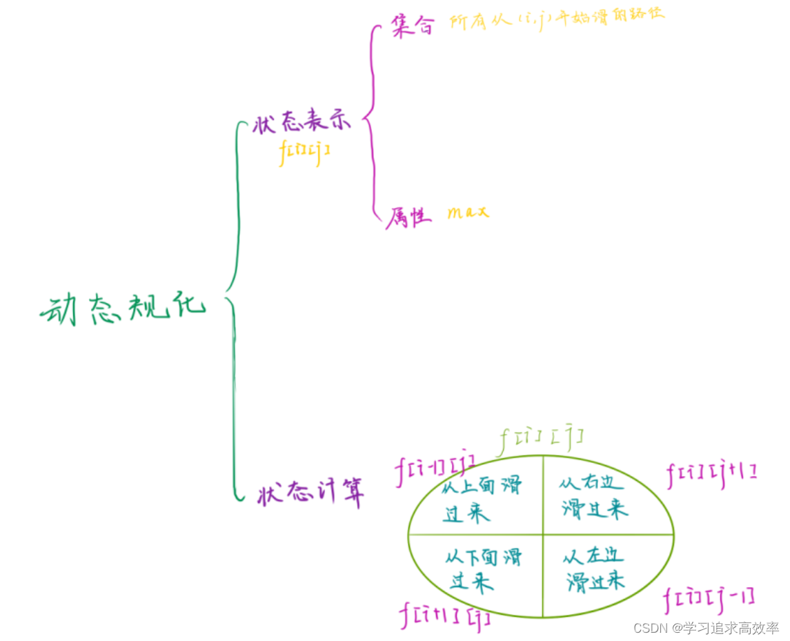

```java
import java.util.Arrays;
import java.util.Scanner;

public class Main {
    static int N = 310;
    static int n,m;
    static int[][] h = new int[N][N];
    static int[][] f = new int[N][N];
    static int[] dx = new int[] {0,-1,0,1};
    static int[] dy = new int[] {-1,0,1,0};
    static int dfs(int x,int y)
    {
        if(f[x][y] != -1) return f[x][y];

        f[x][y] = 1;
        for(int i = 0;i < 4;i ++)
        {
            int a = x + dx[i];
            int b = y + dy[i];
            if(a < 0 || a >= n || b < 0 || b >= m) continue;
            if(h[x][y] > h[a][b]) f[x][y] = Math.max(f[x][y], dfs(a,b) + 1);
        }
        return f[x][y];
    }
    public static void main(String[] args) {
        Scanner scan = new Scanner(System.in);
        n = scan.nextInt();
        m = scan.nextInt();
        for(int i = 0;i < n;i ++)
        {
            for(int j = 0;j < m;j ++)
                h[i][j] = scan.nextInt();
        }

        for(int i = 0;i < n;i ++) Arrays.fill(f[i], -1);

        int res = 0;
        for(int i = 0;i < n;i ++)
        {
            for(int j = 0;j < m;j ++)
            {
                res = Math.max(res, dfs(i,j));
            }
        }
        System.out.println(res);
    }
}
```