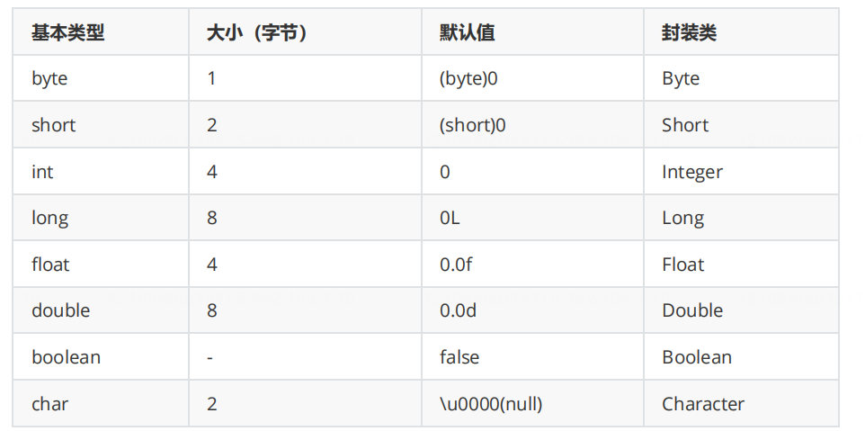

# Java基础面试题

## 1. Java多继承

1. 概念：继承、菱形继承
3. 解决方案：1、组合类 2、接口

## 2. 面向对象编程和面向过程编程

> 面向过程编程：面向方法编程。洗衣服，面向对象只关注按键，面向过程关注过程。

1. 是什么：OOP是一种编程范式、属性和行为组装成一起为对象处理问题、通过类定义模版，并利用继承、多态构建软件系统，更加贴近人类对现实世界的认知，有效维护软件
2. 核心概念：对象、类、封装、继承、多态（方法重写和方法重载）
3. 优点：代码复用性高、可维护性好、可扩展性强、更加贴近现实世界的建模方式
4. 设计原则：单一原则、开放封闭原则、里氏替换原则、接口隔离原则、依赖导致原则、迪米特法则

## 3. 抽象类和接口

>区别：1、扩展规则 2、访问控制符（接口方法：public 参数：public static final） 3、方法实现 4、使用目的（抽象类是为了代码的复用 接口是为了定义规范）
>
>区别：
>
>1. 扩展规则：类单继承、接口多实现
>2. 访问控制符：类都可以、接口方法：public 参数：public static final
>3. 定义关键词：abstract、interface
>4. 方法实现：
>5. 使用目的：接口是协议、抽象类是模板
>
>**接口是协议，调用方无需关心实现细节，实现方维护底层实现，在实现发生变更时，调用方无需感知;**
>
>**抽象类是模版，即一些类共有的部分可以抽象出来，提高代码复用，便于子类扩展**

## 4. 方法重载与返回值的关系？

>不算的原因：
>
>1. JVM的方法签名的规定：参数个数、参数的类型、方法名
>2. 不知道调用哪个

## 5. 方法重载和方法重写？

>区别：
>
>1. 位置
>2. 参数要求
>3. 参数要求
>4. 使用目的
>5. 静态绑定和动态绑定（多态）

## 6. ==和equals？

>基本数据类型：==的作用是比较值。equals的作用也是比较值（需要重写）

>引用类型：==用于比较引用地址，equals也是用于比较地址，但是常重写用于比较值
## 7. final、finally、finalize?

>final:修饰类、方法、变量
>finally:try-catch中无论是否发生异常都执行，用于释放资源，关闭连接
>finalize：手动释放资源

## 8. String底层？

>final+（char后面是byte）数组

## 9. String被final修饰？

>1、线程安全 2、键值对的保障 3、效率

## 10. String、stringBuilder、stringBuffer?

>String:不可变，适合少量字符串操作。
>StringBuffer:可变且线程安全，适合多线程环境中的频繁字符串修改。
>StringBuilder:可变目非线程安全，适合单线程环境中的高性能字符串处理。
>
>**细节:由于StringBuffer和StringBuilder底层是数组实现，所以会涉及到扩容的机制，如果在使用时知道大概的数据量，在创建实例时可以给其赋予初始大小，减少扩容次数，提高性能**

## 11. 包装类和基本类型

>为什么要用包装类：
>
>1. oop的要求
>2. 泛型要求
>3. 可以提供额外方法 
>4. null
>
>
>
>Java中有8种基本数据类型：
>
>boolean Boolean、byte Byte 1、short Short 2、int Integer 4、long Long 8、float Float 4、double Double 8、char Character 2
>
>
>
>**基本数据类型和包装数据类型区别:**
>
>1. 效率不同：
>     基本数据类型占用内存小，效率高，可频繁做简单的操作
>     包装类型:因为是对象，涉及到内存分配和垃圾回收，性能相对较低
>
>2. 默认值不同：
>
>   基本数据类型:0或false等
>
>   包装类型:默认null
>
>3. 比较方式不同：
>
>   基本数据类型:通过=来比较值是否相等，
>
>   包装类型=是比较对象的地址，equles()是比较对象的值
>
>4. 初始化不同：
>
>   基本数据类型:直接=号复制就行
>
>   包装类型:需要new对象的方式
>
>5. 存储位置不同：
>
>   基本数据类型:存储位置根据作用域和声明方式。局部变量存放在栈上，成员变量存放在堆中
>   包装类型:存放在堆中

## 12. 泛型、类型擦除、上下界限定符

>范型：参数化类型，使代码更灵活
>
>类型擦除：编译时，范型擦除，比如都被当作ArrayList。兼容性、性能
>
>上下界限定符：Java泛型的上下界限定符用于对泛型类型参数进行范围限制，上界限定符(?extends T)表示通配符只能是T类型或者T的子类，下界限定符(?super T)表示通配符只能是T类型或者T类型的父类;

## 13. Java值传递

>值传递

## 14. Exception和Error？

>联系：Exception 和 Error 都是继承于 Throwable 的子类
>Exception：由应用程序引起可处理、可恢复的异常（I0Exception、S5QLException、NullPointerException、Index0utOfBoundsException）
>Error : JVM 引起，不可恢复的错误
>区别：异常级别不同、来源不同、代码处理方式不同，以及对程序的影响程度不同等方面。

## 15. 反射？

>- 是什么：
>  - 反射(Reflection)是指在程序运行时获取和操作类的一种能力。
>- 反射的原理：
>  - Java类加载：java类加载就是类加载器根据类的全限定名把.==class的二进制字节码代表的静态存储结构转化为方法区的运行时数据结构，然后在内存中生成代表该类的Class对象，一个类有且只有一个Class对象。每次生成Java对象实际上都是通过这个Class对象获取整个类的结构并生成相应的java对象==。(接口和抽象类也会被加载为class对象)==所以如果能够在运行时拿到Class对象，就可以生成java对象并进行调用，这就是java反射的本质。==
> - 为什么需要反射：
>   - 【1.有的类不能通过new 2.性能更好 3.通用性框架的需要】
> - 反射的缺点:
>   - 性能开销 - 由于反射涉及动态解析的类型，因此无法执行某些 Java 虚拟机优化。因此，反射操作的性能要比非反射操作的性能要差，应该在性能敏感的应用程序中频繁调用的代码段中避免。
>   - 破坏封装性 - 反射调用方法时可以忽略权限检查，因此可能会破坏封装性而导致安全问题。
>  - 内部曝光 - 由于反射允许代码执行在非反射代码中非法的操作，例如访问私有字段和方法，所以反射的使用可能会导致意想不到的副作用，这可能会导致代码功能失常并可能破坏可移植性。反射代码打破了抽象，因此可能会随着平台的升级而改变行为。


>场景：
>
>1. **框架开发**：
>   - Spring 框架通过反射实现依赖注入（DI）和面向切面编程（AOP）。
>   - Hibernate 框架通过反射实现对象关系映射（ORM）。
>2. **单元测试**：
>   - JUnit 通过反射调用测试方法。
>3. **动态代理**：
>   - JDK 动态代理基于反射实现。
>4. **配置文件解析**：
>   - 通过反射动态加载配置文件中指定的类和方法。

## 16. 反射执行慢?

>1、因为是动态的，性能消耗大 
>2、安全性检查 
>3、方法调用不是直接调用，而是通过Method的方法调用 
>4、每次调用都需要重新获取Method的方法

## 17. 代理？

>- 什么是代理：代理就是通过代理对象去访问实际的目标对象，比如我们在生活中租房，可以直接找房东，也可以通过某些租房平台去租房，通过租房平台的这种方式就是代理。在java中这种租房平台就被叫做代理类，==代理通常用于控制对对象的访问，以便在访问对象时可以添加额外的功能，例如日志记录、性能监控、安全检查等==。据我所知java中的代理方式有静态代理和动态代理。
>- 静态代理：在静态代理中，代理类在编译时就已经确定，并且为每个被代理的类创建一个代理类。静态代理需要为每个被代理的类编写一个代理类，这样会导致代码冗余和维护困难。
>- 动态代理：动态代理是在运行时动态生成代理类，而不需要手动编写代理类。Java中的动态代理是通过反射机制实现的，可以在运行时为接口创建代理对象，而无需为每个接口编写代理类。动态代理可以更灵活地处理代理逻辑，减少重复代码，提高代码的可维护性。（动态代理有基于接口的jdk实现方式、也有基于类的CGlib实现方式）
>- 使用场景:平常我的业务代码中虽然几乎没有使用过动态代理，但是我工作中使用的Spring系列框架中的AOP，以及RPC框架中都用到了动态代理，以AOP为例，AOP通过动态代理对目标对象进行了增强，比如我们最常用的前置通知、后置通知等。
### JDK 动态代理和 CGLIB 动态代理有什么区别?

1. JDK 动态代理: 基于Java反射机制实现,只能代理实现了接口的类,通过实现 InvocationHandler 接口进行方法增强操作, 通过 Proxy 创建代理对象.
2. CGLIB 动态代理:基于ASM字节码生成工具实现,通过继承的方式生成目标类的子类来实现代理类,所以目标类不能被final修饰.

> 下面通过代码示例来展示 JDK 动态代理和 CGLIB 动态代理的区别。
>
> ### 1. JDK 动态代理
>
> JDK 动态代理要求目标类必须实现一个接口。我们首先定义一个接口和一个实现类，然后通过 `InvocationHandler` 和 `Proxy` 来创建代理对象。
>
> ```java
> import java.lang.reflect.InvocationHandler;
> import java.lang.reflect.Method;
> import java.lang.reflect.Proxy;
> 
> // 定义接口
> interface UserService {
>     void save();
> }
> 
> // 实现类
> class UserServiceImpl implements UserService {
>     @Override
>     public void save() {
>         System.out.println("保存用户信息");
>     }
> }
> 
> // InvocationHandler 实现类
> class UserServiceInvocationHandler implements InvocationHandler {
>     private Object target;
> 
>     public UserServiceInvocationHandler(Object target) {
>         this.target = target;
>     }
> 
>     @Override
>     public Object invoke(Object proxy, Method method, Object[] args) throws Throwable {
>         System.out.println("前置处理");
>         Object result = method.invoke(target, args);
>         System.out.println("后置处理");
>         return result;
>     }
> }
> 
> // 测试类
> public class JdkProxyDemo {
>     public static void main(String[] args) {
>         UserService userService = new UserServiceImpl();
>         InvocationHandler handler = new UserServiceInvocationHandler(userService);
> 
>         // 创建代理对象
>         UserService proxy = (UserService) Proxy.newProxyInstance(
>                 userService.getClass().getClassLoader(),
>                 userService.getClass().getInterfaces(),
>                 handler
>         );
> 
>         // 调用代理对象的方法
>         proxy.save();
>     }
> }
> ```
>
> ### 2. CGLIB 动态代理
>
> CGLIB 动态代理不要求目标类实现接口，它通过生成目标类的子类来实现代理。我们首先定义一个目标类，然后通过 `MethodInterceptor` 和 `Enhancer` 来创建代理对象。
>
> ```java
> import net.sf.cglib.proxy.Enhancer;
> import net.sf.cglib.proxy.MethodInterceptor;
> import net.sf.cglib.proxy.MethodProxy;
> 
> import java.lang.reflect.Method;
> 
> // 目标类
> class UserService {
>     public void save() {
>         System.out.println("保存用户信息");
>     }
> }
> 
> // MethodInterceptor 实现类
> class UserServiceMethodInterceptor implements MethodInterceptor {
>     @Override
>     public Object intercept(Object obj, Method method, Object[] args, MethodProxy proxy) throws Throwable {
>         System.out.println("前置处理");
>         Object result = proxy.invokeSuper(obj, args);
>         System.out.println("后置处理");
>         return result;
>     }
> }
> 
> // 测试类
> public class CglibProxyDemo {
>     public static void main(String[] args) {
>         Enhancer enhancer = new Enhancer();
>         enhancer.setSuperclass(UserService.class);
>         enhancer.setCallback(new UserServiceMethodInterceptor());
> 
>         // 创建代理对象
>         UserService proxy = (UserService) enhancer.create();
> 
>         // 调用代理对象的方法
>         proxy.save();
>     }
> }
> ```
>
> ### 区别总结
>
> 1. **JDK 动态代理**：（如果目标类没有实现任何接口，JDK 动态代理无法使用。）
>    - 基于接口，要求目标类必须实现一个接口。
>    - 使用 `InvocationHandler` 和 `Proxy` 类来创建代理对象。
>    - 通过反射机制调用目标方法。
>
> 2. **CGLIB 动态代理**：（如果目标类是 `final` 类，无法生成子类，因此无法使用 CGLIB 动态代理。）
>    - 不要求目标类实现接口，通过生成目标类的子类来实现代理。
>    - 使用 `MethodInterceptor` 和 `Enhancer` 类来创建代理对象。
>    - 通过方法拦截器调用目标方法。
>
> 通过这两个示例，你可以清楚地看到 JDK 动态代理和 CGLIB 动态代理在实现方式和使用场景上的区别。

## 18. 序列化？

是将对象转换为字节流的过程，这样对象可以通过网络传输、持久化存储或者缓存。Java 提供了 java.io.serializab1e接口来文持序列化，只要类实现了这个接口，就可以将该类的对象进行序列化。

- **应用场景:**包括网络传输、远程调用、持久化存储(如保存到文件或数据库)、以及分布式系统中数据交换。
- **Java 序列化关键类和接口:**object0utputstream 用于序列化，objectInputstream 用于反序列化。类必须实现Serializable 接口才能被序列化。
- **transient 关键字:**在序列化过程中，有些字段不需要被序列化，例如敏感数据，可以使用 transient 关键字标记不需要序列化的字段。
- **serialVersionUlD:**每个 serializable类都应该定义一个 serialversionuID ，用于在反序列化时验证版本一致性。如果没有明确指定，Java 会根据类的定义自动生成一个 UD，版本不匹配可能导致反序列化失败。
- **序列化性能问题:**java 的默认序列化机制可能比较慢，尤其是对于大规模分布式系统，可能会选择更加高效的序列化框架(如Protobuf、Kryo)。
- **安全性:**反序列化是一个潜在的安全风险，因为通过恶意构造的字节流，可能会加载不安全的类或执行不期望的代码。因此,反序列化过程需要进行输入验证，避免反序列化漏洞。

## 19. 克隆？

在Java中，深克隆和浅克隆是针对对象复制时的两种不同方式。浅克隆只会复制对象本身，而不会复制对象内部的引用对象；而深克隆则会递归复制对象内部的引用对象。

## 20. BIO、NIO、AIO有什么区别？ 

- **BIO**：每个线程处理一个IO，如果数据未准备好就会一直阻塞，并且需要一直等待IO结束才可以进行其他操作。
- **NIO**：通过一个线程对多个通道进行检测，当通道有IO事件发生时才通知程序进行处理。(IO多路复用-selector监听多个channel)
- **AIO**：操作系统在IO操作后会自动通过回调函数通知程序处理，程序不需要等待也不需要轮询监测。

## 21. java中的异常? Java自定义异常？

- **编译异常、受检查异常**：需要抛出。IO、SQL、Interrupt、File（自定义时：extends Exception）
- **不受检查异常、运行时异常**：空指针、数组越界、类型转换（自定义时：extends RuntimeException）
- 错误：内存溢出、栈溢出

## 23. catch中如果return了，finally中的代码还会执行吗?

会

## 24. try-catch-finally结构，finally中的代码什么情况不会执行？

1. 如果在 `try` 或 `catch` 块中调用了 `System.exit()`，JVM 将会停止运行，因此 `finally` 块不会执行。
2. 如果在执行 `try` 或 `catch` 块的过程中，JVM 发生了错误（如硬件故障），导致进程终止，`finally` 块也不会执行。
3. 在极少数情况下，如果 `try` 块中发生了一个严重的错误，如 `StackOverflowError` 或 `OutOfMemoryError`，并且没有足够的资源让JVM继续运行，`finally` 块可能也无法执行。
4. 代码流程并未进入try语句块，那指定不会执行

## 25. 如何让对象支持链式调用?

lombok-@builder

## 26. 为什么类一定要实现Serializable才能被序列化?

>  1. 性能开销
>
>  2. 安全性

## 27. 什么是SPI？它有哪些使用场景？

SPI 是一种服务发现机制，**它允许第三方为接口提供实现**，并且在运行时能够动态地加载这些实现。这种机制可以使得代码的扩展性更强，能够在不修改原有代码的情况下添加新的功能实现。

> - SPI 加载过程
>
>   - 当使用`java.sql.DriverManager`来获取数据库连接时，`DriverManager`会使用 SPI 机制来加载数据库驱动。它通过`ServiceLoader`类来查找并加载`java.sql.Driver`接口的实现类。
>   - 具体来说，在驱动类的`META - INF/services`目录下有一个名为`java.sql.Driver`的文件，文件内容是驱动类的全限定名（例如对于 MySQL 驱动，文件内容为`com.mysql.cj.jdbc.Driver`）。
>   - `ServiceLoader`会在类路径中查找所有包含`META - INF/services/java.sql.Driver`文件的 JAR 包，并读取文件中的内容，加载对应的驱动类。
>
>   ```java
>   import java.sql.Connection;
>   import java.sql.DriverManager;
>   import java.sql.SQLException;
>             
>   public class DatabaseConnection {
>       public static void main(String[] args) {
>           try {
>               // 加载数据库驱动（SPI机制在幕后加载）
>               // 这里假设已经将MySQL驱动添加到了类路径中
>               String url = "jdbc:mysql://localhost:3306/mydb";
>               String username = "root";
>               String password = "your_password";
>               Connection connection = DriverManager.getConnection(url, username, password);
>               System.out.println("成功连接到数据库");
>               connection.close();
>           } catch (SQLException e) {
>               e.printStackTrace();
>           }
>       }
>   }
>   ```

## 28. 讲讲java序列化的过程？

- 序列化是将对象的状态信息转换为可以存储或传输的形式（例如字节序列）的过程。

- **Java 序列化过程步骤**

  - **实现`Serializable`接口**

    ```java
    import java.io.Serializable;
    
    class Person implements Serializable {
        private String name;
        private int age;
        // 构造方法、getter和setter等方法省略
    }
    ```

  - **创建`ObjectOutputStream`对象**

    当需要序列化一个对象时，要创建一个`ObjectOutputStream`对象。这个对象负责将对象转换为字节流。通常会将这个字节流写入到一个文件或者通过网络输出流发送出去。

    ```java
    import java.io.FileOutputStream;
    import java.io.ObjectOutputStream;
    import java.io.IOException;
    
    public class SerializationExample {
        public static void main(String[] args) {
            Person person = new Person("Alice", 25);
            try {
                FileOutputStream fileOut = new FileOutputStream("person.ser");
                ObjectOutputStream out = new ObjectOutputStream(fileOut);
                // 以下是序列化过程
                out.writeObject(person);
                out.close();
                fileOut.close();
                System.out.println("对象已序列化");
            } catch (IOException e) {
                e.printStackTrace();
            }
        }
    }
    ```

## 29. JVM、JRE和JDK的关系

>1. JDK=JRE+开发工具集(Javac等编译工具和开发工具)
>
>2. JRE=JVM+JavaSE标准类库+执行.class的字节码文件
>
>3. JDK 是供 Java 开发者使用的工具包，开发者编写好 `.java` 源文件后，JDK 中的编译工具（如 `javac`）能将其编译成 `.class` 字节码文件。
>     JRE 包含 JVM 和 Java 标准类库，它为 Java 程序提供运行环境，JVM 负责加载并执行 `.class` 文件，标准类库则为开发者撰写代码提供了丰富的类和接口。由于 JDK 包含了 JRE，所以安装 JDK 就相当于同时拥有了开发和运行 Java 程序的环境。
>     若仅需运行已编译好的 `.class` 文件，安装 JRE 即可。

## JDK常用工具

- **开发工具**：`javac`编译 Java 源码成字节码；`java`运行应用程序；`javadoc`生成 API 文档；`jar`创建管理 JAR 文件；`jdb`用于命令行调试。
- **性能监控和分析工具**：`jps`显示运行的 Java 进程；`jstack`生成线程堆栈信息；`jmap`生成堆转储文件；`jhat`配合`jmap`分析堆转储；`jstat`实时监控 JVM 信息；`jconsole`图形化监控；`jvisualvm`功能强大，支持多项详细监控及分析。
- **诊断工具**：`jinfo`查看修改运行中 JVM 参数；`jstatd`远程监控 JVM 状态，适用于分布式系统。

> 1. 进程查找问题：线上想快速知道有哪些 Java 进程在运行，或者要确定特定项目对应的 Java 进程 ID。
>    - **工具**：jps，可列出所有正在运行的 Java 进程及其进程 ID，还能显示主类或 jar 包名称等信息。
> 2. 内存监控与分析问题：怀疑项目存在内存泄漏，或者想了解堆内存使用情况、垃圾回收效率等。
>    - **工具**：jstat 用于实时监控堆内存各区域使用量、垃圾回收次数和耗时等；jmap 能生成堆转储文件，查看堆内对象信息等；jhat 可解析堆转储文件，分析内存使用情况。
> 3. JVM 参数查看与修改问题：不确定线上项目当前生效的 JVM 参数是什么，或者想在不重启项目的情况下动态调整某些 JVM 参数。
>    - **工具**：jinfo，可查看 Java 进程的配置参数，也支持修改部分参数。
> 4. 线程问题：项目出现响应缓慢、无响应等情况，怀疑是线程死锁、线程阻塞等问题导致。
>    - **工具**：jstack，能生成线程堆栈信息，显示线程状态和执行方法，帮助排查线程相关问题。
> 5. 综合性能分析问题：希望以图形化界面直观地监控和分析项目的内存、线程、CPU 等性能指标，快速定位性能瓶颈。
>    - **工具**：jvisualvm，提供强大的可视化性能分析功能，可对堆、线程、GC 等进行详细监控和分析。


## 30. java中有哪些访问权限控制符？

>所有都可以访问——包外不能访问但子类可以访问——包外也不能访问——包内也不能访问

在Java中，有四种访问权限控制符：public、protected、default（包级别）和private。下面我将为你举例说明每种访问权限控制符的使用范围。

1. **public：可以被任何类访问。**
```java
public class MyClass {
    public int publicVar;
    public void publicMethod() {
        // 可以被任何类访问
    }
}
```

2. **protected：可以被同一包内的类和子类访问。**
```java
public class MyClass {
    protected int protectedVar;
    protected void protectedMethod() {
        // 可以被同一包内的类和子类访问
    }
}
```

3. **default（包级别）：可以被同一包内的类访问。**
```java
class MyClass {
    int defaultVar;
    void defaultMethod() {
        // 可以被同一包内的类访问
    }
}
```

4. **private：只能被本类访问。**
```java
public class MyClass {
    private int privateVar;
    private void privateMethod() {
        // 只能被本类访问
    }
}
```

这些访问权限控制符可以帮助你控制类的成员变量和方法的访问范围，从而实现封装和安全性。

## 31. **八种基本数据类型的大小，以及他们的封装类**



## 32. instanceof关键字-向上转型-向下转型

- A instanceof B：判断A是否是B的类型

- 当向下转型时，必须使用instanceof

  ```java
  class Parent {}
  class Child extends Parent {}
  public class Main {
      public static void main(String[] args) {
          Parent parent = new Child();
          if (parent instanceof Child) {
              Child child = (Child) parent;
              System.out.println("安全地向下转型成功");
          } else {
              System.out.println("不能进行向下转型");
          }
      }
  }
  ```

- 向上转型：父类可以随便调用子类特有的方法

  ```java
  class Shape {
      public void draw() {
          System.out.println("绘制形状");
      }
  }
  
  class Circle extends Shape {
      @Override
      public void draw() {
          System.out.println("绘制圆形");
      }
  }
  
  class Rectangle extends Shape {
      @Override
      public void draw() {
          System.out.println("绘制矩形");
      }
  }
  
  public class Main {
      public static void main(String[] args) {
          Shape circleShape = new Circle();
          Shape rectangleShape = new Rectangle();
          circleShape.draw();
          rectangleShape.draw();
      }
  }
  ```

- 向下转型：子类可以调用自己的方法，就是省了一个new

  ```java
  class Animal {
      public void perform() {
          System.out.println("动物表演");
      }
  }
  
  class Dog extends Animal {
      public void fetch() {
          System.out.println("狗接物表演");
      }
  }
  
  class Cat extends Animal {
      public void climb() {
          System.out.println("猫攀爬表演");
      }
  }
  
  public class Main {
      public static void main(String[] args) {
          Animal dogAnimal = new Dog();
          Animal catAnimal = new Cat();
          // 向上转型后，调用通用的perform方法
          dogAnimal.perform();
          catAnimal.perform();
          // 向下转型以调用子类特有的方法
          if (dogAnimal instanceof Dog) {
              Dog dog = (Dog) dogAnimal;
              dog.fetch();
          }
          if (catAnimal instanceof Cat) {
              Cat cat = (Cat) catAnimal;
              cat.climb();
          }
      }
  }
  ```


## 33. **Java**创建对象有几种方式？

java中提供了以下四种创建对象的方式:

- new创建新对象
- 通过反射机制
- 采用clone机制
- 通过序列化机制

## 34. a=a+b与a+=b有什么区别吗?

在某些情况下，如使用泛型时，`a = a + b` 可能需要显式类型转换，而 `a += b` 可能不需要，因为编译器可以更直接地推断出结果类型


## 35. Java 中的 I/O 流库

- 字节流：FileInputStream和FileOutputStream：能够处理各种类型的文件，包括二进制文件（如图像、音频、视频等）和文本文件
- 字符流：FileReader和FileWriter：文本文件内容读取和写入。
- 缓冲流：

## 36. String str = new String("abc")创建了几个对象

`String str = new String("abc")`通常会创建`1`个或`2`个对象，取决于字符串常量池中是否已经存在`"abc"`这个字符串常量。

堆+字符串常量池两个 或者 堆一个

## 37. 什么是 Java 中的不可变类?

不可变类是指初始化以后就不能修改的类类用final修饰，变量用private final修饰，并且不提供set方法

如需修改，则返回副本

例如常见的string

好处:线程安全

坏处:频繁修改会浪费资源

## 38. 多态

Java的多态性是一种允许对象采用多种形式的能力。它是面向对象编程的三大基本特征之一，另外两个是封装和继承。多态性主要分为两种类型:编译时多态和运行时多态。

**编译时多态:**也称为静态多态，主要表现为方法重载。方法重载是在同一个类中存在多个同名方法，但它们的参数列表不同(参数的数量、类型或顺序不同)。编译器根据方法签名(方法名和参数类型)来决定调用哪个方法。

**运行时多态:**也称为动态多态，主要表现为方法重写。方法重写是在继承关系中，子类重写父类的方法，以提供特定的实现。运行时多态是通过继承和接口实现的。当父类的引用指向子类的对象时，调用方法时会根据实际的对象类型来决定调用哪个方法。

**多态性的好处包括代码的可扩展性和可维护性。**它允许程序员编写更通用的代码，这些代码可以与各种类型的对象一起工作，而不必为每种对象编写特定的代码。

## 39. 内部类

内部类是指在一个类的内部定义的类。
成员内部类:可以访问外部类的所有成员
静态内部类:可以访问外部类的静态成员
局部内部类:定义在方法或代码块中，仅在代码块或方法中可见，通常用于临时的对象构建。
匿名内部类:没有类名的内部类，通常用于创建短期使用的对象实例，尤其是在接口回调或者事件处理时被广泛使用。

```java
// 定义一个接口
interface Callback {
    void onComplete();
}

// 定义一个任务类，该类接受一个 Callback 接口实例作为参数
class Task {
    public void execute(Callback callback) {
        System.out.println("任务正在执行...");
        // 模拟任务执行
        try {
            Thread.sleep(2000);
        } catch (InterruptedException e) {
            e.printStackTrace();
        }
        System.out.println("任务执行完成。");
        // 调用回调方法
        callback.onComplete();
    }
}

public class InterfaceCallbackExample {
    public static void main(String[] args) {
        Task task = new Task();
        // 使用匿名内部类实现 Callback 接口
        task.execute(new Callback() {
            @Override
            public void onComplete() {
                System.out.println("回调方法被调用，任务完成后的处理逻辑。");
            }
        });
    }
}
```

```java
import javax.swing.*;
import java.awt.event.ActionEvent;
import java.awt.event.ActionListener;

public class EventHandlingExample {
    public static void main(String[] args) {
        // 创建一个 JFrame 窗口
        JFrame frame = new JFrame("事件处理示例");
        frame.setSize(300, 200);
        frame.setDefaultCloseOperation(JFrame.EXIT_ON_CLOSE);

        // 创建一个 JButton 按钮
        JButton button = new JButton("点击我");
        // 使用匿名内部类实现 ActionListener 接口，处理按钮点击事件
        button.addActionListener(new ActionListener() {
            @Override
            public void actionPerformed(ActionEvent e) {
                JOptionPane.showMessageDialog(frame, "按钮被点击了！");
            }
        });

        // 将按钮添加到窗口中
        frame.getContentPane().add(button);

        // 显示窗口
        frame.setVisible(true);
    }
}
```

## 40. JDK8的新特性

1. stream流API > X.stream().Option()
2. 引入了lambda表达式
3. currentHashMap和HashMap的数据结构的改变
4. Completedfuture类的引用，简化了异步编程。
5. 用元空间替代了永久代，提高了qc的效率以及因为永久代的大小一旦创建就无法改变，大量类加载的时候会导致outofmemory
6. 更新了时间的API
7. 添加了Optional类

## 41. Java 的 Optional 类是什么?它有什么用?

通过使用 `Optional` 类，可以更加优雅地处理可能为 `null` 的情况，提高代码的健壮性和可读性。

```java
import java.util.Optional;

public class OptionalExample {
    public static void main(String[] args) {
        // 创建一个包含非空值的 Optional 对象
        Optional<String> optional1 = Optional.of("Hello");
        System.out.println(optional1.isPresent()); // 输出 true
        System.out.println(optional1.get()); // 输出 "Hello"

        // 创建一个空的 Optional 对象
        Optional<String> optional2 = Optional.empty();
        System.out.println(optional2.isPresent()); // 输出 false
        System.out.println(optional2.orElse("Default")); // 输出 "Default"

        // 对 Optional 对象中的值进行处理
        optional1.ifPresent(System.out::println); // 输出 "Hello"
        Optional<Integer> lengthOptional = optional1.map(String::length);
        System.out.println(lengthOptional.get()); // 输出 5
    }
}
```

## 42. 什么是 Java 的 StampedLock?

`StampedLock` 是 Java 8 引入的一种新的锁机制，位于 `java.util.concurrent.locks` 包中。它是对读写锁（`ReadWriteLock`）的改进，提供了三种不同的锁模式，用于控制对共享资源的并发访问，旨在提高并发性能，尤其是在读多写少的场景下。

## Java 中 hashCode 和 equals 方法是什么?它们与 == 操作符有什么区别?

这段内容介绍了 Java 中`hashCode()`、`equals()`和`==`三者的概念、作用及关系：

- **hashCode()**：是`Object`类方法，返回对象哈希值，用于基于散列的数据结构快速查找插入。Java 规范要求相等对象`hashCode`须相同。在`HashMap`等集合中，对象依哈希码存储检索，不同`hashCode`会被视为不同对象。
- **equals()**：同样是`Object`类方法，默认比较对象内存地址，多数情况需重写以比较内容，如`String`类已重写。
- **==**：比较对象引用，即内存地址是否相同，不比较内容。
- **三者关系**：相等对象`hashCode`值须相等，但`hashCode`值相同对象不一定相等；`equals`默认与`==`相同，可重写以比较内容。

## Java 中的 hashCode 和 equals 方法之间有什么关系?

Java 规范要求，若两对象 `equals()` 为 `true`，则 `hashCode()` 必相同；但 `hashCode()` 相同，`equals()` 不一定为 `true`。重写 `equals()` 时通常需重写 `hashCode()`，二者协同保障哈希集合正常工作。 

## Java 中的注解原理是什么?

> ### 注解（Annotation）简介
>
> 注解（Annotation）是 Java 5 引入的一种元数据机制，用于为代码提供额外的信息。注解本身不会直接影响代码的逻辑，但可以被编译器、工具或运行时框架读取和处理，从而实现特定的功能。
>
> 注解的作用：
> 1. **编译时检查**：例如 `@Override` 注解用于检查方法是否正确地重写了父类的方法。
> 2. **生成代码**：例如 Lombok 库中的 `@Data` 注解可以自动生成 `getter`、`setter` 等方法。
> 3. **运行时处理**：例如 Spring 框架中的 `@Autowired` 注解用于依赖注入。
>
> 注解的工作原理：
> - 注解本质上是一个接口，继承自 `java.lang.annotation.Annotation`。
> - 注解可以被加载到 JVM 中，并在运行时通过反射机制读取和处理。
>
> ---
>
> ### 简单示例：自定义注解并使用
>
> 下面通过一个简单的例子来理解注解的作用和工作原理。
>
> #### 1. 定义一个自定义注解
> 我们可以使用 `@interface` 关键字来定义一个注解。
>
> ```java
> import java.lang.annotation.ElementType;
> import java.lang.annotation.Retention;
> import java.lang.annotation.RetentionPolicy;
> import java.lang.annotation.Target;
> 
> // 定义一个注解，表示这是一个测试方法
> @Retention(RetentionPolicy.RUNTIME) // 注解在运行时保留
> @Target(ElementType.METHOD)         // 注解只能用于方法
> public @interface TestMethod {
>     String value() default "默认描述"; // 注解的属性，可以设置默认值
> }
> ```
>
> - `@Retention`：指定注解的生命周期。
>   - `RetentionPolicy.SOURCE`：注解仅在源码中保留，编译时会被丢弃。
>   - `RetentionPolicy.CLASS`：注解在编译时保留，但运行时不可见（默认）。
>   - `RetentionPolicy.RUNTIME`：注解在运行时保留，可以通过反射读取。
> - `@Target`：指定注解可以应用的目标（如方法、类、字段等）。
>
> #### 2. 使用注解
> 在代码中使用自定义注解。
>
> ```java
> public class MyTestClass {
> 
>     @TestMethod("这是一个重要的测试方法")
>     public void importantTest() {
>         System.out.println("执行重要的测试方法");
>     }
> 
>     @TestMethod // 使用默认值
>     public void normalTest() {
>         System.out.println("执行普通的测试方法");
>     }
> 
>     public void notATest() {
>         System.out.println("这不是一个测试方法");
>     }
> }
> ```
>
> #### 3. 通过反射处理注解
> 在运行时通过反射读取注解信息，并根据注解执行相应的逻辑。
>
> ```java
> import java.lang.reflect.Method;
> 
> public class AnnotationProcessor {
>     public static void main(String[] args) throws Exception {
>         MyTestClass testClass = new MyTestClass();
> 
>         // 获取类中的所有方法
>         Method[] methods = testClass.getClass().getDeclaredMethods();
> 
>         for (Method method : methods) {
>             // 检查方法是否被 @TestMethod 注解标记
>             if (method.isAnnotationPresent(TestMethod.class)) {
>                 TestMethod testMethod = method.getAnnotation(TestMethod.class);
>                 System.out.println("发现测试方法: " + method.getName());
>                 System.out.println("方法描述: " + testMethod.value());
> 
>                 // 调用被注解标记的方法
>                 method.invoke(testClass);
>                 System.out.println("-----------------------------");
>             }
>         }
>     }
> }
> ```
>
> #### 4. 运行结果
> 运行 `AnnotationProcessor` 类，输出如下：
>
> ```
> 发现测试方法: importantTest
> 方法描述: 这是一个重要的测试方法
> 执行重要的测试方法
> -----------------------------
> 发现测试方法: normalTest
> 方法描述: 默认描述
> 执行普通的测试方法
> -----------------------------
> ```
>
> ---
>
> ### 注解的作用和工作原理总结
>
> 1. **作用**：
>    - 提供元数据，用于描述代码的某些特性。
>    - 可以被编译器、工具或运行时框架读取和处理，从而实现特定的功能。
>
> 2. **工作原理**：
>    - 注解本质是一个接口，继承自 `java.lang.annotation.Annotation`。
>    - 注解可以通过反射机制在运行时读取。
>    - 注解的生命周期由 `@Retention` 指定，作用目标由 `@Target` 指定。
>
> 通过这个简单的例子，你可以理解注解的基本用法和工作原理。在实际开发中，注解广泛应用于框架（如 Spring、JUnit）和工具（如 Lombok）中，极大地简化了代码的编写和维护。

## 什么是 Java 的 Integer 缓存池?

Java 的 `Integer` 缓存池是一种优化机制，用于缓存常用的小整数对象，减少内存占用和提高性能。默认缓存范围是 `-128` 到 `127`，但可以通过 JVM 参数调整。在使用 `Integer` 时，推荐使用 `Integer.valueOf(int)` 或自动装箱【自动装箱（如 `Integer i = 100;`）】，以充分利用缓存池的优势。

```java
public class IntegerCacheDemo {
    public static void main(String[] args) {
        // 使用 Integer.valueOf 创建 Integer 对象
        Integer a = Integer.valueOf(100);
        Integer b = Integer.valueOf(100);
        Integer c = Integer.valueOf(200);
        Integer d = Integer.valueOf(200);

        // 比较缓存范围内的对象
        System.out.println("a == b: " + (a == b)); // true，因为 100 在缓存范围内
        System.out.println("c == d: " + (c == d)); // false，因为 200 不在缓存范围内

        // 使用 new Integer 创建对象
        Integer e = new Integer(100);
        Integer f = new Integer(100);
        System.out.println("e == f: " + (e == f)); // false，new 创建的对象不会使用缓存池
    }
}

a == b: true
c == d: false
e == f: false
```

## BigDecimal为什么能保证准确度

`BigDecimal` 是 Java 中用于高精度计算的类，特别适合金融和科学计算等需要精确控制的场景。其核心特点包括高精度、不可变性和丰富的功能（如加减乘除、舍入和比较）。使用时应避免通过 `double` 构造对象，推荐使用字符串构造或 `valueOf` 方法，同时浮点数比较应使用 `compareTo` 而非 `equals` 或 `==`。`BigDecimal` 通过提供精确的数值计算和灵活的舍入模式，有效解决了浮点数精度丢失问题，是高精度计算的首选工具。

BigDecimal 能够保证精度，是因为它使用了任意精度的整数表示法，而不是浮动的二进制表示。BigDecimal 内部使用两个字段存储数字，一个是整数部分 intva1，另一个是用来表示小数点的位置scale，避免了浮点数转化过程中可能的精度丢失。
计算时通过整数计算，再结合小数点位置和设置的精度与舍入行为，控制结果精度，避免了由默认浮点数舍入导致的误差。

## 如何在 Java 中调用外部可执行程序或系统命令?

无论是ProcessBuilder还是Runtime.execO，它们的底层机制都是启动一个新的操作系统进程。这意味着它们都会在操作系统层面创建一个新的进程，与调用它们的Java进程独立运行。

## Java网络编程是什么

利用java.net包，加入ip、端口组成socket套接字与确定的目标采用确定的方式(TCP)进行通信

> 以下是一个简单的 Java 示例代码，利用 `java.net` 包中的 `Socket` 类与目标服务器通过 TCP 协议进行通信。代码包括客户端和服务器端的实现。
>
> ---
>
> ### 1. **TCP 服务器端代码**
>
> 服务器端监听指定端口，等待客户端连接，并处理客户端发送的数据。
>
> ```java
> import java.io.BufferedReader;
> import java.io.InputStreamReader;
> import java.io.PrintWriter;
> import java.net.ServerSocket;
> import java.net.Socket;
> 
> public class TCPServer {
>     public static void main(String[] args) {
>         int port = 12345; // 服务器监听的端口号
> 
>         try (ServerSocket serverSocket = new ServerSocket(port)) {
>             System.out.println("服务器已启动，等待客户端连接...");
> 
>             // 等待客户端连接
>             Socket clientSocket = serverSocket.accept();
>             System.out.println("客户端已连接，IP: " + clientSocket.getInetAddress());
> 
>             // 获取输入输出流
>             BufferedReader in = new BufferedReader(new InputStreamReader(clientSocket.getInputStream()));
>             PrintWriter out = new PrintWriter(clientSocket.getOutputStream(), true);
> 
>             // 读取客户端发送的数据
>             String clientMessage = in.readLine();
>             System.out.println("收到客户端消息: " + clientMessage);
> 
>             // 向客户端发送响应
>             out.println("服务器已收到你的消息: " + clientMessage);
> 
>             // 关闭连接
>             clientSocket.close();
>             System.out.println("客户端连接已关闭");
>         } catch (Exception e) {
>             e.printStackTrace();
>         }
>     }
> }
> ```
>
> ---
>
> ### 2. **TCP 客户端代码**
>
> 客户端连接到服务器，发送消息并接收服务器的响应。
>
> ```java
> import java.io.BufferedReader;
> import java.io.InputStreamReader;
> import java.io.PrintWriter;
> import java.net.Socket;
> 
> public class TCPClient {
>     public static void main(String[] args) {
>         String serverIP = "127.0.0.1"; // 服务器IP地址
>         int port = 12345; // 服务器端口号
> 
>         try (Socket socket = new Socket(serverIP, port)) {
>             System.out.println("已连接到服务器");
> 
>             // 获取输入输出流
>             BufferedReader in = new BufferedReader(new InputStreamReader(socket.getInputStream()));
>             PrintWriter out = new PrintWriter(socket.getOutputStream(), true);
> 
>             // 向服务器发送消息
>             String message = "Hello, Server!";
>             out.println(message);
>             System.out.println("已发送消息: " + message);
> 
>             // 读取服务器响应
>             String serverResponse = in.readLine();
>             System.out.println("收到服务器响应: " + serverResponse);
> 
>             // 关闭连接
>             socket.close();
>             System.out.println("连接已关闭");
>         } catch (Exception e) {
>             e.printStackTrace();
>         }
>     }
> }
> ```
>
> ---
>
> ### 3. **运行步骤**
>
> 1. **启动服务器**：
>    - 运行 `TCPServer` 类，服务器会监听 `12345` 端口，等待客户端连接。
>
> 2. **启动客户端**：
>    - 运行 `TCPClient` 类，客户端会连接到服务器的 `127.0.0.1:12345`，并发送消息。
>
> 3. **通信过程**：
>    - 客户端发送消息 `"Hello, Server!"` 到服务器。
>    - 服务器接收消息并返回响应 `"服务器已收到你的消息: Hello, Server!"`。
>    - 客户端接收服务器的响应并打印。
>
> ---
>
> ### 4. **代码说明**
>
> - **服务器端**：
>   - 使用 `ServerSocket` 监听指定端口。
>   - 使用 `Socket` 接受客户端连接。
>   - 通过 `BufferedReader` 和 `PrintWriter` 实现数据的读取和发送。
>
> - **客户端**：
>   - 使用 `Socket` 连接到服务器。
>   - 通过 `BufferedReader` 和 `PrintWriter` 实现数据的读取和发送。
>
> - **TCP 通信**：
>   - 基于流（Stream）的通信方式，可靠且有序。
>
> ---
>
> ### 5. **注意事项**
>
> 1. **异常处理**：
>    - 在实际应用中，需要更完善的异常处理机制，例如处理连接超时、网络中断等。
>
> 2. **多客户端支持**：
>    - 当前服务器只能处理一个客户端连接。如果需要支持多个客户端，可以使用多线程或线程池。
>
> 3. **资源释放**：
>    - 确保 `Socket`、`ServerSocket`、`BufferedReader` 和 `PrintWriter` 等资源在使用后正确关闭。
>
> ---
>
> 通过以上代码，你可以实现一个简单的 TCP 通信程序，客户端和服务器可以通过 Socket 进行数据交换。

## 自动装箱、自动拆箱

1. 自动装箱:在编译阶段，将基本数据类型转换为对应的包装类型。

2. 自动拆箱:在编译阶段，将包装类型转换为对应的基本数据类型。

   ```java
   Integer wrapperInt = 42;
   int primitiveInt = wrapperInt; // 自动拆箱：Integer 转换为 int
   int primitiveInt = 42;
   Integer wrapperInt = primitiveInt; // 自动装箱：int 转换为 Integer
   ```

   

## java迭代器

在 Java 中，迭代器（`Iterator`）是一种用于遍历集合（如 `List`、`Set` 等）元素的对象，它提供了一种统一的方式来访问集合中的各个元素，而无需关心集合的具体实现细节。下面从多个方面详细介绍 Java 中的迭代器：

### 1. 迭代器接口定义

`Iterator` 是 Java 集合框架中的一个接口，位于 `java.util` 包下，其主要定义了三个核心方法：

- `boolean hasNext()`：用于检查集合中是否还有下一个元素，如果有则返回 `true`，否则返回 `false`。
- `E next()`：返回集合中的下一个元素，并将迭代器的位置向后移动一位。如果没有下一个元素，调用该方法会抛出 `NoSuchElementException` 异常。
- `void remove()`：移除迭代器最后返回的元素。该方法只能在每次调用 `next()` 方法之后调用一次，如果违反此规则，会抛出 `IllegalStateException` 异常。

### 2. 迭代器的优点

- **统一访问方式**：迭代器为不同类型的集合提供了统一的遍历方式，无论集合是 `List`、`Set` 还是其他实现了 `Iterable` 接口的集合类，都可以使用迭代器进行遍历，提高了代码的通用性和可维护性。
- **安全性**：在使用迭代器遍历集合时，如果在遍历过程中对集合进行结构上的修改（如添加、删除元素），会抛出 `ConcurrentModificationException` 异常，从而避免了多线程环境下可能出现的数据不一致问题。不过，使用迭代器自身的 `remove()` 方法是安全的。

### 3. 迭代器的使用限制

- **单向遍历**：`Iterator` 只能单向遍历集合，即只能从前往后依次访问元素，不能反向遍历。如果需要双向遍历，可以使用 `ListIterator` 接口，它是 `Iterator` 的子接口，专门用于遍历 `List` 集合。
- **只能删除元素**：迭代器的 `remove()` 方法只能用于删除元素，不能用于添加或修改元素。如果需要进行添加或修改操作，可以考虑使用其他方式，如使用 `for-each` 循环结合索引（仅适用于 `List` 集合）。

### 4. 与其他遍历方式的比较

- **与 `for-each` 循环比较**：`for-each` 循环是 Java 提供的一种简化的遍历方式，代码更加简洁。但 `for-each` 循环内部也是基于迭代器实现的，并且不能在遍历过程中修改集合的结构，而使用迭代器的 `remove()` 方法可以安全地删除元素。
- **与传统 `for` 循环比较**：传统 `for` 循环适用于需要根据索引访问元素的场景，如 `List` 集合。而迭代器适用于所有实现了 `Iterable` 接口的集合，无需关心集合的索引，更具通用性。

## 静态方法和实例方法的区别

静态方法:1、属于类 2、可以使用类名访问 3、不能访问实例变量和实例方法 4、**场景:作为工具类的方法**

实例方法:1、属于对象 2、只能通过对象访问 3、可以访问静态变量和静态方法

## Object中有哪些方法

equals、hashcode、toString、getClass、wait、notify、notifyAll、clone、finalize
