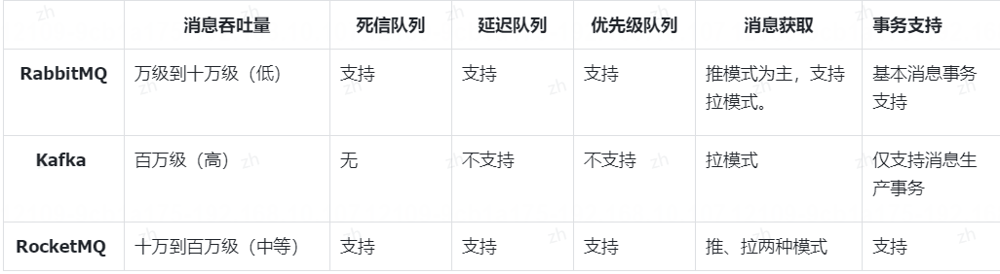

## 1. 什么是消息队列？消息队列有什么用？
消息队列是一种用于在应用程序之间传递消息的通信机制。它通常是一个存储消息的队列，发送方将消息放入队列，接收方从队列中获取消息进行处理。消息队列可以实现异步通信，发送方和接收方不需要同时在线，消息会在队列中暂存直到接收方准备好处理。

消息队列有很多用途，其中包括：

1. **解耦系统**：通过消息队列，不同的系统或模块可以解耦，发送方和接收方之间不直接通信，降低系统之间的依赖性，提高系统的灵活性和可维护性。

2. **异步处理**：消息队列可以实现异步处理，发送方发送消息后即可继续执行其他操作，接收方在合适的时候处理消息，提高系统的响应速度和吞吐量。

3. **削峰填谷**：消息队列可以作为缓冲区，帮助平衡系统的负载，当系统负载过高时暂存消息，当系统负载较低时处理消息，避免系统崩溃或性能下降。

4. **通信协调**：消息队列可以用于不同服务之间的通信协调，例如事件驱动架构、任务调度等，帮助系统实现更复杂的业务逻辑。
5. **消息通知和广播**:消息队列可以用于实现通知和广播机制。当某个事件发生时，可以通过队列向订阅者发送通知。

## 2. 消息队列有哪几种实现方式？它们之间有什么区别？
消息队列的常见实现方式有以下几种:
1. 基于消息服务器的消息队列，例如以下几种:
   - RabbitMQ:使用 Erlang 编写、实现了 AMQP 协议的消息中间件，具有高可用性及广泛的客户端库支持。
   - Kafka:一个分布式的流处理平台，设计之初用于日志收集系统，也常作为高性能的消息队列使用。
   - RocketMQ:阿里巴巴开源的分布式消息中间件，设计目标是提供低延迟、高并发、高可用的消息队列服务。
2. 基于 Redis 的简单消息队列，它的实现方式有以下几种:
   - 使用 List 方式来实现消息队列，主要使用的是 lpush/rpop 来实现消息的先进先出。
   - Redis 自身提供的发布订阅模式，也就是使用 Publisher(发布者)和 Subscriber(订阅者)来实现消息队列。
   - 使用 Redis 5.0 版本中提供的 Stream 来实现消息队列，它主要使用的是 xadd/xread 来实现消息的读取和存。
   储。
3. 基于 Java 程序的单机版消息队列,

以上三种消息队列实现的区别是:

1. 基于消息服务器的消息队列提供了更强大、更稳定的消息队列服务，在日常开发中占据了消息队列业务的绝大部分“市场”。
2. Redis 消息队列只能用于简单的、对消息丢失不敏感，且对稳定性要求不高的简单消息队列场景。
3. 基于 Java 程序的单机版消息队列，只能用于单机版、对消息丢失不敏感、内存型的超级简单的消息队列场景(几乎不会被用到)。
## 3. 如何用Java实现一个简单的消息队列
要用Java实现一个简单的消息队列，你可以使用Java的多线程和队列数据结构来实现。下面是一个简单的示例代码，实现一个基于队列的消息队列：

```java
import java.util.LinkedList;
import java.util.Queue;

public class MessageQueue {
    private Queue<String> queue;

    public MessageQueue() {
        this.queue = new LinkedList<>();
    }

    public synchronized void sendMessage(String message) {
        queue.add(message);
        notify(); // 通知等待中的消费者线程
    }

    public synchronized String receiveMessage() throws InterruptedException {
        while (queue.isEmpty()) {
            wait(); // 等待消息到来
        }
        return queue.poll();
    }

    public static void main(String[] args) {
        MessageQueue messageQueue = new MessageQueue();

        // 生产者线程
        new Thread(() -> {
            for (int i = 0; i < 10; i++) {
                String message = "Message " + i;
                messageQueue.sendMessage(message);
                System.out.println("Sent: " + message);
                try {
                    Thread.sleep(1000);
                } catch (InterruptedException e) {
                    e.printStackTrace();
                }
            }
        }).start();

        // 消费者线程
        new Thread(() -> {
            for (int i = 0; i < 10; i++) {
                try {
                    String message = messageQueue.receiveMessage();
                    System.out.println("Received: " + message);
                } catch (InterruptedException e) {
                    e.printStackTrace();
                }
            }
        }).start();
    }
}
```

在这个示例中，我们创建了一个 `MessageQueue` 类来实现消息队列，其中包含了一个基于 `LinkedList` 的队列来存储消息。生产者线程通过 `sendMessage` 方法向队列中发送消息，消费者线程通过 `receiveMessage` 方法从队列中接收消息。生产者线程和消费者线程通过 `wait()` 和 `notify()` 方法来实现线程间的通信。

你可以运行这段代码来测试简单的消息队列的实现。希望这能帮助到你！如果有任何问题，欢迎随时向我提问。

## 4. RabbitMQ、Kafka、RocketMQ有什么区别？


## 5. Rabbit是如何组成的？有哪些重要的组件？
1. **生产者**:消息的创建者，负责创建和推送数据到消息服务器。
2. **消费者**:消息的接收方，用于处理数据和确认消息。
3. **代理**:也就是 RabbitMQ 服务本身，它用于扮演“快递”的角色，因为它本身并不生产消息，只是扮演了“快递的角色，把消息进行暂存和传递。

RabbitMq 重要组件

RabbitMq 中的重要组件包含以下这些:

1. **Producer(生产者)**:消息发布者，负责将消息发送到 RabbitMQ 交换机。生产者通常是应用程序或服务，它们生成和发送消息。
2. **Consumer(消费者)**:也称为订阅者，负责从队列中接收消息并进行处理。消费者通常是应用程序或服务它们从队列中订阅消息，并在处理后进行响应。
3. **Exchange(交换机)**:负责接收生产者发送的消息，并将消息路由到一个或多个队列。交换机有不同的类型，包括直接交换机、主题交换机、广播交换机等，用于定义消息的路由规则。
4. **Queue(队列)**:用于存储消息。多个队列可以绑定到一个交换机，接收来自交换机的消息。消息在队列中排队等待被消费。
5. **RoutingKey(路由键)**：它将生产者和交换机连接起来，用于将生成者的数据分配到指定的交换器上
6. **BindingKey(绑定键)**:它将交换机和队列连接起来，定义了消息从交换机到队列的路由规则。一个交换机可以绑定到多个队列，一个队列也可以被多个交换机绑定
7. **Connection(连接)**:是生产者和消费者与 RabbitM0 服务器之间的网络连接。通常，每个应用程序都会建立一个连接。
8. **Channel(通道)**:是在连接内创建的虚拟连接。通道用于发送和接收消息，通过通道可以实现多路复用，提高性能。一个连接有多个通道，通常一个线程就是一个通道。
9. **Broker(消息代理)**:也就是 RabbitM0 本身，它代表着一个 RabbitMQ 服务器节点。负责接收、路由和分发消息。它将消息从生产者发送到消费者，并确保消息的可靠传递。
10. **Virtual Host(虚拟主机)**:RabbitMQ 中的一个逻辑隔离层，每个虚拟主机都拥有自己的交换机、队列、用户权限等，可以将不同的应用程序或服务隔离开来，确保它们不会干扰彼此。
11. **Management Plugin(管理插件)**:提供了一个 Web 界面，用于监控和管理 RabbitMQ 服务器。管理插件允许管理员查看队列、交换机、连接等的状态，并执行管理操作。
## 6. RabbitMQ有几种消息类型?
RabbitMQ 包含以下 4 种交换机:
1. **Direct Exchange(直接交换机)**:默认交换机类型，适用于一对一的消息路由。
2. **Fanout Exchange(广播交换机)**:将消息广播到与之绑定的所有队列，忽略 Routing Key，适用于消息广播的场景，例如发布-订阅模式。
3. **Topic Exchange(主题交换机)**:主题交换机根据消息的 Routing Key 与绑定的队列的绑定键(Binding Key)进行匹配。路由键可以使用通配符符号"#”(四配零个或多个单词)和"*"(匹配一个单词)。适用于复杂的消息路由需求，可以根据多个条件进行配。
4. **Headers Exchange(头交换机)**:允许你匹配消息的 header 而非路由键(RoutingKey)，除此之外和Direct 使用完全一致，但因为 headers 匹配的性能很差，几乎不会被用到。
## 7. RabbitMQ如何保证信息的可靠性？

在 RabbitMQ 中，保证消息可靠性主要通过以下机制实现的!
1. 消息确认:
   - 生产者确认:生产者可以通过设置 publisher confirms 机制来要求 RabbitM0 在消息成功发送到交换器后返回确认。如果消息未送达，RabbitMQ 将返回否定确认(nack)，生产者可以据此重新发送消息。
   - 消费者确认:消费者收到消息后，需要显式或自动地向 RabbitMQ 发送一个确认信号，只有当 RabbitMQ 接收到这个确认信号时，才会从队列中移除该消息。如果消费者在消费过程中崩溃或没有发送确认，RabbitMQ 会认为消息未被正确处理，并将其重新放回队列以便其他消费者再次消费。

2. 消息持久化:可以通过设置消息属性使得消息在写入磁盘后再发送给消费者，即使 RabbitMQ 服务器重启，也能从磁盘恢复消息。
3. 集群部署:RabbitMQ 支持集群部署，通过节点间的同步和故障转移功能，确保在某个节点失效的情况下，服务仍然可用并且消息不会丢失。
4. 死信队列:当消息无法被正常消费或者达到最大重试次数时，可以配置死信队列，使这些消息进入特定的死信队列，避免消息无限制地在原队列中堆积。
## 8. RabbitMo能保证消息的顺序性吗?
默认情况下，RabbitMQ 本身并不能保证消息的顺序性，特别是在多生产者、多消费者和多消息队列中，顺序性是不可能保证的。
但是，如果 RabbitMO 同时满足以下情况，也能保证消息的顺序性，它需要的条件有以下几个:
1. 单一生产者:如果只有一个生产者向队列发送消息，那么消息的顺序通常会与它们发送的顺序一致。
2. 单一消费者:如果只有一个消费者从队列接收消息并处理，那么消息将按照它们进入队列的顺序进行处理。
3. 单一队列:将相关消息发送到单一队列，并确保只有一个消费者处理该队列，可以实现消息的顺序性,
4. 不使用高级功能:例如:延迟队列、优先队列等高级功能。

如果能同时满足以上条件，那么 RabbitMO 也能保证消息的顺序性，但日常开发中不可能同时满足以上条件。
## 9. RabbitMQ如何保证幂等性？
所谓的幂等性是指在重复执行相同操作的情况下，系统的状态或结果不会发生变化，也不会产生额外的副作用。例如，用户的一个添加操作，无论发起一次请求还是多次请求，最终的执行结果是一致的，不会因为多次请求而产生多条相同的数据。
**而 RabbitMQ 本身并不提供幂等性的机制，所以要保证幂等性主要是通过应用层的设计和实现来完成，例如以下操作:**
1. **生产者的幂等性**:RabbitMQ 在接收生产者的消息时，天生具备去重功能(同样标识的 ID 只能保存一次)，因此在生产者发送消息时，==可以为每条消息生成一个唯一的标识符==，并将该标识符作为消息的属性传递给RabbitMQ，

2. 消费者的幂等性：==而在业务系统消费者端，也可以通过全局唯一标识来判断消息是否已经被处理过，避免重复处理==。可以使用数据库中的唯一标识、UUID 或者其他具有全局唯一性的标识符，然后将唯一标识保存到Redis 中，在消费消息之前，先判断唯一标识是否应存在，如未存在再进行消费，否则则为重复消息，忽略即可。
## 10. 说一下RabbitMQ中的死信队列？如何实现死信队列？
RabbitMQ 中的死信队列(Dead Letter Queue，简称 DLQ)是==一种用于存储那些无法被正常消费的消息的特殊队列。==

当遇到以下情况，消息就会变成死信消息并加入死信队列:
1. **消息被拒绝**:使用 channel.basicNack 或 channel.basicReject，并且此时 requeue 属性被设置为 false，表示消息被拒绝执行，拒绝执行的消息会进入死信队列。
2. **超过最大存活时间**:消息在队列的存活时间超过设置的 TL 时间，也会进入死信队列。
3. **超对队列最大长度**:消息队列的消息数量已经超过最大队列长度。一旦满足死信条件，RabbitMQ 会自动将其移出原队列，并通过死信交换机投递到死信队列中，由专门的消费者进行后续处理，比如记录日志、补偿操作或者特殊处理等

**如何实现死信队列?**
RabbitMo 实现死信队列总共分为以下四步:
1. 创建死信交换机
2. 创建死信队列。
3. 将死信队列和死信交互机进行绑定
4. 在正常的队列上设置死信配置(让正常队列发生了消息被拒、最大存活时间后直接进入到死信队列)。

以下是使用 Java 实现 RabbitMQ 死信队列的代码示例：

```java
import com.rabbitmq.client.*;

public class DeadLetterQueueExample {

    private static final String EXCHANGE_NAME = "dead_letter_exchange";
    private static final String QUEUE_NAME = "normal_queue";
    private static final String DEAD_LETTER_QUEUE_NAME = "dead_letter_queue";
    private static final String DEAD_LETTER_EXCHANGE_NAME = "dead_letter_exchange";

    public static void main(String[] args) throws Exception {
        ConnectionFactory factory = new ConnectionFactory();
        factory.setHost("localhost");

        try (Connection connection = factory.newConnection();
             Channel channel = connection.createChannel()) {

            // Step 1: 创建死信交换机
            channel.exchangeDeclare(DEAD_LETTER_EXCHANGE_NAME, BuiltinExchangeType.FANOUT);

            // Step 2: 创建死信队列
            channel.queueDeclare(DEAD_LETTER_QUEUE_NAME, true, false, false, null);

            // Step 3: 将死信队列和死信交换机进行绑定
            channel.queueBind(DEAD_LETTER_QUEUE_NAME, DEAD_LETTER_EXCHANGE_NAME, "");

            // Step 4: 在正常的队列上设置死信配置
            channel.queueDeclare(QUEUE_NAME, true, false, false, null);
            channel.queueBind(QUEUE_NAME, EXCHANGE_NAME, "");

            // 设置队列的死信交换机和死信路由键
            AMQP.BasicProperties.Builder properties = new AMQP.BasicProperties.Builder();
            properties.expiration("60000"); // 设置消息的最大存活时间为60秒
            properties.deliveryMode(2); // 消息持久化

            channel.queueDeclare(QUEUE_NAME, true, false, false, null);
            channel.queueBind(QUEUE_NAME, EXCHANGE_NAME, "");

            channel.basicPublish(EXCHANGE_NAME, "", properties.build(), "Hello, RabbitMQ!".getBytes());
            System.out.println("Sent message to normal queue");

            // 模拟消息被拒绝
            GetResponse response = channel.basicGet(QUEUE_NAME, false);
            channel.basicReject(response.getEnvelope().getDeliveryTag(), false);
            System.out.println("Message rejected and sent to dead letter queue");
        }
    }
}
```

请注意，以上代码仅为示例，实际应用中需要根据具体需求进行适当调整和优化。
## 11. 什么是延迟队列？它的使用场景有哪些？
延迟队列(Delay Queue)是指当消息被发送以后，并不是立即执行，而是等待特定的时间后，消费者才会执行该消息。
延迟队列的常见使用场景有以下几种:
1. **超时订单取消**:在电子商务系统中，用户下单后有一个支付有效期限，如 30 分钟内未支付则自动取消订单。可以将创建订单后的操作放入延迟队列，在指定延迟时间过后检查订单状态并执行相应的处理逻辑。
2. **任务调度**:在日常开发中，经常需要进行定时任务调度，这时可以使用延迟队列来实现任务调度，将待执行的2.任务消息发送到延迟队列中，设置任务的执行时间，当到达指定的执行时间时，消费者从延迟队列中获取并执行任务。
3. **邮件/短信验证码的发送**:当新会员在某个系统中注册了账号之后，等待几分钟之后可以给其发送欢迎邮件，或注册成功的短信提醒等，都可以使用延迟队列来实现。
## 12. RabbitMQ如何实现延迟队列？
RabbitMQ本身并不直接支持延迟队列，但可以通过插件来实现延迟队列的功能。常用的方法是使用==RabbitMQ Delayed Message Plugin==插件来实现延迟队列。

安装RabbitMQ Delayed Message Plugin插件后，可以通过设置消息的过期时间来实现延迟发送消息的功能。具体步骤如下：

1. 安装RabbitMQ Delayed Message Plugin插件：
```bash
rabbitmq-plugins enable rabbitmq_delayed_message_exchange
```

2. 创建一个延迟交换机（Delayed Exchange）：
```bash
rabbitmqadmin declare exchange name=delayed_exchange type=x-delayed-message arguments='{"x-delayed-type":"direct"}'
```

3. 创建一个延迟队列，并将其绑定到延迟交换机上：
```bash
rabbitmqadmin declare queue name=delayed_queue
rabbitmqadmin declare binding source=delayed_exchange destination=delayed_queue routing_key=delayed_routing_key
```

4. 发送延迟消息：
```bash
rabbitmqadmin publish exchange=delayed_exchange routing_key=delayed_routing_key payload='{"message":"Hello, delayed message!"}' properties='{"headers":{"x-delay":5000}}'
```


## 13. RabbitMQ怎么保证高可用性？

RabbitMQ 是一个流行的开源消息队列软件，为了保证高可用性，可以采取以下几种方式：

1. 集群部署：通过在多个节点上部署 RabbitMQ 集群，可以实现高可用性。当一个节点发生故障时，其他节点可以继续提供服务，确保系统的可用性。

2. 数据复制：RabbitMQ 支持数据复制功能，可以将消息队列中的数据复制到多个节点上，以防止单点故障。当一个节点发生故障时，可以从其他节点获取数据，保证消息的可靠性和持久性。

3. 负载均衡：通过负载均衡技术，可以将请求分发到多个 RabbitMQ 节点上，避免单个节点负载过高，提高系统的整体性能和可用性。

4. 监控和报警：及时监控 RabbitMQ 集群的运行状态，设置合适的报警机制，可以在出现故障或异常情况时及时发现并处理，保证系统的稳定运行。

综上所述，通过集群部署、数据复制、负载均衡和监控报警等手段，可以有效提高 RabbitMQ 的高可用性，确保系统在面对故障或异常情况时仍能正常运行。
## 14.  Kafka为什么运行这么快?
Kafka 之所以运行快的主要原因有以下几点:
1. 分区架构设计:Kafka 采用了分布式的分区架构设计，它将消息分布到多个 Broker(Kafka 服务器)节点上的不同分区中，这样可以实现并行处理和消费，极大地提高了整体系统的读写能力
2. 零拷贝技术:Kafka 在数据传输过程中利用操作系统层面的零拷贝(zero-copy)技术，避免了不必要的内存到2内存的数据复制，减少了 CPU 资源消耗，从而提升了数据传输效率。目什么是零拷贝技术?它有哪些使用场景?
3. 批处理与消息压缩:生产者可以选择批量发送消息到 Kafka，而不是一条条单独发送，这有助于减少网络通信3.开销。此外，Kafka 支持消息压缩功能，在不影响数据完整性的前提下降低了网络带宽使用，进一步提升吞吐量。
4. 高效索引结构:Kafka 对每个分区使用了一种基于偏移量(offset)的索引结构，使得消费者能够快速定位到要4消费的消息位置，实现了高效的读取操作。
5. 高效网络模型:Kafka 服务端使用高效的网络库如 Javà NIO(非阻塞 IO)，以及更现代的 Reactor 模式来处n理网络请求，确保能够同时处理大量并发连接，并有效地管理网络 I/0 事件。
6. 顺序写磁盘优化:Kafka 的消息是追加(append-only)方式存储在磁盘上，而不是随机写入。这种顺序写入模6.式充分利用了磁盘的顺序 I/0 性能，相比随机写入能显著提升写入速度，同时减少磁盘寻道时间，提高吞吐量，
## 15. Kafka是如何组成的？它有哪些重要的组件？
"Kafka" 是一个由Apache软件基金会开发的开源流式数据平台，用于处理实时数据流。它的核心组件包括以下几个部分：

1. **Producer**：生产者，负责将数据发布到 Kafka 集群中的主题（topic）中。

2. **Broker**：代理，是 Kafka 集群中的服务器节点，负责存储数据和处理数据的传输。

3. **ZooKeeper**：动物园管理员，用于协调和管理 Kafka 集群中的各个节点。

4. **Consumer**：消费者，从 Kafka 集群中的主题中读取数据。

5. **Topic**：主题，是 Kafka 中用于分类和存储数据的逻辑概念，生产者将数据发布到主题中，消费者从主题中读取数据。

6. **Partition**：分区，每个主题可以分成多个分区，分区可以分布在不同的 Broker 上，提高数据的并发处理能力。

7. **Offset**：偏移量，消费者在读取数据时会根据偏移量来确定读取的位置，确保数据的顺序性和完整性。

这些组件共同构成了 Kafka 的架构，实现了高性能、高可靠性的实时数据处理和传输功能。
## 16. Kafka有几种消息确认模式？它们有什么区别？
Kafka 中总共有以下 3 种消息确认模式:
1. acks=0(不等待任何确认):在这种模式下，生产者将消息发送到网络后，无论 Broker 是否成功接收到，都会立即认为消息发送成功，继续发送下一条消息。这是最不可靠的设置，可能会导致消息丢失。
2. acks=1(等待分区首领节点确认):默认消息确认模式，当 acks 配置为1时，生产者会等待 Broker 中负责2该分区的首领节点确认消息已经接收到了这条消息，并将其写入了日志文件，生产者就会收到消息确认。然而，在集群发生故障转移期间，有可能消息已经被写入但尚未完全同步到所有副本，这时如果首领节点崩溃则这部分未完全同步的消息可能丢失。
3. acks=all/-1(等待所有参与复制的节点确认):当 acks 设置为 all 或 -1 时，生产者需要等待所有的 ISR3.(In-Sync Replicas，同步副本集合)都确认接收到消息后才认为消息发送成功。这提供了最高的可靠性保证因为在返回确认给生产者之前，消息必须在至少一次同步副本中持久化。
默认情况下，Kafka 生产者采用的是 acks=1 的消息确认模式。
## 17. Kafka能保证消息的顺序性吗？
Kafka能够保证消息的顺序性，但是需要在特定的配置下才能实现。在Kafka中，每个分区内的消息是有序的，但是跨分区的消息顺序不能被保证。如果需要保证消息的全局顺序性，可以将所有相关消息发送到同一个分区中，这样就可以保证它们的顺序性。另外，Kafka也提供了一些其他的机制来保证消息的顺序性，比如使用消息的时间戳或者消息的键来实现顺序性。
## 18. Kafka有哪些分区分配策略？
Kafka中常见的分区分配策略有以下几种：

1. **随机分配策略（Random Assignment）**：这种策略会随机将分区分配给可用的消费者，确保负载均衡。但是，随机分配可能导致某些消费者负载过重，不适合高可用性和负载均衡要求较高的场景。

2. **Round-robin分配策略**：这种策略会按照顺序将分区分配给可用的消费者，确保每个消费者获得相同数量的分区。但是，如果消费者的处理能力不同，可能会导致负载不均衡。

3. **Range分配策略**：这种策略会根据消费者的ID和分区的数量计算出一个范围，然后将该范围内的分区分配给对应的消费者。这种策略可以确保每个消费者处理相同数量的分区，适合负载均衡要求较高的场景。

4. **自定义分配策略**：除了上述常见的分配策略外，Kafka还支持自定义分配策略，用户可以根据自己的需求实现自定义的分配逻辑，例如基于消费者的处理能力、网络延迟等因素进行分配。

以上是一些常见的Kafka分区分配策略，选择合适的策略取决于具体的业务需求和系统架构。
## 19. Kafka如何保证消息不丢失？
Kafka 通过以下方式来保证消息不丢失：

1. **持久化存储**：Kafka 使用持久化存储来保存消息，即消息被写入磁盘而不是仅存储在内存中。这样即使发生故障，消息也不会丢失。

2. **副本机制**：Kafka 使用副本机制来保证消息的可靠性。每个分区的数据会被复制到多个 Broker 上，这样即使某个 Broker 发生故障，仍然可以从其他 Broker 上获取数据。

3. **ISR（In-Sync Replicas）机制**：Kafka 使用 ISR 机制来确保消息的可靠性。只有处于同步状态的副本才会参与消息的复制和同步，这样可以避免数据丢失。

4. **消息确认机制**：生产者发送消息到 Kafka 时，可以选择不同的消息确认机制。其中最常用的是“all”模式，即只有当消息被所有的 ISR 副本成功写入后才会收到确认。

总的来说，Kafka 通过持久化存储、副本机制、ISR 机制和消息确认机制等多种方式来保证消息不丢失，确保数据的可靠性和一致性。
## 20. 分区副本的类型有几种?优先副本和首领副本有什么区别?
分区副本的类型有两种，分别是优先副本和首领副本。

优先副本是指在分区中的一个副本被选为“优先副本”，负责处理该分区的读写请求。优先副本通常是最新的副本，数据同步最快，因此能够提供最新的数据。当客户端发送读写请求时，优先副本会负责处理这些请求，确保数据的一致性和可靠性。

首领副本是指在分区中的一个副本被选为“首领副本”，负责协调其他副本的工作。首领副本通常负责处理一些管理性的任务，比如副本的选举、数据同步等。当客户端发送读写请求时，首领副本会将请求转发给优先副本来处理，确保数据的一致性和可靠性。

因此，优先副本和首领副本的区别在于其在分区中的角色和职责不同，但它们都是分布式系统中保证数据一致性和可靠性的重要组成部分。
## 21. 说一下Kafka的ISR机制？
Kafka中的ISR（In-Sync Replicas）机制是指每个分区中的副本集合，这些副本与领导者副本保持同步。ISR机制的作用是确保数据的可靠性和一致性，当消息被写入到领导者副本后，只有在所有ISR中的副本都复制了该消息后，消息才被认为是已经提交的。

当某个副本与领导者副本之间的同步延迟超过一定阈值时，这个副本将会被移出ISR，这样可以避免因为同步延迟过大导致数据不一致的情况发生。当所有的副本都与领导者副本保持同步时，ISR中的副本数量就等于分区的副本数量，此时数据的可靠性得到保证。

ISR机制在Kafka中起着重要的作用，保证了数据的一致性和可靠性，同时也提高了系统的性能和可用性。
## 22. 说一下Kafka的选举流程？
Kafka消息队列中的选举流程是指在Kafka集群中选举出一个新的Controller节点来负责集群的管理和协调工作。Controller节点是Kafka集群中的一个特殊节点，负责处理分区的副本分配、Leader选举、Broker状态监控等工作。

Kafka的选举流程大致如下：
1. 每个Broker节点都会定期发送心跳到ZooKeeper，以表明自己的存活状态。
2. 当当前的Controller节点宕机或失去连接时，ZooKeeper会触发一个Controller选举过程。
3. 在Controller选举过程中，每个Broker节点会尝试创建一个临时的Controller竞选节点，并在ZooKeeper中进行注册。
4. ZooKeeper会根据一定的规则（比如节点创建时间）选举出一个新的Controller节点。
5. 新选举出的Controller节点会开始接管集群的管理和协调工作，包括处理分区的副本分配、Leader选举等。

总的来说，Kafka的选举流程通过ZooKeeper来协调，确保在当前Controller节点失效时能够及时选举出一个新的Controller节点来接管集群的管理工作，保证集群的正常运行。