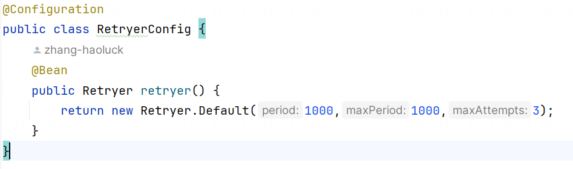
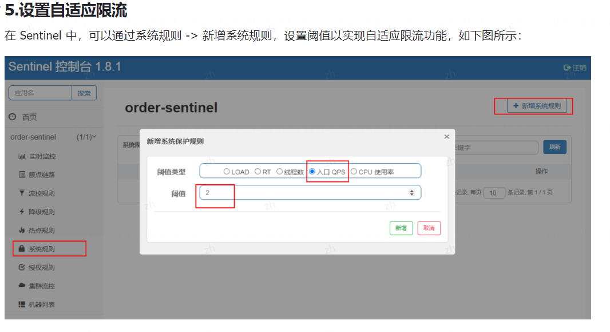

## 1. 分布式、微服务和Springcloud有什么联系和区别?
分布式、微服务和 Spring Cloud 是相关但又不完全相同的概念，分布式系统是一种架构范式，微服务是一种特定的架构风格，而 Spring Cloud 是一个用于构建和管理分布式系统和微服务的开发框架和工具集。
也就是说:分布式是架构形式，微服务是架构风格，而 Spring Cloud 是具体实现。它们的定义如下:
1. **分布式**:分布式系统是指由多个独立计算机或节点组成的系统，这些节点通过网络进行通信和协调，共同完成特定的任务。分布式系统旨在通过将任务分解为多个部分并并行处理来提高系统的性能、可靠性和可扩展性。
2. **微服务**:微服务是一种架构风格，将一个应用程序拆分成一组更小、更独立的服务，每个服务运行在独立的进程中。每个微服务专注于一个特定的业务功能，并通过轻量级的通信机制(如 HTTP 或消息队列)进行通信微服务架构有助于实现松耦合、可独立部署、可伸缩和易于维护的系统。
3. **Spring Cloud**:基于 Spring 框架构建的一组用于构建分布式系统和微服务的工具和框架。它提供了许多支持微服务架构的功能和服务，包括服务发现、负载均衡、配置管理、断路器、消息总线等。Spring Cloud 通过内置的集成和抽象层，简化了构建和管理分布式系统的过程。

所以说，分布式系统是一种架构范式，微服务是一种特定的架构风格，而 Spring Cloud 是一个用于构建和管理分布式系统和微服务的开发框架和工具集。
Spring Cloud 提供了一整套功能和服务，简化了开发和管理分布式系统的过程，并与 Spring 生态系统紧密集成使开发人员能够更轻松地构建和部署微服务架构。

Spring cloud 和 Spring Boot 有什么区别?
Spring Cloud 和 Spring Boot 都是 Spring Framework 家族中的一员，然而它们的侧重点不同:
1. Spring Boot:多用于构建单体应用，它是一个用于简化 Spring 应用程序开发的框架。它提供了一种快速开发的方式，可以轻松创建独立的、生产级别的 Spring 应用程序。Spring Boot 使用"约定优于配置"的理念，提供了默认配置和自动装配，减少了开发人员的配置工作。
2. Spring Cloud:基于 Spring Boot 实现的分布式系统开发工具，它提供了一系列开箱即用的，针对分布式系统开发的特性和组件，用于帮助开发人员快速构建和管理云原生应用程序。Spring Cloud 的主要目标是解决分布式系统中的常见问题，例如，服务发现、负载均衡、断路器、配置管理等

## 2. SpringCloud中的常用组件有哪些?
Spring cloud 中的常用组件有以下几个
1.注册中心
2.配置中心
3.负载均衡器
4.熔断器
5.网关
6.分布式事务
7.分布式链路追踪


## 3. 什么是注册中心?为什么需要注册中心?
**典型回答**
注册中心是微服务架构中的一个重要组件，用于实现服务的注册与发现。

**为什么需要注册中心?**
当我们将单体应用升级为多实例之后，会面临以下几个问题:
1. 一个服务有多个实例，调用方应该调用哪个实例呢?
2. 被调用的实例掉电或崩溃后，如何将请求转发到别的实例呢?
3. 如何动态感知服务的上线和线下呢?又要如何动态更新负载均衡列表呢?

要解决以上问题，我们就要使用服务注册与发现服务，将所有的应用统一的、动态的管理起来，这时候就需要注册中心来解决以上的所有问题了。

**注册中心的主要作用包括以下几个:**

1. **服务注册**:服务实例启动时，将自身信息注册到注册中心，包括服务名称、地址、端口等。
2. **服务发现**:消费者向注册中心查询服务，并获取服务实例信息来访问服务。
3. **服务健康检查**:注册中心定期检查服务实例健康状况，过滤不健康实例。
4. **服务路由**:提供服务的路由与负载均衡功能。
5. **服务监控**:统计服务调用次数，时长等，用于监控服务状态
6. **服务更新**:当服务实例信息变更时，向注册中心发送更新信息通知。

通过注册中心，服务提供者和消费者只需与注册中心交互即可，从而实现服务的注册与发现，降低了服务间的耦合度。

## 4. 注册中心的主要执行流程
**典型回答**
注册中心的主要执行流程如下(以 Nacos 为例)
1. **启动注册中心**:注册中心作为一个独立的服务，需要先启动起来。
2. **服务注册**:当服务启动时，它会向 Nacos 服务器==发送一个注册请求，包含自己的元数据信息==。Nacos 服务器接收到注册请求后，==在内存中维护一个注册表，将服务实例的元数据保存起来，用于后续的服务发现==。
3. **心跳机制**:注册成功后，==服务实例会定期向 Nacos 服务器发送心跳请求，以表明自己的健康状态和可用性==。这样 Nacos 服务器可以监控各个服务实例的状态，并及时剔除不可用或下线的实例。
4. **服务发现**:当服务消费者需要访问某个服务时，它会向 Nacos 服务器发送一个服务发现请求，包含所需服务的名称。==Nacos 服务器根据服务名称查找注册表，并返回该服务的实例列表给消费者==。
5. **负载均衡**:在服务发现的过程中，Nacos 还提供了负载均衡的支持。消费者可以选择合适的负载均衡策略来选择其中一个或多个服务实例进行调用。

**注册中心通常有两个角色:**
1. **服务提供者**(也叫生产者):对外提供服务的微服务应用。它会把自身的服务地址注册到注册中心，以供消费者发现和调用。
2. **服务调用者**(也叫消费者):调用其他微服务的应用程序。它会向注册中心订阅自己需要的服务，并基于服务提供者注册的信息发起远程调用。


## 5. Nacos永久实例和临时实例有什么区别?
**经典回答**

永久实例(persistent instance)和临时实例(ephemeral instance)是注册中心的两种不同的服务类型，它的定义如下:
- **永久实例**(Persistent Instance):也叫做持久化实例，是指注册到 Nacos 的服务实例，其注册信息会一直保留在 Nacos 服务器上，直到主动注销或被删除。这意味着即使服务实例下线或不可用，它的注册信息仍然会保留在 Nacos 上，直到显式取消注册。**永久实例适用于需要长期存在的服务，比如稳定部署的服务或长时间运行的后端服务**。
- **临时实例**(Ephemeral Instance):是指注册到 Nacos 的服务实例，**其注册信息在实例下线或不可用时会白动被删除**。如果服务实例下线、断开连接或主动注销，Nacos 会自动从注册表中删除这些实例的信息。临时实例适用于临时性的服务实例，比如临时加入集群的短期任务或特定场最下的临时服务。

**永久实例 VS 临时实例**

临时实例和持久化实例的区别主要有以下两点:
1. 临时实例在非健康状态下会被自动剔除，而永久实例不会被自动剔除。
   - 临时实例超过 15 秒未收到心跳包，会将临时实例设置为不健康的状态,。
   - 临时实例超过 30 秒未收到心跳包，会将临时实例删除。
2. ==临时实例的健康状况是 Nacos 客户端以固定频率(5s一次)上报给 Nacos 服务器端的，而永久实例是 Nacos服务器端主动探测的。==


**Nacos默认为永久实例还是临时实例?**

在项目中使用 Nacos 框架时，==默认的实例为临时实例==，如果想要让当前服务注册节点变为永久实例，可以通过在配置文件中设置，

## 6. 说一下Nacos的健康检查机制?

Nacos 中的健康检测机制是用来检查服务健康状态的，只有健康的节点才会被服务消费端调用，这样才能保证程序稳定、正常的运行。
Nacos 中提供了两种健康检测的机制:
1. 客户端主动上报(健康状态的)机制。
2. 服务器端反向探测(健康状态的)机制。

如何理解这两种机制呢?
想象一下这么一个场景，你所在的地区突然发生地质灾害，你被掩盖在废墟下面，搜救队必须要知道你在废墟里面，那么才能对你进行施救。那有什么方法可以让救援队知道你在废墟下面?
- 第一种(主动上报)，你在废墟里面大喊 help! help!I am here!，让搜救队知道你的位置和健康状态,
- 第二种(反向探测)，搜救队使用了他们的专业检查设备，探测到你正埋在废墟下面。

以上这两种方法和 Nacos 的两种健康检测机制类似，也就是客户端主动上报机制，是客户端每隔一段时间，主动向 Nacos 服务器端上报自己的健康状况，而服务器端反向探测机制是 Nacos 服务器端来检测客户端是否健康。

Nacos 中的健康检测机制不能主动设置，但健康检测机制是和 Nacos 的服务实例类型强相关的。

健康检查机制应用
Nacos 健康检查机制的应用如下:
1. 临时实例(也可以叫做非持久化实例)使用的是客户端主动上报的健康检查机制
2. 永久实例(也可以叫做持久化实例)使用的是服务端反向探测机制

**主动上报健康检查的执行流程**
在 Nacos 中，用户可以通过两种方式注册成为临时实例，一个是通过 Nacos 的 OpenAPI进行服务注册，另一个是通过 Nacos 提供的 SDK 进行注册。
而 OpenAPI 和 SDK 的健康检测机制的上报是不同的，它们的区别如下:
- OpenAPI 的注册方式实际是用户根据自身需求调用 HTTP 接口对服务进行注册，然后通过 HTTP 接口发送心跳到注册中心。在注册服务的同时会注册一个全局的客户端心跳检测的任务。在服务一段时间没有收到来自客户端的心跳后，该任务会将其标记为不健康，如果在间隔的时间内还未收到心跳，那么该任务会将其剔除。
- SDK 的注册方式实际是通过 RPC 与注册中心保持连接(Nacos 2.x版本中，旧版的还是仍然通过 OpenAPI 的方式)，客户端会定时的通过 RPC 连接向 Nacos 注册中心发送心跳，保持连接的存活。如果客户端和注册中心的连接断开，那么注册中心会主动剔除该 cient 所注册的服务，达到下线的效果。同时 Nacos 注册中心还会在注册中心启动时，注册一个过期客户端清除的定时任务，用于删除那些健康状态超过一段时间的客户端。从上面的特点我们可以发现，对于不同类型的使用方式，Nacos 对于健康检查的特点实际都是相同的，都是由客户端向注册中心发送心跳，注册中心会在连接断开或是心跳过期后将不健康的实例移除。

**健康上报规则**
这两种方式的发送规则都是一样的，具体详情如下:
- 临时实例每隔 5秒会主动上报一次自己的健康状况，发送的数据包叫做心跳包，发送心跳包的机制叫做心跳机制。
- 如果心跳包的间隔时间超过了 15 秒，那么 Nacos 服务器端就会将此服务实例标记为非健康实例
- 如果心跳包超过了 30 秒，那么 Nacos 服务器端将会把此服务实例从服务列表中删除掉。

## 7. Nacos反向探测支持的类型有哪些?说下具体执行流程?

Nacos反向探测支持的类型有两种：HTTP和TCP。

具体执行流程如下：
1. Nacos Server接收来自客户端的健康检查请求。
2. Nacos Server将请求转发给服务端实例。
3. 服务端实例根据请求类型（HTTP或TCP）执行相应的健康检查逻辑。
4. 服务端实例将健康检查结果返回给Nacos Server。
5. Nacos Server根据服务端实例返回的健康检查结果更新服务实例的健康状态。
6. 客户端可以通过Nacos Server获取最新的健康状态信息，从而实现服务的动态发现和负载均衡。


## 8. Nacos有负载均衡器功能吗?它内置了哪些负载均衡策略?

负载均衡(Load Balance，简称 LB)是高并发、高可用系统必不可少的关键组件，目标是尽力将网络流量平均分发到多个服务器上，以提高系统整体的响应速度和可用性。Nacos 在 0.7.0 版本中提供了负载均衡功能，它内置的负载均衡策略如下
1. 基于权重的负载均衡策略:权重值设置的越高，那么被分配到的概率也越大。
2. 基于标签的负载均衡策略:它可以实现同标签优先访问的流量调度策略，实际的应用场景中，可以用来实现服务的就近访问，当您的服务部署在多个地域时，这非常有用。

## 9. 负载均衡器的分类有哪些?它们有什么优缺点?
**1.典型回答**
负载均衡主要分为两类:
1. 服务器端负载均衡。
2. 客户端负载均衡。


它们的介绍和优缺点如下。
**①服务器端负载均衡器**
服务器端负载均衡指的是存放在服务器端的负载均衡器，例如 Nginx、HAProxy、F5 等，如下图所示:
优缺点分析
- 优点:

1. 集中管理与控制:所有请求首先到达一个统一的负载均衡器，由它决定将请求转发到哪个后端服务器，这样可以方便地进行集中的流量管理和策略配置。
2. 安全性和扩展性:可以更容易地实施安全策略，如 DDoS 防护。同时，增加或减少后端服务器对客户端透明易于系统扩展。

**缺点:**
1. 单点故障风险:如果负载均衡器发生故障，可能导致整个服务不可用。
2. 额外延迟:每个请求必须先通过负载均衡器，这可能会引入额外的网络延迟。
3. 维护成本:需要维护负载均衡器本身的高可用性和性能优化。


**② 客户端负载均衡器**
客户端负载均衡指的是嵌套在客户端的负载均衡器，例如 Ribbon。
优缺点分析
优点:

1. **去中心化**:客户端自身负责选择合适的服务器，降低了对单一设备的依赖,一定程度上减轻了单点故障的风,险。
2. **灵活的路由策略**:客户端可以根据地理位置、网络条件等因素做出最佳选择，例如在分布式环境中采用最近节点算法进行连接。
3. **简化运维**:对于某些应用场景，如微服务架构，客户端直接调用其他服务，无需额外部署负载均衡器。

缺点:
1. **复杂性增加**:客户端需要具备智能选路的能力，这意味着需要在客户端实现复杂的负载均衡算法和健康检查机制。
2. **策略难以同步**:当服务器集群发生变化时，更新客户端上的负载均衡策略可能较为困难，特别是在大规模分布式系统中。
3. **安全性降低**:由于客户端承担了一部分原本在服务器端处理的安全责任，可能导致安全控制难度增大。
## 10. 常见的负载均衡策略有哪些?
无论是服务器端负载均衡和客户端负载均衡，它们的负载均衡策略都是相同的，因为负载均衡策略本质上是一种思想。
常见的负载均衡策略有以下几个:
1. 轮询(Round Robin):轮询策略按照顺序将请求分发给后端服务器，依次循环。这是一种最简单的负载均衡策略，适用于后端服务器的性能相近，且每个请求的处理时间大致相同的情况。
2. 随机选择(Random):随机选择策略随机选择一个后端服务器来处理每个新的请求。这种策略适用于后端服务器性能相似，且每个请求的处理时间相近的情况，但不保证请求的分发是均匀的。
3. 最少连接(Least Connections):最少连接策略将请求分发给当前连接数最少的后端服务器。这可以确保负3.载均衡在后端服务器的连接负载上均衡，但需要维护连接计数。
4. IP 哈希(IP Hash):IP 哈希策略使用客户端的 IP 地址来计算哈希值，然后将请求发送到与哈希值对应的后4.端服务器。这种策略可用于确保来自同一客户端的请求都被发送到同一台后端服务器，适用于需要会话保持的情况。
5. 加权轮询(Weighted Round Robin):加权轮询策略给每个后端服务器分配一个权重值，然后按照权重值比例来分发请求。这可以用来处理后端服务器性能不均衡的情况，将更多的请求分发给性能更高的服务器。
6. 加权随机选择(Weighted Random):加权随机选择策略与加权轮询类似，但是按照权重值来随机选择后端服务器。这也可以用来处理后端服务器性能不均衡的情况，但是分发更随机。
7. 最短响应时间(Least Response Time):最短响应时间策略会测量每个后端服务器的响应时间，并将请求发送到响应时间最短的服务器。这种策略可以确保客户端获得最快的响应，适用于要求低延迟的应用。

## 11. Spring Cloud LoadBalancer提供了哪些负载均衡策略?
Spring Cloud LoadBalancer 是在 Ribbon 之后，官方推荐的新一代客户端负载均衡器，它内置了两种负载均衡策略:
1. 轮询负载均衡策略:Spring Cloud LoadBalancer 默认负载均衡策略，按照顺序将请求分发给后端服务器，依次循环。
2. 随机负载均衡策略:将请求随机分给一个后端服务器

但除了内置的负载均衡策略之外，我们可以给 Spring Cloud LoadBalancer 很方便的设置以下负载均衝策略
1. Nacos 权重负载均衡策略,
2. 自定义负载均衡策略。


## 12. SpringCloudLoadBalancer如何实现自定义负载均衡策略?
实现自定义负载均衡策略需要以下3步:
1.创建自定义负载均衡器ReactorserviceInstanceLoadBalancer
2.封装自定义负载均衡器 @Bean
ReactorLoadBalancer<ServiceInstance>customLoadBalancer
3.设置自定义负载均衡器, @LoadBalancerclients(defaultconfiguration = CustomLoadBalancerconfiguration.class)
## 13. SpringCloud微服务间如何实现调用?
**典型回答**
Spring Cloud 微服务间进行调用的方式主要有以下两种:
1. RestTemplate:Spring 提供的一个 HTTP 客户端模板工具类，用于发送 HTTP 请求。
2. Spring Coud OpenFeign:Spring Cloud 团队开发的一款基于 Feiqn 的框架，声明式 Web 服务客户端。它简化了基于 HTTP 的服务调用，使得服务间的通信变得更加简单和灵活。
## 14. 说一下OpenFeign超时重试机制?
超时重试是一种在网络通信中常用的策略，用于处理请求在一定时间内未能得到响应或得到超时响应的情况。当发起请求后，如果在规定的时间内没有得到预期的响应，就会触发超时重试机制，重新发送请求。
超时重试的主要目的是提高请求的可靠性和稳定性，以应对网络不稳定、服务不可用、响应延迟等不确定因素OpenFeiqn 默认情况下是不会自动开启超时重试的，想要开启超时重试，需要通过以下 2 步来实现:
1. 配置超时重试参数(什么规则算超时?)。
2. 配置超时重试策略(超时了之后怎么办?)。

**配置超时重试参数**
配置 OpenFeign 超时重试的第一步是先告诉系统，什么情况算是超时?所以，我们需要配置连接超时时间和读取超时时间，配置如下:

```yml
spring:
	cloud:
		openfeign:
			client:
				config:
					default:
						# 全局配置
						connect-timeout:10000
						# 连接超时时间 10s
						read-timeout:10000
						#读取超时时间 10s#
```
在使用 OpenFeign 时，可以通过配置超时重试机制来处理请求超时的情况。下面是一个简单的示例代码，展示了如何在 OpenFeign 中配置超时重试机制：




在上面的代码中，我们通过 `Retryer.Default` 类来配置重试机制，其中参数依次为初始间隔时间（单位：毫秒）、最大间隔时间（单位：毫秒）和最大重试次数。这里的示例设置了初始间隔时间为100毫秒，最大间隔时间为1000毫秒，最大重试次数为3次。

通过这样的配置，当请求超时时，OpenFeign 将会按照设定的重试机制进行重试，直到达到最大重试次数或请求成功为止。


## 15. 限流和熔断有什么区别?如何实现限流和熔断?
限流和熔断都是在分布式系统和微服务架构中用于提高系统稳定性和可用性的重要策略，但它还是有区别的.
1. 限流是一种控制系统访问速率的策略，它可以防止大量请求同时涌入系统，减轻系统的压力。所以即使执行了限流，那么此时系统也是可用，或部分可用。
2. 熔断是一种更进一步的控制策略，会将该服务标记为“断开“状态，即为熔断。也就是一旦发生熔断，那么系统短时间内是不可用(为程序争取恢复时间)。

限流和熔断可以使用以下技术来实现:
1. Spring Cloud Alibaba Sentine
2. Netflix Hystrix
Hystrix 是早期的限流熔断框架，而 Sentinel 是新一代并且在国内更流行的限流熔断框架。
为什么新版 Spring Cloud 不推荐使用 Hystrix?
答:不推荐使用 Hystrix 的原因有以下几点:
1.Hystrix 进入维护模式:Netflix 宣布停止更新 Hystrix，将其移至维护模式不再添加新功能。这就意味着不会有新的改进、修复或安全更新。这使得它不再是一个长期维护的解决方案。
Spring Cloud Netflix 更多组件停止更新:Spring Cloud Netflix 项目中的许多组件，包括 Spring Cloud2Hystrix 已经停止更新。Spring Cloud 社区鼓励开发者将注意力转向更现代和活跃的替代解决方案。
3.性能和资源消耗问题:Hystrix 的线程池模型可能会导致较高的线程消耗，特别是在高并发情况下。这可能会对系统的性能产生负面影响。

## 16. 常见的限流算法有哪些?
常见的限流算法有以下几种：

1. 令牌桶算法（Token Bucket Algorithm）：令牌桶算法是一种基于令牌的限流算法，系统以恒定的速率往桶里放入令牌，每个请求需要消耗一个令牌，当桶中没有足够的令牌时，请求将被限流。这种算法可以应对突发流量，保证了平滑的限流效果。

2. 漏桶算法（Leaky Bucket Algorithm）：漏桶算法是一种基于漏桶的限流算法，系统以恒定的速率往漏桶里注入请求，当请求到来时，漏桶以固定速率处理请求，如果漏桶已满，则请求将被限流。漏桶算法可以平滑请求流量，防止突发流量对系统造成影响。

3. 计数器算法（Count-based Algorithm）：计数器算法是一种简单的限流算法，系统维护一个计数器，记录单位时间内的请求数量，当请求达到设定的阈值时，系统开始限流。这种算法简单直观，适用于对请求频率有明确要求的场景。

这些限流算法各有特点，可以根据具体的业务需求选择合适的算法来实现限流功能。


## 17. Sentinel中如何实现限流?
在Sentinel中实现限流可以通过配置规则来实现。以下是一个简单的示例代码和配置示例：


```java
import com.alibaba.csp.sentinel.SphU;
import com.alibaba.csp.sentinel.slots.block.BlockException;

public class SentinelDemo {

    public static void main(String[] args) {
        while (true) {
            try {
                // 定义资源名称为test，限流阈值为1
                SphU.entry("test");
                // 执行业务逻辑
                System.out.println("Hello, Sentinel!");
            } catch (BlockException ex) {
                // 处理被限流的情况
                System.out.println("Blocked by Sentinel!");
            } finally {
                // 退出资源访问
                SphU.exit();
            }
        }
    }
}
```


在`resources`目录下创建`sentinel.properties`文件，添加以下配置：

```properties
# 配置限流规则
resource.test.qps=1
```

Sentinel Dashboard设置限流：

1. 启动Sentinel Dashboard服务，访问`http://localhost:8080`。
2. 在Dashboard中创建应用，配置应用名称和端口。
3. 在应用详情页面，点击`流控规则`，然后点击`新建流控规则`。
4. 输入资源名称、阈值类型和阈值，点击`添加`保存规则。

通过以上步骤，你就可以在Sentinel中设置限流规则，并通过Dashboard进行管理和监控。希望这些信息对你有帮助！如果有任何问题，欢迎随时向我提问。
## 18. Sentinel有哪些熔断策略?
Sentinel 的熔断策略有以下 3 种:
1. **慢调用比例**:在统计时长内的所有请求，如果请求时间超过 xx 秒则为慢请求，且慢请求的超过一定的比例且请求数大于最小请求数，将触发熔断操作，也就是一段时间内(熔断时长参数设置)的请求会快速失败。
2. **异常比例**:在统计时长内的所有请求，如果异常的比例大于阈值，且请求数大于最小请求数，将触发熔断，也就是一段时间内(熔断时长参数设置)的请求会快速失败。
3. **异常数:**在统计时长内的所有请求，如果异常数大于國值，且请求数大于最小请求数，将触发熔断，也就是2段时间内(熔断时长参数设置)的请求会快速失败。

## 19. 说一下Sentinel的工作流程?

Sentinel是一种监控系统，其工作流程通常包括以下几个步骤：

1. 数据采集：Sentinel会定期从各个数据源（如日志、指标、事件等）中采集数据，这些数据可以反映系统的运行状态和性能指标。

2. 数据分析：采集到的数据会被送入数据分析模块，通过预先设定的规则和算法进行分析，以便检测系统中的异常情况和潜在问题。

3. 异常检测：在数据分析的过程中，Sentinel会识别出那些超出正常范围的数据点，这些数据点可能表示系统出现了故障或性能下降的情况。

4. 告警通知：一旦发现异常情况，Sentinel会触发告警机制，向相关人员发送通知，以便他们及时采取措施来解决问题。

5. 数据存储和可视化：除了实时监控和告警外，Sentinel还会将采集到的数据存储起来，以便后续的分析和回溯。同时，系统也会提供可视化界面，让用户可以直观地查看系统的运行状态和历史数据。

总的来说，Sentinel通过持续地监控、分析和告警，帮助用户及时发现和解决系统中的问题，确保系统的稳定性和可靠性。

## 20. 什么是网关?网关有什么用?
1.典型回答
在微服务架构中，网关(Gateway)是一个提供统一访问地址的组件，它充当了客户端和内部微服务之间的中介,。
网关主要负责流量路由和转发，将外部请求引导到相应的微服务实例上，同时提供一些功能，如身份认证、授权.
限流、监控、日志记录等。
网关有什么用?
网关的主要作用有以下几个:

1. 路由功能:网关可以根据目标地址的不同，选择最佳的路径将数据包从源网络路由到目标网络。它通过维护路由表来确定数据包的转发方向，并选择最优的路径。
2. 安全控制(统一认证授权):网关可以实施网络安全策略，对进出的数据包进行检查和过滤。它可以验证和授2权来自源网络的数据包，并阻止未经授权的访问。防火墙是一种常见的网关设备，用于过滤和保护网络免受恶意攻击和未经授权的访问。
3. 协议转换:不同网络使用不同的通信协议，网关可以进行协议转换，使得不同网络的设备可以互相通信。例如，例如将 HTTPS 协议转换成 HTTP 协议。
4. 网络地址转换(NAT):网关还可以执行网络地址转换，将内部网络使用的私有IP 地址转换为外部网络使用的公共 IP 地址，以实现多台计算机共享一个公共 IP 地址出去上网。

## 21. SpringcloudGateway网关是如何工作的?

执行流程如下
1. 客户端向 Spring Cloud Gateway 网关发出请求
2. 网关映射处理程序(Gateway Headler Mapping)会根据请求路径进行路由匹配，然后再将其发送到网关 Web处理器(Gateway Web Headler)进行处理。
3. 网关处理器会经过过滤器链(Filter)进行预处理，而过滤器又分为前置过滤器(请求之前执行的过滤器)和后置过滤器(请求之后执行的过滤器)。
4. 过滤器都通过之后，最后再将请求的发送给目标服务(也称为代理的服务)

## 22. SpringCloudGateway过滤器的分类有哪些?过滤器底层是如何实现的?
Spring Cloud Gateway的过滤器可以分为两类：全局过滤器和局部过滤器。

1. 全局过滤器：全局过滤器对所有路由生效，可以用来实现一些全局的功能，比如鉴权、日志记录等。

2. 局部过滤器：局部过滤器只对特定的路由生效，可以根据需要为不同的路由配置不同的过滤逻辑。

Spring Cloud Gateway的过滤器底层是基于Netty实现的。在Spring Cloud Gateway中，过滤器是通过实现GatewayFilter接口或者GlobalFilter接口来实现的。当请求经过Gateway时，会依次经过配置的过滤器链，每个过滤器可以对请求进行修改、校验、记录日志等操作，然后将请求传递给下一个过滤器或者目标服务。过滤器可以在请求前、请求后或者异常时执行相应的逻辑，从而实现对请求的处理和控制。

## 23. 分布式事务的参与者有哪些?2PC和3PC有什么区别?

分布式事务通常包含以下三个参与者:
1. **事务协调者(Transaction Coordinator)**:简称 TC，负责协调并管理分布式事务的执行。它是分布式事务的协调器，协调多个参与者的事务操作。事务协调者负责全局事务的创建、提交、回滚以及事务的状态管理。它通过全局事务 ID 来跟踪和协调分支事务的执行。
2. **事务管理器(Transaction Manager)**:简称 TM，负责管理应用程序的本地事务(分支事务)。事务管理器定义了全局事务的范围，负责将分支事务注册到全局事务中，并在全局事务的协调下，执行本地事务的提交或回滚。
3. **资源管理器(Resource Manager)**:简称 RM，管理分支事务处理的资源，与 TC 交谈以注册分支事务和报告分支事务的状态，并驱动分支事务提交或回滚。

**2PC和3PC有什么区别?**
2PC(Two-Phase Commit，二阶段提交)和 3PC(Three-Phase Commit，三阶段提交)指的是**分布式事务中的二阶段提交和三阶段提交**，在分布式事务中，通常使用两阶段协议或三阶段协议来保障分布式事务的正常运行，它也是 X/0pen 公司定义的一套解决分布式事务的规范。
X/0pen 公司是由多家国际计算机厂商所组成的联盟组织，它建立之初是为了向 UNIX 环境提供标准。分布式事务是指在分布式系统中，多个节点之间进行的事务操作。比如在分布式系统中，用户在下单时，需要同时创建订单信息和减库存的操作，然而创建订单信息和减库存是分布在不同服务器和不同数据库中的，如下图所示:

此时我们就需要一个分布式事务介入，保证所有操作，要么一起提交，要么一起回滚。
**① 两阶段提交**
两阶段提交(Two-Phase Commit，简称 2PC)是一种分布式事务协议，确保所有参与者在提交或回滚事务时都处于一致的状态。
2PC 协议包含以下两个阶段:
1. 准备阶段(prepare phase):在这个阶段，事务协调者(Transaction Coordinator)向所有参与者(Transaction Participant)发出准备请求，询问它们是否准备好提交事务。参与者执行所有必要的操作，并回复协调者是否准备好提交事务。如果所有参与者都回复准备好提交事务，协调者将进入下一个阶段。如果任何参与者不能准备好提交事务，协调者将通知所有参与者回滚事务。
2. 提交阶段(commit phase):在这个阶段，如果所有参与者都已准备好提交事务，则协调者向所有参与者发送提交请求。参与者执行所有必要的操作，并将其结果记录在持久性存储中。一旦所有参与者都已提交事务，协调者将向它们发送确认请求。如果任何参与者未能提交事务，则协调者将通知所有参与者回滚事务。

2PC 协议可以确保分布式事务的原子性和一致性，但是其效率较低，可能会出现阻塞等问题。因此，在实际应用中，可以使用其他分布式事务协议，如 3PC(Three-Phase Commit)或 Paxos 协议来代替。

**两阶段提交的问题**
两阶段提交存在以下几个问题:
1. **同步阻塞问题**:执行过程中，所有参与节点都是事务阻塞型的。当参与者占有公共资源时，其他第三方节点访问公共资源不得不处于阻塞状态。也就是说从投票阶段到提交阶段完成这段时间，资源是被锁住的
2. **单点故障**:由于协调者的重要性，一旦协调者发生故障。参与者会一直阳塞下去。尤其在第二阶段，协调者发生故障，那么所有的参与者还都处于锁定事务资源的状态中，而无法继续完成事务操作。
3. **数据不一致问题**:在 2PC 最后提交阶段中，当协调者向参与者发送 commit 请求之后，发生了局部网络异常或者在发送 commit 请求过程中协调者发生了故障，这会导致只有一部分参与者接受到了 commit 请求。而在这部分参与者接到 commit 请求之后就会执行 commit 操作。但是其他部分未接到 commit 请求的机器则无法执行事务提交，于是整个分布式系统便出现了数据不一致性的现象。

**② 三阶段提交**
三阶段提交(Three-Phase Commit，简称3PC)是在 2PC 协议的基础上添加了一个额外的阶段来解决 2PC 协议可能出现的阻塞问题。
3PC 协议包含三个阶段:
1. 询问阶段(CanCommit 阶段):在这个阶段，事务协调者(Transaction Coordinator)向所有参与者(Transaction Participant)发出 CanCommit 请求，询问它们是否准备好提交事务。参与者执行所有必要的操作，并回复协调者它们是否可以提交事务。
2. 准备阶段(PreCommit 阶段):如果所有参与者都回复可以提交事务，则协调者将向所有参与者发送PreCommit 请求，通知它们准备提交事务。参与者执行所有必要的操作，并回复协调者它们是否已经准备好提交事务。
3. 提交阶段(DoCommit 阶段):如果所有参与者都已经准备好提交事务，则协调者将向所有参与者发送3.DoCommit 请求，通知它们提交事务。参与者执行所有必要的操作，并将其结果记录在持久性存储中。一旦所有参与者都已提交事务，协调者将向它们发送确认请求。如果任何参与者未能提交事务，则协调者将通知所有参与者回滚事务。

与2PC 协议相比，3PC协议将 CanCommit 阶段(询问阶段)添加到协议中，使参与者能够在 Cancommit 阶段发现并解决可能导致阻塞的问题。这样，3PC 协议能够更快地执行提交或回滚事务，并减少不必要的等待时间。需要注意的是，与 2PC 协议相比，3PC协议仍然可能存在阻塞的问题。

**两阶段提交 VS 三阶段提交**
2PC和 3PC 是分布式事务中两种常见的协议，3PC 可以看作是 2PC 协议的改进版本，相比于 2PC 它有两点改进
1. 引入了超时机制:同时在协调者和参与者中都引入超时机制。如果任意一方超时则回滚事务，避免一直阻塞。
2. 3PC 相比于 2PC 增加了 CanCommit 阶段:可以尽早的发现问题，从而避免了后续的阻塞和无效操作。

也就是说，3PC 相比于 2PC，因为引入了超时机制，所以发生阻塞的几率变小了;同时 3PC 把之前 2PC 的准备阶段一分为二，变成了两步，这样就多了一个缓冲阶段，保证了在最后提交阶段之前各参与节点的状态是一致的。
## 24. 实际工作中如何解决分布式事务?
在日常工作中，解决分布式事务目前最主流的实现方式是使用 Spring Cloud Alibaba Seata 框架。
>Seata (Simple Extensible Autonomous Transaction Architecture，简单可扩展自治事务框架)是阿里巴巴开源的款分布式事务解决方案，旨在为微服务架构中的分布式事务问题提供一种轻量级、高性能且易于使用的解决方案。Seata 的主要目标是在保持业务松耦合的同时，保证分布式环境下的数据一致性。

Seata 包括了以下三个核心组件:
1. 事务协调器(Transaction Coordinator，TC)
   - 事务协调器是 Seata 的核心组件，它就是 Seata 服务本身，负责全局事务的协调、控制和管理。
   - 它通过优化过的 2PC(Two-Phase Commit)协议实现全局事务的提交和回滚，并提供事务的一致性保证
2. 事务管理器(Transaction Manager，TM)
   - 事务管理器负责管理全局事务的生命周期，包括事务的开始、提交和回滚等操作。
   - 它提供了事务的切面(AOP)拦截，用于控制本地事务的开启和关闭。
3. 资源管理器(Resource Manager，RM)
   - 资源管理器负责管理各个参与者(Participant)的分支事务。
   - 它提供了资源的注册和注销功能，以及分支事务的提交和回滚操作。

## 25. 说-下Seata执行流程?
Seata 包含了4种分布式事务的处理模式，因此每种模式的执行流程可能略有不同，但它们的主要执行流程大体是一致性的，以下是 Seata 的主要执行流程
1. **通过 @GlobalTransactional开启全局事务**:事务管理器(TM)在应用服务内部通过切面拦截，开启全局事务。
2. **发起请求生成全局事务 ID**:应用服务通过 Seata 的 API 发起分布式事务请求，Seata 生成全局事务 ID2.(XID)
3. **注册分支事务**:TM 通知各个服务也就是资源管理器(RM)，分别向事务协调器注册分支事务
4. **执行业务 SQL**:RM 注册完分支事务之后，就可以执行各自的业务 SOL了
5. **发送提交或回滚请求**:TM 收集完各个 RM 的 SOL 执行结果之后，将提交或回滚请求发送给 TC
6. **验证状态执行提交或回滚操作**:TC 检查完分支事务的状态之后，决定执行提交或回操作。

## 26. Seata分布式事务的模式有几种?它们有什么区别?
Seata 包含以下 4 种分布式事务的处理模式:
1. XA 模式:它的性能相比其他事务模式要差一点，但能保证最严格的数据一致性。XA 模式需要设置为串行化隔离级别，相当于对数据添加了读写锁。另外连接资源需要在整个事务期间保持，这样可能会导致资源锁定问题，从而影响并发事务吞吐。
   - 优点:实现简单、无业务侵入。
   - 缺点:性能差、必须实现 XA 协议、容易产生死锁。
   - 适用场景:隔离级别要求高，强一致性分阶段事务模型，牺牲了一定的可用性(保证了强一致性)。
2. AT 模式(默认模式):解决了 XA 模式中锁占用时间过长的问题。它的主要特点是简单无侵入，强一致，学习成本低。缺点是需要遵守一定的开发规约，它并不是对所有的 SQL 类型都支持，有一定的使用限制。适应于通用的业务场景，但它并不适应于热点数据的高并发场景，像 SKU(Stock Keeping Unit，库存管理中的一个概念，用来唯一标识一个可售卖的商品)的库存的扣减。因为 AT 模式有应用层的全局锁，当需要对相同的数据修改操作时，需要使用全局锁控制事务的并发时序，实现上存在锁排队等待的机制。
   - 优点:简单、无业务侵入、事务强一致、学习成本低、性能高于 XA 模式。
   - 缺点:连接数据库支持(本地)事务、遵循一定的开发规范(Java 应用、通过 JDBC 访问数据库)
   - 适用场景:通过场景，不适用于连接的数据库不支持(本地)事务。
3. TCC 模式:业务层面的分布式事务解决方案，TCC，Try-Confirm-Cancel 模式，是一种通过三个步骤(Try、Confirm、Cancel)来实现分布式事务的模式。在 TCC 模式下，应用程序需要自行实现 Try、Confirm、Cancel三个方法，分别表示尝试执行、确认提交和取消回滚。TCC 模式，不依赖于底层数据资源的事务支持:
   - 阶段 prepare 行为:调用自定义的 prepare 逻辑
   - 二阶段 commit 行为:调用自定义的 commit 逻辑。
   - 二阶段 rollback 行为:调用自定义的 rollback 逻辑,。


  所谓 TCC 模式，是指支持把自定义的分支事务纳入到全局事务的管理中。

a.优点:灵活、性能高(不依赖全局锁、不需要生成快照)、不依赖数据库事务
b.缺点:业务侵入大、实现难度高(自己实现事务操作的业务代码)、事务最终一致性(不是强一致性)
c.适用场景:连接的数据库不支持(本地)事务。

4. SAGA 模式:业务层面的分布式事务解决方案。一个基于长事务的解决方案，Saga 模式解决的是在没有二阶段提交的情况下解决分布式事务。它的核心思想是将一个业务流程中的长事务拆分成多个本地短事务，业务流程中的每个参与者都真实的提交本地短事务，当其中有一个参与者的事务执行失败，则通过补偿机制补偿给前面已经执行成功的参与者。
a.优点:灵活、性能高、可异步化。
b.缺点:无锁、不保证隔离性、业务侵入大。
c.适用场景:长事务。
## 27. 说一下Seata中AT模式的执行流程和注意事项?
AT模式有哪些注意事项?
1. AT 模式支持的复合主键数据库有 mysql，oracle，pgsql，mariadb，其他数据库不支持复合主键，必须包是单列主键。因此，建议其他类型的数据库先建一列自增 id 主键，原复合主键改为唯一键来规避下。
2. 每个业务库中必须包含 undo_log 表，若与分库分表组件联用，分库不分表。
3. 使用注解开启分布式事务时，若要求事务回滚，必须将异常抛出到事务的发起方，被事务发起方的@GlobalTransactiona| 注解感知到，否则将不能回滚全局事务。
## 28. 怎么查看微服务中的日志和错误日志?
微服务中的日志要实现统一管理和查看，此时就需要使用分布式链路追踪组件来解决了，目前市面上比较主流的分布式追踪组件有以下几个:
1. Pinpoint:韩国团队开发，它的优点:UI 丰富。缺点:探针收集的数据粒度非常细，但性能损耗较大。
2. CAT:大众点评开发，它的优点:报表功能强大。缺点:有业务侵入性、代码比较老旧。
3. Zipkin:Twitter 公司开发，它的优点:轻松接入 Spring Cloud 官方推荐APM(Application Performance
Management，系统性能管理)系统。缺点:有一定侵入性，但比CAT框架强一些。
4. Skywalking:国人开发，Apache 孵化和运营。它的优点:无侵入、性能优秀、社区活跃、支持广泛、中文文档比较齐全。

我们使用的是 skywalking，使用 Skywalking 的主要原因有以下两个:
1. **监控分布式系统**:在分布式系统中，各个组件之间的调用链错综复杂，难以进行全面的监控和诊断。SkyWalking 提供了完善的分布式追踪功能，可以帮助开发者全面了解分布式系统的调用关系、性能瓶颈和异常情况，提供系统级的监控和诊断能力。
2. **异常排查**:当系统发生异常或错误时，需要及时定位问题并进行排查。SkyWalking 可以捕获和记录系统中的异常情况，并在调用链中标记异常的来源和传播路径，帮助开发者快速定位问题和解决问题。

## 29. Skywalking中包含了哪些重要的组件?Skywalking的本质是啥?
Skywalking 组成
Skywalking 是由以下三个主要的组件构成的:
1. 探针(Agent):提供了系统的原始数据
2. OAP 服务:Observability Analysis Platform，可观性分析平台，它的功能主要有两个:
   - 收集数据、加工处理并持久化。
   - 给 UI 界面提供查询服务。
3. UI 界面:展示数据信息。

**Skywalking 本质**
Skywalking 本质是一个 APM(Application Performance Management，系统性能管理)系统。而 APM 通常是实现 OpenTracing 标准的系统，OpenTracing 是一个开放标准和规范，==用于实现分布式应用程序中的追踪和调用链分析==。它提供了一种统一的 API和工具，使开发者能够在不同的应用程序中实现分布式追踪功能并将各个组件之间的调用关系和性能指标汇总起来，用于分析和监控应用程序的性能。
OpenTracing 中主要包含了 Tracing 视图，Tracing 视图有两个明显的优点:
1. 清晰的看出每个模块的执行时长。
2. 清晰的看到问题和发现问题。
## 30. 说下Skywalking实现原理?
Skywalking 能够不使用一行代码就实现分布式链路追踪的关键是"JavaAgent”，那么什么是 JavaAgent?
>JavaAgent 对于使用者来说就是一个 Java 启动时的参数命令，但它实际是 Java 虚拟机(JVM)提供的一种用于在运行时，对 Java 程序进行代码植入和动态修改的机制。它可以在应用程序启动时通过 Java 虚拟机的命令行参数指定并加载到 JVM 中，以实现对应用程序的增强、监控、诊断等功能。

JavaAgent 主要功能有以下几个:
1. 增强:通过字节码操纵技术，可以在运行时对类进行修改或增强，使得应用程序具备额外的功能、行为或属性。例如，可以通过 JavaAgent 在方法调用前后加入日志记录、性能监控等功能。
2. 监控:JavaAgent 可以用于监控应用程序的运行状态和性能指标，例如方法调用次数、响应时间等。通过在JavaAgent 中捕获、分析和记录这些信息，可以用来进行性能优化、资源管理和故障排查。
3. 诊断:JavaAgent 可以用于诊断和分析应用程序的运行情况，例如探测应用程序的内存占用、线程状态、调用栈等。通过获取这些信息，可以帮助开发人员快速定位和解决问题。

JavaAgent 主要通过使用 Java 虛拟机的 API(Instrumentation API)来实现对字节码的操纵。它可以在类加载过程中对字节码进行修改和重新定义，并在运行时对类进行转换。JavaAgent 可以作为一个独立的 Jar 文件，通过命令行参数加载到 Java 虚拟机中，并通过与应用程序的交互来实现代码植入和修改。JavaAgent 广泛应用于性能监控工具、应用程序调试工具、代码增强工具等领域，为开发人员提供了强大的运行时控制和监控的能力。

## 31. 说说自适应限流？
限流想必大家都不陌生，它是一种控制资源访问速率的策略，用于保护系统免受过载和崩溃的风险。限流可以控制某个服务、接口或系统在一段时间内能够处理的请求或数据量，以防止系统资源耗尽、性能下降或服务不可用。常见的限流策略有以下几种:
1. 令牌桶算法:基于令牌桶的方式，限制每个单位时间内允许通过的请求量，请求量超出限制的将被拒绝或等待。
2. 漏桶算法:基于漏桶的方式，限制系统处理请求的速率，请求速率过快时将被限制或拒绝
3. 计数器算法:通过计数器记录单位时间内的请求次数，并根据设定的阈值进行限制。通过合理的限流策略，可以保护系统免受恶意攻击、突发流量和资源滥用的影响，确保系统稳定和可靠运行。在实际应用中，限流常用于接口防刷、防止 DDoS 攻击、保护关键服务等场景。

限流实现
在 Java 中，限流的实现方式有很多种，例如以下这些:

1. 单机限流:使用 JUC 下的 Semaphore 限流，或一些常用的框架，例如 Google 的 Guava 框架进行限流，但这种限流方式都是基于 JM 层面的内存级别的单台机器限流。
2. 组件限流:单机限流往往不适用于分布式系统，而分布式系统可以通过组件 Sentinel、Hystrix 对整个集群进行限流。
3. 反向代理限流(Nginx 限流):通常在网关层的上游，我们会使用 Nginx(反向代理)一起来配合使用，也就是用户请求会先到 Nginx(或 Nginx 集群)，然后再将请求转发给网关，网关再调用其他的微服务，从而实现整个流程的请求调用，因此 Nginx 限流也是分布式系统中常用的限流手段。

**2.自适应限流**
所谓的自适应限流是结合应用的 Load、CPU 使用率、总体平均 RT、入口 OPS 和并发线程数等几个维度的监控指标，通过自适应的流控策略，让系统的入口流量和系统的负载达到一个平衡，让系统尽可能跑在最大吞吐量的同时保证系统整体的稳定性，类似的实现思路还有很多，如，自适应自旋锁、还有 K8S 中根据负载进行动态扩容等。

**3.实现思路**
以 Sentine 中的自适应限流来说，它的实现思路是用负载(load1)作为启动控制流量的值，而允许通过的流量由处理请求的能力，即请求的响应时间以及当前系统正在处理的请求速率来决定，为什么要这样设计?
长期以来，系统自适应保护的思路是根据硬指标，即系统的负载(load1)来做系统过载保护。当系统负载高于某个阈值，就禁止或者减少流量的进入;当 load 开始好转，则恢复流量的进入。这个思路给我们带来了不可避免的两个问题:
load 是一个"果”，如果根据 load 的情况来调节流量的通过率，那么就始终有延迟性。也就意味着通过率的任何调整，都会过一段时间才能看到效果，当前通过率是使[oad 恶化的一个动作，那么也至少要过 1 秒之后才能观测到:同理，如果当前通过率调整是让 load 好转的一个动作，也需要1秒之后才能继续调整，这样就浪费了系统的处理能力。所以我们看到的曲线，总是会有抖动。
恢复慢。想象一下这样的一个场景(真实)，出现了这样一个问题，下游应用不可靠，导致应用 RT 很高，从而 load 到了一个很高的点。过了一段时间之后下游应用恢复了，应用 RT 也相应减少。这个时候，其实应该大幅度增大流量的通过率;但是由于这个时候 load 仍然很高，通过率的恢复仍然不高。


TCP BBR 的思想给了我们一个很大的启发。我们应该根据系统能够处理的请求，和允许进来的请求，来做平衡，而不是根据一个间接的指标(系统 load)来做限流。最终我们追求的目标是 在系统不被拖垮的情况下，提高系统的吞吐率，而不是 load 一定要到低于某个阈值。如果我们还是按照固有的思维，超过特定的 load 就禁止流量进入系统 load 恢复就放开流量，这样做的结果是无论我们怎么调参数，调比例，都是按照果来调节因，都无法取得良好的效果。
所以，Sentinel 在系统自适应限流的做法是，用 load1 作为启动控制流量的值，而允许通过的流量由处理请求的能力，即请求的响应时间以及当前系统正在处理的请求速率来决定。

**4.支持规则**
Sentinel 是从单台机器的总体 Load、RT、入口 OPS 和线程数四个维度监控应用数据，让系统尽可能跑在最大吞吐量的同时保证系统整体的稳定性。
系统保护规则是应用整体维度的，而不是资源维度的，并且仅对入口流量生效。入口流量指的是进入应用的流量(EntryType.IN)，比如 Web 服务或 Dubbo 服务端接收的请求，都属于入口流量。
注意:系统规则只对入口流量起作用(调用类型为EntryType.IN)，对出口流量无效。可通过Sphu.entry(res,entryType)指定调用类型，如果不指定，默认是 EntryType.OUT.Sentinel 支持以下的阈值规则:
- Load(仅对 Linux/Unix-like 机器生效):当系统 load1 超过阈值，且系统当前的并发线程数超过系统容量时才会触发系统保护，系统容量由系统的 maxQps *minRt 计算得出。设定参考值一般是 CPU cores * 2.5。
- CPU usage(1.5.0+ 版本) :当系统 CPU 使用率超过阈值即触发系统保护(取值范围 0.0-1.0)。
- RT:当单台机器上所有入口流量的平均 RT 达到阈值即触发系统保护，单位是毫秒。
- 线程数:当单台机器上所有入口流量的并发线程数达到值即触发系统保护。
- 入口 QPS:当单台机器上所有入口流量的 QPS 达到阈值即触发系统保护。

