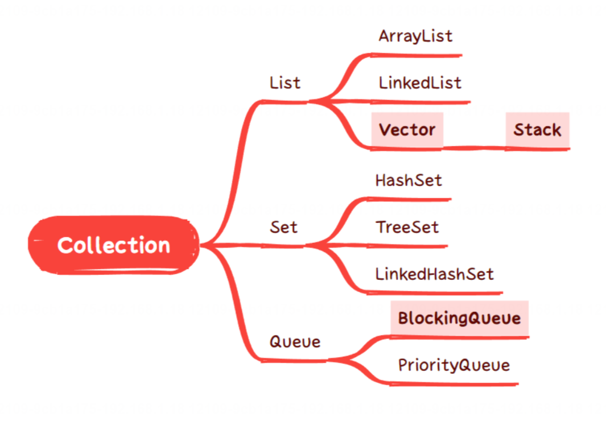
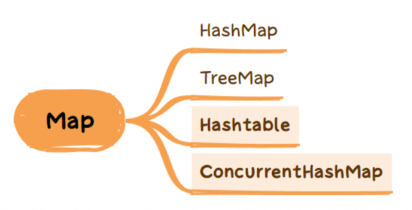
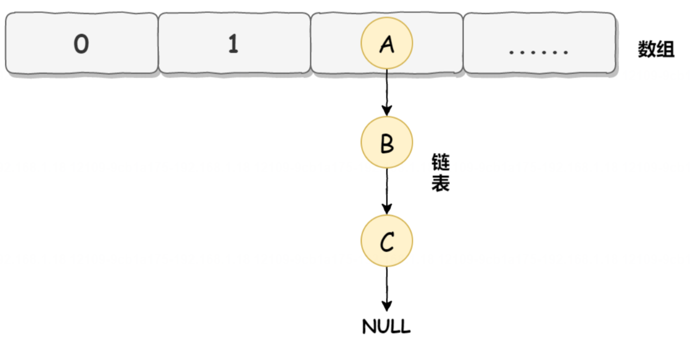
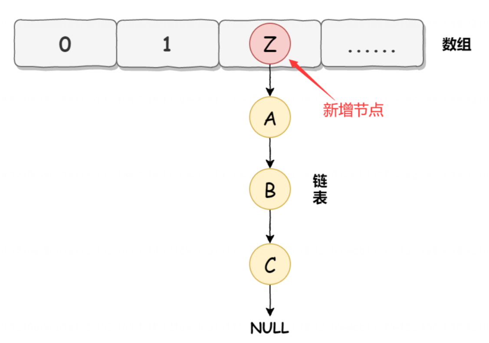
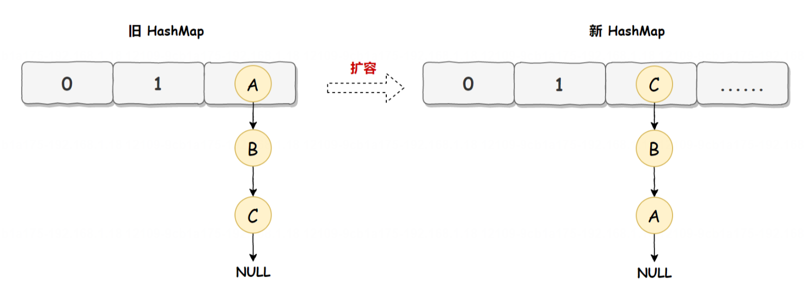
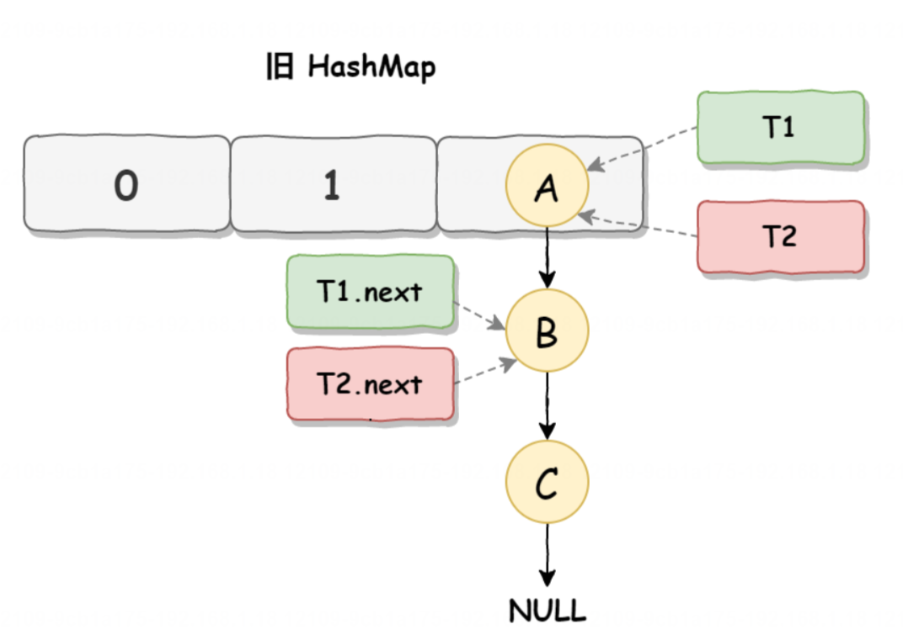
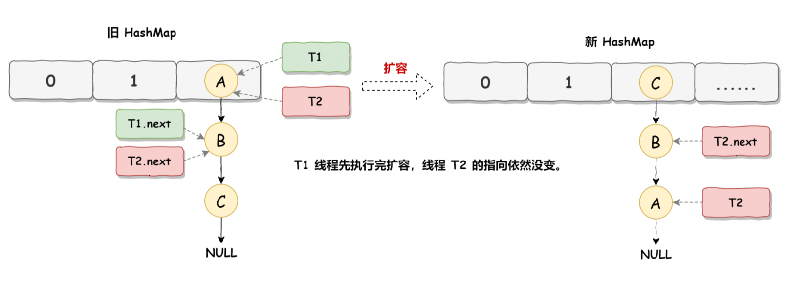
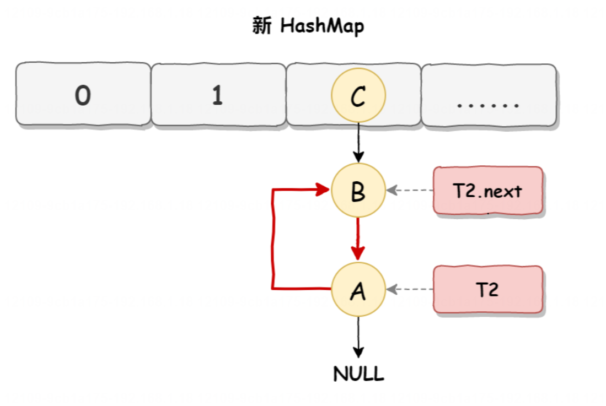

# 重点

## 1. Java中常见的集合有哪些？

>Conllection：List、Set、Queue
>Map：
>栈
>在Java中，常见的集合分类包括：
>
>


## 2. ArrayList 和 LinkedList 有什么区别?

>1、实现 2、插入和删除 3、随机访问 4、内存占用

ArrayList 和 LinkedList 都是 Java 中常用的集合类，它们之间的主要区别在于内部实现和性能特点。

1. 内部实现：
   - ArrayList 内部基于数组实现，它通过数组来存储元素，支持随机访问，即可以通过索引直接访问元素。
   - LinkedList 内部基于双向链表实现，它通过链表来存储元素，每个元素都包含对前一个和后一个元素的引用，不支持随机访问，只能通过遍历来访问元素。

2. 插入和删除操作：
   - ArrayList 在中间或末尾插入或删除元素时，需要移动后续元素，时间复杂度为 O(n)。
   - LinkedList 在中间或末尾插入或删除元素时，只需要修改相邻节点的引用，时间复杂度为 O(1)。

3. 随机访问性能：
   - ArrayList 支持随机访问，可以通过索引快速访问元素，时间复杂度为 O(1)。
   - LinkedList 不支持随机访问，需要从头或尾开始遍历链表才能访问到特定位置的元素，时间复杂度为 O(n)。

4. 内存占用：
   - ArrayList 在存储大量元素时，由于需要预先分配一定大小的数组空间，可能会造成内存浪费。
   - LinkedList 在存储大量元素时，由于每个元素都需要额外的存储空间来保存前后节点的引用，可能会占用更多的内存。

**因此，在多查的场景下考虑使用 ArrayList，而在插入和删除比较多的场景下考虑使用 LinkedList。**

## 3. ArrayList是线程安全的吗？

>1、加锁 2、CopyOnWriteArrayList

ArrayList 不是线程安全的。在多线程环境中，如果多个线程同时尝试修改 ArrayList，可能会导致不一致的状态或者抛出 ConcurrentModificationException 异常。要在多线程环境中安全地使用 ArrayList，你可以考虑使用Collections.synchronizedList 方法来创建一个同步的 ArrayList，或者使用并发集合类如 CopyOnWriteArrayList。再或者加锁。

## 4. HashMap底层是如何实现的？

>数组+链表、红黑树

不同的 JDK 版本，HashMap 的底层实现是不一样的，总体来说:在 JDK 1.8 之前(不包含 JDK 1.8)HashMap 使用的是数组 + 链表实现的，而 JDK 1.8 之后(包含 JDK 1.8)使用的是数组 + 链表或红黑树实现的。

为什么在 JDK 1.8 中要引入红黑树?
主要原因是为了提高查询效率，大家知道链表在很长的时候查询效率是比较低的，因为链表在查询一个元素时，需要从头开始一个一个的进行查询，所以它的査询时间复杂度时 0(n)，那么当链表过长时，查询效率就会比较低。
而红黑树是一种平衡二又搜索树，而平衡二又搜索树，也就是红黑树中的每一个节点，其左子树中的所有节点的值均小于右子树的值，这个特点使得在红黑树上进行查找操作时，可以利用节点的值进行二分查找，从而它的查询的时间复杂度为 O(log n)。
所以，当数据量比较大时，使用红黑树的性能要远远大于链表，因此在 JDK 1.8 中就引入了红黑树，在数据量比较大时就采用红黑树替代链表进行数据存储。

## 5. 为什么HashMap要使用红黑树？而不使用别的树？

HashMap 中之所以使用红黑树，是因为红黑树最合适做 HashMap 多节点的数据存储和查询。因为使用二叉搜索树在某些情况下会退化为链表，所以它的查询效率可能会存在问题;而使用 AVL 树，在添加或删除时，效率又不如红黑树，所以选择使用红黑树是 HashMap 最合适的选择。

HashMap 中之所以使用红黑树，是因为红黑树最合适做 HashMap 多节点的数据存储和查询，为什么要这么说呢?我们这里采用排除法来帮你理解这个问题，对于 HashMap 而言，我们可以使用以下数据结构来进行数据的存储:

1. 二叉搜索树(Binary Search Tree):是一种特殊的二叉树，每个节点的左子树上的节点值都小于该节点的值，右子树上的节点值都大于该节点的值。但二又搜索树在极端的情况下会退化成链表结构，所以并不是最适合的存储结构。
2. AVL 树(Balanced Binary Tree):在二叉搜索树的基础上，增加了平衡性的要求，保持左右子树的高度差不超过 1，通过旋转操作来保持树的平衡。但是因为 AVL 树插入节点或者删除节点，整体的性能不如红黑树,所以也不是最合适的选择。在 AVL树中，每个节点的平衡因子是其左子树高度和右子树高度的差值。平衡因子只能为 -1、0、1，任何节点的平衡因子超过这个范围，就需要通过旋转操作进行平衡调整，使得整个树重新平衡。而红黑树的平衡要求相对宽松，插入和删除操作会导致较少的旋转操作，因此在频繁的插入和删除操作场景下，红黑树的性能可能略优于 AVL 树。
3. 红黑树(Red-Black Tree):也是一种具有平衡性质的二叉搜索树。通过约束节点的颜色(红色或黑色)和些平衡性质来保持树的平衡。红黑树它的查找性能接近于 AVL 树，但增、删节点的效率又优于 AVL 树，因此使用红黑树替代链表是 HashMap 最佳的选择。

## 6. 什么是哈希冲突?如何解决哈希冲突?

哈希冲突指的是当两个不同的输入数据经过哈希函数计算后得到相同的哈希值。哈希函数是将不同长度的输入数据映射为固定长度的输出值的函数。由于哈希函数的输出是固定长度的，而输入的数据可能是任意长度的，所以不同的输入可能会产生相同的哈希值，这就是哈希冲突。

解决哈希冲突的方法有几种：

1. **链地址法（Chaining）**：将哈希表的每个槽（bucket）设为一个链表或者其他数据结构，当发生哈希冲突时，将冲突的元素插入到对应槽的链表中。

2. **开放寻址法（Open Addressing）**：当发生哈希冲突时，通过一定的方法（如线性探测、二次探测、双重散列等）寻找哈希表中的下一个可用位置，直到找到空槽或者找遍整个哈希表。

3. **再哈希法（Rehashing）**：当哈希表的负载因子达到一定阈值时，对哈希表进行扩容，并重新计算所有元素的哈希值，将它们重新插入到新的哈希表中，从而减少哈希冲突的概率。

4. **建立更好的哈希函数**：设计更好的哈希函数可以减少哈希冲突的概率，例如选择合适的哈希算法、考虑输入数据的特征等。

选择哪种解决哈希冲突的方法取决于具体的应用场景和需求。

## 7. HashMap为什么负载因子是 0.75?

负载因子是指哈希表在自动扩容之前可以达到的容量与当前容量的比值。在哈希表中，负载因子的选择会影响到哈希表的性能和空间利用率。

负载因子为 0.75 是一个经验上的选择，它在性能和空间利用率之间取得了一种平衡。具体来说，负载因子为 0.75 的选择是基于以下考虑：

1. **性能优化**：较低的负载因子意味着哈希表在填充元素时会更加稀疏，这有助于减少哈希冲突的数量。当哈希表的负载因子较低时，查找、插入和删除操作的平均时间复杂度会更低，因为哈希冲突的概率更小。

2. **空间利用率**：较高的负载因子意味着哈希表会更加紧凑，占用的内存空间较少。然而，如果负载因子过高，会增加哈希冲突的概率，从而影响到性能。

3. **内存与时间的折衷**：选择负载因子 0.75 是在内存利用率和性能之间取得的一种折衷。它既能够保持较高的空间利用率，又能够在一定程度上减少哈希冲突，提高操作的效率。

总的来说，负载因子为 0.75 是经验上的一个常用选择，能够在绝大多数情况下取得较好的性能和空间利用率的平衡。

## 8. 说一下HashMap的新增流程？

简单来说，HashMap 的元素添加流程如下:

1. 插入之前首先判断容量是否为 0(新建状态尚未使用)，或者可用容量为 0(通过实际容量跟负载因子×总容量进行对比，如果实际容量 >= 负载因子×总容量，那么可用容量就为0了)，判断的结果如果为 true，则先创建对象或先进行扩容操作(扩容操作是创建一个新的哈希表，并将原哈希表中的所有元素重新计算哈希值，并分布到新的哈希表中)，如果为 false 则执行后续流程。
2. 根据 key 值通过哈希函数计算出哈希值，然后根据哈希值得到存储的位置。
3. 如果该索引位置上没有任何元素，直接将元素插入到该位置上，并更新哈希表的元素数量。
4. 如果该索引位置上已经存在元素(可能是一个元素或者一个链表/红黑树)，则进行以下操作:
   a. 判断元素的键是否已经在该位置上存在，如果存在，则更新该键所对应的值(也就是该位置上的值)
     b. 如果不存在，则将新元素添加到红黑树的末尾，如果当前是链表，需要先判断链表长度是否大于 8，且数组长度大于 64，如果满足这两个条件则把链表转成红黑树，然后插入尾部，如果不满足这两个条件中的任何一个，则直接插入到链表尾部。

## 9. 说一下HashMap的查询流程？

HashMap 的主要查询流程是:

1. 根据哈希函数得到 key 的哈希值。
2. 根据哈希值得到哈希表中的存储位置。
3. 查询位置上是否有元素。
   a. 如果没有元素，返回 null。
   b. 如果有元素，逐个对比 key，如果 key 对的上就返回对应的 value，否则返回 null

## 10. HashMap 和 Hashtable 有什么区别?  ★

HashMap 和 Hashtable 都实现了 Map 接口，都是用来存储键值对的数据结构。它们的区别主要有以下几点:

1. 线程安全性:HashMap 是非线程安全的，而 Hashtable 是线程安全的。
2. null 键和 null 值的支持:HashMap 允许键和值都为 nul，即可以插入 null 键和 null 值;而 Hashtable 不允许键或值为 null，如果尝试插入 null 键或 null 值，会抛出NullPointerException。
3. 性能:由于 HashMap 不是线程安全的，在单线程环境下通常有更好的性能。Hashtable 是线程安全的，但会带来额外的同步开销，因此在单线程环境下性能可能较差。

## 11. 为什么Hashtable不允许插入null键和null值? ★ 

简单来说，Hashtable 之所以 key 不允许为 null，和 value 不允许为 null 的原因是，JDK 源码级别做了限制，如果 Hashtable 的 key 或者 value 为 null 就会报空指针异常。

但是，我们看 JDK 源码不难发现，这些判断和错误 Hashtable 完全可以在后续的 JDK 版本中修复和调整代码，可以让其支持 key 和 value 都为 null，为什么它没有修复这个问题呢?深层次的原因就是，设计的 Hashtable 是在多线程下使用的，而如果 Hashtable 的 key 或 value 允许为 null 的话，那么程序就会存在二义性问题。

什么是二义性问题?
所谓的二义性问题是指含义不清或不明确。
如果我们假设 Hashtable 允许插入 null，那么此时它就会有二义性问题，这个 null 值就有两层含义:

1. 这个 key 不存在，所以返回 null。
2. key 存在，并且值本身就为 null，所以返回的就是 null。

而在多线程下，你没有办法证明真伪，因为你在判断证明的时候，其他线程可能同时做了修改，所以不能被证明的义性问题需要从源头上杜绝，所以多线程下的 Hashtable 是不允许 key 和 value 插入 null 值的。
ConcurrentHashMap 也是不允许插入 null，原因和 Hashtable 是一样的(因为有二义性问题)。

为什么 HashMap 允许插入 null 值?
因为 HashMap 设计是在单线程下使用的，而单线程可以证明真伪

## 12. HashMap是线程安全的吗?为什么? ★

>扩容时：环形链表问题  修改时：数据覆盖问题

HashMap 是线程不安全的，原因主要体现在以下两个方面:

1. HashMap 在 JDK 1.7 之前(包含 JDK 1.7)它线程不安全的原因体现在两个方面:
   a.HashMap 可能会造成环形链表，导致程序执行死循环。
   b.多线程下并发执行，可能会导致数据覆盖。
2. HashMap 在 JDK 1.8 之后(包含 JDK 1.8)不再有死循环问题，但依旧存在数据覆盖问题。
   所以，HashMap 是线程不安全的。

##  13. HashMap扩容的时候为什么会死循环问题? ★

HashMap 死循环发生在 JDK 1.7 之前(包含 JDK 1.7)，发生死循环需要满足以下三个条件:

1. 多线程同时执行添加操作。
2. 触发 HashMap 扩容机制。
3. JDK 1.7 之前(包含 JDK 1.7)采用的是头插法。
   以下是 HashMap 发生死循环的具体过程。
   在 JDK 1.7 中 HashMap 的底层数据实现是数组 +链表的方式，如下图所示:
   
   而 HashMap 在数据添加时使用的是头插入，如下图所示
   
   HashMap 正常情况下的扩容实现如下图所示:
   
   旧 HashMap 的节点会依次转移到新 HashMap 中，旧HashMap 转移的顺序是 A、B、C，而新 HashMap 使用的是头插法，所以最终在新 HashMap 中的顺序是 C、B、A，也就是上图展示的那样。有了这些前置知识之后，咱们来看死循环是如何诞生的?

- 死循环执行步骤1
  死循环是因为并发 HashMap 扩容导致的，并发扩容的第一步，线程 T1 和线程 T2 要对 HashMap 进行扩容操作此时 T1 和 T2 指向的是链表的头结点元素 A，而 T1 和 T2 的下一个节点，也就是 T1.next 和 T2.next 指向的是B 节点，如下图所示:
- 死循环执行步骤2
  死循环的第二步操作是，线程 T2 时间片用完进入休眠状态，而线程 T1 开始执行扩容操作，，一直到线程 T1 扩容完成后，线程 T2 才被唤醒，扩容之后的场景如下图所示:从上图可知线程 T1 执行之后，因为是头插法，所以 HashMap 的顺序已经发生了改变，但线程 T2 对于发生的一切是不可知的，所以它的指向元素依然没变，如上图展示的那样，T2 指向的是 A 元素，T2.next 指向的节点是 B元素。
- 死循环执行步骤3
  当线程 T1 执行完，而线程 T2 恢复执行时，死循环就建立了，如下图所示:因为 T1 执行完扩容之后 B 节点的下一个节点是 A，而 T2 线程指向的首节点是 A，第二个节点是 B，这个顺序刚好和 T1 扩完容完之后的节点顺序是相反的。T1 执行完之后的顺序是 B 到 A，而 T2 的顺序是 A 到 B，这样 A 节点和 B 节点就形成死循环了，这就是 HashMap 死循环导致的原因。


## 14. HashMap为什么会数据覆盖?

插入数据时候没有上锁

## 15. 如何保证HashMap线程安全?

要保证 HashMap 的线程安全，可以使用以下几种方法：

1. 使用 ConcurrentHashMap：ConcurrentHashMap 是 Java 提供的线程安全的 HashMap 实现，它使用分段锁（Segment）来保证线程安全，不同的段可以被不同的线程同时访问，从而提高并发性能。

2. 使用 Collections.synchronizedMap 方法：可以通过 Collections.synchronizedMap 方法将 HashMap 包装成线程安全的 Map。这样可以确保在对 HashMap 进行操作时会自动加锁，从而保证线程安全。

3. 使用锁机制：可以使用显示的锁机制，比如 ReentrantLock，来保护 HashMap 的操作。在对 HashMap 进行读写操作时，先获取锁，操作完成后再释放锁，确保同一时刻只有一个线程可以对 HashMap 进行操作。

4. 使用并发工具类：可以使用 Java 并发工具类中的一些线程安全的数据结构，比如 ConcurrentHashMap、CopyOnWriteHashMap 等，来代替 HashMap，从而保证线程安全。

总的来说，要保证 HashMap 的线程安全，可以选择使用线程安全的 HashMap 实现，或者在对 HashMap 进行操作时使用适当的同步机制来保护共享资源，以避免多线程并发访问时出现数据不一致的情况。

## 16. Hashtable是如何保证线程安全的?

Hashtable是Java中的一个线程安全的哈希表实现。它通过使用synchronized关键字来保证线程安全。具体来说，Hashtable中的关键操作（如put和get）都是同步的，即在执行这些操作时会锁住整个Hashtable对象，确保同一时刻只有一个线程可以修改Hashtable的内容，从而避免多线程并发访问时出现数据不一致的情况。

虽然Hashtable是线程安全的，但由于其使用了全局锁，因此在多线程高并发的情况下性能可能会受到影响。在Java 5及之后的版本中，推荐使用ConcurrentHashMap来代替Hashtable，它采用了更加高效的分段锁机制，能够在保证线程安全的同时提高并发性能。

## 17. ConcurrentHashMap为什么是线程安全的? ★

ConcurrentHashMap是线程安全的主要原因在于它内部采用了一种称为分段锁（Segment）的机制来保证线程安全。ConcurrentHashMap将整个数据结构分割成多个小的Segment，每个Segment拥有自己的锁。这样在进行读写操作时，只需要锁住对应的Segment，而不是整个数据结构，从而实现了更细粒度的并发控制。

这种设计使得ConcurrentHashMap在多线程环境下能够更高效地支持并发读写操作，不同的线程可以同时对不同的Segment进行操作，提高了并发性能。同时，ConcurrentHashMap还使用了一些其他的技术手段，比如CAS操作（Compare and Swap）来保证数据的一致性和线程安全性。

总的来说，ConcurrentHashMap之所以是线程安全的，是因为它在内部采用了分段锁和其他并发控制技术，能够有效地处理多线程并发访问的情况，保证数据的正确性和一致性。

## 18. 什么是分段锁？ 实现一个分段锁？★

分段锁是一种将锁细化到每个段(Segment)级别的锁设计。在 ConcurrentHashMap 中，它将整个数据结构分成多个段，每个段只锁定自己的一部分数据。每个段可以看作是一个独立的分组，只锁定该段(Seqment)内部的数据操作，不同的段之间可以并行地进行操作。

-个分段 Segment 下有多个 Entry(哈希桶)，相当于给多个 Entry 进行了分组操作，这样比给所有 Entry 加锁效率要高很多，这样是 ConcurrentHashMap 相比于 Hashtable 性能高的原因，Hashtable 是给所有的 Entry 加同把锁来操作的，而 ConcurrentHashMap 将 Entry 分成了多个 Segment，每个 Seqment 单独加锁，这样就可以实现多个 Segment 一起并发执行了，所以 ConcurrentHashMap 的效率也会越高。

在 Java 中实现分段锁可以使用 `ConcurrentHashMap` 和 `ReentrantLock` 来实现。以下是一个简单的示例代码：

```java
import java.util.concurrent.ConcurrentHashMap;
import java.util.concurrent.locks.Lock;
import java.util.concurrent.locks.ReentrantLock;

public class SegmentedLock {

    private final int segments = 16; // 分段数量
    private final ConcurrentHashMap<Integer, Lock> locks = new ConcurrentHashMap<>();

    public SegmentedLock() {
        for (int i = 0; i < segments; i++) {
            locks.put(i, new ReentrantLock());
        }
    }

    private Lock getLock(Object key) {
        return locks.get(key.hashCode() % segments);
    }

    public void lock(Object key) {
        getLock(key).lock();
    }

    public void unlock(Object key) {
        getLock(key).unlock();
    }

    public static void main(String[] args) {
        SegmentedLock segmentedLock = new SegmentedLock();

        Object key1 = "key1";
        Object key2 = "key2";

        segmentedLock.lock(key1);
        System.out.println("Locked key1");

        segmentedLock.lock(key2);
        System.out.println("Locked key2");

        segmentedLock.unlock(key1);
        System.out.println("Unlocked key1");

        segmentedLock.unlock(key2);
        System.out.println("Unlocked key2");
    }
}
```

在这个示例中，`SegmentedLock` 类实现了一个简单的分段锁。每个对象的哈希码被用来确定应该使用哪个锁。在 `main` 方法中，我们演示了如何使用这个分段锁来锁定和解锁不同的对象。你可以根据自己的需求来扩展和修改这个示例。

## 19. 说一下ConcurrentHashMap的锁优化?

**1.典型回答**
ConcurrentHashMap 锁优化主要有以下两点:
**1. 锁粒度优化**:JDK 1.7 ConcurrentHashMap 使用的是分段锁(加锁多个数组)，而 JDK 1.8 之后是加锁一个数组的头节点。锁粒度更小，意味着在多线程并发环境下执行效率越高。
**2. 锁实现优化**:JDK 1,7 使用的是 ReentrantLock 实现加锁的，而 JDK 1.8 使用的是 CAS 或 synchronized 来实现加锁的，CAS 是乐观锁的实现，相比于 ReentrantLock 和 synchronized 的悲观锁，性能得到了一定的优化。

## 20. ConcurrentHashMap为什么不能插入null?

ConcurrentHashMap 不允许插入 null 键或 null 值是为了避免出现歧义和不一致性。在 ConcurrentHashMap 中，null 值通常被用作标识键不存在的情况，如果允许插入 null 键或 null 值，就会导致无法判断某个键是否存在或者某个值是 null 还是键不存在。这样会给并发环境下的数据操作带来困难和不确定性。

因此，为了保证 ConcurrentHashMap 的一致性和可靠性，设计者选择禁止插入 null 键或 null 值。如果需要在 ConcurrentHashMap 中存储 null 值，可以考虑使用特殊值来代替 null，或者在必要时进行额外的处理和判断。

# 一般性面试题


## 1. 链表的分类有哪些？

在Java中，链表可以根据其实现方式和特性进行分类。常见的链表分类包括：

1. 单向链表（Singly Linked List）：每个节点包含一个指向下一个节点的引用。
2. 双向链表（Doubly Linked List）：每个节点包含一个指向前一个节点和一个指向下一个节点的引用。
3. 循环链表（Circular Linked List）：尾节点指向头节点，形成一个循环。
4. 双向循环链表（Doubly Circular Linked List）：既是双向链表又是循环链表，头节点的前一个节点指向尾节点，尾节点的下一个节点指向头节点。

这些链表分类在Java中都有相应的实现方式，可以根据具体需求选择适合的链表类型。

## 2. 树的分类有哪些？

在Java中，树可以按照多种标准进行分类。以下是一些常见的树分类：

1. **二叉树（Binary Tree）**：每个节点最多有两个子节点，即左子节点和右子节点。

2. **二叉搜索树（Binary Search Tree）**：是一种特殊的二叉树，左子树上的所有节点都小于根节点，右子树上的所有节点都大于根节点。
3. 完全二叉树
4. **AVL树**：是一种自平衡二叉搜索树，通过旋转操作来保持平衡。

5. **红黑树（Red-Black Tree）**：是一种自平衡二叉搜索树，通过约束条件保持平衡，如节点颜色和路径黑高度。

6. **B树（B-Tree）**：一种多路搜索树，每个节点可以有多个子节点，用于磁盘和数据库索引等场景。

7. **B+树（B+ Tree）**：是一种B树的变体，用于数据库和文件系统中的索引结构，提供更好的范围查询性能。

8. **Trie树（字典树）**：是一种树形数据结构，用于存储关联数组，其中所有具有相同前缀的键都共享相同的前缀树。

以上是一些常见的树的分类，每种树都有其特定的应用场景和优势。

## 3. ArrayList 和 Vector 有什么区别? 

==ArrayList 和 Vector 都是 List 的子类，都实现了 List 接口==
二者的区别主要有以下几点:

1. 线程安全不同:Vector 是线程安全的，而 ArrayList 是非线程安全的。在 Vector中，每个方法都使用了synchronized 关键字进行同步，以确保线程安全。
2. 扩容策略不同:Vector 和 ArrayList 都是可以动态扩容的。但是，当动态的长度不同，==Vector 会自动增长当前2的容量一倍，也就是扩容 100%，而 ArrayList 只会增长当前容量的 50%==。
3. 性能不同:ArrayList 由于不具备线程安全的机制，所以在单线程环境下通常有更好的性能。而 Vector 由于是线程安全的，使用 synchronized 修饰，所以会带来额外的加锁和释放锁的性能开销，因此在单线程环境下Vector 性能不如 ArrayList。

## 4. ArrayList是如何进行扩容的?

ArrayList 在添加元素时，会自动进行扩容操作，它的执行步骤如下:

1. 当 ArrayList 的内部数组空间不足以容纳新增的元素时，会触发扩容机制。
2. ArrayList 会创建一个新的更大的数组，通常是==当前数组长度的 1.5 倍==，核心源码 oldCapacity +(oldCapacity>>1)，当然，也可以通过 ensureCapacity 方法手动调整的容量,
3. 然后，ArrayList 会将==原数组中的元素逐个复制到新数组中，以保持元素的顺序==。
4. 扩容完成后，修改 ArrayList 变量的引用为新数组的引用。所以，当需要添加大量元素时，可以考虑在创建 ArrayList 时直接指定初始容量，这样可以减少扩容次数，提高效率。

## 5. Collection 和 Collections 有什么区别? 

"Collection" 和 "Collections" 都是 Java 编程语言中的类。它们之间的区别在于：

1. Collection：是 Java 集合框架中的一个接口，用于表示一组对象的集合。它是所有集合类的根接口，定义了集合类的基本操作，如添加、删除、遍历等。常见的 Collection 接口的实现类有 List、Set 和 Queue 等。

2. Collections：是 Java 集合框架中的一个工具类，提供了一系列静态方法用于操作集合。这些方法包括对集合进行排序、查找最大值、最小值、反转集合等。Collections 类中的方法通常接收 Collection 类型的参数，用于对集合进行操作。

简而言之，Collection 是表示集合的接口，而 Collections 是用于操作集合的工具类。

Collections类是Java中用于操作集合的工具类，常用方法有很多，以下是其中的9个常用方法及对应的使用示例：

1. `sort(List<T> list)`：对List集合进行排序。

```java
List<Integer> numbers = new ArrayList<>(Arrays.asList(3, 1, 2));
Collections.sort(numbers);
System.out.println(numbers); // 输出 [1, 2, 3]
```

2. `reverse(List<?> list)`：反转List集合中元素的顺序。

```java
List<String> names = new ArrayList<>(Arrays.asList("Alice", "Bob", "Charlie"));
Collections.reverse(names);
System.out.println(names); // 输出 ["Charlie", "Bob", "Alice"]
```

3. `shuffle(List<?> list)`：随机打乱List集合中元素的顺序。

```java
List<Character> letters = new ArrayList<>(Arrays.asList('a', 'b', 'c', 'd'));
Collections.shuffle(letters);
System.out.println(letters); // 输出 一个随机排列的字符列表
```

4. `binarySearch(List<? extends Comparable<? super T>> list, T key)`：在已排序的List中使用二分查找算法查找指定元素。

```java
List<Integer> numbers = new ArrayList<>(Arrays.asList(1, 3, 5, 7, 9));
int index = Collections.binarySearch(numbers, 5);
System.out.println(index); // 输出 2
```

5. `addAll(Collection<? super T> c, T... elements)`：将指定元素添加到集合中。

```java
List<String> colors = new ArrayList<>(Arrays.asList("Red", "Green"));
Collections.addAll(colors, "Blue", "Yellow");
System.out.println(colors); // 输出 ["Red", "Green", "Blue", "Yellow"]
```

6. `frequency(Collection<?> c, Object o)`：返回指定元素在集合中出现的次数。

```java
List<Integer> numbers = new ArrayList<>(Arrays.asList(1, 2, 3, 2, 2));
int count = Collections.frequency(numbers, 2);
System.out.println(count); // 输出 3
```

7. `max(Collection<? extends T> coll)`：返回集合中的最大元素。

```java
List<Integer> numbers = new ArrayList<>(Arrays.asList(5, 3, 8, 2, 6));
int max = Collections.max(numbers);
System.out.println(max); // 输出 8
```

8. `min(Collection<? extends T> coll)`：返回集合中的最小元素。

```java
List<Integer> numbers = new ArrayList<>(Arrays.asList(5, 3, 8, 2, 6));
int min = Collections.min(numbers);
System.out.println(min); // 输出 2
```

9. `replaceAll(List<T> list, T oldVal, T newVal)`：替换List中所有指定的元素。

```java
List<String> fruits = new ArrayList<>(Arrays.asList("Apple", "Banana", "Apple", "Orange"));
Collections.replaceAll(fruits, "Apple", "Pear");
System.out.println(fruits); // 输出 ["Pear", "Banana", "Pear", "Orange"]
```

这些是Collections类中的一些常用方法及对应的使用示例，希望对你有帮助。

## 6. CopyOnWriteArrayList是线程安全的吗? 

CopyOnWriteArrayList 是 Java 并发包(java.util.concurrent)中提供的线程安全的 List 实现。
它的特点是在对集合进行并发修改时，==不直接对原始数据进行修改，而是创建一个新的副本进行修改==，从而保证并发修改的安全性。因为每次修改操作都会创建一个副本，所以它适用于读多写少的场景。CopyOnWriteArrayList 的主要特点包括:

1. 线程安全性:CopyOnWriteArrayList是线程安全的，多个线程可以并发地读取数据，而不会导致数据不一致或抛出 ConcurrentModificationException 异常。
2. 写时复制:每当有写操作(添加、删除、修改)发生时，CopyOnWriteArrayList 会创建一个新的复制(副本)集合，这个过程是非常耗费内存的。
3. 读操作效率高:由于读操作并不需要加锁，因此可以实现高效的并发读取，适合读多写少的场景。
4. 写操作效率低:因为写操作涉及到复制整个数据集合，所以写操作的效率相对较低。

## 7. 什么是写时复制技术？

写时复制（Copy-On-Write，简称COW）是一种用于提高并发性能的技术。在Java中，写时复制技术通常用于实现线程安全的集合类，如CopyOnWriteArrayList和CopyOnWriteArraySet。

==写时复制技术的基本原理是在写操作发生时，不直接修改原始数据，而是先复制一份数据副本，然后在副本上进行修改。这样做的好处是多个线程可以同时读取原始数据，而不会出现读写冲突。只有在写操作完成后，才会将修改后的数据副本替换原始数据，从而保证数据的一致性。==

写时复制技术适用于==读操作频繁、写操作较少==的场景，因为每次写操作都会导致数据的复制，可能会带来一定的性能开销。但是在多线程环境下，写时复制技术可以有效地提高程序的并发性能，避免了锁的使用，减少了线程之间的竞争，提高了程序的响应速度。

2.2 Redis中的CopyOnWrite
单线程的 Redis 想要解决一边响应主线程的任务，一边持久化数据，依靠的就是 COW 技术，具体来说就是依赖系统的 fork 函数的 COW 实现的。
具体来说，COW 技术的使用过程是这样的:

1. 在执行 RDB 持久化时，Redis 进程会 fork 一个子进程来执行持久化，该过程是阻塞的。
2. 当 fork 过程完成后，父进程会继续接收客户端的命令，
3. 此时子进程与 Redis 主进程共享内存中的数据，但是子进程并不会修改内存中的数据，而是不断的遍历读取并写入数据到磁盘，也就是持久化数据的过程。
   然而 Redis 主进程则不一样，它需要响应客户端的命令，如果收到写入数据的操作请求，主进程就会使用COW 机制将数据先复制再修改，
4. 而此时，子进程使用的数据页并不会发生任何改变，依然是 fork 时的数据，继续进行持久化。
   这就是 COW 技术在 Redis 中的使用。

## 8. HashMap设置初始容量为17，那么它的实际容量是多少? 

2的n次方
所以是32

## 9. 开放地址法如何找下一个空地址? 

开放地址法是一种解决哈希冲突的方法，其中当发生哈希冲突时，会尝试在哈希表中的其他位置寻找下一个空地址。具体来说，有几种常见的方法可以用来找到下一个空地址：

1. 线性探测：线性探测是一种简单的方法，当发生哈希冲突时，顺序地检查哈希表中的下一个位置，直到找到一个空地址为止。

2. 二次探测：二次探测是一种改进的方法，当发生哈希冲突时，不是顺序地检查下一个位置，而是按照某种固定的步长进行检查，比如依次检查1, 4, 9, 16等位置。

3. 双重哈希：双重哈希是一种更复杂的方法，它使用两个不同的哈希函数来计算下一个位置，以增加地址的散列性。

无论使用哪种方法，找到下一个空地址的关键是要确保在哈希表中的每个位置都有机会被检查，以便最终找到一个空地址来解决哈希冲突。

## 10. 集合和数组的区别和联系？

集合（Collection）和数组（Array）是 Java 中常用的数据结构，它们有一些区别和联系：

1. **大小和可变性**：
   - 数组的大小在创建时确定，并且无法改变。
   - 集合的大小可以动态增长或缩小，根据需要进行调整。

2. **元素类型**：
   - 数组可以包含任何类型的元素，包括基本数据类型和引用数据类型。
   - 集合通常只能包含对象类型的元素，不能直接包含基本数据类型，但可以使用装箱（boxing）操作将基本数据类型包装成对应的包装类。

3. **泛型支持**：
   - 数组不支持泛型，即无法在声明时指定元素类型。
   - 集合支持泛型，可以在声明集合时指定元素的类型，从而提高类型安全性和代码清晰度。

4. **功能和性能**：
   - 数组的功能相对简单，只提供了基本的元素存储和访问功能。
   - 集合提供了丰富的操作方法，如添加、删除、搜索、排序等，更适合复杂的数据操作需求。但是，与数组相比，集合的性能可能会稍低，因为集合通常会涉及更多的内存分配和管理。

尽管集合在许多情况下更灵活和方便，但数组仍然具有其独特的优势，特别是在需要==高性能和固定大小的情况==下。因此，在选择使用集合还是数组时，需要根据具体的需求和情况来进行权衡。

## 11. 为什么签到用bitmap?bitmap有什么好处?

bitmap -> 位数组优势!
1.节约内存空间
2.查询快 -> O(1)