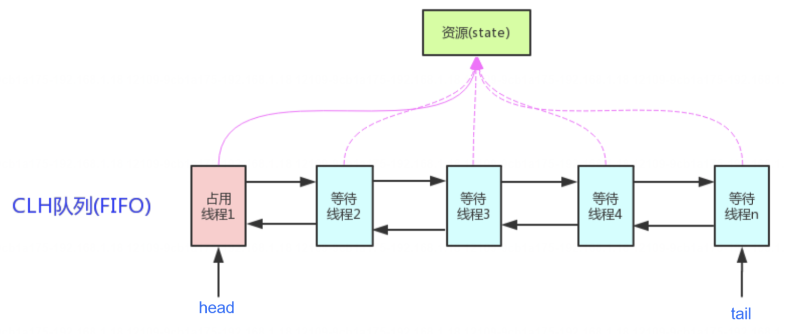
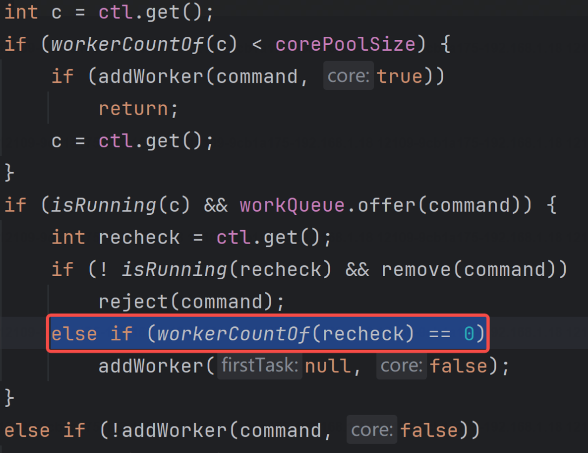

# 并发编程面试题

## 1. 线程和进程？

> 是什么、有什么、本质、上下文切换、进程共享堆和方法区，线程共享虚拟机栈、本地方法栈、程序计数器。

线程（Thread）和进程（Process）是操作系统中的两个基本概念，它们在程序执行中扮演着重要的角色。以下是线程和进程的定义及其区别：

### 进程（Process）

1. **定义**：进程是操作系统进行资源分配和调度的基本单位。它是应用程序运行的实例，由一个或多个线程组成，拥有独立的内存空间。

2. **地址空间**：每个进程都有自己的地址空间，这意味着进程间的内存是隔离的，一个进程的变量不会直接影响到其他进程。

3. **资源分配**：进程拥有独立的系统资源，如文件句柄、内存地址空间等。

4. **创建和管理**：创建进程的成本相对较高，因为操作系统需要为其分配独立的内存和系统资源。

5. **通信**：进程间通信（IPC）通常通过管道、套接字、共享内存等机制实现。

### 线程（Thread）

1. **定义**：线程是进程中的一个执行流，是CPU调度和执行的基本单位。线程自身不拥有系统资源，只拥有一点在运行中必不可少的资源，但它可以与同属一个进程的其他线程共享进程所拥有的资源。

2. **地址空间**：同一进程内的线程共享相同的内存空间和系统资源。

3. **资源分配**：线程的创建和管理成本相对较低，因为它们不需要独立的内存空间。

4. **上下文切换**：线程间的上下文切换比进程间的上下文切换要快，因为线程共享了进程的资源。

5. **通信**：线程间通信更简单，因为它们共享相同的内存空间，可以直接访问进程的全局变量。

### 区别

1. **资源拥有**：进程拥有独立的资源，而线程共享进程的资源。
2. **地址空间**：进程拥有独立的地址空间，线程共享地址空间。
3. **创建成本**：进程创建成本高，线程创建成本低。
4. **上下文切换**：线程的上下文切换比进程快。
5. **通信方式**：线程间通信更简单，进程间通信需要特定的IPC机制。
6. **独立性**：进程是独立的执行单元，而线程依赖于进程存在。
7. **系统调度**：进程是系统资源分配和调度的基本单位，线程依赖于进程由操作系统调度。

理解线程和进程的区别对于设计并发程序和操作系统资源管理非常重要。在多线程编程中，可以利用线程的轻量级和资源共享特性来提高程序的并发性和性能。而在多进程编程中，可以利用进程的独立性和隔离性来提高程序的稳定性和安全性。


## 2. 虚拟线程？

### 什么是虚拟线程？

虚拟线程是Java 19版本引入的一种轻量级线程，也称为用户态线程或纤程。它们由Java虚拟机（JVM）管理，而不是直接由操作系统内核管理。虚拟线程的设计目的是提高应用程序的并发性能，特别是在处理大量I/O密集型任务时，能够显著提高吞吐量和资源利用率。

### 虚拟线程的创建方式有几种？

在Java中，创建虚拟线程有以下几种方式：

1. **使用 `Thread.startVirtualThread()` 方法**：
   ```java
   Thread.startVirtualThread(() -> {
       // 任务代码
   });
   ```

2. **使用 `Thread.ofVirtual()` 方法**：
   ```java
   Thread.ofVirtual().name("my-virtual-thread").start(() -> {
       // 任务代码
   });
   ```

3. **通过 `ThreadFactory` 创建虚拟线程**：
   ```java
   ThreadFactory virtualThreadFactory = Thread.ofVirtual().factory();
   Thread vt = virtualThreadFactory.newThread(() -> {
       // 任务代码
   });
   vt.start();
   ```

4. **使用 `Executors.newVirtualThreadPerTaskExecutor()` 方法**：
   ```java
   try (ExecutorService executor = Executors.newVirtualThreadPerTaskExecutor()) {
       executor.submit(() -> {
           // 任务代码
       });
   }
   ```

### 虚拟线程和普通线程的区别？

虚拟线程和普通线程（平台线程）的主要区别包括：

1. **调度和管理**：
   - 虚拟线程由JVM管理，不占用操作系统线程资源。
   - 普通线程由操作系统管理，直接对应一个操作系统线程。

2. **资源消耗**：
   - 虚拟线程非常轻量级，可以创建大量虚拟线程而不会显著增加系统负担。
   - 普通线程相对较重，每个线程都占用一定的系统资源，如内存和CPU。

3. **上下文切换开销**：
   - 虚拟线程的上下文切换开销小，因为它们在用户态进行。
   - 普通线程的上下文切换开销大，可能涉及用户态和内核态之间的切换。

4. **适用场景**：
   - 虚拟线程适合I/O密集型任务，如网络通信、文件读写等。
   - 普通线程适合CPU密集型任务，或者需要长时间运行的任务。

5. **并发限制**：
   - 虚拟线程没有明显的并发限制，可以支持百万级别的并发。
   - 普通线程的并发数受限于操作系统资源和JVM配置。

6. **API和使用方式**：
   - 虚拟线程通过新的API（如`Thread.ofVirtual()`）创建。
   - 普通线程通过`Thread`类和`Runnable`接口的传统方式创建。

7. **生态系统兼容性**：
   - 虚拟线程是较新的技术，可能与一些依赖于传统线程模型的第三方库不兼容。
   - 普通线程与广泛的Java生态系统完全兼容。

虚拟线程的出现为Java并发编程带来了新的选择，特别是在需要处理大量并发任务的场景下，它们提供了一种更高效、更可扩展的解决方案。然而，它们并不适合所有类型的任务，开发者需要根据具体的应用场景和性能需求来选择使用虚拟线程还是普通线程。

## 3. 线程的常用方法？

> 启动（run、start）、中断（join，sleep，wait，notify，yield，interrupt）属性（name，priority，daemon，alive）

在Java中，`Thread` 类提供了许多方法来控制线程的行为。以下是一些常用的线程方法：

1. **start()**：
   - 启动一个新线程。

2. **run()**：
   - 所有线程都有 `run()` 方法，它包含要在线程中执行的代码。当线程启动时，`run()` 方法会被自动调用。

3. **join()**：
   - 等待该线程终止。调用 `join()` 方法的线程将被阻塞，直到调用 `join()` 方法的线程完成执行。

4. **sleep(long millis)**：
   - 使当前正在执行的线程暂停（或“睡眠”），并允许其他线程运行。`millis` 参数指定暂停的时间（以毫秒为单位）。

5. **yield()**：
   - 暗示调度器当前线程愿意让出对CPU的使用，允许相同优先级的其他线程获得CPU控制权。

6. **interrupt()**：
   - 中断线程。如果线程处于阻塞状态（如调用了 `sleep`、`wait`、`join` 等方法），它会抛出一个 `InterruptedException`。

7. **isInterrupted()**：
   - 检查线程是否被中断。如果线程被中断，返回 `true`。

8. **interrupted()**：
   - 检查当前线程是否被中断，并清除中断状态。如果当前线程被中断，返回 `true` 并清除中断状态。

9. **setName(String name)**：
   - 设置线程的名称。

10. **getName()**：
    - 获取线程的名称。

11. **setPriority(int priority)**：
    - 设置线程的优先级。

12. **getPriority()**：
    - 获取线程的优先级。

13. **setDaemon(boolean daemon)**：
    - 设置线程是否为守护线程。守护线程在所有非守护线程完成后会立即终止。

14. **isDaemon()**：
    - 检查线程是否为守护线程。

15. **stop()**（已过时）：
    - 立即停止线程。由于它不安全，可能会导致资源泄露或不一致的状态，因此不推荐使用。

16. **suspend()** 和 **resume()**（已过时）：
    - 挂起和恢复线程的执行。这些方法也被认为是不安全的，因此不推荐使用。

17. **currentThread()**：
    - 返回对当前执行的线程的引用。

18. **getId()**：
    - 返回线程的唯一ID。

19. **alive()**：
    - 检查线程是否处于活动状态。

20. **getThreadGroup()**：
    - 返回线程所在的线程组。

这些方法提供了对线程生命周期的控制，包括创建、启动、同步、中断和终止线程。在实际编程中，合理使用这些方法可以有效地管理线程行为，提高程序的并发性能和稳定性。

## 4. star和run，start重复调用？

> ①性质不同 ②调用后，线程的状态改变不同 ③调用后，具体效果不同

在 Java 中，`start()` 方法和 `run()` 方法都与线程的执行相关，但它们的作用和行为有所不同。

### `start()` 方法
- `start()` 是 `Thread` 类的一个方法，它用于启动新线程。
- 当你调用 `start()` 方法时，Java 虚拟机（JVM）会为该线程分配调用栈和程序计数器，并将线程放入可运行状态。
- `start()` 方法内部会调用线程的 `run()` 方法，但不是直接调用，而是通过线程调度器来调度线程的执行。
- 一旦线程被启动，它就可能在任何时候开始执行，具体取决于线程调度器和系统资源。
- `start()` 方法只能被调用一次。如果尝试对同一个 `Thread` 对象调用多次 `start()`，将会抛出 `IllegalThreadStateException`。

### `run()` 方法
- `run()` 是 `Thread` 类的一个抽象方法，它需要在子类中被重写以定义线程的行为。
- `run()` 方法定义了线程启动后要执行的代码。
- 当线程被调度执行时，JVM 会调用线程的 `run()` 方法。
- 如果直接调用 `run()` 方法（而不是通过 `start()` 启动线程），那么它的行为就像普通方法一样，不会创建新线程，也不会有并发执行的效果。

### 为什么 `start()` 方法不能被重复调用？

- **资源限制**：每个线程都占用系统资源，如内存和处理器时间。允许重复启动线程可能会导致资源耗尽。
- **线程状态管理**：线程有明确的状态（新建、可运行、阻塞、死亡）。一旦线程完成执行并死亡，它的状态就不能再变回可运行状态。`start()` 方法的设计是让线程只能启动一次，以避免违反线程状态的规则。
- **安全考虑**：防止开发者无意中创建多个线程实例，这可能导致程序行为不可预测和资源竞争。

### 示例
```java
class MyThread extends Thread {
    public void run() {
        System.out.println("Thread is running.");
    }
}

public class Main {
    public static void main(String[] args) {
        MyThread t = new MyThread();
        t.start(); // 正确启动线程
        t.start(); // 抛出异常，因为线程已经被启动过一次
    }
}
```
在上述代码中，第二次调用 `t.start()` 将抛出 `IllegalThreadStateException`，因为线程 `t` 已经被启动过一次。

总结来说，`start()` 方法用于启动新线程，而 `run()` 方法定义了线程的行为。`start()` 方法不能被重复调用，这是为了防止资源耗尽、保持线程状态的一致性，以及确保程序的安全性和可预测性。

## 5. 线程的生命周期?

> ①start之前是new ②调用start-runnable（可运行状态） ③blocked ④waiting ⑤timed waiting ⑥terminated

Java中的线程生命周期包括以下几个状态，以及改变线程状态的方法：

1. **新建（New）**：
   - 线程对象被创建，但还没有调用`start()`方法。
   - 改变状态的方法：调用`start()`方法进入可运行状态。

2. **可运行（Runnable）**：
   - 线程已经调用了`start()`方法，此时线程可能正在运行，也可能正在等待CPU时间片，与其他线程共享CPU资源。
   - 改变状态的方法：由线程调度器根据线程的优先级和系统资源进行调度。

3. **阻塞（Blocked）**：
   - 线程因为等待监视器锁（例如，等待进入同步块或方法）而无法继续执行。
   - 改变状态的方法：其他线程释放了对应的监视器锁。

4. **等待（Waiting）**：
   - 线程通过调用`wait()`、`join()`或`LockSupport.park()`方法进入等待状态，它需要其他线程调用`notify()`、`notifyAll()`或`LockSupport.unpark(Thread)`来唤醒。
   - 改变状态的方法：其他线程调用`notify()`或`notifyAll()`，或者线程被中断。

5. **计时等待（Timed Waiting）**：
   - 线程通过调用带有超时参数的方法（如`sleep(long millis)`、`wait(long timeout)`、`join(long millis)`、`LockSupport.parkNanos()`、`LockSupport.parkUntil()`）进入计时等待状态，它会在指定的超时时间后自动醒来。
   - 改变状态的方法：超时时间到，或者线程被中断。

6. **终止（Terminated）**：
   - 线程的`run()`方法执行完毕，或者因为某个未捕获的异常导致线程结束执行。
   - 改变状态的方法：`run()`方法执行完毕，或者线程中抛出了未捕获的异常。

线程状态转换图：

```
     +-------------------------+
     |            新建           |
     +-------------------------+
             |
             v
     +-------------------------+
     |       可运行            |
     +-------------------------+
             |      |      |
             |      |      |
             v      v      v
     +---------+---------+---------+
     | 阻塞    | 等待    | 计时等待  |
     +---------+---------+---------+
             |      |      |
             |      |      |
             v      v      v
     +-------------------------+
     |          终止           |
     +-------------------------+
```

线程状态的转换通常由线程自身的行为或线程调度器的调度决定。例如，线程可以通过调用`sleep()`进入计时等待状态，或者通过调用`wait()`进入等待状态。线程调度器可能会将可运行状态的线程调度为运行状态，或者在线程等待I/O操作时将其置于阻塞状态。

开发者可以通过以下方法影响线程的状态：

- `start()`：使线程进入可运行状态。
- `yield()`：暗示调度器当前线程愿意让出CPU，线程可能进入可运行状态。
- `join()`：使调用`join()`的线程等待当前线程终止，当前线程可能进入等待状态。
- `sleep(long millis)`：使当前线程进入计时等待状态。
- `wait()`、`notify()`、`notifyAll()`：用于线程间的协调，使线程在等待/通知时进入等待状态。
- `interrupt()`：中断线程，如果线程处于阻塞或等待状态，可能会使其进入可运行状态并抛出`InterruptedException`。

了解线程的生命周期和状态转换对于编写高效、稳定的多线程程序至关重要。

## 6. wait 和 sleep?

> ①用途：等待、休眠 ②唤醒方式 ③锁的释放 ④所属类 

`wait()` 方法和 `sleep()` 方法都是 Java 中用于控制线程暂停执行的方法，但它们之间有几个关键的区别：

1. **用途**：
   - `sleep(long millis)`：用于让当前线程暂停执行指定的时间，让出CPU给其他线程，主要用于线程间的简单协调。
   - `wait()`：用于等待其他线程通知（通过 `notify()` 或 `notifyAll()` 方法），主要用于线程间的复杂协调，特别是等待/通知机制。

2. **所属类**：
   - `sleep()`：是 `Thread` 类的静态方法。
   - `wait()`：是 `Object` 类的方法，因此它只能在同步方法或同步块中调用。

3. **锁释放**：
   - `sleep()`：不会释放对象锁，当前线程仍然持有对象锁。
   - `wait()`：在等待期间会释放对象锁，允许其他线程进入同步方法或同步块。

4. **唤醒方式**：
   - `sleep()`：只能通过时间到达自然醒来。
   - `wait()`：可以通过其他线程调用相同对象的 `notify()` 或 `notifyAll()` 方法被唤醒，或者通过中断（`interrupt()`）被唤醒。

5. **异常**：
   - `sleep()`：如果当前线程在休眠期间被中断，会抛出 `InterruptedException`。
   - `wait()`：如果当前线程在等待期间被中断，同样会抛出 `InterruptedException`，但通常在同步方法或同步块中使用，因此需要捕获和处理异常。

6. **响应中断**：
   - `sleep()`：在抛出 `InterruptedException` 后，当前线程的中断状态将被清除。
   - `wait()`：在抛出 `InterruptedException` 后，可以选择是否清除中断状态。

7. **返回值**：
   - `sleep()`：没有返回值。
   - `wait()`：在被唤醒后立即返回。

8. **调用方式**：
   - `sleep()`：可以直接在任何地方调用。
   - `wait()`：必须在同步方法或同步块中调用，因为它需要与监视器锁（monitor lock）交互。

以下是两个方法的使用示例：

```java
// sleep() 方法的使用
try {
    Thread.sleep(1000); // 当前线程暂停1000毫秒
} catch (InterruptedException e) {
    e.printStackTrace();
}

// wait() 方法的使用
synchronized (object) {
    try {
        object.wait(); // 调用wait()必须在同步方法或同步块中
    } catch (InterruptedException e) {
        e.printStackTrace();
    }
}
```

总结来说，`sleep()` 方法主要用于让当前线程暂停执行，而 `wait()` 方法则用于让当前线程等待其他线程的通知。在使用 `wait()` 方法时，通常涉及到更复杂的线程间协作。

#### wait()方法一定要配合 synchronized 一起使用?

为什么 wait()方法一定要配合 synchronized 一起使用?这是因为 wait()方法的使用场景决定的，wait()主要用于线程间同步和协作的，既然是同步协作的，那么自然就需要同步器 synchronized 来保证其执行的一致性和正确性了，这就是 wait()需要配合 synchronized 一起使用的原因。
>同步和协作，例如一个线程在等待 wait()时，只需要另外一个线程唤醒就可以了，而不需要多个线程同时唤醒这样容易出现混乱，所以唤醒操作 notify()或 notifyA()应该一个线程去执行，那怎么保证只有一个线程执行呢?那就是使用 synchronized 了，而且 wait()和 notify()或 notifyAl()也是互斥的，一个执行在前，一个执行在后，所以它们需要使用同一个 synchronized 来保证互斥性。也就是说，同步协作，想要保证多线程配合不出错，那么使用同步器 synchronized 协调和控制程序的执行，才能真正的保证多线程协作不出错。


## 7. 线程通讯？

> ①共享变量 ②wait、notify、notifyAll condition lock ③阻塞队列 ④并发类 ⑤管道

在Java中，线程之间的通信是一个非常重要的概念，尤其在多线程环境下，线程需要共享数据和资源。下面将详细介绍几种常用的线程通信方式。

### 1. 共享变量

线程可以通过共享变量进行通信。当多个线程访问同一变量时，它们可以读取和修改该值。为了防止数据竞争问题，通常需要使用同步机制（如`synchronized`）。

示例：
```java
class SharedResource {
    private int data;

    public synchronized void setData(int value) {
        data = value; // 设置共享数据
    }

    public synchronized int getData() {
        return data; // 读取共享数据
    }
}
```

### 2. 使用`wait()`, `notify()`, `notifyAll()`

这三种方法是Java中实现线程间通信的基础方法。`wait()`使当前线程等待，`notify()`或`notifyAll()`则用于唤醒等待的线程。

- **`wait()`**：使当前线程等待并释放锁。
- **`notify()`**：唤醒一个在该对象监视器上等待的线程。
- **`notifyAll()`**：唤醒所有在该对象监视器上等待的线程。

示例：
```java
class Message {
    private String message;

    public synchronized String getMessage() {
        while (message == null) {
            try {
                wait(); // 等待消息
            } catch (InterruptedException e) {
                Thread.currentThread().interrupt();
            }
        }
        String msg = message;
        message = null; // 清空消息
        notify(); // 唤醒发送者
        return msg;
    }

    public synchronized void setMessage(String message) {
        while (this.message != null) {
            try {
                wait(); // 等待接收者处理消息
            } catch (InterruptedException e) {
                Thread.currentThread().interrupt();
            }
        }
        this.message = message;
        notify(); // 唤醒接收者
    }
}

// Producer and Consumer example
public class ProducerConsumer {
    public static void main(String[] args) {
        Message msgBox = new Message();

        Thread producer = new Thread(() -> {
            String[] messages = {"Hello", "World", "Java", "Threads"};
            for (String msg : messages) {
                msgBox.setMessage(msg);
                System.out.println("Produced: " + msg);
            }
        });

        Thread consumer = new Thread(() -> {
            for (int i = 0; i < 4; i++) {
                String msg = msgBox.getMessage();
                System.out.println("Consumed: " + msg);
            }
        });

        producer.start();
        consumer.start();
    }
}
```

### 3. 使用`BlockingQueue`

`BlockingQueue`是Java并发包（`java.util.concurrent`）中的一种阻塞队列实现，非常适合用于生产者-消费者模式。它提供了线程安全的插入和删除操作。

示例：
```java
import java.util.concurrent.ArrayBlockingQueue;
import java.util.concurrent.BlockingQueue;

class Producer implements Runnable {
    private BlockingQueue<String> queue;

    public Producer(BlockingQueue<String> queue) {
        this.queue = queue;
    }

    @Override
    public void run() {
        try {
            for (int i = 0; i < 5; i++) {
                String message = "Message " + i;
                queue.put(message); // 阻塞直到队列有空间
                System.out.println("Produced: " + message);
            }
        } catch (InterruptedException e) {
            Thread.currentThread().interrupt();
        }
    }
}

class Consumer implements Runnable {
    private BlockingQueue<String> queue;

    public Consumer(BlockingQueue<String> queue) {
        this.queue = queue;
    }

    @Override
    public void run() {
        try {
            for (int i = 0; i < 5; i++) {
                String message = queue.take(); // 阻塞直到队列有数据
                System.out.println("Consumed: " + message);
            }
        } catch (InterruptedException e) {
            Thread.currentThread().interrupt();
        }
    }
}

// Main class
public class BlockingQueueExample {
    public static void main(String[] args) {
        BlockingQueue<String> queue = new ArrayBlockingQueue<>(10);
        Thread producerThread = new Thread(new Producer(queue));
        Thread consumerThread = new Thread(new Consumer(queue));

        producerThread.start();
        consumerThread.start();
    }
}
```

### 4. 使用`CountDownLatch`, `CyclicBarrier`, 和 `Semaphore`

这些是Java提供的高级同步工具，用于特别的场景。

- **`CountDownLatch`**：允许一个或多个线程等待直到一组操作完成。
- **`CyclicBarrier`**：使一组线程互相等待，直到所有线程都达到某个公共屏障点。
- **`Semaphore`**：控制同时访问某特定资源的线程数量。

示例（`CountDownLatch`）：
```java
import java.util.concurrent.CountDownLatch;

class Task implements Runnable {
    private CountDownLatch latch;

    public Task(CountDownLatch latch) {
        this.latch = latch;
    }

    @Override
    public void run() {
        System.out.println(Thread.currentThread().getName() + " is working.");
        try {
            Thread.sleep(1000);
        } catch (InterruptedException e) {
            Thread.currentThread().interrupt();
        }
        latch.countDown(); // 完成后减少计数
        System.out.println(Thread.currentThread().getName() + " is finished.");
    }
}

public class CountDownLatchExample {
    public static void main(String[] args) throws InterruptedException {
        CountDownLatch latch = new CountDownLatch(3);
        Thread t1 = new Thread(new Task(latch));
        Thread t2 = new Thread(new Task(latch));
        Thread t3 = new Thread(new Task(latch));

        t1.start();
        t2.start();
        t3.start();

        latch.await(); // 等待计数变为0
        System.out.println("All tasks are finished.");
    }
}
```

### 5. 使用`Exchanger`

`Exchanger`用来在两个线程之间交换数据。

示例：
```java
import java.util.concurrent.Exchanger;

class ExchangerExample {
    public static void main(String[] args) {
        Exchanger<String> exchanger = new Exchanger<>();

        Thread thread1 = new Thread(() -> {
            try {
                String message = "Hello from Thread 1";
                exchanger.exchange(message); // 交换数据
                System.out.println("Thread 1 exchanged: " + message);
            } catch (InterruptedException e) {
                Thread.currentThread().interrupt();
            }
        });

        Thread thread2 = new Thread(() -> {
            try {
                String message = exchanger.exchange("Hello from Thread 2"); // 接收数据
                System.out.println("Thread 2 exchanged: " + message);
            } catch (InterruptedException e) {
                Thread.currentThread().interrupt();
            }
        });

        thread1.start();
        thread2.start();
    }
}
```

### 6. 使用`PipedInputStream`和`PipedOutputStream`

通过管道输入输出流，在两个线程间进行字节流通信。

示例：
```java
import java.io.*;

class PipedStreamExample {
    public static void main(String[] args) {
        try {
            PipedOutputStream output = new PipedOutputStream();
            PipedInputStream input = new PipedInputStream(output);

            Thread producer = new Thread(() -> {
                try {
                    output.write("Hello World".getBytes());
                    output.close();
                } catch (IOException e) {
                    Thread.currentThread().interrupt();
                }
            });

            Thread consumer = new Thread(() -> {
                try {
                    int data;
                    while ((data = input.read()) != -1) {
                        System.out.print((char) data);
                    }
                    input.close();
                } catch (IOException e) {
                    Thread.currentThread().interrupt();
                }
            });

            producer.start();
            consumer.start();
        } catch (IOException e) {
            e.printStackTrace();
        }
    }
}
```

### 7. 使用`Future`和`Callable`

用于处理异步任务并获取结果。

示例：
```java
import java.util.concurrent.Callable;
import java.util.concurrent.ExecutionException;
import java.util.concurrent.ExecutorService;
import java.util.concurrent.Executors;
import java.util.concurrent.Future;

class CalculationTask implements Callable<Integer> {
    @Override
    public Integer call() throws Exception {
        Thread.sleep(1000); // 模拟耗时操作
        return 10; // 返回结果
    }
}

public class FutureExample {
    public static void main(String[] args) {
        ExecutorService executor = Executors.newSingleThreadExecutor();
        Future<Integer> future = executor.submit(new CalculationTask());

        try {
            // 这里可以执行其他操作
            Integer result = future.get(); // 获取结果，会阻塞直到结果返回
            System.out.println("Result: " + result);
        } catch (InterruptedException | ExecutionException e) {
            e.printStackTrace();
        } finally {
            executor.shutdown();
        }
    }
}
```

### 总结

Java提供了多种线程间通信的机制，每种方式适合不同的场景。选择合适的方式可以有效解决多线程中的数据共享和协调问题。在实际开发中，需要根据具体需求来决定采用哪种通信方式。希望这篇文章能够帮助您理解Java中线程的通讯机制！如果您有进一步的问题，欢迎随时询问。


**为什么一个线程等待和唤醒的功能需要这么多的实现呢?**
   - Locksupport 存在的必要性:前两种方法 notify 方法以及 signal 方法都是随机唤醒，如果存在多个等待线程的话，可能会唤醒不应该唤醒的线程，因此有 LockSupport 类下的 park 和 unpark 方法指定唤醒线程是非常有必要的。
   - Condition 存在的必要性:Condition 相比于 Object 类的 wait 和 notify/notifyAI 方法，前者可以创建多个等待集，例如，我们可以创建一个生产者等待唤醒对象，和一个消费者等待唤醒对象，这样我们就能实现生产者只能唤醒消费者，而消费者只能唤醒生产者的业务逻辑了

生产者消费者模型是多线程编程中常用的模式，用于解决生产者和消费者之间的数据交换和同步问题。在Java中，可以使用不同的方式来实现生产者消费者模型，包括wait和notify、await和signal、park和unpark。

1. wait和notify：
```java
public class WaitNotifyExample {
    private final Object lock = new Object();
    private boolean flag = false;

    public void producer() {
        synchronized (lock) {
            while (flag) {
                try {
                    lock.wait();
                } catch (InterruptedException e) {
                    e.printStackTrace();
                }
            }
            // 生产数据
            System.out.println("Producing data...");
            flag = true;
            lock.notify();
        }
    }

    public void consumer() {
        synchronized (lock) {
            while (!flag) {
                try {
                    lock.wait();
                } catch (InterruptedException e) {
                    e.printStackTrace();
                }
            }
            // 消费数据
            System.out.println("Consuming data...");
            flag = false;
            lock.notify();
        }
    }
}
```

2. await和signal：
```java
import java.util.concurrent.locks.Condition;
import java.util.concurrent.locks.Lock;
import java.util.concurrent.locks.ReentrantLock;

public class AwaitSignalExample {
    private final Lock lock = new ReentrantLock();
    private final Condition condition = lock.newCondition();
    private boolean flag = false;

    public void producer() {
        lock.lock();
        try {
            while (flag) {
                condition.await();
            }
            // 生产数据
            System.out.println("Producing data...");
            flag = true;
            condition.signal();
        } catch (InterruptedException e) {
            e.printStackTrace();
        } finally {
            lock.unlock();
        }
    }

    public void consumer() {
        lock.lock();
        try {
            while (!flag) {
                condition.await();
            }
            // 消费数据
            System.out.println("Consuming data...");
            flag = false;
            condition.signal();
        } catch (InterruptedException e) {
            e.printStackTrace();
        } finally {
            lock.unlock();
        }
    }
}
```

3. park和unpark：
```java
import java.util.concurrent.locks.LockSupport;

public class ParkUnparkExample {
    private Thread producerThread;
    private Thread consumerThread;

    public void producer() {
        while (true) {
            // 生产数据
            System.out.println("Producing data...");
            LockSupport.unpark(consumerThread);
            LockSupport.park();
        }
    }

    public void consumer() {
        while (true) {
            LockSupport.park();
            // 消费数据
            System.out.println("Consuming data...");
            LockSupport.unpark(producerThread);
        }
    }
}
```

区别和优势：
- wait和notify是Object类的方法，await和signal是Condition接口的方法，park和unpark是LockSupport类的方法。它们的底层实现机制不同，使用方式也略有差异。
- wait和notify是传统的Java多线程同步方式，await和signal是在Java 5中引入的Condition条件变量，park和unpark是在Java 5中引入的LockSupport类。
- await和signal相比wait和notify更加灵活，可以支持多个条件变量，park和unpark更加简洁高效。
- park和unpark相比于wait和notify和await和signal更加底层，可以实现更细粒度的控制。

根据具体的需求和场景，可以选择合适的方式来实现生产者消费者模型。

## 8. 如何停止线程?

> 1. 标记变量 2.中断机制 3.如果使用`ExecutorService`来管理线程，可以通过`Future`对象来取消任务。

在Java中，没有提供直接停止线程的方法，因为突然停止一个线程可能会导致程序处于不一致的状态，或者造成资源泄露。然而，有几种方式可以优雅地停止线程：

1. **使用标志变量**：
   - 定义一个volatile布尔变量作为运行标志，并在线程运行的循环中检查这个标志。如果标志被设置为`false`，则线程可以退出运行状态。

   ```java
   public class StoppableThread extends Thread {
       private volatile boolean running = true;
   
       public void run() {
           while (running) {
               // 执行任务
           }
       }
   
       public void stopRunning() {
           running = false;
       }
   }
   ```

2. **使用中断机制**：
   - 通过调用线程的`interrupt()`方法来请求中断线程。线程应该定期检查中断状态，并在适当的时候退出。

   ```java
   public class InterruptibleThread extends Thread {
       public void run() {
           try {
               while (!Thread.currentThread().isInterrupted()) {
                   // 执行任务
               }
           } catch (InterruptedException e) {
               // 线程被中断，可以进行清理工作
           }
       }
   }
   
   // 在其他地方停止线程
   InterruptibleThread t = new InterruptibleThread();
   t.start();
   t.interrupt(); // 请求中断线程
   ```

3. **使用`Future`和`Callable`**：
   - 如果使用`ExecutorService`来管理线程，可以通过`Future`对象来取消任务。

   ```java
   ExecutorService executor = Executors.newSingleThreadExecutor();
   Future<?> future = executor.submit(new Callable<Object>() {
       public Object call() throws Exception {
           // 执行任务
           return null;
       }
   });
   
   // 取消任务，这将设置线程的中断标志
   future.cancel(true);
   ```

4. **使用`Thread.stop()`方法（不推荐）**：
   - `Thread.stop()`方法可以用来停止线程，但它是过时的（deprecated），并且使用它可能会导致不安全的行为，如死锁或资源泄露。

5. **使用`ExecutorService`的`shutdown`或`shutdownNow`方法**：
   
   - 如果你使用线程池，可以通过调用`shutdown()`或`shutdownNow()`方法来停止所有正在执行的任务。
   
   ```java
   ExecutorService executor = Executors.newFixedThreadPool(10);
   // ... 提交任务
   executor.shutdown(); // 停止接受新任务，但会处理已提交的任务
   executor.shutdownNow(); // 尝试立即停止所有正在执行的任务
   ```

优雅地停止线程通常涉及到线程之间的协作，其中一个线程请求停止，而另一个线程响应请求并退出。这通常通过设置标志、使用中断或其他同步机制来实现。在设计线程时，应该考虑到如何安全地停止线程，并在线程运行的逻辑中适当地检查这些条件。

## 9. 线程池？

### 什么是线程池？

线程池是一种执行器（Executor），用于管理和执行任务的机制。它维护一个线程的池子，这些线程可以并发地执行多个任务。线程池的主要目的是减少在创建和销毁线程时所产生的性能开销。

线程池的主要组成部分包括：

1. **工作线程（Worker Threads）**：线程池中的线程，用于执行任务。
2. **任务队列（Task Queue）**：用于存储等待执行的任务。
3. **线程工厂（Thread Factory）**：用于创建新线程。
4. **拒绝策略（Rejected Execution Handler）**：当任务队列满时，用于处理新提交的任务。

### 为什么要使用线程池？

使用线程池有以下几个主要原因：

1. **资源管理**：
   - 线程池可以限制并发线程的数量，避免因为创建过多线程而导致的资源耗尽。

2. **性能提升**：
   - 线程池可以重用已存在的线程，减少了每次任务执行时创建和销毁线程的开销。

3. **控制并发级别**：
   - 线程池允许开发者根据应用的需求和系统资源来控制并发的线程数量，从而提高资源利用率和程序性能。

4. **提高响应速度**：
   - 工作线程在线程池中处于等待状态，可以立即执行新任务，而不需要等待线程创建。

5. **更好的线程管理**：
   - 线程池提供了一种优雅的方式来管理线程的生命周期，包括线程的创建、执行、生命周期管理以及终止。

6. **提高线程的可监控性和可维护性**：
   - 线程池提供了监控工具，可以帮助开发者监控线程的状态，以及对线程进行适当的维护操作。

7. **避免线程过多竞争资源**：
   - 线程池可以减少线程间的竞争，如竞争数据库连接、文件句柄等资源，从而提高程序的稳定性。

8. **实现任务的优先级**：
   - 一些线程池实现（如`PriorityBlockingQueue`）允许开发者设置任务的优先级，从而控制任务的执行顺序。

Java中的`java.util.concurrent`包提供了丰富的线程池实现，如`Executors`工厂类可以快速创建不同类型的线程池，包括固定大小的线程池、可缓存的线程池、单线程池和定时线程池等。使用线程池是Java并发编程中的最佳实践之一。

## 10. 线程池选择合适的线程数量和拒绝策略？

> 线程数量：CPU密集型任务、IO密集型任务

在使用线程池时，选择合适的线程数量和拒绝策略是至关重要的，因为它们直接影响应用程序的性能和资源利用率。以下是一些指导原则：

### 选择合适的线程数量：

1. **CPU密集型任务**：
   - 对于CPU密集型任务，线程数量通常设置为处理器核心数的1到2倍。这是因为CPU密集型任务主要受限于处理器能力，过多的线程可能会导致上下文切换的开销。

2. **I/O密集型任务**：
   - 对于I/O密集型任务，线程数量可以设置得更多，因为线程在等待I/O操作（如读写网络或文件）时可以被阻塞，让出CPU给其他线程使用。通常，线程数量可以设置为处理器核心数的10倍或更多。

3. **可用资源**：
   - 考虑系统可用的内存和其他资源。线程数量过多可能会导致内存溢出或其他资源限制。

4. **任务特性**：
   - 分析任务的特性，如任务的执行时间、任务的到达率等，以确定合适的线程数量。

5. **经验公式**：
   - 对于多核处理器，一个常见的经验公式是：线程数量 = CPU核心数 × (1 + 等待时间 / 计算时间)。这需要根据实际情况进行调整。

6. **监控和调整**：
   - 监控线程池的性能指标，如线程利用率、队列长度、任务完成时间等，根据监控结果调整线程数量。

### 选择合适的拒绝策略：

`java.util.concurrent.ThreadPoolExecutor` 提供了四种拒绝策略：

1. **AbortPolicy**（默认）：
   - 抛出`RejectedExecutionException`异常，阻止新任务提交。

2. **CallerRunsPolicy**：
   - 调用任务的`run()`方法来运行任务，由调用线程（提交任务的线程）来执行。

3. **DiscardPolicy**：
   - 默默地丢弃无法处理的任务，不抛出异常。

4. **DiscardOldestPolicy**：
   - 丢弃任务队列中最旧的任务，并尝试再次提交新任务。

选择拒绝策略时，应考虑以下因素：

1. **业务需求**：
   - 根据业务的重要性和对延迟的容忍度来选择策略。

2. **资源限制**：
   - 如果系统资源有限，可能需要选择`CallerRunsPolicy`或`DiscardOldestPolicy`来避免资源耗尽。

3. **异常处理**：
   - 如果希望系统能够通知任务提交失败，可以选择`AbortPolicy`。

4. **任务丢失的影响**：
   - 如果任务可以丢失，可以选择`DiscardPolicy`或`DiscardOldestPolicy`。

5. **调试和监控**：
   - 选择能够提供足够信息的策略，以便在出现问题时进行调试和监控。

在实际应用中，可能需要根据具体情况进行实验和调整，以找到最适合应用程序需求的线程数量和拒绝策略。

## 11. 线程池的创建方式有哪些?

在Java中，线程池可以通过以下几种方式创建：

1. **通过`Executors`工厂类**：

   - `Executors` 类是 Java `java.util.concurrent` 包中的一个工厂类，它提供了一些静态工厂方法来创建预定义配置的线程池。这些线程池可以用于管理和执行并发任务。以下是 `Executors` 类提供的几种常用工厂方法：

     1. **`newCachedThreadPool()`**：
        - 创建一个可根据需要创建新线程的线程池，但会在以前构造的线程可用时重用它们。
        - 如果线程在60秒内未被使用，则会被终止并从缓存中移除。
        - 适用于短生命周期的异步任务。

     2. **`newFixedThreadPool(int nThreads)`**：
        - 创建一个可重用固定线程数的线程池。
        - 以最有效的方式运行多个并发线程，适用于负载较重的服务器。

     3. **`newSingleThreadExecutor()`**：
        - 创建一个只有一个线程的线程池，因此它可以用于顺序执行各个任务。
        - 适用于需要保证顺序执行任务的场景。

     4. **`newScheduledThreadPool(int corePoolSize)`**：
        - 创建一个线程池，它可以使用延迟任务或定时周期性执行任务。
        - 适用于需要定时或周期性执行任务的场景。

     5. **`newSingleThreadScheduledExecutor()`**：
        - 创建一个单线程的调度线程池，它可以用于顺序执行任务以及定时或周期性执行任务。

     6. **`newWorkStealingPool(int parallelism)`**：
        - 创建一个工作窃取线程池，它基于ForkJoinPool，能够将任务分散到多个线程上执行。
        - 适用于并行计算，特别是可以分解为多个并行任务的场景。

     7. **`newThreadPoolExecutor(int corePoolSize, int maximumPoolSize, long keepAliveTime, TimeUnit unit, BlockingQueue<Runnable> workQueue, ThreadFactory threadFactory, RejectedExecutionHandler handler)`**：
        - 创建一个具有任意特性的线程池，可以指定核心线程数、最大线程数、存活时间、工作队列、线程工厂和拒绝策略。
        - 这是一个更灵活的创建线程池的方式，但需要手动设置更多的参数。

     使用 `Executors` 类创建线程池的示例：

     ```java
     // 创建一个缓存线程池
     ExecutorService cachedThreadPool = Executors.newCachedThreadPool();
     
     // 创建一个固定大小的线程池
     ExecutorService fixedThreadPool = Executors.newFixedThreadPool(4);
     
     // 创建一个单线程的线程池
     ExecutorService singleThreadExecutor = Executors.newSingleThreadExecutor();
     
     // 创建一个计划线程池
     ScheduledExecutorService scheduledThreadPool = Executors.newScheduledThreadPool(5);
     
     // 创建一个单线程的计划线程池
     ScheduledExecutorService singleThreadScheduledExecutor = Executors.newSingleThreadScheduledExecutor();
     
     // 创建一个工作窃取线程池
     ExecutorService workStealingPool = Executors.newWorkStealingPool();
     ```

     需要注意的是，`Executors` 类提供的线程池在某些情况下可能不是最优的选择，因为它们的配置是固定的，可能不适合所有场景。在需要更精细控制线程池行为时，可以直接使用 `ThreadPoolExecutor` 类来创建线程池。此外，使用 `Executors` 创建的线程池时，应该明确何时关闭线程池，以释放资源。

2. **直接使用`ThreadPoolExecutor`类**：

   - `ThreadPoolExecutor`是`ExecutorService`接口的一个实现，它提供了更灵活的线程池创建方式。
   - 可以指定核心线程数、最大线程数、工作队列、线程工厂、拒绝策略等参数。

   ```java
   int corePoolSize = 10;
   int maximumPoolSize = 50;
   long keepAliveTime = 120;
   TimeUnit unit = TimeUnit.SECONDS;
   BlockingQueue<Runnable> workQueue = new LinkedBlockingQueue<>(100);
   ThreadFactory threadFactory = Executors.defaultThreadFactory();
   RejectedExecutionHandler handler = new ThreadPoolExecutor.AbortPolicy();
   
   ThreadPoolExecutor threadPoolExecutor = new ThreadPoolExecutor(
       corePoolSize,
       maximumPoolSize,
       keepAliveTime,
       unit,
       workQueue,
       threadFactory,
       handler
   );
   ```

3. **通过`ExecutorService`接口的实现**：
   - 如果需要更高级的控制，可以实现`ExecutorService`接口或使用`Executor`的其他实现。

4. **使用`ForkJoinPool`**：
   - `ForkJoinPool`是一种特殊的线程池，专为分治任务和可分解任务设计，它使用了工作窃取算法来提高并行任务的执行效率。

   ```java
   ForkJoinPool forkJoinPool = new ForkJoinPool();
   ```

5. **使用`Executors`类的其他工厂方法**：
   - `Executors`类还提供了一些其他不太常用的工厂方法，如`newWorkStealingPool()`，它创建了一个基于工作窃取算法的线程池。

   ```java
   ExecutorService workStealingPool = Executors.newWorkStealingPool();
   ```

6. **自定义线程池**：
   - 可以通过继承`ThreadPoolExecutor`或实现`Executor`接口来创建自定义的线程池。

创建线程池时，应该考虑应用程序的特定需求，如任务的类型（CPU密集型或I/O密集型）、预期的任务负载、资源限制等。正确选择线程池的大小和类型对于优化资源利用率和提高应用程序性能至关重要。

## 12. 说一下线程池的各个参数的含义？

1. corePoolsize:核心线程数，表示线程池的常驻核心线程数。如果设置为 0，则表示在没有任何任务时，销毁线程池;如果大于 0，即使没有任务时也会保证线程池的线程数量等于此值。但需要注意，此值如果设置的比较小，则会频繁的创建和销毁线程(创建和销毁的原因会在本课时的下半部分讲到);如果设置的比较大，则会浪费系统资源，所以开发者需要根据自己的实际业务来调整此值。
2. maximumPoolSize:最大线程数，表示线程池在任务最多时，最大可以创建的线程数。官方规定此值必须大于0，也必须大于等于 corePoolSize，此值只有在任务比较多，且不能存放在任务队列时，才会用到。
3. keepAliveTime:表示临时线程的存活时间(最大线程数-核心线程数)。当线程池空闲时并且超过了此时间，多余的线程就会销毁，直到线程池中的线程数量销毁的等于 corePoolSize 为止，如果 maximumPoolSize等于 corePoolSize，那么线程池在空闲的时候也不会销毁任何线程。
4. unit:表示临时线程的存活时间单位。它是配合keepAliveTime 参数三共同使用的。
5. workQueue:表示线程池执行的任务队列，当线程池的所有线程都在处理任务时，如果来了新任务就会缓存到此任务队列中排队等待执行。
6. threadFactory:表示线程的创建工厂，此参数一般用的比较少，我们通常在创建线程池时不指定此参数，它会使用默认的线程创建工厂的方法来创建线程。
7. RejectedExecutionHandler:表示指定线程池的拒绝策略，当线程池的任务已经在缓存队列 workOueue 中存储满了之后，并且不能创建新的线程来执行此任务时，就会用到此拒绝策略，它属于一种限流保护的机制。

## 13. 线程工厂有什么用?

在Java线程池中，线程工厂（Thread Factory）的作用是为线程池创建新线程时提供一种定制化的方式来构建线程。线程工厂是一个接口，定义在`java.util.concurrent`包中，其主要方法`newThread(Runnable r)`负责创建一个新的线程。

线程工厂的主要作用包括：

1. **定制线程属性**：
   - 可以为新创建的线程设置特定的属性，如线程名称、优先级、是否为守护线程（daemon thread）、线程组（thread group）等。

2. **统一线程创建逻辑**：
   - 在多线程应用程序中，可以通过线程工厂统一管理线程的创建逻辑，使得线程的创建更加可控和一致。

3. **跟踪和监控**：
   - 可以通过线程工厂添加日志记录、性能监控或其他跟踪信息，以便于监控线程的创建和运行状态。

4. **资源管理**：
   - 在创建线程时，可以执行一些资源管理操作，如分配资源或执行初始化任务。

5. **异常处理**：
   - 可以在创建线程的过程中添加异常处理逻辑，确保线程创建失败时能够恰当地处理异常。

6. **安全性**：
   - 在创建线程时，可以确保线程的创建过程是安全的，例如在多线程环境下同步线程创建过程。

7. **实现特定的创建策略**：
   - 可以实施特定的创建策略，如限制创建的线程数量或实现线程重用策略。

Java中的`Executors`类提供了一个默认的线程工厂`defaultThreadFactory`，它生成的线程具有默认的名称、非守护线程状态、默认优先级和默认的未捕获异常处理器。如果需要定制线程的创建过程，可以实现自己的线程工厂，并在创建线程池时传入。

以下是实现自定义线程工厂的示例：

```java
import java.util.concurrent.ThreadFactory;
import java.util.concurrent.atomic.AtomicInteger;

public class CustomThreadFactory implements ThreadFactory {
    private final AtomicInteger threadNumber = new AtomicInteger(1);
    private final String namePrefix;

    public CustomThreadFactory(String namePrefix) {
        this.namePrefix = namePrefix;
    }

    @Override
    public Thread newThread(Runnable r) {
        Thread t = new Thread(r, namePrefix + "-thread-" + threadNumber.getAndIncrement());
        if (t.isDaemon()) t.setDaemon(false);
        if (t.getPriority() != Thread.NORM_PRIORITY) t.setPriority(Thread.NORM_PRIORITY);
        return t;
    }
}

// 使用自定义线程工厂创建线程池
ExecutorService executor = Executors.newFixedThreadPool(4, new CustomThreadFactory("MyPool"));
```

在这个示例中，`CustomThreadFactory`是一个自定义的线程工厂，它为每个新创建的线程设置了特定的名称前缀，并确保线程不是守护线程，同时设置了默认的优先级。然后，使用这个线程工厂创建了一个固定大小的线程池。

## 14. 线程池是如何运行的？

当有任务来了之后，线程池的执行流程是这样的:
1. 先判断当前线程数是否大于核心线程数，如果结果为 false，则新建线程并执行任务
2. 如果大于核心线程数，则判断任务队列是否已满?如果结果为 false，则把任务添加到任务队列中等待线程执行。
3. 如果任务队列已满，则判断当前线程数量是否超过最大线程数?如果结果为false，则新建线程执行此任务。
4. 如果超过最大线程数，则将执行线程池的拒绝策略。

## 15. 线程池的拒绝策略有哪些?

在Java的线程池实现中，当线程池无法接受新的任务时，可以采取不同的拒绝策略。这些策略由`RejectedExecutionHandler`接口定义，Java并发框架提供了以下几种常用的拒绝策略：

1. **AbortPolicy（默认策略）**：
   - 抛出`RejectedExecutionException`来拒绝新任务的处理请求。
   - 这是默认的拒绝策略，如果没有设置其他的拒绝策略，线程池将使用此策略。

2. **CallerRunsPolicy**：
   - 任务被返回给调用者，即提交任务的线程将在自己的线程中运行该任务。
   - 如果调用者线程能够处理额外的任务负载，这是一种合适的策略。

3. **DiscardPolicy**：
   - 直接忽略无法处理的任务，不抛出异常，也不运行任务。
   - 这种策略可能会导致任务丢失，如果任务不重要或可以丢失，可以使用这种策略。

4. **DiscardOldestPolicy**：
   - 丢弃线程池中等待时间最长的任务，尝试再次提交新的任务。
   - 这种策略适用于长任务队列，可以避免旧任务长时间占用资源。

5. **ThreadPoolExecutor.AbortPolicy**：
   - 与`AbortPolicy`类似，但额外地会将线程池的运行状态设置为`shutdownNow`，这可能会导致正在运行的任务被中断。

6. **自定义拒绝策略**：
   - 开发者可以实现自己的拒绝策略，通过实现`RejectedExecutionHandler`接口来定义当任务被拒绝时的行为。

以下是如何在创建线程池时设置拒绝策略的示例：

```java
import java.util.concurrent.*;

public class ThreadPoolDemo {
    public static void main(String[] args) {
        // 创建一个固定大小的线程池
        int corePoolSize = 5;
        int maximumPoolSize = 10;
        long keepAliveTime = 1;
        TimeUnit unit = TimeUnit.MINUTES;
        BlockingQueue<Runnable> workQueue = new LinkedBlockingQueue<>(100);
        ThreadFactory threadFactory = Executors.defaultThreadFactory();
        RejectedExecutionHandler handler = new ThreadPoolExecutor.AbortPolicy();

        ThreadPoolExecutor executor = new ThreadPoolExecutor(
                corePoolSize,
                maximumPoolSize,
                keepAliveTime,
                unit,
                workQueue,
                threadFactory,
                handler
        );

        // 提交任务
        executor.execute(new Runnable() {
            @Override
            public void run() {
                System.out.println("Task is running.");
            }
        });

        // 关闭线程池
        executor.shutdown();
    }
}
```

在实际应用中，选择哪种拒绝策略取决于业务需求和任务的重要性。例如，对于关键任务，可能希望使用`CallerRunsPolicy`以确保任务被执行；而对于可以丢弃的任务，可以使用`DiscardPolicy`或`DiscardOldestPolicy`。

## 16. 如何实现自定义拒绝策略?  

在Java中，要自定义线程池的拒绝策略，你需要实现`RejectedExecutionHandler`接口，并重写`rejectedExecution(Runnable r, ThreadPoolExecutor executor)`方法。这个方法会在任务被拒绝时被调用。以下是创建自定义拒绝策略的步骤：

1. **创建自定义拒绝策略类**：
   - 实现`RejectedExecutionHandler`接口，并重写`rejectedExecution`方法。

2. **实现拒绝策略逻辑**：
   - 在`rejectedExecution`方法中，定义当任务无法被线程池接受时的行为。

3. **创建线程池**：
   - 使用`ThreadPoolExecutor`构造函数创建线程池，并传入自定义的拒绝策略。

下面是一个自定义拒绝策略的示例，该策略会打印一个警告消息，并尝试再次提交任务到线程池：

```java
import java.util.concurrent.*;

public class CustomRejectedExecutionHandler implements RejectedExecutionHandler {
    @Override
    public void rejectedExecution(Runnable r, ThreadPoolExecutor executor) {
        System.err.println("Thread pool is full, trying to run task in the calling thread.");
        // 尝试在调用者的线程中运行任务
        if (!executor.isShutdown()) {
            r.run();
        }
    }
}

public class ThreadPoolDemo {
    public static void main(String[] args) {
        int corePoolSize = 5;
        int maximumPoolSize = 10;
        long keepAliveTime = 1;
        TimeUnit unit = TimeUnit.MINUTES;
        BlockingQueue<Runnable> workQueue = new LinkedBlockingQueue<>(100);
        ThreadFactory threadFactory = Executors.defaultThreadFactory();
        CustomRejectedExecutionHandler handler = new CustomRejectedExecutionHandler();

        ThreadPoolExecutor executor = new ThreadPoolExecutor(
                corePoolSize,
                maximumPoolSize,
                keepAliveTime,
                unit,
                workQueue,
                threadFactory,
                handler
        );

        // 提交任务
        for (int i = 0; i < 20; i++) {
            executor.execute(new Runnable() {
                @Override
                public void run() {
                    System.out.println("Task is running.");
                    try {
                        Thread.sleep(1000);
                    } catch (InterruptedException e) {
                        Thread.currentThread().interrupt();
                    }
                }
            });
        }

        // 关闭线程池
        executor.shutdown();
    }
}
```

在这个示例中，当线程池无法接受新任务时，自定义的拒绝策略会尝试在提交任务的线程中直接运行任务。这只是一个简单的示例，实际应用中可以根据需要实现更复杂的逻辑，比如将任务放入另一个队列、记录日志、发送警报等。

自定义拒绝策略应该谨慎设计，以确保它不会引入新的问题，如资源耗尽或无限循环。在实现自定义拒绝策略时，始终要考虑线程池的状态和系统的资源限制。

## 17. 如何判断线程池中的任务是否执行完成?

在Java中，如果你使用`ExecutorService`提交了一个任务，可以通过以下几种方式来判断任务是否执行完成：

1. **使用`Future`对象**：
   当你通过`submit()`方法提交一个`Callable`或`Runnable`任务时，它会返回一个`Future`对象。你可以使用这个对象来检查任务的状态或等待任务完成。

   ```java
   ExecutorService executor = Executors.newFixedThreadPool(1);
   Future<?> future = executor.submit(new Runnable() {
       @Override
       public void run() {
           // 任务代码
       }
   });
   
   // 检查任务是否完成
   boolean isDone = future.isDone();
   
   // 等待任务完成
   future.get(); // 这将阻塞直到任务完成，或者抛出异常
   ```

2. **轮询`Future`对象**：
   如果你不想阻塞等待任务完成，可以定期检查`Future`对象的状态。

   ```java
   while (!future.isDone()) {
       // 做一些其他工作或等待
   }
   ```

3. **使用`CountDownLatch`或`CyclicBarrier`**：
   如果你有多个任务需要等待，可以使用`CountDownLatch`或`CyclicBarrier`来等待所有任务完成。

   ```java
   int taskCount = 10;
   CountDownLatch latch = new CountDownLatch(taskCount);
   
   for (int i = 0; i < taskCount; i++) {
       executor.submit(new Runnable() {
           @Override
           public void run() {
               // 任务代码
               latch.countDown();
           }
       });
   }
   
   latch.await(); // 阻塞直到所有任务完成
   ```

4. **使用`Future`的`cancel()`方法**：
   如果你需要取消尚未完成的任务，可以调用`Future`对象的`cancel()`方法。

   ```java
   future.cancel(true); // 尝试中断任务线程
   ```

5. **监听器**：
   如果你需要在任务完成时执行某些操作，可以在任务中添加监听器或回调。

   ```java
   executor.submit(new Runnable() {
       @Override
       public void run() {
           // 任务代码
           // 任务完成后的操作
       }
   });
   ```

6. **使用`invokeAll()`方法**：
   当你需要提交多个任务并等待它们全部完成时，可以使用`invokeAll()`方法。

   ```java
   List<Callable<Object>> tasks = new ArrayList<>();
   // 添加任务到列表
   executor.invokeAll(tasks);
   ```

7. 如果是判断全部完成用：getTaskCount，getCompletedTaskCount。

请注意，当使用`Future.get()`方法时，如果任务尚未完成，它将阻塞调用线程直到任务完成。如果任务执行过程中抛出异常，`get()`方法将抛出`ExecutionException`，你可以捕获这个异常来处理任务执行中的错误。

在设计并发程序时，合理使用这些机制可以有效地管理和监控任务的执行状态。

## 18. Java中导致线程安全问题的因素有哪些? 

线程安全问题指的是在多线程环境下，多个线程同时操作共享资源时，导致程序执行结果与预期不符的问题。线程安全问题可能导致数据的不一致、程序崩溃、死锁等问题。导致线程安全问题的因素主要有以下几点:
1. **多线程同时执行**:多个线程同时执行是造成并发问题的根本原因。
2. **操作共享数据**:当多个线程访问和修改同一块共享数据时，可能会导致数据覆盖，数据可见性等问题
3. **非原子操作**:某些操作虽然看起来是单个语句，但在计算机内部可能被分解为多个步骤。如果这些操作在多线程环境中没有得到适当同步，就可能导致线程安全问题。
4. **指令重排序**:编译器和处理器为了优化性能，可能会对代码进行重新排序。这种重排序在单线程环境下通常是安全的，但在多线程环境下可能会导致意料之外的结果。
5. **内存可见性问题**:在多线程环境中，一个线程对共享变量的修改可能不会立即对其他线程可见。这是因为每个线程都有自己的本地缓存，而且编译器和处理器可能会进行各种优化。

## 19. 如何解决线程安全问题?

解决线程安全问题通常涉及确保多个线程在访问共享资源时保持数据的一致性和完整性。以下是一些常见的策略和技术：

1. **同步**：
   - 使用`synchronized`关键字或`ReentrantLock`来同步代码块或方法，确保一次只有一个线程可以执行特定的代码段。

2. **锁**：
   - 使用显式锁（如`ReentrantLock`）来更细粒度地控制线程对资源的访问。

3. **不可变对象**：
   - 使用不可变对象（即对象一旦创建就不能被修改）来避免线程间的数据竞争。

4. **线程局部变量**：
   - 使用`ThreadLocal`类为每个线程提供局部变量副本，确保线程间的数据隔离。

5. **原子变量**：
   - 使用`java.util.concurrent.atomic`包中的原子类（如`AtomicInteger`、`AtomicLong`等）来实现无锁的线程安全操作。

6. **volatile关键字**：
   - 使用`volatile`关键字确保变量的可见性和有序性，但它不能保证复合操作的原子性。

7. **设计不可变类**：
   - 设计类时，确保所有字段都是`final`的，并且不提供修改这些字段的方法。

8. **使用并发集合**：
   - 使用`java.util.concurrent`包中的线程安全集合，如`ConcurrentHashMap`、`CopyOnWriteArrayList`等。

9. **避免共享资源**：
   - 尽可能设计无状态的或有最小共享状态的并发算法，以减少线程间的竞争。

10. **使用线程池**：
    - 使用线程池来管理线程的生命周期，减少创建和销毁线程的开销，并提供更好的资源管理和监控。

11. **正确使用并发工具**：
    - 使用`java.util.concurrent`包中的并发工具和框架，如`ExecutorService`、`CountDownLatch`、`CyclicBarrier`、`Semaphore`等。

12. **最小化锁的粒度**：
    - 尽可能减少锁的范围和持有时间，避免长锁和锁的嵌套。

13. **读写锁**：
    - 对于读多写少的场景，使用`ReadWriteLock`来允许多个读线程同时访问资源，但写线程需要独占访问。

14. **避免死锁**：
    - 通过设计避免死锁，例如使用顺序锁或尝试锁（`tryLock`）。

15. **测试和验证**：
    - 使用并发测试工具和方法（如`jcstress`）来验证代码在多线程环境下的正确性。

解决线程安全问题需要综合考虑应用程序的设计和实现，以及对并发编程原则的深入理解。在设计阶段就应该考虑到线程安全，并且在实现时采取适当的同步措施。

## 20. synchronized和ReentrantLock?

synchronized 和 ReentrantLock 都提供了锁的功能，都是 Java 中保证线程安全的主要手段，但它们有很大的区别。
- **synchronized 属于独占式悲观锁，是通过 JVM 隐式实现的，synchronized 只允许同一时刻只有一个线程操作资源**。
- **ReentrantLock 是 Lock 的默认实现方式之一，它是基于 AQS(Abstract Queued Synchronizer，队列同步器)实现的，它默认是通过非公平锁实现的，在它的内部有一个 state 的状态字段用于表示锁是否被占用，如果是0 则表示锁未被占用，此时线程就可以把 state 改为 1，并成功获得锁，而其他未获得锁的线程只能去排队等待**

`synchronized` 和 `ReentrantLock` 都是Java中用于实现线程同步的手段，它们可以用来确保多个线程在访问共享资源时保持一致性和线程安全。尽管它们的目的相同，但在使用方式和特性上有一些区别：

1. **实现方式**：
   - `synchronized` 是Java内置的关键字，提供了一种简单而强大的同步机制。
   - `ReentrantLock` 是`java.util.concurrent.locks`包中的一个类，提供了更灵活的锁定机制。

2. **锁的公平性**：
   - `synchronized` 不支持直接设置公平性（fairness），它依赖于JVM的实现。
   - `ReentrantLock` 允许你指定锁的公平性。公平锁可以减少线程饥饿，但可能会降低性能。

3. **锁的获取和释放**：
   - `synchronized` 通过监视器锁（monitor）自动获取和释放锁。
   - `ReentrantLock` 需要显式地调用`lock()`和`unlock()`方法来获取和释放锁。

4. **锁的可重入性**：
   - `synchronized` 和 `ReentrantLock` 都支持可重入性，即同一线程可以多次获取同一锁。

5. **锁的中断处理**：
   - `synchronized` 不支持中断，当线程等待获取锁时，不能响应中断。
   - `ReentrantLock` 支持中断，可以通过`lockInterruptibly()`方法来获取锁，该方法可以在等待时响应中断。

6. **条件变量**：
   - `synchronized` 可以通过`wait()`、`notify()`和`notifyAll()`方法与条件变量一起使用。
   - `ReentrantLock` 提供了更丰富的条件变量支持，通过`Condition`对象实现。

7. **锁的尝试获取**：
   - `synchronized` 不支持尝试获取锁。
   - `ReentrantLock` 提供了`tryLock()`方法，允许尝试获取锁，如果锁不可用，可以立即返回或在指定时间内等待。

8. **锁的超时获取**：
   - `synchronized` 不支持超时获取锁。
   - `ReentrantLock` 通过`tryLock(long timeout, TimeUnit unit)`方法支持超时获取锁。

9. **锁的绑定多个条件**：
   - `synchronized` 只能与一个条件变量绑定。
   - `ReentrantLock` 可以与多个`Condition`对象绑定，提供更灵活的条件变量支持。

10. **性能考虑**：
    - 在某些情况下，`synchronized` 可能比 `ReentrantLock` 更高效，因为它的实现更简单。
    - `ReentrantLock` 提供了更多的功能，但可能会带来额外的性能开销。

选择`synchronized`还是`ReentrantLock`取决于具体的需求。如果需要简单的同步机制，`synchronized`可能是更好的选择。如果需要更复杂的锁定策略，如可中断的锁获取、超时获取或公平性，`ReentrantLock`可能更适合。

## 21. volatile能保证线程安全吗?

`volatile` 关键字在Java中是一个重要的同步机制，但它并不能保证所有的线程安全场景。`volatile` 主要提供了两个保证：

1. **可见性**：
   - `volatile` 保证了对变量的写操作对所有线程都是可见的。当一个线程修改了 `volatile` 变量的值时，新值对其他线程来说是立即可见的，无需进行缓存一致性协议的同步。

2. **有序性**：
   - `volatile` 保证了对 `volatile` 变量的读写操作不会发生指令重排。这确保了在多线程环境中，`volatile` 变量的读写操作的顺序与其他操作的顺序保持一致。

尽管 `volatile` 提供了这些保证，但它并不能保证原子性。原子性是指一个操作或者多个操作成为一个不可分割的单元，要么全部执行，要么全部不执行。例如，`volatile` 不能保证复合操作（如递增操作 `i++` 或 `i += 1`）的原子性。

以下是一些 `volatile` 能确保线程安全的场景：

- **标志位**：
  - `volatile` 变量常用作标志位，例如，指示某个任务是否完成或某个资源是否可用。

- **状态变量**：
  - 当 `volatile` 变量用于表示状态信息，并且状态的改变不依赖于当前值时（如开/关标志），`volatile` 可以确保状态的可见性。

然而，在需要原子性操作的场景中，`volatile` 是不够的。例如，如果你需要执行一个复合操作，如递增计数器或更新共享变量，你应该使用`synchronized`块、`ReentrantLock`或其他并发工具来确保线程安全。

总结来说，`volatile`可以确保变量的可见性和有序性，但它不能保证复合操作的原子性。因此，`volatile`本身并不足以解决所有线程安全问题，它适用于特定的场景，而在需要原子性操作时，应该使用其他的同步机制。

## 22. volatile使用场景有哪些? 

`volatile` 关键字在Java中主要用于保证变量的可见性和有序性，但它不保证复合操作的原子性。以下是`volatile`的一些典型使用场景：

1. **状态标志**：
   - `volatile`常用于作为状态标志，例如，控制线程间通信的开关或信号量。

   ```java
   volatile boolean running = true;
   ```

2. **中断标志**：
   - 在多线程程序中，用于中断线程执行的标志。

   ```java
   volatile boolean interrupted = false;
   ```

3. **一写多读的场景**：
   - 当变量的写操作不依赖于其当前值时，例如，计数器的增加操作不是基于当前值的。

   ```java
   volatile long counter = 0;
   ```

4. **缓存变量**：
   - 当变量需要被频繁读取，并且对变量的更新不需要非常严格的同步时。

5. **监听器或回调**：
   - 在某些设计模式中，如观察者模式，`volatile`可以用来确保监听器或回调的可见性。

6. **非原子的简单变量**：
   - 对于简单的变量，如布尔标志或枚举，`volatile`可以确保它们的可见性。

7. **版本控制**：
   - 在某些并发算法中，`volatile`可以用来实现版本控制，以确保操作的顺序。

8. **状态指示器**：
   - 用于指示某个过程或任务的状态，如初始化完成、数据加载完成等。

9. **单例模式中的双重检查锁定**：
   - 在实现线程安全的单例时，`volatile`确保实例在初始化时的可见性。

   ```java
   public class Singleton {
       private static volatile Singleton instance;
       private Singleton() {}
       public static Singleton getInstance() {
           if (instance == null) {
               synchronized (Singleton.class) {
                   if (instance == null) {
                       instance = new Singleton();
                   }
               }
           }
           return instance;
       }
   }
   ```

10. **与`AtomicStampedReference`或`AtomicMarkableReference`一起使用**：
    - 这些原子类使用`volatile`变量来存储版本号或标记，以提供原子的读-改-写操作。

需要注意的是，尽管`volatile`在某些场景下非常有用，但它并不能完全替代锁机制。在需要原子性操作或更复杂的并发控制时，应该使用`synchronized`、`ReentrantLock`或其他并发工具。

## 23. 为什么双重效验锁一定要加volatile?

双重效验锁指的是单例懒汉模式中，通过双重检查的方式，创建对象的一种机制。那问题来了，双重效验锁为什么定要加 volatile?
因为加了 volatile 之后，==就可以禁止指令重排序了==，这样就能确保单例对象的线程安全，例如以下代码:

```java
public class LazySingleton {
    private static volatile LazySingleton instance;

    private LazySingleton() {
        // 私有构造方法
    }

    public static LazySingleton getInstance() {
        if (instance == null) {
            synchronized (LazySingleton.class) {
                if (instance == null) {
                    instance = new LazySingleton();②
                }
            }
        }
        return instance;
    }
}
```
以上问题发生在代码 ② 这一行"instance = new Singleton();”，这行代码看似只是一个创建对象的过程，然而它的实际执行却分为以下3 步:
1. 创建内存空间。
2. 在内存空间中初始化对象 singleton。
3. 将内存地址赋值给 instance 对象(执行了此步骤，instance 就不等于 nul 了)

如果此变量不加 volatile，那么线程 1在执行到上述代码的第 ② 处时就可能会执行指令重排序，将原本是 1.2、3 的执行顺序，重排为 1、3、2。但是特殊情况下，线程1 在执行完第 3步之后，如果来了线程2 执行到上述代码的第 ① 处，判断 instance 对象已经不为 nul，但此时线程 1 还未将对象实例化完，==那么线程 2 将会得到个被实例化“一半”的对象，从而导致程序执行出错，这就是为什么要给私有变量添加 volatile 的原因了==

## 24.什么是JMM？JMM有什么问题？如何解决?

### 什么是JMM？

Java内存模型（Java Memory Model，简称JMM）是一个抽象的概念，它定义了Java程序中各种变量（包括实例字段、静态字段等）的访问规则，以及这些变量在Java虚拟机（JVM）中的工作内存和主内存之间的交互方式。JMM的主要目的是解决多线程环境下的线程安全问题，确保程序的正确性。	

> Java内存模型（Java Memory Model，JMM）是Java语言规范的一部分，它定义了Java程序中内存的工作原理，特别是对于多线程程序。JMM确保了在多线程环境中，不同线程之间对共享变量的访问能够按照预期的方式进行，从而保证程序的线程安全性和内存一致性。
>
> ### 主要概念
>
> 1. **主内存（Main Memory）**：
>    - 主内存是所有线程共享的内存区域，存储了所有的变量和对象。
>
> 2. **工作内存（Working Memory）**：
>    - 每个线程都有自己的工作内存，它是主内存的私有拷贝。线程对变量的操作首先在工作内存中进行，然后同步到主内存中。
>
> 3. **内存可见性（Visibility）**：
>    - 一个线程对共享变量的修改，其他线程可能看不到。JMM通过`volatile`关键字、同步机制等来保证变量的可见性。
>
> 4. **原子性（Atomicity）**：
>    - 某些操作需要不可分割地执行，JMM通过同步机制和原子类来保证操作的原子性。
>
> 5. **有序性（Ordering）**：
>    - 指令重排序可能导致多线程程序的行为不符合预期。JMM通过`volatile`关键字和同步机制来保证操作的有序性。
>
> ### 内存操作
>
> JMM定义了以下八种操作，这些操作是原子的：
>
> 1. **lock（锁定）**：作用于主内存中的变量，将一个变量标识为一条线程独占的状态。
> 2. **unlock（解锁）**：作用于主内存中的变量，解除锁定。
> 3. **read（读取）**：作用于主内存中的变量，将变量值读到工作内存。
> 4. **load（载入）**：作用于工作内存中的变量，将read操作读取的值放入工作内存。
> 5. **use（使用）**：作用于工作内存中的变量，将工作内存中的值用于后续操作。
> 6. **assign（赋值）**：作用于工作内存中的变量，将新值赋给工作内存中的变量。
> 7. **store（存储）**：作用于工作内存中的变量，将值从工作内存同步到主内存。
> 8. **write（写入）**：作用于主内存中的变量，将store操作的值写入主内存。
>
> ### 内存屏障
>
> 内存屏障（Memory Barrier）是一种同步机制，用于控制特定操作的执行顺序。JMM提供了以下四种内存屏障：
>
> 1. **LoadLoad Barriers**：禁止当前屏障之前的所有load操作被重排序到该屏障之后。
> 2. **StoreStore Barriers**：禁止当前屏障之前的所有store操作被重排序到该屏障之后。
> 3. **LoadStore Barriers**：禁止当前屏障之前的load操作被重排序到该屏障之后的store操作之后。
> 4. **StoreLoad Barriers**：禁止当前屏障之前的store操作被重排序到该屏障之后的load操作之后。
>
> ### 解决问题
>
> JMM通过以下机制来解决多线程编程中的常见问题：
>
> 1. **使用`volatile`关键字**：确保变量的可见性和有序性。
> 2. **使用同步机制**：如`synchronized`和`Lock`接口，确保原子性和可见性。
> 3. **使用原子类**：如`AtomicInteger`，提供无锁的原子操作。
> 4. **使用线程安全的数据结构**：如`ConcurrentHashMap`，提供线程安全的集合操作。
>
> JMM是Java并发编程的基础，理解JMM对于编写正确、高效的多线程程序至关重要。

### JMM存在的问题

在多线程编程中，JMM面临以下几个主要问题：

1. **内存可见性问题**：一个线程对共享变量的修改可能不会立即被其他线程看到。这是因为每个线程都有自己的工作内存，它可能缓存了共享变量的副本。

2. **指令重排序问题**：现代编译器和处理器为了优化性能，可能会对指令进行重排序。这种重排序可能会导致多线程程序中出现不可预期的行为。

3. **原子性问题**：在没有适当同步的情况下，一个复合操作（如递增操作`i++`）可能会被分解成多个步骤，导致其他线程看到中间状态。

### 如何解决JMM的问题？

1. **使用`volatile`关键字**：
   - 确保变量的可见性：`volatile`修饰的变量的修改对所有线程立即可见。
   - 禁止指令重排序：`volatile`变量的读写操作会插入内存屏障，防止编译器和处理器对这些操作进行重排序。

2. **使用同步机制**：
   - `synchronized`关键字：可以用于方法或代码块，确保同一时间只有一个线程执行同步代码块。
   - `Lock`接口及其实现类：提供了比`synchronized`更灵活的锁定机制。

3. **使用原子类**：
   - `java.util.concurrent.atomic`包提供了一组原子类，如`AtomicInteger`、`AtomicLong`等，它们利用CAS（Compare-And-Swap）操作来保证操作的原子性。

4. **使用线程安全的数据结构**：
   - `java.util.concurrent`包提供了许多线程安全的数据结构，如`ConcurrentHashMap`、`CopyOnWriteArrayList`等。

5. **使用线程局部变量**：
   - `ThreadLocal`类提供了线程局部变量，每个线程都有自己的变量副本，避免了线程间的数据共享。

6. **正确使用`final`关键字**：
   - 对于不会改变的共享变量，可以使用`final`修饰，确保变量的不变性和可见性。

通过上述方法，可以有效地解决JMM在多线程环境下面临的问题，确保程序的正确性和线程安全。

## 25. 说一下volatile的实现原理?

volatile 关键字在底层的实现主要是通过内存屏障(memory barrier)来实现的。内存屏障是一种 CPU 指令，用于强制执行 CPU 的内部缓存与主内存之间的数据同步。在 Java 中，当线程读取一个 volatile 变量时，会从主内存中读取变量的最新值，并把它存储到线程的工作内存中。当线程写入一个 volatile 变量时，会把变量的值写入到线程的工作内存中，并==强制将这个值刷新到主内存中这样就保证==了 volatile 变量的可见性和有序性。
在 Java 5 之后，volatile 的实现还引入了“内存屏障插入”的机制，==内存屏障插入是指在指令序列中插入内存屏障以保证变量的可见性和有序性。==

## 26. 什么是ThreadLocal?它底层是如何实现的?

### Java的ThreadLocal是什么？

`ThreadLocal` 是 Java 提供的一个用于创建线程局部变量的工具，它能够为每个使用该变量的线程提供一个独立的变量副本。这意味着每个线程都可以访问自己独立的变量，而不会与其他线程的变量冲突。`ThreadLocal` 常用于实现线程安全，尤其是在需要为每个线程提供特定资源或数据时，如数据库连接、用户会话信息等。

### 底层实现原理

`ThreadLocal` 的底层实现主要依赖于 `ThreadLocalMap` 类，这个类是 `ThreadLocal` 的静态内部类，它继承自 `java.util.WeakHashMap`。以下是 `ThreadLocal` 实现的关键点：

1. **ThreadLocalMap**：
   - 每个线程的 `Thread` 对象内部都有一个 `ThreadLocal.ThreadLocalMap`，这个映射表存储了线程局部变量。
   - `ThreadLocalMap` 的键是 `ThreadLocal` 对象，值是线程存储的局部变量值。

2. **弱引用**：
   - `ThreadLocalMap` 的键（即 `ThreadLocal` 对象）是弱引用，这意味着如果没有任何强引用指向 `ThreadLocal` 对象，它可能会被垃圾回收器回收。

3. **初始化和访问**：
   - 当一个线程首次访问 `ThreadLocal` 变量时，`ThreadLocal` 会为该线程创建一个新的 `ThreadLocalMap` 条目，并将值初始化为 `ThreadLocal` 的初始值（如果有的话）。
   - 后续对该变量的访问会直接从线程的 `ThreadLocalMap` 中获取值。

4. **清理**：
   - 由于 `ThreadLocalMap` 的键是弱引用，当 `ThreadLocal` 对象被回收时，对应的键会被垃圾回收器清除。但是，值仍然是强引用，如果不手动清除，可能会导致内存泄漏。
   - 因此，当不再需要 `ThreadLocal` 变量时，应该调用 `ThreadLocal.remove()` 方法来清除线程的 `ThreadLocalMap` 中的条目，释放资源。

### Java代码示例

以下是一个使用 `ThreadLocal` 的 Java 代码示例，展示了如何在多线程环境中使用 `ThreadLocal` 来存储线程特定的数据：

```java
public class ThreadLocalExample {
    private static final ThreadLocal<Integer> threadLocalValue = ThreadLocal.withInitial(() -> 1);

    public static void main(String[] args) {
        Thread t1 = new Thread(() -> {
            System.out.println("Thread 1: " + threadLocalValue.get());
            threadLocalValue.set(2);
            System.out.println("Thread 1 after set: " + threadLocalValue.get());
            threadLocalValue.remove(); // 清理资源
        });

        Thread t2 = new Thread(() -> {
            System.out.println("Thread 2: " + threadLocalValue.get());
            threadLocalValue.set(3);
            System.out.println("Thread 2 after set: " + threadLocalValue.get());
            threadLocalValue.remove(); // 清理资源
        });

        t1.start();
        t2.start();
    }
}
```

在这个示例中，每个线程都有自己的 `ThreadLocal` 变量副本，它们互不影响。每个线程在开始时都会从 `ThreadLocal` 获取初始值（这里是1），然后可以设置自己的值。在线程结束时，调用 `remove()` 方法来清理 `ThreadLocalMap` 中的条目，避免内存泄漏。

这个示例展示了 `ThreadLocal` 如何在多线程环境中为每个线程提供独立的变量副本，从而实现了线程安全。

## 27. ThreadLocal为什么会导致内存泄漏?

`ThreadLocal` 变量可能导致内存泄漏的原因主要与其实现机制有关。以下是导致内存泄漏的几个关键因素：

1. **线程的生命周期**：
   - 在 Java 应用中，线程可能会长时间存活，尤其是线程池中的线程，它们通常会在任务执行完毕后重用，而不是销毁。如果线程长时间存活，那么它持有的 `ThreadLocal` 变量也会长时间存在。

2. **弱引用的局限性**：
   - `ThreadLocalMap` 的键（`ThreadLocal` 对象）是弱引用，这意味着垃圾回收器（GC）在内存不足时可以回收这些键。然而，如果 `ThreadLocal` 对象没有被外部引用，仅仅依赖于 `ThreadLocalMap` 中的弱引用，那么在垃圾回收时，`ThreadLocal` 对象会被回收，但其在 `ThreadLocalMap` 中的值（Entry）不会被自动清除，因为值是强引用。

3. **内存泄漏的产生**：
   - 当 `ThreadLocal` 对象被垃圾回收后，`ThreadLocalMap` 中的条目不会自动清除，因为 `ThreadLocalMap` 仍然持有值的强引用。如果线程（如线程池中的线程）一直存活，那么这些无法访问的值将一直占用内存，导致内存泄漏。

4. **未及时清理**：
   - 程序员在使用 `ThreadLocal` 变量后，如果没有及时调用 `ThreadLocal.remove()` 方法来清除线程的 `ThreadLocalMap` 中的条目，那么这些条目会一直占用内存。

5. **静态 `ThreadLocal` 变量**：
   - 如果 `ThreadLocal` 变量被定义为静态的，并且与应用程序的生命周期相同，那么这些 `ThreadLocal` 变量将一直存在，除非显式地调用 `remove()` 方法。在这种情况下，如果线程池中的线程长时间存活，那么这些静态 `ThreadLocal` 变量也会导致内存泄漏。

### 如何避免内存泄漏

为了避免 `ThreadLocal` 导致的内存泄漏，可以采取以下措施：

1. **及时清理**：
   - 在使用完 `ThreadLocal` 变量后，及时调用 `ThreadLocal.remove()` 方法来清除线程的 `ThreadLocalMap` 中的条目。

2. **合理使用线程池**：
   - 在使用线程池时，确保线程池的线程在任务执行完毕后能够正确地清理 `ThreadLocal` 变量。

3. **使用 `try`-`finally` 块**：
   - 在使用 `ThreadLocal` 变量的代码块中，使用 `try`-`finally` 结构来确保在退出代码块时调用 `remove()` 方法。

4. **监控和调试**：
   - 定期监控应用的内存使用情况，使用内存分析工具（如 VisualVM 或 Eclipse Memory Analyzer）来检测潜在的内存泄漏。

通过这些措施，可以有效地减少 `ThreadLocal` 导致的内存泄漏问题。

## 28. synchronized底层是如何实现的?

synchronized 是通过 JVM 内置的 Monitor 监视器实现的，而监视器又是依赖操作系统的互斥锁 Mutex 实现的。
当我们给程序加了 synchronized 之后，那么在编译成字节码时，就会给相应的代码块添加 monitor，如下代码所示:

```java
public class synchronizedToMonitorExample {
	public static void main(string[] args){
		int count = 0;
		synchronized (synchronizedToMonitorExample.class）{
			for(int i=0;i<10;i++){
				count++;
			}
		System.out.println(count);
		}
	}
}
```
编译后的
从上述结果我们可以看出，在 main 方法中多了一对 monitorenter 和 monitorexit 的指令，它们的含义是:
- monitorenter:表示进入监视器。
- monitorexit:表示退出监视器。

由此可知 synchronized 是依赖 Monitor 监视器实现的。

## 29. 监视器Monitor是如何实现的? 

- count:记录该线程获取锁的次数(也就是前前后后，这个线程一共获取此锁多少次)
- recursions:锁的重入次数。
- owner:The Owner 拥有者，是持有该 ObjectMonitor(监视器)对象的线程;
- EntryList:EntryList 监控集合，存放的是处于阻塞状态的线程队列，在多线程下，竟争失败的线程会进入EntryList 队列。
- WaitSet: WaitSet 待授权集合，存放的是处于 wait 状态的线程队列，当线程执,行了 wait()方法之后，会进入WaitSet 队列。

监视器执行的流程如下:
1. **线程通过 CAS(对比并替换)尝试获取锁，如果获取成功，就将_owner 字段设置为当前线程**，说明当前线程已经持有锁，**并将 recursions 重入次数的属性 +1**。如果获取失败则先通过自旋 CAS 尝试获取锁，如果还是失败则将当前线程放入到 EntryList 监控队列(阻塞)。
2. 当拥有锁的线程执行了 wait 方法之后，线程释放锁，将 owner 变量恢复为 null 状态，同时将该线程放入’WaitSet 待授权队列中等待被唤醒
3. 当调用 notify 方法时，随机唤醒 WaitSet 队列中的某一个线程，当调用 notifyAll 时唤醒所有的 WaitSet 中的线程尝试获取锁。
4. 线程执行完释放了锁之后，会唤醒 EntryList 中的所有线程尝试获取锁。

以上就是监视器的执行流程
## 30. 说一下synchronized锁升级的流程?
synchronized 锁升级的流程如下:
1. 无锁
2. 偏向锁
3. 轻量级锁
4. 重量级锁

synchronized 会按照上述先后顺序依次升级，我们把这个升级的过程称之为“锁膨胀”

synchronized 锁升级的流程如下
1. 刚开始程序先是无锁状态，没有线程使用。
2. 当一个线程访问同步代码块并获取锁时，会在对象头的 Mark Word 里存储锁偏向的线程 ID，此时就是偏向锁。
3. 如果 Mark Word 中的线程 ID 和访问的线程 ID 一致，则可以直接进入同步块进行代码执行，如果线程 ID 不同，则使用 CAS 尝试获取锁，如果获取成功则进入同步块执行代码，否则会将锁的状态升级为轻量级锁。
4. 轻量级锁之后会通过自旋来获取锁，自旋执行一定次数之后还未成功获取到锁，此时就会升级为重量级锁，并“且进入阻塞状态。

synchronized 是固定自旋次数吗?
synchronized 是自适应自旋锁。自适应自旋锁是指，线程自旋的次数不再是固定的值，而是一个动态改变的值。这个值会根据前一次自旋获取锁的状态来决定此次自旋的次数。
例如，上一次通过自旋成功获取到了锁，那么这次通过自旋也有可能会获取到锁，所以这次自旋的次数就会增多一些，而如果上一次通过自旋没有成功获取到锁，那么这次自旋可能也获取不到锁，所以为了避免资源的浪费，就会少循环或者不循环，以提高程序的执行效率。简单来说，如果线程自旋成功了，则下次自旋的次数会增多，如果失败，下次自旋的次数会减少。

## 31. 悲观锁和乐观锁有什么区别?

悲观锁和乐观锁都是并发编程中的两种不同的并发控制策略。
1. 悲观锁:悲观锁认为并发一定会导致冲突，**因此在访问共享资源之前，会先获取锁来保护共享资源的完整性,直到方法执行完才会释放锁**。
   - 悲观锁一般使用互斥的方式实现，即在访问共享资源之前会进行加锁操作，确保同一时间只有一个线程能够访问共享资源。
   - 当一个线程获取了悲观锁后，其他线程如果要访问相同的资源，需要等待锁的释放。
   - 传统的悲观锁机制，如使用 synchronized 关键字或 ReentrantLock，会导致其他等待线程挂起，造成性能开销。
2. 乐观锁:乐观锁认为并发访问不会导致冲突，因此在读取数据时不立即加锁，而是在更新数据时检查自上次读取以来数据是否已经被其他人修改过。
   - 乐观锁一般使用版本号的机制来实现，通过比较版本号来检测是否发生冲突。
   - 当一个线程要更新共享资源时，首先会读取当前的版本号或时间戳，然后进行计算和更新。如果在更新之前，其他线程已经修改了该资源，导致版本号或时间戳不匹配，那么当前线程的更新操作将失败，需要根据具体情况进行重试或执行其他逻辑。
   - 乐观锁通常不会阻塞其他线程，因为它认为并发是安全的，不需要等待锁。

>悲观锁适用于并发冲突较为频繁的场景，因为它能够保证数据的一致性，但会带来一定的性能损耗;而乐观锁适用于并发冲突较少的场景，因为它不需要加锁，能够提高并发性能，但在冲突发生时需要重新尝试操作。

悲观锁和乐观锁的主要区别有以下几点:
- **加锁时机不同**:悲观锁是在访问共享资源之前会将其锁定，防止发生冲突;而乐观锁只有在操作数据时，才会通过版本对比来检查冲突的发生，而不会一上来就加锁。
- **加锁实现不同**:悲观锁通过阻塞和排队等待来保证同一时刻只有一个线程可以访问数据，可能会带来线程的阻塞和性能损耗;而乐观锁通过版本号或标记等机制来避免阻塞，但需要进行冲突检测和处理。
- **性能不同**:悲观锁适用于并发竞争较大的情况，可以保证数据安全性:而乐观锁适用于并发竞争较小的情况可以提高并发性能。

除了乐观锁和悲观锁之外，其他的常用锁策略还有以下几个:
1. 公平锁:公平锁是指多个线程按照申请锁的顺序来获取锁。
2. 非公平锁:非公平锁是指多个线程获取锁的顺序并不是按照申请锁的顺序，有可能后申请的线程比先申请的线程优先获取锁。
3. 独占锁:独占锁是指任何时候都只有一个线程能执行资源操作，
4. 共享锁:共享锁指定是可以同时被多个线程读取，但只能被一个线程修改。比如 Java 中的ReentrantReadWriteLock就是共享锁的实现方式，它允许一个线程进行写操作，允许多个线程读操作。
5. 可重入锁:可重入锁指的是该线程获取了该锁之后，可以无限次的进入该锁锁住的代码。
6. 自旋锁:自旋锁是指尝试获取锁的线程不会立即阻塞，而是采用循环的方式去尝试获取锁，这样的好处是减少线程上下文切换的消耗，缺点是循环会消耗 CPU。

>Java 中的所有锁默认都是非公平锁，因为非公平锁的效率高，但有很小的几率非公平锁会产生线程饥,饿的问题指的是某个线程竞争了很多次、等待了很长时间但依然没有获得锁资源。
>我们可以使用 ReentrantLock 来创建公平锁，实现代码为"ReentrantLock lock= new ReentrantLock(true);"其中
>参数 true 表示创建公平锁，默认值为 false 非公平锁。

## 32. 乐观锁底层是如何实现的? 

乐观锁底层是通过 CAS(Compare And swap，比较并替换)机制实现的，CAS 机制包含三个组件:内存地址 V预期值 A 和新值 B。
CAS 的操作过程如下:
1. 比较内存地址 V 中的值与预期值 A 是否相等
2. 如果相等，将内存地址 V 的值修改为新值 B.
3. 如果不相等，表示预期值 A 与实际值不匹配，操作失败。

CAS 的操作是原子性的，即整个操作过程是不可中断的，要么成功执行并修改值，要么不执行修改。如果由于竟争或并发导致操作失败(预期值不匹配)，则可以通过循环重新尝试操作，直到成功或达到最大尝试次数操作失败。

乐观锁底层是通过 CAS 实现的，CAS 的优缺点如下:

**CAS 优点**如下:

- **高效**:CAS 使用硬件的原子操作指令，避免了对锁的使用，减少了上下文切换和调度开销。
- **非阻塞**:CAS 是一种乐观并发控制机制，该操作不会阻塞其他线程，而是通过自旋重试来解决竞争问题。
- **无死锁**:由于 CAS 不涉及锁的申请和释放，因此不存在死锁的问题。
- **适用范围广**:CAS 机制可以用于任何数据类型，不仅仅局限于基本类型，也可以用于引用类型。。

CAS 缺点如下:
- **ABA 问题**:如果内存地址 V 的值从 A 变为 B，再变为 A，那么 CAS 在比较时会认为与预期值 A 相等，但实际上已经发生了一次变化。为了解决 ABA 问题，可以使用版本号或时间戳等方式来辅助 CAS。
- **循环时间长**:如果线程的重试次数太多，会导致线程自旋的时间过长，浪费了处理器资源。
- **操作单一**:只能保证一个共享变量的原子操作。

## 33. 什么是ABA问题?如何解决ABA问题? 

在乐观锁CAS（Compare and Swap）中，ABA问题是指在多线程环境下，一个线程在读取数据值 A 时，另一个线程将 A 改为 B，然后又改回 A，此时第一个线程可能会认为数据值没有发生变化，从而可能导致错误的操作。

为了解决ABA问题，可以使用版本号或者时间戳来辅助判断数据是否被修改过。具体来说，可以在每次更新数据时，将数据的版本号加一，这样即使数据值被改变，版本号也会发生变化，从而避免ABA问题的发生。在进行CAS操作时，除了比较数据值外，还需要比较版本号或者时间戳，确保数据没有被其他线程修改过。

## 34. 说一下CAS在Java中应用? 
在Java中，CAS（Compare and Swap）通常用于实现多线程并发控制。CAS是一种乐观锁机制，它通过比较内存中的值和预期值来判断是否发生了变化，如果没有变化则更新为新值，否则不做任何操作。在Java中，CAS通常与`java.util.concurrent.atomic`包中的原子类一起使用，比如`AtomicInteger`、`AtomicLong`等，这些类提供了基于CAS操作的原子性操作方法，可以保证在多线程环境下的线程安全性。

例如，使用`AtomicInteger`可以实现多线程环境下的原子性操作，如增加、减少等操作。下面是一个简单的示例代码：

```java
import java.util.concurrent.atomic.AtomicInteger;

public class CASExample {
    private static AtomicInteger count = new AtomicInteger(0);

    public static void main(String[] args) {
        for (int i = 0; i < 10; i++) {
            new Thread(() -> {
                for (int j = 0; j < 1000; j++) {
                    count.incrementAndGet(); // 使用CAS操作增加计数
                }
            }).start();
        }

        try {
            Thread.sleep(1000); // 等待所有线程执行完毕
        } catch (InterruptedException e) {
            e.printStackTrace();
        }

        System.out.println("Final count: " + count.get());
    }
}
```

在上面的示例中，通过`AtomicInteger`的`incrementAndGet()`方法使用CAS操作来增加计数，保证了在多线程环境下的线程安全性。这样就可以避免多线程环境下的竞态条件和数据不一致的问题。

Atomic类存在ABA问题吗？如何解决？
==Atomic类通常用于实现原子操作，避免多线程并发访问时出现数据不一致的情况。ABA问题是指一个值在操作过程中被修改两次，最终恢复原值，导致检测不到这种变化。在使用Atomic类时，也可能会遇到ABA问题。==

为了解决ABA问题，可以使用AtomicStampedReference类。AtomicStampedReference类通过引入版本号的方式，可以在比较和设置值时同时比较版本号，从而避免ABA问题的发生。当对引用进行更新时，版本号也会同时更新，这样就可以避免ABA问题。

另外，还可以使用CAS（Compare and Swap）操作来解决ABA问题。CAS操作会比较当前内存中的值和期望值，如果相等则进行更新操作，否则不进行操作。通过CAS操作可以避免ABA问题，因为在比较值的同时也会比较值的版本号。

总的来说，要解决ABA问题，可以使用AtomicStampedReference类或者CAS操作来确保在比较和设置值时考虑到值的版本号，从而避免出现ABA问题。

## 35. ReentrantLock底层是如何实现的? 

ReentrantLock(可重入锁)是 Java 并发包java.util.concurrent.locks 中提供的一个互斥同步器，其底层实现基于AbstractQueuedSynchronizer(AQS)框架。==AQS 是一个实现了阻塞式锁和相关同步器(信号量、事件等)的框架，提供了基于 FIFO 等待队列的线程调度机制。==

ReentrantLock 底层实现和主要特性:
1. ==状态变量==(state):ReentrantLock 内部维护了一个 volatile int 类型的成员变量 state，用来表示锁的持有者数量以及当前锁的状态(是否被锁定)。当 state 为 0时代表锁未被任何线程持有;大于0则表示被某个线程持有，并且 state 值也代表了重入次数。
2. ==公平与非公平锁==:ReentrantLock 通过两个内部类 FairSync 和 NonfairSync 来分别实现公平锁和非公平锁。公平锁在获取锁时会遵循 FIFO 原则，而非公平锁则允许“插队”，即不管线程等待队列顺序，有机会就尝试获取锁。
3. **获取锁过程**：lock()方法首先会尝试 CAS 操作(compareAndSetState())去获取锁，如果当前没有其他线程持有锁或者。锁已经被当前线程持有，则增加 state 计数并成功获得锁。当 CAS 操作失败时，表明有其他线程持有锁或锁正被竞争。此时，当前线程会被封装成一个节点(Node)。加入到 AQS 的等待队列中。如果是公平锁，新节点会排在队尾;如果是非公平锁，则可能尝试直接获取锁或插入队列头部。
4. **解锁过程**:unlock()方法会递减 state 计数，当 state 减少至 0时，表明所有锁都被释放，此时如果有等待线程，则唤醒等待队列中的第一个节点的线程继续尝试获取锁。
5. **可重入性**:可重入体现在同一个线程可以对已经持有的锁再次调用 lock()方法而不被阻塞，此时只是简单地增加 state 计数，而不是将自己放入等待队列。
6. **超时获取锁**:ReentrantLock 还提供了带超时限制的 tryLock(long timeout,TimeUnit unit)方法，它会在指定时间内尝试获取锁，若无法获取则返回 false，避免线程无休止地等待。

ReentrantLock 通过 AQS 提供的底层支持，结合 CAS 原子操作、自旋、线程挂起和恢复等技术手段，高效地实现了可重入、公平/非公平、可中断等复杂功能的锁机制。

## 36. 产生死锁的因素有哪些? 

死锁(Dead Lock)指的是两个或两个以上的运算单元(进程、线程或协程)，都在等待对方释放资源，但没有一方提前释放资源，从而造成了一种阻塞的现象就称为死锁。
产生死锁的因素有以下 4个:
1. **互斥条件**:指运算单元(进程、线程或协程)对所分配到的资源具有排它性，也就是说在一段时间内某个锁资源只能被一个运算单元所占用。
2. **请求和保持条件**:指运算单元已经保持至少一个资源，但又提出了新的资源请求，而该资源已被其它运算单元占有，此时请求运算单元阻塞，但又对自己已获得的其它资源保持不放。
3. **不可剥夺条件**:指运算单元已获得的资源，在未使用完之前，不能被剥夺
4. **环路等待条件**:指在发生死锁时，必然存在运算单元和资源的环形链，即运算单元正在等待另一个运算单元占用的资源，而对方又在等待自己占用的资源，从而造成环路等待的情况。

只有以上个条件同时满足，才会造成死锁，如下图所示:

## 37. 如何排查死锁? 

死锁是多线程编程中常见的问题，它发生在两个或多个线程在等待对方释放资源，而没有一个线程能够继续执行的情况。排查死锁通常需要一系列的步骤和工具来诊断和解决。以下是排查死锁的一些常用方法：

1. **理解死锁的原因**：
   - 首先，了解死锁发生的四个必要条件：互斥、占有和等待、不可剥夺、循环等待。理解这些条件有助于识别可能导致死锁的代码模式。

2. **使用日志记录**：
   - 在代码中添加日志记录，记录线程获取和释放锁的相关信息。这可以帮助你追踪线程的行为和锁的状态。

3. **分析线程转储（Thread Dump）**：
   - 当怀疑系统可能发生死锁时，可以生成线程转储。线程转储是 Java 应用程序在某一时刻所有线程的快照，包括线程的状态、线程持有的锁以及线程等待的锁。
   - 在 UNIX 系统上，可以使用 `kill -3 <pid>` 命令生成线程转储；在 Windows 系统上，可以使用任务管理器或 `DebugDiag` 工具。

4. **使用 Java 虚拟机工具（JVM Tools）**：
   - 使用 `jstack` 工具来获取 Java 应用程序的线程转储。`jstack` 是 JDK 自带的一个工具，它可以生成指定 Java 进程的线程转储。

5. **使用可视化工具**：
   - 使用像 VisualVM、JConsole 或 YourKit 这样的可视化工具来监控和分析线程的状态。这些工具可以提供更直观的视图来识别死锁。

6. **分析锁信息**：
   - 在线程转储中，查找 `"BLOCKED"` 状态的线程，这些线程可能正在等待其他线程持有的锁。检查这些线程的堆栈跟踪，找出它们正在等待的锁。

7. **检查代码逻辑**：
   - 分析线程转储中的堆栈跟踪信息，对照源代码检查可能的死锁代码。特别注意锁的获取和释放顺序。

8. **使用死锁检测工具**：
   - 某些高级的 APM（应用性能管理）工具和 JVM 监控工具提供了死锁检测功能，它们可以自动检测并报告死锁。

9. **编写代码避免死锁**：
   - 重新设计代码逻辑，确保锁的获取和释放顺序一致，或者使用 `tryLock()` 等方法尝试获取锁，避免长时间等待。

10. **测试和验证**：
    - 在修改代码后，进行彻底的测试，确保死锁问题已经被解决，并且没有引入新的问题。

排查死锁通常需要结合多种工具和方法，通过分析线程的状态和锁的信息来确定死锁的原因，并采取相应的措施来解决。在多线程编程中，预防死锁的发生通常比解决死锁更为重要，因此，合理设计锁的使用策略和顺序是避免死锁的关键。


## 38. 解决死锁？

> 1. 破坏死锁的条件 2.死锁预防 3.死锁避免 4.死锁检测和恢复 5.锁超时 6.轮询锁 7.顺序锁

死锁是指两个或多个进程在执行过程中，因争夺资源而造成的一种互相等待的现象，若无外力作用，它们都将无法继续向前推进。解决死锁问题可以采取以下几种策略：

1. **避免死锁的策略**：
   - **互斥条件**：确保系统资源足够多，以至于所有进程在需要时都能得到资源。
   - **占有和等待条件**：规定每个进程在开始执行前必须一次性申请其所需的所有资源，或者设计资源分配算法，使得进程在持有资源的同时不会申请更多资源。
   - **不剥夺条件**：一旦资源被分配给某个进程，就不能被其他进程强行剥夺，直到该进程完成任务并释放资源。
   - **循环等待条件**：采用资源分配图，确保进程之间不会形成循环等待。

2. **死锁预防**：
   - **静态分配**：在进程开始执行前分配所有必需的资源。
   - **动态分配**：采用资源分配算法，确保不会导致死锁。

3. **死锁避免**：
   - **银行家算法**：在资源分配前先计算分配后系统是否处于安全状态。

4. **死锁检测和恢复**：
   - **资源分配图**：定期检测资源分配图是否出现循环等待。
   - **撤销进程**：撤销参与死锁的进程，并回收它们的资源。
   - **进程回退**：让进程回退到足以避免死锁的状态。

5. **死锁解除策略**：
   - **资源剥夺**：从其他进程中剥夺资源并分配给死锁进程。
   - **进程终止**：终止一个或多个死锁进程。
   - **重分配资源**：重新分配资源，打破死锁。

6. **其他策略**：
   - **设置超时**：给资源分配设置超时时间，超时后重新申请。
   - **顺序资源分配**：为资源编号，所有进程必须按编号顺序请求资源。
   - **使用锁超时**：在获取锁时使用超时参数，超时后尝试其他操作。

在实际应用中，通常结合多种策略来解决死锁问题。例如，在数据库系统中，可以通过锁定协议和死锁检测算法来避免和解决死锁。在操作系统中，可以通过合理的资源分配策略和进程调度策略来预防死锁的发生。

编程时，还应注意以下几点以避免死锁：
- 避免不必要的资源持有。
- 使用锁时设置超时。
- 确保所有资源的分配和释放都是成对的。
- 使用死锁检测工具来分析和识别潜在的死锁问题。

# 一般面试题：

## 1. 线程有几种创建方式?
1. 继承 Thread 类，重写 run()方法。
2. 实现 Runnable 接口，实现 run()方法。
3. 实现 Callable 接口，实现 cal()方法。
4. 通过线程池创建。

好的，我来分别举例创建这四种线程：

1. 继承 Thread 类，重写 run()方法：
```java
public class MyThread extends Thread {
    @Override
    public void run() {
        System.out.println("This is a thread created by extending Thread class.");
    }

    public static void main(String[] args) {
        MyThread thread = new MyThread();
        thread.start();
    }
}
```

2. 实现 Runnable 接口，实现 run()方法：
```java
public class MyRunnable implements Runnable {
    @Override
    public void run() {
        System.out.println("This is a thread created by implementing Runnable interface.");
    }

    public static void main(String[] args) {
        Thread thread = new Thread(new MyRunnable());
        thread.start();
    }
}
```

3. 实现 Callable 接口，实现 call()方法：
```java
import java.util.concurrent.Callable;
import java.util.concurrent.ExecutionException;
import java.util.concurrent.FutureTask;

public class MyCallable implements Callable<String> {
    @Override
    public String call() {
        return "This is a thread created by implementing Callable interface.";
    }

    public static void main(String[] args) throws ExecutionException, InterruptedException {
        MyCallable myCallable = new MyCallable();
        FutureTask<String> futureTask = new FutureTask<>(myCallable);
        Thread thread = new Thread(futureTask);
        thread.start();
        System.out.println(futureTask.get());
    }
}
```

4. 通过线程池创建：
```java
import java.util.concurrent.ExecutorService;
import java.util.concurrent.Executors;

public class ThreadPoolExample {
    public static void main(String[] args) {
        ExecutorService executor = Executors.newFixedThreadPool(2);

        executor.submit(() -> {
            System.out.println("This is a thread created by using a thread pool.");
        });

        executor.shutdown();
    }
}
```
## 2. 什么是用户线程和守护线程?它们有什么区别?

在Java中，线程可以分为用户线程（User Thread）和守护线程（Daemon Thread）。

1. **用户线程**：
   - 用户线程是程序中的主要工作线程，它们执行程序的主要功能。如果Java虚拟机（JVM）上所有非守护线程都终止了，程序也就终止了。
   - 用户线程的典型用途包括应用程序的GUI线程、执行计算任务的线程等。
   - 用户线程在JVM启动时创建，并且在JVM关闭前不会自动结束。

2. **守护线程**：
   - 守护线程是为其他线程提供服务的线程，比如垃圾回收线程就是守护线程。
   - 当所有用户线程都终止时，守护线程也会自动终止，并且JVM也会随之退出。这意味着守护线程不能阻止JVM的退出。
   - 守护线程通常用于执行一些后台任务，这些任务在用户线程终止后不再需要。

**区别**：
- **生命周期**：用户线程的生命周期与程序的生命周期相同，而守护线程在所有用户线程终止后会立即终止。
- **目的**：用户线程用于执行程序的主要任务，守护线程用于执行辅助性的任务，如监控、服务等。
- **终止**：用户线程需要显式地调用`stop()`方法来终止（虽然不推荐使用，因为它是不安全的），而守护线程在没有用户线程时会自动终止。
- **重要性**：用户线程对程序来说是必要的，而守护线程是可选的，它们的存在是为了支持用户线程。

在实际编程中，可以通过调用`Thread`类的`setDaemon(true)`方法将线程设置为守护线程。通常，守护线程用于那些不需要程序持续运行的服务，如日志记录、监控等。

## 3. 说一下JUC?  ★

>JUC 四个著名的类
>1. ReentrantLock
>2. Semaphore(基于计数器实现的限流器)
>3. CountDownLatch
>4. CyclicBarrier


JUC 是 Java Util Concurrency 的缩写，它是 Java 并发编程的一个重要工具包，位于 java.util.concurrent 包下。JUC 提供了一系列高级的并发工具类和接口，用于简化多线程编程，提高程序的性能和可伸缩性JUC 中包含了以下核心组件:
1. **线程池**(ThreadPoolExecutor):JUC 提供了 Executor 框架，其中最重要的就是线程池。通过线程池，我们可以方便地管理和复用线程资源，减少线程创建和销毁的开销，实现任务的并发执行。
2. **原子变量**(Atomic):JUC 提供了一系列的原子类，如 AtomicInteger、AtomicLong，通过使用这些原子类可以实现线程安全地操作共享变量，避免使用传统的 synchronized 关键字进行同步，提高性能和线程的并发性。
3. **阻塞队列**(BlockingQueue):JUC 提供了多个线程安全的阻塞队列，如 ArrayBlockingQueue、3.LinkedBlockingQueue。这些阻塞队列可以实现线程间的安全数据共享和通信，常用于生产者-消费者模式的实现。
4. **锁(Lock)**:JUC 提供了更灵活的锁机制，如 ReentrantLock、ReadWriteLock，与传统的 synchronized 关键字相比，它们可以提供更高的并发性，在某些场景下更方便地实现线程同步和控制。
5. **并发工具类**(ConcurrentUtils):JUC 还提供了一些并发编程的辅助工具类，如 Semaphore.CountDownLatch、CyclicBarrier 等，用于在多个线程之间控制和同步操作，实现更复杂的并发控制流程。

JUC 提供了丰富的并发编程工具和特性，可以帮助开发者更方便、高效地进行多线程编程。通过使用 JUC，我们可以减少手动编写线程同步和控制的代码，降低多线程开发的复杂性，提高程序的性能和并发性。

## 4. Semaphore有什么用?它底层是如何实现的?

在Java中，Semaphore是一种同步工具，用于控制同时访问某个资源的线程数量。Semaphore维护了一个许可计数，线程在访问资源之前必须先获取许可，如果许可数量不足，则线程会被阻塞，直到有足够的许可为止。使用Semaphore可以有效地限制对共享资源的访问，避免资源竞争和提高系统性能。

Semaphore的底层实现主要依赖于AQS（AbstractQueuedSynchronizer）框架。AQS是Java并发包中提供的一个用于实现同步器的框架，Semaphore内部通过继承AQS并重写其中的方法来实现对许可的管理和线程的阻塞唤醒操作。

Semaphore内部维护了一个许可计数，线程在调用==acquire()== 方法时会尝试获取许可，如果许可数量大于0，则线程可以获取许可并继续执行，同时许可数量会减少；如果许可数量等于0，则线程会被阻塞，直到有其他线程释放许可。而==release()== 方法则用于释放许可，同时唤醒可能被阻塞的线程。

总的来说，Semaphore在Java中的作用是控制对共享资源的访问，通过许可的管理和线程的阻塞唤醒来实现对资源的有效管理。

## 5. CountDownLatch和CyclicBarrier有什么区别?

`CountDownLatch` 和 `CyclicBarrier` 都是 Java 中用于多线程协作的工具类，但在功能和使用上有一些区别。

1. `CountDownLatch`：允许一个或多个线程等待其他线程完成操作。`CountDownLatch` 通过一个计数器来实现，当计数器减为0时，等待的线程可以继续执行。

示例代码：
```java
import java.util.concurrent.CountDownLatch;

public class CountDownLatchExample {
    public static void main(String[] args) throws InterruptedException {
        CountDownLatch latch = new CountDownLatch(3);

        Runnable task = () -> {
            System.out.println("Task is running");
            latch.countDown();
        };

        for (int i = 0; i < 3; i++) {
            new Thread(task).start();
        }

        latch.await();
        System.out.println("All tasks are completed");
    }
}
```

2. `CyclicBarrier`：允许一组线程互相等待，直到所有线程都到达某个屏障点。`CyclicBarrier` 的计数器可以重复使用。

示例代码：
```java
import java.util.concurrent.CyclicBarrier;

public class CyclicBarrierExample {
    public static void main(String[] args) {
        CyclicBarrier barrier = new CyclicBarrier(3, () -> System.out.println("Barrier is reached"));

        Runnable task = () -> {
            try {
                System.out.println("Task is running");
                barrier.await();
            } catch (Exception e) {
                e.printStackTrace();
            }
        };

        for (int i = 0; i < 3; i++) {
            new Thread(task).start();
        }
    }
}
```

区别：
- `CountDownLatch` 的计数器只能减少，不能重置；`CyclicBarrier` 的计数器可以重置并重复使用。
- `CountDownLatch` 的线程等待是一次性的，计数器减为0后就不能再次使用；`CyclicBarrier` 可以循环使用。
- `CountDownLatch` 的线程是互相独立的，各自执行任务后等待；`CyclicBarrier` 的线程是互相等待，必须同时到达屏障点才能继续执行。

## 6. 什么是AQS?
AQS (Abstract Queued Synchronizer)是 Java.util.concurrent 包中的一个抽象类，它是实现并发同步的关键类之提供了一种用于==实现锁、同步器和其他相关的同步组件的框架==。AQS 使用了==双向链表来管理等待获取同步状态的线程==，将等待线程封装成节点，节点之间形成一个队列，即==同步队列==。通过 CAS(Compare and swap)操作和线程的阻塞和唤醒机制，AQS 实现了线程的排队等待和唤醒逻辑，如下图所示:

AQS 主要提供了以下几个核心方法:
1. acquire(int arg):尝试获取同步状态，如果成功获取则返回，如果获取失败则阻塞当前线程等待。
2. release(int arg):释放同步状态，唤醒等待线程。
3. tryAcquire(int arg):尝试非阻塞地获取同步状态，如果成功获取则返回 true，否则返回 false。
4. tryRelease(int arg):尝试非阻塞地释放同步状态。
AQS 在 Java 并发框架中的很多同步组件都是基于它实现的，包括 ReentrantLock、Semaphore、CountDownLatch 等。通过继承 AQS 并重写其中的方法，可以相对容易地实现自定义的同步组件。

总的来说，AQS 是 Java 并发框架中的一个关键抽象类，提供了同步状态的管理和线程的排队等待、唤醒的机制。
它为具体的同步器提供了一个统一的框架，简化了同步组件的开发和实现。

## 7. AQS的执行流程

当使用 AQS (AbstractOueuedSynchronizer)构建同步器时，例如使用 ReentrantLock、Semaphore 等，其执行流程可以简单地解释为以下几个步骤:
1. **线程请求资源**:当一个线程请求获取某个同步资源(如锁)时，它会调用 AQS 提供的 acquire()方法。此时AQS 会尝试使用 CAS(Compare and Swap)操作来修改同步状态，如果成功获取了同步状态(锁)，则该线程可以继续执行。
2. **获取同步状态失败**:如果当前同步状态已被其他线程占用(锁已经被其他线程获取)，那么当前线程就需要等待。AQS 会将该线程封装成一个 Node 节点，并加入到等待队列中，等待队列是一个FIFO(先进先出)的队列，用于管理等待获取同步资源的线程。
3. **自旋和阻塞**:在等待队列中的线程会进行一定的自旋尝试，也就是在循环中不断地检查同步状态是否已经可用。如果自旋尝试失败，线程就会进入阻塞状态，等待唤醒。
4. **线程释放资源**:当线程完成了对资源的操作，需要释放资源(如释放锁)时，它会调用 AQS 提供的 release()方法。在释放资源时，AOS 会使用 CAS 操作来修改同步状态，并唤醒等待队列中的一个或多个线程。
5. **唤醒等待线程**:AQS 在释放资源后，会从等待队列中选择一个或多个线程，并将其唤醒。被唤醒的线程会尝试再次去获取同步状态(如获取锁)，如果成功获取，就可以继续执行;否则，它将再次进入自旋或阻塞状态。

通过上述步骤，AOS 提供了一种高效而灵活的机制来实现同步器，能够适用于各种同步场景，例如独占锁、共享锁、倒计时器等。这样，我们可以根据需要创建自定义的同步器，来处理并发编程中的资源竞争和线程协作问题。

获取到 AQS 中的同步状态就等于获取锁了吗?

在大多数情况下，AQS 中获取到同步状态则表示其获得了锁资源，但某些情况下获取同步状态表示获取到了某些条件，而非锁资源。
例如 AQS 也是倒计时器(CountDownLatch)的底层实现，在这个场景下，获取到同步状态代表着获取了特定类型的同步器所提供的等待条件而非锁资源。
所以具体来说:
1. 当我们使用 ReentrantLock 时，AOS 的子类实现会确保在获取到同步状态时，该线程获得了锁，并且可以继续执行临界区的代码。这种情况下，获取到同步状态确实意味着得到了锁资源。
2. 然而，AOS 还可以用于实现其他类型的同步器，比如信号量(Semaphore)和倒计时器(CountDownLatch)2等。在这些场景下，获取到同步状态并不等同于得到锁资源，而是代表着获取了特定类型的同步器所提供的信号或等待条件。

因此，在使用 AQS 时，我们需要根据具体的子类实现来理解获取到同步状态的含义。对于锁来说，获取到同步状态通常表示成功获取了锁资源，可以执行临界区代码。而对于其他类型的同步器，获取到同步状态可能代表着其他类型的行为或状态改变。

## 8. 核心线程数为0时，线程池如何执行?

线程池是 Java 中用于提升程序执行效率的主要手段，也是并发编程中的核心实现技术，并且它也被广泛的应用在日常项目的开发之中。那问题来了，如果把线程池中的核心线程数设置为0时，线程池是如何执行的?要回答这个问题，我们首先要了解在正常情况下，线程池的执行流程，也就是说当有一个任务来了之后，线程池是如何运行的?

线程池的执行流程
正常情况下(核心线程数不为 0的情况下)线程池的执行流程如下:
1. 判断核心线程数:先判断当前工作线程数是否大于核心线程数，如果结果为 false，则新建线程并执行任务
2. 判断任务队列:如果大于核心线程数，则判断任务队列是否已满?如果结果为 false，则把任务添加到任务队列中等待线程执行。
3. 判断最大线程数:如果任务队列已满，则判断当前线程数量是否超过最大线程数?如果结果为 false，则新建线程执行此任务。
4. 判断是否要执行拒绝策略:如果超过最大线程数，则将执行线程池的拒绝策略。

如下图所示:

核心线程数 VS 最大线程数
核心线程数(corePoolSize)和最大线程数(maximumPoolSize)都是线程池中的两个重要参数，其中:
1. 核心线程数定义了线程池中最小线程数量，即使这些线程处于空闲状态，也不会被销毁
2. 最大线程数定义了线程池中允许的最大线程数量，最大线程数等于核心线程数 + 临时线程数，最大线程数主要是提供了一种机制来应对突发的高并发请求，当有大量任务的时候，可以创建线程数量的上线

PS:在线程池的使用过程中，最大线程数必须大于等于核心线程数，否则程序执行会报错。

核心线程为0的执行流程
那么问颖来了，按照线程池的正常执行流程来看，如果核心线程数为0的话，那么当任务来了之后会判断当前工作的线程数不大于核心线程数，那也就不会创建线程执行任务了，会将任务放到队列。但这个结果又很滑稽，有任务来了线程池意然不执行，而是先放到任务队列中，这好像有比较奇怪，这就好比你开了一个快递店，当有快递来了之后，你想的不是如何派送，而是直接把它丢到仓库一样滑稽，这会让等快递的人很着急，所以，我们需要验证一下线程池的执行是否如我们猜想的那般，验证代码如下:

从上面源码可以看出，当我们将任务添加到队列的时候，线程池会判断工作的线程数是否为0，也就是上面圈出来的那行代码，如果当前工作线程为0的话，会创建线程执行任务。

也就是说，当核心线程数为0时，当来了一个任务之后，会先将任务添加到任务队列，同时也会判断当前工作的线程数是否为 0，如果为0，则会创建线程来执行线程池的任务，这就是正确的线程池执行流程。

## 9. 说说Java中的锁机制?（锁的作用、分类、实现）
Java 中的锁(Locking)机制主要是为了解决多线程环境下，对共享资源并发访问时的同步和互斥控制，以确保共享资源的安全访问。

锁的作用主要体现在以下几个方面:
1. 互斥访问:确保在任何时刻，只有一个线程能够访问特定的资源或执行特定的代码段。这防止了多个线程同时修改同一资源导致的数据不一致问题。
2. 内存可见性:通过锁的获取和释放，可以确保在锁保护的代码块中对共享变量的修改对其他线程可见。这是因2 为 Java 内存模型 (JMM)规定，对锁的释放会把修改过的共享变量从线程的工作内存刷新到主内存中，而获取锁时会从主内存中读取最新的共享变量值。
3. 保证原子性:锁能够保证在其保护的代码块内，一系列操作是不可分割的整体即原子操作。这意味着在多线程环境下，这些操作不会被线程调度机制打断，从而避免了数据的不完整修改。
4. 同步:协调线程间的执行顺序，使得某些操作在另一些操作完成之后再执行，保证程序的逻辑正确性。例如，一个线程在写入数据之后，另一个线程才能读取该数据，以确保读取到的数据是最新的。

在 Java 中有很多锁策略，用于对锁进行分类和指导锁的(具体)实现，这些锁策略包括以下内容

 1. 乐观锁:它基于一种乐观的思想，即认为数据一般情况下不会造成冲突，所以不会立即加上锁，而是在数据进行更新提交的时候再进行检查。如果发生冲突，则返回错误信息，让用户决定如何去做。
2. 悲观锁:它总是假设最坏的情况，每次去拿数据的时候都认为别人会修改，所以每次在拿数据的时候都会上锁，这样别人想拿这个数据就会阻塞直到它拿到锁。
3. 自旋锁:如果持有锁的线程能在很短时间内释放锁，那么那些等待竞争锁的线程就不需要做内核态和用户态之间的切换进入阻塞挂起状态，它们只需要等一等(自旋就是空循环)，等持有锁的线程释放锁后即可立即获取锁，这样就避免用户线程和内核的切换的消耗。
4. 可重入锁(递归锁):指的是同一个线程外层函数获得锁之后，内层递归函数仍然能获得该锁的代码。即，线程可以进入任何一个它已经拥有的锁所同步着的代码块。
5. 读写锁:在读写场景中，读操作可以并发进行，但写操作需要互斥进行。通过读写锁可以实现读写分离，提高系统的并发性能。
6. 公平锁/非公平锁:公平锁是指多个线程按照申请锁的顺序来获取锁，类似排队打饭，先到先得。非公平锁是指多个线程获取锁的顺序并不是按照申请锁的顺序，有可能后申请的线程比先申请的线程优先获取锁。
7. 共享锁/独占锁:共享锁允许多个线程同时读取一个资源，而独占锁则只允许一个线程访问资源。
8. 轻量级锁/重量级锁:这些是 Java 在 JVM 层面对 synchronized 锁的优化，以减少线程之间的竞争和提高程序的性能。
9. 分段锁:将一把锁分成多段，允许不同的线程同时访问不同的段，从而提高了并发访问的性能。
10. 同步锁:Java 内建的一种同步机制，例如 synchronized，它可以修饰方法或代码块，用于保护共享资源的访问。

2.锁实现
在 Java 中也有一些具体的锁实现，用于代码层面的锁操作以此来保证线程安全的，这些常见的锁实现有以下几个:

1. synchronized:内置锁(Monitor Lock)，可以用于方法或代码块，提供互斥访问。当一个线程进入synchronized 方法或块时，它会自动获取对象的锁，其他线程则需等待锁释放后才能进入。
2. ReentrantLock:是一个重入锁，是 java,util.concurrent.ocks 包中的接口 Lock 的实现，提供了比synchronized 更灵活的锁操作，如尝试获取锁、可中断的获取锁、超时获取锁等。它也支持公平锁和非公平锁策略。
3. ReentrantReadWriteLock(读写锁):也是java.util.concurrent,locks 包中的一部分，允许同时有多个读取者，但只允许一个写入者。它分为读锁和写锁，读锁之间不互斥，读锁与写锁互斥，写锁之间也互斥，适用于读多写少的场景。
4. StampedLock(Java8引入):提供了三种锁模式:读锁、写锁和乐观读锁。相较于4ReentrantReadWriteLock，StampedLock 提供了更细粒度的控制，支持乐观读取操作，可以提高并发性能。

下面我将为你展示如何在Java中使用`synchronized`关键字、`ReentrantLock`、`ReentrantReadWriteLock`和`StampedLock`。每种锁都有其适用场景，了解它们的用法可以帮助你更好地控制多线程程序的并发访问。

1. 使用`synchronized`关键字

`synchronized`可以用来修饰方法或者代码块，保证在同一时刻最多只有一个线程执行该段代码。

```java
public class Counter {
    private int count = 0;

    public synchronized void increment() {
        count++;
    }

    public synchronized int getCount() {
        return count;
    }
}
```

2. 使用`ReentrantLock`

`ReentrantLock`是一个可重入的互斥锁，与`synchronized`有相似的基本行为和语义，但提供了更高的扩展性。

```java
import java.util.concurrent.locks.ReentrantLock;

public class Counter {
    private final ReentrantLock lock = new ReentrantLock();
    private int count = 0;

    public void increment() {
        lock.lock();
        try {
            count++;
        } finally {
            lock.unlock();
        }
    }

    public int getCount() {
        lock.lock();
        try {
            return count;
        } finally {
            lock.unlock();
        }
    }
}
```

3. 使用`ReentrantReadWriteLock`

`ReentrantReadWriteLock`支持一对相关的锁：一个用于只读操作，另一个用于写操作。读锁可以由多个线程同时持有，只要没有线程持有写锁即可。写锁是独占的。

```java
import java.util.concurrent.locks.ReentrantReadWriteLock;

public class Counter {
    private final ReentrantReadWriteLock rwLock = new ReentrantReadWriteLock();
    private int count = 0;

    public void increment() {
        rwLock.writeLock().lock();
        try {
            count++;
        } finally {
            rwLock.writeLock().unlock();
        }
    }

    public int getCount() {
        rwLock.readLock().lock();
        try {
            return count;
        } finally {
            rwLock.readLock().unlock();
        }
    }
}
```

4. 使用`StampedLock`

`StampedLock`是Java 8引入的一种新的锁机制，它可以看成是读写锁的一个改进版本。它提供了一种乐观读锁的策略，这种策略在很多情况下能够减少读锁的争用。

```java
import java.util.concurrent.locks.StampedLock;

public class Counter {
    private final StampedLock lock = new StampedLock();
    private int count = 0;

    public void increment() {
        long stamp = lock.writeLock();
        try {
            count++;
        } finally {
            lock.unlockWrite(stamp);
        }
    }

    public int getCount() {
        long stamp = lock.tryOptimisticRead();
        int copy = count;
        if (!lock.validate(stamp)) {
            stamp = lock.readLock();
            try {
                copy = count;
            } finally {
                lock.unlockRead(stamp);
            }
        }
        return copy;
    }
}
```

每种锁都有其特定的使用场景和性能特点，选择哪种锁取决于你的具体需求。
## 10. 什么锁比读写锁性能更高?
在并发编程中，读写锁 ReentrantReadWriteLock 的性能已经算是比较高的了，因为它将悲观锁的粒度分的更细在它里面有读锁和写锁，当所有操作为读操作时，并发线程是可以共享读锁同时运行的，这样就无需排队执行了所以执行效率也就更高。
那么问题来了，有没有比读写锁 ReentrantReadWriteLock 性能更高的锁呢?答案是有的，在 Java 中，比 ReentrantReadWriteLock 性能更高的锁有以下两种:
1. 乐观锁:乐观锁是一种非阻塞锁机制，它是通过 Compare-And-Swap(CAS)对比并替换来进行数据的更改的，它假设多个线程(或进程)之间很少会发生冲突，因此不会加锁，只有在需要修改之后，通过对比并替换来修改共享变量的值，因此它在非高并发的环境下的性能是非常高的。
2. StampedLock:它是 JDK8 中新增的锁类型，它提供了三种锁模式:读锁、写锁和乐观读锁。相较于ReentrantReadWriteLock，StampedLock 提供了更细粒度的控制，支持乐观读取操作，可以提高并发性能。

## 11. 如何实现线程任务编排?
线程任务编排指的是对多个线程任务按照一定的逻辑顺序或条件进行组织和安排，以实现协同工作、顺序执行或并行执行的一种机制。

**线程任务编排 VS 线程通讯**

有同学可能会想:那线程的任务编排是不是问的就是线程间通讯啊?线程间通讯我知道了，它的实现方式总共有以下几种方式:

 1. Object 类下的 wait()、notify()和 notifyAll()方法,
2. Condition 类下的 await()、signal()和 signalAll()方法;
3. LockSupport 类下的 park()和 unpark()方法。

但是，线程通讯和线程的任务编排是不同的两个概念，它们的区别如下:
==线程任务编排主要关注的是如何组织和管理线程执行的任务序列，确保任务按照预定的逻辑和顺序执行，包括任务的启动、停止、依赖管理、执行策略(如并行、串行)以及错误处理等。它是关于如何有效地规划线程的工作流程，以达成高效和正确的程序执行目标。==

线程通讯则是指在多线程环境中，线程之间传递信息和协调工作的机制。当多个线程需要共享数据或协同完成某项任务时，它们需要通过某种方式进行沟通，以确保数据的正确性和任务的同步执行。==它的重点在于解决线程间的同步问题和数据一致性问题。==
==简而言之，线程任务编排侧重于高层次的执行计划和流程控制，而线程通讯则专注于底层的数据交互和同步细节== 。在实际应用中，有效的线程任务编排往往离不开合理的线程通讯机制，两者相辅相成，共同支撑起复杂多线程程序的正确执行。

**线程的任务编排的实现方式主要有以下两种:**
1. FutureTask:诞生于 JDK 1.5，它实现了 Future 接口和 Runnable 接口，设计初衷是为了支持可取消的异步计算，它既可以承载 Runnable 任务(通过包装成 RunnableAdapter)，也可以承载 Callable 任务，从而能够返回计算结果，使用它可以实现简单的异步任务执行和结果的等待，
2. CompletableFuture:诞生于 JDK8，它不仅实现了 Future 接口，还实现了 CompletionStage 接口。CompletionStage 是对 Future 的扩展，提供了丰富的链式异步编程模型，支持函数式编程风格，可以更加灵活地处理异步操作的组合和依赖回调等。

在Java中，可以使用`FutureTask`和`CompletableFuture`来实现线程任务编排。下面我将分别用代码举例说明它们的用法。

 使用`FutureTask`实现线程任务编排

```java
import java.util.concurrent.Callable;
import java.util.concurrent.ExecutionException;
import java.util.concurrent.FutureTask;

public class FutureTaskExample {
    public static void main(String[] args) throws InterruptedException, ExecutionException {
        FutureTask<Integer> task1 = new FutureTask<>(new Callable<Integer>() {
            @Override
            public Integer call() throws Exception {
                Thread.sleep(2000);
                return 1;
            }
        });

        FutureTask<Integer> task2 = new FutureTask<>(new Callable<Integer>() {
            @Override
            public Integer call() throws Exception {
                Thread.sleep(1000);
                return 2;
            }
        });

        new Thread(task1).start();
        new Thread(task2).start();

        int result1 = task1.get();
        int result2 = task2.get();

        System.out.println("Result 1: " + result1);
        System.out.println("Result 2: " + result2);
    }
}
```

使用`CompletableFuture`实现线程任务编排

```java
import java.util.concurrent.CompletableFuture;

public class CompletableFutureExample {
    public static void main(String[] args) {
        CompletableFuture<Integer> future1 = CompletableFuture.supplyAsync(() -> {
            try {
                Thread.sleep(2000);
            } catch (InterruptedException e) {
                e.printStackTrace();
            }
            return 1;
        });

        CompletableFuture<Integer> future2 = CompletableFuture.supplyAsync(() -> {
            try {
                Thread.sleep(1000);
            } catch (InterruptedException e) {
                e.printStackTrace();
            }
            return 2;
        });

        CompletableFuture<Integer> combinedFuture = future1.thenCombine(future2, (result1, result2) -> result1 + result2);

        combinedFuture.thenAccept(result -> System.out.println("Combined Result: " + result));
        
        // 等待所有任务完成
        combinedFuture.join();
    }
}
```

以上是使用`FutureTask`和`CompletableFuture`实现线程任务编排的示例代码。在实际开发中，可以根据具体需求选择合适的方式来管理和编排线程任务。
## 12. 如何实现优先级线程池?
在Java中实现优先级线程池可以通过`PriorityBlockingQueue`和`ThreadPoolExecutor`来实现。`PriorityBlockingQueue`是一个支持优先级的无界阻塞队列，可以用来存储具有优先级的任务。`ThreadPoolExecutor`是一个线程池的实现类，可以用来管理线程池中的线程。

下面是一个简单的示例代码，演示如何实现一个优先级线程池：

```java
import java.util.concurrent.*;

public class PriorityThreadPoolExample {
    public static void main(String[] args) {
        ThreadPoolExecutor executor = new ThreadPoolExecutor(
                2, // 核心线程数
                5, // 最大线程数
                1, // 空闲线程存活时间
                TimeUnit.SECONDS, // 时间单位
                new PriorityBlockingQueue<>()); // 优先级阻塞队列

        for (int i = 0; i < 10; i++) {
            int priority = i % 3; // 模拟不同优先级的任务
            executor.execute(new PriorityTask(priority, i));
        }

        executor.shutdown();
    }

    static class PriorityTask implements Runnable, Comparable<PriorityTask> {
        private int priority;
        private int id;

        public PriorityTask(int priority, int id) {
            this.priority = priority;
            this.id = id;
        }

        @Override
        public void run() {
            System.out.println("Task " + id + " with priority " + priority + " is running.");
        }

        @Override
        public int compareTo(PriorityTask o) {
            return Integer.compare(this.priority, o.priority);
        }
    }
}
```

在这个示例中，我们创建了一个`ThreadPoolExecutor`，使用`PriorityBlockingQueue`作为任务队列，然后定义了一个`PriorityTask`类来表示具有优先级的任务。在`PriorityTask`类中，我们实现了`Comparable`接口，根据任务的优先级进行比较。

通过这样的方式，我们可以实现一个简单的优先级线程池，根据任务的优先级来执行任务。

## 13. 为什么stampedLock会导致CPU100%?

StampedLock 是 Java8引入的一种高级的锁机制，它位于 java.util.concurrent.locks 包中，与传统的读写锁(ReentrantReadWriteLock)相比，StampedLock 提供了更灵活和更高性能的锁解决方案，尤其适用于读操作远多于写操作的场景。

**1.特点展示**
相比于 Java 中的其他锁，StampedLock 具有以下特点:

1. 读写分离:StampedLock 支持读写分离，读锁和写锁可以同时被不同的线程持有，从而提高了并发性能。而synchronized 和 ReentrantLock 则不支持读写分离，读操作和写操作会相互阻塞
2. 乐观读:StampedLock 支持乐观读，读操作不会阻塞写操作，只有在写操作发生时才会升级为悲观读。这种方式适用于读多写少的场景，可以提高读操作的并发性能。而 ReentrantReadWriteLock 则不支持乐观读。
3. 不可重入:ReentrantLock 和 synchronized 都是可重入锁，而 StampedLock 的写锁是不可重入的。
4. 性能优势:StampedLock 在多线程并发中的读多情况下有更好的性能，因为 StampedLock 获取乐观读锁时不需要通过 CAS 操作来设置锁的状态，只是简单地通过测试状态即可。

**2.基本使用**
StampedLock 有三种读写方法:
1. readLock():读锁，用于多线程并发读取共享资源。
2. writeLock():写锁，用于独占写入共享资源。
3. tryOptimisticRead():读乐观锁，用于在不阻塞其他线程的情况下尝试读取共享资源。

其中 readLock()和 writeLock()方法与 ReentrantReadWriteLock 的用法类似，而 tryOptimisticRead()方法则是StampedLock 引入的新方法，它用于非常短的读作，
因此，我们在加锁时，可以使用性能更高的读乐观锁来替代传统的读锁，如果能加锁成功，则它可以和其他线程(即使是写操作)一起执行，也无需排队运行(传统读锁遇到写锁时需要排队执行)，这样的话StampedLock 的执行效率就会更高，它是使用如下:

```java
import java.util.concurrent.locks.StampedLock;

public class StampedLockExample {
    private double x, y;
    private final StampedLock sl = new StampedLock();

    // Write method
    public void move(double deltaX, double deltaY) {
        long stamp = sl.writeLock();
        try {
            x += deltaX;
            y += deltaY;
        } finally {
            sl.unlockWrite(stamp);
        }
    }

    // Optimistic read method
    public double distanceFromOrigin() {
        long stamp = sl.tryOptimisticRead();
        double currentX = x, currentY = y;
        if (!sl.validate(stamp)) {
            stamp = sl.readLock();
            try {
                currentX = x;
                currentY = y;
            } finally {
                sl.unlockRead(stamp);
            }
        }
        return Math.sqrt(currentX * currentX + currentY * currentY);
    }
}
```


**3.注意事项**
在使用 StampedLock 时，需要注意以下几个问题:
1. 不可重入性:StampedLock 的读锁和写锁都不支持重入，这意味着一个线程在获取了锁之后，不能再次获取同一个锁，所以在使用 StampedLock 时，一定要避免嵌套使用。
2. 死锁问题:使用 StampedLock 时，必须使用与获取锁时相同的 stamp 来释放锁，否则就会导致释放锁失败从而导致死锁问题的发生。
3. CPU 使用率飙升问题:如果 StampedLock 使用不当，具体来说，在 StampedLock 执行 writeLock 或readLock 阳塞时，如果调用了中断操作，如 interrupt()可能会导致 CPU 使用率飙升。这是因为线程接收到了中断请求，但 StampedLock 并没有正确处理中断信号，那么线程可能会陷入无限循环中，试图从中断状态中恢复，这可能会导致 CPU 使用率飙升。


以下代码中线程 2 会导致 CPU 100% 的问题，如下代码所示:

```java
public void runningTask()throws Exception{
	final stampedLock lock =new stampedLock();
	Thread thread = new Thread(()->{
	// 获取写锁
	lock.writeLock();// 永远阻塞在此处，不释放写锁
	Locksupport.park();
	});
	thread.start();
	// 保证 thread 获取写锁
	Thread.sleep(100);
	Thread thread2 = new Thread(()->
		// 阻塞在悲观读锁
		lock.readLock()
	);
	thread2.start();
	// 保证 thread2 阻塞在读锁
	Thread.sleep(100);
	// 中断线程 thread2，导致 thread2 CPu 飙升
	thread2.interrupt();
	thread2.join();
}
```
以上代码中，线程一先获取到锁，之后阻塞，并未释放锁，而线程二阻塞在 readLock()读锁时，收到了中断请求interrupt()，但并未正确处理中断异常，因此线程会陷入无限循环中，试图从中断状态中恢复，这就会导致 CPU 使用率一直飙升。
**5.如何解决 CPU 100%?**
StampedLock 可能会导致 CPU 100% 是因为使用了 interrupt()中止线程导致的，我们只需要将 interrupt() 方法换成 readLockInterruptibly()或 writeLockInterruptibly()方法中止线程即可，这两种方法提供了可中断的悲观读锁和写锁，它们允许线程在等待锁时响应中断。
也就是说 interrupt 只是设置线程的中断状态，在 StampedLock 阻塞状态时，中断状态和阻塞状态同时存在可能会导致 CPU 一直飙升;而 readLockInterruptibly 和 writeLockInterruptibly 提供了在获取锁的过程中能够响应中断的机制，通过抛出异常来通知线程中断的发生。