# 重点

## 1. 线程和进程分别是什么？有什么区别？ ★

是什么、有什么、本质、上下文切换、资源

进程(Process)和线程(Thread)是操作系统中两个重要的概念，都是用来执行任务的，它们的定义如下。
- ==进程是指计算机中正在运行的程序的实例==。每个进程都有自己的地址空间、内存、文件描述符和其他系统资源。进程之间是相互独立的，它们不能直接访问彼此的内存和资源。进程是操作系统进行资源分配的基本单位。
- ==线程是进程中的一个执行单元==。一个进程可以包含多个线程，这些线程共享进程的地址空间和资源。线程之间可以直接访问共享的内存和资源，因此线程之间的通信更加方便快捷，线程是操作系统进行调度的基本单位。

进程 VS 线程
进程和线程的区别主要有以下几点:

1. 进程是系统分配资源的基本单位，线程是程序执行的基本单位，
2. 一个进程中至少包含一个线程，线程是进程中执行任务的基本单位。
3. 进程拥有独立的内存空间和资源，而线程间则共享进程的内存和资源。
4. 进程之间的通信比较复杂，而线程之间可以直接共享数据。
5. 进程的切换代价比较大，需要保存上下文和状态，而线程的切换代价比较小，因为它们共享进程的资源。

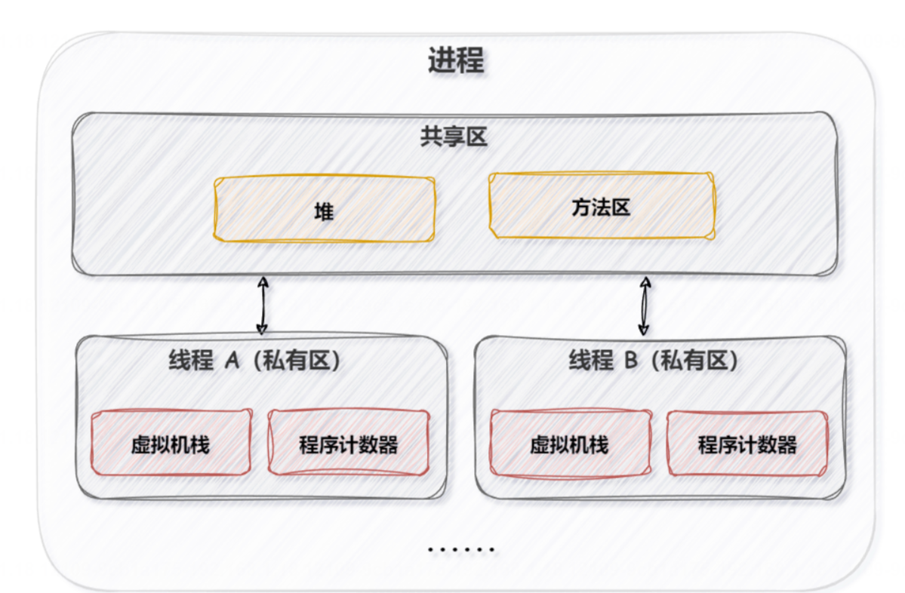

创建进程示例：

```java
public class ProcessExample {
    public static void main(String[] args) {
        try {
            // 运行一个外部程序
            Process process = Runtime.getRuntime().exec("notepad.exe");

            // 等待进程执行完毕
            int exitCode = process.waitFor();
            System.out.println("外部程序执行完毕，退出码为: " + exitCode);
        } catch (IOException | InterruptedException e) {
            e.printStackTrace();
        }
    }
}
```

创建线程示例：

```java
public class ThreadExample {
    public static void main(String[] args) {
        Thread thread = new Thread(new MyRunnable());
        thread.start();
    }

    static class MyRunnable implements Runnable {
        @Override
        public void run() {
            for (int i = 0; i < 5; i++) {
                System.out.println("线程执行中: " + i);
                try {
                    Thread.sleep(1000);
                } catch (InterruptedException e) {
                    e.printStackTrace();
                }
            }
        }
    }
}
```

在这个示例中，我们创建了一个简单的Java程序，演示了如何创建一个外部进程（打开记事本）以及如何创建一个线程并执行其中的任务。

## 2. 什么是虚拟线程
Java 中的虚拟线程，也叫做协程或”轻量级线程”，它诞生于 JDK 19(预览 API)，正式发布于 JDK 21，它是一种在 Java 虚拟机(JVM)层面实现的==逻辑线程==，不直接和操作系统的物理线程一一对应，因此它可以减少上下文切换所带来的性能开销。
操作系统线程、平台线程(普通线程、也叫做 Java 线程)和虚拟线程的关系如下:
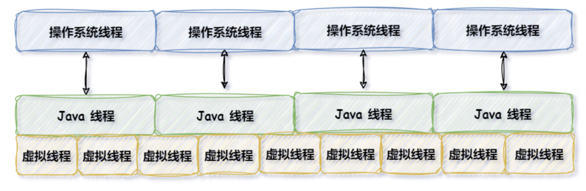
Java 虚拟线程是 JM 层面的逻辑线程，并不和物理线程一一对应，因此它可以避免普通线程间频繁切换带来的性能消耗，所以它的执行效率是更好的。虚拟线程的使用如下:
## 3. 虚拟线程的创建方式有几种? 
1. Thread.startVirtualThread(Runnable task)->创建并启动虚拟线程
2. Thread.ofVirtual().unstarted(Runnable task)-> 只创建不启动虚拟线程
3. Thread.ofVirtual().factory()->只创建虚拟线程工厂
4. Executors.newVirtualThreadPerTaskExecutor()->使用线程池的方式创建虚拟线程
## 4. 虚拟线程和普通线程的区别？ ★
1. 普通线程是和操作系统的物理线程是一一对应的，而虚拟线程是JVM层面的逻辑线程，并不和操作系统的物理线程一一对应，它可以看作是轻量级的线程。
2. 普通线程默认创建的是用户线程(而守护线程)，而虚拟线程是守护线程，并且其守护线程的属性不能被修改，如果修改就会报错
3. 虚拟线程由 JVM 调度和使用，避免了普通线程频繁切换的性能开销，所以相比于普通的线程来说，运行效率更高。
## 5. 线程的常用方法有哪些?
线程是计算机中用于实现多任务的基本单元，常用的线程方法包括：

1. start()：启动线程，使线程进入就绪状态，等待系统调度执行。
2. run()：线程的主体方法，包含线程的具体执行逻辑。
3. join()：等待线程执行完毕，主线程会阻塞直到被调用的线程执行完毕。
4. sleep()：使线程休眠一段时间，可以指定休眠时间，单位为毫秒。
5. yield()：让出当前线程的执行权，使其他线程有机会执行。
6. interrupt()：中断线程的执行，触发 InterruptedException 异常。
7. isAlive()：判断线程是否还在运行。
8. setDaemon()：设置线程为守护线程，当所有非守护线程执行完毕时，守护线程会被强制结束。
9. getName() 和 setName()：获取和设置线程的名称。
10. setPriority() 和 getPriority()：设置和获取线程的优先级。

这些方法可以帮助控制线程的执行顺序、状态和优先级，实现多线程编程中的任务调度和协作。
## 6. start方法和run方法有什么区别? ★
start()方法是用来启动一个新线程的，而 run()方法是一个普通方法，并不会重启线程，run()方法中存放的是当前线程要执行的任务代码。
它们的区别主要有以下几点:
1. **方法性质不同**:run()是一个普通方法，而 start()是开启新线程的方法。
2. **执行流程不同**:调用 run()方法会立即执行任务，而调用 start()方法是将当前线程的状态，从新建状态改为就绪状态。此时它会等待操作系统调度器为其分配 CPU 时间片，一旦获得时间片，线程开始执行其 run()方法中的代码了。
3. **多次调用次数不同**:run()方法可以被重复多次调用，而 start()方法只能被调用一次，如果被多次调用会抛出IllegalThreadStateException 异常。
4. **并发执行不同**:调用 start()方法会重启新线程，并发运行:而调用 run()方法是在当前的主线程中执行，它依然是单线程执行的。

**为什么 start()方法不能被重复调用?**

这个问题的浅层次原因是 JVM 不允许，当多次调用 start()方法的时候程序会提示 IllegalThreadStateException 的异常，但为什么 JVM 会提示这个异常?更深层次的原因是，线程生命周期管理的需要，因为在调用 start()方法时，此线程的状态会从新建状态(NEW)变为就绪状态(RUNNABLE)，JVM 会会为此线程分配必要的系统资源，如内存、程序计数器、线程栈等，此时==如果允许多次调用 start()方法的话，将会导致线程生命周期的混乱，也会让线程进入无效或未知的状态，同时也会导致系统资源的泄漏或者不可预测的行为==，所以 JVM 是不允许多次调用 start()方法的。
## 7. 说一下线程的生命周期?  ★
Java 线程的生命周期有以下 6 种:
1. NEW(新建状态):new Thread()时线程的状态。
2. RUNNABLE(可运行/运行状态):调用 start()方法后的状态。
3. BLOCKED(阻塞状态):调用了 synchronized 加锁之后的状态。获得锁之后就从 BLOCKED 状态变成了RUNNABLE 状态。
4. WAITING(无时限等待状态):调用了 wait()方法之后会进入此状态。
5. TIMED_WAITING(有时限等待状态):调用了 sleep(long milis)方法之后会进入此状态
6. TERMINATED(终止状态):线程任务执行完成之后就变成此状态。

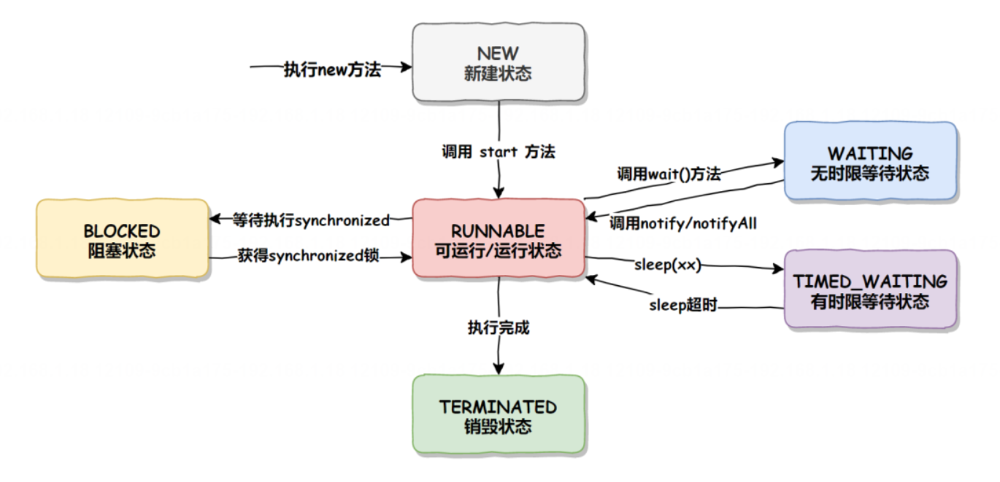

## 8. wait 方法和 sleep 方法有什么区别? ★
wait()方法和 sleep()方法都是用于暂停线程执行的，但它们有以下几个主要区别:
1. 所属类不同:
   - wait()方法是 java.lang.Object 类的一个方法，所有对象都可以调用。
   - sleep()方法是 java.lang.Thread 类的一个静态方法，直接作用于线程
2. 锁操作不同:
   - wait()方法必须在 synchronized 代码块或方法中调用，因为它会释放当前线程持有的对象监视器(锁)使得其他等待该锁的线程有机会继续执行。
   - sleep()方法不需要获取任何锁，它只是使当前线程休眠指定的时间，不会释放任何锁。
3. 唤醒方式不同:
   - wait()方法的执行通常与 notify()或 notifyAl()方法配合使用。当一个线程调用 wait()方法后，它将进入等待状态，直到被其他线程通过调用 notify()或 notifyAl()方法唤醒。
   - sleep()方法在指定的休眠时间结束后会自动唤醒线程，无需其他线程的干预。
4. 使用场景不同:
   - wait()方法主要用于线程间的协作和通信，例如在生产者-消费者模式、条件队列等场景中。
   - sleep()方法通常用于简单的延时操作或者防止线程过于频繁地执行某些操作的场景。

总体来说，wait()方法主要用于线程间的同步和协作，而sleep()方法主要用于控制线程的执行延迟
#### wait()方法一定要配合 synchronized 一起使用?

为什么 wait()方法一定要配合 synchronized 一起使用?这是因为 wait()方法的使用场景决定的，wait()主要用于线程间同步和协作的，既然是同步协作的，那么自然就需要同步器 synchronized 来保证其执行的一致性和正确性了，这就是 wait()需要配合 synchronized 一起使用的原因。
>同步和协作，例如一个线程在等待 wait()时，只需要另外一个线程唤醒就可以了，而不需要多个线程同时唤醒这样容易出现混乱，所以唤醒操作 notify()或 notifyA()应该一个线程去执行，那怎么保证只有一个线程执行呢?那就是使用 synchronized 了，而且 wait()和 notify()或 notifyAl()也是互斥的，一个执行在前，一个执行在后，所以它们需要使用同一个 synchronized 来保证互斥性。也就是说，同步协作，想要保证多线程配合不出错，那么使用同步器 synchronized 协调和控制程序的执行，才能真正的保证多线程协作不出错。


## 9. 线程是如何通讯的？★
线程通信是指多个线程之间通过某种机制进行协调和交互，例如，线程等待和通知机制就是线程通讯的主要手段之
在 Java 中，线程通讯的实现方法主要有以下几种:
1. Object 类下的 wait()、notify()和 notifyAl()方法。
2. Condition 类下的 await()、signal()和 signalAll()方法
3. LockSupport 类下的 park()和 unpark()方法
4. 共享变量：线程可以通过共享变量来进行通信。多个线程可以访问和修改同一个共享变量，通过对共享变量的读写来进行信息交换。
5. 阻塞队列：Java中的BlockingQueue是一个线程安全的队列，可以用于线程之间的通信。一个线程可以将数据放入队列，另一个线程可以从队列中取出数据，实现线程之间的数据交换。

**为什么一个线程等待和唤醒的功能需要这么多的实现呢?**
   - Locksupport 存在的必要性:前两种方法 notify 方法以及 signal 方法都是随机唤醒，如果存在多个等待线程的话，可能会唤醒不应该唤醒的线程，因此有 LockSupport 类下的 park 和 unpark 方法指定唤醒线程是非常有必要的。
   - Condition 存在的必要性:Condition 相比于 Object 类的 wait 和 notify/notifyAI 方法，前者可以创建多个等待集，例如，我们可以创建一个生产者等待唤醒对象，和一个消费者等待唤醒对象，这样我们就能实现生产者只能唤醒消费者，而消费者只能唤醒生产者的业务逻辑了

生产者消费者模型是多线程编程中常用的模式，用于解决生产者和消费者之间的数据交换和同步问题。在Java中，可以使用不同的方式来实现生产者消费者模型，包括wait和notify、await和signal、park和unpark。

1. wait和notify：
```java
public class WaitNotifyExample {
    private final Object lock = new Object();
    private boolean flag = false;

    public void producer() {
        synchronized (lock) {
            while (flag) {
                try {
                    lock.wait();
                } catch (InterruptedException e) {
                    e.printStackTrace();
                }
            }
            // 生产数据
            System.out.println("Producing data...");
            flag = true;
            lock.notify();
        }
    }

    public void consumer() {
        synchronized (lock) {
            while (!flag) {
                try {
                    lock.wait();
                } catch (InterruptedException e) {
                    e.printStackTrace();
                }
            }
            // 消费数据
            System.out.println("Consuming data...");
            flag = false;
            lock.notify();
        }
    }
}
```

2. await和signal：
```java
import java.util.concurrent.locks.Condition;
import java.util.concurrent.locks.Lock;
import java.util.concurrent.locks.ReentrantLock;

public class AwaitSignalExample {
    private final Lock lock = new ReentrantLock();
    private final Condition condition = lock.newCondition();
    private boolean flag = false;

    public void producer() {
        lock.lock();
        try {
            while (flag) {
                condition.await();
            }
            // 生产数据
            System.out.println("Producing data...");
            flag = true;
            condition.signal();
        } catch (InterruptedException e) {
            e.printStackTrace();
        } finally {
            lock.unlock();
        }
    }

    public void consumer() {
        lock.lock();
        try {
            while (!flag) {
                condition.await();
            }
            // 消费数据
            System.out.println("Consuming data...");
            flag = false;
            condition.signal();
        } catch (InterruptedException e) {
            e.printStackTrace();
        } finally {
            lock.unlock();
        }
    }
}
```

3. park和unpark：
```java
import java.util.concurrent.locks.LockSupport;

public class ParkUnparkExample {
    private Thread producerThread;
    private Thread consumerThread;

    public void producer() {
        while (true) {
            // 生产数据
            System.out.println("Producing data...");
            LockSupport.unpark(consumerThread);
            LockSupport.park();
        }
    }

    public void consumer() {
        while (true) {
            LockSupport.park();
            // 消费数据
            System.out.println("Consuming data...");
            LockSupport.unpark(producerThread);
        }
    }
}
```

区别和优势：
- wait和notify是Object类的方法，await和signal是Condition接口的方法，park和unpark是LockSupport类的方法。它们的底层实现机制不同，使用方式也略有差异。
- wait和notify是传统的Java多线程同步方式，await和signal是在Java 5中引入的Condition条件变量，park和unpark是在Java 5中引入的LockSupport类。
- await和signal相比wait和notify更加灵活，可以支持多个条件变量，park和unpark更加简洁高效。
- park和unpark相比于wait和notify和await和signal更加底层，可以实现更细粒度的控制。

根据具体的需求和场景，可以选择合适的方式来实现生产者消费者模型。

## 10. 如何停止线程? 

在 Java 中，停止线程是一个相对复杂的问题，因为线程的终止需要考虑多线程的同步和资源的正确释放。而在 Java 中，停止线程的手段主要有以下三种:
1. 使用自定义标识停止线程。
2. 使用 interrupt()方法停止线程。
3. 使用 stop()方法停止线程。
## 11. 什么是线程池? 为什么要使用线程池? ★  
线程池是一种==管理和复用线程的机制==，它==预先创建了一组线程，并维护一个任务队列，当任务来的时候，会从线程池中选择线程去执行任务，而不是直接创建线程去执行==。线程池的主要目的是==提高多线程应用程序的性能，通过避免线程频繁创建和销毁带来的性能开销，提高了资源利用率、响应速度和系统的稳定性。==
2.考点分析
线程池是一种管理和复用线程的机制，它相比于线程来说主要具备以下优点:
1. **线程重用**(降低资源消耗):线程池可以重复利用已经创建的线程，避免了频繁创建和销毁线程的开销。通过线程池，可以有效地管理和控制线程的数量，避免线程过多导致资源消耗过大。
2. **提高响应速度**:线程池中的线程是预先创建好的，当有任务到达时，可以立即分配线程来处理任务，提高了任务的响应速度。相比于每次都创建新线程的方式，线程池可以减少线程创建的时间开销。
3. **提供更强大的功能**:线程池具备可拓展性，允许开发人员向其中增加更多的功能。例如线程池中的任务队列3使用任务队列可以存储更多的待执行任务，还有延时定时线程池,ScheduledThreadPoolExecutor 允许任务延期执行或定期以某种频率执行，
4. **提高系统稳定性**:线程池可以限制并发线程的数量，避免系统因为线程过多而导致资源耗尽或系统崩溃。通过合理配置线程池的参数，可以控制系统的负载，提高系统的稳定性。
## 12. 线程池的创建方式有哪些? ★ 
在Java中，线程池的创建方式有以下几种：

1. **通过Executors工厂类创建：**

```java
   ExecutorService executor = Executors.newFixedThreadPool(5); // 创建固定大小的线程池
   ExecutorService executor = Executors.newCachedThreadPool(); // 创建可缓存的线程池
   ExecutorService executor = Executors.newSingleThreadExecutor(); // 创建单个线程的线程池
   ExecutorService executor = Executors.newScheduledThreadPool(5); // 创建固定大小的可调度线程池
```


2. **通过ThreadPoolExecutor类直接创建：**
```java
ThreadPoolExecutor executor = new ThreadPoolExecutor(
    5, // 核心线程数
    10, // 最大线程数
    60, // 空闲线程存活时间
    TimeUnit.SECONDS, // 时间单位
    new LinkedBlockingQueue<Runnable>() // 任务队列
);
```

## 13. 说一下线程池的各个参数的含义？ ★
1. corePoolsize:核心线程数，表示线程池的常驻核心线程数。如果设置为 0，则表示在没有任何任务时，销毁线程池;如果大于 0，即使没有任务时也会保证线程池的线程数量等于此值。但需要注意，此值如果设置的比较小，则会频繁的创建和销毁线程(创建和销毁的原因会在本课时的下半部分讲到);如果设置的比较大，则会浪费系统资源，所以开发者需要根据自己的实际业务来调整此值。
2. maximumPoolSize:最大线程数，表示线程池在任务最多时，最大可以创建的线程数。官方规定此值必须大于0，也必须大于等于 corePoolSize，此值只有在任务比较多，且不能存放在任务队列时，才会用到。
3. keepAliveTime:表示临时线程的存活时间(最大线程数-核心线程数)。当线程池空闲时并且超过了此时间，多余的线程就会销毁，直到线程池中的线程数量销毁的等于 corePoolSize 为止，如果 maximumPoolSize等于 corePoolSize，那么线程池在空闲的时候也不会销毁任何线程。
4. unit:表示临时线程的存活时间单位。它是配合keepAliveTime 参数三共同使用的。
5. workQueue:表示线程池执行的任务队列，当线程池的所有线程都在处理任务时，如果来了新任务就会缓存到此任务队列中排队等待执行。
6. threadFactory:表示线程的创建工厂，此参数一般用的比较少，我们通常在创建线程池时不指定此参数，它会使用默认的线程创建工厂的方法来创建线程。
7. RejectedExecutionHandler:表示指定线程池的拒绝策略，当线程池的任务已经在缓存队列 workOueue 中存储满了之后，并且不能创建新的线程来执行此任务时，就会用到此拒绝策略，它属于一种限流保护的机制。
## 14. 线程工厂有什么用?  ★
线程工厂（Thread Factory）是用来创建线程的工厂类，它提供了一种统一的方式来创建线程，可以对线程的创建进行定制化和管理。线程工厂通常用于以下几个方面：

1. **线程命名**：通过线程工厂可以为每个线程指定一个有意义的名称，便于识别和调试。

2. **线程优先级设置**：可以在线程工厂中设置线程的优先级，以确保不同线程的执行顺序。

3. **异常处理**：可以在线程工厂中定义线程的异常处理方式，例如捕获线程中抛出的异常并进行处理。

4. **线程池管理**：线程工厂通常与线程池结合使用，可以通过线程工厂创建线程池中的线程，实现对线程池的管理和监控。

总的来说，线程工厂提供了一种灵活的方式来管理线程的创建和配置，使得线程的使用更加方便和高效。
## 15. 线程池是如何运行的？
当有任务来了之后，线程池的执行流程是这样的:
1. 先判断当前线程数是否大于核心线程数，如果结果为 false，则新建线程并执行任务
2. 如果大于核心线程数，则判断任务队列是否已满?如果结果为 false，则把任务添加到任务队列中等待线程执行。
3. 如果任务队列已满，则判断当前线程数量是否超过最大线程数?如果结果为false，则新建线程执行此任务。
4. 如果超过最大线程数，则将执行线程池的拒绝策略。
## 16. 线程池的拒绝策略有哪些?
1. 阻止任务提交
2. 返给任务提交者执行
3. 抛弃，不提供日志和通知
4. 抛弃最旧的


## 17. 如何实现自定义拒绝策略?  ★
在 Java 中，线程池的拒绝策略是在任务无法被线程池接受时采取的处理方式。如果线程池已经达到最大线程数并且工作队列已满，线程池就会拒绝接受新的任务。Java 提供了四种内置的拒绝策略：

1. AbortPolicy（默认）：直接抛出 RejectedExecutionException 异常，阻止系统正常运行。
2. CallerRunsPolicy：直接在调用者线程中运行被拒绝的任务，如果线程池已经关闭，则直接丢弃任务。
3. DiscardPolicy：直接丢弃被拒绝的任务，不做任何处理。
4. DiscardOldestPolicy：丢弃工作队列中最旧的任务，然后尝试将被拒绝的任务添加到工作队列中。

如果以上内置的拒绝策略无法满足你的需求，你可以自定义拒绝策略。要自定义拒绝策略，你需要实现 RejectedExecutionHandler 接口，并重写其 rejectedExecution 方法。这个方法接收被拒绝的任务和线程池作为参数，你可以在这个方法中实现自定义的处理逻辑。

下面是一个简单的示例代码，演示如何自定义拒绝策略：

```java
import java.util.concurrent.RejectedExecutionHandler;
import java.util.concurrent.ThreadPoolExecutor;

public class CustomRejectedExecutionHandler implements RejectedExecutionHandler {

    @Override
    public void rejectedExecution(Runnable r, ThreadPoolExecutor executor) {
        // 自定义处理逻辑，这里简单地打印被拒绝的任务信息
        System.out.println("任务 " + r.toString() + " 被拒绝");
    }
}
```

然后，在创建线程池时，通过 setRejectedExecutionHandler 方法设置你的自定义拒绝策略：

```java
ThreadPoolExecutor executor = new ThreadPoolExecutor(
    corePoolSize,
    maximumPoolSize,
    keepAliveTime,
    unit,
    workQueue,
    new CustomRejectedExecutionHandler()
);
```

通过自定义拒绝策略，你可以根据实际需求来处理被拒绝的任务，例如记录日志、通知管理员等。希望这个示例对你有帮助！如果有任何问题，欢迎继续提问。


## 18. 如何判断线程池中的任务是否执行完成?
1. 使用 getCompletedTaskCount()统计已经执行完的任务，和 getTaskCount()线程池的总任务进行对比，如果相等则说明线程池的任务执行完了，否则既未执行完。
2. 使用 FutureTask 等待所有任务执行完，线程池的任务就执行完了
## 19. Java中导致线程安全问题的因素有哪些? ★
线程安全问题指的是在多线程环境下，多个线程同时操作共享资源时，导致程序执行结果与预期不符的问题。线程安全问题可能导致数据的不一致、程序崩溃、死锁等问题。导致线程安全问题的因素主要有以下几点:
1. **多线程同时执行**:多个线程同时执行是造成并发问题的根本原因。
2. **操作共享数据**:当多个线程访问和修改同一块共享数据时，可能会导致数据覆盖，数据可见性等问题
3. **非原子操作**:某些操作虽然看起来是单个语句，但在计算机内部可能被分解为多个步骤。如果这些操作在多线程环境中没有得到适当同步，就可能导致线程安全问题。
4. **指令重排序**:编译器和处理器为了优化性能，可能会对代码进行重新排序。这种重排序在单线程环境下通常是安全的，但在多线程环境下可能会导致意料之外的结果。
5. **内存可见性问题**:在多线程环境中，一个线程对共享变量的修改可能不会立即对其他线程可见。这是因为每个线程都有自己的本地缓存，而且编译器和处理器可能会进行各种优化。
## 20. 如何解决线程安全问题?
解决线程安全问题主要是通过加锁(让多线程执行变成多线程排队执行，每个时刻只有一个线程在执行)或每个线程操作自己的私有变量，这样也不会存在线程安全问题，因为大家各改各的，互不影响。总结来说，在 Java 中解决线程安全问题的主要手段有以下3 种:
1. 通过锁机制处理:多线程排队执行，每个时刻只有一个线程在执行，如 Lock 或 synchronized。
2. 使用线程安全的容器:如 ConcurrentHashMap、CopyOnWriteArrayList 等。
3. 使用 ThreadLocal:线程局部变量，每个线程操作自己的变量，也不会导致线程安全问题。

## 21. synchronized和ReentrantLock有什么区别? ★
synchronized 和 ReentrantLock 都提供了锁的功能，都是 Java 中保证线程安全的主要手段，但它们有很大的区别。
- **synchronized 属于独占式悲观锁，是通过 JVM 隐式实现的，synchronized 只允许同一时刻只有一个线程操作资源**。
- **ReentrantLock 是 Lock 的默认实现方式之一，它是基于 AQS(Abstract Queued Synchronizer，队列同步器)实现的，它默认是通过非公平锁实现的，在它的内部有一个 state 的状态字段用于表示锁是否被占用，如果是0 则表示锁未被占用，此时线程就可以把 state 改为 1，并成功获得锁，而其他未获得锁的线程只能去排队等待**
- 获取锁资源。在 JDK 1.5 中 synchronized 的性能远远低于 ReentrantLock，但在 JDK 1.6 之后 synchronized 的性能和ReentrantLock 的性能差别不大。

它俩的主要区别有以下几点:
1. ReentrantLock 只能修饰代码块，而 synchronized 可以用于修饰方法、修饰代码块等
2. ReentrantLock 需要手动加锁和释放锁，如果忘记释放锁，则会造成资源被永久占用，而 synchronized 无需手动释放锁。
3. ReentrantLock 使用时更加灵活，比如 ReentrantLock 可以知道是否成功获得了锁，而 synchronized 却不行。
4. ReentrantLock 可设置为公平锁，而 synchronized 却不行。
5. 二者的底层实现不同，synchronized 是 JVM 层面通过监视器(Monitor)实现的，而 ReentrantLock 是通过AQS(AbstractOueuedSynchronizer)程序级别的 API 实现。

## 22. volatile能保证线程安全吗? ★

volatile 不能保证线程执行安全，volatile 主要作用有两个:保证内存的可见性和禁止指令重排序。
也就说使用 volatile 可以保证多个线程在操作同一个变量时，始终可以读取到最新的数据;并且使用 volatile 可以禁止指令重排序，从而关闭掉系统优化所给程序代码执行结果不一致的风险。但是 volatile 不能保证原子性，而原子性也是导致线程不安全的因素之一，所以 volatile 不能保证线程安全。

## 23. volatile使用场景有哪些? ★
在Java中，volatile关键字用于确保多个线程之间对变量的可见性。下面是一些volatile关键字的使用场景：

1. **标记状态位**：当一个变量需要在多个线程之间进行状态标记，且不涉及复杂的操作时，可以使用volatile关键字。例如，用于标记线程是否应该继续执行的标记位。

2. **双重检查锁定模式**：在单例模式中，使用双重检查锁定模式可以提高性能。在这种模式下，需要将单例对象声明为volatile，以确保多个线程正确地处理单例对象的初始化。

3. **线程间通信**：当多个线程需要共享变量，并且其中一个线程对变量的修改需要立即对其他线程可见时，可以使用volatile关键字。

需要注意的是，volatile关键字只能保证可见性，不能保证原子性。因此，在涉及到复合操作的情况下，仍然需要使用synchronized关键字或者其他并发控制机制来确保线程安全。

## 24. 为什么双重效验锁一定要加volatile? ★
双重效验锁指的是单例懒汉模式中，通过双重检查的方式，创建对象的一种机制。那问题来了，双重效验锁为什么定要加 volatile?
因为加了 volatile 之后，==就可以禁止指令重排序了==，这样就能确保单例对象的线程安全，例如以下代码:

```java
public class LazySingleton {
    private static volatile LazySingleton instance;

    private LazySingleton() {
        // 私有构造方法
    }

    public static LazySingleton getInstance() {
        if (instance == null) {
            synchronized (LazySingleton.class) {
                if (instance == null) {
                    instance = new LazySingleton();②
                }
            }
        }
        return instance;
    }
}
```
以上问题发生在代码 ② 这一行"instance = new Singleton();”，这行代码看似只是一个创建对象的过程，然而它的实际执行却分为以下3 步:
1. 创建内存空间。
2. 在内存空间中初始化对象 singleton。
3. 将内存地址赋值给 instance 对象(执行了此步骤，instance 就不等于 nul 了)

如果此变量不加 volatile，那么线程 1在执行到上述代码的第 ② 处时就可能会执行指令重排序，将原本是 1.2、3 的执行顺序，重排为 1、3、2。但是特殊情况下，线程1 在执行完第 3步之后，如果来了线程2 执行到上述代码的第 ① 处，判断 instance 对象已经不为 nul，但此时线程 1 还未将对象实例化完，==那么线程 2 将会得到个被实例化“一半”的对象，从而导致程序执行出错，这就是为什么要给私有变量添加 volatile 的原因了==

## 25. 说一下volatile的实现原理?
volatile 关键字在底层的实现主要是通过内存屏障(memory barrier)来实现的。内存屏障是一种 CPU 指令，用于强制执行 CPU 的内部缓存与主内存之间的数据同步。在 Java 中，当线程读取一个 volatile 变量时，会从主内存中读取变量的最新值，并把它存储到线程的工作内存中。当线程写入一个 volatile 变量时，会把变量的值写入到线程的工作内存中，并==强制将这个值刷新到主内存中这样就保证==了 volatile 变量的可见性和有序性。
在 Java 5 之后，volatile 的实现还引入了“内存屏障插入”的机制，==内存屏障插入是指在指令序列中插入内存屏障以保证变量的可见性和有序性。==

主内存工作内存
Java 内存模型规定，所有的变量(实例变量和静态变量)都必须存储在主内存中，每个线程也会有自己的工作内存，线程的工作内存保存了该线程用到的变量和主内存的副本拷贝，线程对变量的操作都在工作内存中进行。线程不能直接读写主内存中的变量，如下图所示:
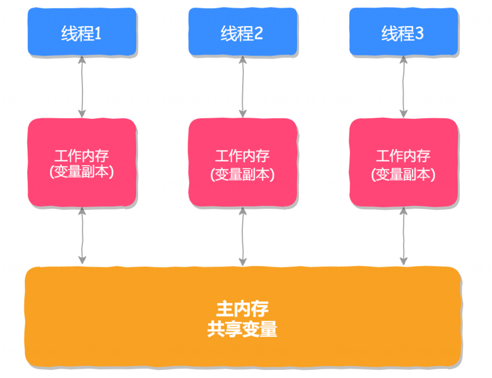
==这样设计的目的主要是为了提升程序的并发性能以及多线程之间的可见性问题。==
主内存是 Java 虚拟机中的一块共享内存，所有线程都可以访问。而每个线程还有自己的工作内存，线程的工作内存中存储了主内存中的变量副本的拷贝。这样做的好处是，==线程之间不需要同步所有变量的读写操作，只需要同步主内存中的变量即可，这样可以提高程序的执行效率。==同时，由于每个线程都有自己的工作内存，因此线程之间的变量操作互相不影响，从而提高了程序的并发性能。

内存屏障
内存屏障是一种硬件机制，用于控制 CPU 缓存和主内存之间的数据同步。在 Java 中，内存屏障通常有两种:读屏障和写屏障。
==在有内存屏障的地方，会禁止指令重排序，即屏障下面的代码不能跟屏障上面的代码交换执行顺序。在有内存屏障的地方，线程修改完共享变量以后会马上把该变量从本地内存写回到主内存，并且让其他线程本地内存中该变量副本失效(使用 MESI 协议)。==
MESI 协议是一种缓存一致性协议，它是支持写回(write-back)缓存的最常用协议。MESI 协议基于总线嗅探机制实现了事务串形化，也用状态机机制降低了总线带宽压力，做到了 CPU 缓存一致性。MESI 协议这 4 个字母代表4 个状态，分别是:Modified(已修改)、Exclusive(独占)、Shared(共享)、Invalidated(已失效)。

MESI 协议的主要用途是确保在多个 CPU 共享内存时，各个 CPU 的缓存数据能够保持一致性。当某个 CPU 对共享数据进行修改时，它会将这个数据的状态从S(共享)或 E(独占)状态转变为 M(修改)状态，并等待适当的时机将这个修改写回主存储器。同时，它会向其他 CPU 广播一个"无效消息”，使得其他 CPU 将自己缓存中对应的数据状态转变为I(无效)状态，从而在下次访问这个数据时能够从主存储器或其他 CPU 的缓存中重新获取正确的数据。
这种协议可以确保在多处理器环境中，各个 CPU 的缓存数据能够正确、一致地反映主存储器中的数据状态，从而避免由于缓存不一致导致的数据错误或程序异常，

## 26. 什么是ThreadLocal?它底层是如何实现的?
ThreadLocal 线程本地变量，每个线程都拥有一份该变量的独立副本，即使是在多线程环境下，每个线程也只能修改和访问自己的那份副本，从而避免了线程安全问题，实现了线程间的隔离。ThreadLocal 底层是使用 ThreadLocalMap 实现的，这点从 JDK 的源码中可以看出，核心源码如下: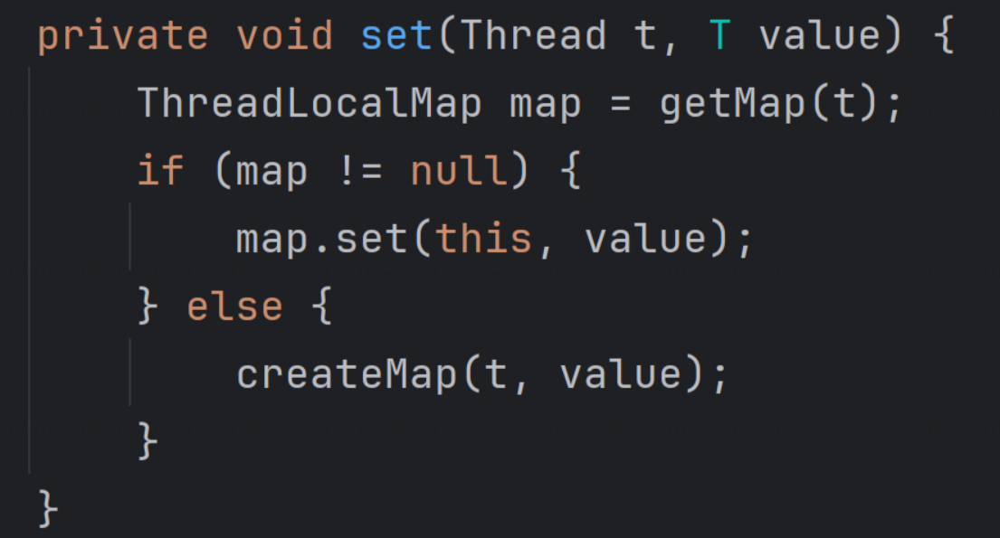从 ThreadLocal 的 set 方法可以看出，ThreadLoca 是存储在 ThreadLocalMap 中的，咱们继续看ThreadLocalMap 的源码实现: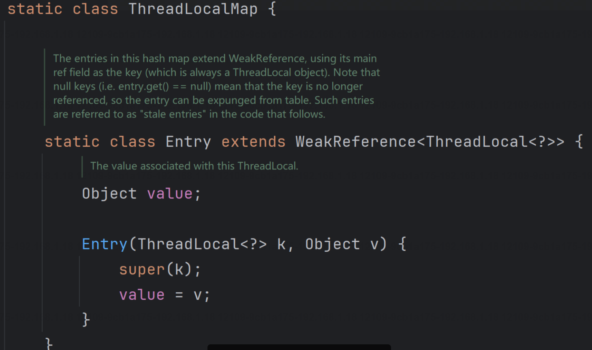

从上面源码可以看出，ThreadLocalMap 中存放的是 Entry，而 Entry 中的 key 就是 ThreadLocal， 而 value 则是要存储的值，所以我们得出 ThreadLocal 的实现如下图所示: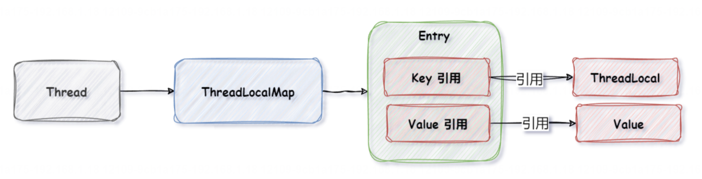ThreadLoca| 导致内存泄漏的原因主要和它的实现有关，ThreadLocal 的实现如下图所示
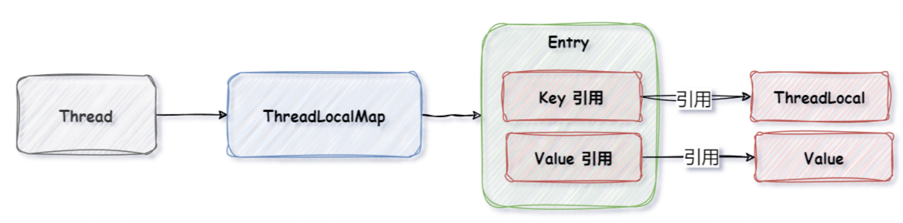

## 27. ThreadLocal为什么会导致内存泄漏?
ThreadLocal 导致内存泄漏的原因主要和它的实现有关，ThreadLocal 的实现如下图所示:

当程序运行之后，它的堆栈图是这样的:
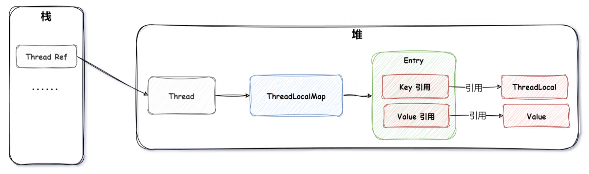
简化之后的堆栈图如下:
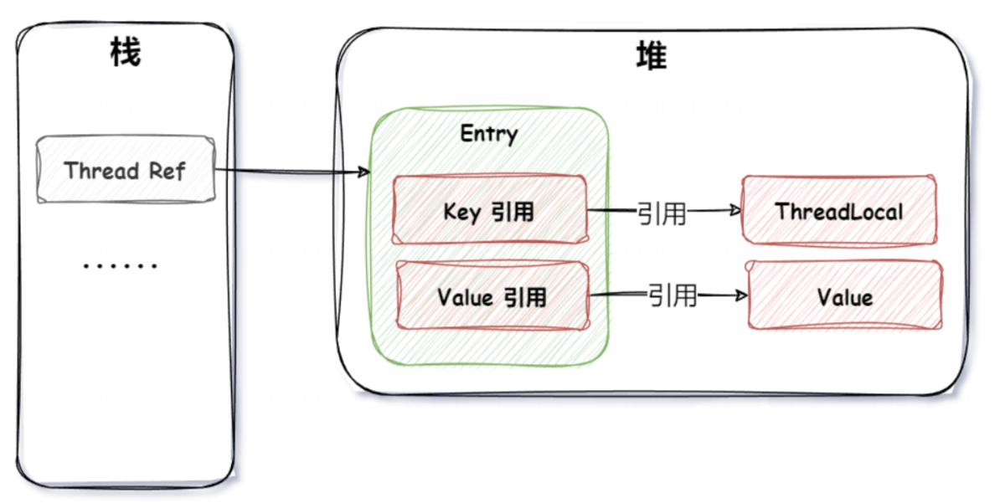
当方法执行完成之后，栈上的引用没有了，但是堆上还有两个(强)引用，而这两个强引用如果一直在就没办法进行垃圾回收，这就是内存泄漏的问题。
那怎么让它不要内存泄漏呢?于是 JDK 就做了优化，把 Key 引用变成了弱引用，如下图所示:
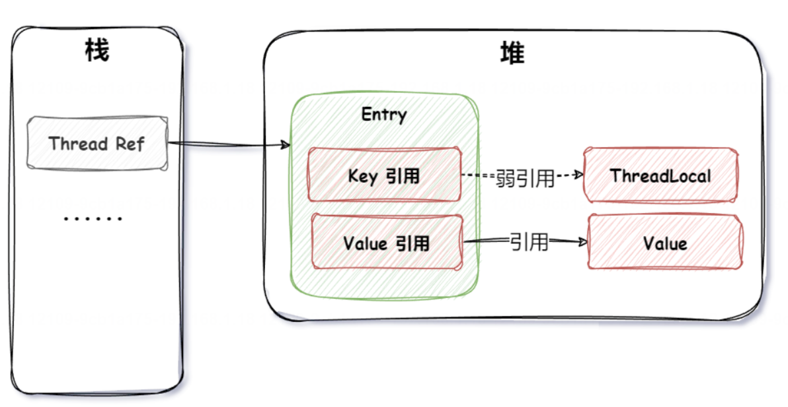
弱引用垃圾回收时会被回收掉(强引用 >软引用 >弱引用>虚引用)，但是此时 value 还是强引用，而且它的生命周期和线程的生命周期一样长，那么如果使用的线程池，那么依然会存在内存泄漏的问题。

- 如何避免 ThreadLocal 内存泄漏的问题呢?
那就是删除 value 的引用和值，怎么删除呢?使用 ThreadLocal 提供的 remove 方法可以删除，所以想要[hreadLocal 没有内存泄漏问题，需要在使用完之后收到调用 remove 方法。
## 28. synchronized底层是如何实现的?
synchronized 是通过 JVM 内置的 Monitor 监视器实现的，而监视器又是依赖操作系统的互斥锁 Mutex 实现的。
当我们给程序加了 synchronized 之后，那么在编译成字节码时，就会给相应的代码块添加 monitor，如下代码所示:

```java
public class synchronizedToMonitorExample {
	public static void main(string[] args){
		int count = 0;
		synchronized (synchronizedToMonitorExample.class）{
			for(int i=0;i<10;i++){
				count++;
			}
		System.out.println(count);
		}
	}
}
```
编译后的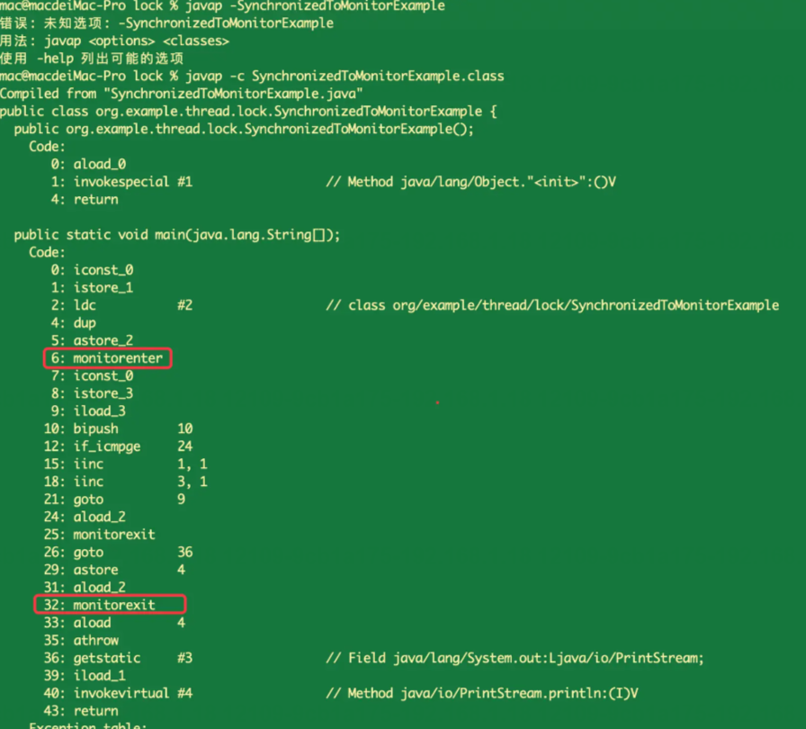
从上述结果我们可以看出，在 main 方法中多了一对 monitorenter 和 monitorexit 的指令，它们的含义是:
- monitorenter:表示进入监视器。
- monitorexit:表示退出监视器。

由此可知 synchronized 是依赖 Monitor 监视器实现的。

## 29. 监视器Monitor是如何实现的? ★

- count:记录该线程获取锁的次数(也就是前前后后，这个线程一共获取此锁多少次)
- recursions:锁的重入次数。
- owner:The Owner 拥有者，是持有该 ObjectMonitor(监视器)对象的线程;
- EntryList:EntryList 监控集合，存放的是处于阻塞状态的线程队列，在多线程下，竟争失败的线程会进入EntryList 队列。
- WaitSet: WaitSet 待授权集合，存放的是处于 wait 状态的线程队列，当线程执,行了 wait()方法之后，会进入WaitSet 队列。

监视器执行的流程如下:
1. **线程通过 CAS(对比并替换)尝试获取锁，如果获取成功，就将_owner 字段设置为当前线程**，说明当前线程已经持有锁，**并将 recursions 重入次数的属性 +1**。如果获取失败则先通过自旋 CAS 尝试获取锁，如果还是失败则将当前线程放入到 EntryList 监控队列(阻塞)。
2. 当拥有锁的线程执行了 wait 方法之后，线程释放锁，将 owner 变量恢复为 null 状态，同时将该线程放入’WaitSet 待授权队列中等待被唤醒
3. 当调用 notify 方法时，随机唤醒 WaitSet 队列中的某一个线程，当调用 notifyAll 时唤醒所有的 WaitSet 中的线程尝试获取锁。
4. 线程执行完释放了锁之后，会唤醒 EntryList 中的所有线程尝试获取锁。

以上就是监视器的执行流程，执行流程如下图所示:
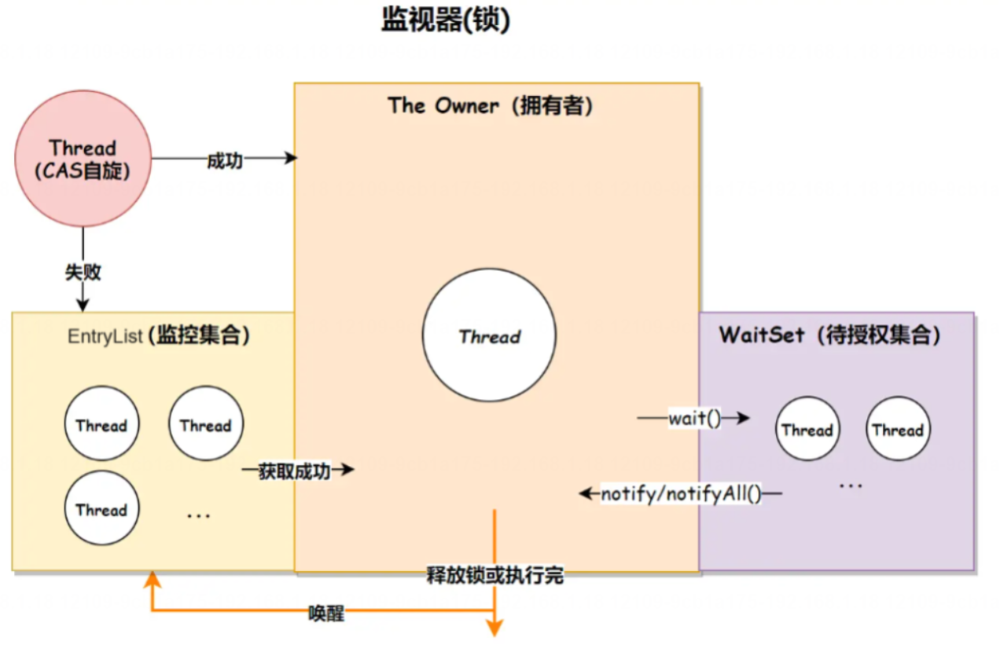
## 30. 说一下synchronized锁升级的流程?
synchronized 锁升级的流程如下:
1. 无锁
2. 偏向锁
3. 轻量级锁
4. 重量级锁

synchronized 会按照上述先后顺序依次升级，我们把这个升级的过程称之为“锁膨胀”

synchronized 锁升级的流程如下
1. 刚开始程序先是无锁状态，没有线程使用。
2. 当一个线程访问同步代码块并获取锁时，会在对象头的 Mark Word 里存储锁偏向的线程 ID，此时就是偏向锁。
3. 如果 Mark Word 中的线程 ID 和访问的线程 ID 一致，则可以直接进入同步块进行代码执行，如果线程 ID 不同，则使用 CAS 尝试获取锁，如果获取成功则进入同步块执行代码，否则会将锁的状态升级为轻量级锁。
4. 轻量级锁之后会通过自旋来获取锁，自旋执行一定次数之后还未成功获取到锁，此时就会升级为重量级锁，并“且进入阻塞状态。

synchronized 是固定自旋次数吗?
synchronized 是自适应自旋锁。自适应自旋锁是指，线程自旋的次数不再是固定的值，而是一个动态改变的值。这个值会根据前一次自旋获取锁的状态来决定此次自旋的次数。
例如，上一次通过自旋成功获取到了锁，那么这次通过自旋也有可能会获取到锁，所以这次自旋的次数就会增多一些，而如果上一次通过自旋没有成功获取到锁，那么这次自旋可能也获取不到锁，所以为了避免资源的浪费，就会少循环或者不循环，以提高程序的执行效率。简单来说，如果线程自旋成功了，则下次自旋的次数会增多，如果失败，下次自旋的次数会减少。

## 31. 悲观锁和乐观锁有什么区别?

悲观锁和乐观锁都是并发编程中的两种不同的并发控制策略。
1. 悲观锁:悲观锁认为并发一定会导致冲突，**因此在访问共享资源之前，会先获取锁来保护共享资源的完整性,直到方法执行完才会释放锁**。
   - 悲观锁一般使用互斥的方式实现，即在访问共享资源之前会进行加锁操作，确保同一时间只有一个线程能够访问共享资源。
   - 当一个线程获取了悲观锁后，其他线程如果要访问相同的资源，需要等待锁的释放。
   - 传统的悲观锁机制，如使用 synchronized 关键字或 ReentrantLock，会导致其他等待线程挂起，造成性能开销。
2. 乐观锁:乐观锁认为并发访问不会导致冲突，因此在读取数据时不立即加锁，而是在更新数据时检查自上次读取以来数据是否已经被其他人修改过。
   - 乐观锁一般使用版本号的机制来实现，通过比较版本号来检测是否发生冲突。
   - 当一个线程要更新共享资源时，首先会读取当前的版本号或时间戳，然后进行计算和更新。如果在更新之前，其他线程已经修改了该资源，导致版本号或时间戳不匹配，那么当前线程的更新操作将失败，需要根据具体情况进行重试或执行其他逻辑。
   - 乐观锁通常不会阻塞其他线程，因为它认为并发是安全的，不需要等待锁。

>悲观锁适用于并发冲突较为频繁的场景，因为它能够保证数据的一致性，但会带来一定的性能损耗;而乐观锁适用于并发冲突较少的场景，因为它不需要加锁，能够提高并发性能，但在冲突发生时需要重新尝试操作。

悲观锁和乐观锁的主要区别有以下几点:
- **加锁时机不同**:悲观锁是在访问共享资源之前会将其锁定，防止发生冲突;而乐观锁只有在操作数据时，才会通过版本对比来检查冲突的发生，而不会一上来就加锁。
- **加锁实现不同**:悲观锁通过阻塞和排队等待来保证同一时刻只有一个线程可以访问数据，可能会带来线程的阻塞和性能损耗;而乐观锁通过版本号或标记等机制来避免阻塞，但需要进行冲突检测和处理。
- **性能不同**:悲观锁适用于并发竞争较大的情况，可以保证数据安全性:而乐观锁适用于并发竞争较小的情况可以提高并发性能。

除了乐观锁和悲观锁之外，其他的常用锁策略还有以下几个:
1. 公平锁:公平锁是指多个线程按照申请锁的顺序来获取锁。
2. 非公平锁:非公平锁是指多个线程获取锁的顺序并不是按照申请锁的顺序，有可能后申请的线程比先申请的线程优先获取锁。
3. 独占锁:独占锁是指任何时候都只有一个线程能执行资源操作，
4. 共享锁:共享锁指定是可以同时被多个线程读取，但只能被一个线程修改。比如 Java 中的ReentrantReadWriteLock就是共享锁的实现方式，它允许一个线程进行写操作，允许多个线程读操作。
5. 可重入锁:可重入锁指的是该线程获取了该锁之后，可以无限次的进入该锁锁住的代码。
6. 自旋锁:自旋锁是指尝试获取锁的线程不会立即阻塞，而是采用循环的方式去尝试获取锁，这样的好处是减少线程上下文切换的消耗，缺点是循环会消耗 CPU。

>Java 中的所有锁默认都是非公平锁，因为非公平锁的效率高，但有很小的几率非公平锁会产生线程饥,饿的问题指的是某个线程竞争了很多次、等待了很长时间但依然没有获得锁资源。
>我们可以使用 ReentrantLock 来创建公平锁，实现代码为"ReentrantLock lock= new ReentrantLock(true);"其中
>参数 true 表示创建公平锁，默认值为 false 非公平锁。

## 32. 乐观锁底层是如何实现的? ★

乐观锁底层是通过 CAS(Compare And swap，比较并替换)机制实现的，CAS 机制包含三个组件:内存地址 V预期值 A 和新值 B。
CAS 的操作过程如下:
1. 比较内存地址 V 中的值与预期值 A 是否相等
2. 如果相等，将内存地址 V 的值修改为新值 B.
3. 如果不相等，表示预期值 A 与实际值不匹配，操作失败。

CAS 的操作是原子性的，即整个操作过程是不可中断的，要么成功执行并修改值，要么不执行修改。如果由于竟争或并发导致操作失败(预期值不匹配)，则可以通过循环重新尝试操作，直到成功或达到最大尝试次数操作失败。

乐观锁底层是通过 CAS 实现的，CAS 的优缺点如下:

**CAS 优点**如下:

- **高效**:CAS 使用硬件的原子操作指令，避免了对锁的使用，减少了上下文切换和调度开销。
- **非阻塞**:CAS 是一种乐观并发控制机制，该操作不会阻塞其他线程，而是通过自旋重试来解决竞争问题。
- **无死锁**:由于 CAS 不涉及锁的申请和释放，因此不存在死锁的问题。
- **适用范围广**:CAS 机制可以用于任何数据类型，不仅仅局限于基本类型，也可以用于引用类型。。

CAS 缺点如下:
- **ABA 问题**:如果内存地址 V 的值从 A 变为 B，再变为 A，那么 CAS 在比较时会认为与预期值 A 相等，但实际上已经发生了一次变化。为了解决 ABA 问题，可以使用版本号或时间戳等方式来辅助 CAS。
- **循环时间长**:如果线程的重试次数太多，会导致线程自旋的时间过长，浪费了处理器资源。
- **操作单一**:只能保证一个共享变量的原子操作。

## 33. 什么是ABA问题?如何解决ABA问题? ★
在乐观锁CAS（Compare and Swap）中，ABA问题是指在多线程环境下，一个线程在读取数据值 A 时，另一个线程将 A 改为 B，然后又改回 A，此时第一个线程可能会认为数据值没有发生变化，从而可能导致错误的操作。

为了解决ABA问题，可以使用版本号或者时间戳来辅助判断数据是否被修改过。具体来说，可以在每次更新数据时，将数据的版本号加一，这样即使数据值被改变，版本号也会发生变化，从而避免ABA问题的发生。在进行CAS操作时，除了比较数据值外，还需要比较版本号或者时间戳，确保数据没有被其他线程修改过。

## 34. 说一下CAS在Java中应用? ★
在Java中，CAS（Compare and Swap）通常用于实现多线程并发控制。CAS是一种乐观锁机制，它通过比较内存中的值和预期值来判断是否发生了变化，如果没有变化则更新为新值，否则不做任何操作。在Java中，CAS通常与`java.util.concurrent.atomic`包中的原子类一起使用，比如`AtomicInteger`、`AtomicLong`等，这些类提供了基于CAS操作的原子性操作方法，可以保证在多线程环境下的线程安全性。

例如，使用`AtomicInteger`可以实现多线程环境下的原子性操作，如增加、减少等操作。下面是一个简单的示例代码：

```java
import java.util.concurrent.atomic.AtomicInteger;

public class CASExample {
    private static AtomicInteger count = new AtomicInteger(0);

    public static void main(String[] args) {
        for (int i = 0; i < 10; i++) {
            new Thread(() -> {
                for (int j = 0; j < 1000; j++) {
                    count.incrementAndGet(); // 使用CAS操作增加计数
                }
            }).start();
        }

        try {
            Thread.sleep(1000); // 等待所有线程执行完毕
        } catch (InterruptedException e) {
            e.printStackTrace();
        }

        System.out.println("Final count: " + count.get());
    }
}
```

在上面的示例中，通过`AtomicInteger`的`incrementAndGet()`方法使用CAS操作来增加计数，保证了在多线程环境下的线程安全性。这样就可以避免多线程环境下的竞态条件和数据不一致的问题。

Atomic类存在ABA问题吗？如何解决？
==Atomic类通常用于实现原子操作，避免多线程并发访问时出现数据不一致的情况。ABA问题是指一个值在操作过程中被修改两次，最终恢复原值，导致检测不到这种变化。在使用Atomic类时，也可能会遇到ABA问题。==

为了解决ABA问题，可以使用AtomicStampedReference类。AtomicStampedReference类通过引入版本号的方式，可以在比较和设置值时同时比较版本号，从而避免ABA问题的发生。当对引用进行更新时，版本号也会同时更新，这样就可以避免ABA问题。

另外，还可以使用CAS（Compare and Swap）操作来解决ABA问题。CAS操作会比较当前内存中的值和期望值，如果相等则进行更新操作，否则不进行操作。通过CAS操作可以避免ABA问题，因为在比较值的同时也会比较值的版本号。

总的来说，要解决ABA问题，可以使用AtomicStampedReference类或者CAS操作来确保在比较和设置值时考虑到值的版本号，从而避免出现ABA问题。

## 35. ReentrantLock底层是如何实现的? ★
ReentrantLock(可重入锁)是 Java 并发包java.util.concurrent.locks 中提供的一个互斥同步器，其底层实现基于AbstractQueuedSynchronizer(AQS)框架。==AQS 是一个实现了阻塞式锁和相关同步器(信号量、事件等)的框架，提供了基于 FIFO 等待队列的线程调度机制。==

ReentrantLock 底层实现和主要特性:
1. ==状态变量==(state):ReentrantLock 内部维护了一个 volatile int 类型的成员变量 state，用来表示锁的持有者数量以及当前锁的状态(是否被锁定)。当 state 为 0时代表锁未被任何线程持有;大于0则表示被某个线程持有，并且 state 值也代表了重入次数。
2. ==公平与非公平锁==:ReentrantLock 通过两个内部类 FairSync 和 NonfairSync 来分别实现公平锁和非公平锁。公平锁在获取锁时会遵循 FIFO 原则，而非公平锁则允许“插队”，即不管线程等待队列顺序，有机会就尝试获取锁。
3. **获取锁过程**：lock()方法首先会尝试 CAS 操作(compareAndSetState())去获取锁，如果当前没有其他线程持有锁或者。锁已经被当前线程持有，则增加 state 计数并成功获得锁。当 CAS 操作失败时，表明有其他线程持有锁或锁正被竞争。此时，当前线程会被封装成一个节点(Node)。加入到 AQS 的等待队列中。如果是公平锁，新节点会排在队尾;如果是非公平锁，则可能尝试直接获取锁或插入队列头部。
4. **解锁过程**:unlock()方法会递减 state 计数，当 state 减少至 0时，表明所有锁都被释放，此时如果有等待线程，则唤醒等待队列中的第一个节点的线程继续尝试获取锁。
5. **可重入性**:可重入体现在同一个线程可以对已经持有的锁再次调用 lock()方法而不被阻塞，此时只是简单地增加 state 计数，而不是将自己放入等待队列。
6. **超时获取锁**:ReentrantLock 还提供了带超时限制的 tryLock(long timeout,TimeUnit unit)方法，它会在指定时间内尝试获取锁，若无法获取则返回 false，避免线程无休止地等待。

ReentrantLock 通过 AQS 提供的底层支持，结合 CAS 原子操作、自旋、线程挂起和恢复等技术手段，高效地实现了可重入、公平/非公平、可中断等复杂功能的锁机制。


## 36. 产生死锁的因素有哪些? ★
死锁(Dead Lock)指的是两个或两个以上的运算单元(进程、线程或协程)，都在等待对方释放资源，但没有一方提前释放资源，从而造成了一种阻塞的现象就称为死锁。
产生死锁的因素有以下 4个:
1. **互斥条件**:指运算单元(进程、线程或协程)对所分配到的资源具有排它性，也就是说在一段时间内某个锁资源只能被一个运算单元所占用。
2. **请求和保持条件**:指运算单元已经保持至少一个资源，但又提出了新的资源请求，而该资源已被其它运算单元占有，此时请求运算单元阻塞，但又对自己已获得的其它资源保持不放。
3. **不可剥夺条件**:指运算单元已获得的资源，在未使用完之前，不能被剥夺
4. **环路等待条件**:指在发生死锁时，必然存在运算单元和资源的环形链，即运算单元正在等待另一个运算单元占用的资源，而对方又在等待自己占用的资源，从而造成环路等待的情况。

只有以上个条件同时满足，才会造成死锁，如下图所示:

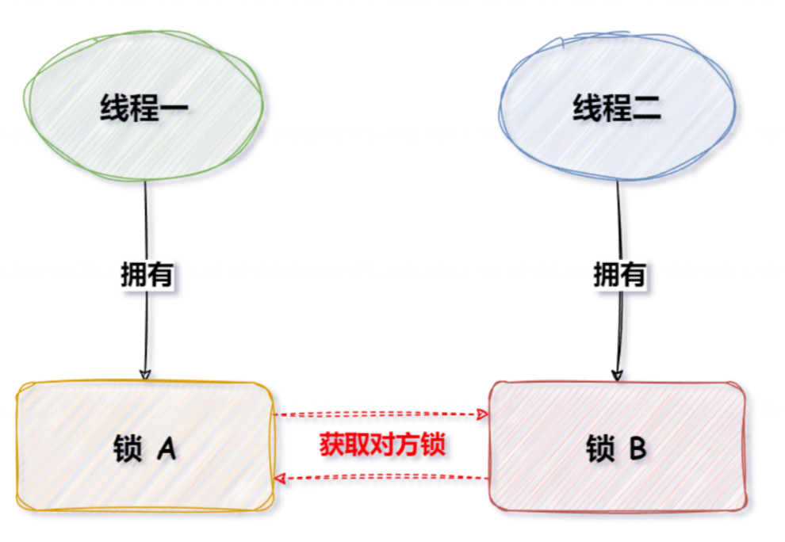
## 37. 如何排查死锁? ★
死锁的排查工具有很多，比如以下这些:
- Jstack:可以查看 Java 应用程序的线程状态和调用堆栈，可用于发现死锁线程的状态,
- jconsole 和 JVisualVM:这些是 Java 自带的监视工具，可以用于监视线程、内存、CPU 使用率等信息，从而帮助排查死锁问题。
- Thread Dump Analyzer(TDA):是一个开源的线程转储分析器，可用于分析和诊断 Java 应用程序中的死锁问题。
- Eclipse TPTP:是一个开源的性能测试工具平台，其中包含了一个名为 Thread Profiler 的工具，可以用于跟踪线程运行时的信息，从而诊断死锁问题。

比如使用 JVisualVM 检测到的死锁，如下图所示:
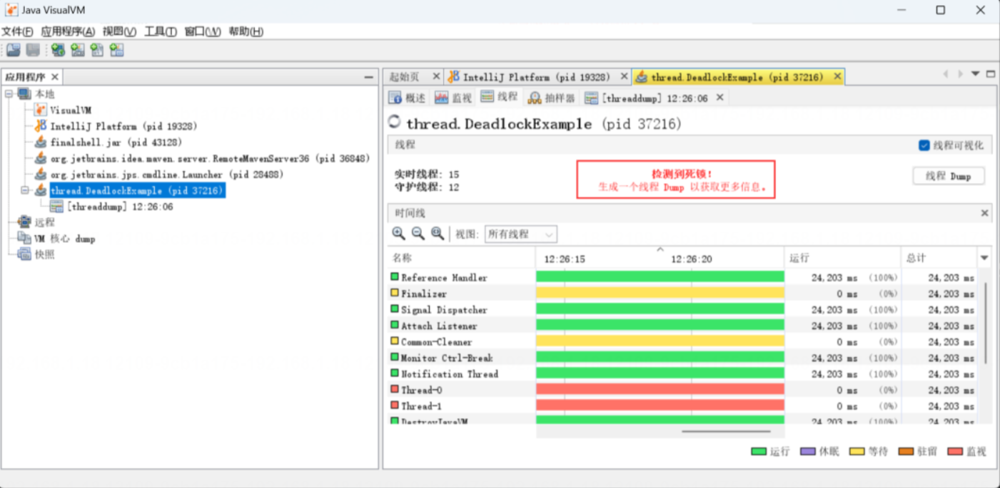
## 38. 如何解决死锁问题 ★
在Java中，可以通过顺序锁或轮询锁来避免死锁问题。这两种方法都是基于锁的获取顺序来避免死锁的发生。

1. **顺序锁**：顺序锁是指在获取多个锁的时候，按照固定的顺序获取锁。这样可以避免不同线程之间因为获取锁的顺序不同而导致死锁的问题。在Java中，可以通过定义一个全局的锁获取顺序，然后在获取锁的时候按照这个顺序获取，从而避免死锁的发生。

```java
Object lock1 = new Object();
Object lock2 = new Object();

// 定义获取锁的顺序
void lockOrder(Object lock1, Object lock2) {
    Object firstLock = lock1;
    Object secondLock = lock2;
    
    if (System.identityHashCode(lock1) > System.identityHashCode(lock2)) {
        firstLock = lock2;
        secondLock = lock1;
    }
    
    synchronized (firstLock) {
        synchronized (secondLock) {
            // 执行需要同步的代码
        }
    }
}
```

2. **轮询锁**：轮询锁是指在获取锁的时候，不断地尝试获取锁，如果获取失败则释放已经获取的锁，并重新尝试获取。这样可以避免因为等待某个锁的释放而导致死锁的问题。在Java中，可以通过使用`tryLock()`方法来实现轮询锁。

```java
Lock lock1 = new ReentrantLock();
Lock lock2 = new ReentrantLock();

// 使用轮询锁避免死锁
void avoidDeadlock() {
    while (true) {
        if (lock1.tryLock()) {
            try {
                if (lock2.tryLock()) {
                    try {
                        // 执行需要同步的代码
                        break;
                    } finally {
                        lock2.unlock();
                    }
                }
            } finally {
                lock1.unlock();
            }
        }
        // 等待一段时间后重试
        Thread.sleep(100);
    }
}
```
# 一般面试题：
## 1. 线程有几种创建方式?
1. 继承 Thread 类，重写 run()方法。
2. 实现 Runnable 接口，实现 run()方法。
3. 实现 Callable 接口，实现 cal()方法。
4. 通过线程池创建。

好的，我来分别举例创建这四种线程：

1. 继承 Thread 类，重写 run()方法：
```java
public class MyThread extends Thread {
    @Override
    public void run() {
        System.out.println("This is a thread created by extending Thread class.");
    }

    public static void main(String[] args) {
        MyThread thread = new MyThread();
        thread.start();
    }
}
```

2. 实现 Runnable 接口，实现 run()方法：
```java
public class MyRunnable implements Runnable {
    @Override
    public void run() {
        System.out.println("This is a thread created by implementing Runnable interface.");
    }

    public static void main(String[] args) {
        Thread thread = new Thread(new MyRunnable());
        thread.start();
    }
}
```

3. 实现 Callable 接口，实现 call()方法：
```java
import java.util.concurrent.Callable;
import java.util.concurrent.ExecutionException;
import java.util.concurrent.FutureTask;

public class MyCallable implements Callable<String> {
    @Override
    public String call() {
        return "This is a thread created by implementing Callable interface.";
    }

    public static void main(String[] args) throws ExecutionException, InterruptedException {
        MyCallable myCallable = new MyCallable();
        FutureTask<String> futureTask = new FutureTask<>(myCallable);
        Thread thread = new Thread(futureTask);
        thread.start();
        System.out.println(futureTask.get());
    }
}
```

4. 通过线程池创建：
```java
import java.util.concurrent.ExecutorService;
import java.util.concurrent.Executors;

public class ThreadPoolExample {
    public static void main(String[] args) {
        ExecutorService executor = Executors.newFixedThreadPool(2);

        executor.submit(() -> {
            System.out.println("This is a thread created by using a thread pool.");
        });

        executor.shutdown();
    }
}
```
## 2. 什么是用户线程和守护线程?它们有什么区别?
在 Java 语言中，线程分为两类:用户线程和守护线程。
1. 用户线程(User Thread):用户线程是指由用户创建的线程，默认情况下所有的线程都是用户线程。**当用户线程仍然在运行时，JVM 不会退出**。只有当所有的用户线程都执行完毕时，JM 才会退出。
2. 守护线程(Daemon Thread):守护线程是一种特殊的线程，它的作用是为其他线程提供服务。**当所有的用户线程执行完毕后，守护线程会自动退出**。守护线程通常用于执行一些后台任务，**如垃圾回收、自动保存等守护线程的生命周期依赖于是否还有用户线程在运行**，当所有的用户线程执行完毕后，守护线程会被强制终止。

用户线程和守护线程的区别主要有以下几个:
- **程序退出不同**:如果所有的用户线程都结束了，那么JVM也会结束运行;而 JVM 停止运行时，即使有守护线程在工作，也会结束掉 JVM，所以说，守护线程的存在并不会阻止JM 的关闭。
- **优先级不同**:通常情况下，守护线程的优先级较低，在资源紧张时，系统会优先调度用户线程
- **设计目的不同**:用户线程是程序的主要工作线程，而守护线程是为了支持用户线程的运行而存在的。

在 Java 语言中，线程分为两类:用户线程和守护线程。用户线程的执行优先级比较高，且所有用户线程执行完之后 JM 不管有没有守护线程都会停止运行，而守护线程的存在就是为了服务用户线程的。
在 Java 中，操作线程类型和查看线程类型的方法如下：
- **设置线程类型**:通过 Thread.setDaemon(boolean)来设置是否为守护线程，true 为守护线程，false 为用户线程。
- **查看线程类型**:通过 Thread.isDaemon()方法来判断，如果返回的结果是 true 则为守护线程，反之则为用户线程

守护线程的典型使用场景为垃圾回收线程，在实际工作中还有一些任务可以设置为守护线程，例如，些控系统线程、收集统计线程、访问记录日志线程、邮件发送线程、文件监听、网络监听和清理临时文件、释放资源等线程都可以设置为守护线程。

## 3. 说一下JUC?  ★

>JUC 四个著名的类
>1. ReentrantLock
>2. Semaphore(基于计数器实现的限流器)
>3. CountDownLatch
>4. CyclicBarrier


JUC 是 Java Util Concurrency 的缩写，它是 Java 并发编程的一个重要工具包，位于 java.util.concurrent 包下。JUC 提供了一系列高级的并发工具类和接口，用于简化多线程编程，提高程序的性能和可伸缩性JUC 中包含了以下核心组件:
1. **线程池**(ThreadPoolExecutor):JUC 提供了 Executor 框架，其中最重要的就是线程池。通过线程池，我们可以方便地管理和复用线程资源，减少线程创建和销毁的开销，实现任务的并发执行。
2. **原子变量**(Atomic):JUC 提供了一系列的原子类，如 AtomicInteger、AtomicLong，通过使用这些原子类可以实现线程安全地操作共享变量，避免使用传统的 synchronized 关键字进行同步，提高性能和线程的并发性。
3. **阻塞队列**(BlockingQueue):JUC 提供了多个线程安全的阻塞队列，如 ArrayBlockingQueue、3.LinkedBlockingQueue。这些阻塞队列可以实现线程间的安全数据共享和通信，常用于生产者-消费者模式的实现。
4. **锁(Lock)**:JUC 提供了更灵活的锁机制，如 ReentrantLock、ReadWriteLock，与传统的 synchronized 关键字相比，它们可以提供更高的并发性，在某些场景下更方便地实现线程同步和控制。
5. **并发工具类**(ConcurrentUtils):JUC 还提供了一些并发编程的辅助工具类，如 Semaphore.CountDownLatch、CyclicBarrier 等，用于在多个线程之间控制和同步操作，实现更复杂的并发控制流程。

JUC 提供了丰富的并发编程工具和特性，可以帮助开发者更方便、高效地进行多线程编程。通过使用 JUC，我们可以减少手动编写线程同步和控制的代码，降低多线程开发的复杂性，提高程序的性能和并发性。

## 4. Semaphore有什么用?它底层是如何实现的?
在Java中，Semaphore是一种同步工具，用于控制同时访问某个资源的线程数量。Semaphore维护了一个许可计数，线程在访问资源之前必须先获取许可，如果许可数量不足，则线程会被阻塞，直到有足够的许可为止。使用Semaphore可以有效地限制对共享资源的访问，避免资源竞争和提高系统性能。

Semaphore的底层实现主要依赖于AQS（AbstractQueuedSynchronizer）框架。AQS是Java并发包中提供的一个用于实现同步器的框架，Semaphore内部通过继承AQS并重写其中的方法来实现对许可的管理和线程的阻塞唤醒操作。

Semaphore内部维护了一个许可计数，线程在调用==acquire()== 方法时会尝试获取许可，如果许可数量大于0，则线程可以获取许可并继续执行，同时许可数量会减少；如果许可数量等于0，则线程会被阻塞，直到有其他线程释放许可。而==release()== 方法则用于释放许可，同时唤醒可能被阻塞的线程。

总的来说，Semaphore在Java中的作用是控制对共享资源的访问，通过许可的管理和线程的阻塞唤醒来实现对资源的有效管理。

## 5. CountDownLatch和CyclicBarrier有什么区别?

`CountDownLatch` 和 `CyclicBarrier` 都是 Java 中用于多线程协作的工具类，但在功能和使用上有一些区别。

1. `CountDownLatch`：允许一个或多个线程等待其他线程完成操作。`CountDownLatch` 通过一个计数器来实现，当计数器减为0时，等待的线程可以继续执行。

示例代码：
```java
import java.util.concurrent.CountDownLatch;

public class CountDownLatchExample {
    public static void main(String[] args) throws InterruptedException {
        CountDownLatch latch = new CountDownLatch(3);

        Runnable task = () -> {
            System.out.println("Task is running");
            latch.countDown();
        };

        for (int i = 0; i < 3; i++) {
            new Thread(task).start();
        }

        latch.await();
        System.out.println("All tasks are completed");
    }
}
```

2. `CyclicBarrier`：允许一组线程互相等待，直到所有线程都到达某个屏障点。`CyclicBarrier` 的计数器可以重复使用。

示例代码：
```java
import java.util.concurrent.CyclicBarrier;

public class CyclicBarrierExample {
    public static void main(String[] args) {
        CyclicBarrier barrier = new CyclicBarrier(3, () -> System.out.println("Barrier is reached"));

        Runnable task = () -> {
            try {
                System.out.println("Task is running");
                barrier.await();
            } catch (Exception e) {
                e.printStackTrace();
            }
        };

        for (int i = 0; i < 3; i++) {
            new Thread(task).start();
        }
    }
}
```

区别：
- `CountDownLatch` 的计数器只能减少，不能重置；`CyclicBarrier` 的计数器可以重置并重复使用。
- `CountDownLatch` 的线程等待是一次性的，计数器减为0后就不能再次使用；`CyclicBarrier` 可以循环使用。
- `CountDownLatch` 的线程是互相独立的，各自执行任务后等待；`CyclicBarrier` 的线程是互相等待，必须同时到达屏障点才能继续执行。

## 6. 什么是AQS?
AQS (Abstract Queued Synchronizer)是 Java.util.concurrent 包中的一个抽象类，它是实现并发同步的关键类之提供了一种用于==实现锁、同步器和其他相关的同步组件的框架==。AQS 使用了==双向链表来管理等待获取同步状态的线程==，将等待线程封装成节点，节点之间形成一个队列，即==同步队列==。通过 CAS(Compare and swap)操作和线程的阻塞和唤醒机制，AQS 实现了线程的排队等待和唤醒逻辑，如下图所示:
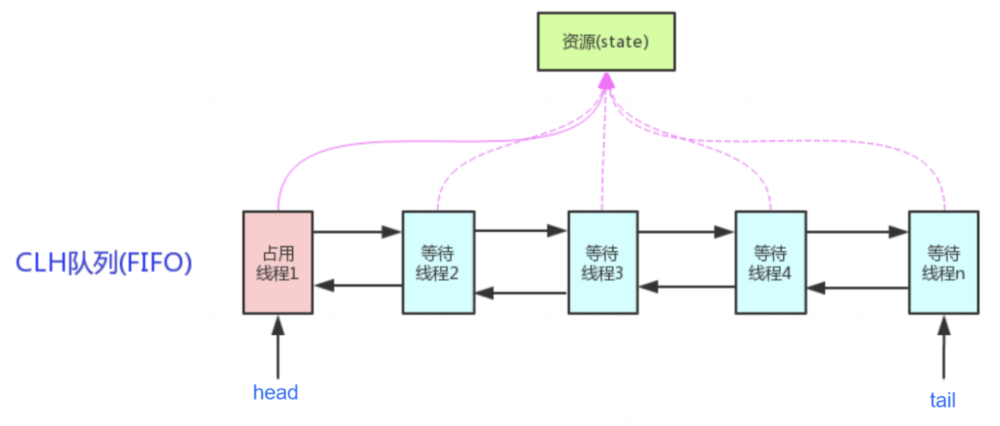
AQS 主要提供了以下几个核心方法:
1. acquire(int arg):尝试获取同步状态，如果成功获取则返回，如果获取失败则阻塞当前线程等待。
2. release(int arg):释放同步状态，唤醒等待线程。
3. tryAcquire(int arg):尝试非阻塞地获取同步状态，如果成功获取则返回 true，否则返回 false。
4. tryRelease(int arg):尝试非阻塞地释放同步状态。
AQS 在 Java 并发框架中的很多同步组件都是基于它实现的，包括 ReentrantLock、Semaphore、CountDownLatch 等。通过继承 AQS 并重写其中的方法，可以相对容易地实现自定义的同步组件。

总的来说，AQS 是 Java 并发框架中的一个关键抽象类，提供了同步状态的管理和线程的排队等待、唤醒的机制。
它为具体的同步器提供了一个统一的框架，简化了同步组件的开发和实现。

## 7. AQS的执行流程

当使用 AQS (AbstractOueuedSynchronizer)构建同步器时，例如使用 ReentrantLock、Semaphore 等，其执行流程可以简单地解释为以下几个步骤:
1. **线程请求资源**:当一个线程请求获取某个同步资源(如锁)时，它会调用 AQS 提供的 acquire()方法。此时AQS 会尝试使用 CAS(Compare and Swap)操作来修改同步状态，如果成功获取了同步状态(锁)，则该线程可以继续执行。
2. **获取同步状态失败**:如果当前同步状态已被其他线程占用(锁已经被其他线程获取)，那么当前线程就需要等待。AQS 会将该线程封装成一个 Node 节点，并加入到等待队列中，等待队列是一个FIFO(先进先出)的队列，用于管理等待获取同步资源的线程。
3. **自旋和阻塞**:在等待队列中的线程会进行一定的自旋尝试，也就是在循环中不断地检查同步状态是否已经可用。如果自旋尝试失败，线程就会进入阻塞状态，等待唤醒。
4. **线程释放资源**:当线程完成了对资源的操作，需要释放资源(如释放锁)时，它会调用 AQS 提供的 release()方法。在释放资源时，AOS 会使用 CAS 操作来修改同步状态，并唤醒等待队列中的一个或多个线程。
5. **唤醒等待线程**:AQS 在释放资源后，会从等待队列中选择一个或多个线程，并将其唤醒。被唤醒的线程会尝试再次去获取同步状态(如获取锁)，如果成功获取，就可以继续执行;否则，它将再次进入自旋或阻塞状态。

通过上述步骤，AOS 提供了一种高效而灵活的机制来实现同步器，能够适用于各种同步场景，例如独占锁、共享锁、倒计时器等。这样，我们可以根据需要创建自定义的同步器，来处理并发编程中的资源竞争和线程协作问题。

获取到 AQS 中的同步状态就等于获取锁了吗?

在大多数情况下，AQS 中获取到同步状态则表示其获得了锁资源，但某些情况下获取同步状态表示获取到了某些条件，而非锁资源。
例如 AQS 也是倒计时器(CountDownLatch)的底层实现，在这个场景下，获取到同步状态代表着获取了特定类型的同步器所提供的等待条件而非锁资源。
所以具体来说:
1. 当我们使用 ReentrantLock 时，AOS 的子类实现会确保在获取到同步状态时，该线程获得了锁，并且可以继续执行临界区的代码。这种情况下，获取到同步状态确实意味着得到了锁资源。
2. 然而，AOS 还可以用于实现其他类型的同步器，比如信号量(Semaphore)和倒计时器(CountDownLatch)2等。在这些场景下，获取到同步状态并不等同于得到锁资源，而是代表着获取了特定类型的同步器所提供的信号或等待条件。

因此，在使用 AQS 时，我们需要根据具体的子类实现来理解获取到同步状态的含义。对于锁来说，获取到同步状态通常表示成功获取了锁资源，可以执行临界区代码。而对于其他类型的同步器，获取到同步状态可能代表着其他类型的行为或状态改变。

## 8. 核心线程数为0时，线程池如何执行?
线程池是 Java 中用于提升程序执行效率的主要手段，也是并发编程中的核心实现技术，并且它也被广泛的应用在日常项目的开发之中。那问题来了，如果把线程池中的核心线程数设置为0时，线程池是如何执行的?要回答这个问题，我们首先要了解在正常情况下，线程池的执行流程，也就是说当有一个任务来了之后，线程池是如何运行的?

线程池的执行流程
正常情况下(核心线程数不为 0的情况下)线程池的执行流程如下:
1. 判断核心线程数:先判断当前工作线程数是否大于核心线程数，如果结果为 false，则新建线程并执行任务
2. 判断任务队列:如果大于核心线程数，则判断任务队列是否已满?如果结果为 false，则把任务添加到任务队列中等待线程执行。
3. 判断最大线程数:如果任务队列已满，则判断当前线程数量是否超过最大线程数?如果结果为 false，则新建线程执行此任务。
4. 判断是否要执行拒绝策略:如果超过最大线程数，则将执行线程池的拒绝策略。

如下图所示:
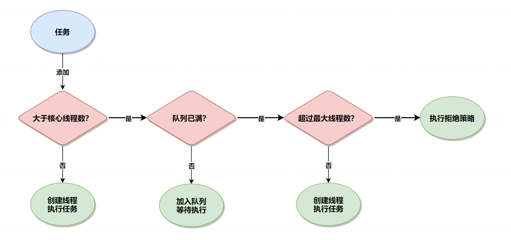
核心线程数 VS 最大线程数
核心线程数(corePoolSize)和最大线程数(maximumPoolSize)都是线程池中的两个重要参数，其中:
1. 核心线程数定义了线程池中最小线程数量，即使这些线程处于空闲状态，也不会被销毁
2. 最大线程数定义了线程池中允许的最大线程数量，最大线程数等于核心线程数 + 临时线程数，最大线程数主要是提供了一种机制来应对突发的高并发请求，当有大量任务的时候，可以创建线程数量的上线

PS:在线程池的使用过程中，最大线程数必须大于等于核心线程数，否则程序执行会报错。

核心线程为0的执行流程
那么问颖来了，按照线程池的正常执行流程来看，如果核心线程数为0的话，那么当任务来了之后会判断当前工作的线程数不大于核心线程数，那也就不会创建线程执行任务了，会将任务放到队列。但这个结果又很滑稽，有任务来了线程池意然不执行，而是先放到任务队列中，这好像有比较奇怪，这就好比你开了一个快递店，当有快递来了之后，你想的不是如何派送，而是直接把它丢到仓库一样滑稽，这会让等快递的人很着急，所以，我们需要验证一下线程池的执行是否如我们猜想的那般，验证代码如下:
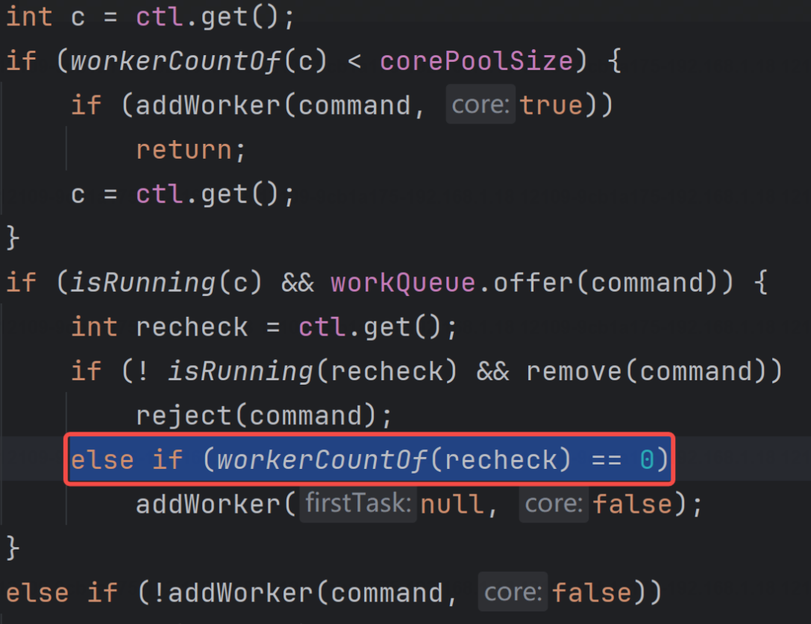
从上面源码可以看出，当我们将任务添加到队列的时候，线程池会判断工作的线程数是否为0，也就是上面圈出来的那行代码，如果当前工作线程为0的话，会创建线程执行任务。

也就是说，当核心线程数为0时，当来了一个任务之后，会先将任务添加到任务队列，同时也会判断当前工作的线程数是否为 0，如果为0，则会创建线程来执行线程池的任务，这就是正确的线程池执行流程。

## 9. 说说Java中的锁机制?（锁的作用、分类、实现）
Java 中的锁(Locking)机制主要是为了解决多线程环境下，对共享资源并发访问时的同步和互斥控制，以确保共享资源的安全访问。

锁的作用主要体现在以下几个方面:
1. 互斥访问:确保在任何时刻，只有一个线程能够访问特定的资源或执行特定的代码段。这防止了多个线程同时修改同一资源导致的数据不一致问题。
2. 内存可见性:通过锁的获取和释放，可以确保在锁保护的代码块中对共享变量的修改对其他线程可见。这是因2 为 Java 内存模型 (JMM)规定，对锁的释放会把修改过的共享变量从线程的工作内存刷新到主内存中，而获取锁时会从主内存中读取最新的共享变量值。
3. 保证原子性:锁能够保证在其保护的代码块内，一系列操作是不可分割的整体即原子操作。这意味着在多线程环境下，这些操作不会被线程调度机制打断，从而避免了数据的不完整修改。
4. 同步:协调线程间的执行顺序，使得某些操作在另一些操作完成之后再执行，保证程序的逻辑正确性。例如，一个线程在写入数据之后，另一个线程才能读取该数据，以确保读取到的数据是最新的。

在 Java 中有很多锁策略，用于对锁进行分类和指导锁的(具体)实现，这些锁策略包括以下内容

 1. 乐观锁:它基于一种乐观的思想，即认为数据一般情况下不会造成冲突，所以不会立即加上锁，而是在数据进行更新提交的时候再进行检查。如果发生冲突，则返回错误信息，让用户决定如何去做。
2. 悲观锁:它总是假设最坏的情况，每次去拿数据的时候都认为别人会修改，所以每次在拿数据的时候都会上锁，这样别人想拿这个数据就会阻塞直到它拿到锁。
3. 自旋锁:如果持有锁的线程能在很短时间内释放锁，那么那些等待竞争锁的线程就不需要做内核态和用户态之间的切换进入阻塞挂起状态，它们只需要等一等(自旋就是空循环)，等持有锁的线程释放锁后即可立即获取锁，这样就避免用户线程和内核的切换的消耗。
4. 可重入锁(递归锁):指的是同一个线程外层函数获得锁之后，内层递归函数仍然能获得该锁的代码。即，线程可以进入任何一个它已经拥有的锁所同步着的代码块。
5. 读写锁:在读写场景中，读操作可以并发进行，但写操作需要互斥进行。通过读写锁可以实现读写分离，提高系统的并发性能。
6. 公平锁/非公平锁:公平锁是指多个线程按照申请锁的顺序来获取锁，类似排队打饭，先到先得。非公平锁是指多个线程获取锁的顺序并不是按照申请锁的顺序，有可能后申请的线程比先申请的线程优先获取锁。
7. 共享锁/独占锁:共享锁允许多个线程同时读取一个资源，而独占锁则只允许一个线程访问资源。
8. 轻量级锁/重量级锁:这些是 Java 在 JVM 层面对 synchronized 锁的优化，以减少线程之间的竞争和提高程序的性能。
9. 分段锁:将一把锁分成多段，允许不同的线程同时访问不同的段，从而提高了并发访问的性能。
10. 同步锁:Java 内建的一种同步机制，例如 synchronized，它可以修饰方法或代码块，用于保护共享资源的访问。

2.锁实现
在 Java 中也有一些具体的锁实现，用于代码层面的锁操作以此来保证线程安全的，这些常见的锁实现有以下几个:

1. synchronized:内置锁(Monitor Lock)，可以用于方法或代码块，提供互斥访问。当一个线程进入synchronized 方法或块时，它会自动获取对象的锁，其他线程则需等待锁释放后才能进入。
2. ReentrantLock:是一个重入锁，是 java,util.concurrent.ocks 包中的接口 Lock 的实现，提供了比synchronized 更灵活的锁操作，如尝试获取锁、可中断的获取锁、超时获取锁等。它也支持公平锁和非公平锁策略。
3. ReentrantReadWriteLock(读写锁):也是java.util.concurrent,locks 包中的一部分，允许同时有多个读取者，但只允许一个写入者。它分为读锁和写锁，读锁之间不互斥，读锁与写锁互斥，写锁之间也互斥，适用于读多写少的场景。
4. StampedLock(Java8引入):提供了三种锁模式:读锁、写锁和乐观读锁。相较于4ReentrantReadWriteLock，StampedLock 提供了更细粒度的控制，支持乐观读取操作，可以提高并发性能。

下面我将为你展示如何在Java中使用`synchronized`关键字、`ReentrantLock`、`ReentrantReadWriteLock`和`StampedLock`。每种锁都有其适用场景，了解它们的用法可以帮助你更好地控制多线程程序的并发访问。

1. 使用`synchronized`关键字

`synchronized`可以用来修饰方法或者代码块，保证在同一时刻最多只有一个线程执行该段代码。

```java
public class Counter {
    private int count = 0;

    public synchronized void increment() {
        count++;
    }

    public synchronized int getCount() {
        return count;
    }
}
```

2. 使用`ReentrantLock`

`ReentrantLock`是一个可重入的互斥锁，与`synchronized`有相似的基本行为和语义，但提供了更高的扩展性。

```java
import java.util.concurrent.locks.ReentrantLock;

public class Counter {
    private final ReentrantLock lock = new ReentrantLock();
    private int count = 0;

    public void increment() {
        lock.lock();
        try {
            count++;
        } finally {
            lock.unlock();
        }
    }

    public int getCount() {
        lock.lock();
        try {
            return count;
        } finally {
            lock.unlock();
        }
    }
}
```

3. 使用`ReentrantReadWriteLock`

`ReentrantReadWriteLock`支持一对相关的锁：一个用于只读操作，另一个用于写操作。读锁可以由多个线程同时持有，只要没有线程持有写锁即可。写锁是独占的。

```java
import java.util.concurrent.locks.ReentrantReadWriteLock;

public class Counter {
    private final ReentrantReadWriteLock rwLock = new ReentrantReadWriteLock();
    private int count = 0;

    public void increment() {
        rwLock.writeLock().lock();
        try {
            count++;
        } finally {
            rwLock.writeLock().unlock();
        }
    }

    public int getCount() {
        rwLock.readLock().lock();
        try {
            return count;
        } finally {
            rwLock.readLock().unlock();
        }
    }
}
```

4. 使用`StampedLock`

`StampedLock`是Java 8引入的一种新的锁机制，它可以看成是读写锁的一个改进版本。它提供了一种乐观读锁的策略，这种策略在很多情况下能够减少读锁的争用。

```java
import java.util.concurrent.locks.StampedLock;

public class Counter {
    private final StampedLock lock = new StampedLock();
    private int count = 0;

    public void increment() {
        long stamp = lock.writeLock();
        try {
            count++;
        } finally {
            lock.unlockWrite(stamp);
        }
    }

    public int getCount() {
        long stamp = lock.tryOptimisticRead();
        int copy = count;
        if (!lock.validate(stamp)) {
            stamp = lock.readLock();
            try {
                copy = count;
            } finally {
                lock.unlockRead(stamp);
            }
        }
        return copy;
    }
}
```

每种锁都有其特定的使用场景和性能特点，选择哪种锁取决于你的具体需求。
## 10. 什么锁比读写锁性能更高?
在并发编程中，读写锁 ReentrantReadWriteLock 的性能已经算是比较高的了，因为它将悲观锁的粒度分的更细在它里面有读锁和写锁，当所有操作为读操作时，并发线程是可以共享读锁同时运行的，这样就无需排队执行了所以执行效率也就更高。
那么问题来了，有没有比读写锁 ReentrantReadWriteLock 性能更高的锁呢?答案是有的，在 Java 中，比 ReentrantReadWriteLock 性能更高的锁有以下两种:
1. 乐观锁:乐观锁是一种非阻塞锁机制，它是通过 Compare-And-Swap(CAS)对比并替换来进行数据的更改的，它假设多个线程(或进程)之间很少会发生冲突，因此不会加锁，只有在需要修改之后，通过对比并替换来修改共享变量的值，因此它在非高并发的环境下的性能是非常高的。
2. StampedLock:它是 JDK8 中新增的锁类型，它提供了三种锁模式:读锁、写锁和乐观读锁。相较于ReentrantReadWriteLock，StampedLock 提供了更细粒度的控制，支持乐观读取操作，可以提高并发性能。

## 11. 如何实现线程任务编排?
线程任务编排指的是对多个线程任务按照一定的逻辑顺序或条件进行组织和安排，以实现协同工作、顺序执行或并行执行的一种机制。

**线程任务编排 VS 线程通讯**

有同学可能会想:那线程的任务编排是不是问的就是线程间通讯啊?线程间通讯我知道了，它的实现方式总共有以下几种方式:

 1. Object 类下的 wait()、notify()和 notifyAll()方法,
2. Condition 类下的 await()、signal()和 signalAll()方法;
3. LockSupport 类下的 park()和 unpark()方法。

但是，线程通讯和线程的任务编排是不同的两个概念，它们的区别如下:
==线程任务编排主要关注的是如何组织和管理线程执行的任务序列，确保任务按照预定的逻辑和顺序执行，包括任务的启动、停止、依赖管理、执行策略(如并行、串行)以及错误处理等。它是关于如何有效地规划线程的工作流程，以达成高效和正确的程序执行目标。==

线程通讯则是指在多线程环境中，线程之间传递信息和协调工作的机制。当多个线程需要共享数据或协同完成某项任务时，它们需要通过某种方式进行沟通，以确保数据的正确性和任务的同步执行。==它的重点在于解决线程间的同步问题和数据一致性问题。==
==简而言之，线程任务编排侧重于高层次的执行计划和流程控制，而线程通讯则专注于底层的数据交互和同步细节== 。在实际应用中，有效的线程任务编排往往离不开合理的线程通讯机制，两者相辅相成，共同支撑起复杂多线程程序的正确执行。

**线程的任务编排的实现方式主要有以下两种:**
1. FutureTask:诞生于 JDK 1.5，它实现了 Future 接口和 Runnable 接口，设计初衷是为了支持可取消的异步计算，它既可以承载 Runnable 任务(通过包装成 RunnableAdapter)，也可以承载 Callable 任务，从而能够返回计算结果，使用它可以实现简单的异步任务执行和结果的等待，
2. CompletableFuture:诞生于 JDK8，它不仅实现了 Future 接口，还实现了 CompletionStage 接口。CompletionStage 是对 Future 的扩展，提供了丰富的链式异步编程模型，支持函数式编程风格，可以更加灵活地处理异步操作的组合和依赖回调等。

在Java中，可以使用`FutureTask`和`CompletableFuture`来实现线程任务编排。下面我将分别用代码举例说明它们的用法。

 使用`FutureTask`实现线程任务编排

```java
import java.util.concurrent.Callable;
import java.util.concurrent.ExecutionException;
import java.util.concurrent.FutureTask;

public class FutureTaskExample {
    public static void main(String[] args) throws InterruptedException, ExecutionException {
        FutureTask<Integer> task1 = new FutureTask<>(new Callable<Integer>() {
            @Override
            public Integer call() throws Exception {
                Thread.sleep(2000);
                return 1;
            }
        });

        FutureTask<Integer> task2 = new FutureTask<>(new Callable<Integer>() {
            @Override
            public Integer call() throws Exception {
                Thread.sleep(1000);
                return 2;
            }
        });

        new Thread(task1).start();
        new Thread(task2).start();

        int result1 = task1.get();
        int result2 = task2.get();

        System.out.println("Result 1: " + result1);
        System.out.println("Result 2: " + result2);
    }
}
```

使用`CompletableFuture`实现线程任务编排

```java
import java.util.concurrent.CompletableFuture;

public class CompletableFutureExample {
    public static void main(String[] args) {
        CompletableFuture<Integer> future1 = CompletableFuture.supplyAsync(() -> {
            try {
                Thread.sleep(2000);
            } catch (InterruptedException e) {
                e.printStackTrace();
            }
            return 1;
        });

        CompletableFuture<Integer> future2 = CompletableFuture.supplyAsync(() -> {
            try {
                Thread.sleep(1000);
            } catch (InterruptedException e) {
                e.printStackTrace();
            }
            return 2;
        });

        CompletableFuture<Integer> combinedFuture = future1.thenCombine(future2, (result1, result2) -> result1 + result2);

        combinedFuture.thenAccept(result -> System.out.println("Combined Result: " + result));
        
        // 等待所有任务完成
        combinedFuture.join();
    }
}
```

以上是使用`FutureTask`和`CompletableFuture`实现线程任务编排的示例代码。在实际开发中，可以根据具体需求选择合适的方式来管理和编排线程任务。
## 12. 如何实现优先级线程池?
在Java中实现优先级线程池可以通过`PriorityBlockingQueue`和`ThreadPoolExecutor`来实现。`PriorityBlockingQueue`是一个支持优先级的无界阻塞队列，可以用来存储具有优先级的任务。`ThreadPoolExecutor`是一个线程池的实现类，可以用来管理线程池中的线程。

下面是一个简单的示例代码，演示如何实现一个优先级线程池：

```java
import java.util.concurrent.*;

public class PriorityThreadPoolExample {
    public static void main(String[] args) {
        ThreadPoolExecutor executor = new ThreadPoolExecutor(
                2, // 核心线程数
                5, // 最大线程数
                1, // 空闲线程存活时间
                TimeUnit.SECONDS, // 时间单位
                new PriorityBlockingQueue<>()); // 优先级阻塞队列

        for (int i = 0; i < 10; i++) {
            int priority = i % 3; // 模拟不同优先级的任务
            executor.execute(new PriorityTask(priority, i));
        }

        executor.shutdown();
    }

    static class PriorityTask implements Runnable, Comparable<PriorityTask> {
        private int priority;
        private int id;

        public PriorityTask(int priority, int id) {
            this.priority = priority;
            this.id = id;
        }

        @Override
        public void run() {
            System.out.println("Task " + id + " with priority " + priority + " is running.");
        }

        @Override
        public int compareTo(PriorityTask o) {
            return Integer.compare(this.priority, o.priority);
        }
    }
}
```

在这个示例中，我们创建了一个`ThreadPoolExecutor`，使用`PriorityBlockingQueue`作为任务队列，然后定义了一个`PriorityTask`类来表示具有优先级的任务。在`PriorityTask`类中，我们实现了`Comparable`接口，根据任务的优先级进行比较。

通过这样的方式，我们可以实现一个简单的优先级线程池，根据任务的优先级来执行任务。

## 13. 为什么stampedLock会导致CPU100%?

StampedLock 是 Java8引入的一种高级的锁机制，它位于 java.util.concurrent.locks 包中，与传统的读写锁(ReentrantReadWriteLock)相比，StampedLock 提供了更灵活和更高性能的锁解决方案，尤其适用于读操作远多于写操作的场景。

**1.特点展示**
相比于 Java 中的其他锁，StampedLock 具有以下特点:

1. 读写分离:StampedLock 支持读写分离，读锁和写锁可以同时被不同的线程持有，从而提高了并发性能。而synchronized 和 ReentrantLock 则不支持读写分离，读操作和写操作会相互阻塞
2. 乐观读:StampedLock 支持乐观读，读操作不会阻塞写操作，只有在写操作发生时才会升级为悲观读。这种方式适用于读多写少的场景，可以提高读操作的并发性能。而 ReentrantReadWriteLock 则不支持乐观读。
3. 不可重入:ReentrantLock 和 synchronized 都是可重入锁，而 StampedLock 的写锁是不可重入的。
4. 性能优势:StampedLock 在多线程并发中的读多情况下有更好的性能，因为 StampedLock 获取乐观读锁时不需要通过 CAS 操作来设置锁的状态，只是简单地通过测试状态即可。

**2.基本使用**
StampedLock 有三种读写方法:
1. readLock():读锁，用于多线程并发读取共享资源。
2. writeLock():写锁，用于独占写入共享资源。
3. tryOptimisticRead():读乐观锁，用于在不阻塞其他线程的情况下尝试读取共享资源。

其中 readLock()和 writeLock()方法与 ReentrantReadWriteLock 的用法类似，而 tryOptimisticRead()方法则是StampedLock 引入的新方法，它用于非常短的读作，
因此，我们在加锁时，可以使用性能更高的读乐观锁来替代传统的读锁，如果能加锁成功，则它可以和其他线程(即使是写操作)一起执行，也无需排队运行(传统读锁遇到写锁时需要排队执行)，这样的话StampedLock 的执行效率就会更高，它是使用如下:

```java
import java.util.concurrent.locks.StampedLock;

public class StampedLockExample {
    private double x, y;
    private final StampedLock sl = new StampedLock();

    // Write method
    public void move(double deltaX, double deltaY) {
        long stamp = sl.writeLock();
        try {
            x += deltaX;
            y += deltaY;
        } finally {
            sl.unlockWrite(stamp);
        }
    }

    // Optimistic read method
    public double distanceFromOrigin() {
        long stamp = sl.tryOptimisticRead();
        double currentX = x, currentY = y;
        if (!sl.validate(stamp)) {
            stamp = sl.readLock();
            try {
                currentX = x;
                currentY = y;
            } finally {
                sl.unlockRead(stamp);
            }
        }
        return Math.sqrt(currentX * currentX + currentY * currentY);
    }
}
```


**3.注意事项**
在使用 StampedLock 时，需要注意以下几个问题:
1. 不可重入性:StampedLock 的读锁和写锁都不支持重入，这意味着一个线程在获取了锁之后，不能再次获取同一个锁，所以在使用 StampedLock 时，一定要避免嵌套使用。
2. 死锁问题:使用 StampedLock 时，必须使用与获取锁时相同的 stamp 来释放锁，否则就会导致释放锁失败从而导致死锁问题的发生。
3. CPU 使用率飙升问题:如果 StampedLock 使用不当，具体来说，在 StampedLock 执行 writeLock 或readLock 阳塞时，如果调用了中断操作，如 interrupt()可能会导致 CPU 使用率飙升。这是因为线程接收到了中断请求，但 StampedLock 并没有正确处理中断信号，那么线程可能会陷入无限循环中，试图从中断状态中恢复，这可能会导致 CPU 使用率飙升。


以下代码中线程 2 会导致 CPU 100% 的问题，如下代码所示:

```java
public void runningTask()throws Exception{
	final stampedLock lock =new stampedLock();
	Thread thread = new Thread(()->{
	// 获取写锁
	lock.writeLock();// 永远阻塞在此处，不释放写锁
	Locksupport.park();
	});
	thread.start();
	// 保证 thread 获取写锁
	Thread.sleep(100);
	Thread thread2 = new Thread(()->
		// 阻塞在悲观读锁
		lock.readLock()
	);
	thread2.start();
	// 保证 thread2 阻塞在读锁
	Thread.sleep(100);
	// 中断线程 thread2，导致 thread2 CPu 飙升
	thread2.interrupt();
	thread2.join();
}
```
以上代码中，线程一先获取到锁，之后阻塞，并未释放锁，而线程二阻塞在 readLock()读锁时，收到了中断请求interrupt()，但并未正确处理中断异常，因此线程会陷入无限循环中，试图从中断状态中恢复，这就会导致 CPU 使用率一直飙升。
**5.如何解决 CPU 100%?**
StampedLock 可能会导致 CPU 100% 是因为使用了 interrupt()中止线程导致的，我们只需要将 interrupt() 方法换成 readLockInterruptibly()或 writeLockInterruptibly()方法中止线程即可，这两种方法提供了可中断的悲观读锁和写锁，它们允许线程在等待锁时响应中断。
也就是说 interrupt 只是设置线程的中断状态，在 StampedLock 阻塞状态时，中断状态和阻塞状态同时存在可能会导致 CPU 一直飙升;而 readLockInterruptibly 和 writeLockInterruptibly 提供了在获取锁的过程中能够响应中断的机制，通过抛出异常来通知线程中断的发生。