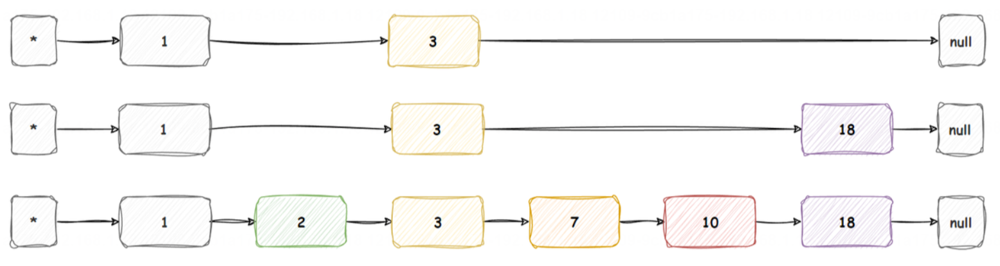

# 重点面试题

## 1. 为什么 Redis 这么比较快?

>1.**内存操作** 2.**单线程操作** 3.**IO多路复用** 4.**高效的数据结构**

## 2. Redis是单线程运行吗？IO多路复用和IO多线程的区别？

>单线程：命令行处理
>多线程：网络IO、持久化、主从同步
>
>IO多路复用： 允许一个进程或线程同时监视多个文件描述符，一旦某个文件描述符上有 I/O 事件发生（如可读或可写），就通知应用程序进行相应的处理。

## 3. 什么是缓存雪崩？如何解决缓存雪崩？

>原因：1.缓存时间不合理 2.服务器故障 3.热点分布不均
>解决：1.随机时间 2.多级缓存 3.缓存过期前预加载 4.开启限流或降级 5.监控和预警
缓存雪崩是指在高流量的系统中，缓存在同一时间或短时间内突然出现大量失效，导致大量请求直接打到数据库上，使得数据库压力剧增，甚至可能引起数据库宕机，进而导致整个系统服务不可用的现象。

## 4. 什么是缓存穿透？如何解决？

>原因：访问空数据，空数据没有缓存
>解决：1.缓存空数据 2.布隆过滤器判断一下数据是否可能在数据库存在 3.开启限流功能
缓存穿透是指请求查询的数据在缓存和数据库中都不存在，导致每次请求都要访问数据库，这样缓存就失去了意义，可能会对数据库造成压力。解决缓存穿透的方法主要有以下几种：         

## 5. 什么是缓存击穿？如何解决？

>原因：热点数据缓存失效
>解决：1.热点缓存设置永不过期 2.缓存过期前预加载 3.使用多级缓存 4.开启限流或者降级
缓存击穿是指一个高热度的key在缓存中过期的瞬间，大量的请求同时到达数据库，导致数据库压力剧增，甚至可能宕机的现象。这种现象通常发生在对某个热点数据进行高并发访问时，缓存对该数据的缓存失效，而新的缓存还未建立起来，导致所有的请求都直接打到数据库上。       

## 6. Redis 可以实现什么功能?

> 1、缓存 2、会话存储 3、分布式锁 4、计数器功能

## 7. 什么是布隆过滤器？它有什么用？

> - 用于判断一个元素是否在一个集合中。它实际上是一个很长的二进制向量（位数组）和一系列随机映射函数。
> - 用途：缓存穿透防护、网页URL去重

## 8. 如何实现布隆过滤器？

> RedisBloom

## 9. Redis如何实现分布式锁？ 

> **SET if Not eXists**

## 10. Redis实现分布式锁有什么问题？如何解决？ 

> 1. 死锁
> 2. 锁误删
> 3. 不可重入
> 4. 无法自动续期

## 11. 如何使用Redission实现分布式锁？

Redisson 是一个在 Java 环境下使用的 Redis 客户端，它提供了多种分布式数据结构和服务，包括实现为分布式锁的 API。使用 Redisson 实现分布式锁非常简单，以下是基本的步骤和代码示例：

### 1. 添加 Redisson 依赖

首先，需要在项目的 `pom.xml` 文件中添加 Redisson 的依赖：

```xml
<dependency>
    <groupId>org.redisson</groupId>
    <artifactId>redisson</artifactId>
    <version>最新版本</version>
</dependency>
```

### 2. 配置 Redisson 客户端

创建一个配置类，用于配置 Redisson 客户端并连接到 Redis 服务器：

```java
import org.redisson.Redisson;
import org.redisson.api.RedissonClient;
import org.redisson.config.Config;

public class RedissonConfig {
    public static RedissonClient createClient() {
        Config config = new Config();
        config.useSingleServer().setAddress("redis://127.0.0.1:6379");
        return Redisson.create(config);
    }
}
```

### 3. 使用 Redisson 获取分布式锁

使用 Redisson 客户端获取一个 `RLock` 对象，该对象提供了分布式锁的 API：

```java
import org.redisson.api.RLock;
import org.redisson.api.RedissonClient;

public class DistributedLockExample {
    public static void main(String[] args) {
        // 创建 Redisson 客户端
        RedissonClient redissonClient = RedissonConfig.createClient();

        // 获取分布式锁
        RLock lock = redissonClient.getLock("myLock");

        try {
            // 尝试加锁，等待时间最多为 100 毫秒，上锁后保持 10 秒钟
            boolean isLocked = lock.tryLock(100, 10, TimeUnit.SECONDS);
            if (isLocked) {
                try {
                    // 执行业务逻辑
                    System.out.println("业务逻辑处理...");
                } finally {
                    // 释放锁
                    lock.unlock();
                }
            } else {
                System.out.println("无法获取锁，处理其他逻辑...");
            }
        } catch (InterruptedException e) {
            e.printStackTrace();
        } finally {
            // 关闭 Redisson 客户端
            redissonClient.shutdown();
        }
    }
}
```

在上面的代码中，`tryLock` 方法尝试获取锁，如果锁不可用，它会等待直到获得锁或超过指定的等待时间。如果成功获取锁，你可以执行业务逻辑，然后在 finally 块中释放锁。

### 4. 锁的自动续期（看门狗）

Redisson 还提供了自动续期的功能，称为“看门狗”（watchdog）。当锁被某个线程持有时，Redisson 会自动延长锁的过期时间，以防止在执行长时间运行的任务时锁过期：

```java
RLock lock = redissonClient.getLock("myLock");
lock.lock(); // 加锁，没有指定保持时间，将一直持有直到显式解锁
try {
    // 执行业务逻辑
    System.out.println("业务逻辑处理...");
} finally {
    lock.unlock(); // 释放锁
}
```

在上述代码中，`lock` 对象会在后台线程中自动续期，直到执行完业务逻辑并释放锁。

### 5. 释放锁

在业务逻辑执行完毕后，确保释放锁，以便其他线程可以获取锁。如果线程在持有锁的过程中崩溃，Redisson 的“看门狗”机制也会确保锁最终被释放。

使用 Redisson 实现分布式锁可以大大简化分布式锁的管理，同时提供高性能和丰富的功能。在实际应用中，根据业务需求选择合适的锁类型和配置。

## 12. 说一下Redission看门狗的机制

Redisson 的看门狗（Watchdog）机制是 Redisson 分布式锁的核心特性之一，它确保了分布式锁在持有期间不会因为某些原因（如网络波动、GC等）导致锁失效，从而保证了分布式环境下锁的稳定性和可靠性。

### 工作原理
当客户端成功获取锁后，Redisson 会启动一个定时任务（看门狗任务），定时向 Redis 服务器发送续期命令，以延长锁的持有时间。这样，即使在持有锁期间出现了网络延迟、GC 停顿等导致客户端无法及时响应的情况，Redis 服务器端的锁依然保持有效状态，避免了锁被意外释放的风险。

### 实现细节
1. **锁对象状态管理**：Redisson 分布式锁在内部维护了一个锁对象状态，用于记录锁的当前状态（如锁是否被占用、锁持有者的信息等）。看门狗任务通过定期检查和更新这个状态来确保锁的有效性。
2. **定时任务调度**：Redisson 使用了内部的定时任务调度器来管理看门狗任务。当客户端成功获取锁后，会启动一个定时任务，并在每个周期内向 Redis 服务器发送续期命令。
3. **续期命令发送**：看门狗任务的核心是向 Redis 服务器发送续期命令。续期命令通过 Redisson 客户端向 Redis 服务器发送，要求 Redis 服务器延长锁的持有时间。Redis 服务器收到命令后，会更新锁的过期时间，确保锁在持有期间保持有效。

### 自动续期
在 Redisson 分布式锁中，看门狗机制通过自动续期的方式保证了锁的稳定性和可靠性。当客户端成功获取锁后，会启动一个看门狗任务，定时向 Redis 服务器发送续期命令。这个续期过程是完全自动的，无需用户手动干预。看门狗任务的执行周期和续期时间都是可配置的。

### 配置和使用
在实际应用中，用户可以根据业务需求调整看门狗任务的参数，以满足不同的性能要求。例如，可以通过修改 `Config.lockWatchdogTimeout` 来指定看门狗的续期时间，**默认情况下，看门狗的续期时间是30秒**。

### 总结

Redisson 的看门狗机制是其核心特性之一，通过自动续期的策略保证了分布式环境下锁的稳定性和可靠性。在实际应用中，用户可以根据业务需求调整看门狗任务的参数，以满足不同的性能要求。通过深入理解 Redisson 分布式锁的看门狗机制，我们可以更好地利用这一机制来保障分布式系统的安全和稳定。  

## 13. Redis 常用数据类型有哪些?

Redis 是一个键值对数据库，它支持多种数据类型，这些数据类型可以进一步细分为更具体的数据结构。以下是 Redis 常用的一些数据类型：

1. **字符串（String）**：
   - 基本的字符串数据类型，可以包含任何数据，如文本或者二进制数据。
   - 常用命令：`SET`, `GET`, `DECR`, `INCR`, `APPEND` 等。

2. **列表（List）**：
   - 一个有序集合，支持在两端推入或弹出元素。
   - 常用命令：`LPUSH`, `RPUSH`, `LPOP`, `RPOP`, `LRANGE` 等。

3. **集合（Set）**：
   - 无序集合，支持快速查找、添加和删除元素。
   - 常用命令：`SADD`, `SREM`, `SISMEMBER`, `SINTER`, `SUNION` 等。

4. **有序集合（Sorted Set）**：
   - 与 Set 类似，但每个元素都会关联一个排序分数，支持按分数顺序访问元素。
   - 常用命令：`ZADD`, `ZREM`, `ZRANGE`, `ZREVRANGE`, `ZSCORE` 等。

5. **哈希（Hash）**：
   - 键值对集合，适合存储对象。
   - 常用命令：`HSET`, `HGET`, `HDEL`, `HGETALL`, `HKEYS` 等。

6. **位图（Bitmaps）**：
   - 字符串类型的一种特殊用途，可以作为位数组，每个位表示一个布尔值。
   - 常用命令：`SETBIT`, `GETBIT`, `BITCOUNT` 等。

7. **超日志（HyperLogLogs）**：
   - 用于基数统计的近似算法，占用空间小，适合统计独立元素的数量。
   - 常用命令：`PFADD`, `PFCOUNT`, `PFMERGE` 等。

8. **地理空间（Geospatial）**：
   - 用于存储地理位置信息，并进行地理位置查询。
   - 常用命令：`GEOADD`, `GEORADIUS`, `GEODIST` 等。

9. **流（Streams）**：
   - 支持发布订阅功能的先进先出（FIFO）消息队列。
   - 常用命令：`XADD`, `XREAD`, `XREADGROUP`, `XACK`, `XPUBLISH` 等。

10. **键空间通知（Pub/Sub）**：
    - 一种消息通信模式，允许发布消息到频道，订阅频道以接收消息。
    - 常用命令：`PUBLISH`, `SUBSCRIBE`, `UNSUBSCRIBE`, `PSUBSCRIBE` 等。

11. **脚本（Scripts）**：
    - 可以编写 Lua 脚本来执行多个命令，保证原子性操作。
    - 常用命令：`EVAL`, `EVALSHA`, `SCRIPT EXISTS` 等。

12. **事务（Transactions）**：
    - 可以一次执行多个命令，并保证这些命令的原子性。
    - 常用命令：`MULTI`, `EXEC`, `DISCARD`, `WATCH` 等。

这些数据类型使得 Redis 非常灵活，可以应用于各种不同的场景，如缓存、消息队列、排行榜、实时分析等。

## 14. 有序集合在实际工作中的应用？

Redis 有序集合（Sorted Set）在实际工作中有多种应用，以下是一些常见的应用场景：

1. **排行榜**：有序集合非常适合用来实现排行榜功能。例如，在游戏或社交平台中，可以将用户作为成员，其得分作为分数，通过有序集合的分数排名来展示用户的排名情况。使用 `ZADD` 命令添加或更新成员分数，`ZREVRANGE` 命令可以获取排名前几位的用户及其分数。

2. **范围查询**：有序集合支持按照分数范围进行查询，这使得它非常适合于需要按照某个指标进行过滤和排序的场景。通过指定分数范围，可以获取符合条件的成员列表，实现灵活的数据检索。

3. **任务调度**：可以利用有序集合实现任务调度功能。将待执行的任务作为成员，其执行时间作为分数，然后通过轮询有序集合，定时检查执行时间到期的任务并执行，从而实现简单而高效的任务调度系统。

4. **实时排名**：有序集合可以用于实时计算和更新实体的排名。例如，在股票市场中，可以将股票作为成员，其实时价格作为分数，然后通过更新有序集合中股票的分数来实现实时的排名。

5. **限流**：有序集合也可以用来实现限流功能。通过将用户的访问时间戳作为分数，可以限制单位时间内的访问次数，从而实现类似于漏桶或令牌桶的限流算法。

6. **商品销量排行榜**：电商平台可以根据商品的销售量、收藏量、评价等指标，制作商品销量排行榜，帮助用户快速发现热门商品，提高购物体验和交易效率。

7. **社交平台活跃度排名**：社交平台可以根据用户的活跃度指标，如发帖数量、点赞数、评论数等，制作用户活跃度排行榜，激励用户参与社区活动，增加用户黏性和留存率。

8. **实时更新和查询**：在需要实时更新和查询排名的场景下，例如直播系统中的礼物排行榜，可以使用有序集合来实现，确保用户能够看到实时的排名变化。

使用 Redis 有序集合时，需要注意成员的唯一性和分数的排序规则，以及操作的复杂度。有序集合的添加、删除和更新操作的复杂度为 O(log N)，其中 N 是集合中的元素数量。通过合理利用有序集合，可以实现各种灵活而高效的应用场景，提升系统的性能和可扩展性。           

## 15. 有序列表底层是如何实现的？

Redis 有序集合（Sorted Set）的底层实现是通过一个叫做“跳跃表”（Skip List）的数据结构来完成的。跳跃表是一种概率平衡的数据结构，它通过多级索引的方式来提高查找的效率。在 Redis 中，每个有序集合的元素都包含一个与之关联的分数，这个分数用于排序。

当添加、删除或更新有序集合中的元素时，跳跃表能够在对数时间内完成这些操作（O(log N)），这是因为跳跃表的结构类似于多层的链表，每一层都是上一层的一个子集，并且每个层级都包含指向下一个元素的指针。通过这种方式，查找、插入和删除操作可以跳过一些元素，从而加快操作速度。

跳跃表的实现使得有序集合中的元素已经是排序好的，因此当执行范围查询（如 `ZRANGE` 或 `ZREVRANGE`）时，Redis 能够非常快速地返回结果，而不需要额外的排序操作。

此外，有序集合在 Redis 中还使用了一个哈希表来存储元素和分数的映射，这样可以通过 O(1) 时间复杂度来快速查找特定元素是否存在于集合中，以及它的分数是多少。

这种结合使用跳跃表和哈希表的方法，既保证了数据的快速访问，又保证了数据的有序性，使得 Redis 有序集合在实现上非常高效。

## 16. 什么是跳跃表？

跳跃表 SkipList，也称之为跳表，是一种数据结构，用于在有序元素的集合中进行高效的查找操作。**它通过添加多层链表的方式**，**提供了一种以空间换时间的方式来加速查找**。跳跃表由一个带有多层节点的链表组成，每一层都是原始链表的一个子集。最底层是一个完整的有序链表，包含所有元素。每个更高层级都是下层级的子集，通过添加额外的指针来跳过一些元素。这些额外的指针称为“跳跃指针”，它们允许快速访问更远的节点，从而减少了查找所需的比较次数。跳跃表的平均査找时间复杂度为 O(log n)，其中 n是元素的数量。这使得它比普通的有序链表具有更快的查找性能，并且与平衡二又搜索树(如红黑树)相比，实现起来更为简单，跳跃表的简单示例如下图所示:


## 17. 说一下跳表的查询流程?
跳表的查询流程如下:
1. **起始搜索**:查询操作从跳表的顶层开始，跳表的顶层包含一个或多个节点，从最顶层的头节点开始，将当前节点设为头节点。
2. **检查下一个节点**:检查当前节点的下一个节点，如果节点的分值小于目标分值，则右移检查下一个节点，然后重复此步骤，直到找到一个大于目标分值的节点，或为最后一个节点。
3. **逐层下探**:如果当前下一个节点的值大于目标分值，或为最后一个节点，则将当前指针向下一层级进行搜索重复上述步骤。
4. **终止并返回**:在查找的过程中，如果找到了和日标分值相同的值，或者遍历完所有层级仍然未找到对应节点则说明要查找的元素不存在于跳表中，则终止查找并返回查询到的内容或 NULL 值。

## 18. 说一下跳表的添加流程？
要搞懂跳跃表的添加流程，首先要搞懂下面的前置知识。
前置知识:**节点随机层数**
>**所谓的随机层数指的是每次添加节点之前，会先生成当前节点的随机层数，根据生成的随机层数来决定将当前节点存在几层链表中。**
>为什么要这样设计呢?
>这样设计的目的是为了保证 Redis 的执行效率，如果使用固定规律的跳表，为了维护固定的规律，所以在添加和删除节点时，跳表的整体变动非常大，效率也非常低。而使用随机层数，在添加和删除时，其他节点无需改动，因此效率要比固定规律的跳表性能高很多，所以 Redis 采用了节点随机层数。


1. 第一个元素添加到最底层的有序链表中(最底层存储了所有元素数据)
2. 第二个元素生成的随机层数是 2，所以再增加 1层，并将此元素存储在第 1 层和最低层。
3. 第三个元素生成的随机层数是 4，所以再增加 2层，整个跳跃表变成了 4层，将此元素保存到所有层中。
4. 第四个元素生成的随机层数是 1，所以把它按顺序保存到最后一层中即可。

其他新增节点以此类推。

## 19. Redis如何保证数据不丢失？

Redis 是一个内存数据库，为了保证数据不丢失，提供了两种主要的持久化机制：RDB（Redis DataBase）和 AOF（Append Only File）。这两种机制可以单独使用，也可以同时使用，以提供数据的高可用性和耐久性。

1. **RDB持久化**：这种机制会定期创建内存数据的快照并保存到磁盘上的一个RDB文件中。这些快照是二进制格式的，文件紧凑，恢复速度快。RDB持久化可以配置为在特定时间间隔内，如果有一定的数据变化量，就自动触发快照。此外，也可以手动执行`SAVE`或`BGSAVE`命令来创建快照。`BGSAVE`命令会在后台异步执行，不会阻塞主线程。

2. **AOF持久化**：AOF机制记录每次写操作命令并追加到AOF文件中。这种方式提供了更好的数据安全性，因为它可以配置为每次写操作后都同步到磁盘（`appendfsync always`），或者每秒同步一次（`appendfsync everysec`），或者让操作系统决定何时同步（`appendfsync no`）。AOF文件通常比RDB文件大，因为它们包含了所有的写操作命令。随着时间的推移，AOF文件可能会变得非常大，因此Redis提供了AOF重写功能，通过压缩和合并命令来减小文件大小。

3. **混合持久化**：在Redis 4.0及以上版本中，可以同时使用RDB和AOF持久化机制。在这种情况下，Redis启动时会优先使用AOF文件来恢复数据，因为它提供了更完整的数据保护。同时，RDB文件可以用于快速的数据恢复。

为了确保数据不丢失，应该根据具体的业务需求和性能考虑来选择最合适的持久化策略。例如，如果数据安全性是首要考虑的因素，那么应该使用AOF持久化或混合持久化。如果需要快速恢复大数据集，并且可以接受偶尔的数据丢失，那么RDB持久化可能是更好的选择。

在实际应用中，还需要考虑其他因素，如硬盘的I/O性能、磁盘空间的使用、数据恢复时间等，以确保持久化策略既能满足数据安全的需求，又不会对Redis的性能造成太大影响。


在Redis中，除了持久化机制（RDB和AOF）之外，还可以采取以下措施来防止数据丢失：

1. **主从复制（Replication）**：
   - 通过设置一个或多个从服务器来复制主服务器的数据，即使主服务器宕机，从服务器仍然可以继续提供服务，并且拥有主服务器的数据副本。
   - 在主服务器宕机时，可以通过手动或自动的方式将其中一个从服务器提升为新的主服务器，从而实现故障转移。

2. **哨兵系统（Sentinel）**：
   - Redis Sentinel提供了高可用性解决方案，它可以监控Redis服务器，自动检测主服务器是否下线，并进行自动故障转移。
   - 哨兵系统可以配置多个实例，以确保监控的高可用性。

3. **集群模式（Cluster）**：
   - Redis Cluster提供了数据分片功能，将数据分布在多个节点上，每个节点都可以处理部分数据和请求。
   - 集群模式下，如果某个节点宕机，其他节点仍然可以继续提供服务，并且可以通过数据复制机制自动恢复丢失的数据。

4. **数据备份**：
   - 定期手动或自动地备份Redis数据文件（RDB文件或AOF文件），并将备份存储在安全的位置。
   - 在数据丢失时，可以使用备份文件来恢复数据。

5. **合理的持久化配置**：
   - 根据业务需求合理配置RDB和AOF的持久化策略，比如设置AOF的`appendfsync`为`everysec`，以平衡数据安全性和性能。
   - 定期检查和测试持久化文件的完整性，确保在需要时能够成功恢复数据。

6. **硬件和网络冗余**：
   - 使用RAID配置硬盘，以防止硬盘故障导致的数据丢失。
   - 确保网络的稳定性和冗余，避免网络问题导致的数据访问失败。

7. **监控和报警**：
   - 实施系统监控，实时监控Redis服务器的性能和健康状况。
   - 设置报警机制，在出现潜在的数据丢失风险时及时通知管理员。

8. **避免单点故障**：
   - 在部署Redis时，避免所有实例都运行在同一台物理服务器或同一个虚拟机上，以减少单点故障的风险。

9. **使用持久化层（Durability Layer）**：
   - 对于使用Redis作为持久化存储的场景，可以考虑使用持久化层，如Riak或Cassandra，它们提供了数据的多副本和自动修复功能。

通过上述措施，可以大大降低Redis中数据丢失的风险，提高数据的安全性和可靠性。在实际应用中，应该根据业务需求和资源情况，选择适合的策略来保护数据。

## 20. Redis有几种持久化方式？有什么区别？

Redis 提供了两种主要的持久化方式：RDB（Redis DataBase）和 AOF（Append Only File）。此外，Redis 4.0 引入了一种混合持久化方式，结合了 RDB 和 AOF 的特点。下面是这三种持久化方式的详细介绍和它们之间的区别：

1. **RDB 持久化**：
   - **方式**：通过创建内存数据的快照来实现持久化，即在某个时间点将Redis的数据存储到磁盘上的一个RDB文件中。
   - **优点**：
     - 文件紧凑，占用磁盘空间小。
     - 恢复速度快，适合大规模数据恢复。
   - **缺点**：
     - 可能会丢失最近一次快照之后的数据，因为快照是在特定时间点进行的。
     - 快照过程中可能会对性能产生影响，尤其是在数据量大时。

2. **AOF 持久化**：
   - **方式**：记录每次写操作命令并追加到AOF文件中，以日志的形式保存。
   - **优点**：
     - 数据安全性更高，可以设置为每次写操作后都同步到磁盘，减少数据丢失的风险。
     - AOF文件易于阅读和理解，方便调试和恢复。
   - **缺点**：
     - AOF文件可能会比RDB文件大，因为记录了所有的写操作命令。
     - 频繁的磁盘I/O操作可能会影响Redis的性能。

3. **混合持久化**：
   - **方式**：结合了RDB和AOF的特点，在AOF文件的开始部分使用RDB格式记录数据的快照，在快照之后使用AOF格式记录写操作命令。
   - **优点**：
     - 启动速度比纯AOF快，因为可以直接加载RDB部分的数据。
     - 数据安全性比纯RDB高，因为AOF部分记录了快照之后的所有写操作。
   - **缺点**：
     - 需要同时维护RDB和AOF两种格式的数据，可能会增加复杂性。

**区别**：
- **数据安全性**：AOF提供了更高的数据安全性，因为它记录了每一个写操作，而RDB只在特定时间点进行快照，可能会丢失最近的数据。
- **恢复速度**：RDB的恢复速度通常比AOF快，因为RDB文件通常更小，且直接加载内存中的数据结构。
- **磁盘空间**：AOF文件可能会占用更多的磁盘空间，因为它记录了所有的写操作命令。
- **性能影响**：RDB在快照时可能会短暂影响性能，而AOF的每次写操作都需要写入日志，可能会对性能产生持续的影响。

在实际应用中，可以根据业务需求和对数据安全性、性能、磁盘空间等因素的考虑，选择合适的持久化方式。通常，为了获得数据安全性和性能的平衡，可以选择使用AOF持久化或混合持久化。

## 21. AOF持久化策略有哪些？

Redis 的 AOF（Append Only File）持久化策略主要有以下几种：

1. **appendonly**：这是启用 AOF 持久化的开关，设置为 `yes` 时开启 AOF 持久化，设置为 `no` 时关闭。默认情况下，Redis 使用 RDB 持久化，关闭 AOF 持久化。

2. **appendfilename**：指定 AOF 文件的名称，默认为 "appendonly.aof"。

3. **appendfsync**：控制 AOF 持久化的文件同步策略，有三种模式：
   - `always`：每次写入操作后都执行 `fsync`，确保数据同步到磁盘，最安全但性能较低。
   - `everysec`：每秒执行一次 `fsync`，是性能和安全性的折中方案，也是默认设置。
   - `no`：让操作系统决定何时进行 `fsync`，性能最好但风险最高，可能会丢失最近一次写入的数据。

4. **no-appendfsync-on-rewrite**：在 AOF 重写或 RDB 持久化过程中，是否暂时关闭 `appendfsync` 以减少对主线程的影响。默认为 `no`，建议保持默认设置以确保数据安全性。

5. **auto-aof-rewrite-percentage** 和 **auto-aof-rewrite-min-size**：这两个配置项用于设置 AOF 重写的触发条件。当 AOF 文件大小超过上一次重写的一定百分比（默认100%），并且文件大小达到一定阈值（默认64MB）时，Redis 会启动 AOF 重写。

6. **aof-load-truncated**：当 AOF 文件在服务器重启时被发现不完整，是否允许 Redis 启动并加载尽可能多的数据。默认为 `yes`，建议保持默认设置以避免数据丢失。

7. **aof-use-rdb-preamble**：这是 Redis 4.0 引入的混合持久化功能，当开启时，AOF 重写会先写入一个 RDB 格式的快照，然后追加 AOF 格式的写命令。这可以减少 AOF 文件的大小并加快数据恢复速度。默认为 `yes`。

通过这些配置，Redis 的 AOF 持久化策略可以灵活地适应不同的应用场景和性能要求。在实际使用中，应该根据数据安全性和性能需求来选择合适的配置。通常情况下，`everysec` 是一个比较好的选择，它在保证数据安全性的同时，对性能的影响较小。同时，定期进行 AOF 重写可以避免 AOF 文件过大，影响磁盘空间和数据恢复速度。

## 22. Redis过期数据会被立刻删除吗？惰性删除和定期删除有哪些优缺点?

Redis 中的数据过期删除策略主要有两种：惰性删除和定期删除。

1. **惰性删除（Lazy Expiration）**：当键被访问时，Redis 会检查该键是否已经过期。如果过期，Redis 将删除该键。这种方式不会主动删除过期的键，只有在键被访问时才会进行检查和删除。惰性删除的优点是节省 CPU 资源，因为它避免了定期扫描数据库的开销。缺点是过期的键可能会在内存中驻留较长时间，直到被访问。

2. **定期删除（Active Expiration）**：Redis 会定期地检查数据库中的键，以找出并删除过期的键。这是通过配置文件中的 `hz` 选项来控制的，该选项设置了每秒执行过期键检查的次数。定期删除的优点是能够保证过期的键最终会被删除，从而避免内存浪费。缺点是会占用一定的 CPU 资源，因为需要定期执行扫描和删除操作。

Redis 通常结合使用这两种策略，以平衡内存使用和 CPU 负载。定期删除策略通过 `hz` 配置项来控制，例如 `hz 10` 表示每秒钟进行十次过期键的检查和删除操作。此外，`maxmemory-samples` 配置项决定了每次检查时随机抽取的键的数量，以此来控制删除操作的频率和强度。

惰性删除和定期删除策略共同确保了过期键最终会被删除，但它们并不完美。如果定期删除策略未能及时删除大量过期键，或者惰性删除策略下长时间未访问的过期键没有被访问，可能会导致内存使用增加。为了进一步防止内存问题，Redis 提供了内存淘汰机制，当达到最大内存限制时，可以根据配置的淘汰策略来删除键。

了解这些策略和机制对于优化 Redis 的性能和内存管理非常重要。在实际应用中，可以根据业务需求和服务器性能进行参数调整，以达到最佳效果。                 

## 23. 说一下定期删除的执行流程

Redis 的定期删除策略是惰性删除的补充，用于主动清理过期的键以释放内存。以下是 Redis 中定期删除策略的执行流程：

1. **定时任务触发**：
   - Redis 服务器会定期执行定时任务，这个执行频率由配置文件中的 `hz` 参数控制。例如，`hz 10` 表示每秒执行 10 次定时任务。

2. **随机抽样**：
   - 在每次定时任务执行时，Redis 会随机抽取一定数量的键进行检查。这个数量由 `maxmemory-samples` 参数控制，它定义了每次检查时随机抽取的键的数量。

3. **检查过期**：
   - 对于随机抽取的每个键，Redis 会检查它是否设置了过期时间，并且是否已经过期。

4. **删除过期键**：
   - 如果发现键已经过期，Redis 会将其删除。删除操作会减少内存的使用，并可能触发键空间的通知（如果配置了的话）。

5. **循环检查**：
   - Redis 会持续进行循环检查，直到达到 `hz` 参数设置的执行次数或者达到每次执行的最大时间限制。

6. **时间限制**：
   - 为了避免定期删除操作占用太多 CPU 时间，Redis 会限制每次定期删除操作的最大执行时间。如果达到时间限制，即使还有过期键未被删除，也会停止当前的删除操作。

7. **跨数据库检查**：
   - Redis 会轮流检查所有数据库中的过期键。由于 Redis 默认有 16 个数据库，定时任务会轮流在这些数据库之间执行删除操作。

8. **处理大量过期键**：
   - 如果在某次检查中发现的过期键数量超过了随机抽取键数的 25%，那么 Redis 将继续在当前数据库中进行删除操作，直到过期键的比例低于 25% 或者达到时间限制。

9. **记录删除数量**：
   - Redis 会记录在每次定期删除操作中删除的过期键的数量，这可以通过 `INFO` 命令查看。

10. **内存淘汰**：
    - 如果 Redis 的内存使用量超过了 `maxmemory` 配置的限制，并且设置了内存淘汰策略，那么在定期删除过程中，Redis 还可能根据内存淘汰策略删除未过期的键来释放内存。

定期删除策略通过这种方式在保证内存使用的合理性和系统的响应性之间取得了平衡。通过合理配置 `hz` 和 `maxmemory-samples` 参数，可以调整定期删除操作的频率和强度，以适应不同的业务需求和服务器性能。

## 24. 什么情况下Redis内存会被用完？被用完会怎么样？

Redis内存被用完的情况通常与数据量过大、键过期机制设置不合理、内存碎片、内存泄漏或大量短期数据存储有关。当Redis的内存使用量达到配置的`maxmemory`限制时，Redis会根据设置的内存淘汰策略来释放内存空间，以处理新的写入操作。

Redis提供了多种内存淘汰策略，包括：

1. **noeviction**：不删除任何数据，对新的写入操作返回错误。
2. **allkeys-lru**：从所有键中，移除最近最少使用的键。
3. **volatile-lru**：从设置了过期时间的键中，移除最近最少使用的键。
4. **allkeys-random**：从所有键中，随机移除键。
5. **volatile-random**：从设置了过期时间的键中，随机移除键。
6. **volatile-ttl**：从设置了过期时间的键中，移除即将过期的键。

当内存耗尽时，Redis的行为取决于`maxmemory-policy`配置。如果没有设置`maxmemory`或设置的值过大，Redis可能会消耗所有可用内存，导致操作系统开始交换（swap），这会严重影响Redis的性能。在极端情况下，如果操作系统的内存也非常紧张，Redis进程可能会被操作系统的OOM（Out-Of-Memory）杀手终止。

为了避免Redis内存耗尽，可以采取以下措施：

1. **合理设置`maxmemory`**：根据实际业务需求和服务器资源，合理配置Redis的最大内存使用量。
2. **优化数据模型**：优化键的设计，避免过长的键名，合理设置过期时间，减少不必要的数据存储。
3. **定期监控和维护**：定期监控Redis的内存使用情况，及时清理过期或无用的键。
4. **使用内存优化策略**：根据业务特点选择合适的内存淘汰策略，以平衡内存使用和数据保留。
5. **增加物理内存或优化架构**：如果业务增长导致内存需求增加，可以考虑增加服务器的物理内存或优化系统架构，如使用Redis集群分散内存压力。

通过上述措施，可以有效地管理和优化Redis的内存使用，防止内存耗尽对系统造成影响。

## 25. Redis内存淘汰策略有哪些？

Redis 是一个高性能的键值存储系统，它支持多种数据结构，如字符串、哈希、列表、集合等。由于 Redis 是基于内存的，因此它可能会遇到内存不足的情况。为了处理这种情况，Redis 提供了多种内存淘汰策略，以便在内存不足时决定哪些数据应该被移除。以下是一些常见的 Redis 内存淘汰策略：

1. **volatile-lru（Least Recently Used）**：从已设置过期时间的数据集中移除最近最少使用的数据。

2. **allkeys-lru**：从所有数据集中移除最近最少使用的数据。

3. **volatile-ttl**：从已设置过期时间的数据集中移除即将过期的数据。

4. **allkeys-ttl**：从所有数据集中移除即将过期的数据。

5. **volatile-random**：从已设置过期时间的数据集中随机移除数据。

6. **allkeys-random**：从所有数据集中随机移除数据。

7. **volatile-lfu（Least Frequently Used）**：从已设置过期时间的数据集中移除使用频率最低的数据。

8. **allkeys-lfu**：从所有数据集中移除使用频率最低的数据。

9. **noeviction**：不进行任何淘汰，当内存不足时，写入操作会被拒绝。

这些策略可以通过配置文件中的 `maxmemory-policy` 选项进行设置。选择合适的内存淘汰策略取决于应用的具体需求和数据访问模式。例如，如果你的应用依赖于数据的过期时间来自动清理数据，那么使用 `volatile-lru` 或 `volatile-ttl` 可能是合适的。如果你希望更公平地处理所有数据，无论它们是否有过期时间，那么 `allkeys-lru` 或 `allkeys-random` 可能更合适。

## 26. 淘汰策略LRU和LFU有什么区别?

LRU（Least Recently Used）和LFU（Least Frequently Used）是两种常见的缓存淘汰策略，它们在决定哪些数据应该被移除时有不同的侧重点：

1. **LRU（Least Recently Used）**：
   - **最近最少使用**：LRU策略基于数据项的最近访问时间来淘汰数据。它假设最近被访问的数据在未来更有可能被再次访问。
   - **实现方式**：通常通过维护一个双向链表来实现，链表的头部是最近最少被访问的数据，尾部是最近被访问的数据。当需要淘汰数据时，直接移除链表头部的数据项。
   - **适用场景**：适合那些数据访问模式呈现出“局部性原理”的应用，即最近访问的数据在未来也更有可能被访问。

2. **LFU（Least Frequently Used）**：
   - **最少频率使用**：LFU策略基于数据项的访问频率来淘汰数据。它假设访问频率低的数据在未来被访问的可能性也低。
   - **实现方式**：通常需要维护一个计数器来记录每个数据项的访问次数。当需要淘汰数据时，选择访问次数最少的数据项进行淘汰。
   - **适用场景**：适合那些数据访问模式较为均匀，或者某些数据项被频繁访问而其他数据项访问较少的应用。

**区别**：
- **淘汰依据**：LRU依据的是数据的最近访问时间，而LFU依据的是数据的访问频率。
- **实现复杂度**：LFU的实现通常比LRU更复杂，因为它需要跟踪每个数据项的访问次数，这可能会增加额外的存储和计算开销。
- **对突发访问的响应**：LRU对突发的访问模式反应更快，可以迅速淘汰掉不再需要的数据。而LFU可能需要更长时间来识别出真正“冷”的数据，因为它需要积累足够的访问次数数据。
- **公平性**：LFU在处理访问频率不均的数据时可能更公平，因为它不会仅仅因为某个数据项最近被访问过就将其保留。

在实际应用中，选择LRU还是LFU取决于具体的业务需求和数据访问模式。有些系统可能会结合使用这两种策略，或者使用其他更复杂的策略来优化性能。

## 27. Redis如何保证与数据库双写一致问题

延迟双删+消息队列

为了保证缓存（如Redis）和MySQL数据库之间的双写一致性，可以采取以下几种策略：

1. **先更新数据库，再删除缓存**：这是最常用的策略，适用于大多数场景。更新数据库成功后，删除对应的缓存条目，这样下次读取操作时，缓存会缺失，从而从数据库中加载最新数据并更新到缓存中。这种方式简单有效，但需要注意删除缓存失败的情况，可能需要重试机制或监听binlog异步删除缓存。

2. **延时双删策略**：在更新数据库后，先删除缓存，然后等待一段时间（例如几百毫秒），再次删除缓存。这个策略可以减少在高并发情况下，缓存与数据库短暂不一致的问题。

3. **监听binlog异步删除缓存**：通过监听MySQL的binlog变化，异步地删除或更新缓存中的数据。这种方式可以确保缓存的最终一致性，并且可以处理更复杂的数据变更场景。

4. **使用消息队列**：在更新数据库后，将更新操作发布到消息队列中，然后由消费者服务来处理缓存的删除或更新操作。这样可以解耦数据库操作和缓存更新操作，提高系统的可维护性。

5. **使用分布式锁**：在更新操作时，使用分布式锁来保证操作的原子性，避免并发写入导致的数据不一致问题。

6. **设置合理的缓存过期时间**：为缓存数据设置一个合理的过期时间，这样即使缓存数据暂时与数据库不一致，也会在过期后自动从数据库中加载最新数据。

7. **使用读写分离**：通过读写分离，将写操作指向主数据库，读操作指向从数据库，可以减少主数据库的压力，同时通过从数据库的复制机制保证数据的最终一致性。

8. **采用缓存穿透、缓存击穿和缓存雪崩的解决方案**：这些方案主要是为了防止缓存系统出现问题时对数据库造成过大压力，例如使用布隆过滤器来防止缓存穿透，设置热点数据不过期来防止缓存击穿，以及错开缓存数据的过期时间来防止缓存雪崩。

在实际应用中，可以根据业务需求和系统特点选择合适的策略或组合使用多种策略来保证缓存和数据库的一致性。同时，也需要考虑到系统的可维护性和扩展性，以及在出现不一致时的容错和恢复能力。

## 28. 说一下Redis多机部署？

Redis 多机部署主要有以下 3 种方式:
1. **主从同步**:主从同步(主从复制)是 Redis 高可用服务的基石，也是多机运行中最基础的一个，我们把主要存储数据的节点叫做主节点(master)，把其他通过复制主节点数据的副本节点叫做从节点(slave)。在 Redis 中一个主节点可以拥有多个从节点，一个从节点也可以是其他服务器的主节点。
2. **哨兵模式**:哨兵模式 Redis Sentinel是 Redis 的一种运行模式，它专注于对 Redis 实例(主节点、从节点)运行状态的监控，并能够在主节点发生故障时通过一系列的机制实现选主及主从切换，实现故障转移，确保整个Redis 系统的可用性。
3. **集群模式**:集群模式 Redis Cluster 是 Redis 3.0 版本推出的 Redis 集群方案，它将数据分布在不同的服务区上，以此来降低系统对单主节点的依赖，并且可以大大的提高 Redis 服务的读写性能。

## 29. 主从模式、哨兵模式和集群模式有什么区别?

Redis 的主从模式、哨兵模式和集群模式是三种不同的高可用性和扩展性解决方案，它们各自有不同的特点和适用场景：

1. **主从模式（Master-Slave Replication）**：
   - **结构**：包含一个主节点（Master）和多个从节点（Slaves）。主节点处理写操作，并将数据变更同步到从节点，从节点通常用于读操作。
   - **数据同步**：从节点通过复制主节点的写命令来同步数据，这个过程可以是异步的，也可以配置为半同步的。
   - **故障转移**：主节点故障时，需要手动将一个从节点提升为新的主节点，这通常涉及到修改应用配置和可能的数据不一致问题。
   - **适用场景**：适合于读多写少的场景，可以通过增加从节点来提高读的吞吐量。

2. **哨兵模式（Sentinel）**：
   - **结构**：在主从模式的基础上增加了哨兵（Sentinel）进程，用于监控主节点和从节点的状态。
   - **监控与故障转移**：哨兵可以监控主节点是否处于可用状态，如果主节点宕机，哨兵之间会进行协商选举出一个新的主节点，并将其他从节点指向新的主节点。
   - **自动化**：提供了一定程度的自动化故障转移机制，但仍然需要哨兵进程和客户端的支持。
   - **适用场景**：适合需要自动故障转移但又不需要太复杂的集群管理的场景。

3. **集群模式（Cluster）**：
   - **结构**：由多个主节点组成，每个主节点都可以处理写操作，并且每个主节点都有与之相连接的从节点。
   - **数据分片**：数据按照哈希槽（Hash Slot）分布在不同的节点上，每个节点负责一部分数据。
   - **高可用性**：集群模式下，如果一个主节点宕机，集群会自动将该节点的从节点之一提升为新的主节点，并重新分配数据。
   - **可扩展性**：可以在线添加或移除节点，实现数据的自动重新分配，适合动态扩展和缩容的场景。
   - **适用场景**：适合于需要高可用性、可扩展性和数据分片的场景。

总结来说，主从模式适合简单的读写分离和负载均衡；哨兵模式在主从模式的基础上增加了监控和自动故障转移的功能；而集群模式则提供了数据分片、高可用性和可扩展性的完整解决方案。在选择时，需要根据实际的业务需求和资源情况来决定使用哪种模式。

# 补充：
## 1. 什么是缓存预热?如何实现缓存预热?
缓存预热指的是在系统启动、高峰期来临之前或数据变更之后，提前将热门或需要经常访问的数据加载到缓存中以提高系统的响应性能和缓存命中率。通过缓存预热，可以避免在实际请求到来时出现缓存击穿或缓存雪崩的情况，减少对后端存储的直接访问。
实现步骤
实现缓存预热的一般步骤如下:
1. **确定热门数据**:首先需要确定哪些数据是热门或需要经常访问的数据。可以通过系统日志、业务需求、数据统计分析等方式进行判断和评估。
2. **加载数据到缓存**:在系统启动、高峰期来临之前或数据变更之后，提前将热门数据加载到缓存中。可以通过定2时任务、异步加载、批量加载等方式来实现数据加载。
3. **设置适当的过期时间**:根据业务需求和数据的访问频率，设置适当的缓存过期时间。过期时间可以根据不同的数据进行灵活调整，以保证缓存数据的有效性。
4. **监控和维护**:在缓存预热完成后，需要进行监控和维护，可以通过监控缓存命中率、缓存失效率等指标来评估缓存的效果，及时进行调优和维护。


在Redis中进行缓存预热可以通过以下几种方式实现：

1. **手动初始化**:在应用程序启动阶段或者服务初始化的时候，通过编写代码主动地从数据库加载热点数据，并将其放入缓存(如 Redis)。
2. **定时任务**:使用定时任务定期刷新或加载数据到缓存，可以是固定时间间隔，也可以是在数据变更后触发。
3. **事件驱动**:当有新的数据添加到数据库时，触发一个事件来通知缓存系统加载新数据。
4. **使用框架**:某些框架或中间件提供了缓存预热功能的支持。例如，在 Spring Boot 项目中，可以通过实现CommandLineRunner 或 ApplicationRunner 接口，在应用启动后自动加载数据到缓存。

## 2. Redis如何实现消息队列?

Redis 实现消息队列主要有以下几种方式：

1. **基于 List 的 LPUSH + BRPOP 实现**：
   - 利用 Redis 的列表（List）数据结构，通过 LPUSH 将消息推入列表，然后使用 BRPOP 命令阻塞并等待消息，实现队列功能。
   - 优点是简单易用，但缺点是不支持消息持久化，且只能支持单消费者。

2. **基于 Pub/Sub 的发布订阅模式**：
   - 通过发布（PUBLISH）和订阅（SUBSCRIBE）命令实现消息的发布和订阅。
   - 优点是支持多生产者和多消费者，但缺点是消息无法持久化，且无法保证消息的顺序性。

3. **基于 Sorted-Set 的实现**：
   - 使用 Redis 的有序集合（Sorted Set）数据结构，可以设置消息的优先级和时间戳。
   - 这种方式可以实现带有优先级的消息队列，但同样不支持消息持久化。

4. **基于 Stream 类型的实现**：
   - Redis 5.0 引入了 Stream 数据结构，专门为消息队列设计。
   - 支持消息持久化，可以设置消息的 ID，支持消费者组（Consumer Group），允许多个消费者共同处理消息。
   - 提供了 XADD 命令追加消息，XREAD 命令读取消息，XGROUP 创建消费者组，XACK 命令确认消息等操作。
   - 支持消息的回溯和重复消费，适合需要高可靠性和复杂消息处理的场景。

Stream 是目前 Redis 实现消息队列最推荐的方式，它结合了前三种方式的优点，并且提供了更多高级功能，如消息确认、消费者组等。使用 Stream 可以实现一个功能完备、高可靠性的消息队列系统。

## 3. Redis如何实现延迟任务?

Redis 实现延迟任务的思路有以下几个:
1. **使用过期键的事件通知执行延时任务**:开启过期键通知，当 Redis 中键值过期时触发时间，在事件中实现延迟代码，但因为 Redis 的 Key 过期时不会被及时删除，所以这个过期事件也不保证可以立即触发，所以此方式很少用来实现延迟任务(因为极其不稳定)
2. **使用 ZSet 执行延时任务**:在 ZSet 中插入延迟执行时间和任务 ID，如下命令所示:
>  ```
>  1 ZADD delay tasks <timestamp><task id>
>  ```
>  然后，启动一个后台线程或者定时任务，定期通过 ZRANGEBYSCORE 命令从有序集合中获取已到达执行时间的任务，即分数小于或等于当前时间的任务，进行执行即可实现延时任务。
3. **使用 Redisson 执行延迟任务**:在 Redisson 框架中，提供了一个 RDelayedQueue 用于实现延迟队列，使用简单方便，推荐使用。

## 4. 什么是RedLock?聊聊实现原理和存在的问题?

RedLock 是一种分布式锁的算法，由 Redis 的作者 Salvatore Sanfilippo 提出，用于解决在分布式系统中实现可靠锁的问题。它通过在多个独立的 Redis 实例上同时获取锁的方式来提高锁服务的可用性和安全性。

**RedLock 的作用**：
1. **互斥性**：确保在任何时刻，只有一个客户端可以获得锁，从而保证了资源的互斥访问。
2. **避免死锁**：通过为锁设置一个较短的过期时间，即使客户端在获得锁后由于网络故障等原因未能按时释放锁，锁也会因为过期而自动释放，避免了死锁的发生。
3. **容错性**：即使一部分 Redis 节点宕机，只要大多数节点（即过半数以上的节点）仍在线，RedLock 算法就能继续提供服务，并确保锁的正确性。

**使用场景**：
- 多个服务间需要保证同一时刻同一时间段内同一用户只能有一个请求（防止关键业务出现并发攻击）。

**实现原理**：
1. 客户端获取当前时间戳。
2. 依次尝试从 N 个独立的 Redis Master 实例使用相同的 key 和随机值获取锁，设置锁的过期时间。
3. 如果客户端能在超过半数的节点上成功获取锁，并且所花费的时间小于锁的过期时间的一半，则认为客户端成功获取到了分布式锁。
4. 当客户端完成对受保护资源的操作后，它需要向所有曾获取锁的 Redis 实例释放锁。

**存在的问题**：
1. **性能问题**：RedLock 要等待大多数节点返回之后，才能加锁成功，可能会因为网络问题或节点超时影响加锁的性能。
2. **并发安全性问题**：客户端加锁时，如果遇到 GC 或其他原因导致的暂停，可能会导致加锁失效，但客户端误认为加锁成功的安全事故。
3. **时钟漂移问题**：不同节点之间的时钟如果不一致，可能会影响锁的有效性。

由于 RedLock 存在的问题争议较大，且没有完美的解决方案，Redisson 中已经废弃了 RedLock。Redisson 提供了 RedissonRedLock 对象，它可以用来将多个 RLock 对象关联为一个红锁，每个 RLock 对象实例可以来自于不同的 Redisson 实例，并提供了看门狗机制，用于在 Redisson 实例被关闭前，不断地延长锁的有效期。

## 5. 如何对Redis使用进行调优?

1. **缩短键值对的存储长度**:在 key 不变的情况下，value 值越大操作效率越慢，因为 Redis 对于同一种数据类型会使用不同的内部编码进行存储，比如字符串的内部编码就有三种:int(整数编码)、raw(优化内存分配的字符串编码)、embstr(动态字符串编码)，这是因为 Redis 的作者是想通过不同编码实现效率和空间的平衡，然而数据量越大使用的内部编码就越复杂，而越是复杂的内部编码存储的性能就越低。
2. **使用异步延迟删除**(lazy free):lazy free 特性是 Redis 4.0 新增的一个非常实用的功能，它可以理解为惰性删除或延迟删除。意思是在删除的时候提供异步延时释放键值的功能，把键值释放操作放在 BIO(BackgroundI/0)单独的子线程处理中，以减少删除对 Redis 主线程的阻塞，可以有效地避免删除 big key 时带来的性能和可用性问题。
3. **设置合理的过期时间**:我们应该根据实际的业务情况，对键值设置合理的过期时间，这样 Redis 会帮你自动清除过期的键值对，以节约对内存的占用，以避免键值过多的堆积，频繁的触发内存淘汰策略。
4. **禁用长耗时的查询命令**:生产环境禁止使用 keys 命令、避免一次查询所有的成员，要使用 scan 命令进行分批的，游标式的遍历、通过机制严格控制 Hash、Set、Sorted Set 等结构的数据大小、将排序、并集、交集等撰作放在客户端执行，以减少 Redis 服务器运行压力。
5. **使用 slowlog 优化耗时命令**:使用 slowlog 功能找出最耗时的 Redis 命令进行相关的优化，以提升 Redis 的运行速度。
6. 使用 Pipeline 批量操作数据:Pipeline(管道技术)是客户端提供的一种批处理技术，用于一次处理多个Redis 命令，从而提高整个交互的性能。
7. **避免大量数据同时失效**:如果在大型系统中有大量缓存在同一时间同时过期，那么会导致 Redis 循环多次持续扫描删除过期字典，直到过期字典中过期键值被删除的比较稀疏为止，而在整个执行过程会导致 Redis 的读写出现明显的卡顿，卡顿的另一种原因是内存管理器需要频繁回收内存页，因此也会消耗一定的 CPU。
8. **优化客户端使用**:在客户端的使用上我们除了要尽量使用 Pipeline 的技术外，还需要注意要尽量使用 Redis 连接池，而不是频繁创建销毁 Redis 连接，这样就可以减少网络传输次数和减少了非必要调用指令。
9. **限制 Redis 内存大小**:在 64 位操作系统中 Redis 的内存大小是没有限制的，这样就会导致在物理内存不足9.时，使用 swap 空间既交换空间，而当操心系统将 Redis 所用的内存分页移至 swap 空间时，将会阻塞 Redis进程，导致 Redis 出现延迟，从而影响 Redis 的整体性能。因此我们需要限制 Redis 的内存大小为一个固定的值，来限制 Redis 的内存大小。
10. **使用物理机而非虚拟机安装 Redis 服务**:在虚拟机中运行 Redis 服务器，因为和物理机共享一个物理网口并且一台物理机可能有多个虚拟机在运行，因此在内存占用上和网络延迟方面都会有很糟糕的表现。
11. **合理使用持久化的策略**:对于不重要的数据，我们可以关闭持久化功能，以提升 Redis 的性能。
12. **使用集群模式增加读写吞吐量**:Redis 集群是通过将数据库分散存储到多个节点，以提升 Redis 的整体吞吐量的。

## 6. 如何搭建Redis集群?
搭建Redis集群涉及到多个步骤，包括安装Redis、配置Redis实例以及创建和管理集群。以下是一个详细的步骤指南，用于在Linux环境下搭建一个基本的Redis集群。

前提条件

- Linux服务器/虚拟机至少3个（集群至少需要3个主节点）
- 确保服务器之间网络互通
- 确保至少有3个端口开放，用于Redis实例（默认是6379，但是集群需要多个端口）

步骤1：安装Redis

在每个服务器上安装Redis。这里以Ubuntu为例：

```sh
sudo apt-get update
sudo apt-get install redis-server
```

步骤2：配置Redis实例

在每个服务器上，你需要配置Redis以使其可以作为集群节点运行。编辑Redis配置文件`redis.conf`（通常位于`/etc/redis/`或者`/etc/redis-server/`）。

```sh
sudo nano /etc/redis/redis.conf
```

对于集群的每个实例，你需要确保以下配置：

```sh
cluster-enabled yes
cluster-config-file nodes.conf
cluster-node-timeout 5000
appendonly yes
```

确保每个实例监听不同的端口（如果它们在同一台机器上）：

```sh
port 6379
```

步骤3：启动Redis实例

在每个服务器上启动或重启Redis服务：

```sh
sudo service redis-server restart
```

步骤4：创建Redis集群

使用Redis自带的`redis-cli`工具创建集群。你需要指定所有参与集群的Redis实例的IP地址和端口。例如，如果你有三个节点，可以使用以下命令：

```sh
redis-cli --cluster create 192.168.1.1:6379 192.168.1.2:6379 192.168.1.3:6379 --cluster-replicas 1
```

这个命令会创建一个有三个主节点和三个副本（每个主节点一个副本）的集群。

步骤5：检查集群状态

创建集群后，你可以检查集群的状态：

```sh
redis-cli -c -h 192.168.1.1 -p 6379 cluster nodes
```

这将列出集群的所有节点及其状态。

步骤6：测试集群

现在你可以测试集群的功能，例如，通过在一个节点上设置一个键值对，然后尝试从另一个节点读取它。

```sh
redis-cli -c -h 192.168.1.1 -p 6379 set key1 value1
redis-cli -c -h 192.168.1.2 -p 6379 get key1
```

如果一切设置正确，你应该能够在不同的节点上读取相同的键值对。

注意事项

- 确保防火墙和安全组设置允许节点之间的通信。
- 对于生产环境，你需要考虑使用更复杂的配置，包括但不限于持久化策略、安全设置（如密码保护）、备份和监控。
- 本指南假设你使用的是默认的Redis端口和配置文件路径，实际情况可能需要根据你的环境进行调整。

这是一个基本的Redis集群搭建指南。在实际部署时，你可能还需要考虑数据持久化、备份、监控、故障转移策略等高级特性和最佳实践。

## 7. 说说Redis脑裂问题?

Redis脑裂问题（Split-Brain）是指在分布式环境中，由于网络分区或其他原因，导致原本统一的Redis集群分裂成多个孤立的部分，每个部分都认为自己是唯一的主节点（Master），从而可能导致数据不一致性和其他问题。

**成因：**
1. **网络分区**：网络故障导致集群节点间通信中断，每个孤立的节点组都可能选举出自己的主节点。
2. **主节点故障**：主节点出现问题，从节点可能被错误地提升为主节点。
3. **配置不当**：如哨兵（Sentinel）配置错误，可能导致错误的主从切换。

**影响：**
1. **数据不一致**：不同主节点上的数据可能会发生冲突。
2. **数据丢失**：在脑裂期间写入的数据可能在网络恢复后丢失。
3. **服务中断**：客户端可能无法正确访问数据，导致服务中断。

**解决方案：**
1. **合理配置Sentinel**：通过设置`quorum`参数和增加Sentinel节点数量来减少误判。
2. **开启保护模式**：Redis 3.2及以上版本支持保护模式，可以在检测到脑裂时阻止新的主节点接受写请求。
3. **使用更高级的分布式系统框架**：如Redlock算法，确保在多个数据中心之间的一致性和可用性。
4. **配置客户端连接策略**：合理设置重试机制和超时配置，减少因网络抖动引发的脑裂问题。

**预防措施：**
1. **网络监控和优化**：保持网络稳定性，及时处理网络异常。
2. **定期演练**：模拟脑裂场景，测试系统的故障恢复能力。
3. **系统监控和报警**：通过监控及时发现和处理脑裂问题。

通过上述措施，可以有效地预防和解决Redis脑裂问题，提高系统的可用性和数据一致性。


Redis脑裂问题是指在分布式环境中，由于网络分区或其他原因，导致原本统一的Redis集群分裂成多个孤立的部分，每个部分都可能选举出自己的主节点，从而可能导致数据不一致性和其他问题。

为了避免脑裂问题，可以通过配置Redis Sentinel来减少误判的可能性：

1. **增加Sentinel节点数量**：部署至少三个Sentinel节点，以确保在发生故障时，能够有足够数量的Sentinel节点达成共识。

2. **合理设置`quorum`参数**：`quorum`参数用于决定需要多少个Sentinel节点同意才能将一个主节点判断为客观下线。一般建议设置为哨兵个数的一半加一（例如，3个哨兵设置为2），这样可以减少误判的几率。

3. **配置`down-after-milliseconds`参数**：这个参数决定了Sentinel认为Redis节点下线之前等待响应的时间。适当增加这个值可以减少因为网络延迟或瞬时故障导致的误判。

4. **使用`min-slaves-to-write`和`min-slaves-max-lag`配置**：这些配置项可以防止主节点在没有足够从节点同步的情况下继续接受写请求，从而减少脑裂发生时的数据不一致问题。

5. **监控和告警**：通过监控Sentinel和Redis节点的状态，及时发现和处理脑裂问题，减少对业务的影响。


## 8. 如何用Redis实现限流?

Redis是一种非常灵活的键值存储系统，它提供了多种数据结构和原子操作，可以用来实现限流（Rate Limiting）功能。限流是一种控制资源使用量以防止系统过载的常用技术。以下是几种使用Redis实现限流的常见方法：

1. **固定窗口计数器**：
   - 为每个用户或每个服务请求创建一个唯一的键。
   - 在每个时间段（例如每秒、每分钟）内，将该键的值增加1。
   - 设置该键的过期时间，与时间段相对应（例如，如果每秒增加1，那么过期时间设置为1秒）。
   - 每次请求时检查该键的值，如果超过限制则拒绝服务。

2. **滑动窗口计数器**：
   - 使用Redis的列表（List）数据结构来记录过去一段时间内的请求计数。
   - 每次请求时，将当前请求的时间戳推入列表，并移除超出时间窗口的旧时间戳。
   - 通过列表中元素的数量来判断是否超出限流。

3. **漏桶算法**：
   - 漏桶算法通过固定容量的桶和固定的水流速度来控制数据流入速度。
   - 可以使用Redis的列表或队列来实现漏桶，每次请求时将请求放入队列，通过一个后台进程定时从队列中处理请求。

4. **令牌桶算法**：
   - 令牌桶算法通过固定容量的桶和定时添加令牌来控制数据流入速度。
   - 可以使用Redis的原子操作`INCR`和`EXPIRE`来实现令牌桶，每次请求时尝试从桶中移除一个令牌，如果桶为空则拒绝服务。

5. **Redis Cell**：
   - Redis Cell是Redis的一个模块，专门为限流设计。
   - 它提供了一个计数器集合的数据结构，可以存储大量的计数器，并支持原子操作。

6. **Redis Cluster**：
   - 如果使用Redis Cluster，可以在不同的节点上实现上述方法，以支持更高的并发和可用性。

**示例代码**（使用固定窗口计数器）：

```python
import redis
import time

# 连接Redis
r = redis.Redis(host='localhost', port=6379, db=0)

# 限流器函数
def rate_limiter(user_id, limit, period):
    # 构建键名
    key = f"rate_limit:{user_id}"
    # 当前时间戳
    current_time = time.time()
    # 将当前时间戳和计数器打包成管道事务
    pipe = r.pipeline()
    # 增加计数器
    pipe.incr(key)
    pipe.expire(key, period)
    # 执行管道事务
    results = pipe.execute()
    # 获取计数器的值
    count = results[0]
    # 如果计数器的值超过限制，则限流
    if count == 1:
        r.setex(key, period, 0)
    if count > limit:
        return False
    return True

# 测试限流器
user_id = "user123"
limit = 10  # 每秒限流10次
period = 1  # 1秒窗口期
if rate_limiter(user_id, limit, period):
    print("Request allowed")
else:
    print("Request denied")
```

在实际应用中，需要根据业务需求和系统特点选择合适的限流算法和实现方式。