# 重点面试题

## 1. 为什么 Redis 这么比较快?

>1.**内存操作** 2.**单线程操作** 3.**IO多路复用** 4.**高效的数据结构**

Redis 运行比较快的原因主要有以下几点：
1. **纯内存操作**:Redis 将所有数据存储在内存中，这意味着对数据的读写操作直接在内存中进行，而==内存的访问速度远远高于磁盘==。这种设计使得 Redis 能够以接近硬件极限的速度处理数据读写。
2. **单线程模型**:Redis 使用单线程模型来处理客户端请求。这可能听起来似乎效率不高，但实际上，这种==设计避免了多线程频繁切换和过度竞争所带来的性能开销==。Redis 每个请求的执行时间都很短，因此在单线程下，也能够处理大量的并发请求。
3. **I/O多路复用**:Redis 使用了 I/0 多路复用技术，==可以在单个线程中同时监听多个客户端连接，只有当有网络事件发生时才会进行实际的 I/0 操作==。这样有效地利用了 CPU 资源，**减少了无谓的等待和上下文切换**。
4. **高效数据结构**:Redis 提供了多种高效的数据结构，如哈希表、有集合等。==这些数据结构的实现都经过了优化，使得 Redis 在处理这些数据结构的操作时非常高效==。

## 2. Redis是单线程运行吗？IO多路复用和IO多线程的区别？

>单线程：命令行处理
>多线程：网络IO、持久化、主从同步

在 Redis 的早期版本中 (Redis 6.0 之前)确实是单线程运行的，所有客户端的请求处理、命令执行以及数据读写操作都是在一个主线程中完成。这种设计最初的目的就是为了避免，多线程环境下的锁竞争和上下文切换所带来的性能开销，从而保证高并发场量下的性能。
然而，在 Redis 6.0 版本中，==开始引入了对多线程的支持，但这仅限于网络 I/0 层面==，即在网络请求阶段使用工作线程进行处理，以提高网络吞吐量。
也就是说，在 Redis 6.0 之后，采用了多个 I0 线程来处理网络请求，网络的请求和解析由这些 I0 多线程来完成的，但解析完成之后，会把解析的结果交由主线程来执行所以，即使在 Redis 6.0 当中，也是没有多线程的并发问题的，因为多线程只负责解析网络请求，之后的读写操作都是统一由 Redis 的主线程(单线程)统一来执行的。

---
**为什么已经有IO多路复用了，还有使用多线程IO处理请求?**
尽管 I0 多路复用允许 Redis 主线程监听多个 socket，并在有事件发生时才进行处理，==但是对每一个 socket 的命令解析执行，仍然是在一个线程内串行完成的。这意味着随着客户端连接数量的增长，Redis 会花费更多的时间在网络通信上，而不是执行实际的数据操作。==
为了进一步提高性能，尤其是在面对大量连接但每个连接数据交换量不大的场景时，Redis 6.0 引入了多线程负责解析网络请求，从而释放出主线程专注于命令的执行，这样可以更好地利用现代多核处理器的能力，减少网络延迟的影响。
通过这种设计，Redis 能够在保持其原有数据安全性和一致性的基础上，有效提升在高并发场景下的吞吐量，特别是在大量客户端连接并且大部分时间都在等待网络响应的应用环境中。同时，由于命令执行仍然保留在主线程中，所以避免了多线程安全问题和数据竞争等问题。

## 3. 什么是缓存雪崩？如何解决缓存雪崩？
>原因：1.缓存时间不合理 2.服务器故障 3.热点分布不均
>解决：1.随机时间 2.多级缓存 3.缓存过期前预加载 4.开启限流或降级 5.监控和预警
## 4. 什么是缓存穿透？如何解决？
>原因：访问空数据，空数据没有缓存
>解决：1.缓存空数据 2.布隆过滤器判断一下数据是否可能在数据库存在 3.开启限流功能
## 5. 什么是缓存击穿？如何解决？
>原因：热点数据缓存失效
>解决：1.热点缓存设置永不过期 2.缓存过期前预加载 3.使用多级缓存 4.开启限流或者降级
## 6. Redis 可以实现什么功能?
Redis 在实际工作当中，实现的常见功能有以下几个:
1. 缓存服务:Redis 常被用作数据库查询结果或动态生成内容的缓存服务，能够显著提高应用程序的性能。
2. ==分布式锁==:在分布式系统单机锁(synchronized、ReentrantLock)就失去作用了，此时就可以使用 Redis 来实2现分布式锁，因为 Redis 天然就是分布式系统，所以使用它来实现分布锁也很方便。
3. 存储会话信息:一些小型公司可能会使用 Redis 来存储用户会话信息，还有一些中型公司会使用 Redis 配合JWT(JSON Web Token，一种登录的认证方式)来实现会话的自动续期功能。
4. ==布隆过滤器==: Redis 4.0 之后，可以根据此版本中提供的 modules (扩展模块)的方式，非常方便的引入布隆过滤器(插件)的功能了，使用它可以实现大数据下的高性能数据筛查。布降过滤器的特点是:它说没有的值一定没有，它说有的值有可能没有。
## 7. 什么是布隆过滤器？它有什么用？
布隆过滤器(Bloom Filter)是一种空间效率极高的概率型数据结构，用于判断一个元素是否在一个集合中。它基于位数组和多个哈希函数的原理，可以高效地进行元素的查询，而且占用的空间相对较小，如下图所示:

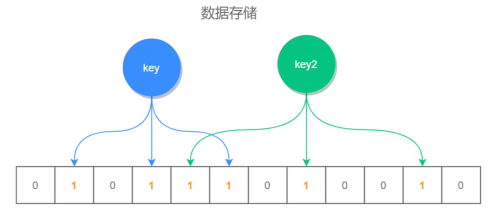
根据 key 值计算出它的存储位置，然后将此位置标识全部标识为 1(未存放数据的位置全部为 0)查询对应的位置是否全部为 1，如果全部为 1，则说明数据是可能存在的，否则一定不存在
也就是说，如果布隆过滤器说一个元素不在集合中，那么它一定不在这个集合中;但如果它说一个元素在集合中则有可能是不存在的(存在误差)查询时也是


**执行过程**
布隆过滤器的具体执行步骤如下
1. 在 Redis 中创建一个位数组，用于存储布隆过滤器的位向量，每个位置的值设置为 0。
2. 添加元素到布隆过滤器时，对元素进行多次哈希计算，并将对应的位数组位置设置为 1。
3. 查询元素是否存在时，对元素进行多次哈希计算，并检查对应的位数组位置是否都为1，都为1表示可能存在，其中有一个为 0则一定不存在。


**使用场景**
布隆过滤器的主要使用场景有以下几个:

 1. ==大数据量去重==:可以用布隆过滤器来进行数据去重，判断一个数据是否已经存在，避免重复插入。
 2. ==防止缓存穿透==:可以用布隆过滤器来过滤掉恶意请求或请求不存在的数据，避免对后端存储的频繁访问。
 3. ==网络爬虫 URL 去重==:可以用布隆过滤器来判断 URL 是否已经被爬取，避免重复爬取。
## 8. 如何实现布隆过滤器？ ★
实现布隆过滤器的方法有很多，例如我们可以使用以下方法实现布隆过滤器(适用于分布式系统)
1. 使用 Redis 实现布隆过滤器
2. 使用 Google Guava 实现布隆过滤器(适用于单机系统)
3. 使用 Hutool 框架实现布隆过滤器(适用于单机系统)

**① Redis 实现布隆过滤器**
在 Redis 中不能直接使用布隆过滤器，但我们可以通过 Redis 4.0 版本之后提供的 modules(扩展模块)的方式弓入，它的实现步骤如下。
1. 打包RedisBloom插件
git clone https://github.com/RedisLabsModules/redisbloom.gitcd redisbloom
make #编译redisbloom
编译正常执行完，会在根目录生成一个 redisbloom.so 文件,
2. 启用RedisBloom插件
重新启动 Redis 服务，并指定启动 RedisBloom 插件，具体命令如下:redis-server redis.conf --loadmodule ./src/modules/RedisBloom-master/redisbloom.so
3. 创建布隆过滤器
创建一个布隆过滤器，并设置期望插入的元素数量和误差率，在 Redis 客户端中输入以下命令
BFRESERVE my bloom filter 0.01 100000
4. 添加元素到布隆过滤器
在 Redis 客户端中输入以下命令
BF.ADD my bloom_ filter leige
5. 检查元素是否存在
在 Redis 客户端中输入以下命令
BF.EXISTS my bloom filter leige


② Guava 实现布隆过滤器
以下是使用 Guava 实现布隆过滤器的 Java 代码示例：

```java
import com.google.common.hash.BloomFilter;
import com.google.common.hash.Funnels;

public class BloomFilterExample {
    public static void main(String[] args) {
        // 创建一个布隆过滤器，预计存放1000个元素，期望误判率为0.01
        BloomFilter<String> bloomFilter = BloomFilter.create(
                Funnels.stringFunnel(),
                1000,
                0.01);

        // 向布隆过滤器中添加元素
        bloomFilter.put("apple");
        bloomFilter.put("banana");
        bloomFilter.put("orange");

        // 检查元素是否存在于布隆过滤器中
        System.out.println(bloomFilter.mightContain("apple"));   // true
        System.out.println(bloomFilter.mightContain("grape"));   // false
    }
}
```

在这个示例中，我们使用 Guava 的 `BloomFilter` 类来创建一个布隆过滤器，然后向布隆过滤器中添加一些元素，并检查某些元素是否存在于布隆过滤器中。你可以根据实际需求调整布隆过滤器的容量和误判率。

)Hutool 实现布隆过滤器

Hutool 是一个Java工具库，提供了丰富的工具类和方法，但是并没有直接提供布隆过滤器的实现。不过你可以使用其他第三方库来实现布隆过滤器，比如 Google 的 Guava 库或者 Apache 的 Commons Collections 库。以下是使用 Guava 实现布隆过滤器的示例代码：

```java
import com.google.common.hash.BloomFilter;
import com.google.common.hash.Funnels;

public class BloomFilterExample {
    public static void main(String[] args) {
        int expectedInsertions = 1000;
        double fpp = 0.01; // 期望的误判率

        BloomFilter<String> bloomFilter = BloomFilter.create(Funnels.stringFunnel(), expectedInsertions, fpp);

        // 添加元素
        bloomFilter.put("apple");
        bloomFilter.put("banana");
        bloomFilter.put("orange");

        // 判断元素是否存在
        System.out.println(bloomFilter.mightContain("apple")); // true
        System.out.println(bloomFilter.mightContain("grape")); // false
    }
}
```

在这个示例中，我们使用 Guava 的 BloomFilter 类来创建一个布隆过滤器，然后向其中添加元素并检查元素是否存在。你可以根据自己的需求调整期望的误判率和预期插入元素数量。希望这个示例能帮助到你。
## 9. Redis如何实现分布式锁？ ★

首先来说 Redis 作为一个独立的三方系统，其天生的优势就是可以作为一个分布式系统来使用，因此使用 Redis 实现的锁都是分布式锁，如下所示:
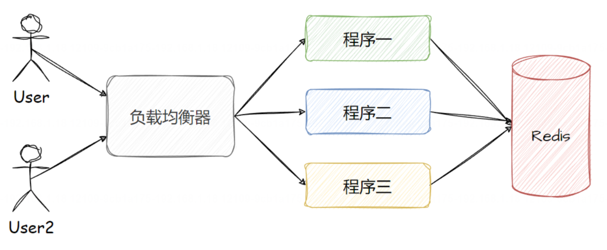
使用 Redis 实现分布式锁可以通过 setnx(set ifnot exists)命令实现，当我们使用 setnx 创建键值成功时，则表明加锁成功，否则既代码加锁失败，实现示例如下:

```
127.0.0.1:6379>setnx lock true
(integer)1 #创建锁成功
#谡辑业务处理..
```
当我们重复加锁时，只有第一次会加(分布式)锁成功，执行结果如下:

```
1 127.0.0.1:6379>setnx lock true # 第 次加锁
2 (integer)1
3 127.0.0.1:6379>setnx lock true #第 次加锁
4(integer)0
```
从上述命令中可以看出，我们可以使用执行的结果是否为1来判断加锁是否成功。
释放分布式锁

```
1 127.0.0.1:6379> del lock
2(integer)1 #释放锁
```

## 10. Redis实现分布式锁有什么问题？如何解决？ ★
默认情况下，如果使用 setnx lock true 实现分布式锁会存在以下问题:
1. **死锁问题**:setnx 如未设置过期时间，锁忘记删了或加锁线程宕机都会导致死锁，也就是分布式锁一直被占用的情况。
2. **锁误删问题**:setnx 设置了超时时间，但因为执行时间太长，所以程序没运行完，锁已经被自动释放了，但线2程不知道，因此在线程执行结束之后，会把其他线程的锁误删的问题。
3. **不可重入问题**:也就是说同一线程在已经获取了某个锁的情况下，如果再次请求获取该锁，则请求会失败(因为只有在第一次能加锁成功)。也就是说，一个线程不能对自己已持有的锁进行重复锁定。
4. **无法自动续期**:线程在持有锁期间，任务未能执行完成，锁可能会因为超时而自动释放。SETNX 无法自动根据任务的执行情况，设置新的超时实现，以延长锁的时间。


**① 解决死锁问题**
死锁问题可以通过设置超时时间来解决，如果超过了超时时间，分布锁会自动释放，这样就不会存在死锁问题了也就是 setnx 和 expire 配合使用，在 Redis 2.6.12 版本之后，新增了一个强大的功能，我们可以使用一个原子操作也就是一条命令来执行 setnx 和 expire 操作了，实现示例如下:

```
127.0.0.1:6379>set lock true ex 30 nx
0K #创建锁成功
127.0.0.1:6379>set lock true ex 30 nx
(nil)#在锁被占用的时候，企图获取锁失败
```

其中 ex 为设置超时时间， nx 为元素非空判断，用来判断是否能正常使用锁的。
**② 解决锁误删问题**
锁误删可以通过将锁标识存储到 Redis 中来解决，删除之前先判断锁归属(也就是将线程 id 存储到分布式的value 值内，删除之前先判断锁 value 值是否等于当前线程 id)，如果属于你的锁再删除，否则不删除就可以，这就解决了锁误删的问题。
但这样解决因为判断和删除是非原子操作，所以依旧有问题，这个问题可以通过编写lua 脚本或使用 Redisson 框架来解决，因为他们两都能保证判断和删除的原子性。
Lua 脚本指的是使用 Lua 语言编写的一段可执行的程序代码。Lua 是一种轻量级、高效、可嵌入的脚本语言，广泛应用于各种领域，包括游戏开发、嵌入式应用、脚本扩展等。 在 Redis 中，通过使用内置的 Lua 解释器，用户可以通过编写 Lua 脚本来执行一系列的操作。用户可以将一段 Lua 脚本传递给 Redis，并在 Redis 服务器端进行执行。Redis 提供了一系列的功能函数和 API 供 Lua 脚本使用，例如，命令操作、数据读写、事务处理等。
**③ 通用解决方案**
以上问题有一个通用的解决方案，那就是使用 Redisson 框架来实现 Redis 分布式锁，这样既可以解决死锁问题也可以解决锁误删、不可重入和无法自动续期的问题了。
## 11. 如何使用Redission实现分布式锁？ ★
Redisson 是一个开源的用于操作 Redis 的 Java 框架。与 Jedis 和 Lettuce 等轻量级的 Redis 框架不同，它提供了更高级旦功能丰富的 Redis 客户端。它提供了许多简化 Redis 操作的高级 API，并支持分布式对象、分布式锁、分布式集合等特性。
Redisson 官网地址:https://redisson.org/
源码地址:https://github.com/redisson/redisson
特性
1. Redisson 可以设置分布式锁的过期时间，**从而避免锁一直被占用而导致的死锁问题**。
2. Redisson 在为每个锁关联一个线程 ID 和重入次数(递增计数器)作为分布锁 value 的一部分存储在 Redis中,**这样就避免了锁误删和不可重入的问题**。
3. **Redisson 还提供了白动续期的功能**，通过定时任务(看门狗)定期延长锁的有效期，确保在业务未完成前，锁不会被其他线程获取。


**Redisson 实现分布锁**
① 添加 Redisson 框架支持
如果是 Spring Boot 项目，直接添加 Redisson 为 Spring Boot 写的如下依赖:

```xml
 <!--Redisson -->
<!-- https://mvnrepository.com/artifact/org.redisson/redisson-spring-boot-starter -->
 <dependency>
 <groupId>org.redisson</groupId>
<artifactId>redisson-spring-boot-starter</artifactId>
<version>3.25.2</version><!-请根据实际情况使用最新版本-->67 </dependency>
```

其他项目，访问 https://mvnrepository.com/search?q=Redisson 获取具体依赖配置,

**② 配置 Redissonclient 对象**
将 RedissonClient 重写，存放到 Io 容器，并且配置连接的 Redis 服务器信息。

```java
import org.redisson.Redisson;
import org.redisson.api.Redissonclient;
import org.redisson.config.config;
import org.springframework.context.annotation.Bean;
import org.springframework.context.annotation.configuration;@configuration
public class Redissonconfig{
@Bean
public Redissonclient redissonclient(){
	Config config = new config();
	// 也可以将 redis 配置信息保存到配置文件
	config.usesingleserver().setAddress("redis://127.0.0.1:6379");
	return Redisson.create(config);
	}
}
```
**③创建分布式锁**
Redisson 分布式锁的操作和 Java 中的 ReentrantLock(可重入锁)的操作很像，都是先使用 tryLock 尝试获取(非公平)锁，最后再通过 unlock 释放锁，具体实现如下:

```java
@RestController
public class LockController{
	@Autowired
	private Redissonclient redissonclient;
	@GetMapping("/lock")
	public String lockResource()throws InterruptedException {
		String lockKey ="myLock";
		// 获取 RLock 对象
		RLock lock =redissonclient.getLock(lockKey);
		// 芸试获取锁(尝试加锁)(锁超时时间是 30 秒)
        try {
        	boolean isLocked = lock.tryLock(30,TimeUnit.SECONDS);
			if(isLocked){
				// 成功获取到锁
				try {
					// 模拟业务处理
					TimeUnit.SECONDs.sleep(5);
					return"成功获取锁，并执行业务代码";
				}catch(InterruptedExceptione)
					e.printStackTrace();
				} finally{
					// 释放锁
					lock.unlock();
			} else {
				// 获取锁失败
				return"获取锁失败";
			} catch(InterruptedExceptione) {
				e.printStackTrace();
			}
			return“获取锁成功";
		}
	}
}
```

## 12. 说一下Redission看门狗的机制
Redisson 看门狗(Watchdog)机制是一种用于延长分布式锁的有效期的机制。它通过定时续租锁的方式，==防止持有锁的线程在执行操作时超过了锁的有效期而导致锁被自动释放。==

看门狗(Watchdog)的执行过程大致如下:
1. **获取锁并设置超时时间**:当客户端通过 Redisson 尝试获取一个分布式锁时，会使用 Redis 命令将锁存入Redis，并设置一个初始的有效时间(即超时时间)。
2. **启动看门狗线程**:如果开启了看门狗的功能(默认开启)，在成功获取锁后，Redisson 会在客户端内部启动一个后台守护线程，也就是所谓的“看门狗“定时任务定时去执行并续期。
3. **定时检查与续期**:看门狗按照预设的时间间隔(默认为锁有效时间的三分之一)周期性地检查锁是否仍然被当前客户端持有。如果客户端仍然持有锁，看门狗会调用 Redis 的相关命令或者 Lua 脚本来延长锁的有效期，确保在业务处理期间锁不会因超时而失效。
4. **循环监控和更新**:这个过程会一直持续到客户端显式地释放锁，或者由于其他原因(例如客户端崩溃、网络中。断等)导致无法继续执行看门狗任务为止，
5. **终止看门狗任务**:客户端在完成业务逻辑后，会主动调用解锁方法释放锁，此时 Redisson 不仅会解除对S.Redis 中对应键的锁定状态，还会同步停止看门狗的任务。

通过看门狗机制，即使在长时间运行的业务场景下，也能有效地避免由于锁超时而导致的数据不一致或其他并发控制问题，提高了系统的稳定性和可靠性。

**① 看门狗实现原理**
Redisson 看门狗的底层实现就是一个**定时任务**，它的看门狗默认的超时时间是 30s，不过超时时间可以使用Config.lockWatchdogTimeout 来进行设置。

看门狗每隔 lockWatchdogTimeout/3L 会执行一次检查和续期分布式锁，它的核心实现源码如下:

**② 看门狗停止续期**
Redisson 看门狗当遇到以下情况会停止自动续期:
1. **锁被主动释放(调用 unlock 方法)**:当持有锁的线程主动释放锁时，Redisson 的看门狗会停止续期。这是因为锁已经不再被持有，没有必要进行续租操作。
2. **线程意外终止**:在持有锁的线程意外终止时，Redisson 的看门狗会停止续期。这是为了避免已经不再活动的线程持有锁，并防止续租请求的无效执行。
3. **锁被其他线程抢占**:当其他线程成功获取到同一把锁时，Redisson 的看门狗会停止续期。这是因为锁的持有线程发生了变化，原先持有锁的线程失去了锁的所有权，不再需要进行续租操作。
4. **Redisson 客户端连接断开**:如果 Redisson 与 Redis 服务器端之间的连接断开，看门狗会停止续期。这是为了保证续租请求的可靠性，如果无法与 Redis 建立连接，就无法执行续期操作。

## 13. Redis 常用数据类型有哪些?
在 Redis 中，常用的数据类型有以下这些:
1. **String(字符串)**:常见使用场景是存储 Session 信息、存储缓存信息(如详情页的缓存)、存储整数信息可使用 incr 实现整数+1，和使用 decr 实现整数 -1。
2. **List(列表类型)**:常见使用场景是实现简单的消息队列、存储某项列表数据。
3. **Hash(哈希表)**:常见使用场景是存储 Session 信息、存储商品的购物车，购物车非常适合用哈希字典表示使用人员唯一编号作为字典的 key，value 值可以存储商品的 id 和数量等信息、存储详情页信息。
4. **Set(集合)**:一个无序并唯一的键值集合，它的常见使用场景是实现关注功能，比如关注我的人和我关注的“人，使用集合存储，可以保证人员不会重复。
5. **Sorted set(有序集合)**:相比于 Set 集合类型多了一个排序属性 score(分值)，它的常见使用场景是可以5.用来存储排名信息、关注列表功能，这样就可以根据关注实现排序展示了

PS:有序集合 Sorted Set 也被称为 ZSet，原因是有序列表的底层数据库实现是 ziplist 或 zskiplist，所以也被称之为 ZSet。

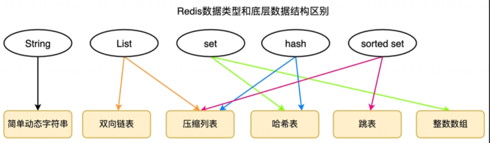

## 14. 有序集合在实际工作中的应用？
有序集合在工作中的应用场景有很多，例如以下这些常见的使用场景:
1. **排行榜**:可以将用户的得分作为有序集合的分值，用户的ID作为成员，通过有序集合的排名功能可以得到用户的排名信息。当然也可以是文章的热度、商品的热度等排行榜，如下所示:

```
zadd hot 100 aid 1 99 aid 2 95 aid 3 90 aid 4
```
2. **用户关注集合**:可以将用户的关注数作为有序集合的分值，用户 ID 作为成员，通过分值的排序可以得到关注数最多的用户。当然也可以把用户的关注时间戳作为分值，如下所示:

```
zadd user 1 friends 1704179221 zhangsan 1704179222 lisi
```

3. **商品价格排序**:可以将商品的价格作为有序集合的分值，商品 ID 作为成员，通过有序集合的排序功能可以得到价格从高到低的商品列表，
4. **时间轴(timeline)**:可以将事件的时间戳作为有序集合的分值，事件内容作为成员，通过有序集合的排序功能可以得到按时间顺序排列的事件内容。例如某某事件最新进展(每隔一段时间，例如 60s 更新一下时间轴事件)
## 15. 有序列表底层是如何实现的？

1.典型回答
有序列表在 Redis 7 之前底层是使用 ziplist(压缩列表)+ skiplist(跳跃表)，其中:
1. 当数据列表元素个数要小于 128 个，并且所有元素成员的长度都必须小于 64 字节时，会使用压缩列表来存储。
2. 否则，则使用跳跃表 skiplist 来存储。

但是，到了 Redis7 之后，就开始使用 listpack(紧凑列表)替代了 ziplist(压缩列表)来存储简单数据了。所以说:

- Redis7 之前(不含 Redis 7):有序列表使用的是 ziplist(压缩列表)+ skiplist(跳跃表)实现的。
- Redis 7 及之后:有序列表使用的是 listpack(紧凑列表)+ skiplist(跳跃表)实现的。

为什么使用 listpack 替代 ziplist?
因为 listpack 相比于 ziplist 在存储容量、读写性能、灵活性和大数据存储等方面有着明显的优势，具体优点如下:
1. **节省存储空间**:listpack 使用更高效的编码格式，可以达到更高的压缩比，节省存储空间。这对于保存大量的列表数据非常有益。
2. **更适合读写混合场景**:listpack 具有更好的读写性能，特别适合对列表进行频繁的读写操作。相比之下，ziplist在写入和更新操作时，可能需要移动和重新分配连续的内存空间。
3. **支持更多的数据类型**:listpack 支持更多的数据类型，可以存储非 ASCII 字符、二进制数据和自定义对象，增加了数据的灵活性。
4. **支持更大的元素**:listpack 文持更大的列表元素，使用 64 位整数长度来表示元素，相比 ziplist 的 32 位整数长度有了扩展。
## 16. 什么是跳跃表？
跳跃表 SkipList，也称之为跳表，是一种数据结构，用于在有序元素的集合中进行高效的查找操作。**它通过添加多层链表的方式**，**提供了一种以空间换时间的方式来加速查找**。跳跃表由一个带有多层节点的链表组成，每一层都是原始链表的一个子集。最底层是一个完整的有序链表，包含所有元素。每个更高层级都是下层级的子集，通过添加额外的指针来跳过一些元素。这些额外的指针称为“跳跃指针”，它们允许快速访问更远的节点，从而减少了查找所需的比较次数。跳跃表的平均査找时间复杂度为 O(log n)，其中 n是元素的数量。这使得它比普通的有序链表具有更快的查找性能，并且与平衡二又搜索树(如红黑树)相比，实现起来更为简单，跳跃表的简单示例如下图所示:

## 17. 说一下跳表的查询流程?
跳表的查询流程如下:
1. **起始搜索**:查询操作从跳表的顶层开始，跳表的顶层包含一个或多个节点，从最顶层的头节点开始，将当前节点设为头节点。
2. **检查下一个节点**:检查当前节点的下一个节点，如果节点的分值小于目标分值，则右移检查下一个节点，然后重复此步骤，直到找到一个大于目标分值的节点，或为最后一个节点。
3. **逐层下探**:如果当前下一个节点的值大于目标分值，或为最后一个节点，则将当前指针向下一层级进行搜索重复上述步骤。
4. **终止并返回**:在查找的过程中，如果找到了和日标分值相同的值，或者遍历完所有层级仍然未找到对应节点则说明要查找的元素不存在于跳表中，则终止查找并返回查询到的内容或 NULL 值。

## 18. 说一下跳表的添加流程？
要搞懂跳跃表的添加流程，首先要搞懂下面的前置知识。
前置知识:**节点随机层数**
>**所谓的随机层数指的是每次添加节点之前，会先生成当前节点的随机层数，根据生成的随机层数来决定将当前节点存在几层链表中。**
>为什么要这样设计呢?
>这样设计的目的是为了保证 Redis 的执行效率，如果使用固定规律的跳表，为了维护固定的规律，所以在添加和删除节点时，跳表的整体变动非常大，效率也非常低。而使用随机层数，在添加和删除时，其他节点无需改动，因此效率要比固定规律的跳表性能高很多，所以 Redis 采用了节点随机层数。


1. 第一个元素添加到最底层的有序链表中(最底层存储了所有元素数据)
2. 第二个元素生成的随机层数是 2，所以再增加 1层，并将此元素存储在第 1 层和最低层。
3. 第三个元素生成的随机层数是 4，所以再增加 2层，整个跳跃表变成了 4层，将此元素保存到所有层中。
4. 第四个元素生成的随机层数是 1，所以把它按顺序保存到最后一层中即可。

其他新增节点以此类推。
## 19. Redis如何保证数据不丢失？
Redis 保证数据不丢失的手段主要有以下两个:
1. **持久化**:持久化是指将内存中的数据保存到硬盘上，以防止在服务器重启、宕机等意外情况下导致数据丢失。由于 Redis 是一个基于内存的数据库系统，默认情况下所有的数据都存储在内存中，这意味着一旦服务进程终止或硬件故障，内存中的所有数据都将消失。而 Redis 提供了3种持久化的手段，以保证 Redis 可以将内存中的数据保存到磁盘上，这样无论是服务器重启，还是宕机、掉电等问题，Redis 的数据都不会丢失。
2. **多机部署**:多机部署是指在多个独立的服务器或虚拟机上部署和运行 Redis 服务实例，以实现数据冗余、高可用性、可扩展性和负载均衡等日标。Redis 多机运行部署的实现总共有三种:主从模式、哨兵模式和集群模式。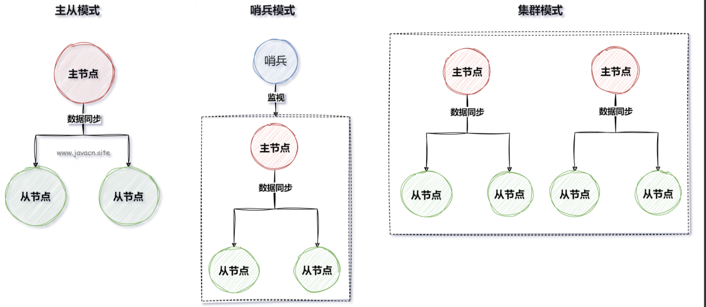

## 20. Redis有几种持久化方式？有什么区别？
Redis 4.0 之后支持以下 3 种持久化方案:
1. RDB(Redis DataBase)持久化:快照方式持久化，将某一个时刻的内存数据，以二进制的方式写入磁盘,
2. AOF(Append Only File)持久化:文件追加持久化，记录所有非查询操作命令，并以文本的形式追加到文件中。
3. 混合持久化:RDB + AOF 混合方式的持久化，Redis 4.0 之后新增的方式，混合持久化是结合了 RDB 和 AOF的优点，**在写入的时候，先把当前的数据以 RDB 的形式写入文件的开头，再将后续的操作命令以 AOF 的格式存入文件，这样既能保证 Redis 重启时的速度，又能减低数据丢失的风险。**

① RDB 持久化
RDB(Redis Database)是将某一个时刻的内存快照(Snapshot)，以二进制的方式写入磁盘的持久化机制。
RDB 持久化机制有以下优缺点:
**优点分析**
1. **速度快**:相对于 AOF 持久化方式，RDB 持久化速度更快，因为它只需要在指定的时间间隔内将数据从内存中写入到磁盘上。
2. **空间占用小**:RDB 持久化会将数据保存在一个压缩的二进制文件中，因此相对于 AOF 持久化方式，它占用的磁盘空间更小。
3. **恢复速度快**:因为 RDB 文件是一个完整的数据库快照，所以在 Redis 重启后，可以非常快速地将教据恢复到内存中。

**缺点分析**

1. **数据可能会丢失**:RDB 持久化方式只能保证数据在指定时间间隔内写入磁盘，因此如果 Redis 进程崩溃或者服务器断电，从最后一次快照保存到崩溃的时间点之间的数据可能会丢失
2. **实时性差**:因为 RDB 持久化是定期执行的，因此从最后一次快照保存到当前时间点之间的数据可能会丢失。如果需要更高的实时性，可以使用 AOF 持久化方式。

所以，RDB 持久化方式适合用于对数据可靠性要求较高，但对实时性要求不高的场景，如 Redis 中的备份和数据恢复等。

**② AOF 持久化**
AOF(Append Only File)它是将 Redis 每个非查询操作命令都追加记录到文件(appendonly.aof)中的持久化机制。
AOF 持久化机制有以下优缺点:
**优点分析**
1. **数据不容易丢失**:AOF 持久化方式会将 Redis 执行的每一个写命令记录到一个文件中，因此即使 Redis 进程崩溃或者服务器断电，也可以通过重放 AOF 文件中的命令来恢复数据。
2. **实时性好**:由于 AOF 持久化方式是将每一个写命令记录到文件中，因此它的实时性比 RDB 持久化方式更好。
3. **数据可读性强**:AOF 持久化文件是一个纯文本文件，可以被人类读取和理解，因此可以方便地进行数据备份和恢复操作。
4. **可靠性高**:AOF 持久化方式可以保证数据的可靠性，因为数据会在指定时间间隔内自动写入磁盘，即使 Redis进程崩溃或者服务器断电，也可以通过加载最近的一次快照文件恢复数据。


**缺点分析**

1. **写入性能略低**:由于 AOF 持久化方式需要将每一个写命令记录到文件中，因此相对于 RDB 持久化方式，它的写入性能略低。
2. **占用磁盘空间大**:由于 AOF 持久化方式需要记录每一个写命令，因此相对于 RDB 持久化方式，它占用的磁盘空间更大。
3. **AOF 文件可能会出现损坏**:由于 AOF 文件是不断地追加写入的，因此如果文件损坏，可能会导致数据无法恢复。

所以，AOF 持久化方式适合用于对数据实时性要求较高，但对数据大小和写入性能要求相对较低的场景，如需要对数据进行实时备份的应用场景。
## 21. AOF持久化策略有哪些？

AOF 的持久化策略有以下 3 种:
1. always:每条 Redis 操作命令都会写入磁盘，最多丢失一条数据。
2. everysec:每秒钟写入一次磁盘，最多丢失一秒的数据(默认持久化策略)。
3. no:不设置写入磁盘的规则，根据当前操作系统来决定何时写入磁盘，Linux 默认 30s 写入一次数据至磁盘

持久化策略实在 Redis 的配置文件 redis.conf 中配置的，通过“appendfsync"选项来配置，如下图所示: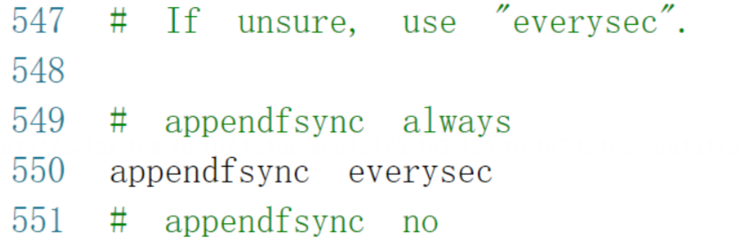


## 22. Redis过期数据会被立刻删除吗？惰性删除和定期删除有哪些优缺点?
1. **惰性删除**(Lazy Expire):Redis 不会主动地、周期性地检査和删除所有过期的键。惰性删除是指在 Redis 访问某个键值时，才会检查该键是否已经过期，如果已过期，则返回 NULL，并同时删除它。
2. **定期删除**(Periodic Expire):每隔一段时间检査一次数据库，随机删除一些过期键。定期删除在redis.conf 配置文件中配置，如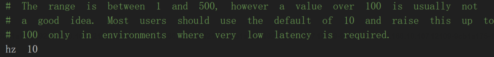

3. **内存淘汰策略**(如 volatile-lru、alkeys-lru 等)，Redis 也会根据所选策略检査并删除一部分过期或最近最少使用的键。

这样设计的原因在于直接遍历所有键查找过期键将对性能产生较大影响，尤其是当数据量非常大时。**因此，Redis采用惰性删除和定期删除相结合的方式，在保证高效的同时尽可能减少内存中过期键的数量。**

**惰性删除和定期删除有哪些优缺点?**

1. 惰性删除:
   - 优点:每次访问时，才会判断过期键，所以此策略只会使用很少的系统资源。
   - 缺点:系统占用空间删除不及时，导致空间利用率降低，造成了一定的空间浪费
2. 定期删除:
   - 优点:通过限制删除操作的时长和频率，来减少删除操作对 Redis 主业务的影响，同时也能删除一部分过期的数据减少了过期键对空间的无效占用
   - 缺点:相比于惰性删除会使用更多的系统资源。

## 23. 说一下定期删除的执行流程
Redis 定期删除流程是这样的:
1. 从过期字典中随机取出 20 个键。
2. 删除这 20 个键中过期的键,
3. 如果过期键的比例超过 25% ，重复步骤 1

>同时为了保证过期扫描不会出现循环过度，导致线程卡死现象，算法还增加了扫描时间的上限，默认不会超过25ms。

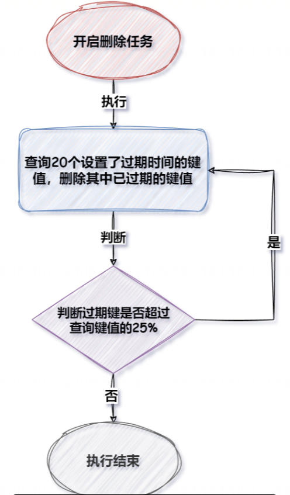

## 24. 什么情况下Redis内存会被用完？被用完会怎么样？
什么情况 Redis 内存会被用完?
Redis 的配置文件 redis.conf 中有一个"maxmemory"的选项设置，如果给它设置了值，例如以下这样:

```
// 设置 Redis 最大占用内存大小为 100M
maxmemory 100mb
```

则 Redis 的运行内存超过 100mb 就会触发内存淘汰策略，可以使用"config get maxmemory“来查看 Redis 最大内存的设置，如下命令所示:

```
127.0.0.1:6379> config get maxmemory
1)"maxmemory
2)"。"
```

maxmemory 默认是不设置的，也就是此值默认为 0，当它为0 时，在 32 位系统下，它的隐藏最大允许内存为3GB，这点官方文档中有说明:https://redis.io/docs/reference/eviction/


**如何设置 maxmemory?**
Redis 的 maxmemory 参数有以下两种设置方式:
Redis 配置文件中设置:打开 redis.conf 配置文件，找到并编辑 maxmemory 参数。将其设置为所需的内存限制。例如，如果要将 maxmemory 设置为 1GB，可以使用以下配置:

```
maxmemory 1gb
```

设置完配置之后，需要重启 Redis 才能生效。此修复方式，无论重启多少次 Redis 此规则都是有效的在 Redis 命令行界面中设置:连接到 Redis 服务器的命令行界面，然后使用 CONFIG SET 命令来设置2maxmemory 参数。例如，要将 maxmemory 设置为 1GB，可以执行以下命令:

```
CONFIG SET maxmemory 1gb1
```

上述设置之后，不用重启 Redis 就会立即生效，但重启 Redis 之后此配置则会丢失Redis 支持的单位有:"b"(字节)"k"(千字节)、"mb"(兆字节)和"gb"(千兆字节)

**操作系统物理内存被用完会怎样?**
当 Redis 使用的内存接近系统内存极限时，可能会触发操作系统的 O0M Killer(Out Of Memory Kiler)，这会导致操作系统选择杀死某些进程以回收内存，**其中包括可能被杀掉的 Redis 进程，从而可能导致数据丢失和服务不稳定**。因此，为了确保 Redis 的稳定性和可预测性行为，建议始终设置一个合理的 maxmemory 值，通常maxmemory 值建议设置为物理内存的一半。
**Redis 内存被用完会怎样?**
当 Redis 服务器的内存被用完时，会触发内存淘汰策略。默认的内存淘汰策略是 noeviction，也就是不淘汰任何数据，当内存不足时，新增操作会报错，但查询操作不受影响。
## 25. Redis内存淘汰策略有哪些？
早期版本的 Redis(Redis 4 之前)有以下6种淘汰机制(也叫做内存淘汰策略):
1. noeviction:不淘汰任何数据，当内存不足时，新增操作会报错，查询操作不受影响，Redis 默认内存淘汰策略。
2. allkeys-lru:淘汰整个键值中最久未使用的键值。
3. volatile-lru:淘汰所有设置了过期时间的键值中最久未使用的键值。
4. allkeys-random:随机淘汰任意键值。
5. volatile-random:随机淘汰设置了过期时间的任意键值。
6. volatile-ttl:优先淘汰更早过期的键值。

在 Redis 4.0 版本中又新增了 2 种淘汰机制:

1. volatile-lfu:淘汰所有设置了过期时间的键值中，最少使用的键值。
2. allkeys-lfu:淘汰整个键值中最少使用的键值,
其中 alkeys-xxx 表示从所有的键值中淘汰数据，而 volatile-xxx 表示从设置了过期键的键值中淘汰数据。

所以，现在 Redis 的版本中有这 8 种内存淘汰策略。
Redis 内存淘汰策略设置:
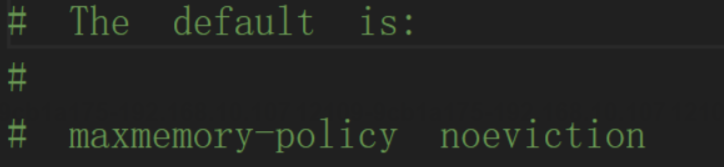

## 26. 淘汰策略LRU和LFU有什么区别?
LRU(Least Recently Used，最近最少使用)和 LFU(Least Frequently Used，最不常使用)都是常见的缓存淘汰策略，它们在选择淘汰缓存中的键时有不同的侧重点。
- LRU(最近最少使用):LRU 策略基于时间的概念，它认为最近被访问过的键是最有可能被再次访问的，因此在淘汰时会优先选择最久未被访问的键。**LRU 策略会维护一个访问顺序列表，每当一个键被访问时，它会被移动到列表的末尾，最近没有被访问的键会位于列表的前面**。当需要淘汰键时，LRU 策略会选择列表前面的键进行淘汰。
- LFU(最不常使用):LFU 策略基于访问频率的概念，它认为被访问次数最少的键是最不常用的，因此在淘汰时会优先选择访问次数最少的键。**LFU 策略会为每个键维护一个访问计数器，每当一个键被访问时，其计数器会增加。当需要淘汰键时，LFU 策略会选择访问计数最低的键进行汰**。

它们的主要区别有以下几点:
1. LRU 是基于时间的策略，LFU 是基于访问频率的策略,
2. LRU 策略假设最近被访问的键最有可能再次被访问，LFU 策略假设被访问次数最少的键是最不常用的。
3. LRU 维护一个访问顺序列表，LFU 维护一个访问计数器
4. LRU 只关注键的访问顺序，而 LFU 关注键的访问频率。

## 27. 如何保证缓存和MySQL双写一致?

延迟双删+消息队列

所谓的双写一致是指，在同时使用缓存(如 Redis)和数据库(如 MySQL)的场景下，确保数据在缓存与数据库中的更新操作保持同步。当对数据进行修改时，无论是先修改缓存还是先修改数据库，最终都要保证两者的数据状态致，不会出现数据不一致的情况。
保证缓存和数据库一致性的常见解决方案有以下 4 种 :
1. 先修改数据库，后更新缓存。
2. 先更新缓存，后修改数据库。
3. 先修改数据库，后删除缓存。
4. 先删除缓存，后修改数据库。

然而，前3种解决方案，有同一个问题，也就是当第一步操作执行完之后，第二步未执行的情况下，就会导致数据库和缓存的一致性问题，例如第一步执行完之后，系统掉电了，那么一致性问题就会一直存在。相比之下，第 4种解决方案(先甽除缓存，后修改数据库)相比于前三种解决方案更有优势，起码它保证了双方都未执行成功，那么从数据一致性层面来讲，第4种方案起码保证了一定的数据一致性，然而第4种执行方案依然存在其他问题，例如以下这两个:
1. 业务完整性问题:程序只执行了一半，第一步执行完了但第二步未执行的情况。
2. 并发保存旧值的问题:在并发环境下，第四种方案可能会导致缓存保存旧值的情况，例如以下执行情况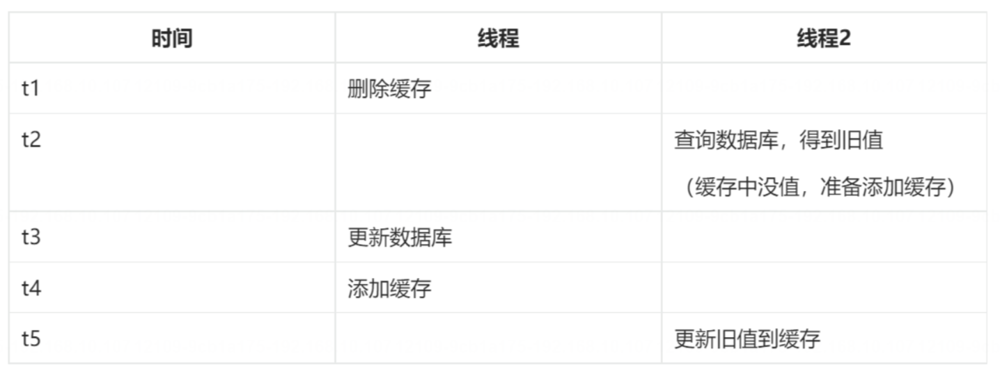
最终解决方案
所以，想要最大程度的双写一致性问题的最终解决方案是:消息队列 +延迟双删策略

**为什么要使用消息队列?**
==因为消息队列里面有消息确认机制，它可以保证我们执行完第一步之后，即时掉电重启的情况，依然可以执行后续的流程==，因为之前的消息，未进行消息确认，所以程序重启之后，会继续执行后续的流程，这样就保证了业务执行的完整性。
**什么是延迟双删?**
延迟双删指的是删除两次缓存(并且最后一次是延迟删除)，具体执行流程如下:
1. **删除缓存**:此步骤的目的是为了避免获取到旧日缓存中的旧数据。
2. **更新数据库**:删除之后就可以先更新数据库了

延迟一会再删除缓存:此步骤是为了避免上面因为并发问题导致保存旧值的情况发生，所以会延迟一段时间之后再进行删除操作。这样即使有并发问题，也能最大限度的解决保存旧值的情况，因为是延迟之后删除的，所以即使因为并发问题保存了旧值，但延迟一段时间之后旧值就会被删除，那么这样就自然而然的保证了数据库和缓存的最终一致性。

## 28. 说一下Redis多机部署？
Redis 多机部署主要有以下 3 种方式:
1. **主从同步**:主从同步(主从复制)是 Redis 高可用服务的基石，也是多机运行中最基础的一个，我们把主要存储数据的节点叫做主节点(master)，把其他通过复制主节点数据的副本节点叫做从节点(slave)。在 Redis 中一个主节点可以拥有多个从节点，一个从节点也可以是其他服务器的主节点。
2. **哨兵模式**:哨兵模式 Redis Sentinel是 Redis 的一种运行模式，它专注于对 Redis 实例(主节点、从节点)运行状态的监控，并能够在主节点发生故障时通过一系列的机制实现选主及主从切换，实现故障转移，确保整个Redis 系统的可用性。
3. **集群模式**:集群模式 Redis Cluster 是 Redis 3.0 版本推出的 Redis 集群方案，它将数据分布在不同的服务区上，以此来降低系统对单主节点的依赖，并且可以大大的提高 Redis 服务的读写性能。
## 29. 主从模式、哨兵模式和集群模式有什么区别?
主从同步是多机部署最简单的方案，也是存在问题最多的一个方案，它的优点是实现成本低，而这种模式本身存在一个致命的问题，当主节点崩溃之后，需要人工干预才能恢复 Redis 的正常使用。

例如，我们有3台服务器做了主从复制，一个主服务器 A和两个从服务器 B、C，当 A发生故障之后，需要人工把 B服务器设置为主服务器，同时再去 C服务器设置成从服务器并且从主服务器 B同步数据，如果是发生在晚上或者从服务器节点很多的情况下，对于人工来说想要立即实现恢复的难度很多，所以我们需要一个自动的工具一Redis Sentinel(哨兵模式)来把手动的过程变成自动的，让 Redis 拥有自动容灾恢复 (failover) 的能力。

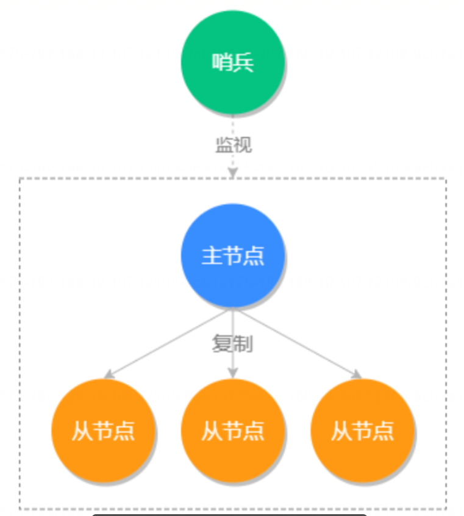
哨兵模式专注于对 Redis 实例(主节点、从节点)运行状态的监控，并能够在主节点发生故障时通过一系列的机制实现选主及主从切换，实现故障自动转移和恢复，确保整个 Redis 系统的可用性，所以哨兵模式相比于主从同步多个一个自动容灾恢复的优点。
无论是主从还是哨兵模式，它的性能扩展都是有限的，因为主节点只能有一个，==而集群模式可以实现多个集群、多主节点的平行扩展，如下图所示:==

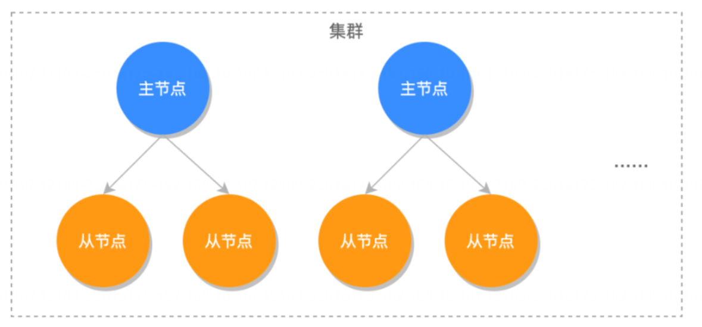
并且集群模式也具备自动容灾恢复、自主选主的功能，所以集群模式才是 Redis 多机部署的最终形态,

# 补充：
## 1. 什么是缓存预热?如何实现缓存预热?
缓存预热指的是在系统启动、高峰期来临之前或数据变更之后，提前将热门或需要经常访问的数据加载到缓存中以提高系统的响应性能和缓存命中率。通过缓存预热，可以避免在实际请求到来时出现缓存击穿或缓存雪崩的情况，减少对后端存储的直接访问。
实现步骤
实现缓存预热的一般步骤如下:
1. **确定热门数据**:首先需要确定哪些数据是热门或需要经常访问的数据。可以通过系统日志、业务需求、数据统计分析等方式进行判断和评估。
2. **加载数据到缓存**:在系统启动、高峰期来临之前或数据变更之后，提前将热门数据加载到缓存中。可以通过定2时任务、异步加载、批量加载等方式来实现数据加载。
3. **设置适当的过期时间**:根据业务需求和数据的访问频率，设置适当的缓存过期时间。过期时间可以根据不同的数据进行灵活调整，以保证缓存数据的有效性。
4. **监控和维护**:在缓存预热完成后，需要进行监控和维护，可以通过监控缓存命中率、缓存失效率等指标来评估缓存的效果，及时进行调优和维护。


在Redis中进行缓存预热可以通过以下几种方式实现：

1. **手动初始化**:在应用程序启动阶段或者服务初始化的时候，通过编写代码主动地从数据库加载热点数据，并将其放入缓存(如 Redis)。
2. **定时任务**:使用定时任务定期刷新或加载数据到缓存，可以是固定时间间隔，也可以是在数据变更后触发。
3. **事件驱动**:当有新的数据添加到数据库时，触发一个事件来通知缓存系统加载新数据。
4. **使用框架**:某些框架或中间件提供了缓存预热功能的支持。例如，在 Spring Boot 项目中，可以通过实现CommandLineRunner 或 ApplicationRunner 接口，在应用启动后自动加载数据到缓存。
## 2. Redis如何实现消息队列?
Redis 实现消息队列的常见方式有以下 3 种:
1. 使用 List 方式来实现消息队列，主要使用的是 |push/rpop 来实现消息的先进先出。
2. Redis 自身提供的发布订阅模式，也就是使用 Publisher(发布者)和 Subscriber(订阅者)来实现消息队列。
3. 使用 Redis 5.0 版本中提供的 Stream 来实现消息队列，它主要使用的是 xadd/xread 来实现消息的读取和存诸。


**① List 实现消息队列**
List 方式是实现消息队列最简单和最直接的方式，它主要是通过 lpush 和 rpop 存入和读取实现消息队列的，如下图所示:

List 使用命令的方式实现消息队列:

```
127.0.0.1:6379>1push mg"hello"# 推送消息 hello
(integer)1
 127.0.0.1:6379>lpush mq“msg”# 推送消息 msg
(integer)2
 127.0.0.1:6379>rpop mg #接收到消息 hello
 "hello"
 127.0.0.1:6379>rpop mq #接收到消息 msg
 "mg"
```
其中，key 名称“mq"就相当于频道名(channel)，而 lpush 用于生产(新增)消息，rpop 获取消息,

**优缺点分析**
List 方式优点:
1. **消息可以被持久化**:借助 Redis 本身的持久化(AOF、RDB 或者是混合持久化)，可以有效的保存数据。
2. **消费者可以积压消息**，不会因为客户端的消息过多而被强行断开。

List 方式缺点:

1. **消息不能被重复消费一个消息消费完就会被删除，**
2. **没有主题订阅的功能。**

**② Pub/sub 发布订阅模式**
在 Redis 中提供了专门的类型:Publisher(发布者)和 Subscriber(订阅者)来实现消息队列。消息队列有两个重要的角色，一个是发送者，另一个就是订阅者，对应的操作命令如下:
- 发布消息:publish channel"message'
- 订阅消息:subscribe channel.

优缺点分析
发布订阅模式优点:它提供了普通消息订阅模式和主题订阅模式。发布订阅模式缺点:
1. 无法持久化保存消息，如果 Redis 服务器宕机或重启，那么所有的消息将会丢失。
2. 发布订阅模式是“发后既忘”的工作模式，如果有订阅者离线重连之后不能消费之前的历史消息

**③ Stream 消息队列**
在 Redis 5.0 推出了 Stream 类型也是此版本最重要的功能，它可以较为完美的实现消息队列，它借鉴了 Kafka 的设计思路，它支持消息的持久化和消息轨迹的消费，支持 ack 确认消息的模式，让消息队列更加的稳定和可靠,Stream 既然是一个数据类型，那么和其他数据类型相似，它也有一些自己的操作方法，例如:
xadd:添加消息。
xlen:查询消息长度。
·xdel:根据消息 ID 删除消息,
del:删除整个 Stream。
xrange:读取区间消息，
xread:读取某个消息之后的消息
xack:将消息标记为"已处理"。

**优缺点分析Stream 实现优点:**
1. 支持消息持久化。
2. 支持消息消费确认。

**Stream 实现缺点:**

1. 实现代码比较繁琐。
2. 没有提供主题订阅的功能。
## 3. Redis如何实现延迟任务?
Redis 实现延迟任务的思路有以下几个:
1. **使用过期键的事件通知执行延时任务**:开启过期键通知，当 Redis 中键值过期时触发时间，在事件中实现延迟代码，但因为 Redis 的 Key 过期时不会被及时删除，所以这个过期事件也不保证可以立即触发，所以此方式很少用来实现延迟任务(因为极其不稳定)
2. **使用 ZSet 执行延时任务**:在 ZSet 中插入延迟执行时间和任务 ID，如下命令所示:
>  ```
>  1 ZADD delay tasks <timestamp><task id>
>  ```
>  然后，启动一个后台线程或者定时任务，定期通过 ZRANGEBYSCORE 命令从有序集合中获取已到达执行时间的任务，即分数小于或等于当前时间的任务，进行执行即可实现延时任务。
3. **使用 Redisson 执行延迟任务**:在 Redisson 框架中，提供了一个 RDelayedQueue 用于实现延迟队列，使用简单方便，推荐使用。

## 4. 什么是RedLock?聊聊实现原理和存在的问题?
RedLock 是 Redis 分布式锁的一种实现方案，由 Redis 的作者 Salvatore Sanfilippo 提出。==RedLock 算法旨在解决单个 Redis 实例作为分布式锁时可能出现的单点故障问题==，通过在多个独立运行的 Redis 实例上同时获取锁的方式来提高锁服务的可用性和安全性。

RedLock 是对集群的每个节点进行加锁，如果大多数节点(N/2+1)加锁成功，则才会认为加锁成功。
这样即使集群中有某个节点挂掉了，因为大部分集群节点都加锁成功了，所以分布式锁还是可以继续使用的。

## 5. 如何对Redis使用进行调优?
1. **缩短键值对的存储长度**:在 key 不变的情况下，value 值越大操作效率越慢，因为 Redis 对于同一种数据类型会使用不同的内部编码进行存储，比如字符串的内部编码就有三种:int(整数编码)、raw(优化内存分配的字符串编码)、embstr(动态字符串编码)，这是因为 Redis 的作者是想通过不同编码实现效率和空间的平衡，然而数据量越大使用的内部编码就越复杂，而越是复杂的内部编码存储的性能就越低。
2. **使用异步延迟删除**(lazy free):lazy free 特性是 Redis 4.0 新增的一个非常实用的功能，它可以理解为惰性删除或延迟删除。意思是在删除的时候提供异步延时释放键值的功能，把键值释放操作放在 BIO(BackgroundI/0)单独的子线程处理中，以减少删除对 Redis 主线程的阻塞，可以有效地避免删除 big key 时带来的性能和可用性问题。
3. **设置合理的过期时间**:我们应该根据实际的业务情况，对键值设置合理的过期时间，这样 Redis 会帮你自动清除过期的键值对，以节约对内存的占用，以避免键值过多的堆积，频繁的触发内存淘汰策略。
4. **禁用长耗时的查询命令**:生产环境禁止使用 keys 命令、避免一次查询所有的成员，要使用 scan 命令进行分批的，游标式的遍历、通过机制严格控制 Hash、Set、Sorted Set 等结构的数据大小、将排序、并集、交集等撰作放在客户端执行，以减少 Redis 服务器运行压力。
5. **使用 slowlog 优化耗时命令**:使用 slowlog 功能找出最耗时的 Redis 命令进行相关的优化，以提升 Redis 的运行速度。
6. 使用 Pipeline 批量操作数据:Pipeline(管道技术)是客户端提供的一种批处理技术，用于一次处理多个Redis 命令，从而提高整个交互的性能。
7. **避免大量数据同时失效**:如果在大型系统中有大量缓存在同一时间同时过期，那么会导致 Redis 循环多次持续扫描删除过期字典，直到过期字典中过期键值被删除的比较稀疏为止，而在整个执行过程会导致 Redis 的读写出现明显的卡顿，卡顿的另一种原因是内存管理器需要频繁回收内存页，因此也会消耗一定的 CPU。
8. **优化客户端使用**:在客户端的使用上我们除了要尽量使用 Pipeline 的技术外，还需要注意要尽量使用 Redis 连接池，而不是频繁创建销毁 Redis 连接，这样就可以减少网络传输次数和减少了非必要调用指令。
9. **限制 Redis 内存大小**:在 64 位操作系统中 Redis 的内存大小是没有限制的，这样就会导致在物理内存不足9.时，使用 swap 空间既交换空间，而当操心系统将 Redis 所用的内存分页移至 swap 空间时，将会阻塞 Redis进程，导致 Redis 出现延迟，从而影响 Redis 的整体性能。因此我们需要限制 Redis 的内存大小为一个固定的值，来限制 Redis 的内存大小。
10. **使用物理机而非虚拟机安装 Redis 服务**:在虚拟机中运行 Redis 服务器，因为和物理机共享一个物理网口并且一台物理机可能有多个虚拟机在运行，因此在内存占用上和网络延迟方面都会有很糟糕的表现。
11. **合理使用持久化的策略**:对于不重要的数据，我们可以关闭持久化功能，以提升 Redis 的性能。
12. **使用集群模式增加读写吞吐量**:Redis 集群是通过将数据库分散存储到多个节点，以提升 Redis 的整体吞吐量的。

## 6. 如何搭建Redis集群?
搭建Redis集群涉及到多个步骤，包括安装Redis、配置Redis实例以及创建和管理集群。以下是一个详细的步骤指南，用于在Linux环境下搭建一个基本的Redis集群。

前提条件

- Linux服务器/虚拟机至少3个（集群至少需要3个主节点）
- 确保服务器之间网络互通
- 确保至少有3个端口开放，用于Redis实例（默认是6379，但是集群需要多个端口）

步骤1：安装Redis

在每个服务器上安装Redis。这里以Ubuntu为例：

```sh
sudo apt-get update
sudo apt-get install redis-server
```

步骤2：配置Redis实例

在每个服务器上，你需要配置Redis以使其可以作为集群节点运行。编辑Redis配置文件`redis.conf`（通常位于`/etc/redis/`或者`/etc/redis-server/`）。

```sh
sudo nano /etc/redis/redis.conf
```

对于集群的每个实例，你需要确保以下配置：

```sh
cluster-enabled yes
cluster-config-file nodes.conf
cluster-node-timeout 5000
appendonly yes
```

确保每个实例监听不同的端口（如果它们在同一台机器上）：

```sh
port 6379
```

步骤3：启动Redis实例

在每个服务器上启动或重启Redis服务：

```sh
sudo service redis-server restart
```

步骤4：创建Redis集群

使用Redis自带的`redis-cli`工具创建集群。你需要指定所有参与集群的Redis实例的IP地址和端口。例如，如果你有三个节点，可以使用以下命令：

```sh
redis-cli --cluster create 192.168.1.1:6379 192.168.1.2:6379 192.168.1.3:6379 --cluster-replicas 1
```

这个命令会创建一个有三个主节点和三个副本（每个主节点一个副本）的集群。

步骤5：检查集群状态

创建集群后，你可以检查集群的状态：

```sh
redis-cli -c -h 192.168.1.1 -p 6379 cluster nodes
```

这将列出集群的所有节点及其状态。

步骤6：测试集群

现在你可以测试集群的功能，例如，通过在一个节点上设置一个键值对，然后尝试从另一个节点读取它。

```sh
redis-cli -c -h 192.168.1.1 -p 6379 set key1 value1
redis-cli -c -h 192.168.1.2 -p 6379 get key1
```

如果一切设置正确，你应该能够在不同的节点上读取相同的键值对。

注意事项

- 确保防火墙和安全组设置允许节点之间的通信。
- 对于生产环境，你需要考虑使用更复杂的配置，包括但不限于持久化策略、安全设置（如密码保护）、备份和监控。
- 本指南假设你使用的是默认的Redis端口和配置文件路径，实际情况可能需要根据你的环境进行调整。

这是一个基本的Redis集群搭建指南。在实际部署时，你可能还需要考虑数据持久化、备份、监控、故障转移策略等高级特性和最佳实践。
## 7. 说说Redis脑裂问题?

Redis 脑裂问题是指，在 Redis 哨兵模式或集群模式中，由于网络原因，导致主节点(Master)与哨兵(Sentinel)和从节点(Slave)的通讯中断，此时哨兵就会误以为主节点已宕机，就会在从节点中选举出一个新的主节点，此时 Redis 的集群中就出现了两个主节点的问题，就是 Redis 脑裂问题。

**如何解决脑裂问题?**
脑裂问题只需要在旧 Master 恢复网络之后，切换身份为 Slave 期间，不接收客户端的数据写入即可，那怎么解决这个问题呢?
Redis 为我们提供了以下两个配置，通过以下两个配置可以尽可能的避免数据丢失的问题:
- min-slaves-to-write:与主节点通信的从节点数量必须大于等于该值主节点，否则主节点拒绝写入。
- min-slaves-max-lag:主节点与从节点通信的 ACK 消息延迟必须小于该值，否则主节点拒绝写入。

这两个配置项必须同时满足，不然主节点拒绝写入。在假故障期间满足 min-slaves-to-write 和 min-slaves-max-lag 的要求，**那么主节点就会被禁止写入，脑裂造成的数据丢失情况自然也就解决了。**
## 8. 如何用Redis实现限流?
使用 Redis 也可以实现简单的限流，它的常见限流方法有以下几种实现:
1. **基于计数器和过期时间实现的计数器算法**:使用一个计数器存储当前请求量(每次使用 incr 方法相加)，并设置一个过期时间，计数器在一定时间内自动清零。计数器未到达限流值就可以继续运行，反之则不能继续运行。
2. **基于有序集合(ZSet)实现的滑动窗口算法**:将请求都存入到 ZSet 集合中，在分数(score)中存储当前请求时间。然后再使用 ZSet 提供的 range 方法轻易的获取到 2 个时间戳内的所有请求，通过获取的请求数和限流数进行比较并判断，从而实现限流。
3. **基于列表(List)实现的令牌桶算法**:在程序中使用定时任务给 Redis 中的 List 添加令牌，程序通过 List 提供的 leftPop 来获取令牌，得到令牌继续执行，否则就是限流不能继续运行。了解了以上概念后，接下来我们来看具体的实现，


以下是使用 Java 实现三种不同限流算法的示例代码：

1. 基于计数器和过期时间实现的计数器算法：
此方法的实现思路是:使用一个计数器存储当前请求量(每次使用 incr 方法相加)，并设置一个过期时间，计数器在一定时间内自动清零，从而实现限流。
它的具体操作步骤如下:
1. 使用 Redis 的计数器保存当前请求的数量
2. 设置一个过期时间，使得计数器在一定时间内自动清零。
3. 每次收到请求时，检查计数器当前值，如果未达到限流阈值，则增加计数器的值，否则拒绝请求。

```java
import redis.clients.jedis.Jedis;

public class CounterAlgorithm {
    private static final String REDIS_KEY = "request_counter";
    private static final int LIMIT = 100;

    public boolean isAllowed() {
        Jedis jedis = new Jedis("localhost");
        Long count = jedis.incr(REDIS_KEY);
        if (count > LIMIT) {
            return false;
        }
        if (count == 1) {
            jedis.expire(REDIS_KEY, 60); // 设置过期时间为60秒
        }
        return true;
    }
}
```

2. 基于有序集合(ZSet)实现的滑动窗口算法：
此方法的实现思路是:将请求都存入到 ZSet 集合中，在分数(score)中存储当前请求时间。然后再使用 ZSet 提供的 range 方法轻易的获取到 2 个时间戳内的所有请求，通过获取的请求数和限流数进行比较并判断，从而实现限流。
它的具体操作步骤如下:
1. 使用有序集合(ZSet)来存储每个时间窗口内的请求时间戳，成员(member)表示请求的唯一标识，分数(score)表示请求的时间戳。
2. 每次收到请求时，将请求的时间戳作为成员，当前时间戳作为分数加入到有席集合中，
3. 根据有序集合的时间范围和滑动窗口的设置，判断当前时间窗口内的请求数量是否超过限流阈值
```java
import redis.clients.jedis.Jedis;
import java.util.Set;

public class SlidingWindowAlgorithm {
    private static final String REDIS_KEY = "request_zset";
    private static final int LIMIT = 100;

    public boolean isAllowed() {
        Jedis jedis = new Jedis("localhost");
        long currentTime = System.currentTimeMillis();
        jedis.zadd(REDIS_KEY, currentTime, String.valueOf(currentTime));
        jedis.zremrangeByScore(REDIS_KEY, 0, currentTime - 60000); // 保留最近60秒内的请求
        Set<String> requests = jedis.zrange(REDIS_KEY, 0, -1);
        if (requests.size() > LIMIT) {
            return false;
        }
        return true;
    }
}
```

3. 基于列表(List)实现的令牌桶算法：
此方法的实现思路是:在程序中使用定时任务给 Redis 中的 List 添加令牌，程序通过 List 提供的 leftPop 来获取令
牌，得到令牌继续执行，否则就是限流不能继续运行。
```java
import redis.clients.jedis.Jedis;

public class TokenBucketAlgorithm {
    private static final String REDIS_KEY = "token_bucket";
    private static final int CAPACITY = 100;

    public boolean isAllowed() {
        Jedis jedis = new Jedis("localhost");
        Long size = jedis.llen(REDIS_KEY);
        if (size < CAPACITY) {
            jedis.lpush(REDIS_KEY, "token");
            return true;
        }
        return false;
    }
}
```

请注意，以上代码仅为示例代码，实际使用时需要根据具体业务需求进行适当调整和优化。