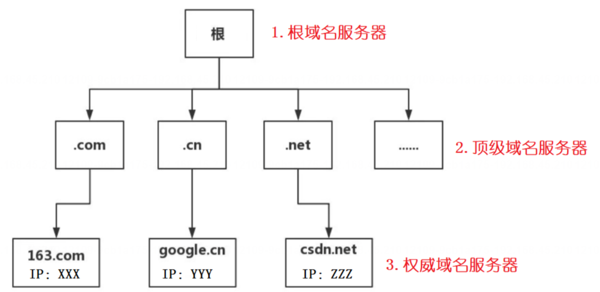
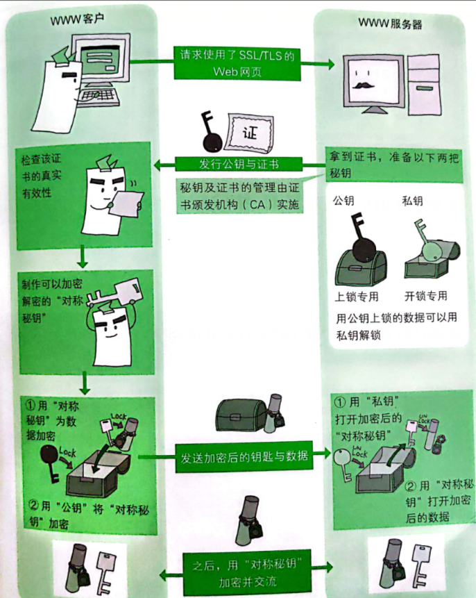
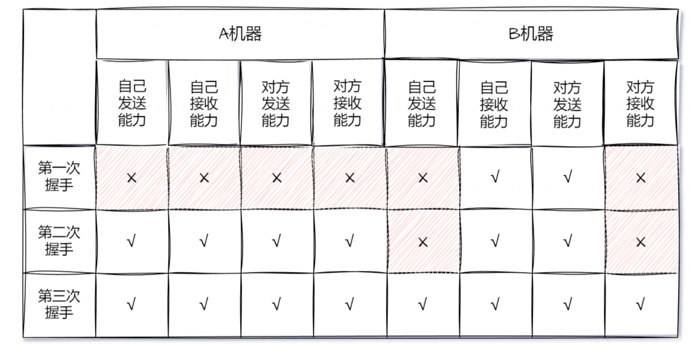

# 重点面试题

## 1. 什么是OSI七层模型？

**1.典型回答**
OSI(Open Systems Interconnection，开放式系统互联)七层模型是国际标准化组织(ISO)制定的一种网络协议参考模型，用于描述计算机网络中的通信协议及其功能。该模型将网络通信的过程划分为七个不同的层次，每个层次负责特定的功能，从物理传输到应用层。每个层次的职责清晰，各层之间通过定义良好的接口进行交互，实现了模块化和分层的设计。
OSI 七层模型分别是:

1. **应用层**:应用程序本身，为操作系统或网络应用程序提供访问网络服务的接口。
2. **表示层**:**对上层数据或信息进行变换以保证一个主机应用层信息可以被另一个主机的应用程序理解**。表示层的数据转换**包括数据的加密、压缩、格式转换等。**
3. **会话层**:会话层管理主机之间的会话进程，即负责建立、管理、终止进程之间的会话。会话层还利用在数据中插入校验点来实现数据的同步。
4. **传输层**:传输层的主要作用是负责两台主机间(从源地址到目的地)的数据传输的。如传输控制协议(TCP)能够确保数据可靠的从源主机发送到目标主机。
5. **网络层**:网络层的作用是负责网络上的地址管理和路由选择的。在数据通讯时，可以选择很多条路径(抵达目的地的)，比如从西安到北京，可以选择先从西安->太原 ->北京，也可以选择从西安 ->郑州 ->石家庄->北京，还可以选择从西安 ->延安 ->呼和浩特 ->张家口 ->北京，究竟选择那一条路呢?这就是网络层负责的。
6. **数据链路层**:数据链路层的作用是负责相邻设备之间的数据帧的传送和识别的。数据在传输时需要经过多个设备进行数据传输，而数据链路层就是负责相邻设备间的数据传输和识别的。数据链路层可以完全消除网络层和物理层之间的不同，将数据在链路层进行有效的识别和传输。
7. **物理层**:物理层的作用是负责将数据转换成信号，再将信号转换为数据的。转换方法因通讯媒体不同而不同所以没有特定的协议。

## 2. 说一下 TCP/IP 五层协议?


1. **应用层（Application Layer）**：
   这是最高层，它负责处理特定的应用程序细节和协议，例如 HTTP、SMTP、FTP 等。在这一层，用户与网络进行交互，完成各种任务，如发送电子邮件、浏览网页等。

2. **传输层（Transport Layer）**：
   传输层负责在源主机和目标主机之间提供可靠的数据传输服务。它管理端到端的数据传输，包括分段、流量控制、错误恢复等。常见的传输层协议包括 TCP（传输控制协议）和 UDP（用户数据报协议）。

3. **网络层（Internet Layer）**：
   网络层负责确定数据在网络上的路径选择和转发。它使用 IP 地址来识别主机和路由器，并处理数据包的路由和转发。主要的网络层协议是 IP（网际协议）。

4. **数据链路层（Data Link Layer）**：
   数据链路层负责在相邻节点之间传输数据。它处理数据包的帧，通过物理网络传输数据，并提供错误检测和纠正功能。常见的数据链路层协议包括以太网、WiFi、PPP 等。

5. **物理层（Physical Layer）**：
   物理层是网络的最底层，负责在物理媒介上传输原始比特流。它处理与硬件相关的细节，如电压、电流、光信号等。物理层确保数据从一个设备传输到另一个设备，而不会损坏或丢失。

**使用TCP/IP实现的上层协议有哪些?**
网络上的大部分通讯协议都是基于 TCP/IP 模型实现的，例如以下这些常见的应用层(上层)协议:

1. HTTP(Hypertext Transfer Protocol):一种用于传输超文本的协议，常用于 Web 应用程序的通信.。
2. HTTPS (HTTP Secure):基于 TLS/SSL 安全协议对 HTTP 进行加密和身份验证，用于保护 Web 通信的安2全性。
3. FTP(File Transfer Protocol):用于在网络上传输文件的协议，提供文件上传、下载、删除等功能。
4. SMTP(Simple Mail Transfer Protocol):用于电子邮件传输的协议，负责发送电子邮件到邮件服务器。
5. SSH(Secure shell): 提供了安全远程登录和其他安全网络服务的协议。

## 3. 应用层的常见协议有哪些?
1. **HTTP** (Hypertext Transfer Protocol): 用于在万维网上传输数据，是浏览器和服务器之间通信的主要方式，支持网页浏览、文件下载等。
2. **HTTPS** (HTTP Secure): 是基于 HTTP 的安全版本，通过 SSL/TLS 协议对传输数据进行加密，以确保安全的网络通信。
3. **FTP** (File Transfer Protocol): 文件传输协议，允许用户从一个主机向另一个主机上传或下载文件。
4. **FTP/S**(FTP over SSL/TLS): FTP 协议的安全版本，使用 SSL/TLS 加密传输数据。
5. **SMTP**(Simple Mail Transfer Protocol): 邮件发送协议，主要用于电子邮件的发送
6. **DNS**(Domain Name system): 用于将域名转换为 IP 地址，以便设备访问互联网资源。
7. **SSH**(Secure shell): **安全外壳协议，提供远程登录及命令执行等功能，并对所有数据传输进行了加密。**
8. **Telnet**:远程登录协议，允许用户通过网络连接到远程主机上执行命令
9. **RTSP**(Real Time streaming Protocol): 实时流传输协议，用于多媒体(如视频、音频)流媒体的控制。
## 4. 说一下 DNS 的解析流程?

**1.典型回答**
DNS(Domain Name System，域名解析系统)用于将域名转换为 IP 地址，以便设备访问互联网资源。因为在网络中，访问服务是依靠 IP 进行查找和定位的，因此使用 URL 访问的第一步，是先要得到服务器端的 IP地址，而得到服务器的 IP 地址需要使用 DNS(Domain Name System，域名系统)域名解析，DNS 域名解析就是通过 URL 找到与之相对应的 IP 地址。

> 为什么不直接访问 IP 地址来请求服务器?
> 答:使用 IP 地址也能直接访问程序，但由于 IP 地址很长，不方便记忆，而 URL 地址好记很多，所以会使用URL 来替代 IP 地址，而 URL 就像 IP 地址的别名一样，用它可以定位到相应的 IP 地址。 

1. **客户端发送域名解析请求**:当用户在浏览器中输入一个域名时，浏览器首先查找本地缓存，看是否有该域名对应的 IP 地址记录
2. **系统缓存查询**:如果浏览器本地缓存未命中，则操作系统会检查其自身的 DNS 缓存，看看是否已经存储了该域名的解析结果。
3. **本地 DNS 缓存查找**(本地网络运营商):操作系统缓存也未命中时，客户端向本地 DNS 服务器发送 DNS 查询请求。本地 DNS 解析器首先检查自己的缓存，看是否已经有了与域名对应的 IP 地址。如果有，解析过程直接结束，直接返回 IP 地址给客户端。
4. **本地 DNS 服务器查询**:如果本地 DNS 缓存中没有相关记录，解析器会向根域名服务器发送请求，询问它们掌握该域名服务器的 IP 地址。
5. **根域名服务器指向顶级域名服务器**:根域名服务器将返回顶级域名服务器(比如 .com、.net 等)的 IP 地址给本地 DNS 服务器。
6. **顶级域名服务器查询**:本地 DNS 服务器继续向顶级域名服务器发送请求，询问该域名服务器是否知道目标域名5对应的 IP 地址。
7. **顶级域名服务器指向权威域名服务器**:如果顶级域名服务器得到了目标域名对应的权威域名服务器(Authoritative Name Server)的 IP 地址，它会将该 IP 地址返回给本地 DNS 服务器。
8. **权威域名服务器查询**:本地 DNS 服务器再次向权威域名服务器发送请求，询问该域名对应的 IP 地址,
9. **权威域名服务器回复**:权威域名服务器将目标域名对应的 IP 地址返回给本地 DNS 服务器
10. **本地 DNS 服务器缓存记录**:本地 DNS 服务器将该记录添加到自己的缓存中，以备下次查询。
11. **本地 DNS 服务器回复客户端**:本地 DNS 服务器将目标域名对应的 IP 地址返回给客户端。
12. **客户端发起连接**:客户端通过获得的 IP 地址建立与日标主机的连接，开始进行数据传输。



## 5. 说一下 URL 的执行流程?
URL(Uniform Resource Locator，统一资源定位符)是互联网上用来标识资源的地址。URL 执行流程是指从用户在浏览器中输入一个URL，到页面内容最终呈现在用户面前的整个过程，它执行流程如下:
1. **用户输入 URL**:用户在浏览器地址栏中键入或粘贴一个 URL，
2. **DNS 解析**:浏览器首先检査本地 DNS 缓存是否有该域名对应的 IP 地址。如果没有，则向本地 DNS 服务器发送 DNS 查询请求。本地 DNS 服务器如果不知道该域名对应的 IP 地址，将依次询问根域名服务器、顶级域名服务器、权威 DNS 服务器，并获取目标网站服务器的 IP 地址。
3. **TCP 连接**:获取到目标服务器的 IP 地址后，浏览器建立与该服务器的 TCP 连接，默认使用 HTTP 协议的 80端口或 HTTPS 协议的 443 端口。
4. **发起 HTTP 请求**:通过已建立的 TCP 连接，浏览器构造并发送 HTTP 请求报文给服务器。在这个例子中，请求方法可能是 GET，请求头包含 Host(主机名)、User-Agent(浏览器信息)等字段。
5. **服务器处理请求**:服务器接收到请求后，根据请求内容调用相应的服务程序进行处理。如果是静态文件请求5.直接读取文件并返回:如果是动态请求，可能会触发后端应用逻辑处理，比如查询数据库，生成 HTML 页面等，
6. **响应数据传输**:服务器完成处理后，构建 HTTP 响应报文，其中包括状态码(如 200 表示成功)、响应头(Content-Type、Set-Cookie 等)和响应体(网页内容)。然后将这个响应报文通过 TCP 连接发回给浏览器
7. **渲染页面**:浏览器接收到响应报文后，解析响应头并根据 Content-Type 决定如何处理响应体。如果是 HTML文档，则开始解析 HTML 代码，并下载其中引用的 CSS 样式表、JavaScript 脚本、图片等资源。浏览器逐步渲染页面元素，直至页面完全加载完毕并展示在用户眼前。
8. **连接关闭**:在 HTTP/1.x协议中，一般情况下每个请求结束后都会关闭 TCP 连接(除非启用了 Keep-Alive 特8.
性)。而在 HTTP/2 及后续版本中，通常会保持长连接以复用同- TCP 通道发送多个请求，提高效率。
## 6. HTTP 协议中包今了哪些内容? 


#### 常见的请求报头和响应报头有哪些? ★
 **常见请求报头**
常见的请求报头有以下这些:

1. **User-Agent**:标识客户端的用户代理信息，用于**告知服务器请求来源的客户端类型和版本**
2. **Host**:指定服务器的域名和端口号，如它用于区分同一台服务器上的多个虚拟主机。
3. **Content-Type**:定义请求主体内容的类型，例如 Content-Type: application/jison 表示发送的数据是 JSON 格 式。
4. **Content-Length**:请求主体内容的长度，例如 Content-Length: 1024。
5. **Cookie**:发送浏览器存储的 Cookie 到服务器。

**② 常见响应报头**
常见的响应报头有以下这些:

1. **Content-Type**:指定响应体的数据类型和编码方式，告诉客户端如何解析响应体内容。
2. **Content-Length**:指示响应体的长度，用于浏览器正确接收和处理响应。
3. **set-Cookie**:服务器通过该头部将 Cookie 信息传递给客户端，客户端会保存 Cookie 并在后续请求中附加在请求头中。
4. **Location**:用于重定向响应，通常配合 HTTP 状态码 3xx 使用，告知客户端进行重定向的 URL
5. Cache-Control:控制缓存行为的指令，例如是否允许缓存、缓存有效期等。
## 7. HTTP 请求类型有哪些?为什么需要多种请求类型?
HTTP 请求类型主要有以下几种:
1. GET:用于从服务器获取数据。GET 请求将请求参数附加在 URL 的末尾，通常用于获取资源或数据。
2. POST:用于向服务器提交数据。POST 请求将请求参数包含在请求体中，通常用于向服务器提交表单数据或上传文件等操作。
3. PUT:用于更新服务器上的资源。PUT 请求将请求参数包含在请求体中，用于更新服务器上的资源
4. DELETE:用于删除服务器上的资源。DELETE 请求将请求参数附加在 URL 的末尾，用于删除指定的资源
5. HEAD:类似于 GET 请求，但服务器只返回响应头部，不返回实际数据。用于获取资源的元信息而不获取实际内容。
6. OPTIONS:用于获取服务器支持的 HTTP 方法列表和其他可用选项。
7. PATCH:用于对资源进行部分更新。PATCH 请求将请求参数包含在请求体中，用于对资源进行局部修改


**为什么需要多种请求类型?**
HTTP 请求类型的多样性是为了提供一种灵活且明确的方式，来处理网络上各种资源的交互场景，从而构建出高效、可扩展并且安全的分布式系统。
详细来说，HTTP 请求多样性的好处有以下几个:

1. **语义化更明确**:不同的 HTTP 方法提供了不同的操作语义，这有助于在 API 设计中实现清晰、一致且易于理解的行为。例如:
   - GET:请求用于获取资源，无副作用。
   - POST:用于向指定资源提交数据以创建新资源或执行一个动作
   - DELETE:用来删除指定资源:
2. **方便安全性和幂等性的接口设计**:某些 HTTP 方法具有幂等性，即多次执行相同的方法请求会得到同样的结果2(不会因为重复执行而改变资源状态)。这种特性对于防止重复操作造成意外后果非常关键，比如 GET 和DELETE 方法通常应是幂等的。
3. **符合 RESTful 架构风格**:REST (Representational State Transfer)是一种软件架构风格，它提倡使用 HTTP3.方法来操作资源集合，并通过 URI 标识资源。根据 REST 原则，每个资源都可通过标准方法进行 CRUD(创建、读取、更新、删除)操作，因此需要有对应的操作方式。
4. **方便设置缓存策略**:HTTP 规范也为不同的请求方法定义了不同的默认缓存策略，比如 GET 请求通常可以被缓4存，而 POST 请求通常不被缓存。

## 8. GET请求和POST请求有什么区别?POST请求更安全吗?
GET 请求和 POST 请求都是 HTTP 协议中最常见的两种请求方法，但它们它们存在以下几点区别:
1. **数据传递方式不同**:GET 请求是将参数放在 URL 地址中的，并以键值对的形式发送给服务器端，如:1.https://www,iavacn.site?param1=value1&param2=value2，因此，GET 请求的数据会在 URL 中可见，且在浏览器历史记录中可见;POST请求将参数放在请求体(body)中进行传输，以键值对或者其他复杂的数据格式(如 JSON 格式)发送给服务器。
2. **参数长度限制不同**:GET 请求的参数是通过 URL 传递的，而 URL 的长度是有限制的，通常为 2k，当然浏览器2商不同、版本不同这个限制的大小值可能也不同，但相同的是它们都会对 URL 的大小进行限制;而 POST 请求参数是存放在请求正文(request body)中的，所以没有大小限制。
3. **回退和刷新不同**:GET 请求可以直接进行回退和刷新，不会对用户和程序产生任何影响;而 POST 请求如果直接回滚和刷新将会把数据再次提交。
4. **缓存不同**:GET 请求一般会被缓存(浏览器行为)，比如常见的 CSS、JS、HTML 请求等都会被缓存;而POST 请求默认是不进行缓存的。
5. **使用场景不同**:GET 请求适合用于获取资源的信息，比如查看网页、获取图片等查询操作;POST 请求适合用于向服务器提交数据并产生副作用的操作，比如提交表单、上传文件等数据提交操作。


**POST请求比GET请求更安全吗?**

答:严格意义上来说 POST 和 GET 只是属于不同的请求类型，没有所谓的谁安全谁不安全这一说，我们通常所说的 POST 更安全主要体现在:GET 请求是将请求的参数放在 URL 上传递的，所以不借助任何工具都能看到明文的传输参数，而 POST 通常是将参数放在 body 请求体中传输的，所以从视觉方面来说，好像 POST 更安全一些。但稍微懂一些抓包和劫持的技术，无论是 GET 请求还是 POST 请求，只要是 HTTP 协议，都是不安全的，所以严格意义上来说，**只能说 POST隐私性相对于 GET来说要好一点点而已，安全性方面并没有本质上的区别**
## 10. 常见的 HTTP 状态码有哪些?
常见 HTTP 状态码有以下这些:
- 200:请求成功。
- 301:永久重定向。
- 302:临时重定向。
- 401:未登录。
- 403:无权限。
- 404:无法找到此页面。
- 405:请求的方法类型不支持。
- 500:服务器内部出错。
- 502:代理服务器或网关收到了上游服务器的无效响应。上游服务器地址配置错误，或上游服务宕机，网关或代理服务器就会提示 502。
- 504:代理服务器或网关访问上游服务器超时

**1XX 消息状态码:**
- 100:Continue 继续。客户端应继续其请求，
- 101:Switching Protocols 切换协议。服务器根据客户端的请求切换协议。只能切换到更高级的协议，例如，切换到 HTTP 的新版本协议。

**2XX 成功状态码:**
- 200:OK 请求成功。一般用于 GET 与 POST 请求
- 201:Created 已创建。成功请求并创建了新的资
- 202:Accepted 已接受。已经接受请求，但未处理完成。
- 203:Non-Authoritative Information 非授权信息。请求成功。但返回的 meta 信息不在原始的服务器，而是个副本。
- 204:No Content 无内容，服务器成功处理，但未返回内容。在未更新网页的情况下，可确保浏览器继续显示当前文档。
- 205:Reset Content 重置内容。服务器处理成功，用户终端(例如:浏览器)应重置文档视图。可通过此返回码清除浏览器的表单域。
- 206:Partial Content 部分内容。服务器成功处理了部分 GET 请求,

**3XX 重定向状态码:**
- 300:Multiple Choices 多种选择。请求的资源可包括多个位置，相应可返回一个资源特征与地址的列表用于用户终端(例如:浏览器)选择。
- 301:Moved Permanently 永久移动。请求的资源已被永久的移动到新 URI，返回信息会包括新的 URI浏览器会自动定向到新 URI。今后任何新的请求都应使用新的 URI 代替。
- 302:Found 临时移动，与 301 类似。但资源只是临时被移动。客户端应继续使用原有URI
- 303:See Other 查看其它地址。与 301 类似。使用 GET 和 POST 请求查看。
- 304:Not Modified 未修改。所请求的资源未修改，服务器返回此状态码时，不会返回任何资源。客户端通常会缓存访问过的资源，通过提供一个头信息指出客户端希望只返回在指定日期之后修改的资源。
- 305:Use Proxy 使用代理。所请求的资源必须通过代理访问。
- 306:Unused 已经被废弃的 HTTP 状态码。
- 307:Temporary Redirect 临时重定向。与 302 类似。使用 GET 请求重定向。

**4XX 客户端错误状态码:**
- 400:Bad Request 客户端请求的语法错误，服务器无法理解。
- 401:Unauthorized 请求要求用户的身份认证。.
- 402:Payment Required 保留，将来使用。
- 403:Forbidden 服务器理解请求客户端的请求，但是拒绝执行此请求,
- 404:Not Found 服务器无法根据客户端的请求找到资源(网页)。通过此代码，网站设计人员可设置"您所请求的资源无法找到"的个性页面。

**5XX 服务端错误状态码:**
- 500:Internal Server Error 服务器内部错误，无法完成请求。
- 501:Not Implemented 服务器不支持请求的功能，无法完成请求。
- 502:Bad Gateway 作为网关或者代理工作的服务器尝试执行请求时，从上游服务器接收到了一个无效的响应。
- 503:表示服务器当前暂时无法处理请求，通常是由于服务器已过载或维护等原因导致。503 错误通常是临时的，客户端可以稍后重试请求。
- 504:Gateway Time-out 充当网关或代理的服务器，未及时从上游服务器获取请求
- 505:HTTP Version not supported 服务器不支持请求的 HTTP 协议的版本，无法完成处理。
## 10. 301和302有什么区别?为什么不建议使用302?
301 和 302 都是用于请求重定向的状态码，所谓的请求重定向是指访问某个 URL 时，会自动跳转到另一个 URL。但是它们，一个表示请求的资源已经被永久性(301)移动到了另一个位置，而 302 只是临时性的移动到了另一个位置，客户端应该通过重定向到新的位置来获取资源。
它们主要区别如下:
1. **行为不同**:当服务器返回 301 状态码时，表示请求的资源已经永久性地移动到了新的位置;当服务器返回 302状态码时，表示请求的资源暂时性地移动到了新的位置。
2. **后续操作不同**:客户端在收到 301 响应后，后续应该更新书或链接，将原来的 URL 替换为新的 URL，并,以后的请求都应该直接使用新的 URL 来获取资源:客户端在收到 302 响应后，后续应该继续使用原来的 URL来请求资源，而不是直接使用新的 URL。
3. **搜索引擎处理不同**:搜索引擎通常会将 301 重定向视为对新 URL 的引用，将之前的 URL 的搜索排名改为新的URL:搜索引擎通常不会将 302 重定向视为对新 URL 的引用，不会将之前的 URL 的搜索排名传递给新的URL.

**为什么不建议使用 302?**
302 状态码本身并没有直接的危害，但在某些情况下可能会引发一些问题和安全隐患:
1. **SEO 问题**:如果网站频繁使用 302 重定向，搜索引擎可能会对网站的排名和索引产生负面影响。由于 302 表示临时重定向，搜索引擎会将原始 URL 与重定向目标 URL 视为不同的页面，造成链接的分散和重复索引。
2. **用户体验问题**:302 重定向可能导致页面加载速度变慢，对用户体验产生负面影响。每次发生重定向，都会增加一次请求和响应的网络开销，延迟页面的加载时间。
3. **安全性问题**:恶意攻击者可以利用 302 重定向进行网络钓鱼攻击或重定向劫持。他们可能会伪造 302 重定向使用户被重定向到恶意站点，诱导用户泄露敏感信息或下载恶意软件。
## 11. 请求转发和请求重定向有什么区别?
1. **定义不同**
**请求转发**(Forward):发生在服务端程序内部，当服务器端收到一个客户端的请求之后，会先将请求，转发给目标地址，再将目标地址返回的结果转发给客户端。而客户端对于这一切毫无感知的，这就好比，张三(客户端)找李四(服务器端)借钱，而李四没钱，于是李四又去王五那借钱，并把钱借给了张三，整个过程中张三只借了一次款，剩下的事情都是李四完成的，这就是请求转发。
**请求重定向**(Redirect):请求重定向指的是服务器端接收到客户端的请求之后，会给客户端返回了一个临时响应头，这个临时响应头中记录了，客户端需要再次发送请求(重定向)的 URL 地址，客户端再收到了地址之后，会将请求发送到新的地址上，这就是请求重定向。 这就好像张三(客户端)找李四(服务器端)借钱，李四没钱，于是李四就告诉张三，“我没钱，你去王五那借"，于是张三又去王五家借到了钱，这就是请求重定向。

2. **请求方不同**
从上面请求转发和请求重定向的定义，我们可以看出:请求转发是服务器端的行为，服务器端代替客户端发送请求，并将结果返回给客户端:而请求重定向是客户端的行为

3. **数据共享不同**
请求转发是服务器端实现的，所以整个执行流程中，客户端(浏览器端)只需要发送一次请求，因此整个交互过程中使用的都是同一个 Request 请求对象和一个 Response 响应对象，所以整个请求过程中，请求和返回的数据是共享的;而请求重定向客户端发送两次完全不同的请求，所以两次请求中的数据是不同的。
4. **最终 URL 地址不同**
请求转发是服务器端代为请求，再将结果返回给客户端的，所以整个请求的过程中 URL地址是不变的;而请求重定向是服务器端告诉客户端，"“你去另一个地访问去”，所以浏览器会重新再发送一次请求，因此客户端最终显示的URL 也为最终跳转的地址，而非刚开始请求的地址，所以 URL地址发生了改变。
5. **代码实现不同**

```java
request.getRequestDispatcher("/index.html").forward(request, response);

response.sendRedirect("/index.html");
```

## 12. HTTP 和 HTTPS 有什么区别?
HTTPS 并不是新的应用层协议，而是基于 HTTP 协议的升级，让它更安全了。它们的区别主要有以下几个:
1. **安全性**:它们最主要的区别在于安全性。HTTP 是不安全的协议，数据在传输过程中是明文的，容易被恶意者截获和窃取。而 HTTPS 通过使用 SSL(Secure Sockets Layer)或TLS(Transport Layer Security)协议进行数据加密，确保传输的数据在网络上是加密的，从而更难被窃取或改。
2. **加密**:在 HTTPS 中，数据在发送和接收之前会被加密，这意味着即使第三方截获了传输的数据，也很难解读其内容。这种加密的过程保护了用户的隐私和敏感信息，如登录凭据、信用卡信息等。
3. **证书**:使用 HTTPS 的网站需要获得 SSL/TLS 证书，这是由 CA(Certificate Authority，认证授权)认证机构签发的。证书用于验证网站的身份，确保用户正在与合法的网站通信，而不是恶意的仿冒网站。用户可以通过浏览器的地址栏看到网站的安全标志，这表明与该网站建立的连接是加密和安全的。
4. **端口**:**HTTP 默认使用端口 80，而 HTTPS 默认使用端口 443**。这有助于服务器和客户端正确识别要使用的协议。
5. **SEO(搜索引擎优化)**:Google 等搜索引擎在其算法中考虑了网站是否使用 HTTPS 来进行排名。使用HTTPS 在搜索结果中的优先级和排名更高。
## 13. 为什么要使用 HTTPS?
HTTP 在互联网通信中起着至关重要的作用，但它存在一些安全性和隐私性问题，所以需要使用 HTTPS 来增强网络通信的安全。
**HTTP 存在以下主要问题:**
1. **数据明文传输**:HTTP 默认情况下是以明文形式传输数据的，这意味着任何在网络路径上的中间节点(如路由器、代理服务器或黑客)都能够捕获和查看用户发送的所有信息，包括但不限于用户名、密码、信用卡号等敏感信息。
2. **缺乏完整性验证**:由于 HTTP 不提供数据完整性的校验机制，恶意第三方可以轻易地篡改传输中的数据内容’而接收方无法察觉。
3. **身份验证缺失**:使用 HTTP 时，不验证通讯方的真实身份，可能会遭到伪装。也就是所谓的“中间人攻击”，即攻击者冒充合法服务器，截取并篡改通信内容。

因此，为了确保数据的安全性和完整性，以及验证通信双方的身份，引入了HTTPSHTTPS 具备以下优点:

1. **加密**:对客户端与服务器之间的通信内容进行加密，防止数据被窃取和监听
2. **认证**:通过证书颁发机构(CA)签发的数字证书来验证服务器的身份，保证用户与正确的服务器建立连接
3. **完整性**:通过消息认证码(MAC)或者散列函数对数据进行完整性校验，防止数据在传输过程中被篡改。

## 14. 什么是中间人问题? 如何解决?
中间人攻击指的是，正常情况下本该是客户端和服务端直接进行交互的，但此处冲出来一个“坏人”(中间人)，它包含在客户端和服务器端之间，用于盗取和篡改双方通讯的内容，如下图所示:
所以说，中间人攻击主要有两个问题:
1. 身份认证问题。
2. 数据篡改问题。

如何解决中间人攻击?
使用 HTTPS 就可以完美的解决中间人攻击，HTTPS 使用以下两种手段来解决中间人攻击的问题:
1. 解决身份认证问题:使用 CA 数字证书。
2. 解决数据篡改问题:使用加密通讯。

**① CA 数字证书**
HTTPS 解决信任问题采用的是数字证书的解决方案，也就是服务器在创建之初，会先向一个大家都认可的第三方平台申请一个可靠的数字证书，然后在客户端访问(服务器端)时，服务器端会先给客户端一个数字证书，以证明自己是一个可靠的服务器端，而非“中间人”。
此时浏览器会负责校验和核对数字证书的有效性，如果数字证书有问题，那么客户端会立即停止通讯，如果没问题才会执行后续的流程
**② 加密通讯**
使用加密通讯之后，第一次通讯的秘钥只有在真正的服务器端保存，所以即使有中间人拦截了信息，因为是密文且自己没有秘钥，那么也是破解不了的，这也解决了中间人攻击的问题。
## 16. HTTPS 如何进行加密的?
HTTPS 使用了非对称加密和对称加密共同解决了内容加密的问题。
- 第一次通讯时，使用的是非对称加密(安全)
- 以后的通讯使用的是对称加密(效率高)

在对称加密中，有一个共享秘钥，通过这把共享秘钥可以实现信息的加密和信息的解密，它的特点是加密和解密的速度很快，但因为共享秘钥的问题，一旦共享秘钥被截获，那么所谓的加密和解码也就是一纸空谈了。

在非对称加密中，有一对秘钥:公钥和私钥，使用公钥可以加密信息，但不能解密信息，使用私钥可以解密信息。它的特点是服务器端保存私钥，不对外暴露，只将公钥发送给客户端，而其他人即使拿到公钥，也解密不了加密的信息，所以此方式更安全，但非对称加密的执行速度比较慢。
所以使用对称加密，速度快，但不安全;使用非对称加密安全，但速度慢。它的主要执行流程如下:
1. 服务器端先使用非对称加密，将公钥传递给客户端。
2. 客户端拿到公钥之后，将对称加密的共享秘钥，加密传递给服务器端。
3. 服务端使用私钥解密出共享秘钥，之后使用对称加密进行通讯。
## 16. 说一下 HTTPS 执行流程?
HTTPS (Hypertext Transfer Protocol Secure)是一种在 HTTP 协议基础上通过 SSL/TLS 协议提供加密处理和身份认证的网络协议，用于确保通信内容的安全性。
HTTPS 执行流程如下:
1. **客户端请求连接**:用户在浏览器中输入 HTTPS 网址并发起连接请求。浏览器验证 URL 合法性，并确定是HTTPS 请求。
2. **服务器响应并返回 CA 证书**
   - 服务器接收到请求后，返回其数字证书(由权威 CA 颁发)，其中包含了服务器的身份信息以及公钥
   - 浏览器验证服务器证书的有效性，包括检查证书是否过期、是否由受信任的 CA 签发、域名是否匹配等。
3. **密钥协商与握手阶段**:
   - 如果证书有效，浏览器生成一个随机数作为会话密钥(对称密钥)的一部分
   - 客户端使用服务器证书中的公钥加密这个会话密钥和其他一些参数(如加密套件、随机数等)，然后发送给服务器。
   - 这个过程可能涉及到多种握手模式，例如 RSA、DH/ECDH 密钥交换算法等。
4. **共享会话密钥**:
   - 服务器接收到加密后的信息后，用私钥解密得到会话密钥
   - 此时，客户端和服务端都拥有了同一份会话密钥，但该密钥在网络传输过程中并未明文出现。
5. **数据传输阶段**:
   - 使用协商好的会话密钥，双方开始使用 TLS/SSL 协议进行对称加密的数据传输
   - 所有的应用层数据(比如 HTTP 请求和响应消息体)都会被这个会话密钥加密，从而保证了数据的机密性和完整性。
6. 完整性校验:在数据传输期间，还会使用哈希算法及消息认证码(MAC)来确保数据未被篡改
7. 关闭连接:当通信完成后，通过 TLS/SSL 的“四次挥手”或者其他机制安全地结束会话，清理相关资源。

**什么是加密套件?**
加密套件(Cipher Suite)在 HTTPS 中是指一组特定的加密算法组合，它定义了客户端和服务器之间进行安全通信时所使用的各种加密、密钥交换以及消息认证方法
一个加密套件通常包含以下部分:

1. 密钥交换算法(Key Exchange Algorithm):用于协商会话密钥，如 RSA、DH(Difie-Hellman)、ECDH(Elliptic Curve Diffie-Hellman)等。
2. 对称加密算法(Symmetric Encryption Algorithm):用于实际数据传输阶段的加解密，例如 AES2 (Advanced Encryption Standard)、3DES (Triple Data Encryption Standard)等。
3. 消息认证码(Message Authentication Code,MAC)或散列函数:确保数据完整性，如 HMAC-SHA256.



## 17. 传输层的常见协议有哪些?
传输层在 TCP/IP 协议栈中承载了端到端的数据传输的功能，提供了可靠的数据传输服务、多路复用和多路分解。拥塞控制等功能，为上层的应用层提供了可靠的通信服务。传输层的常见协议有以下两个:
1. **TCP(Transmission Control Protocol，传输控制协议)**:==TCP 是面向连接的、可靠的、基于字节流的传输协议==。它提供可靠的数据传输，通过使用序号和确认机制，保证数据的可靠性和有序性。TCP 对传输的数据进行流量控制和拥塞控制，确保网络的可靠性和稳定性。基于 TCP 实现的应用层常见协议有: HTTP、FTP.SMTP 等。
2. **UDP(User Datagram Protocol，用户数据报协议)**:UDP 是==一种无连接、不可靠的、面向数据报的传输协议==。它不提供可靠的数据传输，不保证数据的有序性和完整性。UDP适用于对实时性要求较高但对数据丢失不敏感的应用场景，如音频、视频流、实时游戏等。由于 UDP 的特性，它具有较低的开销和传输延迟。基于UDP 实现的应用层常见协议有:DNS、RTP(Real-time Transport Protocol，实时传输协议)用于在实时应用中传输音频和视频等数据的协议。


## 18. TCP 有哪此特性?
1. ==确认应答==(保证稳定性):接收方在收到消息之后，要向发送方回复一个已确认(ACK，确认号)，当发送方接收到 ACK 之后，才会认为消息已经成功发送了。
2. ==超时重传==(保证稳定性):超时重传是指在发送数据时，如果发送方在一定时间内没有收到接收方的确认应答2(ACK)，就会认为数据丢失或未正确传输，触发超时重传机制。造成消息丢失的场景有两种:
   - 发送消息时丢失;
   - ACK 确认消息发送丢失，
3. ==连接管理==(保证稳定性):是指在TCP 协议中建立、维护和关闭连接的过程和机制。TCP 是一种面向连接的协议，通过连接管理机制，确保数据的可靠传输和通信的可靠性。连接管理的执行过程如下:
   - 建立连接(三次握手):在发送方和接收方之间建立连接之前，需要进行三次握手的过程。发送方首先发送一个 SYN(同步)报文给接收方，接收方收到后回复一个 SYN-ACK 报文，表示接收方已准备好建立连接。最后，发送方再发送一个 ACK 报文给接收方，表示连接已建立。这个过程确保了双方都同意建立连接。
   - 数据传输:一旦连接建立，发送方可以开始向接收方发送数据。TCP 使用序列号来对数据进行排序，并使用0.确认应答机制来确保数据的可靠传输。发送方会不断重传未收到确认应答的数据，直到接收方正确接收到数据并发送确认应答。
   - 连接维护:TCP 连接的维护包括保持连接的稳定和可靠。发送方和接收方会定期交换心跳消息，以确保连接处于活动状态。如果一方长时间没有收到对方的心跳消息，就会认为连接已经断开，会触发连接的关闭过程。
   - 连接关闭(四次挥手):当数据传输完成或需要关闭连接时，需要进行四次挥手的过程。发送方发送一个FIN(结束)报文给接收方，表示发送方不再发送数据。接收方收到 FIN 后，回复一个 ACK 报文，表示接收到了发送方的结束请求。然后，接收方也发送一个 FIN 报文给发送方，表示接收方也不再发送数据。最后，发送方收到 FIN 后，回复一个 ACK 报文，表示连接已经关闭。这个过程确保了双方都同意关闭连接
4. ==滑动窗口==(保证高效性):用来提升消息发送机制，使用滑动的窗口每次发送一批消息给接收方，这样就可以提升消息的发送效率了(不是一条条发送和确认了)，但滑动窗口大小会收到接收方的缓冲区影响，在发送方和接收方在建立连接时，会协商一个窗口大小(Window Size)。
5. ==流量控制==:TCP 的流量控制是一种机制，用于控制发送方向接收方发送数据的速率，以避免接收方无法及时处5理过多的数据而导致数据丢失或网络拥塞。例如，接收方的缓冲区变小之后，流量控制也要跟着变小，不然就会造成大量消息被丢失，触发超时重传等机制，影响消息整体的传输效率。
6. ==拥塞控制==:用于在网络拥塞的情况下，通过调整发送方的发送速率来避免网络拥塞的进一步加剧，并保持网络5的稳定性和公平性。
7. ==延迟应答==:是指接收方在接收到数据后，不立即发送确认应答(ACK)，而是延迟一段时间后再发送确认应答。延迟应答机制的目的是为了优化网络传输的效率，当接收方收到数据后，如果立即发送 ACK，那么发送方会认为数据已经成功传输，继续发送下一批数据。但实际上，接收方可能在短时间内还有更多的数据到达，可以一起发送 ACK，减少 ACK 报文的数量，从而减少网络传输的开销。
8. ==捎带应答==:一种拓展的确认应答机制，用于在接收方向发送方传递更多关于接收到的数据的信息。
## 19. 说一下 TCP 超时重传的策略?
TCP 超时重传策略是 TCP 协议中用于处理丢失或延迟数据包的一种机制，用于确保数据在网络中的可靠传输。造成消息丢失和超时重传的场景有以下两种情况:
1. 发送消息时丢失;
2. ACK 确认消息发送丢失。

TCP 超时重传策略主要是应对极端情况下，最大限度的传递数据，且不会过度浪费系统资源的一种机制，TCP 超时重传策略主要有以下两个:


1. ==动态重传时间==:每次重传时间翻倍，例如第一次 500ms，第二次就是 2*500ms，第三次就是 4*500ms。
2. ==最大重传次数==:TCP 如果超过一定的重试次数，那么就会强制断开连接，不会继续重传了
## 20. TCP 为什么要三次握手?

TCP 三次握手主要是为了保证双方能正常通讯，因为 TCP 发送方和接收方都是全双工的，所以它要保证在通讯之前，双方的发送和接收能力都没问题。
>全双工(Ful-Duplex)是指数据通信双方能够同时进行收发操作的一种传输模式。在全双工通信中，通信的每一端都能够独立地发送和接收数据，就像双向车道一样，数据可以在两个方向上同时流动，互不影响。

这就好比，打电话，通讯双方都要保证自己能话筒(传递声音)和耳机(接收声音)都是正常的才行，这样才能进行有效的交流，通常打电话时，都是这样开头的:
1. 我:喂，能听到我说话吗?
2. 对方:能听到你说话，你能听到我说话吗?
3. 我:能听到你说话，那我们就来聊正事吧

TCP 三次握手也是相同的道理，三次握手证明的能力详情如下:
所以，TCP 通讯至少要3次握手才行，所以2次握手是不行的，而4次握手是可以的，但是没有必要(因为3次握手已经足够了)
## 21. TCP三次握手的执行流程?
TCP 三次握手具体流程如下:
1. 客户端发送 SYN 包:客户端向服务器发送一个 SYN 包，其中 SYN 标识位为 1，表示客户端请求建立连接，并指定一个随机的序列号 x
2. 服务器发送 SYN+ACK 包:服务器收到客户端的 SYN 包后，向客户端发送一个 SYN+ACK 包，其中 SYN 和ACK 标识位均为 1，表示服务器接收到了客户端的请求，并同意建立连接。同时服务器也会指定一个随机的序列号 y，并将确认号设置为 x+1。
3. 客户端发送 ACK 包:客户端收到服务器的 SYN+ACK 包后，向服务器发送一个 ACK 包，其中 ACK 标识位为1，表示客户端确认收到了服务器的响应，并将确认号设置为 y+1。

SYN 和 seq 的区别:
- SYN:同步标识，SYN 是用于建立 TCP 连接的标志位，表示我是要建立 TCP 连接的。.
- seq:序列号，用于标识 TCP 报文段中数据的顺序的字段。在 TCP 连接建立后的数据传输过程中，每个 TCP 报文段都会携带一个 seq 字段，用于指示报文段中数据的起始位置。接收方根据 seq 字段的值来按序接收和重组数据。
## 22. TCP为什么要四次挥手?说一下四次挥手的流程?
TCP 之所以要四次挥手断开连接是因为 TCP 是一种面向连接的协议，它需要在断开连接时进行双向的确认和协商，以保证 TCP 通讯的稳定性。
具体来说，四次挥手的主要作用有以下两个:
1. 确保所有数据都被传输完成:在关闭连接前，双方都可能还有数据需要传输，因此需要四次挥手来确保所有数据都被传输完成。
2. 确保双方都能正确地关闭连接:四次挥手的过程中，客户端和服务器都需要发送 FIN 和 ACK 包，以确保双方都能正确地关闭连接，避免连接一方关闭而另一方仍然处于连接状态。

四次挥手执行流程
四次挥手的具体流程如下:

1. 客户端发送 FIN 包:客户端发送一个 FIN 包，其中 FIN 标识位为 1，表示客户端希望关闭连接。
2. 服务器发送 ACK 包:服务器收到客户端的 FIN 包后，向客户端发送一个 ACK 包，其中 ACK 标识位为 1，表2 示服务器已经收到了客户端的请求，并将确认号设置为客户端发送的序列号+1。
3. 服务器发送 FIN 包:服务器在发送完 ACK 包之后，也会发送一个 FIN 包，其中 FIN 标识位为 1，表示服务器也希望关闭连接。
4. 客户端发送 ACK 包:客户端收到服务器的 FIN 包后，向服务器发送一个 ACK 包，其中 ACK 标识位为 1，表。示客户端已经收到了服务器的请求，并将确认号设置为服务器发送的序列号+1。


为什么四次挥手要等两个 MSL?
答:四次挥手时发送者最后一次等待时间是两个 MSL(Maximum Segment Lifetime，最大生存时间)，目的是确保最后一个 ACK 的可靠传输，在四次挥手的最后一步，接收方发送一个 ACK 给发送方，表示接收到了关闭连接的请求。发送方需要等待一段时间，以确保这个 ACK 报文段能够可靠地传输到接收方。如果发送方在等待期间收到了接收方的重传请求，可以重新发送 ACK。
## 23. 什么是TCP粘包问题？如何解决？

TCP 粘包和半包问题是教据传输中比较常见的问题，所谓的粘包问题是指数据在传输时，在一条消息中读取到了另条消息的部分数据，这种现象就叫做粘包。比如发送了两条消息，分别为"ABC”和“DEF”，那么正常情况下接收端也应该收到两条消息“ABC”和"DEF”，但接收端却收到的是"ABCD”，像这种情况就叫做粘包，如下图所示:

半包问题是指接收端只收到了部分数据，而非完整的数据的情况就叫做半包。比如发送了一条消息是"ABC”，而接收端却收到的是“AB”和“C”两条信息，这种情况就叫做半包，如下图所示:


# 一般面试题
## 1. Cookie、Session和Token有什么区别?
Cookie、Session 和 Token 是 Web 应用程序中常用的三种用户状态管理技术，它们的主要区别如下:
**① Cookie**
- 定义:Cookie 是由服务器在 HTTP 响应中发送给客户端(通常是浏览器)的一小段数据。客户端将这些信息保存在本地，并在后续的请求中自动将其发送回服务器。
- 存储位置:存储在客户端(浏览器端)
- 安全性:因为存储在客户端，容易受到攻击，如恶意修改或窃取。为了增加安全性，可以设置 HttpOnly 属性防止跨站脚本攻击(XSS)，以及 Secure 属性强制通过 HTTPS 传输。

**②Session**
- 定义:Session 是在服务器端创建的一种机制，用于跟踪用户的会话状态。服务器会给每个用户分配一个唯一的会话 ID，并将该 ID 通过 Cookie 或其他方式传递给客户端。客户端随后在请求时携带会话 ID，服务器根据这个 ID 从内存或数据库中检索与该用户相关的会话数据。
- 存储位置:服务器端存储实际的会话数据，而客户端通常仅存储一个指向会话数据的唯一标识符-一会话 ID。
- 安全性:相比于直接在 Cookie 中存储敏感信息，Session 将用户状态保留在服务器端，相对安全。但会话 ID仍可能被盗用，所以需要定期更新和超时失效策略。

**③ Token**
- 定义:Token 是一种无状态的身份验证机制，它是一个包含用户认证信息的字符串，由服务器生成并返回给客户端。客户端在后续请求时将 Token 放在请求头(如 Authorization Header)中发给服务器进行身份验证和授权。
- 存储位置:客户端存储 Token 并在每次请求时携带，服务器不需要额外存储用户状态信息
- JWT (JSON Web Tokens)是一种自包含的 Token 格式，包含了必要的用户信息和签名，服务器无需查询数据库就能验证 Token 的有效性。
- 安全性与灵活性:Token 可以基于 HTTPS 传输以保证安全，并且由于其无状态特性，使得扩展性和分布式环境下的部署更为方便。然而，如果 Token 丢失或者被恶意获取，也会存在安全风险，因此往往会对 Token 设置有效期和其他保护措施，如刷新 Token 机制等。

**小结**
- Cookie 主要用于客户端的状态保持和追踪，可用来记录用户偏好等非敏感信息，也可以作为存储会话 ID 的方式。
- Session 是在服务器端维护用户状态的方法，相比 Cookie 更注重数据的安全性，但也增加了服务器资源消耗
- ==Token 是一种无状态的身份验证方法，适合于微服务架构和分布式场景，同时要求客户端具备一定的安全性来存储和处理 Token。==
## 2. 禁用Cookie后session还能用吗?
>默认情况下，禁用 Cookie 后，Session 就无法正常工作不能用了。这是因为大多数 Web 服务器(如 Apache、Nginx)和 Web 框架，通常都是依赖于 Cookie 来传递 Session 的会话 ID 的。客户端浏览器禁用 Cookie 时，服务器将无法把会话 ID 发送给客户端，客户端也无法在后续请求中携带会话 ID 返回给服务器，从而导致服务器无法识别用户会话。
>默认情况下禁用 Cookie 后，Session 就不能用了，但可以通过一些手段来解决这个问题。

解决方案
以下的两种解决方案可以绕过 Cookie 继续运行 Session:
1. **URL 中携带 SessionID**:可以通过 URL 重写的方式将 Session ID 添加到所有的 URL 中。服务器生成Session ID 后，将其作为 URL 的一部分传递给客户端，客户端在后续的请求中将 Session ID 带在 URL 中。服务器端需要相应地解析 URL 来获取 Session ID，并维护用户的会话状态。
2. **隐藏表单字段传递 SessionID**:将 Session ID 添加到 HTML 表单的隐藏字段中，在每个表单中添加一个隐藏的字段，保存 Session ID，客户端提交表单时会将 Session ID 随表单数据一起发送到服务器，服务器通过解析表单数据中的 Session ID 来获取用户的会话状态。

这些方法虽然可以在禁用 Cookie 的情况下继续使用 Session，但需要在服务器端进行相应的代码修改和配置。但同时这些手段也带来了以下几个新问题:
1. 增加了编码复杂度:需要改前端和后端代码才能继续使用Session 机制，增加了编码复杂度,
2. 增加了安全风险:这些替代方法可能会增加一些安全风险，因为 Session ID 将以明文形式出现在 URL 或表单中，很容易被第三方劫持和获取。
## 3. HTTP和RPC有什么区别?为什么RPC性能更高?

HTTP (Hypertext Transfer Protocol，超文本传输协议)和 RPC(Remote Procedure Call，远程调用)是用于通信的协议，它们存在以下主要区别:
1. 功能和用途:
   - HTTP 是一种用于传输超文本数据的协议，常用于浏览器和服务器之间的通信。它可以实现基于请求-响应模式的通信，支持无状态和有状态的交互。
   - RPC是一种用于远程过程调用的协议，用于不同计算节点之间的通信，多用于微服务内部间的调用。它允许应用程序通过网络调用远程服务，并像调用本地方法一样轻松实现分布式系统的集成。
2. 数据格式:
   - HTTP 使用文本格式来传输数据，通常使用 JSON 或 XML 进行序列化。
   - RPC 通常使用二进制格式来传输数据，例如 Protocol Buffers(ProtoBuf)或 Apache Thrift.
3. 通信性能:RPC 通常比 HTTP 更高效。这是因为 RPC 的协议设计更加轻量级，并且数据序列化和反序列化过程更加高效。此外，RPC协议的重点是追求更低的延迟和更高的吞吐量，可以通过使用高性能的序列化框架、压缩算法和连接池等技术来进一步提高效率。
   适用场景:。
   - HTTP 适合用于互联网上的分布式系统，如 Web 应用程序。
   - RPC 适合用于大型分布式系统中的服务调用，如微服务架构、分布式计算和分布式存储等场景。
## 4. 路由器与交换机有什么区别?
路由器和交换机是网络中常见的两种设备，它们在网络中扮演着不同的角色，有以下几点区别：

1. 功能不同：路由器是用来连接不同网络并进行数据包转发的设备，它可以根据目的地址来确定数据包的传输路径；而交换机主要用于局域网内部的数据交换，它根据 MAC 地址来转发数据包。

2. 工作层次不同：路由器工作在网络层，负责在不同网络之间进行数据包的转发；而交换机工作在数据链路层，负责在局域网内部进行数据包的转发。

3. 路由表不同：路由器通过路由表来确定数据包的传输路径，可以实现不同网络之间的通信；而交换机没有路由表，只能在同一网络内部进行数据包的转发。

总的来说，路由器更适合连接不同网络进行数据传输，而交换机更适合在局域网内部进行数据交换。在网络中，通常会同时使用路由器和交换机来构建一个完整的网络架构。
## 5. 正向代理和反向代理有什么区别?
正向代理(Forward Proxy)和反向代理(Reverse Proxy)都是网络代理技术，使用网络代理技术可用于访问控制、隐私保护、缓存加速、负载均衡以及网络安全防护等方面，可以有效地优化网络性能，提高用户体验，并增强网络的安全性和可靠性。
**正向代理是从客户端的角度出发，帮助客户端访问远程服务器;而反向代理则是站在服务器角度，代表服务器接收并处理客户端的请求，以达到负载均衡、安全防护、内容缓存等多种目的**。它们的主要区别有以下几个:
1. **功能定位不同**:
   - 正向代理主要是为客户端服务，作为客户端与服务器之间的中介。客户端通过配置代理服务器来访问目标服。务器的资源，如下图所示:
   - 反向代理是代表服务器处理请求的代理，它位于服务器端，主要服务于服务器。客户端并不知道代理的存在，认为其直接与目标服务器通信，如下图所示:
2. **工作方式不同**:
   - 正向代理:用户首先发起请求给正向代理服务器，然后由正向代理代替客户端去访问真正的目标服务器，获取所需内容后返回给客户端。整个过程中，目标服务器只知道代理服务器的存在，而不知道客户端的真实信息。
   - 反向代理:当客户端向反向代理服务器发送请求时，反向代理接收到请求后决定将请求转发到后端的哪台真实服务器，并将从真实服务器得到的响应返回给客户端。在这个过程中，客户端只知道代理服务器的地址，而不清楚实际提供服务的服务器的具体信息。

3. **使用场景不同**:
   - 正向代理使用场景如下。
      - 网络访问控制:企业或组织为了管理内部网络对外部网络的访问，可以通过正向代理进行权限控制和过滤不安全内容。
      - 隐藏客户端信息:用户可以利用正向代理隐藏自身 IP 地址，实现匿名浏览或其他隐私保护目的。
   - 反向代理使用场景如下:。
      - 负载均衡:反向代理可以根据预设策略将请求分配到不同的后端服务器，实现负载均衡，提高系统的可用性和稳定性。
      - 安全防护:反向代理可以作为 Web 应用防火墙，对来自外部的请求进行过滤和检查，防止 DDoS 攻击等安全威胁。
      - 内容缓存:对于静态内容或者热点动态内容，反向代理可以缓存结果并直接响应客户端的重复请求，减少后端服务器的压力。
      - URL 重写及域名隐藏:反向代理可以用来隐藏真实的服务器地址，便于管理和维护多台服务器组成的集群环境。
## 6. 常见的网络攻击有哪些?如何解决?
常见的网络攻击类型有以下几种:
1. 拒绝服务攻击(Denialof service,DoS/DDoS)
   - 攻击方式:通过发送大量请求或数据包来耗尽目标系统的资源，使其无法为正常用户提供服务
   - 解决方案:
     - 使用防火墙、DDoS 防护设备或服务进行流量清洗:
     - 设置合适的带宽阈值和连接限制;
     - 采用负载均衡技术分散流量;
     - 及时更新系统和应用程序以修复已知漏洞。
2. SQL注入(soL Injection)
   - 攻击方式:通过在用户输入中嵌入恶意 SQL 代码，绕过安全机制，获取、修改或删除数据库信息。
   - 解决方案:
     - 对所有用户输入执行严格的参数化查询或预编译语句，
     - 进行权限校验，实施最小权限原则，限制数据库账户的访问权限;
     - 启用 Web 应用防火墙(WAF)等工具进行过滤。
3. 跨站脚本攻击(Cross-Site Scripting,Xss)
   - 攻击方式:将恶意 JavaScript 或其他脚本注入到网页上，当其他用户浏览该页面时被执行，可能窃取用户会。话或执行非法操作。
    
   - 解决方案:对用户输入进行充分的 HTML 实体编码或转义。

4. 跨站请求伪造(Cross-Site Request Forgery,CSRF)
   - 攻击方式:诱使受害者在其当前已登录的网站上下文中执行非授权的操作
   - 解决方案:
      - 在敏感请求中添加 CSRF 令牌，确保请求来自可信源,
      - 检査 Referer 头或使用同步令牌模式
      - 对于重要操作要求重新验证用户身份。
5. 中间人攻击(Man-in-the-Middle,MITM)
   - 攻击方式:攻击者拦截并可能篡改两个通信方之间的消息。。
   - 解决方案:强制实施 HTTPS/TLS 加密传输协议，确保数据在传输过程中被加密