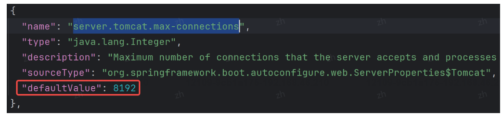
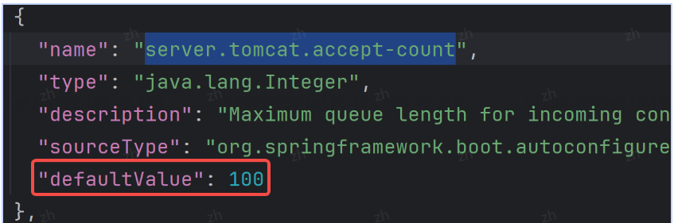

## 1. IoC?

> 控制反转：是什么？作用：1.解耦 2.代码简洁性 3.生命周期管理 4.可重用 5.AOP实现基础

IOC（Inversion of Control，控制反转）是一种设计原则，它反转了传统的对象创建方式，将对象的创建和依赖关系的管理交给外部容器来处理。这样做的好处是减少了代码之间的耦合度，提高了模块化和代码的可维护性。

**IOC的作用**：
1. **降低耦合度**：通过IOC，对象之间的依赖关系由容器在运行时动态注入，而不是通过代码中的new操作符静态创建，减少了模块间的直接依赖。
2. **提高代码复用性**：由于对象的创建和依赖关系由容器管理，相同或类似的对象可以被重复使用，而不需要每次都编写新的代码。
3. **增强扩展性**：当需要替换或增加新的对象时，只需更改配置文件或注解，而不需要修改代码本身。
4. **简化测试**：由于对象的依赖关系被外部化，可以更容易地替换实现以进行单元测试。

**实现IOC的步骤**：
1. **定义组件**：编写需要管理的组件类，并定义好类的构造函数、属性和方法。
2. **配置元数据**：通过XML、注解或Java配置类等形式，描述组件的创建、配置和依赖关系。
3. **创建容器**：实例化IOC容器，如Spring的BeanFactory或ApplicationContext。
4. **加载配置**：容器读取配置元数据，创建并注册组件为容器管理的Bean。
5. **依赖注入**：容器根据配置，通过构造函数、Setter方法或其他方式，注入组件间的依赖关系。
6. **使用组件**：从容器中获取Bean，使用已经配置好的组件。

在Spring框架中，IOC通过DI（Dependency Injection，依赖注入）实现，DI是IOC的一种具体实现方式。依赖注入是指组件之间的依赖关系由容器在应用系统运行期动态地决定和注入。

实现IOC的具体技术手段通常包括工厂模式、反射机制等。在Spring中，BeanFactory和ApplicationContext是IOC容器的两种实现，其中ApplicationContext是BeanFactory的扩展，提供了更多的功能和企业级支持。  

IoC如何实现解耦的？

举个例子，比如 A 对象中需要依赖 B对象，需要调用 B中的某个方法，我们通常的实现方法是这样的:

```java
class A {
	public void init(){
		// 调用 B 类中的 init 方法
		B b= new B();
		b.init();
	}
}
class B {
	public B(){
		public void init(){
			system.out.println("你好，世界。");
			}
		}
	}
}
```
然而此时对象 A 和对象 B是存在耦合的，因为一旦修改了 B对象构造方法的参数之后，那么 A 对象里面的写法也要跟着改变，比如当我们将构造方法改为以下代码时:

```java
class B{
	public B(string name){
		System.out.println("姓名:"+ name);
	}
	public void init(){
		System.out.println(“你好，世界。”);
	}
}
这就是开发中经常遇到的一个问题，那怎么解决呢?我们可以通过将对象传递而并 new 对象的方式来解决，如下代码所示:
```
```java
class A {
	// 先定义一个需要依赖的 B对象
	private B b;
	// 通过构造方法实现赋值(初始化)
	public A(B b){
		this.b = b;
	}	
	public void init(){
		// 调用 B 类中的 init 方法
		b.init();
	}
}
class B {
	public B(string name){
		System.out.println("姓名:"+ name);
	}
	public void init(){
		system.out.println("你好，世界。");
	}
}
```
这样改造之后，无论构造方法怎么修改，即使需要加更多的参数，而调用它的 A 类都无需做任何修改，这样就实现了对象的解耦。

## 2. DI?

**DI（Dependency Injection，依赖注入）** 是一种设计模式，它是一种实现IOC（Inversion of Control，控制反转）的具体技术手段。在依赖注入中，一个对象（称为消费者）的依赖关系（所需的其他对象，称为依赖项）不是由消费者自己创建或查找，而是在创建时由外部容器注入给它。

**DI与IOC的关系**：
- IOC是一种更广泛的设计原则，它的核心思想是将控制权从应用程序代码转移到外部容器。这样做的目的是为了降低代码之间的耦合度，提高代码的可维护性和可扩展性。
- DI是IOC的一个具体实现方式。在DI中，对象的创建和它们依赖的资源都由容器来管理，这些依赖关系在运行时被注入到对象中。

**依赖注入的方法**：
1. **构造函数注入**：通过对象的构造函数将依赖项传递进来。这是一种强制性的注入方式，确保对象在使用前已经装配好所有依赖。

   ```java
   public class Engine {
       private final SparkPlug sparkPlug;

       public Engine(SparkPlug sparkPlug) {
           this.sparkPlug = sparkPlug;
       }
   }
   ```

2. **Setter方法注入**：通过Setter方法将依赖项注入到对象中。这种方式比较灵活，可以在创建对象之后随时注入依赖。

   ```java
   public class Engine {
       private SparkPlug sparkPlug;

       public void setSparkPlug(SparkPlug sparkPlug) {
           this.sparkPlug = sparkPlug;
       }
   }
   ```

3. **接口注入**：通过接口中定义的方法将依赖项注入。这种方式不常用，因为它可能会导致接口和实现类之间的耦合。

   ```java
   public interface Engine {
       void injectSparkPlug(SparkPlug sparkPlug);
   }
   ```

4. **注解注入**：在Java中，特别是在Spring框架中，可以使用注解（如`@Autowired`）来指示容器在运行时注入依赖项。

   ```java
   public class Engine {
       @Autowired
       private SparkPlug sparkPlug;
   }
   ```

5. **字段注入**：直接在字段上使用注解来注入依赖项。这种方式简单直观，但可能会降低代码的灵活性和测试性。

   ```java
   public class Engine {
       @Autowired
       private SparkPlug sparkPlug;
   }
   ```

除了DI，还有其他一些实现IOC的方式，例如：

- **服务定位器模式**（Service Locator pattern）：通过一个中央服务定位器来查找和访问所需的服务或资源。这种方式虽然也实现了IOC，但通常被认为是一种较差的实践，因为它隐藏了对象的创建细节，增加了系统的复杂性和耦合度。

- **工厂模式**（Factory pattern）：通过工厂类来创建对象，将对象的创建逻辑封装在工厂类中，从而实现对象创建和使用之间的解耦。

- **单例模式**（Singleton pattern）：确保一个类只有一个实例，并提供一个全局访问点来访问该实例。单例模式也可以看作是一种IOC的形式，因为它将对象的创建和管理集中到一个单独的点。

DI是最常用的IOC实现方式，因为它提供了一种清晰、灵活且可测试的方式来管理对象的依赖关系。

## 3. 注入：属性、Setter、构造方法？

属性注入、Setter注入和构造方法注入是依赖注入（DI）的三种常见方式。下面我将分别给出每种方式的使用案例，并讨论它们各自的优缺点。

### 属性注入（Field Injection）

**使用案例**：

```java
import org.springframework.beans.factory.annotation.Autowired;

public class Car {
    @Autowired
    private Engine engine;

    public void start() {
        engine.run();
    }
}
```

**优点**：
- 简单直观，不需要编写构造函数或Setter方法。

**缺点**：
- 违反了封装原则，因为字段是公开的。
- 不能保证依赖关系的注入顺序，可能会引起初始化顺序的问题。
- 对于final字段，属性注入不适用。

### Setter注入（Setter Injection）

**使用案例**：

```java
import org.springframework.beans.factory.annotation.Autowired;
import org.springframework.stereotype.Component;

@Component
public class Car {
    private Engine engine;

    @Autowired
    public void setEngine(Engine engine) {
        this.engine = engine;
    }

    public void start() {
        engine.run();
    }
}
```

**优点**：
- 符合Java的封装原则，Setter方法提供了访问权限的控制。
- 可以检查依赖对象的有效性。
- 可以在注入依赖后执行一些初始化逻辑。

**缺点**：
- 需要编写额外的Setter方法，增加了模板代码。
- 可能会掩盖对象的完全构造，有时候不容易看出对象的所有依赖。

### 构造方法注入（Constructor Injection）

**使用案例**：

```java
import org.springframework.beans.factory.annotation.Autowired;
import org.springframework.stereotype.Component;

@Component
public class Car {
    private final Engine engine;

    @Autowired
    public Car(Engine engine) {
        this.engine = engine;
    }

    public void start() {
        engine.run();
    }
}
```

**优点**：
- 保证了对象的完全构造，对象在创建时就具备了所有需要的依赖。
- 可以保证依赖关系的注入顺序。
- 有利于实现不可变对象和单例模式。

**缺点**：
- 需要所有依赖项都是必需的，对于可选依赖处理不够灵活。
- 对于依赖项很多的对象，构造函数的签名可能会变得复杂。

### 总结

- **属性注入**：简单但破坏了封装性，不推荐使用。
- **Setter注入**：灵活且符合Java封装原则，但需要编写额外的Setter方法。
- **构造方法注入**：保证了对象的完全构造和依赖的不可变性，是最推荐的方式，但对可选依赖的处理不够灵活。

在实际开发中，构造方法注入被认为是最佳实践，因为它使得对象的依赖关系明确且不可变，有助于创建稳定的应用程序。Setter注入和属性注入在某些情况下也有其适用场景，但通常建议尽量避免使用。

## 4. @Autowired和@Resource?

`@Autowired` 和 `@Resource` 都是用于依赖注入的注解，但它们属于不同的依赖注入规范，并且有一些使用上的差异。

### `@Autowired`（Spring 框架）

**使用案例**：

```java
import org.springframework.beans.factory.annotation.Autowired;
import org.springframework.stereotype.Component;

@Component
public class Car {
    private Engine engine;

    @Autowired
    public void setEngine(Engine engine) {
        this.engine = engine;
    }
}
```

**特点**：
- `@Autowired` 是 Spring 框架的一部分，用于自动注入依赖的组件。
- 默认情况下，`@Autowired` 要求依赖的组件必须存在，如果找不到会抛出异常。
- 可以通过设置 `required=false` 来允许可选的依赖注入。
- 可以使用在构造函数、Setter方法和字段上。
- `@Autowired` 可以通过 `@Qualifier` 注解结合使用，以解决同名 bean 的歧义问题。

### `@Resource`（Java EE 规范）

**使用案例**：

```java
import javax.annotation.Resource;

public class Car {
    @Resource
    private Engine engine;

    public void start() {
        engine.run();
    }
}
```

**特点**：
- `@Resource` 是 Java EE 规范的一部分，由 `javax.annotation` 包提供。
- `@Resource` 默认通过名称进行自动注入，可以通过名称匹配来注入同名的组件。
- 如果有多个同名的组件，可以通过 `name` 属性指定要注入的组件。
- `@Resource` 也支持按类型注入，但优先级低于按名称注入。
- `@Resource` 不能与 `@Qualifier` 结合使用，因为它是 Java EE 规范的一部分，而不是 Spring 特有的。

### 区别

1. **来源不同**：
   - `@Autowired` 是 Spring 特有的。
   - `@Resource` 是 Java EE 规范的一部分。

2. **默认注入方式**：
   - `@Autowired` 默认按类型注入。
   - `@Resource` 默认按名称注入。

3. **处理多个匹配**：
   - `@Autowired` 可以通过 `@Qualifier` 注解指定具体的 bean 名称。
   - `@Resource` 可以通过 `name` 属性指定 bean 的名称。

4. **使用位置**：
   - `@Autowired` 可以用在构造函数、Setter方法和字段上。
   - `@Resource` 通常用在字段和Setter方法上。

5. **异常处理**：
   - `@Autowired` 如果没有找到匹配的 bean，默认会抛出异常，可以通过设置 `required=false` 来使其成为可选的。
   - `@Resource` 没有 `required` 属性，如果找不到匹配的 bean 会抛出异常。

6. **兼容性**：
   - `@Autowired` 只能用于 Spring 管理的 bean。
   - `@Resource` 可以用于任何符合 Java EE 规范的容器管理的资源。

在实际开发中，通常推荐使用 `@Autowired`，因为它是 Spring 框架的一部分，与 Spring 的其他特性（如 AOP、事务管理等）更加兼容。而 `@Resource` 则更多地用于 Java EE 环境或者需要遵循 Java EE 规范的场景。

## 5. AOP？

**AOP（Aspect-Oriented Programming，面向切面编程）** 是一种编程范式，它允许将横切关注点（如日志记录、事务管理、权限控制等）与业务逻辑分离，从而提高代码的模块化和可维护性。AOP 通过引入“切面”（Aspect）和“通知”（Advice）等概念来实现这一目标。

### AOP 的核心概念：

1. **切面（Aspect）**：切面是封装横切关注点的模块，它定义了一组通知。
2. **连接点（JoinPoint）**：连接点是应用中的特定点，如方法调用或异常抛出，切面可以在这些点上添加额外行为。
3. **通知（Advice）**：通知是切面在特定连接点上执行的动作，常见的通知类型包括：
   - **前置通知（Before）**：在连接点之前执行。
   - **后置通知（After）**：在连接点之后执行。
   - **返回通知（AfterReturning）**：在连接点成功返回后执行。
   - **异常通知（AfterThrowing）**：在连接点抛出异常后执行。
   - **环绕通知（Around）**：包围连接点，在连接点之前和之后执行。
4. **切点（Pointcut）**：切点是连接点的表达式，用于匹配哪些连接点需要被切面增强。
5. **织入（Weaving）**：织入是将切面应用到目标对象并创建新的代理对象的过程。

### AOP 的使用场景：

1. **日志记录**：在方法执行前后记录日志信息，有助于调试和监控。
2. **事务管理**：在数据访问层保证操作的原子性、一致性、隔离性和持久性。
3. **权限控制**：在方法执行前检查用户是否有权限执行该操作。
4. **性能监控**：监控方法的执行时间，用于性能分析和优化。
5. **异常处理**：统一处理方法执行过程中的异常。
6. **数据校验**：在业务逻辑执行前校验数据的有效性。
7. **缓存**：在方法执行前后实现缓存逻辑，提高系统性能。
8. **消息通知**：在特定操作后发送消息或邮件通知。
9. **跨切面调用**：在多个组件之间实现数据传递或行为协调。

### AOP 的实现方式：

AOP 可以通过多种方式实现，包括编译时织入（如 AspectJ）、类加载时织入（如 Javassist）、运行时代理（如 Spring AOP）等。

1. **AspectJ**：一个成熟的 AOP 框架，通过编译时织入实现 AOP。
2. **Spring AOP**：Spring 框架的一部分，主要通过动态代理实现 AOP，支持方法织入。
3. **Javassist**：一个 Java 字节码操作库，可以在类加载时修改类的结构，实现 AOP。

在实际开发中，AOP 提供了一种非常强大的方式来实现关注点分离，使得业务逻辑更加清晰，同时将横切关注点集中管理，提高了代码的可维护性和可重用性。

### **AOP的底层如何实现的？**

AOP的底层实现主要依赖于动态代理技术。在Java中，动态代理主要有两种实现方式：JDK动态代理和CGLib动态代理。

1. **JDK动态代理**：基于接口的代理方式，利用了`java.lang.reflect.Proxy`类和`java.lang.reflect.InvocationHandler`接口。当目标对象实现了一个或多个接口时，Spring AOP默认使用JDK动态代理来创建代理对象。代理对象在执行方法时，会委托给`InvocationHandler`的`invoke`方法，在其中可以定义方法执行前后的增强逻辑。

2. **CGLib动态代理**：当目标对象没有实现接口，或者需要代理的方法是`final`的，或者需要代理`private`方法时，Spring AOP会使用CGLib库来创建代理对象。CGLib通过在运行期动态生成被代理类的子类来实现代理。在生成的子类中，可以重写父类的方法，在重写的方法中添加增强逻辑。

Spring AOP的代理创建过程大致如下：

- **创建代理工厂**：Spring使用`ProxyFactory`来创建代理对象。
- **配置代理**：通过`Advisor`（通知+切入点）配置代理对象，`Advisor`定义了通知类型和应用的通知规则。
- **生成代理对象**：Spring根据配置的`Advisor`生成代理对象。如果是JDK动态代理，会使用`Proxy.newProxyInstance`方法；如果是CGLib动态代理，则会使用CGLib的`Enhancer`类来创建代理类。

在执行代理对象的方法时，如果是JDK动态代理，会调用`InvocationHandler`的`invoke`方法；如果是CGLib动态代理，则会调用`MethodInterceptor`的`intercept`方法。在这些方法中，可以实现方法执行前后的增强逻辑，如日志记录、事务管理等。

总结来说，Spring AOP的底层实现是通过动态代理技术，将增强逻辑织入到目标对象的方法调用中，从而实现AOP的功能。

## 6. AOP自定义注解？

在 Spring Boot 中使用 AOP 自定义注解的一个常见场景是创建一个日志注解，用于记录方法的执行时间或者执行日志。以下是一个简单的示例，展示如何创建一个自定义注解 `@LogExecutionTime` 来记录方法执行时间：

1. **定义注解**：

首先，定义一个注解 `@LogExecutionTime`，用于标记需要记录执行时间的方法。

```java
@Target(ElementType.METHOD)
@Retention(RetentionPolicy.RUNTIME)
public @interface LogExecutionTime {
    // 注解内可以定义参数，例如日志的详细级别等
    String level() default "INFO";
}
```

> 在 Java 中，注解（Annotations）可以通过元数据提供有关程序的额外信息。当你创建自定义注解时，`@Target` 和 `@Retention` 是两个非常重要的元注解（meta-annotations），它们定义了注解的适用范围和保留策略。
>
> 1. **@Target**：
>    `@Target` 元注解用于指定注解可以应用于哪些Java元素上。例如，它可以指定注解可以用于类、方法、字段、参数等。以下是 `@Target` 可接受的一些常见参数：
>
>    - `ElementType.TYPE`：类、接口（包括注解类型）或枚举的声明
>    - `ElementType.FIELD`：字段声明（包括枚举常量）
>    - `ElementType.METHOD`：方法声明
>    - `ElementType.PARAMETER`：参数声明
>    - `ElementType.CONSTRUCTOR`：构造器声明
>    - `ElementType.LOCAL_VARIABLE`：局部变量声明
>    - `ElementType.ANNOTATION_TYPE`：注解声明
>    - `ElementType.PACKAGE`：包声明
>
>    在你的示例中，`@Target(ElementType.METHOD)` 指定了 `@LogExecutionTime` 注解只能用于方法。
>
> 2. **@Retention**：
>    `@Retention` 元注解用于指定注解的保留策略，即注解信息在什么级别可用。以下是 `@Retention` 可接受的一些常见参数：
>
>    - `RetentionPolicy.SOURCE`：注解仅保留在源代码中，在编译时丢弃。这些注解对运行时没有影响。
>    - `RetentionPolicy.CLASS`：注解保留在类文件中，但会在运行时被VM丢弃。这是默认的保留策略。
>    - `RetentionPolicy.RUNTIME`：注解保留在类文件中，并且在运行时可以通过反射获取到。
>
>    在你的示例中，`@Retention(RetentionPolicy.RUNTIME)` 指定了 `@LogExecutionTime` 注解在运行时可以通过反射获取到，这对于AOP切面来说是必要的，因为切面需要在运行时检测到注解并执行相应的逻辑。
>
> 总结来说，`@Target` 定义了注解可以应用的地方，而 `@Retention` 定义了注解信息在哪个阶段可用。这两个元注解通常一起使用，以确保注解的正确使用和保留策略。

2. **创建切面**：

接着，创建一个切面 `LoggingAspect`，用于实际执行日志记录的逻辑。

```java
@Aspect
@Component
public class LoggingAspect {

    @Around("@annotation(logExecutionTime)")
    public Object logExecutionTime(ProceedingJoinPoint joinPoint, LogExecutionTime logExecutionTime) throws Throwable {
        long startTime = System.currentTimeMillis();
        Object result = joinPoint.proceed();
        long endTime = System.currentTimeMillis();

        long executionTime = endTime - startTime;
        // 这里可以自定义日志的输出方式，这里简单地使用System.out
        System.out.println(String.format("[LogExecutionTime] %s executed in %d ms.",
                joinPoint.getSignature().getName(), executionTime));

        // 可以根据注解的level属性来决定日志的输出方式
        if ("DEBUG".equals(logExecutionTime.level())) {
            System.out.println("Debug Level: " + executionTime);
        }

        return result;
    }
}
```

3. **启用 AOP 支持**：

在 Spring Boot 应用中，确保启用了 AOP 支持。在主应用类上添加 `@EnableAspectJAutoProxy` 注解：

```java
@SpringBootApplication
@EnableAspectJAutoProxy
public class MyApp {
    public static void main(String[] args) {
        SpringApplication.run(MyApp.class, args);
    }
}
```

4. **使用自定义注解**：

最后，在你的服务或组件中使用 `@LogExecutionTime` 注解。

```java
@Service
public class MyService {

    @LogExecutionTime
    public Object someMethod() {
        // 模拟一些操作
        try {
            Thread.sleep(1000);
        } catch (InterruptedException e) {
            e.printStackTrace();
        }
        return "Done";
    }
}
```

5. **测试**：

启动你的 Spring Boot 应用，并调用标记了 `@LogExecutionTime` 注解的方法，你将在控制台看到方法执行时间的日志输出。

这个示例展示了如何创建一个简单的自定义注解和切面来记录方法的执行时间。你可以根据自己的需求扩展注解和切面的逻辑，例如添加方法执行参数的日志、异常日志、返回值日志等。


## 7. JDK代理和CGLib代理？

JDK动态代理和CGLib动态代理是Java中实现动态代理的两种常用技术，它们有以下主要区别：

1. **实现基础**：
   - **JDK动态代理**：基于接口的代理，需要使用`java.lang.reflect.Proxy`类和`java.lang.reflect.InvocationHandler`接口。
   - **CGLib动态代理**：基于类的代理，使用CGLib库（Code Generation Library），通过生成被代理对象的子类来实现代理。

2. **使用场景**：
   - **JDK动态代理**：适用于实现了接口的类，代理对象必须实现接口。
   - **CGLib动态代理**：适用于没有实现接口的类，或者需要代理`final`类和方法。

3. **性能**：
   - **JDK动态代理**：生成代理类的过程较快，因为它不需要额外的类加载和字节码操作。
   - **CGLib动态代理**：生成代理类的过程相对较慢，因为它涉及到字节码的生成和类加载。但是，一旦代理类被创建，其执行性能通常与JDK动态代理相当。

4. **方法增强**：
   - **JDK动态代理**：只能代理接口中定义的方法，无法代理`final`方法或`private`方法。
   - **CGLib动态代理**：可以代理任何方法，包括`final`方法和`private`方法，因为它是通过生成子类来实现的。

5. **实现方式**：
   - **JDK动态代理**：通过实现`InvocationHandler`接口，并在`invoke`方法中定义代理逻辑。
   - **CGLib动态代理**：通过继承被代理类，并在子类中使用`MethodInterceptor`定义代理逻辑。

6. **兼容性**：
   - **JDK动态代理**：只能代理实现了接口的类，限制了其适用性。
   - **CGLib动态代理**：可以代理任何类，包括没有实现接口的类，提供了更大的灵活性。

7. **安全性**：
   - **JDK动态代理**：由于是基于接口的代理，因此不存在安全问题。
   - **CGLib动态代理**：由于是通过生成子类实现的，可能会破坏封装性，因此在代理敏感方法时要特别小心。

8. **使用复杂度**：
   - **JDK动态代理**：使用相对简单，只需要实现`InvocationHandler`接口。
   - **CGLib动态代理**：使用稍微复杂，需要理解字节码生成和类加载的过程。

在实际应用中，Spring框架通常会根据目标对象是否实现了接口来自动选择使用JDK动态代理还是CGLib动态代理。如果没有实现接口，Spring会使用CGLib来创建代理。如果性能是关键考虑因素，并且代理对象的创建开销较大，那么JDK动态代理可能是更好的选择。

## 8. BeanFactory和FactoryBean?

在Spring框架中，`BeanFactory`和`FactoryBean`是两个不同的概念，它们在Spring的IoC容器中扮演不同的角色：

1. **BeanFactory**：
   - `BeanFactory`是Spring框架中最基本的接口，定义了IoC容器的基本功能。
   - 它负责实例化、配置和组装对象（也就是Spring中的beans）。
   - `BeanFactory`是Spring框架中的核心接口，提供了基本的依赖注入功能。
   - 它是单实例的，通常在应用的生命周期内只创建一个`BeanFactory`实例。
   - `BeanFactory`通常作为更高级的IoC容器（如`ApplicationContext`）的基础。

2. **FactoryBean**：
   - `FactoryBean`是一个接口，用于定义自定义的工厂类，它可以创建并返回一个对象实例，这个实例通常与定义`FactoryBean`的bean是不同的。
   - `FactoryBean`通常用于创建复杂的对象，或者需要通过某种方式延迟创建的对象。
   - 当Spring容器需要注入一个bean的时候，如果这个bean实现了`FactoryBean`接口，那么容器实际上会调用`FactoryBean`的`getObject()`方法来获取真正的bean实例，而不是注入`FactoryBean`本身。
   - `FactoryBean`还提供了其他两个方法：`getObjectType()`用于返回bean的类型，`isSingleton()`用于指示bean的生命周期（单例还是原型）。

**区别**：
- `BeanFactory`是IoC容器的顶层接口，提供了容器的基本功能，如实例化、配置和组装beans。
- `FactoryBean`是一个用于创建复杂对象的接口，它允许你自定义对象的创建过程。

**使用场景**：
- 当你需要获取一个由Spring管理的对象时，你会使用`BeanFactory`。
- 当你需要创建一个复杂的对象，或者需要控制对象的创建过程时，你会实现`FactoryBean`。

**示例**：
```java
// FactoryBean的实现
public class MyFactoryBean implements FactoryBean<MyObject> {
    private String myProperty;

    public void setMyProperty(String myProperty) {
        this.myProperty = myProperty;
    }

    @Override
    public MyObject getObject() throws Exception {
        // 创建并返回复杂对象
        return new MyObject(myProperty);
    }

    @Override
    public Class<?> getObjectType() {
        return MyObject.class;
    }

    @Override
    public boolean isSingleton() {
        // 指示该对象是单例还是原型
        return true;
    }
}

// 在Spring配置中
<bean id="myObject" class="com.example.MyFactoryBean">
    <property name="myProperty" value="some value"/>
</bean>
```
在上面的例子中，当Spring容器需要注入`myObject`时，它会调用`MyFactoryBean`的`getObject()`方法来获取`MyObject`的实例，而不是注入`MyFactoryBean`本身。

## 9. Bean线程安全？

在Spring框架中，一个Bean的线程安全性取决于它的Scope和实现。Spring支持多种Scope，其中最常见的是singleton和prototype。

1. **Singleton**：默认的Scope，对于在Spring容器中定义为singleton的Bean，容器将只创建一个Bean实例。如果Bean的状态被多个线程共享，那么它就是线程不安全的，除非它的实现是线程安全的，或者你采取了额外的同步措施。

2. **Prototype**：每次请求都会创建一个新的Bean实例，因此是线程安全的，因为每个线程都有自己的Bean实例。

### 如何确保Bean的线程安全性？

1. **使用局部Bean（Prototype Scope）**：
   - 如果Bean不需要单例模式管理，可以将其定义为prototype scope，这样每个请求或每次注入都会创建一个新的Bean实例。

2. **同步方法**：
   - 如果Bean是singleton且必须共享状态，可以在Bean的方法上添加同步控制，例如使用`synchronized`关键字。

3. **不可变对象**：
   - 将Bean设计为不可变，即所有属性都是final的，并且在构造函数中初始化，这样可以确保线程安全性。

4. **线程安全的对象**：
   - 使用线程安全的对象，如`ConcurrentHashMap`代替`HashMap`，使用`AtomicInteger`代替`Integer`等。

5. **使用ThreadLocal**：
   - 对于需要线程隔离的状态，可以使用`ThreadLocal`存储，每个线程都会有一个独立的Bean实例。

6. **设计线程安全的Bean**：
   - 在设计Bean时，确保没有可变的共享状态，或者状态被适当地封装和同步。

7. **使用Spring的@Configurable注解**：
   - 在Spring 3中引入了`@Configurable`注解，允许在其他Bean的方法体内注入Bean，这样可以确保注入的Bean是线程安全的。

8. **使用Java Concurrency API**：
   - 利用Java并发API中的类和接口，如`ReentrantLock`、`ReadWriteLock`等，来管理并发访问。

### 实际工作中的例子：

假设你有一个`UserManager` Bean，它有一个方法`updateUser`，需要确保线程安全：

```java
@Component
public class UserManager {
    private Map<Integer, User> users = new ConcurrentHashMap<>();

    public synchronized void updateUser(User user) {
        users.put(user.getId(), user);
    }

    public User getUser(Integer id) {
        return users.get(id);
    }
}
```

在这个例子中，`updateUser`方法是同步的，确保了当多个线程尝试更新用户信息时，操作是线程安全的。同时，使用`ConcurrentHashMap`来存储用户信息，它是一个线程安全的HashMap实现。

总的来说，确保Bean的线程安全性需要根据具体的使用场景和Bean的设计来决定。在设计阶段考虑线程安全问题可以避免很多并发问题。

## 10. Bean加载流程和Bean的生命周期?

在Spring框架中，Bean的加载流程和生命周期是核心概念，涉及到Bean的创建、配置、使用以及销毁。以下是Spring中Bean的加载流程和生命周期的详细说明：

### Bean的加载流程：

1. **Bean定义的注册**：
   - 在Spring容器启动时，它会扫描配置文件（XML、Java配置类、注解等），并将这些配置信息加载为BeanDefinition对象，然后注册到Bean工厂中。

2. **Bean的创建**：
   - 当请求Bean时，Spring容器会检查是否有相应的Bean定义。如果有，容器会创建Bean实例，这通常涉及到调用构造函数或工厂方法。

3. **Bean的属性赋值**：
   - Spring容器会根据配置信息设置Bean的属性，这些属性可以是其他Bean的引用、常量值或其他配置数据。

4. **Bean的初始化**：
   - 在Bean的所有属性都被设置之后，Spring容器会调用Bean的初始化方法（如实现了InitializingBean接口的afterPropertiesSet方法，或者通过init-method指定的初始化方法）。

5. **Bean的使用**：
   - 初始化完成后，Bean就可以被应用程序使用了。它可以被注入到其他Bean中，或者通过Spring的应用上下文获取。

### Bean的生命周期：

1. **实例化**：
   - Bean类的构造函数被调用，创建Bean实例。

2. **属性赋值**：
   - 设置Bean属性，这些属性可能是值、其他Bean的引用或表达式。

3. **BeanNameAware、BeanFactoryAware**：
   - 如果Bean实现了BeanNameAware接口，其setBeanName方法将被调用，传入Bean的名称。
   - 如果Bean实现了BeanFactoryAware接口，其setBeanFactory方法将被调用，传入BeanFactory实例。

4. **前置处理**：
   - Spring允许Bean在初始化前后进行自定义处理，如使用BeanPostProcessor接口。

5. **初始化**：
   - 如果Bean实现了InitializingBean接口，其afterPropertiesSet方法将被调用。
   - 如果Bean的定义中有init-method指定，该方法将被调用。

6. **使用Bean**：
   - Bean已经准备好，可以被应用程序使用。

7. **销毁**：
   - 当容器关闭时，如果Bean实现了DisposableBean接口，其destroy方法将被调用。
   - 如果Bean的定义中有destroy-method指定，该方法将被调用。

8. **销毁后处理**：
   - Spring允许在Bean销毁后进行自定义处理，如使用BeanPostProcessor接口。

### 注意事项：

- **Singleton Beans**：对于singleton作用域的Bean，Spring容器只会创建一个实例。
- **Prototype Beans**：对于prototype作用域的Bean，每次请求都会创建一个新的实例。
- **懒加载**：在某些配置下，Spring容器可能会延迟Bean的创建，直到它被实际使用。

Spring的Bean生命周期和加载流程提供了强大的灵活性，允许开发者在Bean的创建和销毁过程中进行自定义处理，以满足特定的需求。

## 11. Spring循环依赖问题？

> 三级缓存的原因是：spring循环依赖问题
>
> 一级：就是ioc容器
>
> 二级：半成品
>
> 三级：代理对象

Spring框架解决循环依赖问题主要依靠其内部的三级缓存机制。三级缓存包括：

1. **一级缓存（singletonObjects）**：存放已经完全初始化好的单例bean实例。
2. **二级缓存（earlySingletonObjects）**：存放原始的bean实例（尚未填充属性），用于解决循环依赖。
3. **三级缓存（singletonFactories）**：存放bean工厂对象（ObjectFactory），用于生成bean实例，同时解决循环依赖和AOP代理问题。

**为什么使用三级缓存？**

1. **区分成品与半成品**：一级缓存存放完全初始化好的bean，二级缓存存放尚未填充属性的bean，这样可以区分成品和半成品bean对象。
2. **延迟代理对象创建**：如果没有三级缓存，所有bean在实例化后就要完成AOP代理，这违背了Spring的设计原则。三级缓存通过存放ObjectFactory，延迟了代理对象的创建，只有在需要的时候才创建代理对象。
3. **避免资源浪费**：只有在其他bean对象需要引用该bean对象时，才会到三级缓存获取bean工厂开始bean对象的缓存，极大减少了因缓存给系统资源带来的压力。

**为什么一定要用三级缓存？**

1. **解决AOP代理问题**：在创建bean的过程中可能会涉及到AOP代理，如果没有三级缓存，Spring需要在实例化后立即创建代理对象，这破坏了Spring对AOP的设计原则。三级缓存允许在属性注入之后，初始化之前创建代理对象。
2. **避免早期引用问题**：如果只有一级或二级缓存，Spring容器无法区分早期引用的bean和最终的bean是否为同一个实例，这可能导致`BeanCurrentlyInCreationException`异常。

**总结**：

三级缓存的设计允许Spring在bean创建过程中，有效地处理循环依赖问题，同时保持了Spring对AOP的设计原则，并避免了资源浪费和早期引用问题。这种设计使得Spring能够更加灵活和高效地管理bean的生命周期和依赖关系。 

## 12. Spring中的设计模式?

Spring 框架中广泛使用了多种设计模式，这些设计模式不仅帮助实现了 Spring 框架的功能，也为使用 Spring 的开发者提供了优雅的代码设计思路。以下是 Spring 中使用的一些主要设计模式：

1. **工厂模式（Factory Pattern）**：
   - Spring 使用工厂模式来创建 Bean 实例。`BeanFactory` 是 Spring 中的一个核心接口，它通过 `getBean()` 方法返回一个 Bean 实例。

2. **单例模式（Singleton Pattern）**：
   - Spring 默认情况下管理的 Bean 是单例模式的，即每个 Bean 只有一个实例。这通过 `SingletonBeanRegistry` 类来实现。

3. **原型模式（Prototype Pattern）**：
   - 对于需要创建多个实例的情况，Spring 可以使用原型模式来创建 Bean，每个请求都会创建一个新的实例。

4. **代理模式（Proxy Pattern）**：
   - Spring 使用代理模式来实现 AOP（面向切面编程）。在 Spring 中，`JdkDynamicAopProxy` 和 `Cglib2AopProxy` 是两种代理方式。

5. **策略模式（Strategy Pattern）**：
   - Spring 的 `org.springframework.core.Ordered` 接口和 `org.springframework.core.annotation.Order` 注解就是策略模式的应用，它们允许用户定义一个算法族，并且在运行时选择使用哪一个。

6. **模板方法模式（Template Method Pattern）**：
   - 在 Spring 中，`BeanFactory` 就是一个模板方法模式的例子。它定义了一个算法的框架，允许子类在不改变算法结构的情况下重新定义算法的某些步骤。

7. **观察者模式（Observer Pattern）**：
   - Spring 事件机制使用了观察者模式，其中 `ApplicationEvent` 和 `ApplicationListener` 是观察者模式的体现。

8. **装饰器模式（Decorator Pattern）**：
   - Spring 中的 `BeanPostProcessor` 接口就是一个装饰器模式的例子，它允许在 Bean 初始化前后添加额外的处理逻辑。

9. **适配器模式（Adapter Pattern）**：
   - Spring 中的 `HandlerAdapter` 类用于适配不同的处理器，使得它们能够以统一的方式被调用。

10. **责任链模式（Chain of Responsibility Pattern）**：
    - 在 Spring 的 Web 应用中，`Filter`、`Interceptor` 和 `ExceptionResolver` 等组件可以看作是责任链模式的应用。

11. **命令模式（Command Pattern）**：
    - Spring 的 `ApplicationEvent` 可以看作是一种命令模式的实现，它将请求封装成对象，允许用户以不同的方式处理请求。

12. **组合模式（Composite Pattern）**：
    - Spring 的 `BeanFactory` 可以处理复杂的 Bean 定义，包括单个 Bean 和 Bean 集合，这是组合模式的应用。

这些设计模式的使用使得 Spring 框架灵活、可扩展且易于维护。开发者在学习和使用 Spring 的过程中，也会受益于这些设计模式的思想。

## 13. Spring和SpringBoot?

Spring和Spring Boot都是由Pivotal团队开发的开源Java框架，它们都用于构建企业级应用程序，但它们在设计理念、功能和使用方式上有所不同。

**Spring框架：**

1. **核心框架**：Spring是一个全面的IoC容器和依赖注入框架，提供了核心的编程和配置模型，用于任何Java应用程序。
2. **模块化**：Spring由多个模块组成，如Spring Core、Spring Context、Spring MVC、Spring Data Access等，每个模块都可以单独使用。
3. **配置**：Spring需要显式配置，可以通过XML文件或Java配置类来配置Beans和依赖关系。
4. **启动过程**：Spring应用程序通常需要较复杂的启动过程，包括加载配置文件、初始化IoC容器等。
5. **灵活性**：Spring提供了高度的灵活性和控制能力，开发者可以根据需要选择使用Spring的哪些部分。
6. **版本**：Spring有多个版本，每个版本都可能引入新的特性和改进。

**Spring Boot：**

1. **基于Spring**：Spring Boot是基于Spring框架的，它旨在简化Spring应用程序的创建和运行。
2. **自动配置**：Spring Boot的核心特性是自动配置，它通过`@SpringBootApplication`注解和`@EnableAutoConfiguration`注解来自动配置Spring应用程序。
3. **约定优于配置**：Spring Boot遵循“约定优于配置”的原则，减少了开发者需要编写的配置量。
4. **内嵌容器**：Spring Boot可以内嵌Tomcat、Jetty或Undertow等Web容器，无需部署WAR文件到外部服务器。
5. **starter依赖**：Spring Boot提供了一系列“Starter”依赖项，它们是预定义的依赖组合，可以简化Maven或Gradle构建配置。
6. **无需XML配置**：Spring Boot鼓励使用Java配置，并且可以完全不使用XML配置。
7. **微服务支持**：Spring Boot与Spring Cloud集成，支持微服务架构的开发。
8. **执行器和监控**：Spring Boot提供了执行器（Actuator）来监控和管理应用程序。

**总结**：

- Spring是一个全面的企业级应用程序开发框架，提供了广泛的功能和灵活性。
- Spring Boot是一个基于Spring的快速开发框架，它简化了配置和部署过程，特别适合于创建独立的、生产级别的Spring应用程序。

Spring Boot可以看作是Spring框架的一个扩展，它预置了Spring的最佳实践和默认配置，使得开发者可以更快地启动和运行Spring应用程序。

## 15. Spring Boot有什么优点?

Spring Boot带来了一系列的优点，使得Java应用程序的开发、配置、部署和监控变得更加简单和快捷。以下是Spring Boot的一些显著优点：

1. **快速启动**：Spring Boot允许开发者快速启动和运行Spring应用程序。

2. **自动配置**：Spring Boot通过`@EnableAutoConfiguration`注解自动配置Spring应用程序，减少了配置的复杂性。

3. **约定优于配置**：Spring Boot遵循“约定优于配置”的原则，提供了合理的默认配置，使得开发者可以不用或少用配置。

4. **内嵌服务器**：Spring Boot内嵌了Tomcat、Jetty或Undertow等Web服务器，无需部署WAR文件到外部服务器。

5. **简化构建配置**：通过提供的Starter依赖，简化了Maven和Gradle的构建配置。

6. **无需XML配置**：Spring Boot鼓励使用Java配置，使得配置更加清晰和易于维护，同时支持通过注解来配置。

7. **微服务支持**：Spring Boot与Spring Cloud集成，支持微服务架构的开发。

8. **执行器和监控**：Spring Boot提供了执行器（Actuator）来监控和管理应用程序，包括审计、健康检查、度量信息等。

9. **独立运行**：Spring Boot应用程序可以打包为一个独立的JAR文件，无需外部依赖。

10. **命令行界面**：Spring Boot提供了一个命令行界面来运行和测试Spring Boot应用程序。

11. **模板引擎**：Spring Boot支持多种模板引擎，如Thymeleaf、Freemarker等。

12. **数据访问**：Spring Boot简化了数据库和其他持久化存储的访问，支持JPA、Hibernate、JDBC等。

13. **安全性**：Spring Boot提供了Spring Security的集成，支持安全和认证的自动配置。

14. **测试支持**：Spring Boot提供了测试支持，包括对JUnit、Mockito、Rest-Assured等的支持。

15. **依赖管理**：Spring Boot的parent POM提供了依赖管理，确保了依赖库版本的兼容性。

16. **云原生支持**：Spring Boot提供了对云平台的支持，如Cloud Foundry、Heroku等。

17. **插件和扩展**：Spring Boot有丰富的插件和扩展生态系统，可以轻松集成各种功能。

18. **活跃的社区**：Spring Boot背后有一个活跃的社区，提供了大量的文档、教程和工具。

这些优点使得Spring Boot成为Java开发者创建现代、高效、易于维护的应用程序的首选框架之一。

## 16. SpringBoot自动装配?

Spring Boot自动装配（Auto-Configuration）是Spring Boot的一个核心特性，它允许Spring Boot根据类路径下的 jar 包依赖为当前项目进行自动配置。这意味着开发者不需要提供大量的配置文件，Spring Boot会根据依赖项自动配置项目。

例如，如果`spring-boot-starter-web`依赖项存在于项目的类路径中，Spring Boot会自动配置Tomcat和Spring MVC。如果`spring-boot-starter-data-jpa`依赖项存在，Spring Boot会自动配置Hibernate和Spring Data JPA。

自动装配的工作原理如下：

1. **@Conditional**：Spring Boot的自动配置类使用了许多`@Conditional`注解，这些注解会检查特定的条件是否满足，例如检查类路径下的 jar 包、环境变量或属性值。

2. **@EnableAutoConfiguration**：这个注解告诉Spring Boot基于classpath中的 jar 包依赖为当前项目进行自动配置。它实际上是`@AutoConfigurationPackage`和`@Import(AutoConfigurationImportSelector.class)`的组合。

3. **spring.factories**：Spring Boot在`META-INF/spring.factories`文件中查找自动配置类。这些类被定义在由Spring Boot提供的`org.springframework.boot.autoconfigure.EnableAutoConfiguration`下。

4. **自动配置类**：自动配置类是带有`@Configuration`注解的类，它们使用`@Bean`注解来定义如何配置Spring容器。

5. **@ImportAutoConfiguration**：这个注解用于导入自动配置类。

6. **条件注解**：如`@ConditionalOnClass`、`@ConditionalOnMissingBean`、`@ConditionalOnProperty`等，这些注解用于在满足特定条件时才应用自动配置。

自动装配的优点包括：

- **简化配置**：开发者不需要编写大量的XML或Java配置代码。
- **快速开发**：可以快速启动和运行Spring应用程序。
- **灵活性**：虽然提供了自动配置，但开发者仍然可以通过显式配置来覆盖自动配置。

自动装配使得Spring Boot应用程序的配置变得非常简单，极大地提高了开发效率。

## 17. 自动装配的流程?

Spring Boot自动装配的流程涉及多个步骤，下面是一个高层次的概述：

1. **初始化**：
   - 创建Spring应用的入口点，通常是带有`@SpringBootApplication`注解的主类。`@SpringBootApplication`注解是`@Configuration`、`@EnableAutoConfiguration`和`@ComponentScan`注解的组合。

2. **加载`@SpringBootApplication`**：
   - `@SpringBootApplication`注解告诉Spring Boot将应用识别为一个自动配置的候选者，并触发自动配置的扫描。

3. **@EnableAutoConfiguration**：
   - `@EnableAutoConfiguration`注解是自动装配的核心，它告诉Spring Boot根据类路径中的jar依赖自动配置Spring Bean。

4. **读取`spring.factories`文件**：
   - Spring Boot在`META-INF/spring.factories`文件中查找自动配置类。这个文件由Spring Boot框架和第三方库提供，列出了可用的自动配置类。

5. **筛选自动配置类**：
   - 通过`@Conditional`系列注解，Spring Boot会筛选出合适的自动配置类。这些注解包括`@ConditionalOnClass`、`@ConditionalOnBean`、`@ConditionalOnMissingBean`、`@ConditionalOnProperty`等，它们定义了自动配置类应用的条件。

6. **应用自动配置**：
   - 符合条件的自动配置类被实例化并应用。每个自动配置类都包含一个或多个`@Bean`定义，这些定义告诉Spring容器如何配置Spring Bean。

7. **创建和组装Bean**：
   - Spring Boot会根据自动配置类中定义的`@Bean`方法创建Bean，并组装到Spring应用上下文中。

8. **检查`@Component`和`@Configuration`**：
   - 除了自动配置类，Spring Boot还会扫描带有`@Component`、`@Service`、`@Repository`、`@Controller`等注解的类，并将它们注册为Bean。

9. **环境抽象**：
   - Spring Boot会考虑`application.properties`或`application.yml`中的配置，以及环境变量，来决定如何配置Bean。

10. **运行`@Component`和`@Configuration`中的Bean**：
    - 一旦Bean被创建和组装，Spring Boot会运行这些Bean，完成应用程序的初始化。

11. **应用启动**：
    - 完成所有自动配置和Bean的初始化后，Spring Boot应用启动并准备接收请求。

整个自动装配过程是高度自动化的，开发者通常不需要干预，除非需要自定义某些配置。Spring Boot的自动装配旨在减少模板代码，提高开发效率，并确保应用程序的快速启动和运行。

## 18. SpringBoot如何实现缓存预热?

在Spring Boot中实现缓存预热通常有以下几种方法：

1. **启动监听事件**：通过实现`ApplicationListener`接口，监听`ContextRefreshedEvent`或`ApplicationReadyEvent`等事件，在事件触发后执行缓存数据加载的操作。

2. **@PostConstruct注解**：在需要进行缓存预热的类上添加`@Component`注解，并在其方法中添加`@PostConstruct`注解和缓存预热的业务逻辑。

3. **CommandLineRunner或ApplicationRunner**：这两个接口都允许在Spring Boot应用程序启动后执行一些自定义的初始化逻辑，例如缓存预热。

4. **实现InitializingBean接口**：通过实现`InitializingBean`接口，并重写`afterPropertiesSet`方法，在Spring Bean初始化完成后执行缓存预热。

这些方法的执行顺序通常是：
- `@PostConstruct`注解的方法通常在Bean创建后立即执行。
- `CommandLineRunner`或`ApplicationRunner`接口的`run`方法在Spring Boot应用程序启动并且所有的Spring Beans都初始化完成之后执行。
- `InitializingBean`接口的`afterPropertiesSet`方法在Bean的属性设置之后立即执行。

缓存预热对于提高应用程序的响应速度和减轻数据库负载非常重要，特别是在处理热点数据时。通过在应用程序启动时预先加载这些数据到缓存中，可以减少用户请求时的响应时间，并提高系统的整体性能。

在实现缓存预热时，需要注意缓存的失效时间、控制预热的数据量以及考虑并发场景等因素，以确保缓存预热的效果和稳定性。通过合理的缓存预热策略，可以显著提升应用程序的性能和用户体验。  

## 22. Spring Boot中的常用注解有哪些?

Spring Boot 是基于 Spring 框架的，它提供了一系列便捷的注解来简化开发。以下是一些在 Spring Boot 中常用的注解：

1. **@SpringBootApplication**：组合注解，用于启动 Spring 应用的自动配置。它包含了 `@Configuration`、`@EnableAutoConfiguration` 和 `@ComponentScan`。

2. **@RestController**：组合注解，用于定义 RESTful 控制器。它包含了 `@Controller` 和 `@ResponseBody`。

3. **@RequestMapping**：用于将 HTTP 请求映射到处理器方法。可以指定请求类型、路径等。

4. **@GetMapping**、**@PostMapping**、**@PutMapping**、**@DeleteMapping**：分别用于处理 HTTP 的 GET、POST、PUT、DELETE 请求。

5. **@ResponseBody**：表示该方法的返回值作为 HTTP 响应的正文返回，而不是跳转。

6. **@Autowired**：自动注入依赖的组件。

7. **@Component**：表示一个受 Spring 管理的组件。

8. **@Service**：通常用于标注服务层的组件。

9. **@Repository**：用于标注数据访问层组件，即 DAO 组件。

10. **@Entity**：用于标注实体类，与数据库表对应。

11. **@Table**：用于实体类上，指定数据库表名。

12. **@Column**：用于实体类字段上，指定数据库表的列名。

13. **@Id**：用于实体类字段上，指定该字段为数据库表的主键。

14. **@Transactional**：用于声明事务管理。

15. **@Cacheable**：用于声明一个方法的返回值应该被缓存。

16. **@CachePut**：用于声明一个方法应该将返回值放入缓存。

17. **@CacheEvict**：用于声明一个方法在执行后清除缓存。

18. **@Scheduled**：用于声明定时任务。

19. **@Value**：用于注入外部配置到字段中。

20. **@PropertySource**：用于指定外部配置文件。

21. **@Configuration**：用于定义配置类。

22. **@Bean**：用于声明一个方法将产生一个 Bean。

23. **@Profile**：用于指定某些 Bean 只在特定的环境下创建。

24. **@Lazy**：用于延迟加载 Bean。

25. **@PreConstruct** 和 **@PostConstruct**：用于标注在方法上，分别表示在对象创建和属性赋值之后、初始化之前和之后执行。

26. **@PathVariable**：用于将 URL 中的占位符参数绑定到控制器处理方法的参数上。

27. **@RequestParam**：用于将请求参数区绑定到控制器处理方法的参数上。

28. **@RequestBody**：用于将请求正文绑定到控制器处理方法的参数上，通常用于接收 JSON 或 XML 格式的请求正文。

29. **@ResponseStatus**：用于定义 HTTP 响应的状态码。

30. **@EnableCaching**：用于开启基于注解的缓存。

这些注解是 Spring Boot 应用程序开发中的基础，它们使得开发更加简洁和高效。

## 23. 如何实现自定义注解?实际工作中哪里会用到自定义注解?

在Spring Boot中实现自定义注解通常涉及以下几个步骤：

### 步骤1：定义注解
首先，你需要定义一个自定义注解。使用`@interface`语法，并使用元注解`@Retention`和`@Target`来指定注解的保留策略和可应用的位置。

```java
@Retention(RetentionPolicy.RUNTIME)
@Target(ElementType.METHOD)
public @interface CustomAnnotation {
    String value() default "Some Value";
}
```
- `@Retention(RetentionPolicy.RUNTIME)`：指定注解在运行时有效，这样Spring可以在运行时读取注解信息。
- `@Target(ElementType.METHOD)`：指定注解可以应用于方法。

### 步骤2：创建AOP切面
创建一个切面类，使用`@Aspect`注解标记，并在其中定义通知（advice），如`@Before`、`@After`、`@Around`等，来拦截注解标记的方法，并执行自定义的逻辑。

```java
@Aspect
@Component
public class CustomAnnotationAspect {

    @Before("@annotation(customAnnotation)")
    public void beforeAdvice(JoinPoint joinPoint, CustomAnnotation customAnnotation) {
        // 逻辑：在方法执行前执行
        System.out.println("Before method: " + customAnnotation.value());
    }

    @After("@annotation(customAnnotation)")
    public void afterAdvice(JoinPoint joinPoint, CustomAnnotation customAnnotation) {
        // 逻辑：在方法执行后执行
        System.out.println("After method: " + customAnnotation.value());
    }

    @Around("@annotation(customAnnotation)")
    public Object aroundAdvice(ProceedingJoinPoint joinPoint, CustomAnnotation customAnnotation) throws Throwable {
        // 逻辑：在方法执行前后执行
        System.out.println("Around before: " + customAnnotation.value());
        Object result = joinPoint.proceed();
        System.out.println("Around after: " + customAnnotation.value());
        return result;
    }
}
```
- `@Aspect`：标记这是一个切面类。
- `@Component`：让Spring扫描并管理这个切面类。
- `@Before`、`@After`、`@Around`：定义不同类型的通知（advice）。
- `@annotation(customAnnotation)`：指定这个通知应用于标记了`CustomAnnotation`注解的方法。

### 步骤3：使用注解
在需要的方法上使用自定义注解。

```java
@RestController
public class MyController {

    @CustomAnnotation(value = "Hello, Annotation!")
    @GetMapping("/test")
    public String testMethod() {
        return "Test endpoint called";
    }
}
```
- `@CustomAnnotation(value = "Hello, Annotation!")`：将自定义注解应用于方法，并设置注解的值。

### 实际工作中的应用场景
1. **权限控制**：使用自定义注解来标记需要特定权限才能访问的方法，然后在AOP切面中实现权限检查逻辑。
2. **日志记录**：自定义注解可以用来标记需要记录日志的方法，切面中可以捕获方法执行前后的日志信息。
3. **参数校验**：自定义注解可以用于参数校验，结合`ConstraintValidator`接口实现具体的校验逻辑。
4. **缓存控制**：自定义注解可以用于控制方法的返回值是否需要被缓存，或者在特定条件下清除缓存。
5. **性能监控**：自定义注解可以用于标记需要监控执行时间的方法，切面中可以记录执行时间并进行性能分析。

通过使用自定义注解，可以使得代码更加模块化，提高代码的可读性和可维护性，同时也使得业务逻辑更加清晰。

## 24. 如何实现一个拦截器?

1. HandleIntorcepetor
2. prehandle方法 注入拦截器并且配置拦截路径

## 25. 说一下拦截器的实现原理?

Spring Boot 拦截器是基于 Servlet 规范实现的，通过实现 HandlerInterceptor 接口来实现拦截器功能。也就是说拦截器的实现主要是依赖 Servlet 或 Spring 执行流程来进行拦截和功能增强的，而非动态代理实现。在 Spring Boot 框架的执行流程中，拦截器被注册在 **DispatcherServlet 的 doDispatch()方法中，该方法是 SpringBoot 框架的核心方法，用于处理请求和响应。**
**程序每次执行时都会调用 doDispatch()方法时，并验证拦截器(链)，**之后再根据拦截器返回的结果，进行下一步的处理。如果返回的是 true，那么继续调用目标方法，反之则会直接返回验证失败给前端。doDispatch 源码实现如下:

## 26. 如何实现过滤器?

在Spring Boot中实现过滤器（Filter）通常涉及以下步骤：

### 步骤1：创建过滤器类
创建一个过滤器类并实现`Filter`接口，或者扩展`OncePerRequestFilter`类（如果你使用的是Spring MVC）。在过滤器中，你可以定义`init`、`doFilter`和`destroy`方法来实现过滤器的初始化、过滤逻辑和清理工作。

```java
import javax.servlet.Filter;
import javax.servlet.FilterChain;
import javax.servlet.FilterConfig;
import javax.servlet.ServletException;
import javax.servlet.ServletRequest;
import javax.servlet.ServletResponse;
import javax.servlet.http.HttpServletRequest;
import java.io.IOException;

public class MyFilter implements Filter {

    @Override
    public void init(FilterConfig filterConfig) throws ServletException {
        // 初始化过滤器
    }

    @Override
    public void doFilter(ServletRequest request, ServletResponse response, FilterChain chain)
            throws IOException, ServletException {
        HttpServletRequest httpServletRequest = (HttpServletRequest) request;
        // 在这里添加你的过滤逻辑
        System.out.println("Request URI: " + httpServletRequest.getRequestURI());

        // 继续调用过滤器链
        chain.doFilter(request, response);
    }

    @Override
    public void destroy() {
        // 清理过滤器资源
    }
}
```

### 步骤2：注册过滤器
有几种方式可以将过滤器注册到Spring Boot应用程序中：

#### 方式1：使用`@WebFilter`注解
如果你的应用程序正在使用Servlet API，你可以在过滤器类上使用`@WebFilter`注解来指定过滤器的URL模式。

```java
import javax.servlet.annotation.WebFilter;

@WebFilter(urlPatterns = "/myPattern/*")
public class MyFilter implements Filter {
    // ...
}
```

#### 方式2：使用`FilterRegistrationBean`
在Spring Boot中，你可以创建一个`FilterRegistrationBean`的Bean来注册过滤器，并定义过滤器的URL模式和其他参数。

```java
import org.springframework.boot.web.servlet.FilterRegistrationBean;
import org.springframework.context.annotation.Bean;
import org.springframework.context.annotation.Configuration;

@Configuration
public class FilterConfig {

    @Bean
    public FilterRegistrationBean<MyFilter> myFilterRegistration() {
        FilterRegistrationBean<MyFilter> registrationBean = new FilterRegistrationBean<>();
        registrationBean.setFilter(new MyFilter());
        registrationBean.addUrlPatterns("/myPattern/*");
        return registrationBean;
    }
}
```

### 步骤3：配置过滤器的顺序
如果你有多个过滤器，你可能需要控制它们的执行顺序。你可以通过设置`FilterRegistrationBean`的`setOrder`方法来实现。

```java
registrationBean.setOrder(1);
```

### 步骤4：启动Spring Boot应用程序
启动你的Spring Boot应用程序，过滤器将会自动被注册和应用到指定的URL模式上。

过滤器可以在请求到达Spring MVC的控制器之前进行预处理，例如用于日志记录、权限检查、请求内容修改等。过滤器也可以在响应发送给客户端之前进行后处理，例如用于修改响应内容、设置响应头等。

在实际工作中，过滤器通常用于以下场景：

1. **安全控制**：例如，实现CSRF保护、认证和授权。
2. **日志记录**：记录请求和响应的详细信息。
3. **请求预处理**：例如，修改请求头、解析特定的请求参数等。
4. **响应后处理**：例如，添加或修改响应头、压缩响应内容等。
5. **会话管理**：检查和创建用户会话。
6. **数据压缩**：对响应数据进行GZIP压缩。

通过使用过滤器，你可以在请求处理流程的早期阶段对请求和响应进行拦截和处理，从而实现跨应用程序的通用逻辑。

## 27. 拦截器和过滤器有什么区别?
拦截器(Interceptor)和过滤器(Filter)都是用于在请求到达目标资源之前或之后进行处理的组件，但它们是完全不同的 2 个组件，它们的区别主要体现在以下5点:
1. **所属框架不同**:过滤器来自于 Servlet，而拦截器来自于 Spring 框架
2. **执行时机不同**:请求的执行顺序是:**请求进入容器 > 进入过滤器 >进入 Servlet >进入拦截器 >执行控制器(Controller)，所以过滤器和拦截器的执行时机，是过滤器会先执行，然后才会执行拦截器，最后才会进入真正的要调用的方法。**
3. **底层实现不同**:过滤器是基于方法回调实现的，拦截器是基于 Spring 框架中的执行流程(调用 Controller 之前，先验证所有的拦截器，判断是否可以继续通行)实现的。
4. **支持的项目类型不同**:过滤器是 Servlet 规范中定义的，所以过滤器要依赖 Servlet 容器，它只能用在 Web 项4日中:而拦截器是 Spring 中的一个组件，因此拦截器既可以用在 Web 项日中，同时还可以用在 Application或 Swing 程序中。
5. **使用场景不同**:因为拦截器更接近业务系统，所以拦截器主要用来实现项目中的业务判断的，比如:登录判断、权限判断、日志记录等业务:而过滤器通常是用来实现通用功能过滤的，比如:敏感词过滤、字符集编码设置、响应数据压缩等功能。

## 28. SpringBoot如何实现跨域?跨域问题的本质是啥?

在Spring Boot中实现跨域请求处理有多种方式，以下是几种常见的方法：

### 1. 使用`@CrossOrigin`注解
这是最简单直接的方法，你可以在控制器类或单个请求处理方法上使用`@CrossOrigin`注解来允许跨域请求。

```java
@RestController
@CrossOrigin(origins = "*")
public class MyController {
    // 控制器方法
}
```
- `origins`属性可以设置允许哪些域名进行跨域请求，`"*"`表示允许所有域名。

### 2. 全局配置CORS
通过实现`WebMvcConfigurer`接口，并重写`addCorsMappings`方法，可以全局配置CORS。

```java
@Configuration
public class WebConfig implements WebMvcConfigurer {
    @Override
    public void addCorsMappings(CorsRegistry registry) {
        registry.addMapping("/**")
                .allowedOrigins("*")
                .allowedMethods("GET", "POST", "PUT", "DELETE", "OPTIONS")
                .allowedHeaders("*")
                .allowCredentials(true)
                .maxAge(3600);
    }
}
```
- `addMapping("/**")`表示对所有路径应用CORS配置。
- `allowedOrigins("*")`表示允许所有来源的访问，出于安全考虑，通常你会指定具体的域名。
- `allowedMethods`定义了允许的HTTP方法，`allowedHeaders`定义了允许的HTTP头部，`allowCredentials(true)`表示是否允许携带凭证（如cookies），`maxAge`用于设置预检请求的有效期。

### 3. 使用过滤器（Filter）实现CORS
通过实现`Filter`接口来自定义CORS处理逻辑。

```java
public class CorsFilter implements Filter {
    @Override
    public void doFilter(ServletRequest req, ServletResponse res, FilterChain chain)
            throws IOException, ServletException {
        HttpServletResponse response = (HttpServletResponse) res;
        response.setHeader("Access-Control-Allow-Origin", "*");
        // 其他CORS相关的header设置
        chain.doFilter(req, res);
    }
    // init和destroy方法
}
```
- 在`doFilter`方法中设置CORS相关的响应头。

### 4. 使用Spring Security处理CORS
如果你的应用使用了Spring Security，可以在Spring Security的配置中添加CORS配置。

### 5. 使用Spring Cloud Gateway处理CORS
如果你的应用使用了Spring Cloud Gateway，可以在网关中配置CORS。

跨域问题的本质是浏览器的同源策略限制。出于安全考虑，浏览器限制了从一个源加载的文档或脚本与来自另一个源的资源进行交互的能力。跨域问题通常出现在前端应用尝试从不同的域名、协议或端口请求后端API时。解决跨域问题，可以让前端应用安全地从不同的源请求后端资源。

在实际工作中，跨域问题通常出现在以下场景：
- 前后端分离，前端和后端部署在不同的域名下。
- 需要从第三方应用或API获取数据。
- 微服务架构中，不同的服务可能部署在不同的域名下。

选择合适的跨域解决方案时，需要考虑应用的安全需求、开发和维护的便利性以及是否需要全局或局部跨域支持。

## 29. SpringBoot中如何实现事务?

在Spring Boot中实现事务通常有以下几种方式：

1. **基于注解的声明式事务管理：** 使用`@Transactional`注解来声明事务，可以将该注解放在类级别或方法级别。在方法上添加`@Transactional`注解后，Spring会自动管理事务的开始、提交、回滚等操作。

```java
@Service
public class UserService {

    @Autowired
    private UserRepository userRepository;

    @Transactional
    public void updateUser(User user) {
        userRepository.save(user);
    }
}
```

2. **编程式事务管理：** 通过编程的方式来控制事务的开始、提交、回滚等操作。可以使用`TransactionTemplate`或`PlatformTransactionManager`来手动管理事务。

```java
@Service
public class UserService {

    @Autowired
    private TransactionTemplate transactionTemplate;

    @Autowired
    private UserRepository userRepository;

    public void updateUser(User user) {
        transactionTemplate.execute(status -> {
            try {
                userRepository.save(user);
                return null;
            } catch (Exception e) {
                status.setRollbackOnly();
                throw e;
            }
        });
    }
}
```

3. **使用@Transactional注解结合TransactionTemplate：** 可以在需要更细粒度控制事务的地方使用`TransactionTemplate`，在其他地方使用`@Transactional`注解来声明事务。

```java
@Service
public class UserService {

    @Autowired
    private TransactionTemplate transactionTemplate;

    @Autowired
    private UserRepository userRepository;

    @Transactional
    public void updateUser(User user) {
        transactionTemplate.execute(status -> {
            try {
                userRepository.save(user);
                return null;
            } catch (Exception e) {
                status.setRollbackOnly();
                throw e;
            }
        });
    }
}
```

以上是在Spring Boot中实现事务的几种常见方式，根据具体的业务需求和场景选择合适的方式来管理事务。
## 30. @Transactional底层是如何实现的?

**@Transactional 底层是通过动态代理实现的。**
当使用 @Transactional注解标注一个方法时，Spring Boot 在运行时会生成一个代理对象，该代理对象拦截被注解的方法调用，并在方法调用前后进行事务管理。事务管理包括开启事务、提交事务或回滚事务等操作。

## 31. 什么情况会导致@Transactional失效?
导致 @Transactional 失效的常见场景有以下几个!
1. @Transactional 添加在非 public 方法上,
2. 使用 try/catch 处理异常
3. 调用类内部的 @Transactional 方法,
4. 事务传播机制使用不当
5. 数据库不支持事务
## 32. Spring中有几种事务隔离级别?
Spring 中的事务隔离级别主要是用于处理多个并发事务，对数据库资源的访问控制，以防止因事务间的相互影响而导致数据的不一致问题。
Spring 中事务隔离级别包含以下 5 种:

1. READ UNCOMMITTED:读未提交，也叫未提交读，该隔离级别的事务可以看到其他事务中未提交的数据。该隔离级别因为可以读取到其他事务中未提交的数据，而未提交的数据可能会发生回滚，因此我们把该级别读取到的数据称之为脏数据，把这个问题称之为脏读。
2. READ COMMITTED:读已提交，也叫提交读，该隔离级别的事务能读取到已经提交事务的数据，因此它不会有脏读问题。但由于在事务的执行中可以读取到其他事务提交的结果，所以在不同时间的相同 SOL 查询中可能会得到不同的结果，这种现象叫做不可重复读。
3. REPEATABLE READ:可重复读，它能确保同一事务多次查询的结果一致。但也会有新的问题，比如此级别3的事务正在执行时，另一个事务成功的插入了某条数据，但因为它每次查询的结果都是一样的，所以会导致查询不到这条数据，自己重复插入时又失败(因为唯一约束的原因)。明明在事务中查询不到这条信息，但自己就是插入不进去，这就叫幻读(Phantom Read)
4. SERIALIZABLE:串行化，最高的事务隔离级别，它会强制事务排序，使之不会发生冲突，从而解决了脏读不可重复读和幻读问题，但因为执行效率低，所以真正使用的场景并不多。
5. DEFAULT:Spring 默认的事务隔离级别，以连接的数据库的事务隔离级别为准。
## 33. 什么是事务传播机制?
Spring Boot 事务传播机制是指，包含多个事务的方法在相互调用时，事务是如何在这些方法间传播的。

Spring Boot 事务传播机制可使用 @Transactional(propagation=Propagation.REQUIRED)来定义，事务传播机制的级别包含以下 7种:
1. Propagation,REQUIRED:默认的事务传播级别，它表示如果当前存在事务，则加入该事务;如果当前没有事务，则创建一个新的事务。
2. Propagation.SUPPORTS:如果当前存在事务，则加入该事务;如果当前没有事务，则以非事务的方式继续运行。
3. Propagation.MANDATORY:(mandatory:强制性)如果当前存在事务，则加入该事务;如果当前没有事务，则抛出异常。
4. Propagation.REQUIRES_NEW:表示创建一个新的事务，如果当前存在事务，则把当前事务挂起。也就是说不管外部方法是否开启事务，Propagation,REQUIRES NEW 修饰的内部方法会新开启自己的事务，且开启的事务相互独立，互不干扰。
5. Propagation.NOT SUPPORTED:以非事务方式运行，如果当前存在事务，则把当前事务挂起
6. Propagation.NEVER:以非事务方式运行，如果当前存在事务，则抛出异常。
7. Propagation.NESTED:如果当前存在事务，则创建一个事务作为当前事务的嵌套事务来运行;如果当前没有事务，则该取值等价于 PROPAGATION REOUIRED。
## 34. 加入事务隔离级别和嵌套事务隔离级别有什么区别?
加入事务(REOUIRED)和嵌套事务(NESTED)都是事务传播机制中的两种传播级别，如果当前不存在事务，那么二者的行为是一致的，但如果当前存在事务：
1. 加入事务:遇到异常时，会回滚全部事务
2: 嵌套事务:遇到异常时，回滚部分事务。

嵌套事务之所以能回滚部分事务，是因为数据库中存在一个保存点的概念，嵌套事务相对于新建了一个保存点如果出现异常了，那么只需要回滚到保存点即可，这样就实现了部分事务的回滚。

# 补充：
## 1. Applicationcontext和BeanFactory有什么区别?
ApplicationContext和BeanFactory都是Spring框架中用来管理Bean的容器，它们之间的主要区别在于功能和初始化时机。

1. 功能区别：
   - ApplicationContext是BeanFactory的子接口，提供了更多的功能，如国际化支持、事件传播、AOP等。
   - BeanFactory是Spring的基础设施，提供了IoC和DI的基本功能，主要负责Bean的实例化、配置和管理。

2. 初始化时机区别：
   - ApplicationContext在容器启动时就会实例化所有的Bean，并且在容器启动时就会进行依赖注入和初始化。
   - BeanFactory在容器启动时不会实例化所有的Bean，而是在第一次使用Bean时才进行实例化和初始化。

因此，一般情况下推荐使用ApplicationContext，因为它提供了更多的功能，并且在容器启动时就完成了Bean的初始化，可以减少应用启动时的延迟。BeanFactory则更轻量级，适用于资源有限的环境下。
## 2. 什么是Bean的作用域?Bean有哪些作用域?
在Spring框架中，Bean的作用域定义了Bean实例的生命周期和可见范围。Bean的作用域决定了在应用程序中如何共享Bean实例。

Spring框架中常见的Bean作用域包括：

1. **singleton（单例）**：在整个应用程序中只存在一个Bean实例，所有对该Bean的请求都将返回同一个实例。
   
2. **prototype（原型）**：每次请求该Bean时都会创建一个新的实例，即每次调用getBean()方法都会返回一个新的Bean实例。
   
3. **request（请求）**：每个HTTP请求都会创建一个新的Bean实例，该作用域仅在Web应用中有效。
   
4. **session（会话）**：每个HTTP会话都会创建一个新的Bean实例，该作用域仅在Web应用中有效。
   
5. **global session（全局会话）**：全局会话作用域类似于session作用域，但仅适用于Portlet应用。

除了上述常见的作用域外，Spring还支持自定义作用域，开发人员可以根据自己的需求实现自定义的Bean作用域。Bean的作用域可以在Bean定义中通过scope属性进行指定。
## 3. 说说IoC的底层实现?

IoC(Inversion of Control)即控制(权)反转，它是一种编程思想，它的核心理念是将对象的创建和管理权力从对象本身转移到外部的容器或框架。
IoC的主要目的是降低代码之间的耦合度，提高代码的重用性、可测试性和灵活性。在 IoC 模式下，对象不需要自己创建或者查找它们所依赖的对象，这些工作由外部的容器(Spring)完成。Spring 中的 IoC 底层是通过**工厂模式+反射机制**实现的。

具体来说，IoC 的实现步骤如下:

1. **解析 Bean 定义**:当使用 XML 配置文件时，Spring 会通过 ClassPathXmlApplicationContext 读取并解析 XML文件，将其中的 bean 定义转换为 BeanDefinition 对象，并存入到 DefaultListableBeanFactory 中。

   ```java
   Applicationcontext context=new classPathXmlApplicationcontext("applicationcontext.xml");
   ```

   ```xml
   <beans>
   	<bean id="myBean" class="com.example.MyBean" />
   </beans>
   ```

2. **实例化 Bean**:根据 BeanDefinition 中的信息，Spring 会通过反射机制创建 bean 的实例。如果 bean 有依赖其他 bean，Spring 会在这一步进行依赖注入。
3. **填充 Bean 属性**:如果 bean 定义中有属性值或依赖项，Spring 会在这一步进行属性设置和依赖注入。这通常是通过调用 setter 方法或使用 @Autowired 注解来完成的。
4. **初始化 Bean**:在 bean 创建完成后，Spring 会执行 bean 的初始化方法，如实现了 InitializingBean 接口的afterPropertiesSet()方法，或者使用 @PostConstruct 注解的方法。
5. **注册 Bean**:如果 bean 实现了 DisposableBean 接口或使用了 @PreDestroy 注解，Spring 会注册一个销毁回调，以便在容器关闭时执行。
6. **完成容器刷新**:最后，Spring 会触发 ApplicationContext 的 refresh()方法，完成整个容器的刷新过程
7. **通过依赖注入调用**:当 bean 注入到 IoC 容器之后，就可以直接从容器中根据类名或类型查找此实例进行依赖注入了

## 4. SpringBoot如何实现统一异常处理?

在 Spring Boot 中，统一异常处理可以使用 @ControllerAdvice + @ExceptionHandler 来实现。@ControllerAdvice 表示控制器通知类，@ExceptionHandler 是异常处理器，两个结合表示当出现异常的时候执行某个通知，也就是执行某个方法事件，具体实现代码如下:

在Spring Boot中，可以通过编写一个全局异常处理器来实现统一异常处理。具体步骤如下：

1. 创建一个自定义的异常类，例如 `CustomException`，该类可以继承自 `RuntimeException` 或其他合适的异常类。

```java
public class CustomException extends RuntimeException {
    public CustomException(String message) {
        super(message);
    }
}
```

2. 创建一个全局异常处理器类，例如 `GlobalExceptionHandler`，并使用 `@ControllerAdvice` 注解标记该类，表示它是一个全局异常处理器。

```java
@ControllerAdvice
public class GlobalExceptionHandler {

    @ExceptionHandler(Exception.class)
    public ResponseEntity<String> handleException(Exception e) {
        return ResponseEntity.status(HttpStatus.INTERNAL_SERVER_ERROR).body(e.getMessage());
    }

    @ExceptionHandler(CustomException.class)
    public ResponseEntity<String> handleCustomException(CustomException e) {
        return ResponseEntity.status(HttpStatus.BAD_REQUEST).body(e.getMessage());
    }
}
```

在上面的代码中，我们定义了两个异常处理方法，分别处理所有的异常和自定义的 `CustomException` 异常。在方法中，我们可以根据具体的异常类型返回不同的 HTTP 状态码和错误信息。

3. 在 `application.properties` 或 `application.yml` 配置文件中，可以设置 `server.error.include-message=always`，以便在返回的错误信息中包含详细的错误消息。

通过以上步骤，我们就可以实现在Spring Boot应用中统一处理异常，确保在发生异常时返回统一的错误信息格式和HTTP状态码。
## 5. SpringBoot如何实现统一返回值?

在 Spring Boot 中实现统一返回值的步骤有以下两个,
1. 创建一个统一返回对象，让所有的业务都返回此统一对象。

2. 在返回数据之前，做保底验证，如果返回的不为统一对象，则封装成统一对象。具体实现如下，

① **所有业务使用统一返回对象**
统一对象 ResultAjax

**② 保底校正统一返回对象**
虽然要求所有业务返回通过对象，但一定有人疏忽或忘记处理，所以此时要在数据返回之前做一个校验，如果不是统一对象，则封装为统一对象，它需要使用 @ControllerAdvice + ResponseBodyAdvice 来实现，具体实现代码如

## 6. SpringBoot如何优雅停机?
优雅停机(Graceful shutdown)是指在服务器需要关闭或重启时，能够先处理完当前正在进行的请求，然后再停止服务的操作。
优雅停机的实现步骤主要分为以下几步:

1. **停止接收新的请求**:首先，系统会停止接受新的请求，这样就不会有新的任务被添加到任务队列中。
2. **处理当前请求**:系统会继续处理当前已经在处理中的请求，确保这些请求能够正常完成。这通常涉及到等待正在执行的任务完成，如处理 HTTP 请求、数据库操作等。
3. **释放资源**:在请求处理完成后，系统会释放所有已分配的资源，如关闭数据库连接、断开网络连接等。
4. **关闭服务**:最后，当所有请求都处理完毕且资源都已释放后，系统会安全地关闭服务

**优雅停机实现概述**
优雅停机的实现步骤分为以下两步:
在 Linux 中 ki 杀死进程的常用命令有以下这些!

1. kill -2 pid:等同于 ctrl+c，不仅当前进程会收到该信号，而且它的子进程也会收到终止的命令。
2. kill -9 pid:最粗暴最快速结束程序的方法。
3. kill -15 pid:信号会被当前进程接收到，但它的子进程不会收到，如果当前进程被 ki 掉，它的的子进程的父进程将变成 init 进程 (init 进程是那个 pid 为 1 的进程)。
4. kill pid: 等同于 kil 15 pid。

因此，在以上命令中，我们不能使用“kill -9“来杀死进程，使用“kill“杀死进程即可。
## 7. SpringBoot同时可以处理多少请求?

其实准确的来说，Spring Boot 同时可以处理多少个请求，并不取决于 Spring Boot 框架本身，而是取决于其内置的 web 容器(因为 Web 容器的行为，决定了 Spring Boot 的行为，所以咱们姑且认为两个问题的回答是一样的)。
**1.Web三大容器**
Web 容器目前也是三分天下，市面上最常见的三种 Web 容器分别是:Tomcat、Undertow 和 Jetty，其中 Tomcat为 Spring Boot 框架默认的 Web 容器。
它们三者的区别如下:

- Tomcat 是 Apache 软件基金会下的开源项目，是最广泛使用的 Servlet 容器之一，完全实现了 Java Servlet 和JavaServer Pages(]SP)规范。它不仅是一个 Servlet 容器，也是一个轻量级的应用服务器，尽管相比其他轻量级服务器，Tomcat 被认为是稍微重一些的。Tomcat 支持众多的企业级特性，如 SSL、连接池等，适合运行大型的、复杂的企业级应用。它的稳定性和成熟度经过了多年的企业级应用验证，因此在很多企业中作为首选的 Web 容器。
- Undertow 是 Red Hat(红帽公司)开发的一个灵活的、高性能的 Web 服务器和反向代理服务器，它是WildFly 应用服务器的默认 Web 容器。Undertow 设计上注重低内存占用和高并发处理能力，尤其擅长处理大量的短连接场景，比如 RESTfuI API 服务。Undertow 支持 Servlet 3.1、WebSocket以及非阻塞 IO(NIO)，并且是支持 HTTP/2 协议的现代服务器之一。它的设计理念在于提供一个模块化、可嵌入式的解决方案，易于集成到现有的系统中，同时也适合微服务架构。
- Jetty 是一个开源的、轻量级的 Web 服务器和 Servlet 容器，由 Eclipse 基金会维护。它以其可嵌入式、高度可配置性著称，常用于需要快速启动和轻量级部署的场景，比如开发阶段、测试环境或轻量级应用。Jetty 也文持Servlet 规范和 WebSocket，且同样基于 NIO，使得它在处理大量并发连接时表现出色。Jetty 设计上强调灵活性和可扩展性，易于通过 API定制以满足特定需求，因此在云环境、持续集成、DevOps 等领域很受欢迎,总的来说，Tomcat 因其成熟稳定和企业级特性适用于大型应用;Undertow 以高性能和低内存占用见长，特别适合处理高并发短连接场景;而 Jetty 则以轻量、灵活、易于嵌入为特点，适合快速开发和轻量级部署。

总的来说，Tomcat 因其成熟稳定和企业级特性适用于大型应用;Undertow 以高性能和低内存占用见长，特别适合处理高并发短连接场景;而 Jetty 则以轻量、灵活、易于嵌入为特点，适合快速开发和轻量级部署。

**2.最大连接数和最大等待数**

以 Spring Boot 框架默认的 Web 容器 Tomcat 为例，它能够同时处理多少个请求，其实是在 Spring Boot 框架中的 spring-configuration-metadata.json 文件中配置着，如下图所示:



也就是说，默认情况下 Tomcat 允许的最大连接数是 8192(=8*1024)个那么，此时有人可能会认为，默认情况下 Spring Boot 同时能处理的请求数应该是 8192，如果你也是这样认为，那你就错了。为什么呢?
因为，虽然 Tomcat 可以允许最大的连接数是 8192，但是 Tomcat 还有一个最大等待数，也就是说，如果达到了8192 之后，还有一个等待队列可以存放请求的连接，所以，Spring Boot 可以同时处理多少个连接，等于Tomcat 的最大连接数加 Tomcat 的最大等待数。那么，最大等待数是多少呢?
我们继续在 spring-configuration-metadata,json 文件中，搜索"server.tomcat,accept-count”(Tomcat 最大等待数)搜索结果如下图所示:

**3.同时处理请求数**
所以得出结论:默认情况下 Spring Boot 能够同时处理的请求数=最大连接数(8192)+最大等待数(100)
结果为 8292 个。

# SpringMVC

1 概述
1.1 什么是Spring MVC？简单介绍下你对Spring MVC的理解？
1.2 Spring MVC的优点 集合的特点主要有如下两点：
2 核心组件
2.1 Spring MVC的主要组件？
2.2 什么是DispatcherServlet
2.3 什么是Spring MVC框架的控制器？
2.4 Spring MVC的控制器是不是单例模式,如果是,有什么问题,怎么解决？
3 工作原理
3.1 描述Spring MVC的工作流程？描述一下 DispatcherServlet 的工作流程？
4 MVC框架
4.1 MVC是什么？MVC设计模式的好处有哪些
5 常用注解
5.1 注解原理是什么
5.2 Spring MVC常用的注解有哪些？
5.3 SpingMvc中的控制器的注解一般用哪个,有没有别的注解可以替代？
5.4 @Controller注解的作用
5.5 @RequestMapping注解的作用
5.6 @ResponseBody注解的作用
5.7 @PathVariable和@RequestParam的区别
6 其他
6.1 Spring MVC与Struts2区别
6.2 Spring MVC怎么样设定重定向和转发的？
6.3 Spring MVC怎么和AJAX相互调用的？
6.4 如何解决POST请求中文乱码问题，GET的又如何处理呢？
6.5 Spring MVC的异常处理？
6.6 如果在拦截请求中，我想拦截get方式提交的方法,怎么配置
6.7 怎样在方法里面得到Request,或者Session？
6.8 如果想在拦截的方法里面得到从前台传入的参数,怎么得到？
6.9 如果前台有很多个参数传入,并且这些参数都是一个对象的,那么怎么样快速得到这个对象？
6.10 Spring MVC中函数的返回值是什么？
6.11 Spring MVC用什么对象从后台向前台传递数据的？
6.12 怎么样把ModelMap里面的数据放入Session里面？
6.13 Spring MVC里面拦截器是怎么写的
6.14 介绍一下 WebApplicationContext