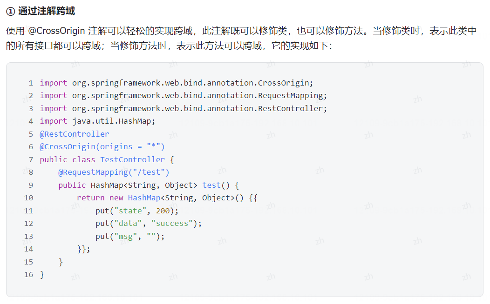
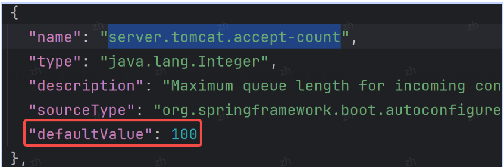

## 1. 说一下什么是IoC? 为什么要使用IoC?

> 控制反转：是什么？作用：1.解耦 2.代码简洁性 3.生命周期管理 4.可重用 5.AOP实现基础

IoC 和 AOP 是 Spring 中最核心的两个概念。
IoC 是 Inversion of Control 的缩写，翻译成中文是”控制反转"的意思，它不是一个具体的技术，而是一个实现对象解耦的思想。
控制反转的意思是将要使用的对象生命周期的控制权进行反转，传统开发是当前类控制依赖对象的生命周期的，现在交给其他人(Spring)，这就是控制(权)反转。

**为什么要使用 IoC?**
使用 IoC 主要是因为 IoC 有以下几个优点

1. **解耦和松散耦合**:IoC 通过将组件之间的依赖关系从代码中分离出来，实现了松散耦合。这意味着组件不需要直接了解它们之间的详细实现，从而提高了代码的可维护性和可重用性。
2. **代码简洁性**:IoC 使你的代码更加专注于业务逻辑，而不需要过多关注依赖的创建和管理。这使得代码更加清晰、简洁和易于理解。
3. **生命周期管理**:IoC 容器可以管理组件的生命周期，确保它们在合适的时间进行创建、初始化和销毁
4. **可重用性**:由于依赖关系由容器管理，可以更容易地将组件在不同的应用程序中重用。
5. A**OP 实现基础**:IoC 是实现 AOP(面向切面编程)的基础，允许你将横切关注点(如日志、安全性)与核心业务逻辑分离。

## 2. IoC如何实现解耦的？
举个例子，比如 A 对象中需要依赖 B对象，需要调用 B中的某个方法，我们通常的实现方法是这样的:

```java
class A {
	public void init(){
		// 调用 B 类中的 init 方法
		B b= new B();
		b.init();
	}
}
class B {
	public B(){
		public void init(){
			system.out.println("你好，世界。");
			}
		}
	}
}
```
然而此时对象 A 和对象 B是存在耦合的，因为一旦修改了 B对象构造方法的参数之后，那么 A 对象里面的写法也要跟着改变，比如当我们将构造方法改为以下代码时:

```java
class B{
	public B(string name){
		System.out.println("姓名:"+ name);
	}
	public void init(){
		System.out.println(“你好，世界。”);
	}
}
```
此时构造方法已经从原本无参构造方法变成了有参的构造方法，这里不考虑构造方法重载的情况，因为实际业务中，很可能是 B类的构造方法写错了，忘记加参数了，于是后面又补充了一个参数，此时是不需要对构造方法进行重载的，那么此时，之前对象 A 里面的调用就会报错，如下图所示:

这就是开发中经常遇到的一个问题，那怎么解决呢?我们可以通过将对象传递而并 new 对象的方式来解决，如下代码所示:

```java
class A {
	// 先定义一个需要依赖的 B对象
	private B b;
	// 通过构造方法实现赋值(初始化)
	public A(B b){
		this.b = b;
	}	
	public void init(){
		// 调用 B 类中的 init 方法
		b.init();
	}
}
class B {
	public B(string name){
		System.out.println("姓名:"+ name);
	}
	public void init(){
		system.out.println("你好，世界。");
	}
}
```
这样改造之后，无论构造方法怎么修改，即使需要加更多的参数，而调用它的 A 类都无需做任何修改，这样就实现了对象的解耦。
## 3. 什么是DI?它和IoC有什么关系?
DI 是 Dependency Injection 的缩写，翻译成中文是“依赖注入"的意思。依赖注入不是一种设计实现，而是一种具体的技术，它是在 IoC 容器运行期间，动态地将某个依赖对象注入到当前对象的技术就叫做 DI(依赖注入)

比如 A对象需要依赖 B对象，那么在 A 运行时，动态的将依赖对象 B 注入到当前类中，而非通过直接 new 的方式获取 B 对象的方式，就是依赖注入。

DI VS IoC
IoC 和 DI虽然定义不同，但它们所做的事情都是一样的，都是用来实现对象解耦的，而二者又有所不同:IoC是种设计思想，而 DI是一种具体的实现技术。

IoC 除了 DI 实现外，还有其他实现方式吗?
IoC 除了 DI依赖注入之外，还可以通过依赖查找(Dependency search)来实现。在 Spring 框架中，依赖查找通过 ApplicationContext 接口的 getBean()方法来实现，如下代码所示:

```java
import org.springframework.context.Applicationcontext;
import org.springframework.context.support.classPathXmlApplicationcontext;
public class App {
	public static void main(string[] args){
		//1.先得到 spring 上下文对
		Applicationcontext context = new classPathXmlApplicationcontext("spring-config.xml");,
		//2.得到 Bean【依赖查找 ->IoC 的一种实现】
		UserService userService =(userService)context.getBean("user");
		//3.使用 Bean 对象(非必须)
		userservice.sayHi();
	}
}
```

## 4. Bean有几种注入方式?它们有什么区别?
Bean 对象有以下 3 种注入方式
1. 属性注入(Field Injection)
2. Setter注入(Setter Injection)
3. 构造方法注入(Constructor Injection)

接下来，我们分别来看

1. 属性注入(Field Injection)

```java
public class FieldInjectionExample {
    @Autowired
    private Dependency dependency;

    public void doSomething() {
        dependency.doSomething();
    }
}
```

**优点:**
- 简单方便，代码量少，易于理解。
- 可以直接在字段上添加注解，不需要额外的构造方法或setter方法。

**缺点:**
- 功能性问题:无法注入一个不可变的对象(final 修饰的对象)
- 通用性问题:只能适应于 IoC 容器，Idea 也会提示你，不建议使用
2. Setter注入(Setter Injection)

```java
public class SetterInjectionExample {
    private Dependency dependency;

    @Autowired
    public void setDependency(Dependency dependency) {
        this.dependency = dependency;
    }

    public void doSomething() {
        dependency.doSomething();
    }
}
```

**优点:**
- Setter 优点是它符合单一职责的设计原则，因为每一个 Setter 只针对一个对象。

**缺点:**
1. 不能注入不可变对象(final 修饰的对象)
2. 注入的对象可调用多次，也就是注入对象会被修改。


3. **构造方法注入(Constructor Injection)**

```java
public class ConstructorInjectionExample {
    private Dependency dependency;

    @Autowired
    public ConstructorInjectionExample(Dependency dependency) {
        this.dependency = dependency;
    }

    public void doSomething() {
        dependency.doSomething();
    }
}
```

**优点:**
1. 可注入不可变对象。
2. 注入对象不会被修改
3. 注入对象会被完全初始化。
4. 通用性更好。

**缺点:**
- 构造方法注入的唯一缺点就是没有属性注入写法简单。

在选择依赖注入方式时，可以根据项目的实际情况和需求来决定使用哪种方式。属性注入简单方便，适用于简单的场景；Setter注入灵活性较高，适用于需要动态更改依赖的场景；构造方法注入保证了依赖的初始化顺序，适用于需要严格控制依赖关系的场景。
## 5. @Autowired和@Resource有什么区别?
@Autowired 和 @Resource 都是用来实现依赖注入的注解(在 Spring/Spring Boot 项目中)，但二者有以下几点不同:
1. **来源不同**:@Autowired 来自 Spring 框架，而 @Resource 来自于 Java
2. **依赖查找的顺序不同**:@Autowired 先根据类型再根据名称查询，而 @Resource 先根据名称再根据类型香询
3. **支持的参数不同**:@Autowired 只支持设置1个 required 参数，而 @Resource 支持设置多个参数(name.3 .type 等)
4. **依赖注入的用法支持不同**:@Autowired 既支持构造方法注入，又支持属性注入和 Setter 注入，而@Resource 只支持属性注入和 Setter 注入。

## 6. 什么是AOP?它有哪些使用场景?
**AOP (Aspect-OrientedProgramming，面向切面编程)可以说是 OOP(Object-Oriented Programing，面向对象编程)的补充和完善**，OOP 引入封装、继承和多态性等概念来建立一种公共对象处理的能力，当我们需要外理公共行为的时候，OOP 就会显得无能为力，而 AOP 的出现正好解决了这个问题。比如统一的日志处理模块、授权验证模块等都可以使用 AOP 很轻松的处理。

AOP 优点主要有以下几个:
1. 集中处理某一类问题，方便维护。
2. 逻辑更加清晰
3. 降低模块间的耦合度。

AOP 常见使用场景有以下几个:

1. 用户登录和鉴权。
2. 统一日志记录。
3. 统一方法执行时间统计。
4. 统一的返回格式设置。
5. 统一的异常处理。
6. 声明式事务的实现。
## 7. AOP是如何组成的？有几种增强的方法？
AOP 是由:切面(Aspect)、切点(Pointcut)、通知(Advice)和连接点(Join Point)组成的，它们的具体含义如下。

**①切面(Aspect)**
切面(Aspect)：由切点(Pointcut)和通知(Advice)组成，它既包含了横切逻辑的定义，也包括了连接点的定义。
简单来说，切面就是当前 AOP 功能的类型，比如当前 AOP 是用户登录和鉴权的功能，那么它就是一个切面。

**② 切点(Pointcut)**
切点 Pointcut:它的作用就是提供一组规则(使用 Aspect] pointcut expression language 来描述)用来匹配连接点的。
简单来说，切点就是设置拦截规则的，满足规则的方法将会被拦截。

**③通知(Advice)**
切面也是有目标的 一它必须完成的工作。在 AOP 术语中，切面的工作被称之为通知。简单来说，当控制器(方法)被拦截之后，触发执行的具体方法就是通知。

**④连接点(Join Point)**
连接点是指在应用程序执行过程中可以被拦截的特定点。换句话说，连接点是在程序执行过程中的某个特定位置它可以是方法调用、方法执行、异常抛出等。

连接点是 AOP 中的基本单位，它代表了一个可以被切面拦截的位置，允许在这些位置插入额外的逻辑。切面可以通过连接点来捕获并应用它们的横切关注点(如日志、事务、安全性等)。
在 Spring AOP 中，一些连接点包括:
- 方法调用:当一个方法被调用时，连接点发生
- 方法执行:当一个方法的实际代码开始执行时，连接点发生
- 异常抛出:当方法抛出异常时，连接点发生。
- 字段访问:当访问一个类的字段时，连接点发生。

连接点通过一个表示方法或其他事件的点来标识。例如，表达式execution(*com.example.Service.dosomething(..)表示在 com,example.Service 类的 doSomething 方法被调用或执,行时的连接点。

连接点是实现 AOP 的基础，允许切面在特定位置插入增强逻辑，从而实现横切关注点的功能。切面可以选择在哪些连接点上应用，以便将适当的逻辑织入到应用程序的执行流程中。


**增强方法：**
AOP 的增强方法也就是 Advice 通知，Spring AOP 总共有以下 5 种通知类型:
1. 前置通知:使用 @Before 实现，通知方法会在目标方法调用之前执行,
2. 后置通知:使用 @After 实现，通知方法会在目标方法返回或者抛出异常后调用;
3. 返回通知:使用 @AfterReturning 实现，通知方法会在目标方法返回后调用;)
4. 抛出异常通知:使用 @AfterThrowing 实现，通知方法会在目标方法抛出异常后调用;
5. 环绕通知:使用 @Around 实现，通知包裹了被通知的方法，在被通知的方法通知之前和调用之后执行自定义的行为。

Spring AOP 中常见的五种通知包括前置通知（Before advice）、后置通知（After returning advice）、环绕通知（Around advice）、异常通知（After throwing advice）和最终通知（After advice）。下面我将为你展示这五种通知的代码使用示例：

1. 前置通知（Before advice）：
```java
import org.aspectj.lang.annotation.Aspect;
import org.aspectj.lang.annotation.Before;
import org.springframework.stereotype.Component;

@Aspect
@Component
public class MyAspect {

    @Before("execution(* com.example.service.*.*(..))")
    public void beforeAdvice() {
        System.out.println("前置通知：方法执行前");
    }
}
```

2. 后置通知（After returning advice）：
```java
import org.aspectj.lang.annotation.AfterReturning;
import org.springframework.stereotype.Component;

@Aspect
@Component
public class MyAspect {

    @AfterReturning(pointcut = "execution(* com.example.service.*.*(..))", returning = "result")
    public void afterReturningAdvice(Object result) {
        System.out.println("后置通知：方法执行后，返回结果为 " + result);
    }
}
```

3. 环绕通知（Around advice）：
```java
import org.aspectj.lang.ProceedingJoinPoint;
import org.aspectj.lang.annotation.Around;
import org.springframework.stereotype.Component;

@Aspect
@Component
public class MyAspect {

    @Around("execution(* com.example.service.*.*(..))")
    public Object aroundAdvice(ProceedingJoinPoint joinPoint) throws Throwable {
        System.out.println("环绕通知：方法执行前");
        Object result = joinPoint.proceed();
        System.out.println("环绕通知：方法执行后");
        return result;
    }
}
```

4. 异常通知（After throwing advice）：
```java
import org.aspectj.lang.annotation.AfterThrowing;
import org.springframework.stereotype.Component;

@Aspect
@Component
public class MyAspect {

    @AfterThrowing(pointcut = "execution(* com.example.service.*.*(..))", throwing = "ex")
    public void afterThrowingAdvice(Exception ex) {
        System.out.println("异常通知：方法抛出异常，异常信息为 " + ex.getMessage());
    }
}
```

5. 最终通知（After advice）：
```java
import org.aspectj.lang.annotation.After;
import org.springframework.stereotype.Component;

@Aspect
@Component
public class MyAspect {

    @After("execution(* com.example.service.*.*(..))")
    public void afterAdvice() {
        System.out.println("最终通知：方法执行结束");
    }
}
```

以上是五种常见通知的代码使用示例，你可以根据自己的需求选择合适的通知类型来实现 AOP 功能。
## 8. AOP的底层如何实现的？

Spring 中的 AOP 底层是通过代理来实现的，而 Spring 中使用了以下两种代理:
1. JDK 动态代理:对于实现了接口的目标类，Spring 使用 Java 提供的 java.lang.reflect.Proxy 类来创建代理对象。它要求目标类实现至少一个接口，并通过接口生成代理对象，代理对象实现了相同的接口，并且调用代理方法时会触发代理处理器的逻辑。JDK动态代理底层又是通过反射实现的
2. CGLib 代理:对于没有实现接口的目标类，Spring 使用 CGLIB 来创建代理对象。CGLIB 会生成目标类的子类2作为代理，重写方法并在方法前后插入切面逻辑。CGLib 底层是通过生成目标类的字节码来实现的。
## 9. JDK动态代理和CGLib动态代理的区别？
JDK 动态代理(JDK Proxy)和 CGLib 都是 Spring 中用于实现 AOP 的代理技术，但它们存在以下区别:
1. **来源不同**:JDK Proxy 是 Java 语言自带的功能，无需通过加载第三方类实现。Java 对 JDK Proxy 提供了稳定的支持，并且会持续的升级和更新 JDK Proxy，例如 Java8 版本中的 JDK Proxy 性能相比于之前版本提升了很多;而 CGLib 是第三方提供的工具，基于 ASM(一个字节码操作框架)实现的。
2. **使用场景不同**:JDK Proxy 只能代理实现了接口的类，而 CGLib 无需实现接口，它是通过实现目标类的子类来2完成调用的，所以要求被代理类不能被 final 修饰。
3. **性能不同**:JDK Proxy 在 JDK7之前性能远不如 CGLib，但 JDK7之后(JDK7和JDK8都有优化)JDK Proxy 性能就略高于 CGLib 了。

小结:JDK Proxy 是 Java 自带的，在 JDK 高版本性能比较高的动态代理工具，但它要求被代理类必须要实现接口，它的性能在 JDK7之后也略高于 CGLib;而 CGLib 是基于字节码技术实现的第三方动态代理，它是通过生成代理对象的子类来实现代理的，所以要求被代理类不能被 final 修饰。
## 10. Spring默认动态代理是JDKProxy还是CGLib?
Spring默认使用JDK动态代理来实现AOP（面向切面编程），但是当目标类没有实现接口时，Spring会使用CGLib来创建代理对象。JDK动态代理基于接口，而CGLib基于继承。
## 11. SpringBoot默认动态代理是JDKProxy还是CGLib?

SpringBoot 默认使用 JDK 动态代理来创建代理对象。当目标类实现了接口时，Spring 会使用 JDK 动态代理来生成代理对象；当目标类没有实现接口时，Spring 会使用 CGLib 动态代理来生成代理对象。


## 12. BeanFactory和FactoryBean有什么区别?
Beanfactory 和 FactoryBean 完全不同的两个接口，BeanFactory 是用来管理 Bean 对象的，而 FactoryBean本质上一个 Bean，也归 BeanFactory 管理，但使用 FactoryBean 可以来创建普通的 Bean 对象和 AOP 代理对象，它们具体区别如下：
**① BeanFactory**
Beanfactory 是 Spring 框架的核心接口之一，它是一个工厂模式的实现，负责管理 bean 的生命周期、创建和销毁等操作。BeanFactory 提供了各种方法来获取 bean，包括按名称获取、按类型获取等。
其中，==ApplicationContext 就是 BeanFactory 的子类，咱们通常会使用 ApplicationContext 来获取某个 Bean==:
BeanFactory 使用示例:

```java
1. 创建BeanFactory容器
BeanFactory beanfactory = new XmlBeanfactory(new classPathResource("applicationcontext.xml"))
3. 获bean实例
YourBean yourBean =(YourBean)beanFactory.getBean("yourBeanName");
```
FactoryBean
它是一个 Bean，但又不仅仅是一个普通的 Bean，它是一个能生成 Bean 对象的工厂它的使用示例如下:

FactoryBean是Spring框架中用于生成bean对象的接口，可以自定义生成bean对象的逻辑。以下是一个简单的示例代码，演示如何使用FactoryBean生成bean对象：

```java
import org.springframework.beans.factory.FactoryBean;

public class MyBeanFactory implements FactoryBean<MyBean> {

    @Override
    public MyBean getObject() throws Exception {
        // 在这里编写生成bean对象的逻辑
        MyBean myBean = new MyBean();
        // 可以进行一些初始化操作
        return myBean;
    }

    @Override
    public Class<?> getObjectType() {
        return MyBean.class;
    }

    @Override
    public boolean isSingleton() {
        return true; // 返回true表示生成的bean是单例的
    }
}
```

在上面的代码中，我们自定义了一个MyBeanFactory类实现了FactoryBean接口，并指定了泛型为MyBean，其中getObject()方法用于生成bean对象的逻辑，getObjectType()方法返回生成的bean对象的类型，isSingleton()方法返回生成的bean对象是否是单例的。

在Spring配置文件中，可以通过如下方式配置使用MyBeanFactory生成bean对象：

```xml
<bean id="myBean" class="com.example.MyBeanFactory"/>
```

这样在Spring容器启动时，会调用MyBeanFactory的getObject()方法生成MyBean对象，并将其注册到容器中，可以通过id为myBean来获取该bean对象。
## 13. Bean是线程安全的吗?实际工作中怎么保证其线程安全?
**默认情况下，Bean 是非线程安全的**。因为默认情况下 Bean 的作用域是单例模式，那么此时，所有的请求都会共享同一个 Bean 实例，这意味着如果这个 Bean 实例在多线程下，被同时修改(成员变量)时，就可能出现线程安全问题。
> Bean 的作用域(Scope)指的是确定在应用程序中创建和管理 Bean 实例的范围。也就是在 Spring 中，可以通过指定不同的作用域来控制 Bean 实例的生命周期和可见性。例如，单例模式就是所有线程可见并共享的，而原型模式则是每次请求都创建一个新的原型对象。

**单例Bean一定是非线程安全的吗?**
并不是，单例 Bean 分为以下两种类型:
1. 无状态 Bean(线程安全):Bean 没有成员变量，或多线程只会对 Bean 成员变量进行查询操作，不会修改操作。
2. 有状态 Bean(非线程安全):Bean 有成员变量，并且并发线程会对成员变量进行修改操作。所以说:有状态的单例 Bean 是非线程安全的，而无状态的 Bean 是线程安全的。但在程序中，只要有一种情况会出现线程安全问题，那么它的整体就是非线程安全的，所以总的来说，单例Bean 还是非线程安全的。

**如何保证线程安全?**
想要保证有状态 Bean 的线程安全，可以从以下几个方面来实现:

1. 使用 ThreadLocal(线程本地变量):每个线程修改自己的变量，就没有线程安全问题了
2. 使用锁机制:例如 synchronized 或 ReentrantLock 加锁修改操作保证线程安全。
3. 设置 Bean 为原型作用域(Prototype):将 Bean 的作用域设置为原型，这意味着每次请求该 Bean 时都创建一个新的实例，这样可以防止不同线程之间的数据冲突，不过这种方法增加了内存消耗。
4. 使用线程安全容器:例如使用 Atomic 家族下的类(如 AtomicInteger)来保证线程安全，此实现方式的本质是通过锁机制来保证线程安全的，Atomic 家族底层是通过乐观锁 CAS(Compare And Swap，比较并替换)保证线程安全的。

**实际工作中会使用哪种方案来保证Bean的线程安全?**
实际工作中，通常会根据具体的业务场景来选择合适的线程安全方案，但是以上解决线程安全的方案中ThreadLocal 和原型作用域会使用更多的资源，占用更多的空间来保证线程安全，所以在使用时通常不会作为最佳考虑方案。
而锁机制和线程安全的容器通常会优先考虑，但需要注意的是 AtomicInteger 底层是乐观锁 CAS 实现的，因此它存在乐观锁的典型问题 ABA 问题(如果有状态的 Bean 中既有 ++ 操作，又有 - 操作时，可能会出现 ABA 问题)，此时就要使用锁机制，或 AtomicStampedReference 来解决 ABA 问题了
## 14. 说一下Bean的生命周期?
Bean 生命周期是指其在 Spring 容器中从创建到销毁的过程。

所以从以上源码也可以看出 Bean 的大致生命周期为:实例化 -> 属性赋值 -> 初始化…。Bean 生命周期主要会经历以下几个阶段:
1. 实例化(Instantiation):从无到有，为 Bean 分配内存空间，调用 Bean 的构造方法
2. 属性赋值(Populate Properties):在创建实例后，Spring 将会通过依赖注入(DI)的方式将 Bean 的属性赋值。
3. 初始化(Initialization):初始化阶段主要有以下 3 个步骤:
   - 初始化前置处理:在 Bean 的初始化之前，会调用所有实现了BeanPostProcessor 接口的类的postProcessBeforeInitialization 方法。
   - 初始化方法调用:如果在 Bean 上定义了初始化方法，通过 @PostConstruct 注解或实现了 InitializingBean接口。
   - 初始化后置处理:在 Bean 的初始化之后，会调用所有实现了 BeanPostProcessor 接口的类的postProcessAfterInitialization 方法。
4. 使用(Using):在初始化之后，Bean 可以被使用。在这个阶段，Bean 执行它的业务逻辑
5. 销毁(Destruction):销毁 Bean 实例。

## 15. Spring如何解决循环依赖问题?什么是三级缓存?为什么一定要用三级缓存?

> 三级缓存的原因是：spring循环依赖问题
>
> 一级：就是ioc容器
>
> 二级：半成品
>
> 三级：代理对象

循环依赖问题指的是在对象之间存在相互依赖关系，形成一个闭环，==导致无法准确地完成对象的创建和初始化==。当两个或多个对象彼此之间相互引用，而这种相互引用形成一个循环时，就可能出现循环依赖问题。例如以下这两种情况:
如何解决循环依赖?
Spring 是通过三级缓存来解决循环依赖问题的，所谓的三级缓存，其实就是 Spring 中定义的三个 Map 集合，源码如下图所示:
这三个级别的缓存分别是:

1. **单例对象缓存**(singletonObjectCache):Spring 中的一级缓存，用于存储完全创建好的单例 bean 对象。在创建单例 bean 时，如果 bean 的依赖对象已经在缓存中，则直接从缓存中获取，避免重复创建。
2. **提前暴露的对象缓存**(earlySingletonObjects):Spring 中的二级缓存，用于存储已经创建但还未完全初始化的 bean 对象。在循环依赖解决过程中，当一个 bean 创建过程中需要引用另一个正在创建的 bean,Spring 将创建一个未完全初始化的对象，并将其放入提前暴露的对象缓存中，以便其他 bean 可以引用它
3. **代理对象缓存**(singletonFactory):Spring 中的三级缓存，用于存储单例 bean 的创建工厂。当一个单例bean 被创建时，Spring 会先将该 bean 的创建工厂存储到 singletonFactories 中，然后再执行创建工厂的getObject()方法，生成该 bean 的实例对象。在该 bean 被其他 bean 引用时，Spring 会从创建出该 bean 的实例对象，并将该 bean 的实例对象存储到sinqletonFactories 中获取该bean的创建厂，singletonObiects中

**为什么一定要使用三级缓存?**
- 首先，一级缓存一定是要的，因为 Bean 是单例模式，需要存放到某个容器中，而一级缓存就是这个缓存容器。二级缓存可以不要，我们可以把半成品 Bean(提前暴露的 Bean)放到一级缓存中，但这样需要给一级缓存中添加标识，标识那些是完整对象，那些是半成品对象，这样有几个问题:
   - 增加了 Spring(源码)设计的复杂性。
   - 在查询时，需要先判断标识，查询效率变低了。
   - 违反单一设计原则。

- 因此为了解决这些个问题，，二级缓存也是必须要的，
- 三级缓存也可以不要，但这样也有一个问题，那就是 Spring 的设计模式中，它==在生成代理时，为了实现对象初始化和生成代理对象的解耦，所以代理对象是在 AnnotationAwareAspect]AutoProxyCreator 这个后置处理器的最后一步生成 AOP 代理对象的==。如果不要三级缓存，那么我们需要在所有类创建之前，先将代理类创建出来这样在遇到循环依赖就可以直接拿出代理对象来使用了，但这种方式的缺点是打破了原来 Spring 的设计理念(实现对象初始化和生成代理对象的解耦)。
所以最优的方案是，不提前创建代理对象，而是使用三级缓存存储创建对象的表达式，等遇到循环依赖，再按照 Spring 的设计模式来生成代理对象。

所以，综合来看，Spring 使用三级缓存并非必须之举，但使用三级缓存是 Spring 解决循环依赖的最优解决方案它能保证高效性和模式上的统一性。

## 16. Spring中使用了哪些设计模式?
Spring 中常用的设计模式有以下几个:
1. **工厂模式**:Spring 通过 Beanfactory 接口及其实现类如 ApplicationContext 等，为应用程序提供了一个统的 bean 工厂，负责创建和管理各种 bean 对象。
2. **单例模式**:Spring 默认将所有 bean 声明为单例。当容器启动时，每个 bean 只会被初始化一次，后续对同一bean 的所有请求都会返回相同的实例。例如，通过 SingletonBeanRegistry 接口保证单例 bean 在整个应用上下文中只存在一个实例。
3. **代理模式**:Spring AOP(面向切面编程)大量使用了代理模式。它利用 JDK 动态代理或 CGLIB 库生成代理对象，实现代理功能以添加额外的横切关注点，如事务处理、日志记录、权限控制等。
4. **观察者模式**:Spring 事件驱动模型实现了观察者模式，通过 ApplicationEventPublisher 发布和监听事件，例如 ContextRefreshedEvent、SessionDestroyedEvent 等,
5. **策略模式**:Spring 框架中的资源加载(Resource)就是一个策略模式的例子。根据不同的资源路径，Spring 会选择合适的策略(如 ClassPathResource、FileSystemResource 等)进行资源加载。
6. **装饰器模式**:Spring MVC 的拦截器 Interceptor 可以看作是一种装饰器模式的应用，它允许我们包装HandlerExecutionChain，在执行处理器方法前后插入自定义行为。
7. **适配器模式**:Spring 通过适配器模式整合不同类型的组件，比如对第三方数据源的连接池(如 DBCPHikariCP 等)进行了适配，使其能够与 Spring 容器无缝集成。
8. **模板方法模式**:在 Spring JDBC 等模块中，提供了如 ]dbcTemplate 这样的模板类，它们封装了通用的数据访R.问逻辑，而具体的操作由用户提供的 SQL 来实现。
## 17. Spring和SpringBoot有什么区别?

**Spring 为 Java 程序提供了全面的基础架构支持**，包含了很多非常实用的功能，如 Spring JDBC、Spring AOP、Spring ORM、Spring Test 等，这些模块的出现，大大的缩短了应用程序的开发时间，同时提高了应用开发的效率。

Spring Boot 本质上是 Spring 框架的延伸和扩展，它的诞生是为了简化 Spring 框架初始搭建以及开发的过程，使用它可以不再依赖 Spring 应用程序中的 XML 配置，为更快、更高效的开发 Spring 提供更加有力的支持。

所以，一句话总结:Spring 简化了 Java 程序的开发，而 Spring Boot 简化了 Spring 的开发Spring 和 Spring Boot 的区别就像，自己做菜需要买各种原料(类似 Spring)，而预制菜(半成品)只需要加热炒熟(类似于 Spring Boot)一样。
## 18. Spring Boot有什么优点?
Spring Boot 是一种用于快速构建 Spring 应用程序的框架，它主要优点有以下几个:
1. 简化配置:Spring Boot 自动进行配置，大大减少了繁琐的配置工作。通过约定优于配置的原则，很多配置可以自动推断，让开发人员专注于业务逻辑。
2. 快速开发:Spring Boot 提供了 Starter 包，内置了常用的依赖和配置，让你可以快速搭建项目，减少了开发时间。
3. 独立运行:Spring Boot 应用可以以独立的方式运行，不需要部署到传统的应用服务器中，只需执行一个可执行的 JAR 或 WAR 文件。
4. 内置服务器:Spring Boot 内置了多种常用的 Web 服务器(如 Tomcat、Jetty、Undertow)，方便开发和测试。
5. **自动装配**:Spring Boot 根据项目的依赖和设置，自动装配应用程序的各个组件，减少了手动配置的工作。

## 19. 什么是自动装配? 举例说明一下?

Spring Boot 的自动装配(Auto-Confiquration)是指在应用程序启动时，==根据类路径下的依赖、配置文件以及预定义的规则==，自动配置和初始化 Spring 应用程序中的各种组件、模块和功能的过程。
>这种自动配置机制大大减少了开发人员手动配置的工作，使得开发者可以更专注于业务逻辑的实现，同时提供了更高效、快速的应用程序启动和开发体验。

例如，在 Spring 我们需要手动设置数据库的连接 URL、用户名、密码等参数，并将其实例化为一个 Bean，如下代码是所示:

```java
import javax.sql.Datasource;import org.apache.commons.dbcp2.BasicDatasource;import org.springframework.context.annotation.Bean;import org.springframework.context.annotation.configuration;@configuration
public class Databaseconfig {
@Bean
public Datasource datasource(){
BasicDataSource datasource =new BasicDatasource();datasource.seturl("jdbc:mysql://localhost:3306/mydb");datasource.setUsername("username");datasource.setPassword("password");return datasource;
```
而在 Spring Boot 中，虽然我们只需要通过 application.properties 或 application.ym| 文件配置数据源信息Spring Boot 就会自动根据这些属性生成 DataSource Bean，而无需手动配置。application.properties 示例配置如下:

```
spring.datasource.url=jdbc:mysql://localhost:3306/mydb
spring.datasource.username=username’
3spring.datasource.password=passwora
spring.datasource.driver-class-name=com.mysql.cj.jdbc.Driver“
```

## 20. 说一下自动装配的执行流程? 
Spring Boot 自动装配执行流程如下:
1. **启动应用程序**:当你启动 Spring Boot 应用程序时(标识了 @SpringBootApplication 的类)，Spring Boot 会自动扫描类路径下的各种依赖和组件。
2. **自动配置类扫描**:Spring Boot 会自动扫描类路径下的 META-INF/spring.factories 文件，该文件中定义了各种自动配置类的类名。
3. **条件化装配**:在扫描到自动配置类后，Spring Boot 会根据条件判断是否需要进行装配。每个自动配置类都会有组条件，比如是否存在某个特定的类、是否存在某个属性值等。如果满足条件，该自动配置类将被装配。
4. **自动配置 Bean 创建**:一旦条件满足，Spring Boot 会自动创建相应的 Bean。这些 Bean 可能包括数据库连接池、缓存配置、Web 组件、消息队列等。
5. **覆盖默认配置**:在自动配置完成后，你可以通过在应用的配置文件中自定义配置属性来覆盖默认的自动配置。
6. **启动应用程序上下文**:在整个装配过程完成后，Spring Boot 将启动应用程序上下文，所有的自动配置和手动配置的 Bean 都会被加载到上下文中。
7. **应用程序运行**:应用程序上下文准备好后，应用程序会正常运行，你可以通过注入 Bean 来使用自动配置提供的功能。

## 21. SpringBoot如何实现缓存预热?

Spring Boot 实现缓存预热的原理是在应用启动的时候，提前加载一部分数据到缓存中，以提高后续访问的性能。这样可以避免在第一次访问时因为缓存为空而导致性能下降的情况。

在 Spring Boot 中，实现缓存预热可以通过以下几种方式：

1. 使用 ApplicationRunner 或 CommandLineRunner 接口：通过实现 ApplicationRunner 或 CommandLineRunner 接口，在应用启动时执行一些初始化操作，包括加载数据到缓存中。在 run 方法中编写加载数据到缓存的逻辑即可。

```java
@Component
public class CachePreheat implements ApplicationRunner {

    @Autowired
    private CacheManager cacheManager;

    @Override
    public void run(ApplicationArguments args) throws Exception {
        Cache cache = cacheManager.getCache("myCache");
        // 加载数据到缓存中
        cache.put("key1", "value1");
        cache.put("key2", "value2");
    }
}
```

2. 使用 @PostConstruct 注解：在需要预热缓存的类中，可以使用 @PostConstruct 注解标记一个方法，在该方法中加载数据到缓存中。这样在该类实例化时，会自动执行该方法。

```java
@Component
public class CacheService {

    @Autowired
    private CacheManager cacheManager;

    @PostConstruct
    public void preheatCache() {
        Cache cache = cacheManager.getCache("myCache");
        // 加载数据到缓存中
        cache.put("key1", "value1");
        cache.put("key2", "value2");
    }
}
```

3. 使用 @EventListener 注解：通过监听应用启动事件，在事件处理方法中加载数据到缓存中。可以使用 ContextRefreshedEvent 事件来监听应用启动事件。

```java
@Component
public class CachePreheatListener {

    @Autowired
    private CacheManager cacheManager;

    @EventListener
    public void handleContextRefresh(ContextRefreshedEvent event) {
        Cache cache = cacheManager.getCache("myCache");
        // 加载数据到缓存中
        cache.put("key1", "value1");
        cache.put("key2", "value2");
    }
}
```

以上是几种在 Spring Boot 中实现缓存预热的方式，开发者可以根据具体需求选择合适的方式来实现缓存预热。
## 22. Spring Boot中的常用注解有哪些?
Spring Boot 中的常用注解有很多，比如以下这些:
1. @SpringBootApplication: 标记一个主要的 Spring Boot 应用的启动类。
2. @Controller: 将类标记为控制器，处理 HTTP 请求。
3. @RestController: 类似于 @Controller，但是它还将返回的对象自动转换为 JSON 格式。
4. @RequestMapping: 用于映射 HTTP 请求到具体的处理方法。@GetMapping、@PostMapping、@PutMapping、@DeleteMapping: 用于分别处理 GET、POST、PUT、DELETE 请求。
5. @RequestParam :用于将请求参数绑定到处理方法的参数上
6. @PathVariable: 用于将 URL 路径变量绑定到处理方法的参数上。
7. @RequestBody: 用于将请求体绑定到处理方法的参数上。
8. @Autowired: 用于自动装配依赖关系，通过类型进行依赖注入。
9. @Qualifier: 与 @Autowired 一起使用，指定注入的具体实现。
10. @Value: 用于注入配置属性值。
11. @Component: 将类标记为 Spring 容器的组件
12. @Service: 将类标记为服务层组件。
13. @Repository: 将类标记为数据访问层组件。
14. @Configuration: 标记类为配置类，用于定义配置项。
15. @Bean: 在配置类中使用，用于声明一个 Bean 对象。

## 23. 如何实现自定义注解?实际工作中哪里会用到自定义注解?

自定义注解可以标记在方法上或类上，用于在编译期或运行期进行特定的业务功能处理。在 Java 中，自定义注解使用 @interface 关键字来定义，它可以实现如:日志记录、性能监控、权限校验等功能。

自定义注解实现方式
在 Spring Boot 中实现一个自定义注解可以通过以下两种方式实现:
1. 通过 AOP(面向切面编程)实现。
2. 通过拦截器(Interceptor)实现。

AOP 实现自定义注解
下面我们先使用 AOP 的方式来实现一个打印日志的自定义注解，"它的实现步骤如下:
1. 添加 Spring AOP 依赖。
2. 创建自定义注解。
3. 编写 AOP 拦截(自定义注解)的逻辑代码。
4. 使用自定义注解。

具体实现如下
① 添加 Spring AOP 依赖
在 pom.xml 中添加如下依赖:

```xml
<dependencies>
<!--Spring Aop dependency -->
<dependency><groupId>org.springframework.boot</groupId><artifactId>spring-boot-starter-aop</artifactId></dependency>
</dependencies>
```
② 创建自定义注解
创建一个新的 Java 注解类，通过 @interface 关键字来定义，并可以添加元注解以及属性,

```java
import java.lang.annotation.*;
@Target(ElementType.METHOD)
@Retention(RetentionPolicy.RUNTIME)
public @interface customLogAnnotation {
	String value() default "";
	boolean enable() default true;
}
```
在上面的例子中，我们定义了一个名为 CustomLogAnnotation 的注解，它有两个属性:value 和 enable，分别设置了默认值。
- @Target(ElementType.METHOD)指定了该注解只能应用于方法级别。
- @Retention(RetentionPolicy,RUNTIME)表示这个注解在运行时是可见的，这样 AOP 代理才能在运行时读取到这个注解。

③ 编写 AOP 拦截(自定义注解)的逻辑代码
使用 Spring AOP 来拦截带有自定义注解的方法，并在其前后执行相应的逻辑。

```java
import org.aspectj.lang.ProceedingJoinPoint;
import org.aspectj.lang.annotation.Around;
import org.aspecti.lang.annotation.Aspect;
import org.springframework.stereotype.component;
@Aspect
@component
public class customLogAspect{
@Around("@annotation(customLog)")
public object logAround(ProceedingJoinPoint joinPoint, customLogAnnotation customLog)thrif(customLog.enable()){
//方法执行前的处理
System.out.printIn("Before method execution:" + joinPoint.getsignature().getNamelong start =system.currentTimeMillis();
// 执行目标方法
object result = joinPoint.proceed();
// 方法执行后的处理
long elapsedTime =system.currentTimeMillis()- start;
System.out.println("After method execution("+ elapsedTime +"ms):" + customLog.value());
return result;
} else {
return joinPoint.proceed();
```
4 使用自定义注解
将自定义注解应用于需要进行日志记录的方法上，如下代码所示:


**实际工作中哪里会用到自定义注解?**
实际工作中我们通常会使用自定义注解来实现如权限验证，或者是幂等性判断等功能。
幂等性判断是指在分布式系统或并发环境中，对于同一操作的多次重复请求，系统的响应结果应该是一致的。简而言之，无论接收到多少次相同的请求，系统的行为和结果都应该是相同的。

要配合 Java 和 Redis 实现自定义幂等性注解，你可以按照以下步骤进行：

1. 首先，定义一个自定义的幂等性注解，比如 `Idempotent`，可以使用 Java 的注解来实现：

```java
import java.lang.annotation.ElementType;
import java.lang.annotation.Retention;
import java.lang.annotation.RetentionPolicy;
import java.lang.annotation.Target;

@Retention(RetentionPolicy.RUNTIME)
@Target(ElementType.METHOD)
public @interface Idempotent {
}
```

2. 创建一个切面类，用于处理幂等性逻辑，比如检查 Redis 中是否存在对应的幂等性标识：

```java
import org.aspectj.lang.ProceedingJoinPoint;
import org.aspectj.lang.annotation.Around;
import org.aspectj.lang.annotation.Aspect;
import org.springframework.beans.factory.annotation.Autowired;
import org.springframework.data.redis.core.RedisTemplate;

@Aspect
public class IdempotentAspect {

    @Autowired
    private RedisTemplate<String, String> redisTemplate;

    @Around("@annotation(Idempotent)")
    public Object idempotentCheck(ProceedingJoinPoint joinPoint) throws Throwable {
        // 获取方法名或其他标识作为幂等性标识
        String idempotentKey = generateIdempotentKey(joinPoint);

        // 检查 Redis 中是否存在该幂等性标识
        if (redisTemplate.opsForValue().setIfAbsent(idempotentKey, "true")) {
            try {
                // 执行方法
                return joinPoint.proceed();
            } finally {
                // 执行完毕后删除幂等性标识
                redisTemplate.delete(idempotentKey);
            }
        } else {
            // 幂等性校验失败，返回错误信息或抛出异常
            throw new RuntimeException("Duplicate request detected");
        }
    }

    private String generateIdempotentKey(ProceedingJoinPoint joinPoint) {
        // 可以根据方法名、参数等生成唯一的幂等性标识
        // 这里简单地以方法名作为幂等性标识
        return joinPoint.getSignature().toLongString();
    }
}
```

3. 在 Spring Boot 配置类中将切面类注册为 Bean，并配置 RedisTemplate：

```java
import org.springframework.context.annotation.Bean;
import org.springframework.context.annotation.Configuration;
import org.springframework.data.redis.connection.RedisConnectionFactory;
import org.springframework.data.redis.core.RedisTemplate;
import org.springframework.data.redis.serializer.StringRedisSerializer;

@Configuration
public class RedisConfig {

    @Bean
    public RedisTemplate<String, String> redisTemplate(RedisConnectionFactory redisConnectionFactory) {
        RedisTemplate<String, String> redisTemplate = new RedisTemplate<>();
        redisTemplate.setConnectionFactory(redisConnectionFactory);
        redisTemplate.setKeySerializer(new StringRedisSerializer());
        redisTemplate.setValueSerializer(new StringRedisSerializer());
        return redisTemplate;
    }

    @Bean
    public IdempotentAspect idempotentAspect() {
        return new IdempotentAspect();
    }
}
```

4. 在需要实现幂等性的方法上添加 `@Idempotent` 注解即可：

```java
@Idempotent
public void processOrder(Order order) {
    // 处理订单逻辑
}
```

这样，当方法被调用时，切面会检查 Redis 中是否存在对应的幂等性标识，如果不存在则执行方法逻辑，并在方法执行完毕后删除幂等性标识，确保方法的幂等性。

## 24. 如何实现一个拦截器?

1. HandleIntorcepetor
2. prehandle方法 注入拦截器并且配置拦截路径

## 25. 说一下拦截器的实现原理?

Spring Boot 拦截器是基于 Servlet 规范实现的，通过实现 HandlerInterceptor 接口来实现拦截器功能。也就是说拦截器的实现主要是依赖 Servlet 或 Spring 执行流程来进行拦截和功能增强的，而非动态代理实现。在 Spring Boot 框架的执行流程中，拦截器被注册在 **DispatcherServlet 的 doDispatch()方法中，该方法是 SpringBoot 框架的核心方法，用于处理请求和响应。**
**程序每次执行时都会调用 doDispatch()方法时，并验证拦截器(链)，**之后再根据拦截器返回的结果，进行下一步的处理。如果返回的是 true，那么继续调用目标方法，反之则会直接返回验证失败给前端。doDispatch 源码实现如下:

## 26. 如何实现过滤器?

滤器(Filter)是一种常见的 Web 组件，用于在 Servlet 容器中对请求和响应进行预处理和后处理。过滤器提供了一种在请求和响应的处理链上干预和修改数据的机制，可以用于实现一些与应用程序业务逻辑无关的通用功能.。过滤器可以使用 Servlet 3.0 提供的 @Webfilter 注解，配置过滤的 URL 规则，然后再实现, Filter 接口，重写接中的 doFilter 方法，具体实现代码如下:
1. void init(filterConfig filterConfig):容器启动(初始化 Filter)时会被调用，整个程序运行期只会被调用一次用于实现 Filter 对象的初始化。
2. void doFilter(ServletRequest request, ServletResponse response,FilterChain chain):具体的过滤功能实现代码，通过此方法对请求进行过滤处理，其中 Filterchain 参数是用来调用下一个过滤器或执行下一个流程。
3. void destroy():用于 Filter 销毁前完成相关资源的回收工作。
## 27. 拦截器和过滤器有什么区别?
拦截器(Interceptor)和过滤器(Filter)都是用于在请求到达目标资源之前或之后进行处理的组件，但它们是完全不同的 2 个组件，它们的区别主要体现在以下5点:
1. **所属框架不同**:过滤器来自于 Servlet，而拦截器来自于 Spring 框架
2. **执行时机不同**:请求的执行顺序是:请求进入容器 > 进入过滤器 >进入 Servlet >进入拦截器 >执行控制器(Controller)，所以过滤器和拦截器的执行时机，是过滤器会先执行，然后才会执行拦截器，最后才会进入真正的要调用的方法。
3. **底层实现不同**:过滤器是基于方法回调实现的，拦截器是基于 Spring 框架中的执行流程(调用 Controller 之前，先验证所有的拦截器，判断是否可以继续通行)实现的。
4. **支持的项目类型不同**:过滤器是 Servlet 规范中定义的，所以过滤器要依赖 Servlet 容器，它只能用在 Web 项4日中:而拦截器是 Spring 中的一个组件，因此拦截器既可以用在 Web 项日中，同时还可以用在 Application或 Swing 程序中。
5. **使用场景不同**:因为拦截器更接近业务系统，所以拦截器主要用来实现项目中的业务判断的，比如:登录判断、权限判断、日志记录等业务:而过滤器通常是用来实现通用功能过滤的，比如:敏感词过滤、字符集编码设置、响应数据压缩等功能。

## 28. SpringBoot如何实现跨域?跨域问题的本质是啥?

在 Spring Boot 中跨域问题有很多种解决方案，例如以下 5 个:
1. 使用 @CrossOrigin 注解实现跨域【局域类跨域】
2. 通过配置文件实现跨域【全局跨域】
3. 通过 CorsFilter 对象实现跨域【全局跨域】
4. 通过 Response 对象实现跨域【局域方法跨域】
5. 通过实现 ResponseBodyAdvice 实现跨域【全局跨域】


从上图中可以看出，前端项目访问另一个后端项目成功了，
也就说明它解决了跨域问题。
**优缺点分析**
此方式虽然虽然实现(跨域)比较简单，但细心的朋友也能发现，使用此方式只能实现局部跨域，当一个项目中存在多个类的话，使用此方式就会比较麻烦(需要给所有类上都添加此注解)。


**跨域问题的本质是啥?**
跨域问题本质是浏览器为了保证用户的访问安全，防止恶意网站窃取数据，所制定的一套安全策略而解决跨域问题只需要告诉浏览器，这是一个安全的请求”这是自己人"，它的实现是在响应头中加了一个 AccessControl-Allow-Origin 为“*”的响应头而已，告诉浏览器“是自己人”。

## 29. SpringBoot中如何实现事务?

在Spring Boot中实现事务通常有以下几种方式：

1. **基于注解的声明式事务管理：** 使用`@Transactional`注解来声明事务，可以将该注解放在类级别或方法级别。在方法上添加`@Transactional`注解后，Spring会自动管理事务的开始、提交、回滚等操作。

```java
@Service
public class UserService {

    @Autowired
    private UserRepository userRepository;

    @Transactional
    public void updateUser(User user) {
        userRepository.save(user);
    }
}
```

2. **编程式事务管理：** 通过编程的方式来控制事务的开始、提交、回滚等操作。可以使用`TransactionTemplate`或`PlatformTransactionManager`来手动管理事务。

```java
@Service
public class UserService {

    @Autowired
    private TransactionTemplate transactionTemplate;

    @Autowired
    private UserRepository userRepository;

    public void updateUser(User user) {
        transactionTemplate.execute(status -> {
            try {
                userRepository.save(user);
                return null;
            } catch (Exception e) {
                status.setRollbackOnly();
                throw e;
            }
        });
    }
}
```

3. **使用@Transactional注解结合TransactionTemplate：** 可以在需要更细粒度控制事务的地方使用`TransactionTemplate`，在其他地方使用`@Transactional`注解来声明事务。

```java
@Service
public class UserService {

    @Autowired
    private TransactionTemplate transactionTemplate;

    @Autowired
    private UserRepository userRepository;

    @Transactional
    public void updateUser(User user) {
        transactionTemplate.execute(status -> {
            try {
                userRepository.save(user);
                return null;
            } catch (Exception e) {
                status.setRollbackOnly();
                throw e;
            }
        });
    }
}
```

以上是在Spring Boot中实现事务的几种常见方式，根据具体的业务需求和场景选择合适的方式来管理事务。
## 30. @Transactional底层是如何实现的?

**@Transactional 底层是通过动态代理实现的。**
当使用 @Transactional注解标注一个方法时，Spring Boot 在运行时会生成一个代理对象，该代理对象拦截被注解的方法调用，并在方法调用前后进行事务管理。事务管理包括开启事务、提交事务或回滚事务等操作。

## 31. 什么情况会导致@Transactional失效?
导致 @Transactional 失效的常见场景有以下几个!
1. @Transactional 添加在非 public 方法上,
2. 使用 try/catch 处理异常
3. 调用类内部的 @Transactional 方法,
4. 事务传播机制使用不当
5. 数据库不支持事务
## 32. Spring中有几种事务隔离级别?
Spring 中的事务隔离级别主要是用于处理多个并发事务，对数据库资源的访问控制，以防止因事务间的相互影响而导致数据的不一致问题。
Spring 中事务隔离级别包含以下 5 种:

1. READ UNCOMMITTED:读未提交，也叫未提交读，该隔离级别的事务可以看到其他事务中未提交的数据。该隔离级别因为可以读取到其他事务中未提交的数据，而未提交的数据可能会发生回滚，因此我们把该级别读取到的数据称之为脏数据，把这个问题称之为脏读。
2. READ COMMITTED:读已提交，也叫提交读，该隔离级别的事务能读取到已经提交事务的数据，因此它不会有脏读问题。但由于在事务的执行中可以读取到其他事务提交的结果，所以在不同时间的相同 SOL 查询中可能会得到不同的结果，这种现象叫做不可重复读。
3. REPEATABLE READ:可重复读，它能确保同一事务多次查询的结果一致。但也会有新的问题，比如此级别3的事务正在执行时，另一个事务成功的插入了某条数据，但因为它每次查询的结果都是一样的，所以会导致查询不到这条数据，自己重复插入时又失败(因为唯一约束的原因)。明明在事务中查询不到这条信息，但自己就是插入不进去，这就叫幻读(Phantom Read)
4. SERIALIZABLE:串行化，最高的事务隔离级别，它会强制事务排序，使之不会发生冲突，从而解决了脏读不可重复读和幻读问题，但因为执行效率低，所以真正使用的场景并不多。
5. DEFAULT:Spring 默认的事务隔离级别，以连接的数据库的事务隔离级别为准。
## 33. 什么是事务传播机制?
Spring Boot 事务传播机制是指，包含多个事务的方法在相互调用时，事务是如何在这些方法间传播的。

Spring Boot 事务传播机制可使用 @Transactional(propagation=Propagation.REQUIRED)来定义，事务传播机制的级别包含以下 7种:
1. Propagation,REQUIRED:默认的事务传播级别，它表示如果当前存在事务，则加入该事务;如果当前没有事务，则创建一个新的事务。
2. Propagation.SUPPORTS:如果当前存在事务，则加入该事务;如果当前没有事务，则以非事务的方式继续运行。
3. Propagation.MANDATORY:(mandatory:强制性)如果当前存在事务，则加入该事务;如果当前没有事务，则抛出异常。
4. Propagation.REQUIRES_NEW:表示创建一个新的事务，如果当前存在事务，则把当前事务挂起。也就是说不管外部方法是否开启事务，Propagation,REQUIRES NEW 修饰的内部方法会新开启自己的事务，且开启的事务相互独立，互不干扰。
5. Propagation.NOT SUPPORTED:以非事务方式运行，如果当前存在事务，则把当前事务挂起
6. Propagation.NEVER:以非事务方式运行，如果当前存在事务，则抛出异常。
7. Propagation.NESTED:如果当前存在事务，则创建一个事务作为当前事务的嵌套事务来运行;如果当前没有事务，则该取值等价于 PROPAGATION REOUIRED。
## 34. 加入事务隔离级别和嵌套事务隔离级别有什么区别?
加入事务(REOUIRED)和嵌套事务(NESTED)都是事务传播机制中的两种传播级别，如果当前不存在事务，那么二者的行为是一致的，但如果当前存在事务：
1. 加入事务:遇到异常时，会回滚全部事务
2: 嵌套事务:遇到异常时，回滚部分事务。

嵌套事务之所以能回滚部分事务，是因为数据库中存在一个保存点的概念，嵌套事务相对于新建了一个保存点如果出现异常了，那么只需要回滚到保存点即可，这样就实现了部分事务的回滚。

# 补充：
## 1. Applicationcontext和BeanFactory有什么区别?
ApplicationContext和BeanFactory都是Spring框架中用来管理Bean的容器，它们之间的主要区别在于功能和初始化时机。

1. 功能区别：
   - ApplicationContext是BeanFactory的子接口，提供了更多的功能，如国际化支持、事件传播、AOP等。
   - BeanFactory是Spring的基础设施，提供了IoC和DI的基本功能，主要负责Bean的实例化、配置和管理。

2. 初始化时机区别：
   - ApplicationContext在容器启动时就会实例化所有的Bean，并且在容器启动时就会进行依赖注入和初始化。
   - BeanFactory在容器启动时不会实例化所有的Bean，而是在第一次使用Bean时才进行实例化和初始化。

因此，一般情况下推荐使用ApplicationContext，因为它提供了更多的功能，并且在容器启动时就完成了Bean的初始化，可以减少应用启动时的延迟。BeanFactory则更轻量级，适用于资源有限的环境下。
## 2. 什么是Bean的作用域?Bean有哪些作用域?
在Spring框架中，Bean的作用域定义了Bean实例的生命周期和可见范围。Bean的作用域决定了在应用程序中如何共享Bean实例。

Spring框架中常见的Bean作用域包括：

1. **singleton（单例）**：在整个应用程序中只存在一个Bean实例，所有对该Bean的请求都将返回同一个实例。
   
2. **prototype（原型）**：每次请求该Bean时都会创建一个新的实例，即每次调用getBean()方法都会返回一个新的Bean实例。
   
3. **request（请求）**：每个HTTP请求都会创建一个新的Bean实例，该作用域仅在Web应用中有效。
   
4. **session（会话）**：每个HTTP会话都会创建一个新的Bean实例，该作用域仅在Web应用中有效。
   
5. **global session（全局会话）**：全局会话作用域类似于session作用域，但仅适用于Portlet应用。

除了上述常见的作用域外，Spring还支持自定义作用域，开发人员可以根据自己的需求实现自定义的Bean作用域。Bean的作用域可以在Bean定义中通过scope属性进行指定。
## 3. 说说IoC的底层实现?

IoC(Inversion of Control)即控制(权)反转，它是一种编程思想，它的核心理念是将对象的创建和管理权力从对象本身转移到外部的容器或框架。
IoC的主要目的是降低代码之间的耦合度，提高代码的重用性、可测试性和灵活性。在 IoC 模式下，对象不需要自己创建或者查找它们所依赖的对象，这些工作由外部的容器(Spring)完成。Spring 中的 IoC 底层是通过**工厂模式+反射机制**实现的。

具体来说，IoC 的实现步骤如下:

1. **解析 Bean 定义**:当使用 XML 配置文件时，Spring 会通过 ClassPathXmlApplicationContext 读取并解析 XML文件，将其中的 bean 定义转换为 BeanDefinition 对象，并存入到 DefaultListableBeanFactory 中。

   ```java
   Applicationcontext context=new classPathXmlApplicationcontext("applicationcontext.xml");
   ```

   ```xml
   <beans>
   	<bean id="myBean" class="com.example.MyBean" />
   </beans>
   ```

2. **实例化 Bean**:根据 BeanDefinition 中的信息，Spring 会通过反射机制创建 bean 的实例。如果 bean 有依赖其他 bean，Spring 会在这一步进行依赖注入。
3. **填充 Bean 属性**:如果 bean 定义中有属性值或依赖项，Spring 会在这一步进行属性设置和依赖注入。这通常是通过调用 setter 方法或使用 @Autowired 注解来完成的。
4. **初始化 Bean**:在 bean 创建完成后，Spring 会执行 bean 的初始化方法，如实现了 InitializingBean 接口的afterPropertiesSet()方法，或者使用 @PostConstruct 注解的方法。
5. **注册 Bean**:如果 bean 实现了 DisposableBean 接口或使用了 @PreDestroy 注解，Spring 会注册一个销毁回调，以便在容器关闭时执行。
6. **完成容器刷新**:最后，Spring 会触发 ApplicationContext 的 refresh()方法，完成整个容器的刷新过程
7. **通过依赖注入调用**:当 bean 注入到 IoC 容器之后，就可以直接从容器中根据类名或类型查找此实例进行依赖注入了

## 4. SpringBoot如何实现统一异常处理?

在 Spring Boot 中，统一异常处理可以使用 @ControllerAdvice + @ExceptionHandler 来实现。@ControllerAdvice 表示控制器通知类，@ExceptionHandler 是异常处理器，两个结合表示当出现异常的时候执行某个通知，也就是执行某个方法事件，具体实现代码如下:

在Spring Boot中，可以通过编写一个全局异常处理器来实现统一异常处理。具体步骤如下：

1. 创建一个自定义的异常类，例如 `CustomException`，该类可以继承自 `RuntimeException` 或其他合适的异常类。

```java
public class CustomException extends RuntimeException {
    public CustomException(String message) {
        super(message);
    }
}
```

2. 创建一个全局异常处理器类，例如 `GlobalExceptionHandler`，并使用 `@ControllerAdvice` 注解标记该类，表示它是一个全局异常处理器。

```java
@ControllerAdvice
public class GlobalExceptionHandler {

    @ExceptionHandler(Exception.class)
    public ResponseEntity<String> handleException(Exception e) {
        return ResponseEntity.status(HttpStatus.INTERNAL_SERVER_ERROR).body(e.getMessage());
    }

    @ExceptionHandler(CustomException.class)
    public ResponseEntity<String> handleCustomException(CustomException e) {
        return ResponseEntity.status(HttpStatus.BAD_REQUEST).body(e.getMessage());
    }
}
```

在上面的代码中，我们定义了两个异常处理方法，分别处理所有的异常和自定义的 `CustomException` 异常。在方法中，我们可以根据具体的异常类型返回不同的 HTTP 状态码和错误信息。

3. 在 `application.properties` 或 `application.yml` 配置文件中，可以设置 `server.error.include-message=always`，以便在返回的错误信息中包含详细的错误消息。

通过以上步骤，我们就可以实现在Spring Boot应用中统一处理异常，确保在发生异常时返回统一的错误信息格式和HTTP状态码。
## 5. SpringBoot如何实现统一返回值?

在 Spring Boot 中实现统一返回值的步骤有以下两个,
1. 创建一个统一返回对象，让所有的业务都返回此统一对象。

2. 在返回数据之前，做保底验证，如果返回的不为统一对象，则封装成统一对象。具体实现如下，

① **所有业务使用统一返回对象**
统一对象 ResultAjax

**② 保底校正统一返回对象**
虽然要求所有业务返回通过对象，但一定有人疏忽或忘记处理，所以此时要在数据返回之前做一个校验，如果不是统一对象，则封装为统一对象，它需要使用 @ControllerAdvice + ResponseBodyAdvice 来实现，具体实现代码如

## 6. SpringBoot如何优雅停机?
优雅停机(Graceful shutdown)是指在服务器需要关闭或重启时，能够先处理完当前正在进行的请求，然后再停止服务的操作。
优雅停机的实现步骤主要分为以下几步:

1. **停止接收新的请求**:首先，系统会停止接受新的请求，这样就不会有新的任务被添加到任务队列中。
2. **处理当前请求**:系统会继续处理当前已经在处理中的请求，确保这些请求能够正常完成。这通常涉及到等待正在执行的任务完成，如处理 HTTP 请求、数据库操作等。
3. **释放资源**:在请求处理完成后，系统会释放所有已分配的资源，如关闭数据库连接、断开网络连接等。
4. **关闭服务**:最后，当所有请求都处理完毕且资源都已释放后，系统会安全地关闭服务

**优雅停机实现概述**
优雅停机的实现步骤分为以下两步:
在 Linux 中 ki 杀死进程的常用命令有以下这些!

1. kill -2 pid:等同于 ctrl+c，不仅当前进程会收到该信号，而且它的子进程也会收到终止的命令。
2. kill -9 pid:最粗暴最快速结束程序的方法。
3. kill -15 pid:信号会被当前进程接收到，但它的子进程不会收到，如果当前进程被 ki 掉，它的的子进程的父进程将变成 init 进程 (init 进程是那个 pid 为 1 的进程)。
4. kill pid: 等同于 kil 15 pid。

因此，在以上命令中，我们不能使用“kill -9“来杀死进程，使用“kill“杀死进程即可。
## 7. SpringBoot同时可以处理多少请求?

其实准确的来说，Spring Boot 同时可以处理多少个请求，并不取决于 Spring Boot 框架本身，而是取决于其内置的 web 容器(因为 Web 容器的行为，决定了 Spring Boot 的行为，所以咱们姑且认为两个问题的回答是一样的)。
**1.Web三大容器**
Web 容器目前也是三分天下，市面上最常见的三种 Web 容器分别是:Tomcat、Undertow 和 Jetty，其中 Tomcat为 Spring Boot 框架默认的 Web 容器。
它们三者的区别如下:

- Tomcat 是 Apache 软件基金会下的开源项目，是最广泛使用的 Servlet 容器之一，完全实现了 Java Servlet 和JavaServer Pages(]SP)规范。它不仅是一个 Servlet 容器，也是一个轻量级的应用服务器，尽管相比其他轻量级服务器，Tomcat 被认为是稍微重一些的。Tomcat 支持众多的企业级特性，如 SSL、连接池等，适合运行大型的、复杂的企业级应用。它的稳定性和成熟度经过了多年的企业级应用验证，因此在很多企业中作为首选的 Web 容器。
- Undertow 是 Red Hat(红帽公司)开发的一个灵活的、高性能的 Web 服务器和反向代理服务器，它是WildFly 应用服务器的默认 Web 容器。Undertow 设计上注重低内存占用和高并发处理能力，尤其擅长处理大量的短连接场景，比如 RESTfuI API 服务。Undertow 支持 Servlet 3.1、WebSocket以及非阻塞 IO(NIO)，并且是支持 HTTP/2 协议的现代服务器之一。它的设计理念在于提供一个模块化、可嵌入式的解决方案，易于集成到现有的系统中，同时也适合微服务架构。
- Jetty 是一个开源的、轻量级的 Web 服务器和 Servlet 容器，由 Eclipse 基金会维护。它以其可嵌入式、高度可配置性著称，常用于需要快速启动和轻量级部署的场景，比如开发阶段、测试环境或轻量级应用。Jetty 也文持Servlet 规范和 WebSocket，且同样基于 NIO，使得它在处理大量并发连接时表现出色。Jetty 设计上强调灵活性和可扩展性，易于通过 API定制以满足特定需求，因此在云环境、持续集成、DevOps 等领域很受欢迎,总的来说，Tomcat 因其成熟稳定和企业级特性适用于大型应用;Undertow 以高性能和低内存占用见长，特别适合处理高并发短连接场景;而 Jetty 则以轻量、灵活、易于嵌入为特点，适合快速开发和轻量级部署。

总的来说，Tomcat 因其成熟稳定和企业级特性适用于大型应用;Undertow 以高性能和低内存占用见长，特别适合处理高并发短连接场景;而 Jetty 则以轻量、灵活、易于嵌入为特点，适合快速开发和轻量级部署。

**2.最大连接数和最大等待数**

以 Spring Boot 框架默认的 Web 容器 Tomcat 为例，它能够同时处理多少个请求，其实是在 Spring Boot 框架中的 spring-configuration-metadata.json 文件中配置着，如下图所示:


也就是说，默认情况下 Tomcat 允许的最大连接数是 8192(=8*1024)个那么，此时有人可能会认为，默认情况下 Spring Boot 同时能处理的请求数应该是 8192，如果你也是这样认为，那你就错了。为什么呢?
因为，虽然 Tomcat 可以允许最大的连接数是 8192，但是 Tomcat 还有一个最大等待数，也就是说，如果达到了8192 之后，还有一个等待队列可以存放请求的连接，所以，Spring Boot 可以同时处理多少个连接，等于Tomcat 的最大连接数加 Tomcat 的最大等待数。那么，最大等待数是多少呢?
我们继续在 spring-configuration-metadata,json 文件中，搜索"server.tomcat,accept-count”(Tomcat 最大等待数)搜索结果如下图所示:

**3.同时处理请求数**
所以得出结论:默认情况下 Spring Boot 能够同时处理的请求数=最大连接数(8192)+最大等待数(100)
结果为 8292 个。

# SpringMVC

1 概述
1.1 什么是Spring MVC？简单介绍下你对Spring MVC的理解？
1.2 Spring MVC的优点 集合的特点主要有如下两点：
2 核心组件
2.1 Spring MVC的主要组件？
2.2 什么是DispatcherServlet
2.3 什么是Spring MVC框架的控制器？
2.4 Spring MVC的控制器是不是单例模式,如果是,有什么问题,怎么解决？
3 工作原理
3.1 描述Spring MVC的工作流程？描述一下 DispatcherServlet 的工作流程？
4 MVC框架
4.1 MVC是什么？MVC设计模式的好处有哪些
5 常用注解
5.1 注解原理是什么
5.2 Spring MVC常用的注解有哪些？
5.3 SpingMvc中的控制器的注解一般用哪个,有没有别的注解可以替代？
5.4 @Controller注解的作用
5.5 @RequestMapping注解的作用
5.6 @ResponseBody注解的作用
5.7 @PathVariable和@RequestParam的区别
6 其他
6.1 Spring MVC与Struts2区别
6.2 Spring MVC怎么样设定重定向和转发的？
6.3 Spring MVC怎么和AJAX相互调用的？
6.4 如何解决POST请求中文乱码问题，GET的又如何处理呢？
6.5 Spring MVC的异常处理？
6.6 如果在拦截请求中，我想拦截get方式提交的方法,怎么配置
6.7 怎样在方法里面得到Request,或者Session？
6.8 如果想在拦截的方法里面得到从前台传入的参数,怎么得到？
6.9 如果前台有很多个参数传入,并且这些参数都是一个对象的,那么怎么样快速得到这个对象？
6.10 Spring MVC中函数的返回值是什么？
6.11 Spring MVC用什么对象从后台向前台传递数据的？
6.12 怎么样把ModelMap里面的数据放入Session里面？
6.13 Spring MVC里面拦截器是怎么写的
6.14 介绍一下 WebApplicationContext