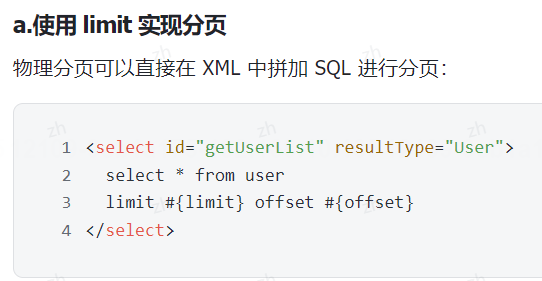
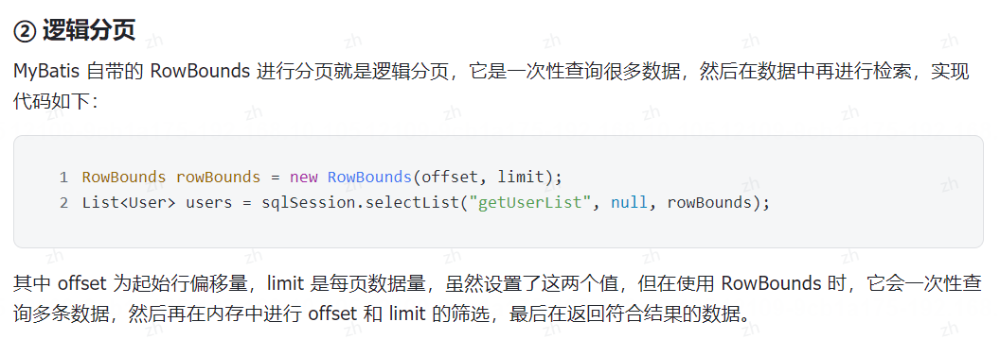
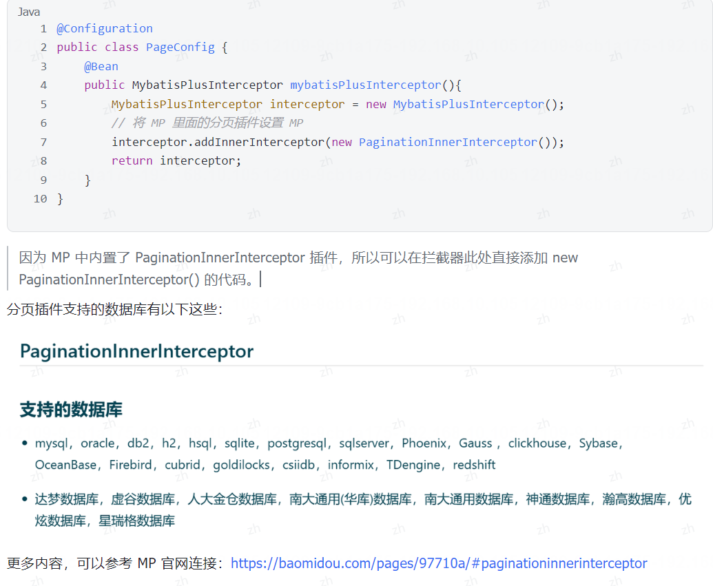
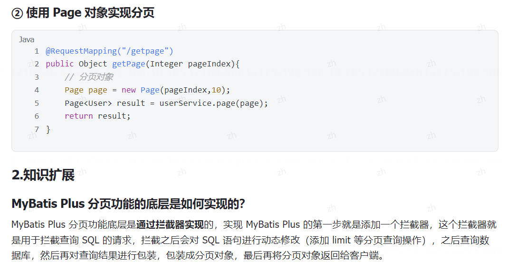
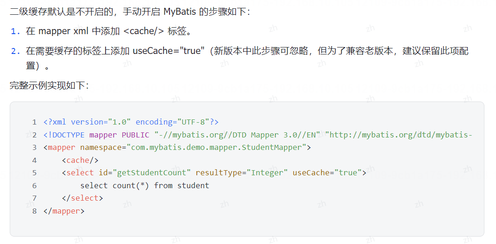

## 1. 什么是ORM框架? MyBatis有哪些优缺点?
ORM(O0bject-Relational Mapping，对象关系映射)框架是一种将==**关系型数据库中的数据与应用程序中的对象进行映射的技术**==。它通过在程序代码中定义的类和属性来表示数据库表和字段，从而让开发人员能够以面向对象的方式来操作数据库。

ORM 框架的主要目的是减少应用程序与数据库之间的耦合度，提高开发效率，同时保持数据的一致性和安全性,常见的 ORM 框架有 MyBatis、Hibernate、Spring Data JPA 等。

**MyBaits 有哪些优缺点?**
MyBatis 作为一款轻量级的 ORM 框架，它的优缺点如下。
**优点分析**

1. **灵活**:MyBatis 允许开发者编写原生的 SOL，提供强大的灵活性，可以针对特定场景写出高度优化的查询语句，对于复杂查询和性能调优更友好，
2. **易于学习和使用**:相较于 Hibernate 等全自动化 ORM 框架，MyBatis 的学习曲线较为平缓，且由于其半自动化的特性，使得开发者更容易理解和控制整个数据处理过程。
3. **解耦**:通过 XML 或注解的方式将 SOL与 Java 代码分离，使得代码结构清晰，有利于维护
4. **轻量级**:MyBatis 依赖较少，运行时占用资源相对较小，适合于中小规模项目或者对性能要求较高的场景。
5. **支持动态 SQL**:MyBatis 提供了强大的动态 SOL 标签，可以方便地根据条件拼接不同的 SOL 语句。

**缺点分析**

1. **手动编写 SQL**:虽然提供了灵活的 SQL 定制能力，但也意味着需要手动编写大量的 SQL 语句，工作量较大尤其当业务逻辑复杂、表结构变更频繁时，SQL管理成本较高。
2. **移植性差**:由于 SQL 是写死的，所以不同数据库间的移植性较差，如果更换数据库类型，可能需要重新调整SQL 语句。
3. **易出错**:因为 SQL语句需要手动编写，如果不小心可能会引入 SOL 注入等问题，而且在处理多表关联查询时容易出错。

所以，MyBatis 适合那些希望在性能和灵活性上有更多掌控权，并且愿意为获得这种控制付出额外 SQL 编写成本的项目。而在强调开发效率，可以考虑 Hibernate 或 Spring Data JPA。
## 2. MyBatis 和 Hibernate 以及 Spring Data JPA 有什么区别?
MyBatis、Hibernate和Spring Data JPA都是用于在Java应用程序中实现持久化的框架，它们之间有一些区别：

1. MyBatis是一种基于SQL的持久化框架，它使用XML或注解来映射Java对象和SQL语句，开发人员需要手动编写SQL语句。相比之下，Hibernate和Spring Data JPA是基于ORM（对象关系映射）的框架，它们通过对象关系映射来自动生成SQL语句，开发人员不需要编写SQL语句。

2. Hibernate是一个全功能的ORM框架，它提供了丰富的功能和复杂的映射关系，适用于复杂的数据模型。Spring Data JPA是Spring Data项目中的一个模块，它简化了JPA的使用，提供了更简洁的API，适用于简单的数据访问场景。

3. MyBatis相对于Hibernate和Spring Data JPA来说更加灵活，可以直接编写SQL语句，对于需要优化SQL性能的场景更为适用。而Hibernate和Spring Data JPA则更适合快速开发和简化数据访问操作。

总的来说，选择使用哪种持久化框架取决于项目的需求和开发团队的偏好，MyBatis适合对SQL有较高要求的场景，Hibernate适合复杂的数据模型，Spring Data JPA适合简单的数据访问操作。

## 3.  MyBatis中属性名和数据库字段名不一致的解决方案有哪些?

在 MyBatis 中，如果程序中的属性名和字段名不一致，会导致查询和其他操作为 NULL 的情况，而它的常见解决方案有以下几个:
1. 更改程序中的属性名，或数据库的字段名，让二者保持一致。
2. 使用结果映射，使用resultMap映射对应的字段。
3. 使用 MyBatis Plus 框架中的 @TableField 注解映射二者字段
4. 如果是查询操作，可以使用 as 重命名字段名，这样查询也就不会为 NULL 了。
## 4. 说一下 MyBatis 的执行流程?
MyBatis 执行流程如下
1. **加载配置文件**:MyBatis 的执行流程从加载配置文件开始。通常，MyBatis 的配置文件是一个 XML 文件，其中包含了数据源配置、SQL 映射配置、连接池配置等信息。
2. **构建 SqlSessionFactory**:在配置文件加载后，MyBatis 使用配置信息来构建 SqlSessionFactory，这是MyBatis 的核心工厂类。SqlSessionFactory 是线程安全的，它用于创建SqlSession 对象。
3. **创建 Sqlsession**:应用程序通过 SqlSessionFactory 创建SqlSession 对象。SqlSession 代表一次数据库会话，它提供了执行 SQL操作的方法。通常情况下，每个线程都应该有自己的 SqlSession 对象。
4. **执行 SQL 查询**:在 SqlSession 中，开发人员可以执行 SQL 查询，这可以通过两种方式来实现:
   - 使用注解加 SQL: MyBatis 提供了注解加执行 SQL 的实现方式，MyBatis 会为 Mapper 接口生成实现类的代理对象，实际执行 SQL 查询。
   - 使用 XML 映射文件:开发人员可以在 XML 映射文件中定义 SQL 查询语句和映射关系。然后，通过。SqlSession 执行这些 SOL 查询，将结果映射到 Java 对象上。
5. **SQL 解析和执行**:MyBatis 会解析 SQL 查询，执行查询操作，并获取查询结果。
6. **结果映射**:MyBatis 使用配置的结果映射规则，将查询结果映射到 Java 对象上。这包括将数据库列映射到Java 对象的属性上，并处理关联关系等。
7. **返回结果**:查询结果被返回给应用程序，开发人员可以对结果进行进一步处理、展示或持久化。
8. **关闭 Sqlsession**:完成数据库操作后，关闭 SqlSession 释放资源。

## 5. ${}和#{}有什么区别?什么情况下一定要使用${}?

```
${} 和 #{} 都是 MyBatis 中用来替换参数的特殊标识，其用法如下:
但它们二者区别很大，它们的主要区别有以下几个:
1. 含义不同:$(}是直接替换(运行时已经替换成具体的执行 SQL了)，而 #{}是预处理(运行时只是设置了占位符“?”，之后再通过声明器(statement)来替换占位符)。
2. 使用场景不同:晋通参数使用 #八，如果传递的是 SOL 命令或 SOL 关键字，需要使用 $，但在使用前一定要做好安全验证。
3. 安全性不同:使用 ${}存在安全问题，如 SOL 注入，而 #{} 则不存在安全问题。也就是说，为了防止安全问题，所以大部分场景都要使用 #} 替换参数，但是如果传递的是 SOL 关键字，例如order by xxx asc/desc 时(传递 asc 后 desc)，一定要使用$，因为它需要在执行时就被替换成关键字，而不能使用占位符替代(占位符不用应用于 SQL 关键字，否则会报错)。在传递 SOL 关键字时，一定要使用 $，但使用前，一定要进行过滤和安全检査，以防止 SOL 注入。
```
## 6. 什么是 SQL 注入?如何预防？
SQL注入是一种常见的网络安全漏洞，攻击者利用用户输入的数据来构造恶意的SQL查询语句，从而实现对数据库的非法访问和操作。SQL注入攻击通常发生在Web应用程序中，当应用程序没有对用户输入数据进行充分验证和过滤时，攻击者可以通过在输入框中输入恶意代码来执行SQL注入攻击。

举个简单的SQL注入例子，假设有一个登录页面，用户输入用户名和密码进行登录，后台的SQL查询语句可能是这样的：
```
SELECT * FROM users WHERE username='$username' AND password='$password'
```
如果用户输入的用户名是`admin' OR 1=1 --`，密码随意填写，那么构造出来的SQL查询语句就会变成：
```
SELECT * FROM users WHERE username='admin' OR 1=1 --' AND password='$password'
```
这样，由于`1=1`永远为真，攻击者就可以绕过密码验证，成功登录到系统中。

要预防SQL注入问题，可以采取以下几种解决办法：
1. 使用参数化查询：使用参数化查询可以有效防止SQL注入攻击，参数化查询会将用户输入的数据作为参数传递给SQL查询语句，而不是直接拼接到SQL语句中。例如，使用MySQL的PDO或者mysqli扩展来执行参数化查询。
```php
$stmt = $pdo->prepare('SELECT * FROM users WHERE username = :username AND password = :password');
$stmt->execute(['username' => $username, 'password' => $password]);
```

2. 输入验证和过滤：对用户输入的数据进行验证和过滤，确保只有符合预期格式的数据才能通过。例如，对于用户名和密码字段，可以限制输入的长度和字符类型。

3. 最小权限原则：在数据库中为应用程序设置最小权限，避免应用程序使用具有过高权限的数据库账号。

通过以上方法，可以有效预防SQL注入问题，保护数据库安全。

## 7. MyBatis 中如何实现分页?

MyBaits 中实现分页有以下两种方式:
1. **物理分页**:物理分页是通过 SQL 查询语句，在数据库引擎层面实现的，如 MySQL 的 LIMIT 语法进行分页。
2. **逻辑分页**:逻辑分页是在应用程序层面进行的分页，通常是先查询出所有符合条件的数据，然后在内存中对数据进行分页操作。



## 8. MyBatisPlus是如何实现分页的?
MyBatis Plus 中实现分页功能，只需要以下两步
1. 配置 MyBatis Plus 中的分页拦截器
2. 使用 Page 对象使用分页查询。具体操作如下





## 9. 什么是动态 SQL?
**动态SQL是指根据不同的条件动态生成SQL语句的过程**。在MyBatis中，可以使用动态SQL来根据不同的条件拼接SQL语句，以实现灵活的查询功能。

以下是一个示例，展示如何在MyBatis中使用动态SQL来构建一个简单的查询语句：

```xml
<!-- 在Mapper XML 文件中定义动态SQL -->
<select id="selectUsers" parameterType="map" resultType="User">
    SELECT * FROM users
    <where>
        <if test="id != null">
            AND id = #{id}
        </if>
        <if test="username != null">
            AND username = #{username}
        </if>
        <if test="email != null">
            AND email = #{email}
        </if>
    </where>
</select>
```

在这个示例中，我们定义了一个名为`selectUsers`的查询语句，接受一个参数类型为`map`，返回类型为`User`。在`<where>`标签内部，我们使用了`<if>`标签来根据条件动态拼接SQL语句。如果参数中包含`id`、`username`或`email`字段，则会将对应的条件拼接到查询语句中。

通过这种方式，我们可以根据不同的条件动态生成SQL语句，实现灵活的查询功能。
## 10. 什么是MyBatis的一级缓存和二级缓存？sqlsession是什么？
MyBaits 二级缓存是用于提高 MyBaits 查询数据库的性能，和减少数据库访问的机制。
顾名思义，MyBaits 二级缓存中总共有两个缓存机制:

- **一级缓存**:SqlSession 级别的，MyBatis 自带的缓存功能，并且无法关闭。因此当有两个 SqlSession 访问相同的 SQL 时，一级缓存也不会生效，也需要査询两次数据库。在一个 service 调用两个相同的 mapper 方法时,依然是查询两次，因为它会创建两个 Sql Session 进行查询(为了提高性能)。
- **二级缓存**:Mapper 级别的，只要是同一个 Mapper，无论使用多少个 SalSession 来操作，数据都是共享的。也就是说，一个 sessionfactory 下的多个 session 之间共享的缓存，它的作用范围更大、生命周期更长，可以减少数据库查询次数，提高系统性能。但 MyBatis 的二级缓存默认是关闭的，需要使用时可手动开启。

## 11. 如何开启MyBatis二级缓存?



## 12. Mybatis为什么不默认开启二级缓存？
MyBatis 默认不开启二级缓存的原因有以下几个:
1. **分布式环境下数据一致性问题**:在一个分布式环境下，多个应用实例共享同一个数据库，如果开启了二级缓存，其中一个实例对数据库进行了更新操作(如插入、修改、删除)，而其他实例的缓存中仍然保存着旧的数据，就会导致数据不一致的问题。
2. **业务场景问题**:二级缓存适用于读多写少、数据相对静态的场景，但在许多实际项目中，这类场景并不常见。因此，默认关闭二级缓存可以确保框架在大多数情况下都能灵活应对不同需求。
3. **内存占用问题**:开启二级缓存后，缓存的数据需要占用一定的内存空间。如果没有合适的策略来管理缓存，可能会导致内存占用过多的问题。
4. **复杂性和配置问题**:二级缓存的配置需要考虑很多因素，包括缓存的刷新策略、缓存的清理策略等等。这增加了配置的复杂性和可能引入配置错误的风险。
5. **缓存设计相对简单**:MyBaits 中的缓存设计的相对比较简单，例如 MyBaits 缓存的数据默认只能保存 1024个，且缓存淘汰策略比较简单，只有几种策略可供选择。
## 13. MyBaits有几种缓存淘汰策略?如何设置缓存淘汰策略?
MyBatis 有哪些缓存淘汰策略?
MyBatis 中可用的缓存策略有以下几个:
1. LRU-最近最少使用:移除最长时间不被使用的对象。
2. FIFO-先进先出:按对象进入缓存的顺序来移除它们。
3. SOFT-软引用:基于垃圾回收器状态和软引用规则移除对象。
4. WEAK-弱引用:更积极地基于垃圾收集器状态和弱引用规则移除对象。

**默认的缓存淘汰策略是 LRU。**
flushInterval(刷新间隔)默认情况是不设置，也就是没有刷新间隔，缓存仅仅会在调用语句时刷新。当设置flushInterval 后，MyBatis 会周期性地检查是否需要刷新二级缓存，避免数据过期或脏数据的问题。当超过设定的时间间隔时，MyBatis 会自动清空二级缓存，下次查询时会重新加载最新的数据到缓存中。size(引|用数目)属性可以被设置为任意正整数，要注意欲缓存对象的大小和运行环境中可用的内存资源。默认值是 1024。

## 14. MyBatis中使用里哪些设计模式？ ★
**1. 工厂模式**
工厂模式想必都比较熟悉，它是 Java 中最常用的设计模式之一。工厂模式就是提供一个工厂类，当有客户端需要调用的时候，只调用这个工厂类就可以得到自己想要的结果，从而无需关注某类的具体实现过程。这就好比你去餐馆吃饭，可以直接点菜，而不用考虑厨师是怎么做的。工厂模式在 MyBatis 中的典型代表是 SqlSessionfactory。SqlSession 是 MyBatis 中的重要 Java 接口，可以通过该接口来执行 SQL 命令、获取映射器示例和管理事务，而 SqlSessionfactory 正是用来产生 SqlSession 对象的，所以它在 MyBatis 中是比较核心的接口之一。

**2. 建造者模式**
建造者模式指的是将一个复杂对象的构建与它的表示分离，使得同样的构建过程可以创建不同的表示。也就是说建造者模式是通过多个模块一步步实现了对象的构建，相同的构建过程可以创建不同的产品。例如，组装电脑，最终的产品就是一台主机，然而不同的人对它的要求是不同的，比如设计人员需要显卡配置高的:而影片爱好者则需要硬盘足够大的(能把视频都保存起来)，但对于显卡却没有太大的要求，我们的装机人员根据每个人不同的要求，组装相应电脑的过程就是建造者模式。建造者模式在 MyBatis 中的典型代表是 SalSessionfactoryBuilder，普通的对象都是通过 new 关键字直接创建的但是如果创建对象需要的构造参数很多，且不能保证每个参数都是正确的或者不能一次性得到构建所需的所有参数，那么就需要将构建逻辑从对象本身抽离出来，让对象只关注功能，把构建交给构建类，这样可以简化对象的构建，也可以达到分步构建对象的日的，而 SalSessionfactoryBuilder 的构建过程正是如此
**链式调用是建造者模式的一种常见表现形式，它使得建造者模式的代码更加简洁和易于理解。**

**3.单例模式**
单例模式(Singleton Pattern)是 Java 中最简单的设计模式之一，此模式保证某个类在运行期间，只有一个实例对外提供服务，而这个类被称为单例类。
单例模式也比较好理解，比如一个人一生当中只能有一个真实的身份证号，每个收费站的窗口都只能一辆车子一辆车子的经过，类似的场景都是属于单例模式。单例模式在 MyBatis 中的典型代表是 ErrorContext。
ErrorContext 是线程级别的的单例，每个线程中有一个此对象的单例，用于记录该线程的执行环境的错误信息。

**4.适配器模式**
适器模式是指将一个不兼容的接口转换成另一个可以兼容的接口，这样就可以使那些不兼容的类可以一起工作。列如，最早之前我们用的耳机都是圆形的，而现在大多数的耳机和电源都统一成了方形的 typec 接口，那之前的圆形耳机就不能使用了，只能买一个适配器把圆形接口转化成方形的，如下图所示:
而这个转换头就相当于程序中的适配器模式，适配器模式在 MyBatis 中的典型代表是 Log.MyBatis 中的日志模块适配了以下多种日志类型:
SLF4J
Apache Commons Logging
Log4j2
Log4j
JDK logging

**5.代理模式**
代理模式指的是给某一个对象提供一个代理对象，并由代理对象控制原对象的调用。代理模式在生活中也比较常见，比如我们常见的超市、小卖店其实都是一个个"代理”，他们的最上游是一个个生产厂家，他们这些代理负责把厂家生产出来的产品卖出去，代理模式在 MyBatis 中的典型代表是 MapperProxyFactory。
MapperProxyFactory 的 newInstance()方法就是生成一个具体的代理来实现某个功能,

**6.模板方法模式**
模板方法模式是最常用的设计模式之一，它是指定义一个操作算法的骨架，而将一些步骤的实现延迟到子类中去实现，使得子类可以不改变一个算法的结构即可重定义该算法的某些特定步骤。此模式是基于继承的思想实现代码复用的。
例如，我们喝茶的一般步骤都是这样的:
把热水烧开
把茶叶放入壶中
等待一分钟左右
把茶倒入杯子中
喝茶
整个过程都是固定的，唯一变的就是泡入茶叶种类的不同，比如今天喝的是绿茶，明天可能喝的是红茶，那么我们就可以把流程定义为一个模板，而把茶叶的种类延伸到子类中去实现，这就是模板方法的实现思路模板方法在 MyBatis 中的典型代表是 BaseExecutor，在 MyBatis 中 BaseExecutor 实现了大部分 SOL 执行的透辑。

**7.装饰器模式**
装饰器模式允许向一个现有的对象添加新的功能，同时又不改变其结构，这种类型的设计模式属于结构型模式，它是作为现有类的一个包装。
装饰器模式在生活中很常见，比如装修房子，我们在不改变房子结构的同时，给房子添加了很多的点缀:比如安装了天然气报警器，增加了热水器等附加的功能都属于装饰器模式。装饰器模式在 MyBatis 中的典型代表是 Cache。
Cache 除了有数据存储和缓存的基本功能外(由 PerpetualCache 永久缓存实现)还有其他附加的 Cache 类，比如先进先出的 FifoCache、最近最少使用的 LruCache 等众多附加功能的缓存类