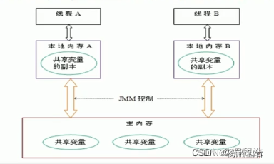
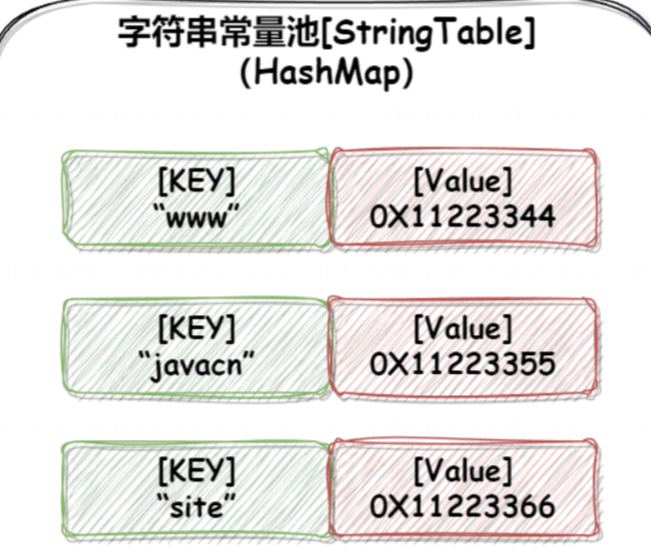
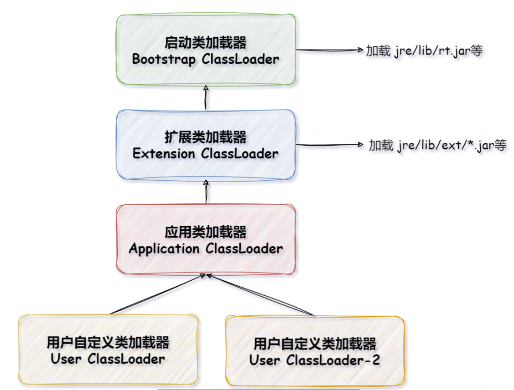
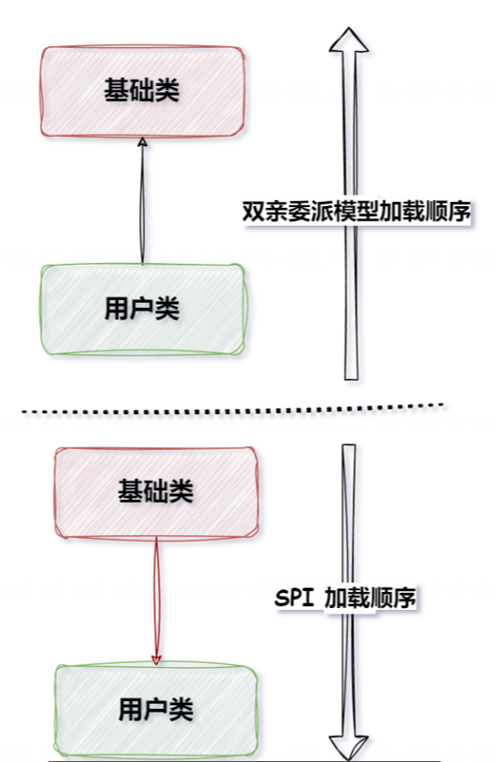

## 1. JVM 是怎么运行的?
JVM(Java Virtual Machine，Java 虚拟机)是 Java 程序的运行环境，它负责将 Java 字节码翻译成机器代码并执行。也就是说 Java 代码之所以能够运行，主要是依靠 JVM 来实现的。JVM 执行的主流流程如下:
1. 程序在执行之前先要把 **Java 代码转换成字节码**(class 文件)，**JVM首先需要把字节码通过一定的方式类加载器(ClassLoader)把文件加载到内存中运行时数据区(Runtime Data Area)**。
2. 但字节码文件是 JVM 的一套指令集规范，并不能直接交给底层操作系统去执行，**因此需要特定的命令解析器也就是 JM 的执行引擎(Execution Engine)会将字节码翻译成底层系统指令再交由 CPU 去执行**。
3. 在执行的过程中，也需要调用其他语言的接口，如通过调用本地库接口(Native Interface) 来实现整个程序的运行，如下图所示:

所以，整体来看， JVM 主要通过分为以下4个部分来执行 Java 程序的:
1. 类加载器(ClassLoader)
2. 运行时数据区(Runtime Data Area)
3. 执行引擎(Execution Engine)
4. 本地库接口(Native Interface)
## 2. 说一下JVM内存布局?Java虚拟机规范和Java虚拟机有什么关系?
JVM内存布局通常分为以下几个部分：
1. **程序计数器**(Program Counter Register):用于存储**当前线程执行的字节码指令的地址**，在多线程环境中，**程序计数器用于实现线程切换，保证线程恢复执行时能够继续从正确的位置执行代码**。
2. **Java 虚拟机栈**(Java Virtual Machine stacks):用于**存储方法调用和局部变量**(方法内部定义的变量)，在方法调用和返回时，**虚拟机栈用于保存方法的调用帧，包括方法的局部变量、操作数栈、方法返回地址等**。
3. **本地方法栈**(Native Method stack):与虚拟机栈类似，本地方法栈用于执行本地(Native)方法。
4. **Java 堆**(Java Heap):JVM 中最大的一块内存区域，用于存储对象实例，所有的对象都在堆中分配内存
5. **方法区**(Methed Area):用于存储类的元数据信息，包括类的结构、字段、方法、静态变量、常量池等

### JMM

## 3. 方法区、永久代和元空间有什么区别?
方法区、永久代和元空间的区别如下:
1. 方法区:《Java 虚拟机规范》定义的一个内存区域，用于存储已被虚拟机加载的类信息、常量池、静态变量即时编译器编译后的代码等数据的地方。
2. 永久代:HotSpot JVM 对方法区的一种实现方式，它曾经用来存储类的元数据和字符串常量池等内容。随着2 Java 版本的演进，永久代的设计暴露出了一些问题，例如空间大小固定日难以管理，容易导致如“Out ofMemory“的异常问题。
3. 元空间:HotSpot JVM 在 JDK 1.8 及更高版本中，对方法区新的实现方式(替代了原来的永久代)。相比于永3.久代，元空间的主要改进包括:
   - 空间分配方式:**元空间使用的是本地内存**(Native Memory)，而**非堆内存的一部分**，因此不会受到堆内存大小限制的影响。
   - 动态调整:**元空间的大小可以动态调整**，并且默认情况下类的元数据分配只受限于可用的本地内存大小，从而避免了因预设固定大小而导致的内存溢出问题。
   - **字符串常量池位置改动**:在 JDK 1.7 之后，字符串常量池被移到了 Java 堆中，**进一步降低了永久代或元空间的压力**。

所以说，方法区是一个规范层面的概念，而永久代是早期 HotSpot JV 对方法区的具体实现方式，现已废弃:而元空间则是后来 Hotspot 为了改进内存管理，和解决永久代带来的内存溢出问题所采用的新的实现机制。
## 4. 为什么要使用元空间替代永久代?元空间有什么优点?
① 降低 OOM
当使用永久代实现方法区时，永久代的最大容量受制于 PermSize 和 MaxPermSize 参数设置的大小，而这两个参数的大小又很难确定，因为在程序运行时需要加载多少类是很难估算的，如果这两个参数设置的过小就会频繁的触发FullGC 和导致 OOM(Out of Memory，内存溢出)。但是，当使用元空间替代了永久代之后，出现 O0M 的几率就被大大降低了，因为元空间使用的是本地内存，这样元空间的大小就只和本地内存的大小有关了，从而大大降低了 OOM 的问题。
② 降低运维成本
因为元空间使用的是本地内存，这样就无需运维人员再去专门设置和调整元空间的大小了
## 5. 常量池和字符串常量池有什么区别?字符串常量池是如何实现的?
常量池(Constant Pool)和字符串常量池(String Constant Pool)是 Java 中的两个不同概念，它们的区别有以下几个方面:
1. JDK 1.8 及以后的版本中，字符串常量池存储在堆上，而常量池在元空间本地内存中。
2. 常量池包含更多的内容，如类、方法、字段等常量都存放在常量池中，而字符串常量池只是用于存储字符串常量对象。

字符串常量池是如何实现的?
以 Hotspot 虚拟机来说，字符串常量池是由 C++ 的 HashMap 实现的，它的 key 是字符串的字面量，value 是字符串对象的引用，如下图所示:

## 6. 什么叫做堆溢出?实际工作中哪些情况会导致堆溢出?
堆溢出(Heap Overflow)通常是指堆内存中的对象过多、无法被垃圾回收所导致的内存溢出错误。以下是一些常见的导致堆溢出的场景和原因:
1. 内存泄漏:最常见的情况是内存泄漏，即对象被创建后不再被使用，但没有被释放。这会导致堆中的对象数量逐渐增加，直到堆溢出。例如 ThreadLoca| 使用不当，使用完成之后未调用 remove 方法导致内存泄漏，以及忘记释放各种连接，也会导致内存泄漏，如数据库连接、网络连接和 I0 连接等。
2. 无限递归创建大量对象:无限递归调用一个方法可能会导致栈溢出，但如果递归方法中创建了大量对象并持续递归，也可能导致堆溢出。
3. 创建大量大对象:创建大量大对象，尤其是数组或集合，可能导致堆溢出。如果没有足够的连续内存来存储大对象，堆溢出会发生。
4. 未合理设置堆大小:如果未合理设置 Java 虚拟机的堆大小参数(如 -Xmx 和 -Xms)，可能导致堆溢出。
5. Excel 导入和导出:如果有大的 excel 要进行导入和导出的情况下，因为其操作都是在内存中拼接和组织数据的，如果 excel 过大，很容易就会造成 Heap OOM。
## 7. 什么叫做栈溢出?导致栈溢出的原因是啥?
栈溢出场景
日常工作中导致栈溢出的情况有以下这些:
1. **递归调用**:在递归算法中，如果递归的深度过大，每次递归都会在栈中生成一个函数调用的帧，当栈空间不足以容纳这些帧时，就会发生栈溢出。解决方法是通过优化递归算法，使用循环或迭代代替递归，或者增加栈的大小。
2. **无限递归**:在某些情况下，由于代码逻辑错误或循环调用，可能会导致无限递归的情况发生，从而导致栈溢2出。解决方法是检查代码逻辑，确保递归或循环调用能够正常结束或有适当的终止条件。
3. **大规模数据结构使用**:当使用大规模的数据结构(如大数组、大集合等)时，如果栈空间不够容纳这些数据就可能导致栈溢出。解决方法是尽量使用堆空间存储大规模数据结构，或者增加栈的大小。
4. **深度嵌套函数调用**:当函数调用过于深层嵌套时，每次调用都会在栈中生成一个新的函数帧，如果嵌套层级过多，就有可能导致栈溢出。解决方法是优化代码结构，减少函数的嵌套层级。
## 8. 方法区可能会出现 OOM 吗?
《]ava 虚拟机规范》对方法区的定义是可以没有 GC(垃圾回收)，也没有明确规定是否会出现 00M 的定义但 HotSpot 中，对方法区(也就是永久代和元空间)实现了 GC 操作，并且 Hotspot 中存在 OOM 的情况。例如，在 JDK 1.8 中，如果元空间设置空间过小，而类信息产生的过多就会产生 OOM，比如以下元空间设置较小时，通过动态代理类将方法区填满，从而就导致 OOM:
## 9. Java是编译性语言还是解释性语言?什么是JIT?什么是热点代码?
编译性语言和解释性语言区别如下:
1. 编译性语言是指在程序执行之前，先经过编译器的处理，将源代码转换为目标机器可执行的二进制机器码，然1后直接执行。因此编译过程只需进行一次，生成的可执行文件可以重复运行。
   - 优点:执行效率高
   - 缺点:编译时间长、跨平台能力有限。

2. 解释性语言不需要事先编译成机器码，而是在运行时由解释器将源代码逐行解释执行。例如 JavaScript 语言就是解释性语言。
   - 优点:跨平台性较好、无需编译。
   - 缺点:执行效率低、不易保护源代码。

而 Java 语言既不完全属于编译性语言，又不完全属于解释性语言，它是半编译语言，也叫**编译-解释型语言**，其执行过程包含编译和解释两个阶段。
- **编译阶段**:Java 源代码(.java文件)通过 Java 编译器编译成字节码文件(.class 文件)。字节码是一种中间语言，它具有平台无关性，可以在任何支持 Java 虚拟机(JVM)的平台上运行。
- **解释阶段**:当程序运行时，Java 虚拟机会加载字节码，并对其进行解释执行或即时编译(Just-In-Time2compilation，JIT)执行。==现代 JM 普遍采用 JIT 技术，会根据代码热点将频繁执行的字节码动态编译成本地机器指令以提高性能。==

**什么是 JIT?**
JIT 是"Just-In-Time"的缩写，翻译成中文是"即时编译"，是一种在程序运行时将部分热点代码编译成机器代码的技术，以提高程序的执行性能。
JIT 优点包括以下几个:
1. **性能优化**:由于编译成本地机器代码，程序的执行速度通常比解释性执行或预编译的代码要快得多。
2. **平台无关性**:JIT 编译器可以根据不同的硬件平台生成不同的机器代码，使得相同的程序可以在不同的计算机上运行，而无需重新编写。

**什么是热点代码?**
在 HotSpot 虚拟机中，热点代码(Hot Code)是指那些被频繁执行的代码。热点代码的执行次数在不同的 JDK 版本和不同的 JM 中是不同的，例如，它在 JDK 21 Cient 模式下为 1500 次Server 模式下为 10000 次，这个值可以通过 JVM 参数设置。通常来说，热点代码的识别基于以下两种策略:

1. **方法调用次数**:当一个方法被调用一定次数后，会被视为热点代码并触发即时编译。这个次数在不同 JDK 版本中可能有所变化，并且可以通过 JVM 参数 -XX:CompileThreshold 进行设置。
2. 回边计数:对于循环体等热点区域，通过统计从循环体返回到循环条件检查点的次数(即回边次数)，达到定次数也会触发即时编译。同样，这个阈值也可以通过参数XX:0nStackReplacePercentage 进行设置。回边计数器有一个计算公式【回边计数器阈值=方法调用计数器阈值*(0nStackReplacePercentage -InterpreterProfilePercentage)】，通过计算，在 JDK 21 Server 模式下，虚拟机回边计数器的阈值为 10700【10000*(140-33)】。
可以使用 iava -XX:+PrintFlaqsFinal -version 命令査看 JVM 默认配置。
## 10. 说一下对象的生命周期?以及类加载机制?
在 Java 中，对象的生命周期分为以下几个阶段!
1. 加载
2. 链接
   - 验证
   - 准备
   - 解析

3. 初始化
4. 使用
5. 销毁

其中，最后两个阶段很好理解，而前三个阶段，它也就类加载机制。所以对象的生命周期中包含了类加载机制(加载、链接、初始化)。

**类加载机制**
类加载机制是 Java 虚拟机将类字节码加载到内存并转换为可执行类的过程，该机制总共包括以下几个步骤.
1. 加载
2. 验证
3. 准备
4. 解析
5. 初始化

具体内容如下。
① 加载
加载(Loading)阶段是整个"类加载”(Class Loading)过程中的一个阶段，它和类加载 Class Loading 是不同的-个是加载 Loading 另一个是类加载 Class Loading，所以不要把二者搞混了。在加载 Loading 阶段，Java 虛拟机需要完成以下 3 件事:
- 通过一个类的全限定名来获取定义此类的二进制字节流。
- 将这个字节流所代表的静态存储结构转化为方法区的运行时数据结构，
- 在内存中生成一个代表这个类的 java.lang.Class 对象，作为方法区这个类的各种数据的访问入口。

② 验证
验证是连接阶段的第一步，这一阶段的目的是确保 Class 文件的字节流中包含的信息符合《Java虚拟机规范》的全部约束要求，保证这些信 息被当作代码运行后不会危害虚拟机自身的安全。验证选项:
- 文件格式验证
- 字节码验证
- 符号引用验证

➂ 准备
准备阶段是正式为类中定义的变量(即静态变量，被 static 修饰的变量)分配内存并设置类变量初始值的阶段。
比如此时有这样一行代码:
public static int value = 123;
它是初始化 value 的 int 值为 0，而非 123。
➃ 解析
解析阶段是 Java 虚拟机将常量池内的符号引用替换为直接引用的过程，也就是初始化常量的过程。也就是说这个阶段会涉及到以下三个概念:
- 符号引用:类文件中的一种抽象引用方式，它并不涉及具体的内存地址或对象实例。符号引用包括了三个方面的信息:类和接口的全限定名、字段的名称和描述符、方法的名称和描述符。这些信息足够唯一地确定一个类、字段或者方法，但在类被加载到 JVM 之前，并没有与实际的内存布局关联。
- 直接引用:一种可以直接指向目标对象、类、字段或者方法在 JM 内存中的物理位置的引用方式，例如指针偏移量等。一旦有了直接引用，就可以直接访问目标实体，而无需再经过其他查找过程。
- 替换过程:当 JVM 在解析阶段需要对某个符号引用进行解析时，会根据类加载的结果生成对应的直接引用。比如，当一个类引用了另一个类的方法或字段时，解析阶段会确保被引用的目标类已经被加载，并计算出被引用方法或字段在内存中的准确位置，然后用这个位置信息替换掉原来的符号引用。

⑤ 初始化
初始化阶段，Java 虚拟机真正开始执行类中编写的 Java 程序代码，将主导权移交给应用程序。初始化阶段就是执行类构造器方法的过程，当然初始化阶段也会执行静态初始化块和静态字段的初始化赋值的操作。
## 11. 什么是双亲委派模型?为什么要用双亲委派模型?
双亲委派模型指的是:**当一个类加载器收到了类加载的请求，它首先不会自己去尝试加载这个类，而是把这个请求委派给父类加载器去完成，每一个层次的类加载器都是如此，因此所有的加载请求最终都应该传送到最顶层的启动类加载器中，只有当父加载器反馈自己无法完成这个加载请求(它的搜索范围中没有找到所需的类)时，子加载器才会尝试自己去完成加载。**
自 JDK 1.2 以来，Java 一直保持着三层类加载器、双亲委派的类加载架构器，如下图所示:
其中:
- 启动类加载器:加载 JDK 中 lib 目录中 Java 的核心类库，即 $JAVA HOME/lib 目录
- 扩展类加载器:加载 lib/ext 目录下的类。
- 应用程序类加载器:加载我们写的应用程序。
- 自定义类加载器:根据自己的需求定制类加载器。

为什么要用双亲委派模型?
因为使用双亲委派模型，有以下几个优点
1. 避免重复加载类:比如 A 类和 B类都有一个父类 C类，那么当 A 启动时就会将 C类加载起来，那么在 B类进行加载时就不需要在重复加载 C 类了。
2. 更安全:使用双亲委派模型也可以保证了 Java 的核心 API 不被篡改，如果没有使用双亲委派模型，而是每个类加载器加载自己的话就会出现一些问题，比如我们编写一个称为 java.lang.0bject 类的话，那么程序运行的时候，系统就会出现多个不同的 Object 类，而有些 Object 类又是用户自己提供的因此安全性就不能得到保证
## 12. 打破双亲委派模型的场景有哪些?为什么要打破双亲委派模型?

打破双亲委派模型的场景主要有以下两个:
1. Java 自带的 SPI 机制。
2. Tomcat

具体内容如下。
① SPI 机制
SPI(Service Provider Interface)是 JDK 内置的一种==服务提供发现机制==。例如，数据库驱动就是 SPI 的典型实现。在 Java 中，数据库驱动就是一个典型的 SPI 使用场景，不同的数据库厂商都提供了自己的数据库驱动实现这些实现都实现了同一个 JDBC 接口。==JVM 在运行时可以动态加载适合的数据库驱动，使得开发者可以在不修改代码的情况下切换不同的数据库。==

②Tomcat
Tomcat 也要打破了双亲委派模型，因为一个外置 Tomcat 中要部署多个应用，多个 Web 应用程序在同一个Tomcat 实例中独立运行，而不会相互干扰或导致类冲突，所以 Tomcat 需要打破双亲委派模型来实现类隔离、热部署和解决类库版本冲突等问题。
1. **类隔离**:应用服务器通常需要在同- JM 中运行多个不同的 Web 应用程序，每个应用程序都可能依赖于不同版本的类库。为了保持这些应用程序的隔离性，Tomcat 需要使用自定义的类加载器来加载各个 Web 应用程序的类。这样可以确保每个 Web 应用程序都不会干扰其他应用程序的类加载。
2. **热部署和热加载**:Tomcat 支持热部署(Hot Deployment)和热加载(Hot Reloading)，允许在应用程序运行时替换类文件而不需要重新启动整个应用服务器。为了实现这一功能，Tomcat 需要自己的类加载器，以便能够动态加载新的类定义。
3. **类库版本冲突**:有时 Web 应用程序需要使用自己的类库版本，而不是应用服务器提供的全局类库版本。这可能3会导致类库版本冲突，为了解决这个问题，Tomcat 可以使用自定义的类加载器来加载应用程序的类，而不受全局类库的影响。

**为什么要打破双亲委派模型?**
- SPI 要打破了 Java 类加载器的双亲委派模型，主要是为了实现服务提供者框架的设计目标和灵活性
- Tomcat 要打破了双亲委派模型，是为了让多个 Web 应用程序在同一个 Tomcat 实例中独立运行，避免相互于扰或类冲突等问题。

## 13. 如何判断对象是否存活?
判断对象是否存活的常见的算法有以下两种
1. 引用计数算法
2. 可达性分析算法
它们的介绍和优缺点如下，

 **引用计数器算法**
引用计数器算法的实现思路是，给对象增加一个引用计数器，每当有一个地方引用它时，计数器就 +1;当引用失效时，计数器就 -1;任何时刻计数器为 0的对象就是不能再被使用的，即对象已"死"。
引用计数法的优点:实现简单，判定效率也比较高。
引用计数法的缺点:是引用计数法无法解决对象的循环引用问题。

**可达性分析算法**
可达性分析算法是通过一系列称为"GC Roots"的对象作为起始点，从这些节点开始向下搜索，搜索走过的路径称之为"引用链"，当一个对象到 GC Roots 没有任何的引用链相连时(从 GC Roots 到这个对象不可达)时，证明此对象是不可用的，也就是死亡对象。

## 14. 什么对象可以作为GC Roots?为什么它能作为GCRoots?

在 Java 语言中，可作为 GC Roots 的对象有以下几种!
1. Java 虚拟机栈(栈帧中的本地变量表)中引用的对象。
2. 本地方法栈中(Native 方法)引用的对象。
3. 方法区中类静态属性引用的对象。
4. 方法区中常量引用的对象。

其中，Java 虚拟机栈和本地方法栈中的引用对象，是目前线程正在执行时用的对象，所以它们不能被回收，因此它们可以作为 GC Roots。而方法区中的静态属性和常量对象与类本身相关联，而类已经被加载到程序中了，所以类属于系统的一部分了，因此类所关联的静态属性和常量也就是系统的一部分了，所以它们可以作为 GC Roots。
## 15. Java中有哪些引用类型?
可达性分析算法的关键是通过 GC Roots 找到引用链，所以“引用"也是 JVM 中的关键，**同时它们也为 Java 程序提供了一种更加精细的内存管理手段，使得开发者可以根据应用程序的具体需求来调整对象生命周期，特别是在处理大量数据缓存、资源管理和防止内存泄漏等场景时显得尤为重要。**
Java 将“引用”分为:强引用(Strong Reference)、软引用(Soft Reference)、弱引用(Weak Reference)和虚引用(Phantom Reference)四种，这四种引用的强度依次递减，具体内容如下:
1. **强引用**:强引用指的是在程序代码之中普遍存在的，类似于"0bject obj= new Object()”这类的引用，只要强引用还存在，垃圾回收器永远不会回收掉被引用的对象实例。
   - 使用场景:日常开发中使用 new XXX()创建的所有对象都是强引用。
2. **软引用**:软引用是用来描述一些还有用但是不是必须的对象。==对于软引用关联着的对象，在系统将要发生内存溢出之前，会把这些对象列入回收范围之中进行第二次回收。如果这次回收还是没有足够的内存，才会抛出内存溢出异常==。在 JDK1.2 之后，提供了 SoftReference 类来实现软引用。
   - 使用场景:软引用通常用来实现内存敏感的缓存，如果还有空闲内存，就可以暂时保留缓存，当内存不足时清理掉，这样就保证了使用缓存的同时，不会耗尽内存。
3. **弱引用**:弱引用也是用来描述非必需对象的，它的强度要弱于软引用。==被弱引用关联的对象只能生存到下一次垃圾回收发生之前。当垃圾回收器开始进行工作时，无论当前内容是否够用，都会回收掉只被弱引用关联的对象==。在 JDK1.2 之后提供了 WeakReference 类来实现弱引用。
   - 使用场景:维护一种非强制性的映射关系，如果试图获取时对象还在，就使用它，否则重新实例化。例如ThreadLocal 中的 ThreadLocalMap 使用的就是弱引用，来它来尽量避免内存泄漏。
4. **虚引用**:虚引用也被称为幽灵引用或者幻影引用，你不能通过它访问对象。幻象引用仅仅是提供了一种确保对象被 finalize 以后，做某些事情的机制
   - 使用场景:有人使用虚引用监控对象的创建和销毁。
## 16. Java中的垃圾回收算法有哪些?它们各自有哪些优缺点?
1. **标记-清除算法**:"标记-清除"算法是最基础的收集算法。算法分为"标记"和"清除"两个阶段:首先标记出所有需要回收的对象，在标记完成后统一回收所有被标记的对象，如下图所示:
   - 优点:实现简单、且执行效率相对高效。
   - 缺点:会产生内存碎片问题，在标记清除后会产生大量不连续的内存碎片，空间碎片太多可能会导致以后在程序运行中需要分配较大对象时，无法找到足够连续内存而不得不提前触发另一次垃圾收集。

2. **标记-整理算法**:标记-整理算法也是分为两个阶段“标记“和“整理”，其中标记仍与标记-清除算法的“标记”过程实现是一致的，但后续步骤不是直接对可回收对象进行清理，而是让所有存活对象都向一端移动，然后直接清理掉端边界以外的内存，如下图所示:
   - 优点:无内存碎片问题。
   - 缺点:执行效率比较低。

3. **复制算法**:"复制"算法是为了解决"标记-整理"的效率问题，它将可用内存按容量划分为大小相等的两块，每次只使用其中的一块。当这块内存需要进行垃圾回收时，会将此区域还存活着的对象复制到另一块上面，然后再把已经使用过的内存区域一次清理掉。这样做的好处是每次都是对整个半区进行内存回收，内存分配时也就不需要考虑内存碎片等复杂情况，只需要移动堆顶指针，按顺序分配即可。此算法实现简单，运行高效。如下图所示:
   - 优点:执行效率高。
   - 缺点:空间利用率比较低。
4. **分代算法**:分代算法是通过区域划分，实现不同区域和不同的垃圾回收策略，从而实现更好的垃圾回收。这就好比中国的一国两制方针一样，对于不同的情况和地域设置更符合当地的规则，从而实现更好的管理，这就时分代算法的设计思想。
   - 优点:分而治之，不同场景使用不同算法，整体性能更高，且空间利用率较好。
   - 缺点:实现复杂度比较高。

## 17. 分代算法和分区算法有什么区别?
早期的垃圾回收器是以分代算法为主，而到了 G1(JDK9 默认的垃圾回收器)之后，就开始使用分区算法替代了分代算法了，在 G1 中既有分代算法又有分区算法，它们的区别如下。

**分代算法**
分代算法(Generational Garbage Collection):==根据对象生命周期的特点而设计的算法，它将堆内存划分为不同的区域，主要是新生代(Young Generation)老年代(Old Generation)==
新生代:大部分新创建的对象会被分配到这里，生命周期较短，采用**复制算法**(如 Minor Gc)进行垃圾回收速度快且高效。新创建的对象会先分到此区域，因为大部分对象都是朝生夕死的。老年代:经过多次新生代 GC存活下来的对象会晋升到老年代，生命周期相对较长，通常使用**标记-清除**，或**标记-整理**算法(如 Major Gc、Fu GC)进行垃圾回收。此区域存放大对象和经历了 N 次(一般情况默认是 15次)垃圾回收依然存活下来的对象会从新生代移动到老年代。

**分区算法**
分区算法(Compartmentalization/Region-Based Garbage Collection):==分区算法则将整个堆空间划分为连续的不同小区间，每个小区间独立使用，独立回收。这样做的好处是可以控制一次回收多少个小区间==，根据目标停顿时间，每次合理地回收若干个小区间(而不是整个堆)，==从而减少一次 GC 所产生的停顿==。
## 18. JVM中的垃圾回收类型都有哪些?Major Gc、OldGC和FuII GC有什么区别?
典型回答
JVM 中常见垃圾回收类型有以下这些:
1. **Minor Gc(新生代垃圾回收)**:Minor Gc 是针对新生代内存区域的垃圾回收。新生代内存区域通常被划分为Eden 区、Survivor0 和 Survivor1 区。当 Eden 区空间不足时，或者 Survivor 区满但无法容纳更多的对象时,会触发 Minor Gc，Minor Gc 相对频繁且执行速度较快。
2. **Major Gc(老年代垃圾回收)**:Major Gc 也被称为 Old GC，它主要针对的是老年代内存区域进行垃圾回收。当老年代内存空间不足，或者从新生代晋升的对象过多导致老年代无法容纳时，会发生 Major Gc。Major Gc的发生频率低于 Minor GC，但是其执行时间通常比 Minor GC 长得多。
3. **Full GC(全局垃圾回收或完全垃圾回收)**:Full GC 是对整个堆内存(包括年轻代和老年代)、方法区进行全面的垃圾回收。发生 Full GC 的情况较为复杂，例如:**老年代空间不足、元空间不足、System.gc()显式调用(不推荐)、CMS 并发标记失败后 falback 到 Serial Old 收集器等**。Fu GC 的开销非常大，因为它涉及到了IVM 几平所有的内存区域，因此应尽量避免不必要的 Fu GC，以减少系统停顿时间。

**G1 中的垃圾回收术语**
G1 垃圾收集器虽然没有明确区分 Minor Gc 和 Major Gc，但它有 Young GC(清理年轻代)和 Mixed Gc(同时清理部分年轻代和老年代)的概念。
**Major Gc、old GC和Full GC的区别**
Major Gc 和 Old GC 是一样的，都是用来进行老生代垃圾回收，而 Full GC 是全局垃圾回收，它等于 Minor Gc +Major GC + 方法区 GC.
## 19. JVM中的常见垃圾回收器有哪些?
JVM 常见的垃圾回收器有以下几个:
1. Serial/serial old:单线程垃圾回收器。
2. ParNew:多线程的垃圾回收器(Serial 多线程版本)
3. Parallel scavenge/Parallel 0ld:吞吐量优先的垃圾回收器【JDK8 默认的垃圾回收器】
4. CMS:最小等待时间优先的垃圾收集器,
5. G1:可控垃圾回收时间的垃圾收集器【JDK 9~JDK 21 HotSpot 默认的垃圾回收器】
## 20. 说一下CMS垃圾回收器?以及它的优缺点?
CMS(Concurrent Mark Sweep，并发标记清理)回收器是==一种以获取最短回收停顿时间为目标的收集器==。目前很大一部分的 Java 应用集中在互联网站或者 B/S 系统的服务端上，这类应用尤其重视服务的响应速度，希望系统停顿时间最短，以给用户带来较好的体验，CMS 收集器就非常符合这类应用的需求。

**① 设置 CMS**
JDK8 默认使用的是 Parallel 垃圾回收器，但使用参数“-XX:+UseConcMarksweepGc”可以设置老年代使用CMS 垃圾回收器，默认新生代会使用 ParNew 垃圾收集器。
**② 特点介绍**
CMS 具备以下特点:
   - GC 第一次初始标记，实现了用户线程和垃圾回收线程同时执行。
   - ==尽可能的缩短了垃圾收集时用户线程的停顿时间==，适应于对响应时间(停顿时间)敏感的系统，如网站等 BS 系统上。
   - CMS 使用的是“标记-清除”算法，也会存在 STW(Stop the World，全局停顿)
   - CMS 是一款老生代的垃圾回收器，无法和 Paraller Scavenge 一起使用(CMS 重点关注减小应用程序的停顿时间，而 Parallel 关注吞吐量，这两个目标在设计和优化上存在一些冲突，难以同时实现)，只能和 ParNew 或Serial 配合使用。

**③ 优缺点分析**
CMS 优点如下:
1. 低延迟。
2. 并发收集。

**CMS 缺点如下**:
1. 产生内存碎片:因为 CMS 使用的是“标记-清除”算法，所以会产生内存碎片。
2. CPU 资源敏感:因为垃圾回收时虽然不会 STW，但会占用用户线程的 CPU 资源，如果用户线程本身的 CPU资源已经很吃紧了，那么此时再使用 CMS 无疑是雪上加爽。

## 21. 说一下CMS执行流程?
CMS 执行流程总共分为以下 4 个阶段:
1. 初始标记(STW):GC Roots 能直接关联到的对象，执行速度很快。
2. 并发标记(和用户线程并发执行):GC Roots 直接关联的对象继续往下(一直)遍历和标记，耗时会比较长
3. 重新标记(STW):对上一步并发标记阶段，因为用户线程执行而导致变动的对象进行修正标记。.
4. 并发清除(和用户线程并发执行):使用并发-清除算法将垃圾对象进行清除。
## 22. CMS如何解决内存碎片问题?它能使用标记-整理算法吗?为什么?

CMS 并不能直接解决内存碎片的问题，因为 CMS 使用的标记-清除算法。但是当内存碎片比较多时(连续内存不不足以申请大对象时)，CMS 会借助 Serial 0ld 垃圾收集器执行内存碎片的回收工作，因为 Serial Old 使用的是标记-整理算法，所以内存碎片问题就得到了解决。
**CMS能使用标记-整理算法吗?为什么?**
CMS 不能使用标记-整理算法，这是因为 CMS 最后一个阶段是并发清除阶段，此阶段 CMS 垃圾回收会和用户线程并发执行，如果使用并发-整理算法需要移动内存位置，而此时用户线程正在执行，所以不能使用并发-整理算法如下图所示:
## 23. G1是如何分区的?

G1 总共有以下 4 块区域:
- **Eden(伊甸园区)**:新创建对象都会放在此区域。
- **Survivor(存活区)**:eden 经过 GC 之后存活的对象就会移动到此区域。
- **Old(老年代)**:经过n次 GC 之后还存活的对象就会放到此区域。
- **Humongous(巨型区)**:用来存放大对象的，大对象会直接存放到此区域，当一个对象的大小超过 Region 的一半时(50%)，则该对象定义为大对象。
## 24. G1和CMS有什么区别?
G1(Garbage-First)垃圾收集器和 CMS(Concurrent Mark Sweep)垃圾收集器都是 HotSpot 虚拟机中的最常用的垃圾收集器，它们的主要区别如下:
1. **设计目标不同**
   - G1 垃圾收集器的设计目标是为了解决大内存系统上长时间 STW(Stop-The-World)停顿的问题，并且提供了可预测的停顿时间模型。
   - CMS 垃圾收集器同样致力于减少垃圾回收时的停顿时间，但其主要关注点在于尽可能缩短老年代 GC 的停顿时间。
2. **垃圾收集器分类不同**
   - G1 将整个堆划分为多个大小相等的 Region，每个 Region 可以属于 Eden、Survivor 或老年代。它是整体垃圾收集器(新生代+老年代)。
   - CMS 是分代垃圾收集器，它属于老年代的垃圾收集器。
3. **垃圾回收流程不同**
   - G1 的垃圾回收包括初始标记、并发标记、最终标记、清理以及混合回收阶段。它采用全局标记-局部回收的方式，每次 GC 只回收一部分 Reqion(被称为回收集)，并在回收过程中尽量避免全堆扫描。
   - CMS 的垃圾回收过程包括初始标记、并发标记、重新标记和并发清除四个阶段。它主要关注对年轻代的并发收集，而对老年代的并发标记和清除可能导致浮动垃圾产生。
4. **停顿预测与控制不同**
   - G1 允许用户设置一个期望的最大暂停时间(MaxGCPauseMilis)，并尽力满足这个要求。在进行垃圾回收时，G1 会优先回收收益高的 Region，即垃圾多的 Region，因此得名“Garbage-First”
   - CMS 虽然也努力减少停顿时间，但并未提供明确的停顿时间预测和控制功能
## 25. 对象创建一定在堆上吗?什么是逃逸分析?什么是锁消除和标量替换?

逃逸分析(Escape Analysis)是 JVM 的一项编译器优化技术，用于确定对象动态作用域是否超过当前方法或线程。通过逃逸分析，编译器可以决定一个对象的作用范围，从而进行相应的优化。例如，以下代码中 buffer 对象就未逃逸:

**逃逸分析优化**
当编译器确定一个对象没有逃逸时，可以进行如下优化:
1. 栈上分配:如果编译器可以确定一个对象不会逃逸出方法，它可以将对象分配在栈上而不是堆上。在栈上分配的对象在方法返回后就会自动销毁，不需要进行垃圾回收，提高了程序的执行效率。
2. 锁消除:如果对象只在单线程中使用，那么同步锁可能会被消除，提高程序性能
3. 标量替换:将原本需要分配在堆上的对象拆解成若干个基础数据类型存储在栈上，进一步减少堆空间的使用。

**栈上分配 VS 标量替换**
栈上分配和标量替换是编译器的两种优化技术，它们虽然有一些相似之处，但并不完全相同。
- **栈上分配**(Stack Allocation):一种优化技术，它将对象分配在栈上而不是堆上。这种技术适用于编译器可以确定对象不会逃逸出方法，并且对象的生命周期在方法内部结束的情况。通过在栈上分配对象，可以避免在堆上进行内存分配和垃圾回收的开销，从而提高程序的性能和内存使用效率。
- **标量替换**(Scalar Replacement):与栈上分配类似，也是一种优化技术。==它将一个复杂对象拆分成独立的成员变量，使其成为基本类型或基本类型数组的局部变量==。这种技术适用于编译器可以确定对象的成员变量不会逃逸的情况。标量替换可以提供更细粒度的控制，使得编译器可以对独立的成员变量进行更精细的优化，例如寄存器分配和代码优化。

也就是说栈上分配，只是将对象从堆上分配到栈上了:而标量替换是更进一步的优化技术，将对象拆解成基本类型分配到栈上了。

**锁消除代码演示**
锁消除(Lock Elimination)也叫做同步消除，是一种编译器优化技术，它可以消除对于变量的不必要的锁定操作。
==锁消除的目的是减少锁的开销，提高程序的性能。==

## 26. 说说CMS工作原理?
CMS(Concurrent Mark Sweep)垃圾收集器是以“最短的停顿"著称的垃圾回收器，因此也是 JDK9 之前使用最泛的垃圾回收器之一。
CMS 之所以能实现最短停顿时间是和它的工作原理分不开的，它们存在因果关联关系，因为CMS 的工作原理，所以决定了 CMS 能实现最短的停顿时间。
>最短停顿时间“指的是垃圾回收过程中，应用程序暂停的时间尽可能短。也就是在垃圾回收时，Stop The World(STW，全局停顿)时间要尽量短，因为只有 STW 够短，那么应用程序才能更快的执行。

那么 CMS 工作原理是啥呢?
CMS 垃圾回收器执行步骤分为以下两步:
1. 标记
2. 清除

==而在以上过程中，“标记“阶段是需要大量时间的，反而“清除“需要的时间比较短(因为清除只需要把垃圾对象删除回收”即可)。==

那怎么才能提升整体的执行效率，保证最短的停顿时间呢?
于是 CMS 设计者开始动脑子了，这时候有人就提出:既然"标记”阶段比较费时，那我们就将"标记”阶段分阶段处理好了，并且最好能让他能与应用线程一起执行，这样就不需要 STW(全局停顿)了，那么停顿时间不久短了嘛?因此 CMS 的设计者将垃圾回收的“标记“阶段，变成了以下 3 个阶段:
1. 初始标记(STW):只标记和 GC Roots 直接关联的对象，执行速度很快。
2. 并发标记(和用户线程并发执行):GC Roots 直接关联的对象继续往下(一直)遍历和标记，耗时会比较长。
3. 重新标记(STW):对上一步“并发标记”阶段因为用户线程执行，而导致变动的对象进行修正标记。

在整个标记的过程中，只有初始标记和重新标记需要 STW，但是初始标记只标记和 GC Roots 直接关联的对象,而重新标记只是对“并发标记”阶段的用户线程进行修正标记，因此这两个阶段执行的时间都很短，所以整个 STW停顿时间也就很短。

并且为了让 CMS 能够拥有更短的停顿时间，所以在”标记”阶段完成之后，CMS 采用的是并发清除策略，也就是GC 垃圾回收线程和用户线程一起执行，这样就不需要 STW 了，所以执行效率就更高了。CMS 完整执行流程如下:

1. 初始标记(STW):只标记和 GC Roots 直接关联的对象，执行速度很快。
2. 并发标记(和用户线程并发执行):GC Roots 直接关联的对象继续往下(一直)遍历和标记，耗时会比较长。
3. 重新标记(STW):对上一步“并发标记”阶段因为用户线程执行，而导致变动的对象进行修正标记。
4. 并发清除(和用户线程并发执行):使用并发-清除算法将垃圾对象进行清除，执行流程如下图所示:

# 补充：
## 1. AOT和JIT有什么区别?
AOT(Ahead-of-Time Compilation，提前编译)和 JIT(Just-In-Time Compilation，即时编译)是两种不同的编译方式。其中 JIT 在 JDK 1.7 中就默认开启了，而 AOT 虽然不是什么新的技术和概念(传统的 C++ 编译方式就是AOT 编译)，但它是在 GraalVM，也就是 Spring Boot 3(Spring 6)中才逐渐走入 Java 的世界的。

两者的主要区别如下:
1. **AOT(提前编译)**:在程序运行之前就将源代码或中间字节码转换为特定平台的机器码。
   - **优点**:由于日标代码是在运行前生成的，所以程序启动速度快，运行时无需进行额外的编译过程，且运行效率通常较高，特别是在 CPU 密集型任务中表现更优。
   - **缺点**:针对不同平台需要生成对应的机器码，不具有跨平台性;且如果源代码发生变化，必须重新进行编译才能看到效果，不利于开发阶段的快速迭代。

2. JIT(即时编译):在程序运行期间，对部分热点代码(即频繁执行的代码)进行动态编译为机器码。
   - 优点:具备良好的跨平台性，只需编写一次代码即可在支持 JM 或其他解释型环境的平台上运行;并且能。够根据实际运行情况动态优化代码，提供比纯解释执行更高的性能;同时，在开发过程中可以快速修改并立即查看结果，利于调试和迭代。
   - 缺点:程序启动速度相比 AOT 略慢，因为需要先解释执行然后逐步编译热点代码;而且为了实现动态优化，会消耗一定的内存资源。

## 2. 说一下ZGC?它有什么优点?
ZGC(Z Garbage Colector)是一种低延迟的垃圾回收器，由 OpenJDK 社区开发，并集成于 JDK 11 及更高版本中使用。ZGC 旨在提供非常短的垃圾回收停顿时间，使得大内存应用程序可以更好地响应实时和交互式工作负载。ZGC 主要优点如下:
1. 低延迟:ZGC 设计之初就考虑了极短的暂停时间，通过并发标记、并发斥缩等技术将垃圾回收过程中的 STW(Stop-The-World)时间降低到不超过 10 毫秒的目标水平。
2. 大内存支持:ZGC 可以管理数 TB 的堆内存，对于需要大量内存资源的应用程序来说是一个理想的解决方案。
3. **彩色指针和读屏障**:ZGC 使用了彩色指针技术，它使得对象在内存中的位置可以被快速移动以进行压缩或者释放空间，同时配合读屏障确保线程在访问对象时能获取最新地址。
4. 并发能力:大部分垃圾回收阶段都是并发执行的，即与应用程序线程并行运行，从而最大程度减少对应用运行时的影响。
5. **分区算法**:ZGC 采用了不同的内存区域划分策略，虽然也具有分代思想，但在物理内存布局上并不像其他垃圾收集器那样严格区分年轻代和老年代。
6. 可扩展性:ZGC 设计为高度可扩展，能够随着处理器核心数量的增加而提升吞吐量。

ZGC 是一款针对现代硬件架构优化，追求极致低延迟、高并发和大内存管理能力的垃圾收集器，特别适合那些对响应时间和内存利用率要求极高的大型企业级应用环境，

## 3. 什么是彩色指针和读屏障?
彩色指针和读屏障是 ZGC 中的两个关键技术，用于实现并发垃圾回收，在多线程环境中确保内存一致性和减少垃圾回收带来的性能开销。
**① 彩色指针**
在传统的内存管理中，对象引用通常只存储指向对象的地址，==而在 ZGC 中，每个对象引用被设计为包含颜色信息的“彩色指针”(也叫染色指针)==
这种指针不仅记录了所引用对象在内存中的位置，还携带了额外的信息来表示该对象的状态:
- 白色:表示对象尚未被垃圾收集器访问过，可达性分析算法开始阶段所有对象都是白色:但若在分析结束阶段还未白色，则代表不可达(垃圾对象)。
- 黑色:表示对象已经被垃圾回收器扫描过，并且其所有可达的对象也已被扫描。黑色标识已经被扫描过，并且.为安全存活的。
- 灰色:表示对象当前正在被垃圾回收器扫描，尚未完成扫描其子对象。

通过这种方式，ZGC 可以并发地执行垃圾回收过程，同时保证不会丢失对任何可达对象的跟踪。

**② 读屛障**
读屏障是一种在读取对象引用时插入的特殊代码段，用于确保并发标记阶段的一致性。这样，即使在并发执行过程中，也能确保对内存中对象的访问始终正确无误。
在 ZGC 中，当一个线程尝试从内存中读取对象引用时，读屏障会检查这个引用是否满足以下条件:
1. 对象是否已经被移动到堆内存中的新位置。
2. 根据对象的颜色状态进行判断和执行
   - 如果对象颜色为黑色则表明对象已被访问过(或被标记为白色)，那么线程可以安全地继续访问对象
   - 而对象颜色为灰色状态下，则标识当前对象正在垃圾回收期间，因此，在读屏障的作用下，它通常会触发阻塞操作，如暂停当前线程，等待垃圾回收程序完成相关的操作后再继续执行。

在 ZGC 中，彩色指针不仅用于表示对象的可达性状态，还记录了对象在内存中的实际位置。由于 ZGC 采用了读屏障技术来处理并发过程中的对象移动问题，因此彩色指针能够确保即使在并发执行期间，也能正确地追踪和更新对象引用。

## 4. 如何进行JVM线上调优?
典型回答
JVM 线上调优的思路为以下几步:
1. 设置合理参数:根据实际业务场景设置合理内存大小和合适的垃圾收集器。
2. 监控:监控 JVM 运行。
3. 分析和定位问题:遇到 JVM 瓶颈之后，可以启动 GC 日志记录，分析和定位问题。
4. 修正参数设置和 BUG 代码:根据 GC 日志，定位到问题，然后再进行参数修正或 BUG 代码修改。
具体操作如下。

**设置合理参数**
所谓的合理参数，指的是根据实际业务也硬件大小设置 JVM 参数，如以下两个:
1. **分配合适的内存**:合理的堆大小可以减少垃圾收集的频率
   - **堆内存设置**:通过设置 -Xmx 和 -Xms 参数来调整堆内存大小。-Xmx 指定最大堆内存，-Xms 指定初始堆内存。合适的堆内存大小取决于应用程序的需求，通常需要根据应用程序的性能特性进行试验和调整。
   - **非堆内存设置**:非堆内存包括 Metaspace(在 Java8及更早版本中是 PermGen)和本地内存。可以使用XX:MaxMetaspaceSize 参数来设置 Metaspace 的最大大小，确保不会出现 Metaspace 溢出错误。
2. **选择合适的垃圾回收器**:根据应用程序的性能需求选择合适的垃圾回收器。例如，CMS(Concurrent Mark-2Sweep)适用于需要低延迟的应用程序，而 G1(Garbage-first)适用于需要更均衡的吞吐量和低延迟的应用程序。

**监控**
使用适当的监控工具来收集 JM 的性能指标和运行状态，可以帮助你了解应用程序的瓶颈和资源使用情况，一些常用的监控工具包括 Java VisualVM、Java Mission Control、Grafana 等。

**分析和定位问题**
开启 GC 日志可以收集详细的垃圾回收信息，通过分析 GC 日志可以识别潜在的性能问题并进行优化调整。之后可以使用工具如 GCViewer、GCEasy 等来帮助解析和分析 GC 日志。

## 5. 如何排查JVM生产环境问题?OOM问题如何排查?
排查 JVM 生产环境问题主要分为以下两步:
1. 通过 JDK 自带的 jmap 得到线上堆日志。
2. 使用 jvisualvm/VisualVM/Eclipse Memory Analyzer(MAT) 等工具查看日志，分析问题。

## 6. 如何进行JVM调优？

JVM 调优是一个很大的话题，在回答"如何进行 JM 调优?"之前，首先我们要回答一个更为关键的问题，那就是，我们为什么要进行 JM 调优?

只有知道了为什么要进行 JM 调优之后，你才能准确的回答出来如何进行 JM 调优?

要进行 JVM 调优无非就是以下两种情况:
1. 目标驱动型的 JVM 调优，如，我们是为了最短的停顿时间所以要进行 JVM 调优，或者是我们为了最大吞吐量所以要进行 JVM 调优等。
2. 问题驱动型的 JVM 调优，因为生产环境出现了频繁的 FulGC 了，导致程序执行变慢，所以我们要进行 JVM’调优。

所以，针对不同的 JVM 调优的手段和侧重点也是不同的。
总的来说，JVM 进行调优的流程如下:
1. 确定 JVM 调优原因
2. 分析 JVM(目前)运行情况
3. 设置 JVM 调优参数
4. 压测观测调优后的效果
5. 应用调优后的配置

具体来说它们的执行如下：

**1. 确定JVM调优原因**

先确定是目标驱动型的 JVM 调优，还是问题驱动型的 JVM 调优。如果是目标性的 JVM 调优，那么 JVM 调优实现思路就比较简单了，如:
1. 以最短停顿时间为目标的调优，只需要将垃圾收集器设置成以最短停顿时间的为目标的垃圾收集器即可，如CMS 收集器或 G1 收集器。
2. 以吞吐量为目标的调优，只需要将垃圾收集器设置为 Parallel Scavenge 和 Parallel Old 这种以吞吐量为主要目’标的垃圾回收器即可，

如果是以问题驱动的 JVM 调优，那就要先分析问题是什么，然后再进行下一步的调优了

**2.分析JVM运行情况**
我们可以借助于目前主流的监控工具 Prometheus + Grafana 和 JDK 自带的命令行工具，如 jps、jstat、jinfo、Jstack 等进行 JVM 运行情况的分析。
==主要分析的点是 Young Gc 和 Full GC 的频率，以及垃圾回收的执行时间。==

**3.设置JVM调优参数**
常见的 JVM 调优参数有以下几个:
- **调整堆内存大小**:通过设置 -Xms(初始堆大小)和 -Xmx(最大堆大小)参数来调整堆内存大小，避免频繁的垃圾回收。
- **选择合适的垃圾回收器**：根据应用程序的性能需求和特点，选择合适的垃圾回收器，如 Serial Gc、ParallelGC、CMS GC、G1 GC 等。
- **调整新生代和老年代比**:通过设置 -XX:NewRatio 参数来调整新生代和老年代的比例，优化内存分配设置合适的堆中的各个区域比例:通过设置-XX:SurvivorRati0 参数和 -XX:MaxTenuringThreshold 参数来调整Eden 区、Survivor 区和老年代的比例，避免过早晋升和过多频繁的垃圾回收。
- **设置对象从年轻代进入老年代的年龄值**:-XX:InitialTenuringThreshold=7 表示7 次年轻代存活的对象就会进入老年代。
- **设置元空间大小**:在 JDK 1.8 版本中，元空间的默认大小会根据操作系统有所不同。具体来说，在 Windows上，元空间的默认大小为 21MB;而在 Linux 上，其默认大小为 24MB。然而如果元空间不足也有可能触发 FulGC 从而导致程序执行变慢，因此我们可以通过 -XX:MaxMetaspaceSize=<size>设置元空间的最大容量。

**4.压测观测调优后的效果**
IVM 参数调整之后，我们要通过压力测试来观察 JM 参数调整前和调整后的差别，以确认调整后的效果
**5.应用调优后的配置**
在确认了 JM 参数调整后的效果满足需求之后，就可以将 JM 的参数配置应用于生产环境了。